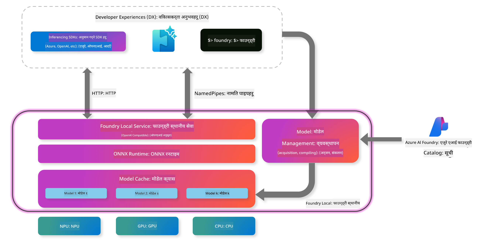
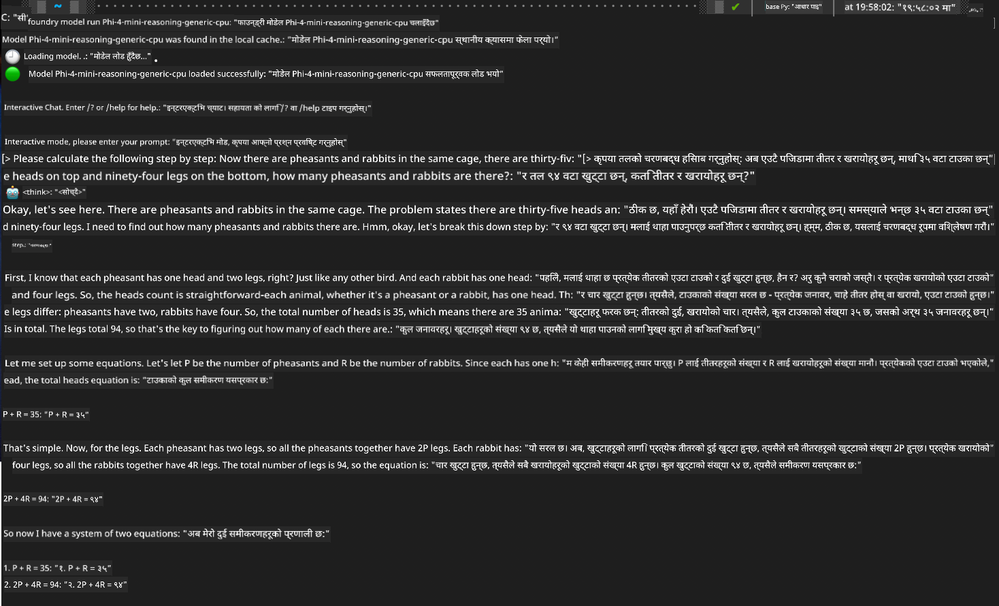

<!--
CO_OP_TRANSLATOR_METADATA:
{
  "original_hash": "52973a5680a65a810aa80b7036afd31f",
  "translation_date": "2025-07-16T19:45:09+00:00",
  "source_file": "md/01.Introduction/02/07.FoundryLocal.md",
  "language_code": "ne"
}
-->
## Foundry Local मा Phi-Family मोडेलहरूसँग सुरु गर्ने तरिका

### Foundry Local को परिचय

Foundry Local एक शक्तिशाली अन-डिभाइस AI इन्फरेन्स समाधान हो जसले एंटरप्राइज-ग्रेड AI क्षमताहरू तपाईंको स्थानीय हार्डवेयरमा सिधै ल्याउँछ। यो ट्युटोरियलले तपाईंलाई Foundry Local सँग Phi-Family मोडेलहरू सेटअप र प्रयोग गर्ने तरिका सिकाउनेछ, जसले तपाईंलाई तपाईंको AI कार्यभारहरूमा पूर्ण नियन्त्रण दिन्छ, गोपनीयता कायम राख्दै र लागत घटाउँदै।

Foundry Local ले तपाईंको उपकरणमा AI मोडेलहरू स्थानीय रूपमा चलाएर प्रदर्शन, गोपनीयता, अनुकूलन र लागतमा फाइदा दिन्छ। यो सहज CLI, SDK, र REST API मार्फत तपाईंको वर्तमान कार्यप्रवाह र अनुप्रयोगहरूसँग सहज रूपमा एकीकृत हुन्छ।




### किन Foundry Local रोज्ने?

Foundry Local का फाइदाहरू बुझ्नाले तपाईंलाई AI परिनियोजन रणनीतिमा सूचित निर्णय लिन मद्दत गर्नेछ:

- **अन-डिभाइस इन्फरेन्स:** मोडेलहरू तपाईंको आफ्नै हार्डवेयरमा स्थानीय रूपमा चलाउनुहोस्, जसले लागत घटाउँछ र तपाईंको सबै डेटा तपाईंको उपकरणमै रहन्छ।

- **मोडेल अनुकूलन:** पूर्वनिर्धारित मोडेलहरूबाट छनोट गर्नुहोस् वा आफ्नै मोडेल प्रयोग गरेर विशेष आवश्यकताहरू र प्रयोग केसहरू पूरा गर्नुहोस्।

- **लागत-कुशलता:** तपाईंको विद्यमान हार्डवेयर प्रयोग गरेर पुनरावृत्ति हुने क्लाउड सेवा लागतहरू हटाउनुहोस्, जसले AI लाई अझ पहुँचयोग्य बनाउँछ।

- **सहज एकीकरण:** SDK, API अन्तबिन्दुहरू, वा CLI मार्फत तपाईंका अनुप्रयोगहरूसँग जडान गर्नुहोस्, र आवश्यकताअनुसार Azure AI Foundry मा सजिलै स्केल गर्नुहोस्।

> **सुरु गर्ने नोट:** यो ट्युटोरियल Foundry Local लाई CLI र SDK इन्टरफेसहरू मार्फत प्रयोग गर्नेमा केन्द्रित छ। तपाईं दुबै तरिका सिक्नुहुनेछ जसले तपाईंलाई तपाईंको प्रयोग केसका लागि उत्तम विधि छनोट गर्न मद्दत गर्नेछ।

## भाग १: Foundry Local CLI सेटअप गर्ने

### चरण १: स्थापना

Foundry Local CLI तपाईंको स्थानीय रूपमा AI मोडेलहरू व्यवस्थापन र चलाउने प्रवेशद्वार हो। आउनुहोस्, यसलाई तपाईंको प्रणालीमा स्थापना गरेर सुरु गरौं।

**समर्थित प्लेटफर्महरू:** Windows र macOS

विस्तृत स्थापना निर्देशनहरूको लागि कृपया [आधिकारिक Foundry Local कागजात](https://github.com/microsoft/Foundry-Local/blob/main/README.md) हेर्नुहोस्।

### चरण २: उपलब्ध मोडेलहरू अन्वेषण गर्ने

Foundry Local CLI स्थापना गरेपछि, तपाईं आफ्नो प्रयोग केसका लागि उपलब्ध मोडेलहरू पत्ता लगाउन सक्नुहुन्छ। यो कमाण्डले तपाईंलाई सबै समर्थित मोडेलहरू देखाउनेछ:


```bash
foundry model list
```

### चरण ३: Phi Family मोडेलहरू बुझ्ने

Phi Family ले विभिन्न प्रयोग केस र हार्डवेयर कन्फिगरेसनहरूका लागि अनुकूलित मोडेलहरूको दायरा प्रदान गर्दछ। Foundry Local मा उपलब्ध Phi मोडेलहरू यस्ता छन्:

**उपलब्ध Phi मोडेलहरू:** 

- **phi-3.5-mini** - आधारभूत कार्यहरूको लागि सानो मोडेल
- **phi-3-mini-128k** - लामो संवादका लागि विस्तारित सन्दर्भ संस्करण
- **phi-3-mini-4k** - सामान्य प्रयोगका लागि मानक सन्दर्भ मोडेल
- **phi-4** - सुधारिएको क्षमतासहित उन्नत मोडेल
- **phi-4-mini** - Phi-4 को हल्का संस्करण
- **phi-4-mini-reasoning** - जटिल तर्क कार्यहरूको लागि विशेष मोडेल

> **हार्डवेयर अनुकूलता:** प्रत्येक मोडेल तपाईंको प्रणाली क्षमताअनुसार विभिन्न हार्डवेयर एक्सेलेरेसन (CPU, GPU) का लागि कन्फिगर गर्न सकिन्छ।

### चरण ४: तपाईंको पहिलो Phi मोडेल चलाउने

अब व्यावहारिक उदाहरणबाट सुरु गरौं। हामी `phi-4-mini-reasoning` मोडेल चलाउनेछौं, जुन जटिल समस्याहरूलाई चरणबद्ध रूपमा समाधान गर्न सक्षम छ।


**मोडेल चलाउने कमाण्ड:**

```bash
foundry model run Phi-4-mini-reasoning-generic-cpu
```

> **पहिलो पटक सेटअप:** मोडेल पहिलो पटक चलाउँदा, Foundry Local ले यसलाई स्वचालित रूपमा तपाईंको स्थानीय उपकरणमा डाउनलोड गर्नेछ। डाउनलोड समय तपाईंको नेटवर्क गति अनुसार फरक पर्न सक्छ, त्यसैले प्रारम्भिक सेटअपको क्रममा धैर्य गर्नुहोस्।

### चरण ५: वास्तविक समस्यासँग मोडेल परीक्षण गर्ने

अब हामी हाम्रो मोडेललाई एक क्लासिक तर्क समस्यासँग परीक्षण गरौं र हेर्नुहोस् यो कसरी चरणबद्ध तर्क गर्छ:

**उदाहरण समस्या:**

```txt
Please calculate the following step by step: Now there are pheasants and rabbits in the same cage, there are thirty-five heads on top and ninety-four legs on the bottom, how many pheasants and rabbits are there?
```

**अपेक्षित व्यवहार:** मोडेलले यो समस्या तार्किक चरणहरूमा विभाजन गर्नुपर्छ, pheasants का २ खुट्टा र rabbits का ४ खुट्टा हुने तथ्य प्रयोग गरेर समीकरणहरूको प्रणाली समाधान गर्न।

**परिणामहरू:**



## भाग २: Foundry Local SDK सँग अनुप्रयोगहरू बनाउने

### SDK किन प्रयोग गर्ने?

CLI परीक्षण र छिटो अन्तरक्रियाका लागि उपयुक्त भए पनि, SDK ले Foundry Local लाई तपाईंका अनुप्रयोगहरूमा प्रोग्रामिङ्गमार्फत एकीकृत गर्न सक्षम बनाउँछ। यसले निम्न सम्भावनाहरू खोल्छ:

- अनुकूलित AI-संचालित अनुप्रयोगहरू निर्माण गर्ने
- स्वचालित कार्यप्रवाहहरू सिर्जना गर्ने
- विद्यमान प्रणालीहरूमा AI क्षमताहरू एकीकृत गर्ने
- च्याटबोट र अन्तरक्रियात्मक उपकरणहरू विकास गर्ने

### समर्थित प्रोग्रामिङ भाषाहरू

Foundry Local ले तपाईंको विकास प्राथमिकताहरू अनुसार विभिन्न प्रोग्रामिङ भाषाहरूका लागि SDK समर्थन प्रदान गर्दछ:

**📦 उपलब्ध SDK हरू:**

- **C# (.NET):** [SDK कागजात र उदाहरणहरू](https://github.com/microsoft/Foundry-Local/tree/main/sdk/cs)
- **Python:** [SDK कागजात र उदाहरणहरू](https://github.com/microsoft/Foundry-Local/tree/main/sdk/python)
- **JavaScript:** [SDK कागजात र उदाहरणहरू](https://github.com/microsoft/Foundry-Local/tree/main/sdk/js)
- **Rust:** [SDK कागजात र उदाहरणहरू](https://github.com/microsoft/Foundry-Local/tree/main/sdk/rust)

### आगामी कदमहरू

1. तपाईंको विकास वातावरण अनुसार मनपर्ने SDK छान्नुहोस्
2. विस्तृत कार्यान्वयन मार्गनिर्देशनका लागि SDK-विशिष्ट कागजातहरू पालना गर्नुहोस्
3. जटिल अनुप्रयोगहरू निर्माण गर्नु अघि सरल उदाहरणहरूबाट सुरु गर्नुहोस्
4. प्रत्येक SDK रिपोजिटरीमा उपलब्ध नमूना कोड अन्वेषण गर्नुहोस्

## निष्कर्ष

अब तपाईंले सिक्नुभयो:
- ✅ Foundry Local CLI कसरी स्थापना र सेटअप गर्ने
- ✅ Phi Family मोडेलहरू कसरी पत्ता लगाउने र चलाउने
- ✅ वास्तविक समस्याहरूका साथ मोडेलहरू परीक्षण गर्ने
- ✅ अनुप्रयोग विकासका लागि SDK विकल्पहरू बुझ्ने

Foundry Local ले AI क्षमताहरूलाई सिधै तपाईंको स्थानीय वातावरणमा ल्याउन एक शक्तिशाली आधार प्रदान गर्दछ, जसले प्रदर्शन, गोपनीयता, र लागतमा नियन्त्रण दिन्छ र आवश्यक पर्दा क्लाउड समाधानहरूमा स्केल गर्ने लचिलोपन पनि राख्दछ।

**अस्वीकरण**:  
यो दस्तावेज AI अनुवाद सेवा [Co-op Translator](https://github.com/Azure/co-op-translator) प्रयोग गरी अनुवाद गरिएको हो। हामी शुद्धताका लागि प्रयासरत छौं, तर कृपया ध्यान दिनुहोस् कि स्वचालित अनुवादमा त्रुटि वा अशुद्धता हुनसक्छ। मूल दस्तावेज यसको मूल भाषामा नै अधिकारिक स्रोत मानिनुपर्छ। महत्वपूर्ण जानकारीका लागि व्यावसायिक मानव अनुवाद सिफारिस गरिन्छ। यस अनुवादको प्रयोगबाट उत्पन्न कुनै पनि गलतफहमी वा गलत व्याख्याका लागि हामी जिम्मेवार छैनौं।