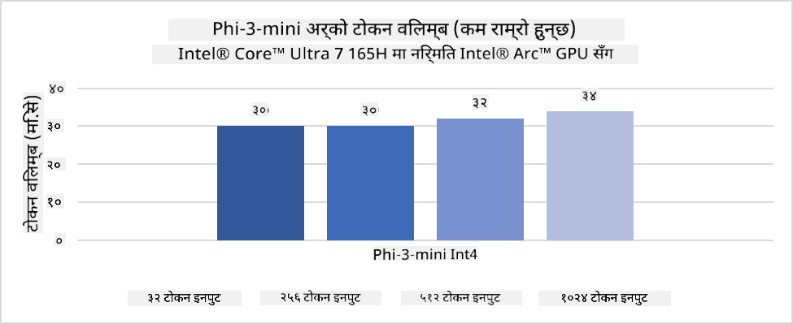
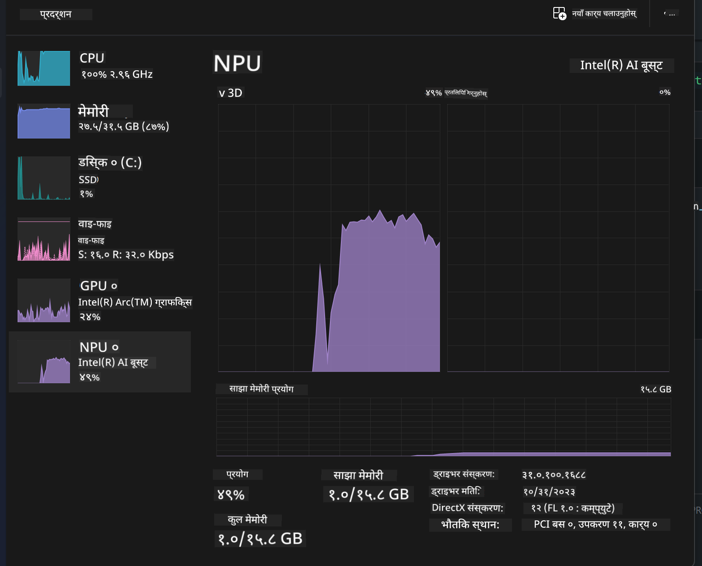
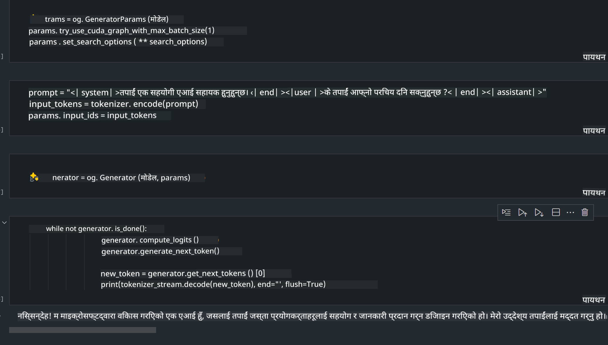
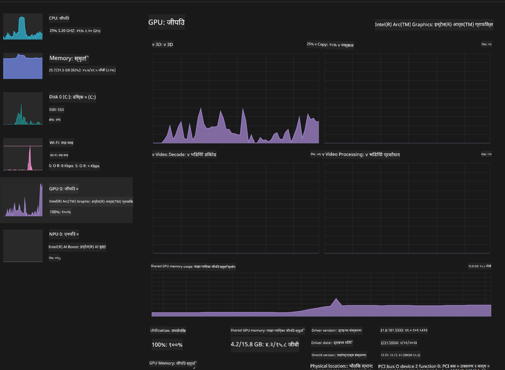

<!--
CO_OP_TRANSLATOR_METADATA:
{
  "original_hash": "e08ce816e23ad813244a09ca34ebb8ac",
  "translation_date": "2025-05-09T10:08:40+00:00",
  "source_file": "md/01.Introduction/03/AIPC_Inference.md",
  "language_code": "ne"
}
-->
# **AI PC मा Phi-3 को inference**

जनरेटिभ AI को प्रगतिसँगै र edge device हार्डवेयर क्षमताहरूमा सुधार हुँदै, धेरै जनरेटिभ AI मोडेलहरू अब प्रयोगकर्ताका Bring Your Own Device (BYOD) उपकरणहरूमा समाहित गर्न सकिन्छ। AI PC हरू ती मोडेलहरू मध्ये एक हुन्। 2024 देखि Intel, AMD, र Qualcomm ले PC निर्माताहरूसँग मिलेर हार्डवेयर परिवर्तनमार्फत स्थानीय जनरेटिभ AI मोडेलहरूको तैनाथी सजिलो बनाउने AI PC हरू प्रस्तुत गरेका छन्। यस छलफलमा, हामी Intel AI PC मा Phi-3 कसरी तैनाथ गर्ने भन्नेमा केन्द्रित हुनेछौं।

### NPU के हो

NPU (Neural Processing Unit) एउटा समर्पित प्रोसेसर वा ठूलो SoC भित्रको प्रोसेसिंग युनिट हो, जुन neural network अपरेसन र AI कार्यहरू छिटो गर्ने उद्देश्यले डिजाइन गरिएको हुन्छ। सामान्य CPU र GPU हरूको विपरीत, NPU हरू डेटा-केन्द्रित समानान्तर कम्प्युटिङका लागि अनुकूलित हुन्छन्, जसले भिडियो र छविहरू जस्ता विशाल मल्टिमिडिया डेटा छिटो प्रशोधन गर्न सक्षम बनाउँछ। यी विशेष गरी AI सम्बन्धी कार्यहरू जस्तै भाषण पहिचान, भिडियो कलमा पृष्ठभूमि धुंधलाउने, र वस्तु पहिचानजस्ता फोटो वा भिडियो सम्पादन प्रक्रियाहरूमा दक्ष हुन्छन्।

## NPU vs GPU

धेरै AI र मेसिन लर्निङ कार्यहरू GPU मा चल्ने भए पनि, GPU र NPU बीच महत्वपूर्ण भिन्नता छ।  
GPU हरू समानान्तर कम्प्युटिङका लागि परिचित छन्, तर सबै GPU हरू ग्राफिक्स बाहेकका काममा समान दक्ष हुँदैनन्। NPU हरू neural network अपरेसनमा समावेश जटिल गणनाहरूका लागि विशेष रूपमा बनाइएका हुन्छन्, जसले तिनीहरूलाई AI कार्यहरूमा धेरै प्रभावकारी बनाउँछ।

सारांशमा, NPU हरू AI गणनाहरूलाई तीव्रता दिने गणितका माहिरहरू हुन् र AI PC को उदयमान युगमा महत्वपूर्ण भूमिका खेल्छन्!

***यो उदाहरण Intel को नवीनतम Intel Core Ultra Processor मा आधारित छ***

## **1. Phi-3 मोडेल चलाउन NPU प्रयोग गर्ने**

Intel® NPU उपकरण Intel client CPU हरूसँग एकीकृत AI inference accelerator हो, जुन Intel® Core™ Ultra CPU पुस्तादेखि (पूर्वमा Meteor Lake भनेर चिनिन्थ्यो) उपलब्ध छ। यसले कृत्रिम neural network कार्यहरू ऊर्जा-कुशल तरिकाले सञ्चालन गर्न सक्षम बनाउँछ।




**Intel NPU Acceleration Library**

Intel NPU Acceleration Library [https://github.com/intel/intel-npu-acceleration-library](https://github.com/intel/intel-npu-acceleration-library) एक Python लाइब्रेरी हो जसले Intel Neural Processing Unit (NPU) को शक्ति उपयोग गरेर तपाईंका अनुप्रयोगहरूको दक्षता बढाउन डिजाइन गरिएको हो।

Intel® Core™ Ultra प्रोसेसरले चलाउने AI PC मा Phi-3-mini को उदाहरण।


Python लाइब्रेरी pip मार्फत इन्स्टल गर्नुहोस्

```bash

   pip install intel-npu-acceleration-library

```

***Note*** परियोजना अझै विकासाधीन छ, तर सन्दर्भ मोडेल पहिले नै धेरै पूर्ण छ।

### **Intel NPU Acceleration Library सँग Phi-3 चलाउने तरिका**

Intel NPU acceleration प्रयोग गर्दा, यसले पारम्परिक encoding प्रक्रियामा असर पार्दैन। तपाईंलाई केवल यो लाइब्रेरी प्रयोग गरेर मूल Phi-3 मोडेललाई quantize गर्नुपर्ने हुन्छ, जस्तै FP16, INT8, INT4 आदि।

```python
from transformers import AutoTokenizer, pipeline,TextStreamer
from intel_npu_acceleration_library import NPUModelForCausalLM, int4
from intel_npu_acceleration_library.compiler import CompilerConfig
import warnings

model_id = "microsoft/Phi-3-mini-4k-instruct"

compiler_conf = CompilerConfig(dtype=int4)
model = NPUModelForCausalLM.from_pretrained(
    model_id, use_cache=True, config=compiler_conf, attn_implementation="sdpa"
).eval()

tokenizer = AutoTokenizer.from_pretrained(model_id)

text_streamer = TextStreamer(tokenizer, skip_prompt=True)
```

Quantization सफल भएपछि, NPU कल गरेर Phi-3 मोडेल चलाउन जारी राख्नुहोस्।

```python
generation_args = {
   "max_new_tokens": 1024,
   "return_full_text": False,
   "temperature": 0.3,
   "do_sample": False,
   "streamer": text_streamer,
}

pipe = pipeline(
   "text-generation",
   model=model,
   tokenizer=tokenizer,
)

query = "<|system|>You are a helpful AI assistant.<|end|><|user|>Can you introduce yourself?<|end|><|assistant|>"

with warnings.catch_warnings():
    warnings.simplefilter("ignore")
    pipe(query, **generation_args)
```

कोड चलाउँदा, हामी Task Manager बाट NPU को चलिरहेको स्थिति हेर्न सक्छौं।



***Samples*** : [AIPC_NPU_DEMO.ipynb](../../../../../code/03.Inference/AIPC/AIPC_NPU_DEMO.ipynb)

## **2. DirectML + ONNX Runtime प्रयोग गरेर Phi-3 मोडेल चलाउने**

### **DirectML के हो**

[DirectML](https://github.com/microsoft/DirectML) एक उच्च प्रदर्शन, हार्डवेयर-त्वरित DirectX 12 लाइब्रेरी हो जुन मेसिन लर्निङका लागि डिजाइन गरिएको हो। DirectML ले AMD, Intel, NVIDIA, Qualcomm जस्ता विभिन्न GPU सपोर्ट गर्ने हार्डवेयर र ड्राइभरहरूमा सामान्य मेसिन लर्निङ कार्यहरूका लागि GPU acceleration प्रदान गर्छ।

स्वतन्त्र रूपमा प्रयोग गर्दा, DirectML API एक कम-स्तरको DirectX 12 लाइब्रेरी हो र यो उच्च प्रदर्शन, कम विलम्बता भएका अनुप्रयोगहरू (जस्तै फ्रेमवर्क, खेलहरू, र अन्य रियल-टाइम एप्लिकेसनहरू) का लागि उपयुक्त छ। DirectML को Direct3D 12 सँग सहज अन्तरक्रियाशीलता, कम ओभरहेड, र हार्डवेयरमा विश्वसनीयता यसलाई मेसिन लर्निङ छिटो गर्न आदर्श बनाउँछ।

***Note*** : नवीनतम DirectML ले NPU समर्थन पनि गरिसकेको छ (https://devblogs.microsoft.com/directx/introducing-neural-processor-unit-npu-support-in-directml-developer-preview/)

### DirectML र CUDA को क्षमताहरू र प्रदर्शनमा तुलना:

**DirectML** Microsoft द्वारा विकास गरिएको मेसिन लर्निङ लाइब्रेरी हो। यो Windows उपकरणहरूमा मेसिन लर्निङ कार्यहरू छिटो पार्न डिजाइन गरिएको हो, जसमा डेस्कटप, ल्यापटप, र edge उपकरणहरू समावेश छन्।  
- DX12 आधारित: DirectML DirectX 12 मा आधारित छ, जसले NVIDIA र AMD दुबै GPU हरूमा व्यापक हार्डवेयर समर्थन प्रदान गर्छ।  
- व्यापक समर्थन: DX12 को उपयोगले गर्दा DirectML कुनै पनि DX12 समर्थित GPU मा काम गर्न सक्छ, यहाँसम्म कि इंटिग्रेटेड GPU हरूमा पनि।  
- छवि प्रशोधन: DirectML ले neural network प्रयोग गरेर छवि र अन्य डेटा प्रशोधन गर्छ, जसले छवि पहिचान, वस्तु पहिचान जस्ता कार्यहरूका लागि उपयुक्त बनाउँछ।  
- सजिलो सेटअप: DirectML सेटअप सजिलो छ र GPU निर्माता द्वारा विशेष SDK वा लाइब्रेरी आवश्यक पर्दैन।  
- प्रदर्शन: केही अवस्थामा, DirectML राम्रो प्रदर्शन गर्छ र CUDA भन्दा छिटो पनि हुन सक्छ, विशेष गरी केही workload हरूमा।  
- सीमितता: तर, केही अवस्थामा DirectML कम प्रदर्शन गर्न सक्छ, विशेष गरी float16 ठूला ब्याच साइजहरूमा।

**CUDA** NVIDIA को parallel computing प्लेटफर्म र प्रोग्रामिङ मोडेल हो। यसले विकासकर्ताहरूलाई NVIDIA GPU हरूको शक्ति प्रयोग गरेर सामान्य उद्देश्यको कम्प्युटिङ, मेसिन लर्निङ र वैज्ञानिक सिमुलेसन गर्न अनुमति दिन्छ।  
- NVIDIA-विशेष: CUDA NVIDIA GPU हरूसँग कडा रूपमा एकीकृत छ र विशेष गरी तिनीहरूको लागि डिजाइन गरिएको हो।  
- अत्यधिक अनुकूलित: GPU-त्वरित कार्यहरूका लागि उत्कृष्ट प्रदर्शन प्रदान गर्छ, विशेष गरी NVIDIA GPU हरूमा।  
- व्यापक प्रयोग: धेरै मेसिन लर्निङ फ्रेमवर्क र लाइब्रेरीहरूले CUDA समर्थन गर्छन् (जस्तै TensorFlow र PyTorch)।  
- अनुकूलन: विकासकर्ताले CUDA सेटिङहरू विशिष्ट कार्यहरूका लागि अनुकूलन गर्न सक्छन्, जसले उत्कृष्ट प्रदर्शन ल्याउँछ।  
- सीमितता: तर CUDA को निर्भरता NVIDIA हार्डवेयरमा हुनुले विभिन्न GPU हरूमा व्यापक अनुकूलता चाहिने अवस्थामा सीमितता ल्याउन सक्छ।

### DirectML र CUDA बीच छनोट

DirectML र CUDA बीच छनोट तपाईंको विशेष प्रयोग केस, हार्डवेयर उपलब्धता, र प्राथमिकतामा निर्भर गर्दछ।  
यदि तपाईं व्यापक अनुकूलता र सजिलो सेटअप चाहनुहुन्छ भने DirectML राम्रो विकल्प हुन सक्छ। तर NVIDIA GPU छ भने र अत्यधिक अनुकूलित प्रदर्शन चाहिन्छ भने CUDA अझै बलियो विकल्प हो।  
सारांशमा, DirectML र CUDA दुवैका आफ्ना फाइदा र कमजोरी छन्, त्यसैले तपाईंको आवश्यकताअनुसार र उपलब्ध हार्डवेयर अनुसार निर्णय गर्नुहोस्।

### **ONNX Runtime सँग जनरेटिभ AI**

AI को युगमा, AI मोडेलहरूको पोर्टेबिलिटी धेरै महत्वपूर्ण छ। ONNX Runtime ले सजिलै प्रशिक्षित मोडेलहरूलाई विभिन्न उपकरणहरूमा तैनाथ गर्न सक्छ। विकासकर्ताहरूलाई inference framework को चिन्ता नगरी एउटै API प्रयोग गरेर मोडेल inference गर्न सकिन्छ। जनरेटिभ AI को युगमा, ONNX Runtime ले पनि कोड अनुकूलन गरेको छ (https://onnxruntime.ai/docs/genai/). अनुकूलित ONNX Runtime मार्फत, quantized जनरेटिभ AI मोडेलहरू विभिन्न टर्मिनलहरूमा inference गर्न सकिन्छ। ONNX Runtime सँग जनरेटिभ AI मा, तपाईं Python, C#, C/C++ मार्फत AI मोडेल API प्रयोग गर्न सक्नुहुन्छ। पक्कै पनि, iPhone मा तैनाथ गर्दा C++ को Generative AI with ONNX Runtime API को फाइदा लिन सकिन्छ।

[Sample Code](https://github.com/Azure-Samples/Phi-3MiniSamples/tree/main/onnx)

***ONNX Runtime लाइब्रेरी कम्पाइल गर्ने***

```bash

winget install --id=Kitware.CMake  -e

git clone https://github.com/microsoft/onnxruntime.git

cd .\onnxruntime\

./build.bat --build_shared_lib --skip_tests --parallel --use_dml --config Release

cd ../

git clone https://github.com/microsoft/onnxruntime-genai.git

cd .\onnxruntime-genai\

mkdir ort

cd ort

mkdir include

mkdir lib

copy ..\onnxruntime\include\onnxruntime\core\providers\dml\dml_provider_factory.h ort\include

copy ..\onnxruntime\include\onnxruntime\core\session\onnxruntime_c_api.h ort\include

copy ..\onnxruntime\build\Windows\Release\Release\*.dll ort\lib

copy ..\onnxruntime\build\Windows\Release\Release\onnxruntime.lib ort\lib

python build.py --use_dml


```

**लाइब्रेरी इन्स्टल गर्ने**

```bash

pip install .\onnxruntime_genai_directml-0.3.0.dev0-cp310-cp310-win_amd64.whl

```

यो चलिरहेको परिणाम हो



***Samples*** : [AIPC_DirectML_DEMO.ipynb](../../../../../code/03.Inference/AIPC/AIPC_DirectML_DEMO.ipynb)

## **3. Intel OpenVino प्रयोग गरेर Phi-3 मोडेल चलाउने**

### **OpenVINO के हो**

[OpenVINO](https://github.com/openvinotoolkit/openvino) एक open-source टूलकिट हो जुन deep learning मोडेलहरूको अनुकूलन र तैनाथीका लागि बनाइएको हो। यसले TensorFlow, PyTorch जस्ता लोकप्रिय फ्रेमवर्कका vision, audio, र language मोडेलहरूको deep learning प्रदर्शन बढाउँछ। OpenVINO सँग CPU र GPU सँग मिलेर Phi-3 मोडेल चलाउन पनि सकिन्छ।

***Note***: हाल OpenVINO ले NPU समर्थन गर्दैन।

### **OpenVINO लाइब्रेरी इन्स्टल गर्ने**

```bash

 pip install git+https://github.com/huggingface/optimum-intel.git

 pip install git+https://github.com/openvinotoolkit/nncf.git

 pip install openvino-nightly

```

### **OpenVINO सँग Phi-3 चलाउने**

NPU जस्तै, OpenVINO ले quantized मोडेल चलाएर जनरेटिभ AI मोडेलहरू सञ्चालन गर्छ। हामीले पहिले Phi-3 मोडेल quantize गर्नुपर्छ र optimum-cli मार्फत कमाण्ड लाइनमा मोडेल quantization पूरा गर्नुपर्छ।

**INT4**

```bash

optimum-cli export openvino --model "microsoft/Phi-3-mini-4k-instruct" --task text-generation-with-past --weight-format int4 --group-size 128 --ratio 0.6  --sym  --trust-remote-code ./openvinomodel/phi3/int4

```

**FP16**

```bash

optimum-cli export openvino --model "microsoft/Phi-3-mini-4k-instruct" --task text-generation-with-past --weight-format fp16 --trust-remote-code ./openvinomodel/phi3/fp16

```

यो रूपान्तरण गरिएको ढाँचा यसरी देखिन्छ


मोडेल पथहरू (model_dir), सम्बन्धित कन्फिगरेसनहरू (ov_config = {"PERFORMANCE_HINT": "LATENCY", "NUM_STREAMS": "1", "CACHE_DIR": ""}), र हार्डवेयर-त्वरित उपकरणहरू (GPU.0) OVModelForCausalLM मार्फत लोड गर्नुहोस्।

```python

ov_model = OVModelForCausalLM.from_pretrained(
     model_dir,
     device='GPU.0',
     ov_config=ov_config,
     config=AutoConfig.from_pretrained(model_dir, trust_remote_code=True),
     trust_remote_code=True,
)

```

कोड चलाउँदा, हामी Task Manager बाट GPU को चलिरहेको स्थिति हेर्न सक्छौं।



***Samples*** : [AIPC_OpenVino_Demo.ipynb](../../../../../code/03.Inference/AIPC/AIPC_OpenVino_Demo.ipynb)

### ***Note*** : माथि उल्लिखित तीन विधिहरूको आफ्नै फाइदा छन्, तर AI PC inference को लागि NPU acceleration प्रयोग गर्ने सल्लाह दिइन्छ।

**अस्वीकरण**:  
यो दस्तावेज AI अनुवाद सेवा [Co-op Translator](https://github.com/Azure/co-op-translator) प्रयोग गरी अनुवाद गरिएको हो। हामी शुद्धताका लागि प्रयासरत छौं, तर कृपया जानकार हुनुहोस् कि स्वचालित अनुवादमा त्रुटि वा असंगतिहरू हुन सक्छन्। मूल दस्तावेज यसको मूल भाषामा आधिकारिक स्रोत मानिनु पर्छ। महत्वपूर्ण जानकारीका लागि व्यावसायिक मानव अनुवाद सिफारिस गरिन्छ। यस अनुवादको प्रयोगबाट उत्पन्न कुनै पनि गलत बुझाइ वा गलत व्याख्याका लागि हामी जिम्मेवार छैनौं।