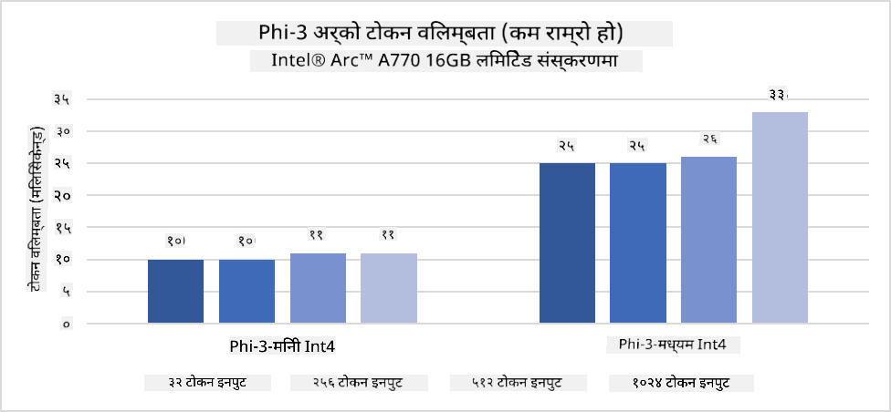

<!--
CO_OP_TRANSLATOR_METADATA:
{
  "original_hash": "e08ce816e23ad813244a09ca34ebb8ac",
  "translation_date": "2025-07-16T19:58:44+00:00",
  "source_file": "md/01.Introduction/03/AIPC_Inference.md",
  "language_code": "ne"
}
-->
# **AI PC मा Inference Phi-3**

जनरेटिभ AI को प्रगतिसँगै र एज डिभाइस हार्डवेयर क्षमताहरूको सुधारसँग, बढ्दो संख्यामा जनरेटिभ AI मोडेलहरू प्रयोगकर्ताहरूको Bring Your Own Device (BYOD) उपकरणहरूमा समावेश गर्न सकिन्छ। AI PC हरू यी मोडेलहरू मध्ये एक हुन्। २०२४ देखि, Intel, AMD, र Qualcomm ले PC निर्माताहरूसँग सहकार्य गरेर AI PC हरू प्रस्तुत गरेका छन् जसले हार्डवेयर परिमार्जनमार्फत स्थानीय जनरेटिभ AI मोडेलहरूको तैनातीलाई सहज बनाउँछन्। यस छलफलमा, हामी Intel AI PC मा Phi-3 कसरी तैनात गर्ने भन्नेमा केन्द्रित हुनेछौं।

### NPU के हो

NPU (Neural Processing Unit) ठूलो SoC मा समावेश गरिएको समर्पित प्रोसेसर वा प्रोसेसिंग युनिट हो जुन विशेष गरी न्यूरल नेटवर्क अपरेसन र AI कार्यहरू छिटो गर्न डिजाइन गरिएको हुन्छ। सामान्य CPU र GPU भन्दा फरक, NPU हरू डेटा-आधारित समानान्तर कम्प्युटिङका लागि अनुकूलित हुन्छन्, जसले तिनीहरूलाई भिडियो र छविहरू जस्ता ठूलो मल्टिमिडिया डाटालाई छिटो प्रशोधन गर्न सक्षम बनाउँछ र न्यूरल नेटवर्कका लागि डाटा प्रशोधनमा दक्ष बनाउँछ। तिनीहरू विशेष गरी AI सम्बन्धित कार्यहरूमा, जस्तै भाषण पहिचान, भिडियो कलमा पृष्ठभूमि धुंधलाउने, र फोटो वा भिडियो सम्पादन प्रक्रियाहरू जस्तै वस्तु पहिचानमा दक्ष हुन्छन्।

## NPU र GPU को तुलना

धेरै AI र मेशिन लर्निङ कार्यहरू GPU मा चल्ने भए पनि, GPU र NPU बीच महत्वपूर्ण भिन्नता छ।  
GPU हरू समानान्तर कम्प्युटिङ क्षमताका लागि परिचित छन्, तर सबै GPU हरू ग्राफिक्स बाहेकका कार्यहरूमा समान दक्ष हुँदैनन्। NPU हरू न्यूरल नेटवर्क अपरेसनमा आवश्यक जटिल गणनाहरूका लागि विशेष रूपमा बनाइएका हुन्छन्, जसले तिनीहरूलाई AI कार्यहरूमा अत्यन्त प्रभावकारी बनाउँछ।

सारांशमा, NPU हरू गणितका विशेषज्ञ हुन् जसले AI गणनाहरूलाई तीव्र बनाउँछन् र AI PC को उदयमा महत्वपूर्ण भूमिका खेल्छन्!

***यो उदाहरण Intel को नवीनतम Intel Core Ultra Processor मा आधारित छ***

## **१. Phi-3 मोडेल चलाउन NPU प्रयोग गर्ने**

Intel® NPU डिभाइस Intel क्लाइन्ट CPU हरूसँग एकीकृत AI inference एक्सेलेरेटर हो, जुन Intel® Core™ Ultra CPU पुस्तादेखि (पहिले Meteor Lake भनेर चिनिन्थ्यो) उपलब्ध छ। यसले कृत्रिम न्यूरल नेटवर्क कार्यहरूको ऊर्जा-कुशल कार्यान्वयन सक्षम बनाउँछ।




**Intel NPU Acceleration Library**

Intel NPU Acceleration Library [https://github.com/intel/intel-npu-acceleration-library](https://github.com/intel/intel-npu-acceleration-library) एक Python लाइब्रेरी हो जसले Intel Neural Processing Unit (NPU) को शक्ति प्रयोग गरेर तपाईंका अनुप्रयोगहरूको दक्षता बढाउन डिजाइन गरिएको हो।

Intel® Core™ Ultra प्रोसेसरद्वारा सञ्चालित AI PC मा Phi-3-mini को उदाहरण।


Python लाइब्रेरी pip मार्फत इन्स्टल गर्नुहोस्

```bash

   pip install intel-npu-acceleration-library

```

***Note*** परियोजना अझै विकासको क्रममा छ, तर सन्दर्भ मोडेल पहिले नै धेरै पूर्ण छ।

### **Intel NPU Acceleration Library सँग Phi-3 चलाउने**

Intel NPU एक्सेलेरेशन प्रयोग गर्दा, यो लाइब्रेरीले परम्परागत इन्कोडिङ प्रक्रियामा असर गर्दैन। तपाईंले केवल यो लाइब्रेरी प्रयोग गरेर मूल Phi-3 मोडेललाई क्वान्टाइज गर्नुपर्छ, जस्तै FP16, INT8, INT4, जस्ता

```python
from transformers import AutoTokenizer, pipeline,TextStreamer
from intel_npu_acceleration_library import NPUModelForCausalLM, int4
from intel_npu_acceleration_library.compiler import CompilerConfig
import warnings

model_id = "microsoft/Phi-3-mini-4k-instruct"

compiler_conf = CompilerConfig(dtype=int4)
model = NPUModelForCausalLM.from_pretrained(
    model_id, use_cache=True, config=compiler_conf, attn_implementation="sdpa"
).eval()

tokenizer = AutoTokenizer.from_pretrained(model_id)

text_streamer = TextStreamer(tokenizer, skip_prompt=True)
```

क्वान्टिफिकेसन सफल भएपछि, NPU लाई कल गरेर Phi-3 मोडेल चलाउन जारी राख्नुहोस्।

```python
generation_args = {
   "max_new_tokens": 1024,
   "return_full_text": False,
   "temperature": 0.3,
   "do_sample": False,
   "streamer": text_streamer,
}

pipe = pipeline(
   "text-generation",
   model=model,
   tokenizer=tokenizer,
)

query = "<|system|>You are a helpful AI assistant.<|end|><|user|>Can you introduce yourself?<|end|><|assistant|>"

with warnings.catch_warnings():
    warnings.simplefilter("ignore")
    pipe(query, **generation_args)
```

कोड चलाउँदा, हामी Task Manager मार्फत NPU को चलिरहेको स्थिति हेर्न सक्छौं।


***Samples*** : [AIPC_NPU_DEMO.ipynb](../../../../../code/03.Inference/AIPC/AIPC_NPU_DEMO.ipynb)

## **२. Phi-3 मोडेल चलाउन DirectML + ONNX Runtime प्रयोग गर्ने**

### **DirectML के हो**

[DirectML](https://github.com/microsoft/DirectML) एक उच्च प्रदर्शन, हार्डवेयर-एक्सेलेरेटेड DirectX 12 लाइब्रेरी हो जुन मेशिन लर्निङका लागि बनाइएको हो। DirectML ले AMD, Intel, NVIDIA, र Qualcomm जस्ता विक्रेता द्वारा समर्थित सबै DirectX 12 सक्षम GPU हरूमा सामान्य मेशिन लर्निङ कार्यहरूको GPU एक्सेलेरेशन प्रदान गर्दछ।

स्वतन्त्र रूपमा प्रयोग गर्दा, DirectML API एक कम-स्तरीय DirectX 12 लाइब्रेरी हो र उच्च प्रदर्शन, कम विलम्बता भएका अनुप्रयोगहरू जस्तै फ्रेमवर्क, खेलहरू, र अन्य वास्तविक-समय अनुप्रयोगहरूका लागि उपयुक्त छ। DirectML को Direct3D 12 सँग सहज अन्तरक्रियाशीलता, कम ओभरहेड, र हार्डवेयरमा समानता यसलाई मेशिन लर्निङ छिटो बनाउन आदर्श बनाउँछ, जहाँ उच्च प्रदर्शन र हार्डवेयरमा परिणामहरूको विश्वसनीयता आवश्यक हुन्छ।

***Note*** : नवीनतम DirectML ले NPU समर्थन पनि गर्दछ (https://devblogs.microsoft.com/directx/introducing-neural-processor-unit-npu-support-in-directml-developer-preview/)

### DirectML र CUDA को क्षमता र प्रदर्शनको तुलना:

**DirectML** माइक्रोसफ्टद्वारा विकास गरिएको मेशिन लर्निङ लाइब्रेरी हो। यो Windows उपकरणहरूमा मेशिन लर्निङ कार्यभार छिटो बनाउन डिजाइन गरिएको हो, जसमा डेस्कटप, ल्यापटप, र एज डिभाइसहरू समावेश छन्।  
- DX12-आधारित: DirectML DirectX 12 (DX12) मा आधारित छ, जसले NVIDIA र AMD दुबै GPU हरूमा व्यापक हार्डवेयर समर्थन प्रदान गर्दछ।  
- व्यापक समर्थन: DX12 प्रयोग गर्दा, DirectML कुनै पनि DX12 समर्थित GPU सँग काम गर्न सक्छ, यहाँसम्म कि इन्टिग्रेटेड GPU हरूसँग पनि।  
- छवि प्रशोधन: DirectML ले न्यूरल नेटवर्क प्रयोग गरेर छवि र अन्य डाटा प्रशोधन गर्छ, जसले छवि पहिचान, वस्तु पहिचान जस्ता कार्यहरूका लागि उपयुक्त बनाउँछ।  
- सजिलो सेटअप: DirectML सेटअप सरल छ र GPU निर्माताहरूबाट विशेष SDK वा लाइब्रेरी आवश्यक पर्दैन।  
- प्रदर्शन: केही अवस्थामा, DirectML राम्रो प्रदर्शन गर्छ र CUDA भन्दा छिटो हुन सक्छ, विशेष गरी केही कार्यभारहरूमा।  
- सीमितताहरू: तर, float16 ठूलो ब्याच साइजहरूमा DirectML कहिलेकाहीं ढिलो हुन सक्छ।

**CUDA** NVIDIA को समानान्तर कम्प्युटिङ प्लेटफर्म र प्रोग्रामिङ मोडेल हो। यसले विकासकर्ताहरूलाई NVIDIA GPU को शक्ति सामान्य कम्प्युटिङ, मेशिन लर्निङ, र वैज्ञानिक सिमुलेशनका लागि प्रयोग गर्न अनुमति दिन्छ।  
- NVIDIA-विशेष: CUDA NVIDIA GPU सँग कडा रूपमा एकीकृत छ र विशेष रूपमा तिनीहरूका लागि डिजाइन गरिएको हो।  
- अत्यधिक अनुकूलित: GPU-एक्सेलेरेटेड कार्यहरूको लागि उत्कृष्ट प्रदर्शन प्रदान गर्दछ, विशेष गरी NVIDIA GPU प्रयोग गर्दा।  
- व्यापक प्रयोग: धेरै मेशिन लर्निङ फ्रेमवर्क र लाइब्रेरीहरू (जस्तै TensorFlow र PyTorch) मा CUDA समर्थन छ।  
- अनुकूलन: विकासकर्ताहरूले CUDA सेटिङहरू विशिष्ट कार्यहरूको लागि अनुकूलन गर्न सक्छन्, जसले उत्कृष्ट प्रदर्शन ल्याउन सक्छ।  
- सीमितताहरू: CUDA को NVIDIA हार्डवेयरमा निर्भरता फरक GPU हरूमा व्यापक अनुकूलतामा बाधा पुर्‍याउन सक्छ।

### DirectML र CUDA बीच छनोट

DirectML र CUDA बीच छनोट तपाईंको विशेष प्रयोग केस, हार्डवेयर उपलब्धता, र प्राथमिकतामा निर्भर गर्दछ।  
यदि तपाईंलाई व्यापक अनुकूलता र सजिलो सेटअप चाहिन्छ भने, DirectML राम्रो विकल्प हुन सक्छ। तर NVIDIA GPU छ भने र अत्यधिक अनुकूलित प्रदर्शन आवश्यक छ भने, CUDA अझै पनि बलियो विकल्प हो। संक्षेपमा, DirectML र CUDA दुबैका आफ्ना बल र कमजोरीहरू छन्, त्यसैले निर्णय गर्दा तपाईंका आवश्यकताहरू र उपलब्ध हार्डवेयरलाई विचार गर्नुहोस्।

### **ONNX Runtime सँग जनरेटिभ AI**

AI को युगमा, AI मोडेलहरूको पोर्टेबिलिटी धेरै महत्वपूर्ण छ। ONNX Runtime ले सजिलै प्रशिक्षित मोडेलहरू विभिन्न उपकरणहरूमा तैनात गर्न सक्छ। विकासकर्ताहरूले inference फ्रेमवर्कमा ध्यान नदिई एउटै API प्रयोग गरेर मोडेल inference पूरा गर्न सक्छन्। जनरेटिभ AI को युगमा, ONNX Runtime ले पनि कोड अनुकूलन गरेको छ (https://onnxruntime.ai/docs/genai/). अनुकूलित ONNX Runtime मार्फत, क्वान्टाइज्ड जनरेटिभ AI मोडेल विभिन्न टर्मिनलहरूमा inference गर्न सकिन्छ। ONNX Runtime सँग जनरेटिभ AI मा, तपाईं Python, C#, C / C++ मार्फत AI मोडेल API inference गर्न सक्नुहुन्छ। अवश्य पनि, iPhone मा तैनाती गर्दा C++ को जनरेटिभ AI ONNX Runtime API को फाइदा लिन सकिन्छ।

[Sample Code](https://github.com/Azure-Samples/Phi-3MiniSamples/tree/main/onnx)

***ONNX Runtime लाइब्रेरी कम्पाइल गर्ने***

```bash

winget install --id=Kitware.CMake  -e

git clone https://github.com/microsoft/onnxruntime.git

cd .\onnxruntime\

./build.bat --build_shared_lib --skip_tests --parallel --use_dml --config Release

cd ../

git clone https://github.com/microsoft/onnxruntime-genai.git

cd .\onnxruntime-genai\

mkdir ort

cd ort

mkdir include

mkdir lib

copy ..\onnxruntime\include\onnxruntime\core\providers\dml\dml_provider_factory.h ort\include

copy ..\onnxruntime\include\onnxruntime\core\session\onnxruntime_c_api.h ort\include

copy ..\onnxruntime\build\Windows\Release\Release\*.dll ort\lib

copy ..\onnxruntime\build\Windows\Release\Release\onnxruntime.lib ort\lib

python build.py --use_dml


```

**लाइब्रेरी इन्स्टल गर्ने**

```bash

pip install .\onnxruntime_genai_directml-0.3.0.dev0-cp310-cp310-win_amd64.whl

```

यो चलिरहेको परिणाम हो


***Samples*** : [AIPC_DirectML_DEMO.ipynb](../../../../../code/03.Inference/AIPC/AIPC_DirectML_DEMO.ipynb)

## **३. Phi-3 मोडेल चलाउन Intel OpenVino प्रयोग गर्ने**

### **OpenVINO के हो**

[OpenVINO](https://github.com/openvinotoolkit/openvino) एक खुला स्रोत टूलकिट हो जुन गहिरो सिकाइ मोडेलहरूलाई अनुकूलन र तैनात गर्न प्रयोग गरिन्छ। यसले TensorFlow, PyTorch जस्ता लोकप्रिय फ्रेमवर्कहरूबाट दृष्टि, अडियो, र भाषा मोडेलहरूको गहिरो सिकाइ प्रदर्शन बढाउँछ। OpenVINO सँग सुरु गर्नुहोस्। OpenVINO CPU र GPU सँग संयोजनमा Phi-3 मोडेल चलाउन पनि प्रयोग गर्न सकिन्छ।

***Note***: हाल OpenVINO ले NPU समर्थन गर्दैन।

### **OpenVINO लाइब्रेरी इन्स्टल गर्ने**

```bash

 pip install git+https://github.com/huggingface/optimum-intel.git

 pip install git+https://github.com/openvinotoolkit/nncf.git

 pip install openvino-nightly

```

### **OpenVINO सँग Phi-3 चलाउने**

NPU जस्तै, OpenVINO ले क्वान्टाइज्ड मोडेल चलाएर जनरेटिभ AI मोडेलहरू कल गर्दछ। हामीले पहिले Phi-3 मोडेललाई क्वान्टाइज गर्नुपर्छ र optimum-cli मार्फत कमाण्ड लाइनमा मोडेल क्वान्टाइजेसन पूरा गर्नुपर्छ।

**INT4**

```bash

optimum-cli export openvino --model "microsoft/Phi-3-mini-4k-instruct" --task text-generation-with-past --weight-format int4 --group-size 128 --ratio 0.6  --sym  --trust-remote-code ./openvinomodel/phi3/int4

```

**FP16**

```bash

optimum-cli export openvino --model "microsoft/Phi-3-mini-4k-instruct" --task text-generation-with-past --weight-format fp16 --trust-remote-code ./openvinomodel/phi3/fp16

```

परिवर्तित फर्म्याट यसरी देखिन्छ


मोडेल पथहरू (model_dir), सम्बन्धित कन्फिगरेसनहरू (ov_config = {"PERFORMANCE_HINT": "LATENCY", "NUM_STREAMS": "1", "CACHE_DIR": ""}), र हार्डवेयर-एक्सेलेरेटेड डिभाइसहरू (GPU.0) OVModelForCausalLM मार्फत लोड गर्नुहोस्।

```python

ov_model = OVModelForCausalLM.from_pretrained(
     model_dir,
     device='GPU.0',
     ov_config=ov_config,
     config=AutoConfig.from_pretrained(model_dir, trust_remote_code=True),
     trust_remote_code=True,
)

```

कोड चलाउँदा, हामी Task Manager मार्फत GPU को चलिरहेको स्थिति हेर्न सक्छौं।


***Samples*** : [AIPC_OpenVino_Demo.ipynb](../../../../../code/03.Inference/AIPC/AIPC_OpenVino_Demo.ipynb)

### ***Note*** : माथिका तीन विधिहरूका आफ्नै फाइदाहरू छन्, तर AI PC inference का लागि NPU एक्सेलेरेशन प्रयोग गर्न सिफारिस गरिन्छ।

**अस्वीकरण**:  
यो दस्तावेज AI अनुवाद सेवा [Co-op Translator](https://github.com/Azure/co-op-translator) प्रयोग गरी अनुवाद गरिएको हो। हामी शुद्धताका लागि प्रयासरत छौं, तर कृपया ध्यान दिनुहोस् कि स्वचालित अनुवादमा त्रुटि वा अशुद्धता हुन सक्छ। मूल दस्तावेज यसको मूल भाषामा आधिकारिक स्रोत मानिनुपर्छ। महत्वपूर्ण जानकारीका लागि व्यावसायिक मानव अनुवाद सिफारिस गरिन्छ। यस अनुवादको प्रयोगबाट उत्पन्न कुनै पनि गलतफहमी वा गलत व्याख्याका लागि हामी जिम्मेवार छैनौं।