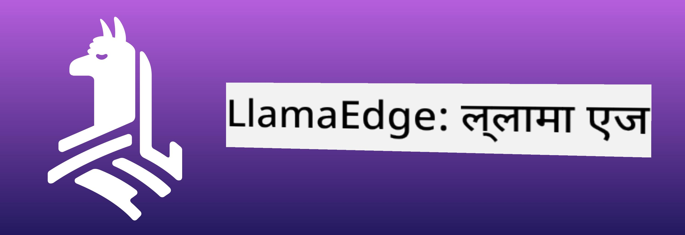
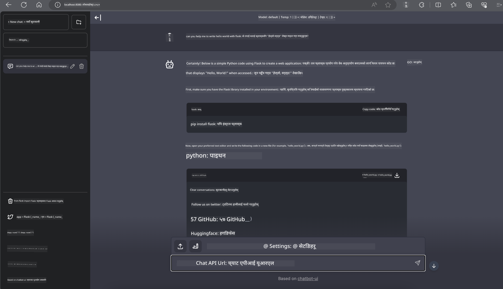

<!--
CO_OP_TRANSLATOR_METADATA:
{
  "original_hash": "be4101a30d98e95a71d42c276e8bcd37",
  "translation_date": "2025-05-09T11:33:33+00:00",
  "source_file": "md/01.Introduction/03/Jetson_Inference.md",
  "language_code": "ne"
}
-->
# **Nvidia Jetson मा Phi-3 इन्फरेन्स**

Nvidia Jetson Nvidia को एम्बेडेड कम्प्युटिङ बोर्डहरूको श्रृंखला हो। Jetson TK1, TX1 र TX2 मोडेलहरूले Nvidia को Tegra प्रोसेसर (वा SoC) समावेश गर्छन् जुन ARM आर्किटेक्चरको सेंट्रल प्रोसेसिङ यूनिट (CPU) सँग जोडिएको हुन्छ। Jetson कम पावरको सिस्टम हो र मेसिन लर्निङ एप्लिकेशनहरूलाई छिटो बनाउन डिजाइन गरिएको हो। Nvidia Jetson पेशेवर विकासकर्ताहरूले सबै उद्योगहरूमा क्रान्तिकारी AI उत्पादनहरू बनाउन प्रयोग गर्छन्, र विद्यार्थी र उत्साहीहरूले व्यावहारिक AI सिकाइ र अद्भुत परियोजनाहरू बनाउन प्रयोग गर्छन्। SLM Jetson जस्ता एज उपकरणहरूमा तैनाथ गरिएको छ, जसले औद्योगिक जेनेरेटिभ AI एप्लिकेसन परिदृश्यहरूको राम्रो कार्यान्वयन सक्षम बनाउँछ।

## NVIDIA Jetson मा तैनाथीकरण:
स्वायत्त रोबोटिक्स र एम्बेडेड उपकरणहरूमा काम गर्ने विकासकर्ताहरूले Phi-3 Mini को फाइदा लिन सक्छन्। Phi-3 को सानो आकारले यसलाई एजमा तैनाथीकरणका लागि उपयुक्त बनाउँछ। प्रशिक्षणको क्रममा प्यारामिटरहरू सावधानीपूर्वक ट्युन गरिएको छ, जसले प्रतिक्रियाहरूमा उच्च सटीकता सुनिश्चित गर्छ।

### TensorRT-LLM अप्टिमाइजेसन:
NVIDIA को [TensorRT-LLM लाइब्रेरी](https://github.com/NVIDIA/TensorRT-LLM?WT.mc_id=aiml-138114-kinfeylo) ठूलो भाषा मोडेल इन्फरेन्सलाई अप्टिमाइज गर्छ। यसले Phi-3 Mini को लामो कन्टेक्स्ट विन्डोलाई समर्थन गर्छ, जसले थ्रुपुट र लेटेंसी दुवै सुधार गर्छ। अप्टिमाइजेसनहरूमा LongRoPE, FP8, र inflight ब्याचिङ जस्ता प्रविधिहरू समावेश छन्।

### उपलब्धता र तैनाथीकरण:
विकासकर्ताहरू Phi-3 Mini लाई 128K कन्टेक्स्ट विन्डो सहित [NVIDIA को AI](https://www.nvidia.com/en-us/ai-data-science/generative-ai/) मा अन्वेषण गर्न सक्छन्। यो NVIDIA NIM को रूपमा प्याकेज गरिएको छ, जुन एउटा माइक्रोसर्भिस हो र मानक API सहित जुन कहीं पनि तैनाथ गर्न सकिन्छ। साथै, [TensorRT-LLM को GitHub मा कार्यान्वयनहरू](https://github.com/NVIDIA/TensorRT-LLM) उपलब्ध छन्।

## **1. तयारी**

a. Jetson Orin NX / Jetson NX

b. JetPack 5.1.2+

c. Cuda 11.8

d. Python 3.8+

## **2. Jetson मा Phi-3 चलाउने तरिका**

हामी [Ollama](https://ollama.com) वा [LlamaEdge](https://llamaedge.com) छनोट गर्न सक्छौं।

यदि तपाईंले क्लाउड र एज उपकरणहरूमा एकै पटक gguf प्रयोग गर्न चाहनुहुन्छ भने, LlamaEdge लाई WasmEdge को रूपमा बुझ्न सकिन्छ (WasmEdge एक हल्का, उच्च प्रदर्शन, स्केलेबल WebAssembly रनटाइम हो जुन क्लाउड नेटिभ, एज र विकेन्द्रीकृत एप्लिकेसनहरूका लागि उपयुक्त छ। यसले सर्भरलेस एप्लिकेसनहरू, एम्बेडेड फङ्सनहरू, माइक्रोसर्भिसहरू, स्मार्ट कन्ट्र्याक्टहरू र IoT उपकरणहरूलाई समर्थन गर्छ। तपाईं gguf को क्वान्टिटेटिभ मोडेल एज उपकरणहरू र क्लाउडमा LlamaEdge मार्फत तैनाथ गर्न सक्नुहुन्छ)।



यहाँ प्रयोग गर्ने चरणहरू छन्:

1. सम्बन्धित लाइब्रेरी र फाइलहरू स्थापना र डाउनलोड गर्नुहोस्

```bash

curl -sSf https://raw.githubusercontent.com/WasmEdge/WasmEdge/master/utils/install.sh | bash -s -- --plugin wasi_nn-ggml

curl -LO https://github.com/LlamaEdge/LlamaEdge/releases/latest/download/llama-api-server.wasm

curl -LO https://github.com/LlamaEdge/chatbot-ui/releases/latest/download/chatbot-ui.tar.gz

tar xzf chatbot-ui.tar.gz

```

**Note**: llama-api-server.wasm र chatbot-ui एउटै डाइरेक्टरीमा हुन आवश्यक छ

2. टर्मिनलमा स्क्रिप्टहरू चलाउनुहोस्

```bash

wasmedge --dir .:. --nn-preload default:GGML:AUTO:{Your gguf path} llama-api-server.wasm -p phi-3-chat

```

यो चलाउने परिणाम हो



***नमूना कोड*** [Phi-3 mini WASM Notebook Sample](https://github.com/Azure-Samples/Phi-3MiniSamples/tree/main/wasm)

सारांशमा, Phi-3 Mini भाषा मोडेलिङमा ठूलो प्रगति हो, जसले दक्षता, सन्दर्भ बुझाइ र NVIDIA को अप्टिमाइजेसन क्षमता संयोजन गर्छ। तपाईं रोबोट बनाउँदै हुनुहुन्छ वा एज एप्लिकेसनहरू विकास गर्दै हुनुहुन्छ भने, Phi-3 Mini एक शक्तिशाली उपकरण हो जसलाई ध्यान दिनुपर्छ।

**अस्वीकरण**:  
यो दस्तावेज़ AI अनुवाद सेवा [Co-op Translator](https://github.com/Azure/co-op-translator) प्रयोग गरी अनुवाद गरिएको हो। हामी शुद्धताको लागि प्रयासरत छौं, तर कृपया जानकार हुनुहोस् कि स्वचालित अनुवादहरूमा त्रुटिहरू वा अशुद्धिहरू हुन सक्छन्। मूल दस्तावेज़लाई यसको मूल भाषामा आधिकारिक स्रोत मान्नुपर्छ। महत्वपूर्ण जानकारीको लागि, पेशेवर मानव अनुवाद सिफारिस गरिन्छ। यस अनुवादको प्रयोगबाट उत्पन्न कुनै पनि गलतफहमी वा गलत व्याख्याको लागि हामी जिम्मेवार छैनौं।