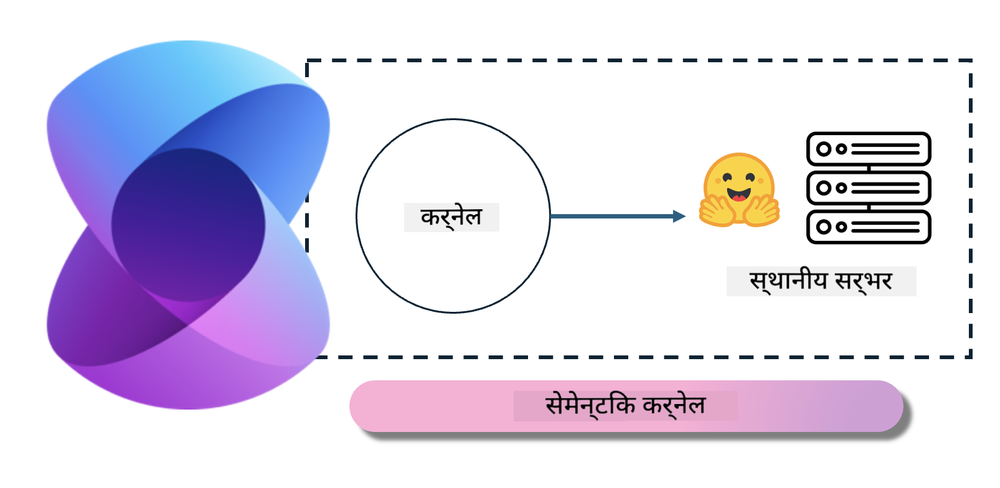
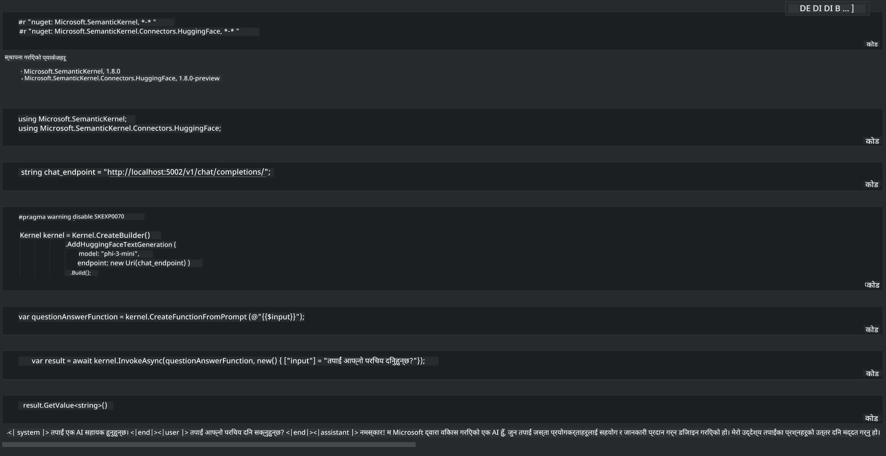

<!--
CO_OP_TRANSLATOR_METADATA:
{
  "original_hash": "bcf5dd7031db0031abdb9dd0c05ba118",
  "translation_date": "2025-05-09T12:02:29+00:00",
  "source_file": "md/01.Introduction/03/Local_Server_Inference.md",
  "language_code": "ne"
}
-->
# **स्थानीय सर्भरमा Phi-3 को पूर्वानुमान**

हामी Phi-3 लाई स्थानीय सर्भरमा तैनाथ गर्न सक्छौं। प्रयोगकर्ताहरूले [Ollama](https://ollama.com) वा [LM Studio](https://llamaedge.com) समाधानहरू छनोट गर्न सक्छन्, वा उनीहरूले आफ्नै कोड लेख्न सक्छन्। तपाईं Semantic Kernel ([https://github.com/microsoft/semantic-kernel?WT.mc_id=aiml-138114-kinfeylo](https://github.com/microsoft/semantic-kernel?WT.mc_id=aiml-138114-kinfeylo)) वा [Langchain](https://www.langchain.com/) मार्फत Phi-3 का स्थानीय सेवाहरू जडान गरेर Copilot एप्लिकेशनहरू बनाउन सक्नुहुन्छ।

## **Semantic Kernel प्रयोग गरेर Phi-3-mini पहुँच गर्ने तरिका**

Copilot एप्लिकेशनमा, हामी Semantic Kernel / LangChain मार्फत एप्लिकेशनहरू सिर्जना गर्छौं। यस्तो प्रकारको एप्लिकेशन फ्रेमवर्क सामान्यतया Azure OpenAI Service / OpenAI मोडेलहरूसँग अनुकूल हुन्छ, र Hugging Face मा खुला स्रोत मोडेलहरू र स्थानीय मोडेलहरूलाई पनि समर्थन गर्न सक्छ। यदि हामी Semantic Kernel प्रयोग गरेर Phi-3-mini पहुँच गर्न चाहन्छौं भने के गर्ने? .NET लाई उदाहरणको रूपमा लिएर, हामी यसलाई Semantic Kernel मा रहेको Hugging Face Connector सँग संयोजन गर्न सक्छौं। पूर्वनिर्धारित रूपमा, यसले Hugging Face मा मोडेल id सँग मेल खान्छ (पहिलो पटक प्रयोग गर्दा, मोडेल Hugging Face बाट डाउनलोड हुन्छ, जसले धेरै समय लिन सक्छ)। तपाईंले आफ्नै बनाएको स्थानीय सेवामा पनि जडान गर्न सक्नुहुन्छ। यी दुई मध्ये, हामी पछि प्रयोग गर्न सिफारिस गर्छौं किनभने यसले उच्च स्तरको स्वतन्त्रता दिन्छ, विशेष गरी उद्यम एप्लिकेशनहरूमा।

चित्रबाट Semantic Kernel मार्फत स्थानीय सेवाहरू पहुँच गर्दा सजिलैसँग आफैंले बनाएको Phi-3-mini मोडेल सर्भरसँग जडान गर्न सकिन्छ। यहाँ चलिरहेको परिणाम छ:

***नमूना कोड*** https://github.com/kinfey/Phi3MiniSamples/tree/main/semantickernel

**अस्वीकरण**:  
यो दस्तावेज़ AI अनुवाद सेवा [Co-op Translator](https://github.com/Azure/co-op-translator) प्रयोग गरी अनुवाद गरिएको हो। हामी शुद्धताका लागि प्रयासरत छौं, तर कृपया ध्यान दिनुहोस् कि स्वचालित अनुवादमा त्रुटिहरू वा अशुद्धता हुनसक्छ। मूल दस्तावेज़ यसको मूल भाषामा आधिकारिक स्रोत मानिनुपर्छ। महत्वपूर्ण जानकारीका लागि व्यावसायिक मानव अनुवाद सिफारिस गरिन्छ। यस अनुवादको प्रयोगबाट उत्पन्न कुनै पनि गलतफहमी वा गलत व्याख्याका लागि हामी जिम्मेवार छैनौं।