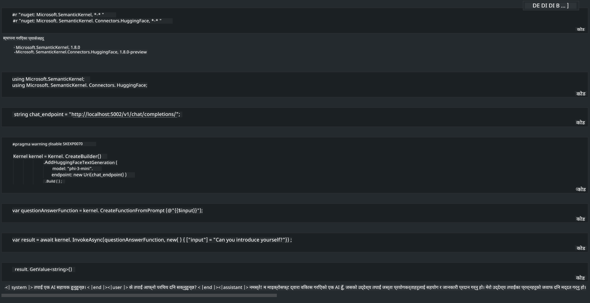

<!--
CO_OP_TRANSLATOR_METADATA:
{
  "original_hash": "bcf5dd7031db0031abdb9dd0c05ba118",
  "translation_date": "2025-07-16T20:56:33+00:00",
  "source_file": "md/01.Introduction/03/Local_Server_Inference.md",
  "language_code": "ne"
}
-->
# **स्थानीय सर्भरमा Inference Phi-3**

हामी Phi-3 लाई स्थानीय सर्भरमा डिप्लोय गर्न सक्छौं। प्रयोगकर्ताहरूले [Ollama](https://ollama.com) वा [LM Studio](https://llamaedge.com) समाधानहरू रोज्न सक्छन्, वा आफ्नै कोड लेख्न सक्छन्। तपाईं Semantic Kernel ([Semantic Kernel](https://github.com/microsoft/semantic-kernel?WT.mc_id=aiml-138114-kinfeylo)) वा [Langchain](https://www.langchain.com/) मार्फत Phi-3 का स्थानीय सेवाहरू जडान गरेर Copilot एप्लिकेसनहरू बनाउन सक्नुहुन्छ।

## **Phi-3-mini पहुँच गर्न Semantic Kernel प्रयोग गर्ने**

Copilot एप्लिकेसनमा, हामी Semantic Kernel / LangChain मार्फत एप्लिकेसनहरू सिर्जना गर्छौं। यस्तो प्रकारको एप्लिकेसन फ्रेमवर्क सामान्यतया Azure OpenAI Service / OpenAI मोडेलहरूसँग अनुकूल हुन्छ, र Hugging Face मा रहेका खुला स्रोत मोडेलहरू र स्थानीय मोडेलहरूलाई पनि समर्थन गर्न सक्छ। यदि हामी Semantic Kernel प्रयोग गरेर Phi-3-mini पहुँच गर्न चाहन्छौं भने के गर्ने? .NET लाई उदाहरणको रूपमा लिएर, हामी यसलाई Semantic Kernel मा Hugging Face Connector सँग जोड्न सक्छौं। डिफल्ट रूपमा, यसले Hugging Face मा रहेको मोडेल आईडी सँग मेल खान्छ (पहिलो पटक प्रयोग गर्दा, मोडेल Hugging Face बाट डाउनलोड हुन्छ, जसमा धेरै समय लाग्न सक्छ)। तपाईंले बनाएको स्थानीय सेवा पनि जडान गर्न सक्नुहुन्छ। यी दुई मध्ये, हामी पछिल्लो विकल्प सिफारिस गर्छौं किनभने यसले बढी स्वतन्त्रता दिन्छ, विशेष गरी उद्यम एप्लिकेसनहरूमा।

चित्रबाट देखिन्छ कि Semantic Kernel मार्फत स्थानीय सेवाहरू सजिलैसँग आफैंले बनाएको Phi-3-mini मोडेल सर्भरसँग जडान गर्न सकिन्छ। यहाँ चलिरहेको नतिजा छ

***Sample Code*** https://github.com/kinfey/Phi3MiniSamples/tree/main/semantickernel

**अस्वीकरण**:  
यो दस्तावेज AI अनुवाद सेवा [Co-op Translator](https://github.com/Azure/co-op-translator) प्रयोग गरी अनुवाद गरिएको हो। हामी शुद्धताका लागि प्रयासरत छौं भने पनि, कृपया ध्यान दिनुहोस् कि स्वचालित अनुवादमा त्रुटि वा अशुद्धता हुन सक्छ। मूल दस्तावेज यसको मूल भाषामा नै अधिकारिक स्रोत मानिनुपर्छ। महत्वपूर्ण जानकारीका लागि व्यावसायिक मानव अनुवाद सिफारिस गरिन्छ। यस अनुवादको प्रयोगबाट उत्पन्न कुनै पनि गलतफहमी वा गलत व्याख्याका लागि हामी जिम्मेवार छैनौं।