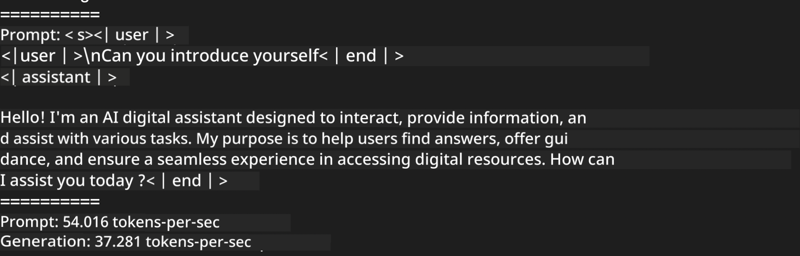
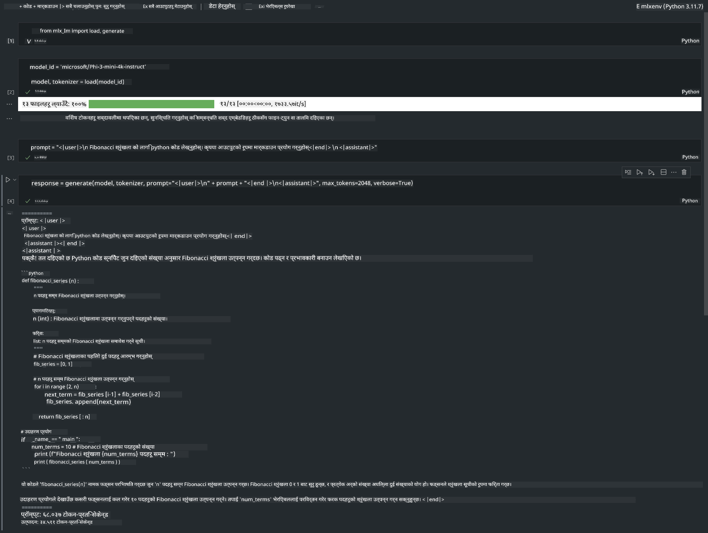

<!--
CO_OP_TRANSLATOR_METADATA:
{
  "original_hash": "dcb656f3d206fc4968e236deec5d4384",
  "translation_date": "2025-07-16T21:02:16+00:00",
  "source_file": "md/01.Introduction/03/MLX_Inference.md",
  "language_code": "ne"
}
-->
# **Apple MLX Framework सँग Phi-3 को इन्फरेन्स**

## **MLX Framework के हो**

MLX Apple सिलिकनमा मेसिन लर्निङ अनुसन्धानका लागि बनेको एक एरे फ्रेमवर्क हो, जुन Apple मेसिन लर्निङ अनुसन्धानद्वारा प्रस्तुत गरिएको हो।

MLX मेसिन लर्निङ अनुसन्धानकर्ताहरूका लागि मेसिन लर्निङ अनुसन्धानकर्ताहरूले डिजाइन गरेको हो। यो फ्रेमवर्क प्रयोगकर्तामैत्री हुन डिजाइन गरिएको छ, तर मोडेलहरूलाई प्रशिक्षण र डिप्लोय गर्न अझै पनि प्रभावकारी छ। फ्रेमवर्कको डिजाइन पनि अवधारणात्मक रूपमा सरल छ। हामी अनुसन्धानकर्ताहरूलाई नयाँ विचारहरू छिटो अन्वेषण गर्न सजिलो बनाउन MLX लाई विस्तार र सुधार गर्न प्रोत्साहित गर्न चाहन्छौं।

Apple सिलिकन उपकरणहरूमा MLX मार्फत LLMs लाई छिटो चलाउन सकिन्छ, र मोडेलहरू स्थानीय रूपमा सजिलै चलाउन सकिन्छ।

## **MLX प्रयोग गरेर Phi-3-mini को इन्फरेन्स गर्ने तरिका**

### **1. आफ्नो MLX वातावरण सेटअप गर्नुहोस्**

1. Python 3.11.x
2. MLX लाइब्रेरी इन्स्टल गर्नुहोस्

```bash

pip install mlx-lm

```

### **2. MLX सँग टर्मिनलमा Phi-3-mini चलाउने**

```bash

python -m mlx_lm.generate --model microsoft/Phi-3-mini-4k-instruct --max-token 2048 --prompt  "<|user|>\nCan you introduce yourself<|end|>\n<|assistant|>"

```

परिणाम (मेरो वातावरण Apple M1 Max, 64GB छ) यस्तो छ


### **3. MLX सँग टर्मिनलमा Phi-3-mini को क्वान्टाइजेसन गर्ने**

```bash

python -m mlx_lm.convert --hf-path microsoft/Phi-3-mini-4k-instruct

```

***Note：*** मोडेल mlx_lm.convert मार्फत क्वान्टाइज गर्न सकिन्छ, र डिफल्ट क्वान्टाइजेसन INT4 हो। यो उदाहरणमा Phi-3-mini लाई INT4 मा क्वान्टाइज गरिएको छ।

मोडेल mlx_lm.convert मार्फत क्वान्टाइज गर्न सकिन्छ, र डिफल्ट क्वान्टाइजेसन INT4 हो। यो उदाहरण Phi-3-mini लाई INT4 मा क्वान्टाइज गर्ने हो। क्वान्टाइज गरेपछि, यो डिफल्ट डाइरेक्टरी ./mlx_model मा सुरक्षित हुनेछ।

हामी टर्मिनलबाट MLX सँग क्वान्टाइज गरिएको मोडेल परीक्षण गर्न सक्छौं।

```bash

python -m mlx_lm.generate --model ./mlx_model/ --max-token 2048 --prompt  "<|user|>\nCan you introduce yourself<|end|>\n<|assistant|>"

```

परिणाम यस्तो छ



### **4. Jupyter Notebook मा MLX सँग Phi-3-mini चलाउने**



***Note:*** कृपया यो नमुना पढ्नुहोस् [click this link](../../../../../code/03.Inference/MLX/MLX_DEMO.ipynb)

## **स्रोतहरू**

1. Apple MLX Framework को बारेमा जान्न [https://ml-explore.github.io](https://ml-explore.github.io/mlx/build/html/index.html)

2. Apple MLX GitHub Repo [https://github.com/ml-explore](https://github.com/ml-explore)

**अस्वीकरण**:  
यो दस्तावेज AI अनुवाद सेवा [Co-op Translator](https://github.com/Azure/co-op-translator) प्रयोग गरी अनुवाद गरिएको हो। हामी शुद्धताका लागि प्रयासरत छौं भने पनि, कृपया ध्यान दिनुहोस् कि स्वचालित अनुवादमा त्रुटि वा अशुद्धता हुन सक्छ। मूल दस्तावेज यसको मूल भाषामा नै अधिकारिक स्रोत मानिनु पर्छ। महत्वपूर्ण जानकारीका लागि व्यावसायिक मानव अनुवाद सिफारिस गरिन्छ। यस अनुवादको प्रयोगबाट उत्पन्न कुनै पनि गलतफहमी वा गलत व्याख्याका लागि हामी जिम्मेवार छैनौं।