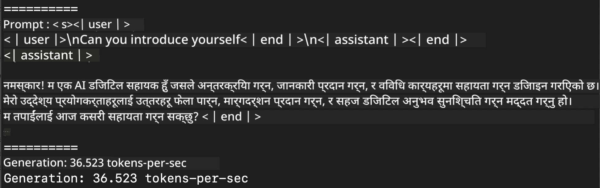
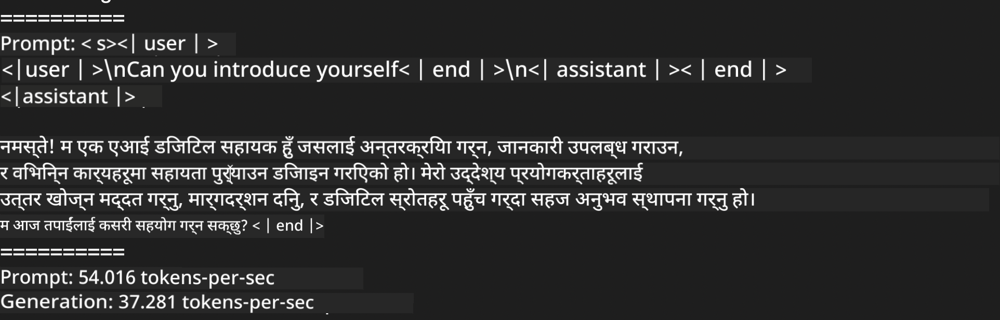
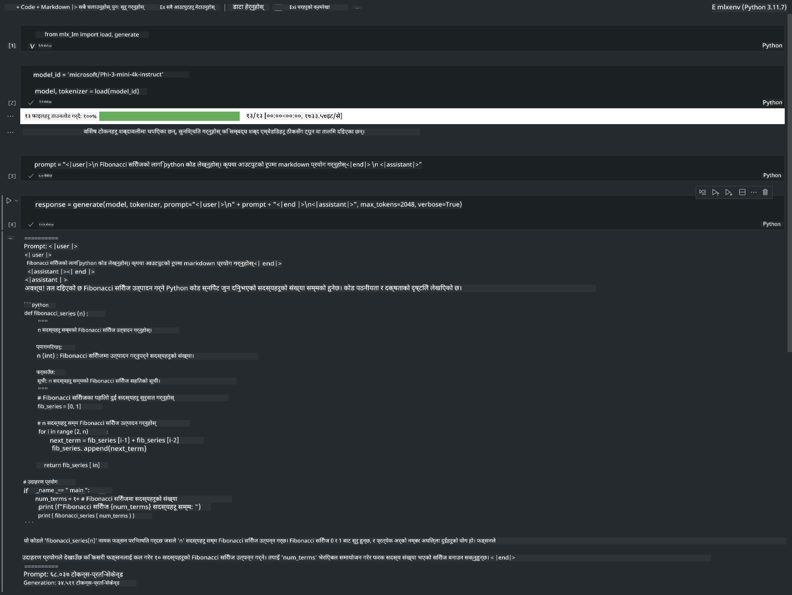

<!--
CO_OP_TRANSLATOR_METADATA:
{
  "original_hash": "dcb656f3d206fc4968e236deec5d4384",
  "translation_date": "2025-05-09T12:10:51+00:00",
  "source_file": "md/01.Introduction/03/MLX_Inference.md",
  "language_code": "ne"
}
-->
# **Inference Phi-3 with Apple MLX Framework**

## **What is MLX Framework**

MLX is an array framework for machine learning research on Apple silicon, developed by Apple machine learning researchers.

MLX is designed by machine learning researchers for machine learning researchers. The framework aims to be user-friendly while remaining efficient for training and deploying models. Its design is conceptually simple. We want to make it easy for researchers to extend and improve MLX, enabling quick experimentation with new ideas.

LLMs can be accelerated on Apple Silicon devices using MLX, and models can be run locally with great convenience.

## **Using MLX to inference Phi-3-mini**

### **1. Set up your MLX env**

1. Python 3.11.x  
2. Install MLX Library

```bash

pip install mlx-lm

```

### **2. Running Phi-3-mini in Terminal with MLX**

```bash

python -m mlx_lm.generate --model microsoft/Phi-3-mini-4k-instruct --max-token 2048 --prompt  "<|user|>\nCan you introduce yourself<|end|>\n<|assistant|>"

```

The result (my environment is Apple M1 Max, 64GB) is



### **3. Quantizing Phi-3-mini with MLX in Terminal**

```bash

python -m mlx_lm.convert --hf-path microsoft/Phi-3-mini-4k-instruct

```

***Note：*** The model can be quantized through mlx_lm.convert, with the default quantization set to INT4. This example shows quantizing Phi-3-mini to INT4.

The model can be quantized through mlx_lm.convert, and the default quantization is INT4. This example quantizes Phi-3-mini into INT4. After quantization, it will be saved in the default directory ./mlx_model

We can test the quantized model using MLX from the terminal

```bash

python -m mlx_lm.generate --model ./mlx_model/ --max-token 2048 --prompt  "<|user|>\nCan you introduce yourself<|end|>\n<|assistant|>"

```

The result is



### **4. Running Phi-3-mini with MLX in Jupyter Notebook**



***Note:*** Please check this sample [click this link](../../../../../code/03.Inference/MLX/MLX_DEMO.ipynb)

## **Resources**

1. Learn about Apple MLX Framework [https://ml-explore.github.io](https://ml-explore.github.io/mlx/build/html/index.html)

2. Apple MLX GitHub Repo [https://github.com/ml-explore](https://github.com/ml-explore)

**अस्वीकरण**:  
यो दस्तावेज AI अनुवाद सेवा [Co-op Translator](https://github.com/Azure/co-op-translator) प्रयोग गरी अनुवाद गरिएको हो। हामी शुद्धताका लागि प्रयासरत छौं, तर कृपया जानकार हुनुहोस् कि स्वचालित अनुवादमा त्रुटि वा गलतफहमी हुन सक्छ। मूल दस्तावेज यसको मूल भाषामा नै आधिकारिक स्रोत मानिनु पर्छ। महत्वपूर्ण जानकारीको लागि व्यावसायिक मानव अनुवाद सिफारिस गरिन्छ। यस अनुवादको प्रयोगबाट हुने कुनै पनि गलतफहमी वा गलत व्याख्याका लागि हामी जिम्मेवार छैनौं।