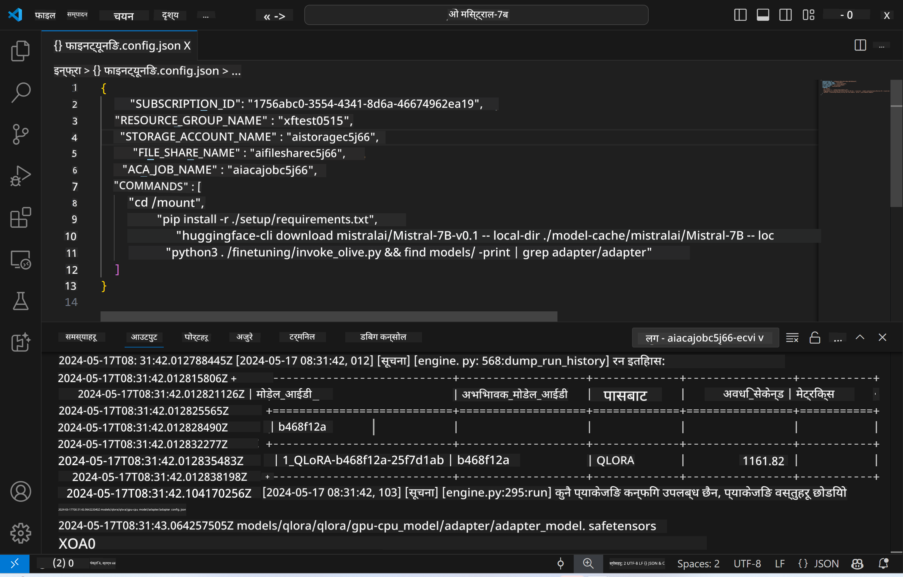
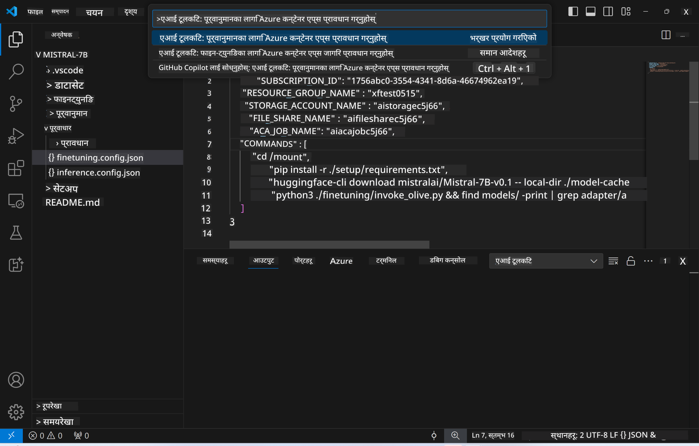
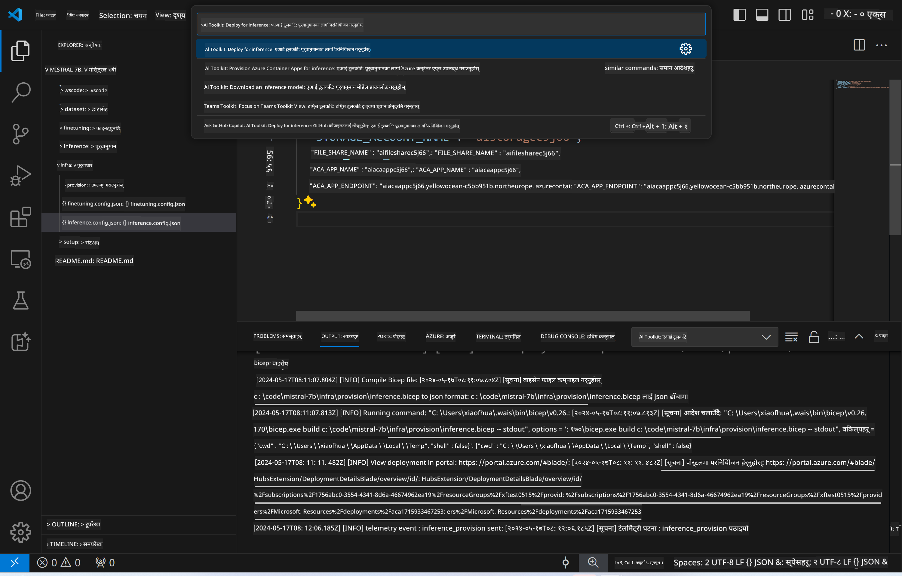
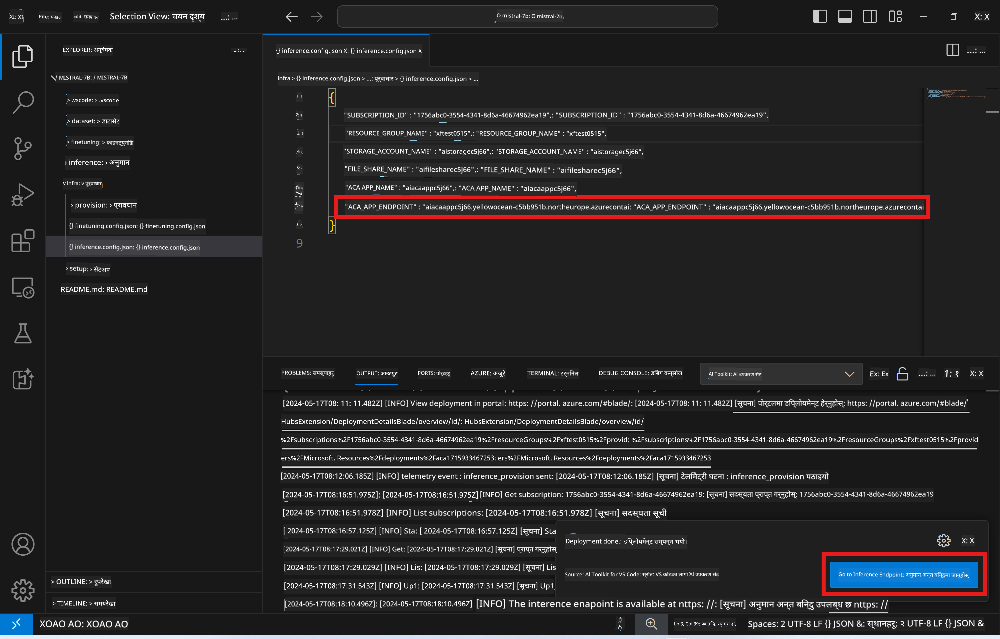

<!--
CO_OP_TRANSLATOR_METADATA:
{
  "original_hash": "a54cd3d65b6963e4e8ce21e143c3ab04",
  "translation_date": "2025-07-16T21:17:33+00:00",
  "source_file": "md/01.Introduction/03/Remote_Interence.md",
  "language_code": "ne"
}
-->
# फाइन-ट्यून गरिएको मोडेलसँग रिमोट इन्फरेन्सिङ

एडाप्टरहरू रिमोट वातावरणमा तालिम दिइसकेपछि, मोडेलसँग अन्तरक्रिया गर्न एक सरल Gradio एप्लिकेशन प्रयोग गर्नुहोस्।



### Azure स्रोतहरू प्रावधान गर्नुहोस्  
रिमोट इन्फरेन्सका लागि Azure स्रोतहरू सेटअप गर्न, कमाण्ड प्यालेटबाट `AI Toolkit: Provision Azure Container Apps for inference` कमाण्ड चलाउनुहोस्। यस सेटअपको क्रममा, तपाईंलाई आफ्नो Azure Subscription र resource group चयन गर्न भनिनेछ।  


डिफल्ट रूपमा, इन्फरेन्सका लागि प्रयोग हुने subscription र resource group फाइन-ट्यूनिङमा प्रयोग भएका समान हुनुपर्छ। इन्फरेन्सले फाइन-ट्यूनिङ चरणमा सिर्जना गरिएको Azure Files मा भण्डारण गरिएको मोडेल र मोडेल एडाप्टर पहुँच गर्नका लागि उही Azure Container App Environment प्रयोग गर्नेछ।

## AI Toolkit प्रयोग गर्दै

### इन्फरेन्सका लागि डिप्लोयमेन्ट  
यदि तपाईं इन्फरेन्स कोड पुनः संशोधन गर्न वा इन्फरेन्स मोडेल पुनः लोड गर्न चाहनुहुन्छ भने, कृपया `AI Toolkit: Deploy for inference` कमाण्ड चलाउनुहोस्। यसले तपाईंको पछिल्लो कोडलाई ACA सँग समक्रमण गर्नेछ र रेप्लिका पुनः सुरु गर्नेछ।



डिप्लोयमेन्ट सफलतापूर्वक सम्पन्न भएपछि, मोडेल मूल्याङ्कनका लागि यो एन्डपोइन्ट प्रयोग गर्न तयार हुन्छ।

### इन्फरेन्स API पहुँच

VSCode नोटिफिकेसनमा देखिने "*Go to Inference Endpoint*" बटनमा क्लिक गरेर तपाईं इन्फरेन्स API पहुँच गर्न सक्नुहुन्छ। वैकल्पिक रूपमा, वेब API एन्डपोइन्ट `ACA_APP_ENDPOINT` अन्तर्गत `./infra/inference.config.json` फाइलमा र आउटपुट प्यानलमा फेला पार्न सकिन्छ।



> **Note:** इन्फरेन्स एन्डपोइन्ट पूर्ण रूपमा सञ्चालनमा आउन केही मिनेट लाग्न सक्छ।

## टेम्प्लेटमा समावेश इन्फरेन्स कम्पोनेन्टहरू

| फोल्डर | सामग्रीहरू |
| ------ |--------- |
| `infra` | रिमोट अपरेसनका लागि आवश्यक सबै कन्फिगरेसनहरू समावेश गर्दछ। |
| `infra/provision/inference.parameters.json` | बाइसेप टेम्प्लेटहरूका लागि प्यारामिटरहरू राख्छ, जुन इन्फरेन्सका लागि Azure स्रोतहरू प्रावधान गर्न प्रयोग गरिन्छ। |
| `infra/provision/inference.bicep` | इन्फरेन्सका लागि Azure स्रोतहरू प्रावधान गर्ने टेम्प्लेटहरू समावेश गर्दछ। |
| `infra/inference.config.json` | `AI Toolkit: Provision Azure Container Apps for inference` कमाण्डले सिर्जना गरेको कन्फिगरेसन फाइल। यो अन्य रिमोट कमाण्ड प्यालेटहरूको इनपुटको रूपमा प्रयोग हुन्छ। |

### AI Toolkit प्रयोग गरेर Azure स्रोत प्रावधान कन्फिगर गर्ने  
[AI Toolkit](https://marketplace.visualstudio.com/items?itemName=ms-windows-ai-studio.windows-ai-studio) कन्फिगर गर्नुहोस्।

`Provision Azure Container Apps for inference` कमाण्ड चलाउनुहोस्।

तपाईंले कन्फिगरेसन प्यारामिटरहरू `./infra/provision/inference.parameters.json` फाइलमा फेला पार्न सक्नुहुन्छ। विवरणहरू यसप्रकार छन्:

| प्यारामिटर | विवरण |
| --------- |------------ |
| `defaultCommands` | वेब API सुरु गर्नका लागि कमाण्डहरू। |
| `maximumInstanceCount` | GPU इन्स्ट्यान्सहरूको अधिकतम क्षमता सेट गर्ने प्यारामिटर। |
| `location` | Azure स्रोतहरू प्रावधान हुने स्थान। डिफल्ट मान चयन गरिएको resource group को स्थानसँग मेल खान्छ। |
| `storageAccountName`, `fileShareName`, `acaEnvironmentName`, `acaEnvironmentStorageName`, `acaAppName`, `acaLogAnalyticsName` | यी प्यारामिटरहरू Azure स्रोतहरूको नामकरणका लागि प्रयोग हुन्छन्। डिफल्ट रूपमा, यी फाइन-ट्यूनिङ स्रोत नामसँग समान हुन्छन्। तपाईं आफ्नो अनुकूल नाम राख्न नयाँ, प्रयोग नगरिएको नाम प्रविष्ट गर्न सक्नुहुन्छ, वा पहिले नै अवस्थित Azure स्रोतको नाम प्रविष्ट गरेर त्यसलाई प्रयोग गर्न सक्नुहुन्छ। थप जानकारीका लागि [Using existing Azure Resources](../../../../../md/01.Introduction/03) सेक्सन हेर्नुहोस्। |

### अवस्थित Azure स्रोतहरू प्रयोग गर्दै

डिफल्ट रूपमा, इन्फरेन्स प्रावधानले फाइन-ट्यूनिङमा प्रयोग भएका Azure Container App Environment, Storage Account, Azure File Share, र Azure Log Analytics नै प्रयोग गर्दछ। इन्फरेन्स API का लागि अलग Azure Container App सिर्जना गरिन्छ।

यदि तपाईंले फाइन-ट्यूनिङ चरणमा Azure स्रोतहरू अनुकूलन गर्नुभएको छ वा आफ्नो अवस्थित Azure स्रोतहरू इन्फरेन्सका लागि प्रयोग गर्न चाहनुहुन्छ भने, तिनीहरूको नाम `./infra/inference.parameters.json` फाइलमा निर्दिष्ट गर्नुहोस्। त्यसपछि कमाण्ड प्यालेटबाट `AI Toolkit: Provision Azure Container Apps for inference` कमाण्ड चलाउनुहोस्। यसले निर्दिष्ट स्रोतहरू अपडेट गर्नेछ र अभाव भएका स्रोतहरू सिर्जना गर्नेछ।

उदाहरणका लागि, यदि तपाईंको अवस्थित Azure container environment छ भने, तपाईंको `./infra/finetuning.parameters.json` यस प्रकार देखिनुपर्छ:

```json
{
    "$schema": "https://schema.management.azure.com/schemas/2019-04-01/deploymentParameters.json#",
    "contentVersion": "1.0.0.0",
    "parameters": {
      ...
      "acaEnvironmentName": {
        "value": "<your-aca-env-name>"
      },
      "acaEnvironmentStorageName": {
        "value": null
      },
      ...
    }
  }
```

### म्यानुअल प्रावधान  
यदि तपाईं Azure स्रोतहरू म्यानुअली कन्फिगर गर्न चाहनुहुन्छ भने, `./infra/provision` फोल्डरमा उपलब्ध बाइसेप फाइलहरू प्रयोग गर्न सक्नुहुन्छ। यदि तपाईंले AI Toolkit कमाण्ड प्यालेट प्रयोग नगरी सबै Azure स्रोतहरू पहिले नै सेटअप र कन्फिगर गर्नुभएको छ भने, `inference.config.json` फाइलमा स्रोत नामहरू मात्र प्रविष्ट गर्नुहोस्।

उदाहरणका लागि:

```json
{
  "SUBSCRIPTION_ID": "<your-subscription-id>",
  "RESOURCE_GROUP_NAME": "<your-resource-group-name>",
  "STORAGE_ACCOUNT_NAME": "<your-storage-account-name>",
  "FILE_SHARE_NAME": "<your-file-share-name>",
  "ACA_APP_NAME": "<your-aca-name>",
  "ACA_APP_ENDPOINT": "<your-aca-endpoint>"
}
```

**अस्वीकरण**:  
यो दस्तावेज AI अनुवाद सेवा [Co-op Translator](https://github.com/Azure/co-op-translator) प्रयोग गरी अनुवाद गरिएको हो। हामी शुद्धताका लागि प्रयासरत छौं, तर कृपया ध्यान दिनुहोस् कि स्वचालित अनुवादमा त्रुटि वा अशुद्धता हुन सक्छ। मूल दस्तावेज यसको मूल भाषामा नै अधिकारिक स्रोत मानिनु पर्छ। महत्वपूर्ण जानकारीका लागि व्यावसायिक मानव अनुवाद सिफारिस गरिन्छ। यस अनुवादको प्रयोगबाट उत्पन्न कुनै पनि गलतफहमी वा गलत व्याख्याका लागि हामी जिम्मेवार छैनौं।