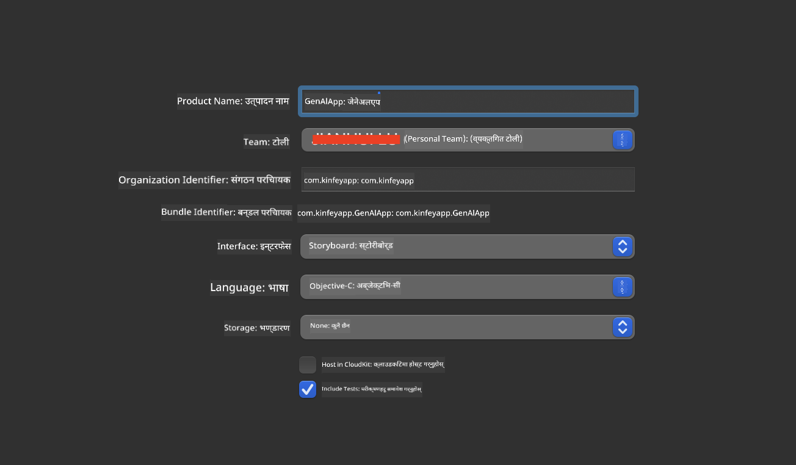
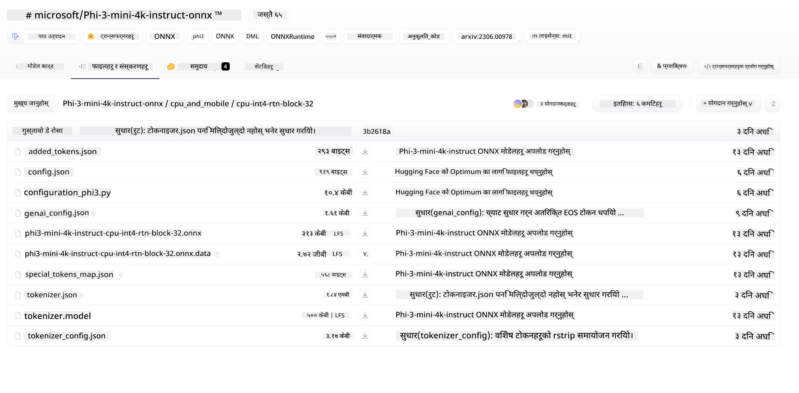
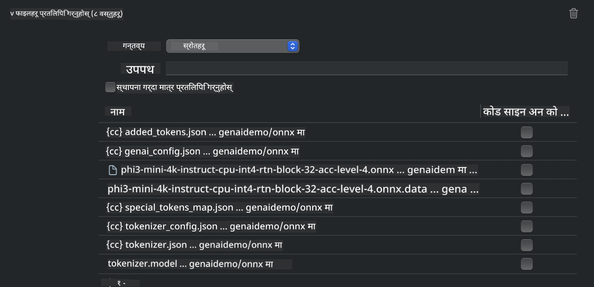
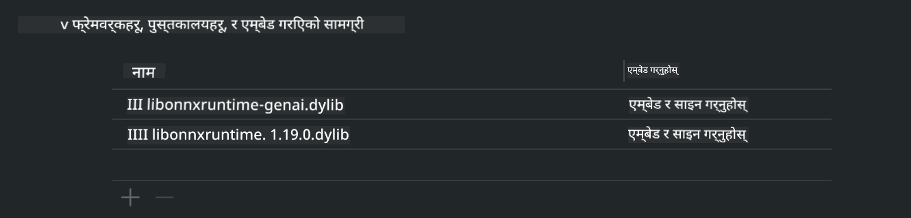
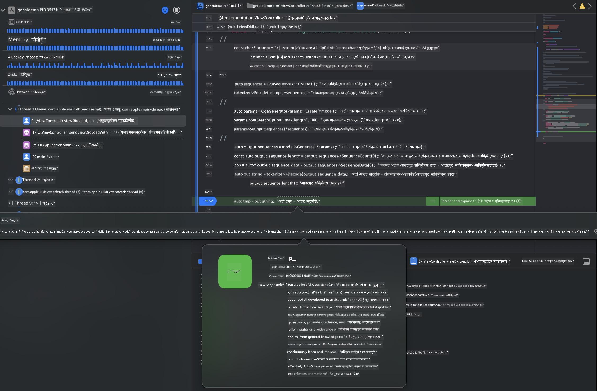

<!--
CO_OP_TRANSLATOR_METADATA:
{
  "original_hash": "82af197df38d25346a98f1f0e84d1698",
  "translation_date": "2025-07-16T20:20:11+00:00",
  "source_file": "md/01.Introduction/03/iOS_Inference.md",
  "language_code": "ne"
}
-->
# **iOS मा Inference Phi-3**

Phi-3-mini माइक्रोसफ्टको नयाँ मोडेल श्रृंखला हो जसले एज उपकरणहरू र IoT उपकरणहरूमा ठूलो भाषा मोडेलहरू (LLMs) तैनाथ गर्न सक्षम बनाउँछ। Phi-3-mini iOS, Android, र एज उपकरणहरूमा उपलब्ध छ, जसले BYOD वातावरणमा जनरेटिभ AI तैनाथ गर्न अनुमति दिन्छ। तलको उदाहरणले iOS मा Phi-3-mini कसरी तैनाथ गर्ने देखाउँछ।

## **1. तयारी**

- **a.** macOS 14+
- **b.** Xcode 15+
- **c.** iOS SDK 17.x (iPhone 14 A16 वा माथि)
- **d.** Python 3.10+ स्थापना गर्नुहोस् (Conda सिफारिस गरिन्छ)
- **e.** Python लाइब्रेरी `python-flatbuffers` स्थापना गर्नुहोस्
- **f.** CMake स्थापना गर्नुहोस्

### Semantic Kernel र Inference

Semantic Kernel एउटा एप्लिकेसन फ्रेमवर्क हो जसले Azure OpenAI Service, OpenAI मोडेलहरू, र स्थानीय मोडेलहरूसँग मिल्ने एप्लिकेसनहरू बनाउन अनुमति दिन्छ। Semantic Kernel मार्फत स्थानीय सेवाहरू पहुँच गर्दा तपाईंको स्व-होस्ट गरिएको Phi-3-mini मोडेल सर्भरसँग सजिलै एकीकरण गर्न सकिन्छ।

### Ollama वा LlamaEdge मार्फत Quantized मोडेलहरू कल गर्ने

धेरै प्रयोगकर्ताहरू मोडेलहरू स्थानीय रूपमा चलाउन quantized मोडेलहरू प्रयोग गर्न रुचाउँछन्। [Ollama](https://ollama.com) र [LlamaEdge](https://llamaedge.com) ले विभिन्न quantized मोडेलहरू कल गर्न अनुमति दिन्छन्:

#### **Ollama**

तपाईं `ollama run phi3` सिधै चलाउन सक्नुहुन्छ वा अफलाइन कन्फिगर गर्न सक्नुहुन्छ। आफ्नो `gguf` फाइलको पथ सहित Modelfile बनाउनुहोस्। Phi-3-mini quantized मोडेल चलाउन नमूना कोड:

```gguf
FROM {Add your gguf file path}
TEMPLATE \"\"\"<|user|> .Prompt<|end|> <|assistant|>\"\"\"
PARAMETER stop <|end|>
PARAMETER num_ctx 4096
```

#### **LlamaEdge**

यदि तपाईं `gguf` लाई क्लाउड र एज उपकरणहरूमा एकै समयमा प्रयोग गर्न चाहनुहुन्छ भने, LlamaEdge राम्रो विकल्प हो।

## **2. iOS का लागि ONNX Runtime कम्पाइल गर्ने**

```bash

git clone https://github.com/microsoft/onnxruntime.git

cd onnxruntime

./build.sh --build_shared_lib --ios --skip_tests --parallel --build_dir ./build_ios --ios --apple_sysroot iphoneos --osx_arch arm64 --apple_deploy_target 17.5 --cmake_generator Xcode --config Release

cd ../

```

### **सूचना**

- **a.** कम्पाइल गर्नु अघि, Xcode ठीकसँग कन्फिगर गरिएको छ र टर्मिनलमा सक्रिय डेभलपर डाइरेक्टरीको रूपमा सेट गरिएको छ भनी सुनिश्चित गर्नुहोस्:

    ```bash
    sudo xcode-select -switch /Applications/Xcode.app/Contents/Developer
    ```

- **b.** ONNX Runtime विभिन्न प्लेटफर्महरूका लागि कम्पाइल गर्न आवश्यक छ। iOS का लागि, तपाईं `arm64` वा `x86_64` का लागि कम्पाइल गर्न सक्नुहुन्छ।

- **c.** कम्पाइलका लागि नयाँ iOS SDK प्रयोग गर्न सिफारिस गरिन्छ। तर, पुरानो SDK सँग कम्प्याटिबिलिटी चाहिएको खण्डमा पुरानो संस्करण पनि प्रयोग गर्न सकिन्छ।

## **3. iOS का लागि ONNX Runtime सँग Generative AI कम्पाइल गर्ने**

> **Note:** ONNX Runtime सँग Generative AI प्रिभ्यूमा भएकाले सम्भावित परिवर्तनहरू हुन सक्छन्।

```bash

git clone https://github.com/microsoft/onnxruntime-genai
 
cd onnxruntime-genai
 
mkdir ort
 
cd ort
 
mkdir include
 
mkdir lib
 
cd ../
 
cp ../onnxruntime/include/onnxruntime/core/session/onnxruntime_c_api.h ort/include
 
cp ../onnxruntime/build_ios/Release/Release-iphoneos/libonnxruntime*.dylib* ort/lib
 
export OPENCV_SKIP_XCODEBUILD_FORCE_TRYCOMPILE_DEBUG=1
 
python3 build.py --parallel --build_dir ./build_ios --ios --ios_sysroot iphoneos --ios_arch arm64 --ios_deployment_target 17.5 --cmake_generator Xcode --cmake_extra_defines CMAKE_XCODE_ATTRIBUTE_CODE_SIGNING_ALLOWED=NO

```

## **4. Xcode मा App एप्लिकेसन बनाउने**

मैले App विकास विधिको रूपमा Objective-C रोजें, किनभने ONNX Runtime C++ API सँग Generative AI प्रयोग गर्दा Objective-C राम्रोसँग मिल्छ। पक्कै पनि, तपाईं Swift bridging मार्फत पनि सम्बन्धित कलहरू पूरा गर्न सक्नुहुन्छ।



## **5. ONNX quantized INT4 मोडेल App एप्लिकेसन प्रोजेक्टमा कपी गर्ने**

हामीले ONNX ढाँचामा INT4 quantization मोडेल आयात गर्नुपर्छ, जुन पहिले डाउनलोड गर्न आवश्यक छ।



डाउनलोड गरेपछि, यसलाई Xcode प्रोजेक्टको Resources डाइरेक्टरीमा थप्नुपर्छ।



## **6. ViewControllers मा C++ API थप्ने**

> **सूचना:**

- **a.** सम्बन्धित C++ हेडर फाइलहरू प्रोजेक्टमा थप्नुहोस्।

  

- **b.** Xcode मा `onnxruntime-genai` डायनामिक लाइब्रेरी समावेश गर्नुहोस्।

  

- **c.** परीक्षणका लागि C Samples कोड प्रयोग गर्नुहोस्। थप कार्यक्षमताका लागि ChatUI जस्ता अतिरिक्त सुविधाहरू पनि थप्न सकिन्छ।

- **d.** तपाईंको प्रोजेक्टमा C++ प्रयोग गर्नुपर्ने भएकाले, `ViewController.m` लाई `ViewController.mm` मा नाम परिवर्तन गर्नुहोस् ताकि Objective-C++ समर्थन सक्षम होस्।

```objc

    NSString *llmPath = [[NSBundle mainBundle] resourcePath];
    char const *modelPath = llmPath.cString;

    auto model =  OgaModel::Create(modelPath);

    auto tokenizer = OgaTokenizer::Create(*model);

    const char* prompt = "<|system|>You are a helpful AI assistant.<|end|><|user|>Can you introduce yourself?<|end|><|assistant|>";

    auto sequences = OgaSequences::Create();
    tokenizer->Encode(prompt, *sequences);

    auto params = OgaGeneratorParams::Create(*model);
    params->SetSearchOption("max_length", 100);
    params->SetInputSequences(*sequences);

    auto output_sequences = model->Generate(*params);
    const auto output_sequence_length = output_sequences->SequenceCount(0);
    const auto* output_sequence_data = output_sequences->SequenceData(0);
    auto out_string = tokenizer->Decode(output_sequence_data, output_sequence_length);
    
    auto tmp = out_string;

```

## **7. एप्लिकेसन चलाउने**

सेटअप पूरा भएपछि, Phi-3-mini मोडेल इन्फरेन्सको परिणाम हेर्न एप्लिकेसन चलाउन सक्नुहुन्छ।



थप नमूना कोड र विस्तृत निर्देशनहरूका लागि, [Phi-3 Mini Samples repository](https://github.com/Azure-Samples/Phi-3MiniSamples/tree/main/ios) भ्रमण गर्नुहोस्।

**अस्वीकरण**:  
यो दस्तावेज AI अनुवाद सेवा [Co-op Translator](https://github.com/Azure/co-op-translator) प्रयोग गरी अनुवाद गरिएको हो। हामी शुद्धताका लागि प्रयासरत छौं, तर कृपया ध्यान दिनुहोस् कि स्वचालित अनुवादमा त्रुटि वा अशुद्धता हुन सक्छ। मूल दस्तावेज यसको मूल भाषामा आधिकारिक स्रोत मानिनुपर्छ। महत्वपूर्ण जानकारीका लागि व्यावसायिक मानव अनुवाद सिफारिस गरिन्छ। यस अनुवादको प्रयोगबाट उत्पन्न कुनै पनि गलतफहमी वा गलत व्याख्याका लागि हामी जिम्मेवार छैनौं।