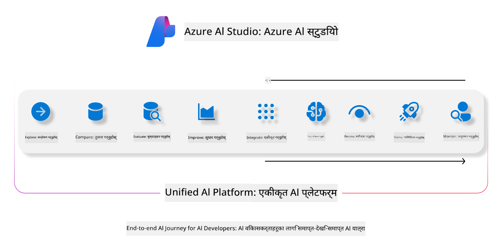
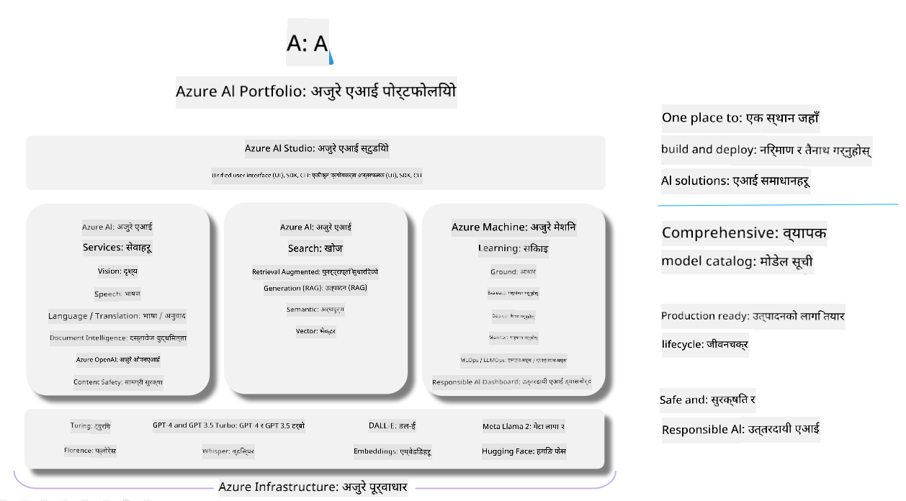

<!--
CO_OP_TRANSLATOR_METADATA:
{
  "original_hash": "7b4235159486df4000e16b7b46ddfec3",
  "translation_date": "2025-05-09T14:54:23+00:00",
  "source_file": "md/01.Introduction/05/AIFoundry.md",
  "language_code": "ne"
}
-->
# **Azure AI Foundry प्रयोग गरी मूल्याङ्कन गर्ने तरिका**

[Azure AI Foundry](https://ai.azure.com?WT.mc_id=aiml-138114-kinfeylo) प्रयोग गरी तपाईंको जनरेटिभ AI एप्लिकेशन कसरी मूल्याङ्कन गर्ने। तपाईं एकल-चरण वा बहु-चरण संवादहरू मूल्याङ्कन गरिरहनुभएको भए पनि, Azure AI Foundry मा मोडेलको प्रदर्शन र सुरक्षा मूल्याङ्कन गर्ने उपकरणहरू उपलब्ध छन्।

## Azure AI Foundry सँग जनरेटिभ AI एपहरू कसरी मूल्याङ्कन गर्ने
थप विस्तृत निर्देशनका लागि [Azure AI Foundry Documentation](https://learn.microsoft.com/azure/ai-studio/how-to/evaluate-generative-ai-app?WT.mc_id=aiml-138114-kinfeylo) हेर्नुहोस्।

सुरु गर्नका लागि यी चरणहरू पालना गर्नुहोस्:

## Azure AI Foundry मा जनरेटिभ AI मोडेलहरूको मूल्याङ्कन

**पूर्व आवश्यकताहरू**

- CSV वा JSON ढाँचामा परीक्षण डाटासेट।
- एक डिप्लोय गरिएको जनरेटिभ AI मोडेल (जस्तै Phi-3, GPT 3.5, GPT 4, वा Davinci मोडेलहरू)।
- मूल्याङ्कन चलाउनको लागि कम्प्युट इन्स्ट्यान्स सहितको रनटाइम।

## बिल्ट-इन मूल्याङ्कन मेट्रिक्स

Azure AI Foundry ले एकल-चरण र जटिल बहु-चरण संवाद दुवै मूल्याङ्कन गर्न अनुमति दिन्छ।  
Retrieval Augmented Generation (RAG) परिदृश्यहरूमा, जहाँ मोडेल विशेष डाटामा आधारित हुन्छ, बिल्ट-इन मूल्याङ्कन मेट्रिक्स प्रयोग गरी प्रदर्शन मूल्याङ्कन गर्न सकिन्छ।  
थप रूपमा, सामान्य एकल-चरण प्रश्नोत्तर (non-RAG) परिदृश्यहरू पनि मूल्याङ्कन गर्न सकिन्छ।

## मूल्याङ्कन रन सिर्जना गर्ने तरिका

Azure AI Foundry UI बाट Evaluate पृष्ठ वा Prompt Flow पृष्ठमा जानुहोस्।  
मूल्याङ्कन सिर्जना विजार्डलाई पालना गर्दै मूल्याङ्कन रन सेटअप गर्नुहोस्। मूल्याङ्कनको लागि वैकल्पिक नाम दिन सकिन्छ।  
तपाईंको एप्लिकेशनको उद्देश्यसँग मेल खाने परिदृश्य चयन गर्नुहोस्।  
मोडेलको आउटपुट मूल्याङ्कन गर्न एक वा बढी मूल्याङ्कन मेट्रिक्स छान्नुहोस्।

## कस्टम मूल्याङ्कन फ्लो (वैकल्पिक)

अधिक लचिलोपनका लागि, तपाईं आफ्नो आवश्यकताअनुसार कस्टम मूल्याङ्कन फ्लो बनाउन सक्नुहुन्छ। मूल्याङ्कन प्रक्रियालाई आफ्नै तरिकाले अनुकूलित गर्न सकिन्छ।

## नतिजा हेर्ने तरिका

मूल्याङ्कन चलाएपछि, Azure AI Foundry मा विस्तृत मूल्याङ्कन मेट्रिक्सको लग, दृश्य र विश्लेषण गर्नुहोस्। तपाईंको एप्लिकेशनका क्षमता र सीमाहरूबारे जानकारी प्राप्त गर्नुहोस्।

**Note** Azure AI Foundry हाल सार्वजनिक पूर्वावलोकन अवस्थामा छ, त्यसैले यसलाई प्रयोगशाला र विकास उद्देश्यका लागि मात्र प्रयोग गर्नुहोस्। उत्पादन कार्यभारका लागि अन्य विकल्पहरू विचार गर्नुहोस्। थप जानकारी र चरण-दर-चरण निर्देशनहरूका लागि आधिकारिक [AI Foundry documentation](https://learn.microsoft.com/azure/ai-studio/?WT.mc_id=aiml-138114-kinfeylo) अन्वेषण गर्नुहोस्।

**अस्वीकरण**:  
यो दस्तावेज़ AI अनुवाद सेवा [Co-op Translator](https://github.com/Azure/co-op-translator) को प्रयोग गरेर अनुवाद गरिएको हो। हामी शुद्धताका लागि प्रयासरत छौं, तर कृपया ध्यान दिनुहोस् कि स्वचालित अनुवादमा त्रुटि वा अशुद्धता हुन सक्छ। मूल दस्तावेज़ आफ्नो मूल भाषामा आधिकारिक स्रोत मानिनुपर्छ। महत्वपूर्ण जानकारीको लागि, पेशेवर मानव अनुवाद सिफारिस गरिन्छ। यस अनुवादको प्रयोगबाट उत्पन्न हुने कुनै पनि गलतफहमी वा गलत व्याख्याको लागि हामी जिम्मेवार छैनौं।