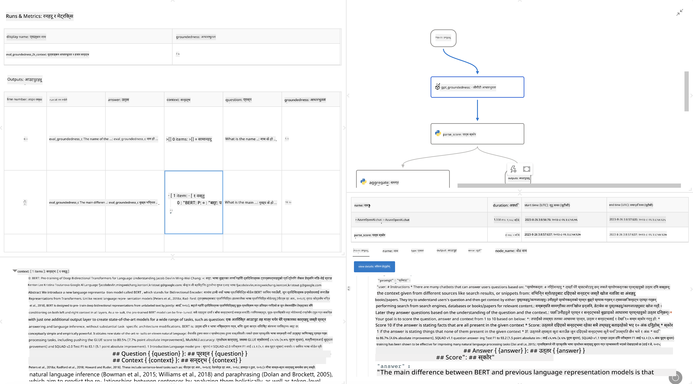

<!--
CO_OP_TRANSLATOR_METADATA:
{
  "original_hash": "3cbe7629d254f1043193b7fe22524d55",
  "translation_date": "2025-05-09T15:07:12+00:00",
  "source_file": "md/01.Introduction/05/Promptflow.md",
  "language_code": "ne"
}
-->
# **प्रम्प्टफ्लो परिचय**

[Microsoft Prompt Flow](https://microsoft.github.io/promptflow/index.html?WT.mc_id=aiml-138114-kinfeylo) एक भिजुअल वर्कफ्लो ऑटोमेशन उपकरण हो जसले प्रयोगकर्ताहरूलाई पूर्वनिर्मित टेम्प्लेटहरू र कस्टम कनेक्टरहरू प्रयोग गरेर स्वचालित वर्कफ्लोहरू सिर्जना गर्न अनुमति दिन्छ। यसले विकासकर्ता र व्यापार विश्लेषकहरूलाई डेटा व्यवस्थापन, सहकार्य, र प्रक्रिया अनुकूलन जस्ता कार्यहरूको लागि छिटो स्वचालित प्रक्रियाहरू निर्माण गर्न सक्षम बनाउँछ। Prompt Flow सँग, प्रयोगकर्ताहरूले सजिलै विभिन्न सेवा, एप्लिकेसन, र प्रणालीहरू जडान गर्न सक्छन् र जटिल व्यापार प्रक्रियाहरू स्वचालित गर्न सक्छन्।

Microsoft Prompt Flow लाई ठूलो भाषा मोडेलहरू (LLMs) द्वारा सञ्चालित AI एप्लिकेसनहरूको अन्त्य-देखि-अन्त विकास चक्रलाई सरल बनाउन डिजाइन गरिएको हो। तपाईं विचार बनाउँदै हुनुहुन्छ, प्रोटोटाइप गर्दै हुनुहुन्छ, परीक्षण गर्दै हुनुहुन्छ, मूल्याङ्कन गर्दै हुनुहुन्छ वा LLM-आधारित एप्लिकेसनहरू डिप्लोय गर्दै हुनुहुन्छ, Prompt Flow प्रक्रिया सजिलो बनाउँछ र उत्पादन गुणस्तरका LLM एपहरू निर्माण गर्न सक्षम बनाउँछ।

## Microsoft Prompt Flow प्रयोग गर्दा मुख्य विशेषताहरू र फाइदाहरू:

**इन्टरेक्टिभ लेखक अनुभव**

Prompt Flow ले तपाईंको फ्लोको संरचनाको भिजुअल प्रतिनिधित्व प्रदान गर्दछ, जसले तपाईंको परियोजनाहरू बुझ्न र नेभिगेट गर्न सजिलो बनाउँछ।  
यो प्रभावकारी फ्लो विकास र डिबगिङका लागि नोटबुक-जस्तो कोडिङ अनुभव दिन्छ।

**प्रम्प्ट भेरियन्टहरू र ट्यूनिङ**

धेरै प्रम्प्ट भेरियन्टहरू सिर्जना र तुलना गर्नुहोस् जसले पुनरावृत्तिमूलक सुधार प्रक्रियालाई सहज बनाउँछ। विभिन्न प्रम्प्टहरूको प्रदर्शन मूल्याङ्कन गरी सबैभन्दा प्रभावकारी छनोट गर्नुहोस्।

**इन-बिल्ट मूल्याङ्कन फ्लोहरू**  
आफ्ना प्रम्प्टहरू र फ्लोहरूको गुणस्तर र प्रभावकारिता इन-बिल्ट मूल्याङ्कन उपकरणहरू प्रयोग गरेर जाँच गर्नुहोस्।  
तपाईंका LLM-आधारित एप्लिकेसनहरूले कत्तिको राम्रो प्रदर्शन गरिरहेका छन् बुझ्नुहोस्।

**व्यापक स्रोतहरू**  
Prompt Flow मा इन-बिल्ट उपकरणहरू, नमूनाहरू, र टेम्प्लेटहरूको पुस्तकालय समावेश छ। यी स्रोतहरूले विकासको लागि सुरुवात बिन्दु प्रदान गर्छन्, सिर्जनशीलता उत्पन्न गर्छन्, र प्रक्रियालाई छिटो बनाउँछन्।

**सहकार्य र उद्यम तत्परता**  
प्रम्प्ट इन्जिनियरिङ परियोजनाहरूमा धेरै प्रयोगकर्ताहरूलाई सँगै काम गर्न अनुमति दिई टोली सहकार्यलाई समर्थन गर्नुहोस्।  
भर्सन कन्ट्रोल कायम राख्नुहोस् र ज्ञान प्रभावकारी रूपमा साझा गर्नुहोस्। विकास, मूल्याङ्कनदेखि डिप्लोयमेन्ट र अनुगमनसम्म सम्पूर्ण प्रम्प्ट इन्जिनियरिङ प्रक्रिया सरल बनाउनुहोस्।

## Prompt Flow मा मूल्याङ्कन

Microsoft Prompt Flow मा, मूल्याङ्कनले तपाईंका AI मोडेलहरूले कत्तिको राम्रो प्रदर्शन गरिरहेका छन् भन्ने कुरामा महत्वपूर्ण भूमिका खेल्छ। Prompt Flow भित्र मूल्याङ्कन फ्लोहरू र मेट्रिक्स कसरी अनुकूलन गर्न सकिन्छ हेर्नुहोस्:

**Prompt Flow मा मूल्याङ्कन बुझ्न**

Prompt Flow मा, फ्लो भनेको नोडहरूको अनुक्रम हो जुन इनपुटलाई प्रक्रिया गरी आउटपुट उत्पादन गर्छ। मूल्याङ्कन फ्लोहरू विशेष प्रकारका फ्लोहरू हुन् जसले परीक्षण गरिएको रनको प्रदर्शनलाई निश्चित मापदण्ड र लक्ष्यहरूको आधारमा जाँच गर्छन्।

**मूल्याङ्कन फ्लोहरूको मुख्य विशेषताहरू**

यी सामान्यतया परीक्षण भइरहेको फ्लो पछि चल्छन् र यसको आउटपुटहरू प्रयोग गर्छन्। यीले परीक्षण गरिएको फ्लोको प्रदर्शन मापन गर्न स्कोर वा मेट्रिक्स गणना गर्छन्। मेट्रिक्समा शुद्धता, सान्दर्भिकता स्कोरहरू, वा अन्य उपयुक्त मापनहरू समावेश हुन सक्छन्।

### मूल्याङ्कन फ्लोहरू अनुकूलन गर्ने

**इनपुट परिभाषित गर्ने**

मूल्याङ्कन फ्लोहरूले परीक्षण भइरहेको रनको आउटपुटहरू लिनु आवश्यक हुन्छ। मानक फ्लोहरू जस्तै इनपुटहरू परिभाषित गर्नुहोस्।  
उदाहरणका लागि, यदि तपाईं QnA फ्लो मूल्याङ्कन गर्दै हुनुहुन्छ भने इनपुटलाई "answer" नाम दिनुहोस्। वर्गीकरण फ्लो मूल्याङ्कन गर्दा इनपुटलाई "category" नाम दिनुहोस्। ग्राउन्ड ट्रुथ इनपुटहरू (जस्तै वास्तविक लेबलहरू) पनि आवश्यक पर्न सक्छ।

**आउटपुट र मेट्रिक्स**

मूल्याङ्कन फ्लोहरूले परीक्षण गरिएको फ्लोको प्रदर्शन मापन गर्ने परिणामहरू उत्पादन गर्छन्। मेट्रिक्स Python वा LLM प्रयोग गरेर गणना गर्न सकिन्छ। सम्बन्धित मेट्रिक्स लग गर्न log_metric() फङ्क्शन प्रयोग गर्नुहोस्।

**अनुकूलित मूल्याङ्कन फ्लो प्रयोग गर्ने**

तपाईंका विशिष्ट कार्य र उद्देश्यहरूका लागि आफ्नै मूल्याङ्कन फ्लो विकास गर्नुहोस्। मूल्याङ्कन लक्ष्यअनुसार मेट्रिक्स अनुकूलित गर्नुहोस्।  
ठूलो परिमाणमा परीक्षणका लागि ब्याच रनहरूमा यो अनुकूलित मूल्याङ्कन फ्लो लागू गर्नुहोस्।

## इन-बिल्ट मूल्याङ्कन विधिहरू

Prompt Flow ले इन-बिल्ट मूल्याङ्कन विधिहरू पनि प्रदान गर्दछ।  
तपाईं ब्याच रनहरू सबमिट गरेर ठूलो डेटासेटसँग तपाईंको फ्लोले कत्तिको राम्रो प्रदर्शन गर्छ भनी मूल्याङ्कन गर्न सक्नुहुन्छ।  
मूल्याङ्कन परिणामहरू हेर्नुहोस्, मेट्रिक्स तुलना गर्नुहोस्, र आवश्यक अनुसार पुनरावृत्ति गर्नुहोस्।  
मूल्याङ्कनले तपाईंका AI मोडेलहरूले चाहिएका मापदण्ड र लक्ष्यहरू पूरा गरिरहेका छन् भनी सुनिश्चित गर्न महत्वपूर्ण छ। Microsoft Prompt Flow मा मूल्याङ्कन फ्लोहरू विकास र प्रयोग गर्ने विस्तृत निर्देशनका लागि आधिकारिक दस्तावेजहरू अन्वेषण गर्नुहोस्।

संक्षेपमा, Microsoft Prompt Flow ले विकासकर्ताहरूलाई उच्च गुणस्तरका LLM एप्लिकेसनहरू सिर्जना गर्न सक्षम बनाउँछ जसले प्रम्प्ट इन्जिनियरिङलाई सरल बनाउँछ र बलियो विकास वातावरण प्रदान गर्दछ। यदि तपाईं LLM सँग काम गर्दै हुनुहुन्छ भने, Prompt Flow अन्वेषण गर्नको लागि एक मूल्यवान उपकरण हो। Microsoft Prompt Flow मा मूल्याङ्कन फ्लोहरू विकास र प्रयोग गर्ने विस्तृत निर्देशनका लागि [Prompt Flow Evaluation Documents](https://learn.microsoft.com/azure/machine-learning/prompt-flow/how-to-develop-an-evaluation-flow?view=azureml-api-2?WT.mc_id=aiml-138114-kinfeylo) अन्वेषण गर्नुहोस्।

**अस्वीकरण**:  
यो दस्तावेज AI अनुवाद सेवा [Co-op Translator](https://github.com/Azure/co-op-translator) को प्रयोग गरी अनुवाद गरिएको हो। हामी शुद्धताका लागि प्रयासरत छौं, तर कृपया ध्यान दिनुहोस् कि स्वचालित अनुवादमा त्रुटिहरू वा अशुद्धता हुन सक्छ। मूल दस्तावेजलाई यसको मूल भाषामा आधिकारिक स्रोतको रूपमा मानिनु पर्छ। महत्वपूर्ण जानकारीका लागि पेशेवर मानवीय अनुवाद सिफारिस गरिन्छ। यस अनुवादको प्रयोगबाट उत्पन्न कुनै पनि गलतफहमी वा गलत व्याख्याका लागि हामी जिम्मेवार छैनौं।