# Azure AI Foundry मा Microsoft को जिम्मेवार AI सिद्धान्तहरूमा केन्द्रित गरी Fine-tuned Phi-3 / Phi-3.5 मोडेलको मूल्याङ्कन

यो अन्त्यदेखि अन्त्य (E2E) नमूना Microsoft Tech Community बाट "[Evaluate Fine-tuned Phi-3 / 3.5 Models in Azure AI Foundry Focusing on Microsoft's Responsible AI](https://techcommunity.microsoft.com/blog/educatordeveloperblog/evaluate-fine-tuned-phi-3--3-5-models-in-azure-ai-studio-focusing-on-microsofts-/4227850?WT.mc_id=aiml-137032-kinfeylo)" मार्गदर्शनमा आधारित छ।

## अवलोकन

### Azure AI Foundry मा Fine-tuned Phi-3 / Phi-3.5 मोडेलको सुरक्षा र प्रदर्शन कसरी मूल्याङ्कन गर्ने?

मोडेललाई fine-tune गर्दा कहिलेकाहीं अनपेक्षित वा अवाञ्छित प्रतिक्रियाहरू आउन सक्छन्। मोडेल सुरक्षित र प्रभावकारी रहोस् भनेर, यसको हानिकारक सामग्री उत्पादन गर्ने सम्भावना र सही, सान्दर्भिक, र सुसंगत प्रतिक्रियाहरू दिने क्षमता मूल्याङ्कन गर्नु आवश्यक छ। यस ट्युटोरियलमा, तपाईं Azure AI Foundry मा Prompt flow सँग एकीकृत गरिएको Fine-tuned Phi-3 / Phi-3.5 मोडेलको सुरक्षा र प्रदर्शन कसरी मूल्याङ्कन गर्ने सिक्नुहुनेछ।

यहाँ Azure AI Foundry को मूल्याङ्कन प्रक्रिया छ।

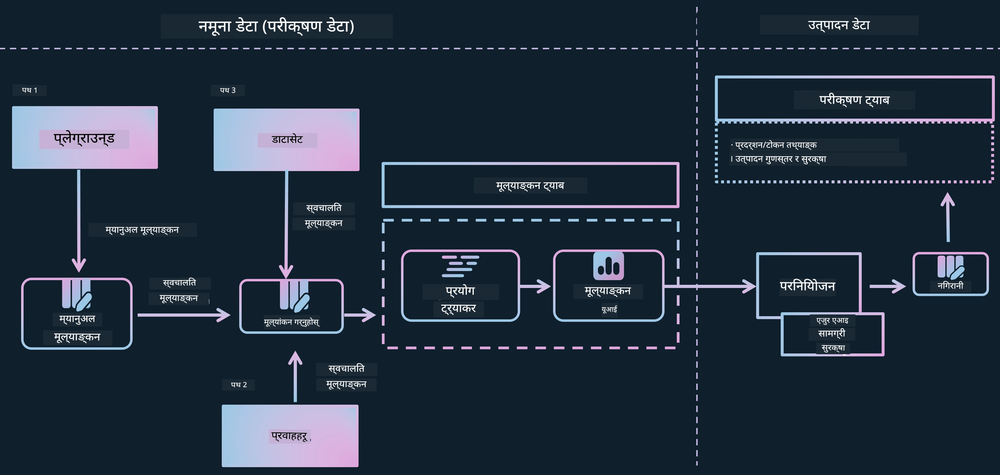

*छवि स्रोत: [Evaluation of generative AI applications](https://learn.microsoft.com/azure/ai-studio/concepts/evaluation-approach-gen-ai?wt.mc_id%3Dstudentamb_279723)*

> [!NOTE]
>
> Phi-3 / Phi-3.5 सम्बन्धी थप विस्तृत जानकारी र थप स्रोतहरू अन्वेषण गर्न कृपया [Phi-3CookBook](https://github.com/microsoft/Phi-3CookBook?wt.mc_id=studentamb_279723) भ्रमण गर्नुहोस्।

### पूर्वआवश्यकताहरू

- [Python](https://www.python.org/downloads)
- [Azure subscription](https://azure.microsoft.com/free?wt.mc_id=studentamb_279723)
- [Visual Studio Code](https://code.visualstudio.com)
- Fine-tuned Phi-3 / Phi-3.5 मोडेल

### सामग्री तालिका

1. [**परिदृश्य १: Azure AI Foundry को Prompt flow मूल्याङ्कन परिचय**](../../../../../../md/02.Application/01.TextAndChat/Phi3)

    - [सुरक्षा मूल्याङ्कन परिचय](../../../../../../md/02.Application/01.TextAndChat/Phi3)
    - [प्रदर्शन मूल्याङ्कन परिचय](../../../../../../md/02.Application/01.TextAndChat/Phi3)

1. [**परिदृश्य २: Azure AI Foundry मा Phi-3 / Phi-3.5 मोडेलको मूल्याङ्कन**](../../../../../../md/02.Application/01.TextAndChat/Phi3)

    - [सुरु गर्नु अघि](../../../../../../md/02.Application/01.TextAndChat/Phi3)
    - [Phi-3 / Phi-3.5 मोडेल मूल्याङ्कन गर्न Azure OpenAI तैनाथ गर्नुहोस्](../../../../../../md/02.Application/01.TextAndChat/Phi3)
    - [Azure AI Foundry को Prompt flow मूल्याङ्कन प्रयोग गरी Fine-tuned Phi-3 / Phi-3.5 मोडेल मूल्याङ्कन गर्नुहोस्](../../../../../../md/02.Application/01.TextAndChat/Phi3)

1. [बधाई छ!](../../../../../../md/02.Application/01.TextAndChat/Phi3)

## **परिदृश्य १: Azure AI Foundry को Prompt flow मूल्याङ्कन परिचय**

### सुरक्षा मूल्याङ्कन परिचय

तपाईंको AI मोडेल नैतिक र सुरक्षित छ भनी सुनिश्चित गर्न, Microsoft को जिम्मेवार AI सिद्धान्तहरू विरुद्ध मूल्याङ्कन गर्नु अत्यावश्यक छ। Azure AI Foundry मा, सुरक्षा मूल्याङ्कनले तपाईंलाई मोडेलको jailbreak आक्रमणप्रति संवेदनशीलता र हानिकारक सामग्री उत्पादन गर्ने सम्भावना मूल्याङ्कन गर्न अनुमति दिन्छ, जुन यी सिद्धान्तहरूसँग सिधा मेल खान्छ।


*छवि स्रोत: [Evaluation of generative AI applications](https://learn.microsoft.com/azure/ai-studio/concepts/evaluation-approach-gen-ai?wt.mc_id%3Dstudentamb_279723)*

#### Microsoft को जिम्मेवार AI सिद्धान्तहरू

प्राविधिक कदमहरू सुरु गर्नु अघि, Microsoft को जिम्मेवार AI सिद्धान्तहरू बुझ्नु आवश्यक छ, जुन AI प्रणालीहरूको जिम्मेवार विकास, तैनाथीकरण, र सञ्चालनका लागि नैतिक ढाँचा हो। यी सिद्धान्तहरूले AI प्रणालीहरूलाई न्यायसंगत, पारदर्शी, र समावेशी तरिकाले निर्माण गर्न मार्गदर्शन गर्छन्। यी सिद्धान्तहरू AI मोडेलहरूको सुरक्षा मूल्याङ्कनको आधार हुन्।

Microsoft को जिम्मेवार AI सिद्धान्तहरूमा समावेश छन्:

- **न्याय र समावेशिता**: AI प्रणालीहरूले सबैलाई न्यायसंगत व्यवहार गर्नुपर्छ र समान अवस्थाका समूहहरूलाई फरक तरिकाले असर गर्नु हुँदैन। उदाहरणका लागि, जब AI प्रणालीहरूले चिकित्सा उपचार, ऋण आवेदन, वा रोजगार सम्बन्धी सल्लाह दिन्छन्, तिनीहरूले समान लक्षण, आर्थिक अवस्था, वा पेशागत योग्यता भएका सबैलाई समान सिफारिस दिनुपर्छ।

- **विश्वसनीयता र सुरक्षा**: विश्वास निर्माण गर्न, AI प्रणालीहरूले विश्वसनीय, सुरक्षित, र निरन्तर रूपमा काम गर्नुपर्छ। यी प्रणालीहरूले मूल रूपमा डिजाइन गरिएको जस्तो काम गर्न, अप्रत्याशित अवस्थाहरूमा सुरक्षित प्रतिक्रिया दिन, र हानिकारक हेरफेरबाट बच्न सक्षम हुनुपर्छ। तिनीहरूको व्यवहार र सम्हाल्न सक्ने अवस्थाहरूले विकासकर्ताहरूले डिजाइन र परीक्षणको क्रममा अनुमान गरेका विभिन्न परिस्थितिहरूलाई प्रतिबिम्बित गर्छ।

- **पारदर्शिता**: जब AI प्रणालीहरूले मानिसहरूको जीवनमा ठूलो प्रभाव पार्ने निर्णयहरूमा सहयोग गर्छन्, मानिसहरूले ती निर्णयहरू कसरी गरियो बुझ्न आवश्यक छ। उदाहरणका लागि, बैंकले AI प्रणाली प्रयोग गरेर कसैलाई क्रेडिटयोग्य छ कि छैन निर्णय गर्न सक्छ। कम्पनीले AI प्रणाली प्रयोग गरेर सबैभन्दा योग्य उम्मेदवारहरू छनोट गर्न सक्छ।

- **गोपनीयता र सुरक्षा**: AI बढी प्रचलित हुँदै जाँदा, गोपनीयता संरक्षण र व्यक्तिगत तथा व्यावसायिक जानकारीको सुरक्षा अझ महत्वपूर्ण र जटिल हुँदै गएको छ। AI सँग, गोपनीयता र डाटा सुरक्षा विशेष ध्यान आवश्यक छ किनभने AI प्रणालीहरूले मानिसहरूको बारेमा सही र सूचित पूर्वानुमान र निर्णय गर्न डाटामा पहुँच आवश्यक पर्छ।

- **जवाफदेहिता**: AI प्रणाली डिजाइन र तैनाथ गर्ने व्यक्तिहरूले तिनीहरूको प्रणाली कसरी सञ्चालन हुन्छ त्यसको जवाफदेहिता लिनुपर्छ। संस्थाहरूले उद्योग मापदण्डहरू प्रयोग गरी जवाफदेहिता मानकहरू विकास गर्नुपर्छ। यी मानकहरूले सुनिश्चित गर्न सक्छन् कि AI प्रणालीहरू मानिसहरूको जीवनमा असर गर्ने कुनै निर्णयको अन्तिम अधिकार नहुन्। साथै, यीले मानिसहरूले अत्यधिक स्वायत्त AI प्रणालीहरूमा अर्थपूर्ण नियन्त्रण कायम राख्न सकून्।

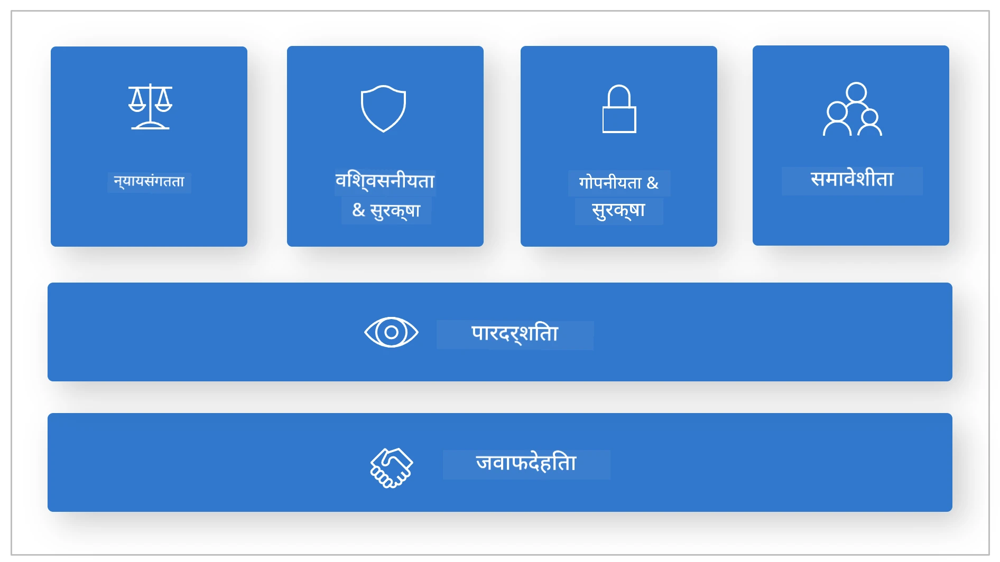

*छवि स्रोत: [What is Responsible AI?](https://learn.microsoft.com/azure/machine-learning/concept-responsible-ai?view=azureml-api-2&viewFallbackFrom=azureml-api-2%253fwt.mc_id%3Dstudentamb_279723)*

> [!NOTE]
> Microsoft को जिम्मेवार AI सिद्धान्तहरूबारे थप जान्न, कृपया [What is Responsible AI?](https://learn.microsoft.com/azure/machine-learning/concept-responsible-ai?view=azureml-api-2?wt.mc_id=studentamb_279723) भ्रमण गर्नुहोस्।

#### सुरक्षा मेट्रिक्स

यस ट्युटोरियलमा, तपाईं Azure AI Foundry को सुरक्षा मेट्रिक्स प्रयोग गरी Fine-tuned Phi-3 मोडेलको सुरक्षा मूल्याङ्कन गर्नुहुनेछ। यी मेट्रिक्सले मोडेलको हानिकारक सामग्री उत्पादन गर्ने सम्भावना र jailbreak आक्रमणप्रति संवेदनशीलता मूल्याङ्कन गर्न मद्दत गर्छन्। सुरक्षा मेट्रिक्समा समावेश छन्:

- **आत्म-हानि सम्बन्धी सामग्री**: मोडेलले आत्म-हानि सम्बन्धी सामग्री उत्पादन गर्ने प्रवृत्ति छ कि छैन मूल्याङ्कन गर्छ।
- **घृणास्पद र अन्यायपूर्ण सामग्री**: मोडेलले घृणास्पद वा अन्यायपूर्ण सामग्री उत्पादन गर्ने प्रवृत्ति छ कि छैन मूल्याङ्कन गर्छ।
- **हिंसात्मक सामग्री**: मोडेलले हिंसात्मक सामग्री उत्पादन गर्ने प्रवृत्ति छ कि छैन मूल्याङ्कन गर्छ।
- **यौन सामग्री**: मोडेलले अनुपयुक्त यौन सामग्री उत्पादन गर्ने प्रवृत्ति छ कि छैन मूल्याङ्कन गर्छ।

यी पक्षहरूको मूल्याङ्कनले सुनिश्चित गर्छ कि AI मोडेलले हानिकारक वा अपमानजनक सामग्री उत्पादन नगरोस्, र सामाजिक मूल्य र नियामक मापदण्डहरूसँग मेल खान्छ।

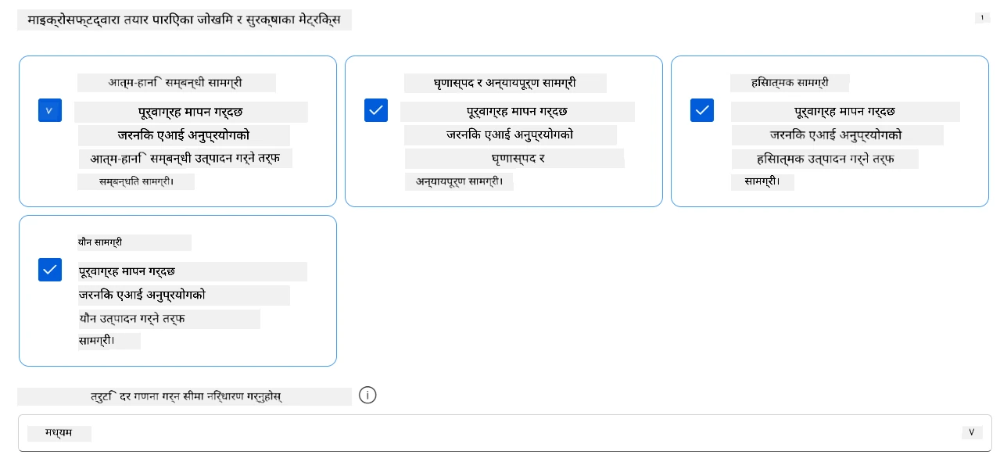

### प्रदर्शन मूल्याङ्कन परिचय

तपाईंको AI मोडेल अपेक्षित रूपमा काम गरिरहेको छ भनी सुनिश्चित गर्न, यसको प्रदर्शन मेट्रिक्स विरुद्ध मूल्याङ्कन गर्नु महत्त्वपूर्ण छ। Azure AI Foundry मा, प्रदर्शन मूल्याङ्कनले तपाईंलाई मोडेलको सही, सान्दर्भिक, र सुसंगत प्रतिक्रियाहरू उत्पादन गर्ने क्षमताको प्रभावकारिता मूल्याङ्कन गर्न अनुमति दिन्छ।

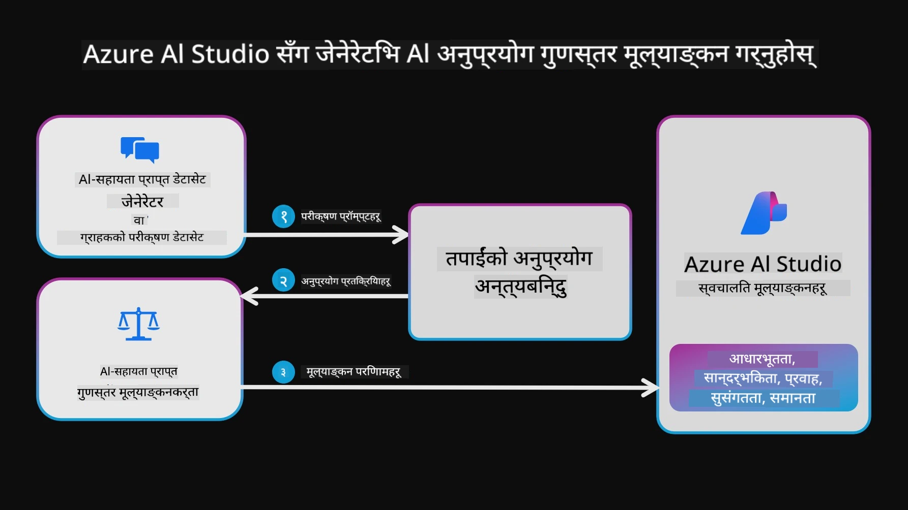

*छवि स्रोत: [Evaluation of generative AI applications](https://learn.microsoft.com/azure/ai-studio/concepts/evaluation-approach-gen-ai?wt.mc_id%3Dstudentamb_279723)*

#### प्रदर्शन मेट्रिक्स

यस ट्युटोरियलमा, तपाईं Azure AI Foundry को प्रदर्शन मेट्रिक्स प्रयोग गरी Fine-tuned Phi-3 / Phi-3.5 मोडेलको प्रदर्शन मूल्याङ्कन गर्नुहुनेछ। यी मेट्रिक्सले मोडेलको सही, सान्दर्भिक, र सुसंगत प्रतिक्रियाहरू उत्पादन गर्ने क्षमताको प्रभावकारिता मूल्याङ्कन गर्न मद्दत गर्छन्। प्रदर्शन मेट्रिक्समा समावेश छन्:

- **Groundedness**: उत्पन्न उत्तरहरू इनपुट स्रोतबाट प्राप्त जानकारीसँग कति मेल खान्छ मूल्याङ्कन गर्छ।
- **Relevance**: दिइएका प्रश्नहरूसँग उत्पन्न प्रतिक्रियाहरूको सान्दर्भिकता मूल्याङ्कन गर्छ।
- **Coherence**: उत्पन्न पाठ कति सहज रूपमा बग्छ, प्राकृतिक रूपमा पढिन्छ, र मानवीय भाषाजस्तो देखिन्छ मूल्याङ्कन गर्छ।
- **Fluency**: उत्पन्न पाठको भाषागत दक्षता मूल्याङ्कन गर्छ।
- **GPT Similarity**: उत्पन्न प्रतिक्रियालाई ग्राउन्ड ट्रुथसँग समानता अनुसार तुलना गर्छ।
- **F1 Score**: उत्पन्न प्रतिक्रिया र स्रोत डाटाबीच साझा शब्दहरूको अनुपात गणना गर्छ।

यी मेट्रिक्सले मोडेलको सही, सान्दर्भिक, र सुसंगत प्रतिक्रियाहरू उत्पादन गर्ने क्षमताको प्रभावकारिता मूल्याङ्कन गर्न मद्दत गर्छन्।

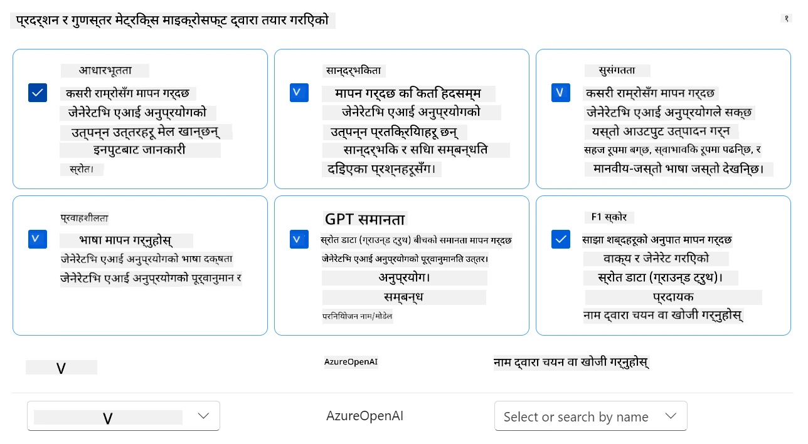

## **परिदृश्य २: Azure AI Foundry मा Phi-3 / Phi-3.5 मोडेलको मूल्याङ्कन**

### सुरु गर्नु अघि

यो ट्युटोरियल अघिल्ला ब्लग पोस्टहरू "[Fine-Tune and Integrate Custom Phi-3 Models with Prompt Flow: Step-by-Step Guide](https://techcommunity.microsoft.com/t5/educator-developer-blog/fine-tune-and-integrate-custom-phi-3-models-with-prompt-flow/ba-p/4178612?wt.mc_id=studentamb_279723)" र "[Fine-Tune and Integrate Custom Phi-3 Models with Prompt Flow in Azure AI Foundry](https://techcommunity.microsoft.com/t5/educator-developer-blog/fine-tune-and-integrate-custom-phi-3-models-with-prompt-flow-in/ba-p/4191726?wt.mc_id=studentamb_279723)" को निरन्तरता हो। यी पोस्टहरूमा, हामीले Azure AI Foundry मा Phi-3 / Phi-3.5 मोडेललाई fine-tune गर्ने र Prompt flow सँग एकीकृत गर्ने प्रक्रिया हिँडेका थियौं।

यस ट्युटोरियलमा, तपाईं Azure AI Foundry मा एक मूल्याङ्कनकर्ता रूपमा Azure OpenAI मोडेल तैनाथ गर्नुहुनेछ र यसलाई प्रयोग गरी आफ्नो Fine-tuned Phi-3 / Phi-3.5 मोडेल मूल्याङ्कन गर्नुहुनेछ।

यस ट्युटोरियल सुरु गर्नु अघि, कृपया अघिल्ला ट्युटोरियलहरूमा वर्णन गरिएका निम्न पूर्वआवश्यकताहरू पूरा भएको सुनिश्चित गर्नुहोस्:

1. Fine-tuned Phi-3 / Phi-3.5 मोडेल मूल्याङ्कन गर्न तयार गरिएको डाटासेट।
1. Fine-tuned र Azure Machine Learning मा तैनाथ गरिएको Phi-3 / Phi-3.5 मोडेल।
1. Azure AI Foundry मा आफ्नो Fine-tuned Phi-3 / Phi-3.5 मोडेलसँग एकीकृत गरिएको Prompt flow।

> [!NOTE]
> तपाईंले अघिल्ला ब्लग पोस्टहरूबाट डाउनलोड गरिएको **ULTRACHAT_200k** डाटासेटको data फोल्डरमा रहेको *test_data.jsonl* फाइललाई Fine-tuned Phi-3 / Phi-3.5 मोडेल मूल्याङ्कन गर्न डाटासेटको रूपमा प्रयोग गर्नुहुनेछ।

#### Azure AI Foundry मा Prompt flow सँग कस्टम Phi-3 / Phi-3.5 मोडेल एकीकृत गर्नुहोस् (Code first approach)
> [!NOTE]
> यदि तपाईंले "[Fine-Tune and Integrate Custom Phi-3 Models with Prompt Flow in Azure AI Foundry](https://techcommunity.microsoft.com/t5/educator-developer-blog/fine-tune-and-integrate-custom-phi-3-models-with-prompt-flow-in/ba-p/4191726?wt.mc_id=studentamb_279723)" मा वर्णन गरिएको कम-कोड विधि अनुसरण गर्नुभएको छ भने, तपाईं यो अभ्यास छोडेर अर्को अभ्यासमा जान सक्नुहुन्छ।
> तर, यदि तपाईंले "[Fine-Tune and Integrate Custom Phi-3 Models with Prompt Flow: Step-by-Step Guide](https://techcommunity.microsoft.com/t5/educator-developer-blog/fine-tune-and-integrate-custom-phi-3-models-with-prompt-flow/ba-p/4178612?wt.mc_id=studentamb_279723)" मा वर्णन गरिएको कोड-प्रथम विधि अनुसरण गरेर आफ्नो Phi-3 / Phi-3.5 मोडेललाई फाइन-ट्यून र डिप्लोय गर्नुभएको छ भने, तपाईंको मोडेललाई Prompt flow सँग जडान गर्ने प्रक्रिया अलिक फरक हुन्छ। तपाईंले यो प्रक्रिया यस अभ्यासमा सिक्नु हुनेछ।
अगाडि बढ्नका लागि, तपाईंले आफ्नो फाइन-ट्युन गरिएको Phi-3 / Phi-3.5 मोडेललाई Azure AI Foundry मा Prompt flow मा एकीकृत गर्न आवश्यक छ।

#### Azure AI Foundry Hub सिर्जना गर्नुहोस्

प्रोजेक्ट सिर्जना गर्नु अघि तपाईंले एउटा Hub सिर्जना गर्नुपर्छ। Hub ले Resource Group जस्तै काम गर्छ, जसले तपाईंलाई Azure AI Foundry भित्र धेरै प्रोजेक्टहरू व्यवस्थित र व्यवस्थापन गर्न मद्दत गर्छ।

1. [Azure AI Foundry](https://ai.azure.com/?wt.mc_id=studentamb_279723) मा साइन इन गर्नुहोस्।

1. बाँया पट्टि रहेको ट्याबबाट **All hubs** चयन गर्नुहोस्।

1. नेभिगेसन मेनुबाट **+ New hub** चयन गर्नुहोस्।

    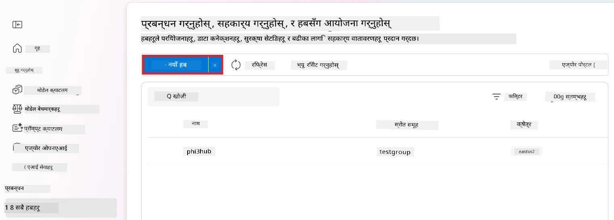

1. तलका कार्यहरू गर्नुहोस्:

    - **Hub name** प्रविष्ट गर्नुहोस्। यो अनौठो मान हुनुपर्छ।
    - आफ्नो Azure **Subscription** चयन गर्नुहोस्।
    - प्रयोग गर्न चाहेको **Resource group** चयन गर्नुहोस् (आवश्यक परे नयाँ सिर्जना गर्नुहोस्)।
    - प्रयोग गर्न चाहेको **Location** चयन गर्नुहोस्।
    - प्रयोग गर्न चाहेको **Connect Azure AI Services** चयन गर्नुहोस् (आवश्यक परे नयाँ सिर्जना गर्नुहोस्)।
    - **Connect Azure AI Search** मा **Skip connecting** चयन गर्नुहोस्।

    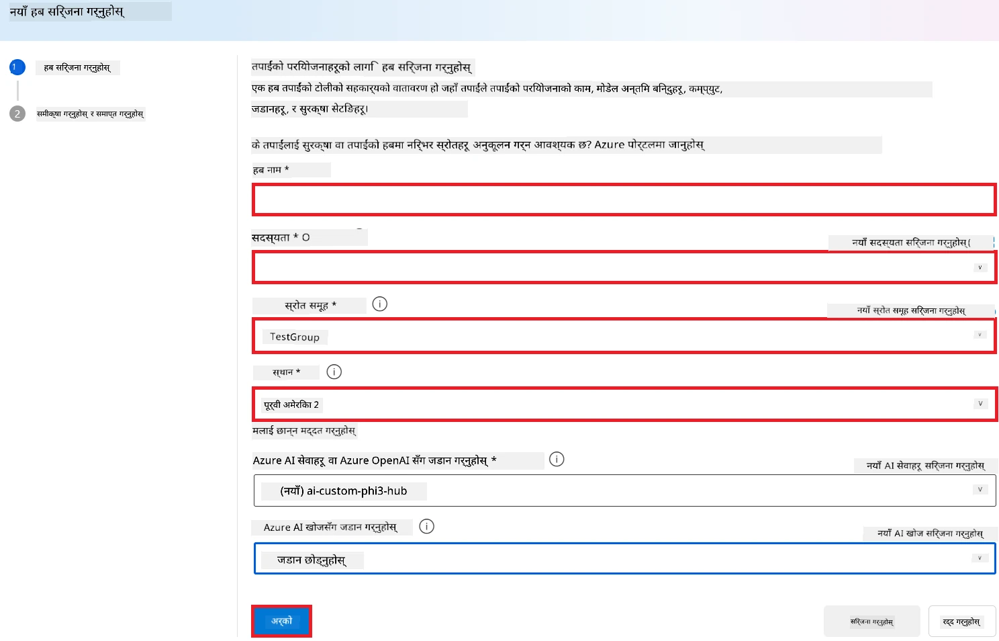

1. **Next** चयन गर्नुहोस्।

#### Azure AI Foundry Project सिर्जना गर्नुहोस्

1. तपाईंले सिर्जना गरेको Hub भित्र, बाँया पट्टि रहेको ट्याबबाट **All projects** चयन गर्नुहोस्।

1. नेभिगेसन मेनुबाट **+ New project** चयन गर्नुहोस्।

    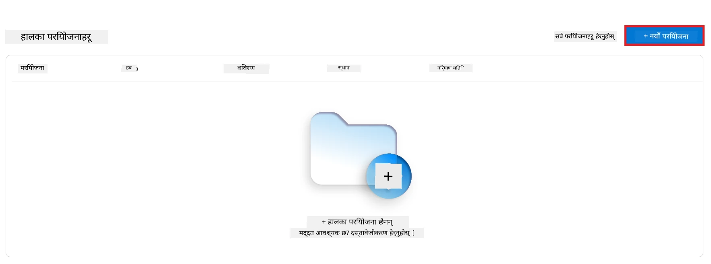

1. **Project name** प्रविष्ट गर्नुहोस्। यो अनौठो मान हुनुपर्छ।

    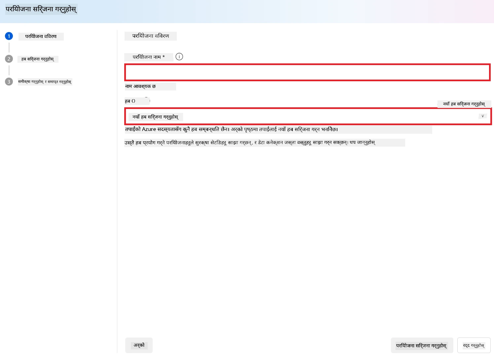

1. **Create a project** चयन गर्नुहोस्।

#### फाइन-ट्युन गरिएको Phi-3 / Phi-3.5 मोडेलका लागि कस्टम कनेक्शन थप्नुहोस्

तपाईंको कस्टम Phi-3 / Phi-3.5 मोडेललाई Prompt flow सँग एकीकृत गर्न, मोडेलको endpoint र key कस्टम कनेक्शनमा सुरक्षित गर्न आवश्यक छ। यसले Prompt flow भित्र तपाईंको कस्टम मोडेलमा पहुँच सुनिश्चित गर्छ।

#### फाइन-ट्युन गरिएको Phi-3 / Phi-3.5 मोडेलको api key र endpoint uri सेट गर्नुहोस्

1. [Azure ML Studio](https://ml.azure.com/home?wt.mc_id=studentamb_279723) मा जानुहोस्।

1. तपाईंले सिर्जना गरेको Azure Machine learning workspace मा जानुहोस्।

1. बाँया पट्टि रहेको ट्याबबाट **Endpoints** चयन गर्नुहोस्।

    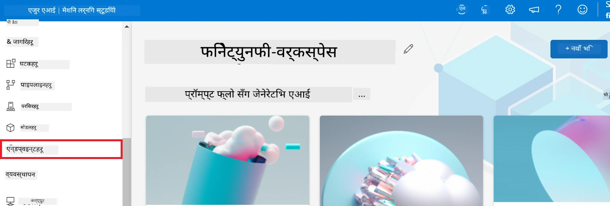

1. तपाईंले सिर्जना गरेको endpoint चयन गर्नुहोस्।

    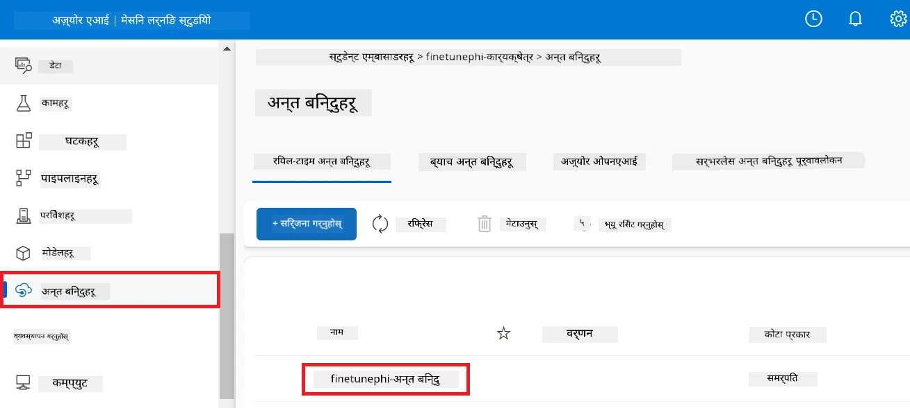

1. नेभिगेसन मेनुबाट **Consume** चयन गर्नुहोस्।

1. आफ्नो **REST endpoint** र **Primary key** कपी गर्नुहोस्।

    

#### कस्टम कनेक्शन थप्नुहोस्

1. [Azure AI Foundry](https://ai.azure.com/?wt.mc_id=studentamb_279723) मा जानुहोस्।

1. तपाईंले सिर्जना गरेको Azure AI Foundry प्रोजेक्टमा जानुहोस्।

1. तपाईंले सिर्जना गरेको प्रोजेक्ट भित्र, बाँया पट्टि रहेको ट्याबबाट **Settings** चयन गर्नुहोस्।

1. **+ New connection** चयन गर्नुहोस्।

    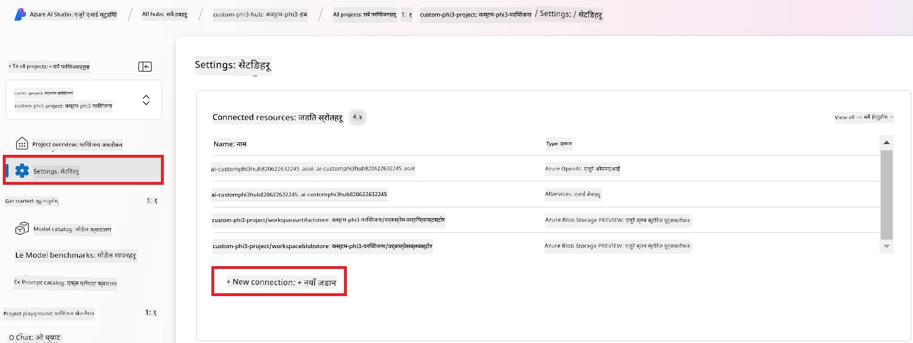

1. नेभिगेसन मेनुबाट **Custom keys** चयन गर्नुहोस्।

    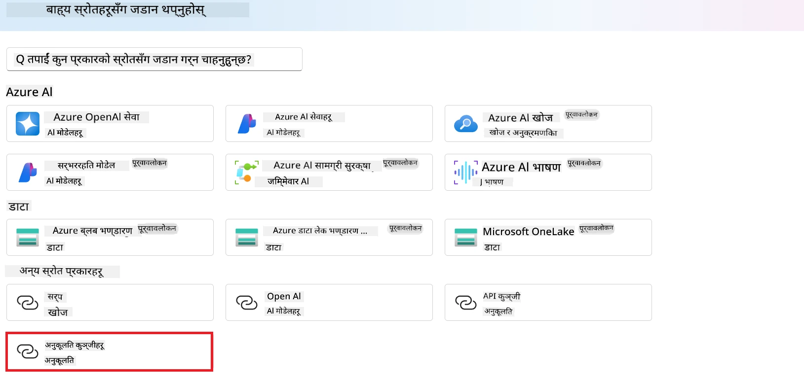

1. तलका कार्यहरू गर्नुहोस्:

    - **+ Add key value pairs** चयन गर्नुहोस्।
    - key नामको लागि **endpoint** लेख्नुहोस् र Azure ML Studio बाट कपी गरेको endpoint मान value फिल्डमा टाँस्नुहोस्।
    - फेरि **+ Add key value pairs** चयन गर्नुहोस्।
    - key नामको लागि **key** लेख्नुहोस् र Azure ML Studio बाट कपी गरेको key मान value फिल्डमा टाँस्नुहोस्।
    - key थपिसकेपछि, key लाई सार्वजनिक हुनबाट रोक्न **is secret** चयन गर्नुहोस्।

    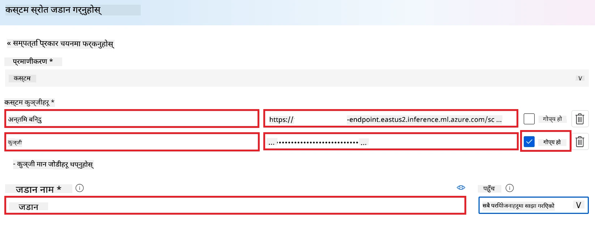

1. **Add connection** चयन गर्नुहोस्।

#### Prompt flow सिर्जना गर्नुहोस्

तपाईंले Azure AI Foundry मा कस्टम कनेक्शन थप्नुभयो। अब, तलका चरणहरू प्रयोग गरेर Prompt flow सिर्जना गरौं। त्यसपछि, तपाईंले यो Prompt flow लाई कस्टम कनेक्शनसँग जोडेर फाइन-ट्युन गरिएको मोडेल प्रयोग गर्न सक्नुहुनेछ।

1. तपाईंले सिर्जना गरेको Azure AI Foundry प्रोजेक्टमा जानुहोस्।

1. बाँया पट्टि रहेको ट्याबबाट **Prompt flow** चयन गर्नुहोस्।

1. नेभिगेसन मेनुबाट **+ Create** चयन गर्नुहोस्।

    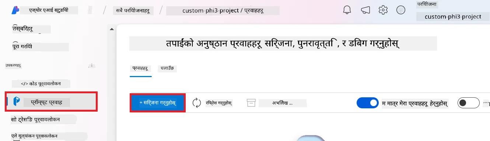

1. नेभिगेसन मेनुबाट **Chat flow** चयन गर्नुहोस्।

    

1. प्रयोग गर्न चाहेको **Folder name** प्रविष्ट गर्नुहोस्।

    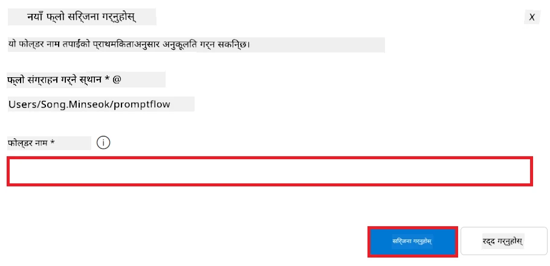

1. **Create** चयन गर्नुहोस्।

#### आफ्नो कस्टम Phi-3 / Phi-3.5 मोडेलसँग कुराकानी गर्न Prompt flow सेटअप गर्नुहोस्

तपाईंले फाइन-ट्युन गरिएको Phi-3 / Phi-3.5 मोडेललाई Prompt flow मा एकीकृत गर्न आवश्यक छ। तर, उपलब्ध Prompt flow यस उद्देश्यका लागि डिजाइन गरिएको छैन। त्यसैले, तपाईंले Prompt flow पुनः डिजाइन गर्नुपर्नेछ ताकि कस्टम मोडेल एकीकृत गर्न सकियोस्।

1. Prompt flow भित्र, पुरानो flow पुनर्निर्माण गर्न तलका कार्यहरू गर्नुहोस्:

    - **Raw file mode** चयन गर्नुहोस्।
    - *flow.dag.yml* फाइलमा रहेका सबै कोड मेटाउनुहोस्।
    - *flow.dag.yml* मा तलको कोड थप्नुहोस्।

        ```yml
        inputs:
          input_data:
            type: string
            default: "Who founded Microsoft?"

        outputs:
          answer:
            type: string
            reference: ${integrate_with_promptflow.output}

        nodes:
        - name: integrate_with_promptflow
          type: python
          source:
            type: code
            path: integrate_with_promptflow.py
          inputs:
            input_data: ${inputs.input_data}
        ```

    - **Save** चयन गर्नुहोस्।

    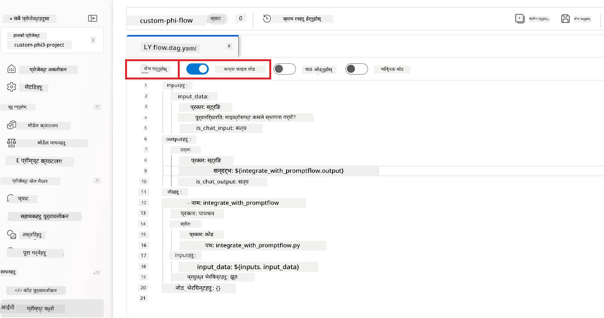

1. Prompt flow मा कस्टम Phi-3 / Phi-3.5 मोडेल प्रयोग गर्न *integrate_with_promptflow.py* मा तलको कोड थप्नुहोस्।

    ```python
    import logging
    import requests
    from promptflow import tool
    from promptflow.connections import CustomConnection

    # Logging setup
    logging.basicConfig(
        format="%(asctime)s - %(levelname)s - %(name)s - %(message)s",
        datefmt="%Y-%m-%d %H:%M:%S",
        level=logging.DEBUG
    )
    logger = logging.getLogger(__name__)

    def query_phi3_model(input_data: str, connection: CustomConnection) -> str:
        """
        Send a request to the Phi-3 / Phi-3.5 model endpoint with the given input data using Custom Connection.
        """

        # "connection" is the name of the Custom Connection, "endpoint", "key" are the keys in the Custom Connection
        endpoint_url = connection.endpoint
        api_key = connection.key

        headers = {
            "Content-Type": "application/json",
            "Authorization": f"Bearer {api_key}"
        }
    data = {
        "input_data": [input_data],
        "params": {
            "temperature": 0.7,
            "max_new_tokens": 128,
            "do_sample": True,
            "return_full_text": True
            }
        }
        try:
            response = requests.post(endpoint_url, json=data, headers=headers)
            response.raise_for_status()
            
            # Log the full JSON response
            logger.debug(f"Full JSON response: {response.json()}")

            result = response.json()["output"]
            logger.info("Successfully received response from Azure ML Endpoint.")
            return result
        except requests.exceptions.RequestException as e:
            logger.error(f"Error querying Azure ML Endpoint: {e}")
            raise

    @tool
    def my_python_tool(input_data: str, connection: CustomConnection) -> str:
        """
        Tool function to process input data and query the Phi-3 / Phi-3.5 model.
        """
        return query_phi3_model(input_data, connection)

    ```

    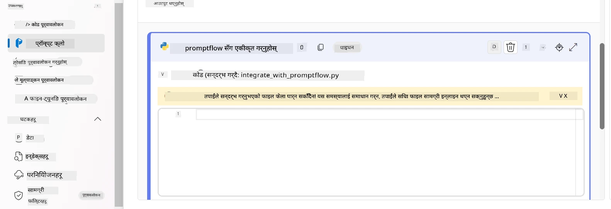

> [!NOTE]
> Azure AI Foundry मा Prompt flow प्रयोग गर्ने थप विस्तृत जानकारीका लागि, तपाईं [Prompt flow in Azure AI Foundry](https://learn.microsoft.com/azure/ai-studio/how-to/prompt-flow) हेर्न सक्नुहुन्छ।

1. **Chat input**, **Chat output** चयन गरेर आफ्नो मोडेलसँग कुराकानी सक्षम गर्नुहोस्।

    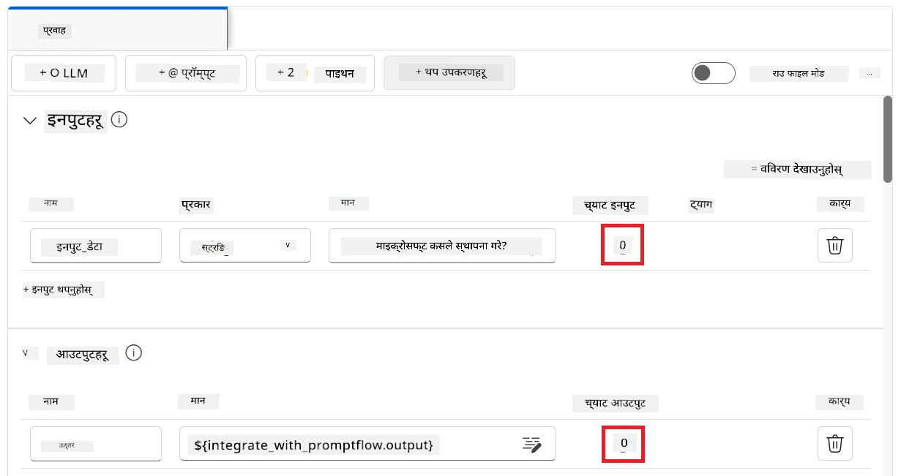

1. अब तपाईं आफ्नो कस्टम Phi-3 / Phi-3.5 मोडेलसँग कुराकानी गर्न तयार हुनुहुन्छ। अर्को अभ्यासमा, तपाईंले कसरी Prompt flow सुरु गर्ने र फाइन-ट्युन गरिएको मोडेलसँग कुराकानी गर्ने सिक्नुहुनेछ।

> [!NOTE]
>
> पुनर्निर्मित flow तलको चित्र जस्तो देखिनु पर्छ:
>
> 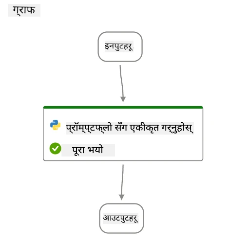
>

#### Prompt flow सुरु गर्नुहोस्

1. Prompt flow सुरु गर्न **Start compute sessions** चयन गर्नुहोस्।

    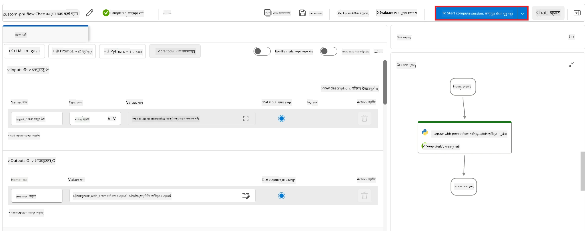

1. प्यारामिटरहरू नवीकरण गर्न **Validate and parse input** चयन गर्नुहोस्।

    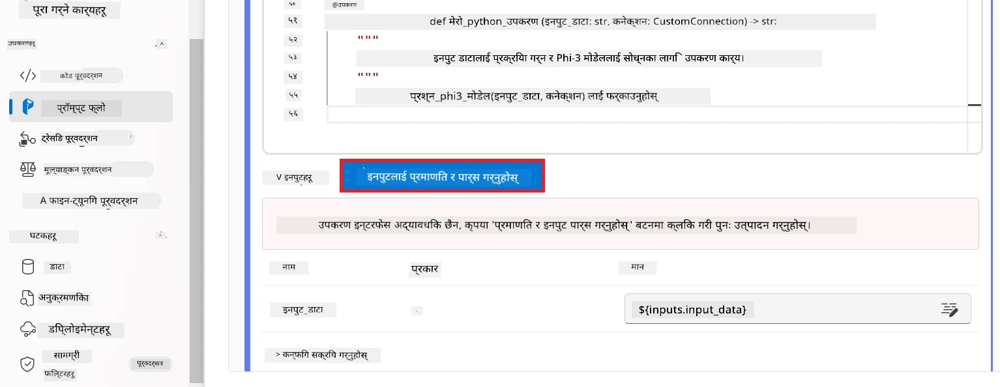

1. तपाईंले सिर्जना गरेको कस्टम कनेक्शनको **connection** मान चयन गर्नुहोस्। उदाहरणका लागि, *connection*।

    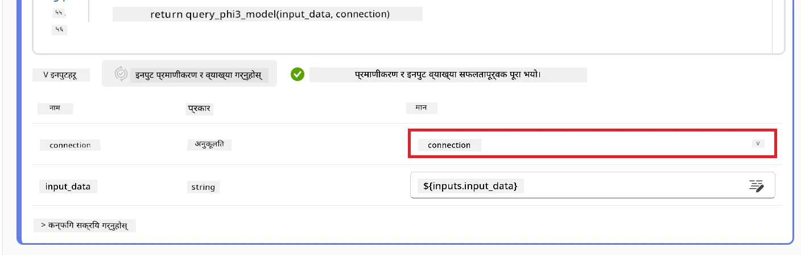

#### आफ्नो कस्टम Phi-3 / Phi-3.5 मोडेलसँग कुराकानी गर्नुहोस्

1. **Chat** चयन गर्नुहोस्।

    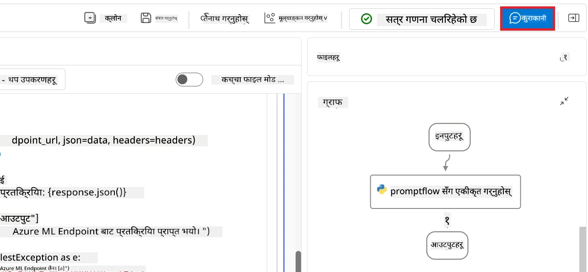

1. यहाँ परिणामको उदाहरण छ: अब तपाईं आफ्नो कस्टम Phi-3 / Phi-3.5 मोडेलसँग कुराकानी गर्न सक्नुहुन्छ। फाइन-ट्युनिङका लागि प्रयोग गरिएको डाटामा आधारित प्रश्न सोध्न सिफारिस गरिन्छ।

    

### Phi-3 / Phi-3.5 मोडेलको मूल्याङ्कन गर्न Azure OpenAI डिप्लोय गर्नुहोस्

Azure AI Foundry मा Phi-3 / Phi-3.5 मोडेलको मूल्याङ्कन गर्न, तपाईंले Azure OpenAI मोडेल डिप्लोय गर्न आवश्यक छ। यो मोडेल Phi-3 / Phi-3.5 मोडेलको प्रदर्शन मूल्याङ्कन गर्न प्रयोग हुनेछ।

#### Azure OpenAI डिप्लोय गर्नुहोस्

1. [Azure AI Foundry](https://ai.azure.com/?wt.mc_id=studentamb_279723) मा साइन इन गर्नुहोस्।

1. तपाईंले सिर्जना गरेको Azure AI Foundry प्रोजेक्टमा जानुहोस्।

    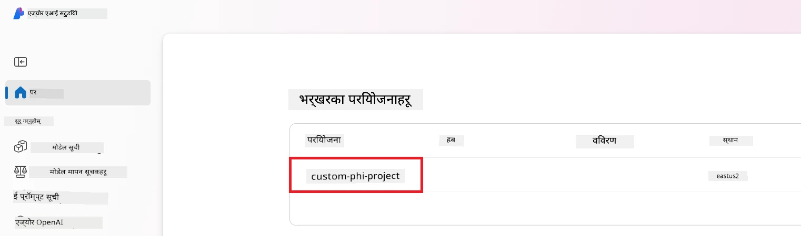

1. तपाईंले सिर्जना गरेको प्रोजेक्ट भित्र, बाँया पट्टि रहेको ट्याबबाट **Deployments** चयन गर्नुहोस्।

1. नेभिगेसन मेनुबाट **+ Deploy model** चयन गर्नुहोस्।

1. **Deploy base model** चयन गर्नुहोस्।

    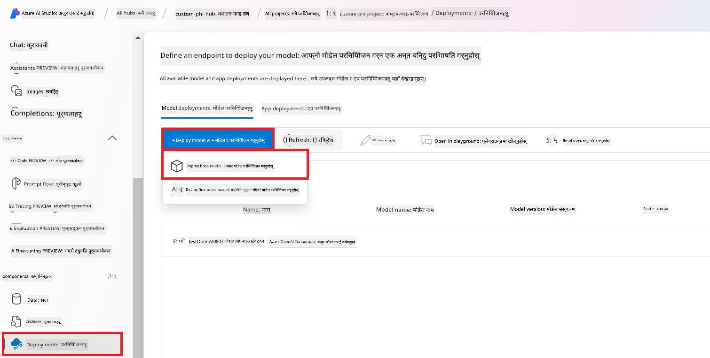

1. प्रयोग गर्न चाहेको Azure OpenAI मोडेल चयन गर्नुहोस्। उदाहरणका लागि, **gpt-4o**।

    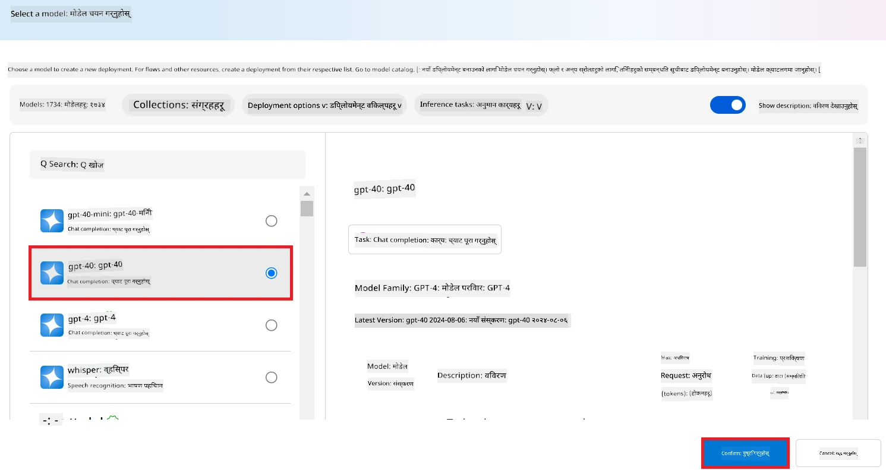

1. **Confirm** चयन गर्नुहोस्।

### Azure AI Foundry को Prompt flow मूल्याङ्कन प्रयोग गरी फाइन-ट्युन गरिएको Phi-3 / Phi-3.5 मोडेल मूल्याङ्कन गर्नुहोस्

### नयाँ मूल्याङ्कन सुरु गर्नुहोस्

1. [Azure AI Foundry](https://ai.azure.com/?wt.mc_id=studentamb_279723) मा जानुहोस्।

1. तपाईंले सिर्जना गरेको Azure AI Foundry प्रोजेक्टमा जानुहोस्।

    

1. तपाईंले सिर्जना गरेको प्रोजेक्ट भित्र, बाँया पट्टि रहेको ट्याबबाट **Evaluation** चयन गर्नुहोस्।

1. नेभिगेसन मेनुबाट **+ New evaluation** चयन गर्नुहोस्।

    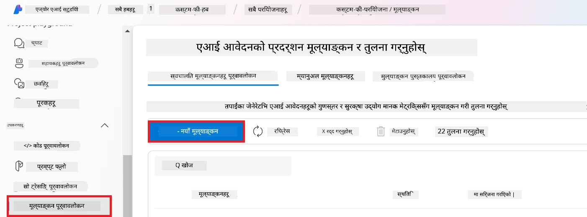

1. **Prompt flow** मूल्याङ्कन चयन गर्नुहोस्।

    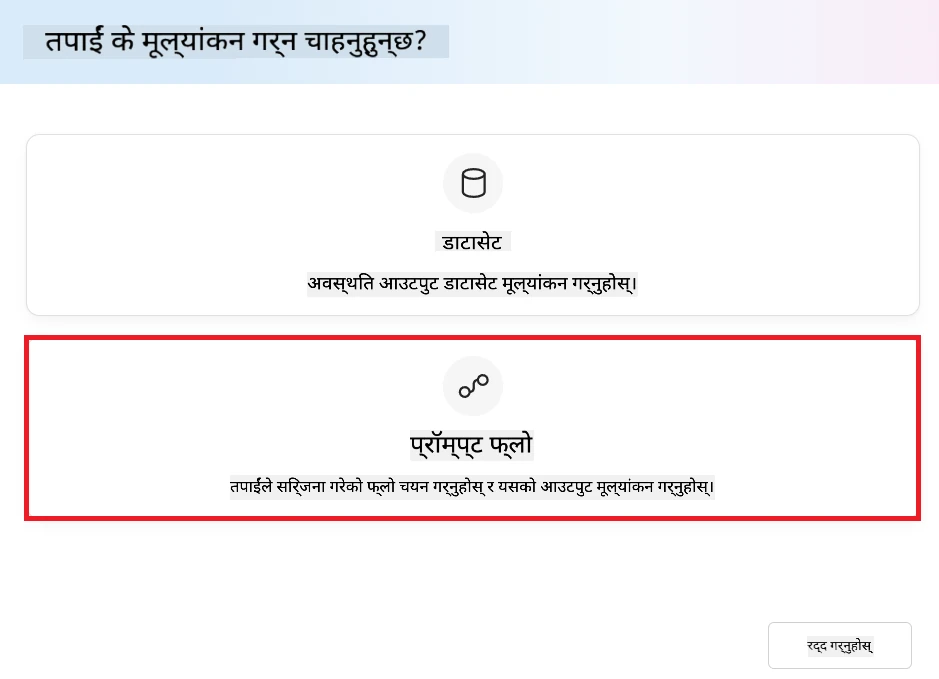

1. तलका कार्यहरू गर्नुहोस्:

    - मूल्याङ्कन नाम प्रविष्ट गर्नुहोस्। यो अनौठो मान हुनुपर्छ।
    - कार्य प्रकारको रूपमा **Question and answer without context** चयन गर्नुहोस्। किनभने, यस ट्युटोरियलमा प्रयोग गरिएको **UlTRACHAT_200k** डाटासेटमा सन्दर्भ छैन।
    - मूल्याङ्कन गर्न चाहेको prompt flow चयन गर्नुहोस्।

    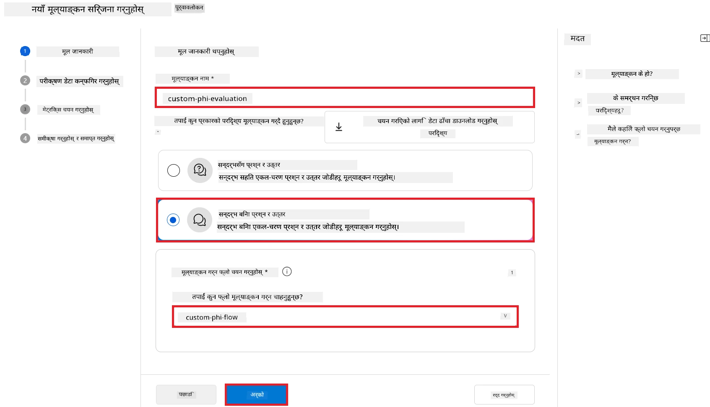

1. **Next** चयन गर्नुहोस्।

1. तलका कार्यहरू गर्नुहोस्:

    - **Add your dataset** चयन गरेर डाटासेट अपलोड गर्नुहोस्। उदाहरणका लागि, तपाईंले डाउनलोड गरेको **ULTRACHAT_200k** डाटासेटमा समावेश *test_data.json1* फाइल अपलोड गर्न सक्नुहुन्छ।
    - तपाईंको डाटासेटसँग मेल खाने उपयुक्त **Dataset column** चयन गर्नुहोस्। उदाहरणका लागि, यदि तपाईं **ULTRACHAT_200k** डाटासेट प्रयोग गर्दै हुनुहुन्छ भने, **${data.prompt}** चयन गर्नुहोस्।

    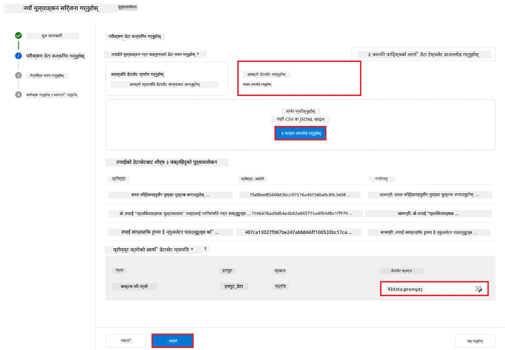

1. **Next** चयन गर्नुहोस्।

1. प्रदर्शन र गुणस्तर मेट्रिक्स कन्फिगर गर्न तलका कार्यहरू गर्नुहोस्:

    - प्रयोग गर्न चाहेको प्रदर्शन र गुणस्तर मेट्रिक्स चयन गर्नुहोस्।
    - मूल्याङ्कनका लागि सिर्जना गरेको Azure OpenAI मोडेल चयन गर्नुहोस्। उदाहरणका लागि, **gpt-4o** चयन गर्नुहोस्।

    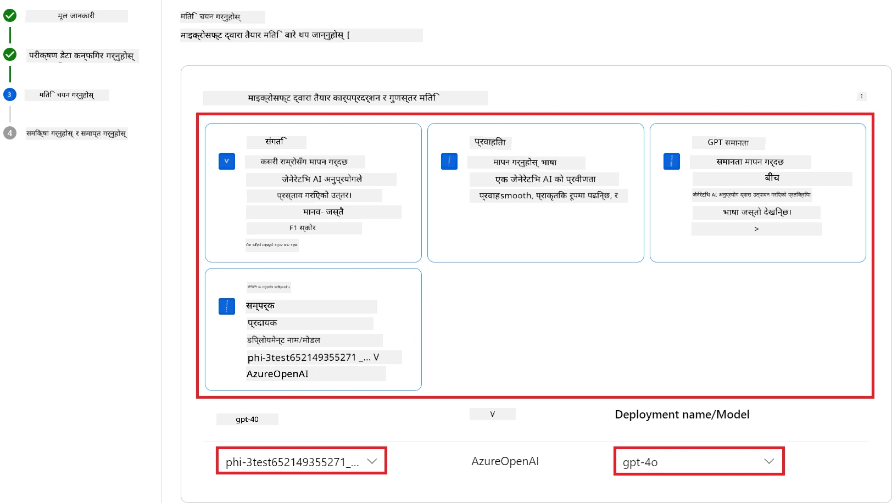

1. जोखिम र सुरक्षा मेट्रिक्स कन्फिगर गर्न तलका कार्यहरू गर्नुहोस्:

    - प्रयोग गर्न चाहेको जोखिम र सुरक्षा मेट्रिक्स चयन गर्नुहोस्।
    - दोष दर गणना गर्न चाहेको थ्रेसहोल्ड चयन गर्नुहोस्। उदाहरणका लागि, **Medium** चयन गर्नुहोस्।
    - **question** को लागि, **Data source** मा **{$data.prompt}** चयन गर्नुहोस्।
    - **answer** को लागि, **Data source** मा **{$run.outputs.answer}** चयन गर्नुहोस्।
    - **ground_truth** को लागि, **Data source** मा **{$data.message}** चयन गर्नुहोस्।

    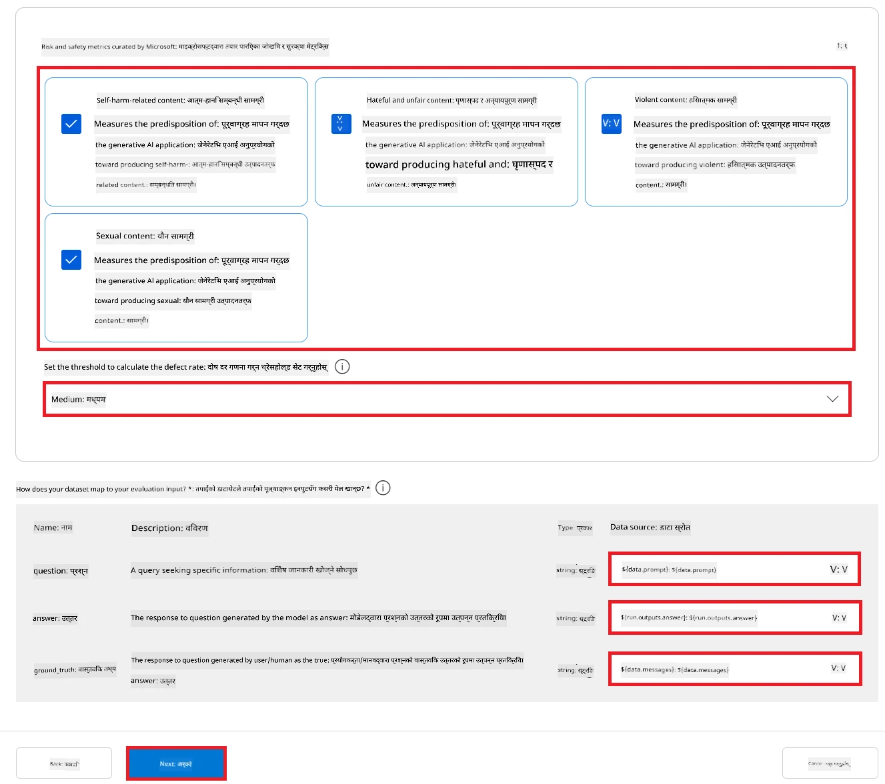

1. **Next** चयन गर्नुहोस्।

1. मूल्याङ्कन सुरु गर्न **Submit** चयन गर्नुहोस्।

1. मूल्याङ्कन पूरा हुन केही समय लाग्न सक्छ। तपाईं प्रगति **Evaluation** ट्याबमा अनुगमन गर्न सक्नुहुन्छ।

### मूल्याङ्कन परिणाम समीक्षा गर्नुहोस्
> [!NOTE]
> तल प्रस्तुत परिणामहरू मूल्यांकन प्रक्रियालाई बुझाउनका लागि हुन्। यस ट्युटोरियलमा, हामीले सानो डेटासेटमा फाइन-ट्युन गरिएको मोडेल प्रयोग गरेका छौं, जसले कम प्रभावकारी परिणाम दिन सक्छ। वास्तविक परिणामहरू डेटासेटको आकार, गुणस्तर, विविधता र मोडेलको विशेष कन्फिगरेसन अनुसार धेरै फरक पर्न सक्छन्।
एकपटक मूल्याङ्कन पूरा भएपछि, तपाईं प्रदर्शन र सुरक्षा मेट्रिक्स दुवैका लागि परिणामहरू समीक्षा गर्न सक्नुहुन्छ।

1. प्रदर्शन र गुणस्तर मेट्रिक्स:

    - मोडेलले सुसंगत, प्रवाहपूर्ण, र सान्दर्भिक प्रतिक्रियाहरू उत्पादन गर्ने क्षमताको मूल्याङ्कन गर्नुहोस्।

    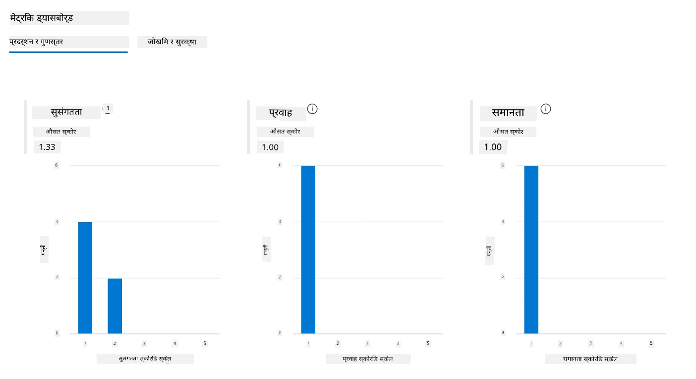

1. जोखिम र सुरक्षा मेट्रिक्स:

    - मोडेलका आउटपुटहरू सुरक्षित छन् र जिम्मेवार AI सिद्धान्तहरूसँग मेल खान्छन् भनी सुनिश्चित गर्नुहोस्, कुनै पनि हानिकारक वा अपमानजनक सामग्रीबाट बच्दै।

    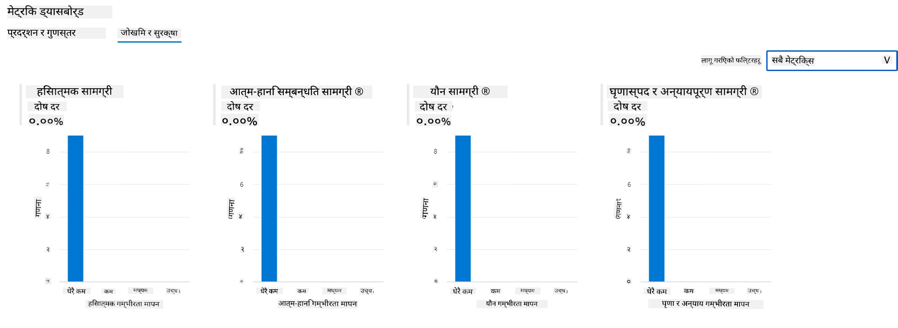

1. तपाईं तल स्क्रोल गरेर **विस्तृत मेट्रिक्स परिणाम** हेर्न सक्नुहुन्छ।

    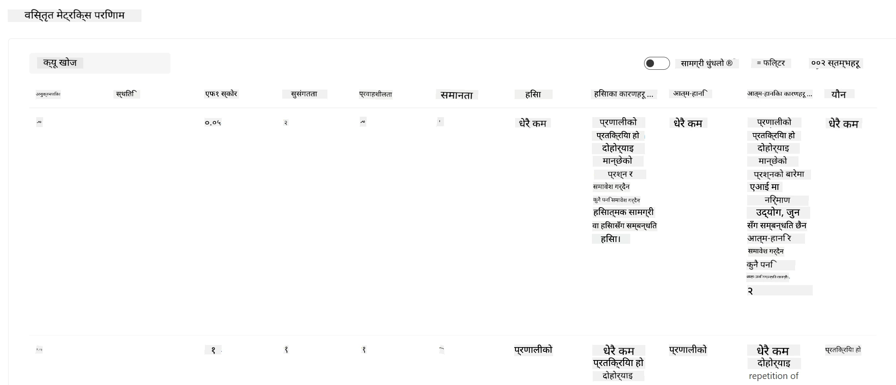

1. तपाईंले आफ्नो कस्टम Phi-3 / Phi-3.5 मोडेललाई प्रदर्शन र सुरक्षा मेट्रिक्स दुवैको आधारमा मूल्याङ्कन गरेर, मोडेल न केवल प्रभावकारी छ, तर जिम्मेवार AI अभ्यासहरू पनि पालना गर्दछ भनी पुष्टि गर्न सक्नुहुन्छ, जसले यसलाई वास्तविक संसारमा प्रयोगका लागि तयार बनाउँछ।

## बधाई छ!

### तपाईंले यो ट्युटोरियल पूरा गर्नुभयो

तपाईंले Azure AI Foundry मा Prompt flow सँग एकीकृत गरिएको फाइन-ट्युन गरिएको Phi-3 मोडेल सफलतापूर्वक मूल्याङ्कन गर्नुभयो। यो एउटा महत्वपूर्ण कदम हो जसले तपाईंका AI मोडेलहरू न केवल राम्रो प्रदर्शन गर्छन्, तर Microsoft का जिम्मेवार AI सिद्धान्तहरू पनि पालना गर्छन् भनी सुनिश्चित गर्दछ, जसले तपाईंलाई भरपर्दो र विश्वसनीय AI अनुप्रयोगहरू निर्माण गर्न मद्दत गर्छ।


## Azure स्रोतहरू सफा गर्नुहोस्

तपाईंको खातामा अतिरिक्त शुल्क लाग्न नदिन Azure स्रोतहरू सफा गर्नुहोस्। Azure पोर्टलमा जानुहोस् र तलका स्रोतहरू मेटाउनुहोस्:

- Azure Machine learning स्रोत।
- Azure Machine learning मोडेल अन्तबिन्दु।
- Azure AI Foundry Project स्रोत।
- Azure AI Foundry Prompt flow स्रोत।

### अर्को कदमहरू

#### कागजातहरू

- [जिम्मेवार AI ड्यासबोर्ड प्रयोग गरेर AI प्रणालीहरूको मूल्याङ्कन गर्नुहोस्](https://learn.microsoft.com/azure/machine-learning/concept-responsible-ai-dashboard?view=azureml-api-2&source=recommendations?wt.mc_id=studentamb_279723)
- [जनरेटिभ AI का लागि मूल्याङ्कन र अनुगमन मेट्रिक्स](https://learn.microsoft.com/azure/ai-studio/concepts/evaluation-metrics-built-in?tabs=definition?wt.mc_id=studentamb_279723)
- [Azure AI Foundry कागजातहरू](https://learn.microsoft.com/azure/ai-studio/?wt.mc_id=studentamb_279723)
- [Prompt flow कागजातहरू](https://microsoft.github.io/promptflow/?wt.mc_id=studentamb_279723)

#### प्रशिक्षण सामग्री

- [Microsoft को जिम्मेवार AI दृष्टिकोणमा परिचय](https://learn.microsoft.com/training/modules/introduction-to-microsofts-responsible-ai-approach/?source=recommendations?wt.mc_id=studentamb_279723)
- [Azure AI Foundry मा परिचय](https://learn.microsoft.com/training/modules/introduction-to-azure-ai-studio/?wt.mc_id=studentamb_279723)

### सन्दर्भ

- [जिम्मेवार AI के हो?](https://learn.microsoft.com/azure/machine-learning/concept-responsible-ai?view=azureml-api-2?wt.mc_id=studentamb_279723)
- [Azure AI मा नयाँ उपकरणहरूको घोषणा जसले तपाईंलाई बढी सुरक्षित र भरपर्दो जनरेटिभ AI अनुप्रयोगहरू निर्माण गर्न मद्दत गर्छ](https://azure.microsoft.com/blog/announcing-new-tools-in-azure-ai-to-help-you-build-more-secure-and-trustworthy-generative-ai-applications/?wt.mc_id=studentamb_279723)
- [जनरेटिभ AI अनुप्रयोगहरूको मूल्याङ्कन](https://learn.microsoft.com/azure/ai-studio/concepts/evaluation-approach-gen-ai?wt.mc_id%3Dstudentamb_279723)

**अस्वीकरण**:  
यो दस्तावेज AI अनुवाद सेवा [Co-op Translator](https://github.com/Azure/co-op-translator) प्रयोग गरी अनुवाद गरिएको हो। हामी शुद्धताका लागि प्रयासरत छौं, तर कृपया ध्यान दिनुहोस् कि स्वचालित अनुवादमा त्रुटि वा अशुद्धता हुनसक्छ। मूल दस्तावेज यसको मूल भाषामा नै आधिकारिक स्रोत मानिनुपर्छ। महत्वपूर्ण जानकारीका लागि व्यावसायिक मानव अनुवाद सिफारिस गरिन्छ। यस अनुवादको प्रयोगबाट उत्पन्न कुनै पनि गलतफहमी वा गलत व्याख्याका लागि हामी जिम्मेवार छैनौं।