<!--
CO_OP_TRANSLATOR_METADATA:
{
  "original_hash": "80a853c08e4ee25ef9b4bfcedd8990da",
  "translation_date": "2025-05-09T16:09:00+00:00",
  "source_file": "md/02.Application/01.TextAndChat/Phi3/E2E_Phi-3-Evaluation_AIFoundry.md",
  "language_code": "ne"
}
-->
# Evaluate the Fine-tuned Phi-3 / Phi-3.5 Model in Azure AI Foundry Focusing on Microsoft's Responsible AI Principles

This end-to-end (E2E) sample is based on the guide "[Evaluate Fine-tuned Phi-3 / 3.5 Models in Azure AI Foundry Focusing on Microsoft's Responsible AI](https://techcommunity.microsoft.com/blog/educatordeveloperblog/evaluate-fine-tuned-phi-3--3-5-models-in-azure-ai-studio-focusing-on-microsofts-/4227850?WT.mc_id=aiml-137032-kinfeylo)" from the Microsoft Tech Community.

## Overview

### How can you evaluate the safety and performance of a fine-tuned Phi-3 / Phi-3.5 model in Azure AI Foundry?

Fine-tuning a model can sometimes cause unintended or unwanted responses. To make sure the model stays safe and effective, it’s important to assess its potential to produce harmful content and its ability to give accurate, relevant, and coherent answers. In this tutorial, you’ll learn how to evaluate the safety and performance of a fine-tuned Phi-3 / Phi-3.5 model integrated with Prompt flow in Azure AI Foundry.

Here is the evaluation process in Azure AI Foundry.

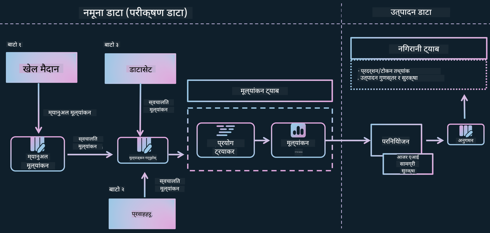

*Image Source: [Evaluation of generative AI applications](https://learn.microsoft.com/azure/ai-studio/concepts/evaluation-approach-gen-ai?wt.mc_id%3Dstudentamb_279723)*

> [!NOTE]
>
> For more detailed information and to explore additional resources about Phi-3 / Phi-3.5, please visit the [Phi-3CookBook](https://github.com/microsoft/Phi-3CookBook?wt.mc_id=studentamb_279723).

### Prerequisites

- [Python](https://www.python.org/downloads)
- [Azure subscription](https://azure.microsoft.com/free?wt.mc_id=studentamb_279723)
- [Visual Studio Code](https://code.visualstudio.com)
- Fine-tuned Phi-3 / Phi-3.5 model

### Table of Contents

1. [**Scenario 1: Introduction to Azure AI Foundry's Prompt flow evaluation**](../../../../../../md/02.Application/01.TextAndChat/Phi3)

    - [Introduction to safety evaluation](../../../../../../md/02.Application/01.TextAndChat/Phi3)
    - [Introduction to performance evaluation](../../../../../../md/02.Application/01.TextAndChat/Phi3)

1. [**Scenario 2: Evaluating the Phi-3 / Phi-3.5 model in Azure AI Foundry**](../../../../../../md/02.Application/01.TextAndChat/Phi3)

    - [Before you begin](../../../../../../md/02.Application/01.TextAndChat/Phi3)
    - [Deploy Azure OpenAI to evaluate the Phi-3 / Phi-3.5 model](../../../../../../md/02.Application/01.TextAndChat/Phi3)
    - [Evaluate the fine-tuned Phi-3 / Phi-3.5 model using Azure AI Foundry's Prompt flow evaluation](../../../../../../md/02.Application/01.TextAndChat/Phi3)

1. [Congratulations!](../../../../../../md/02.Application/01.TextAndChat/Phi3)

## **Scenario 1: Introduction to Azure AI Foundry's Prompt flow evaluation**

### Introduction to safety evaluation

To ensure your AI model is ethical and safe, it’s essential to evaluate it against Microsoft's Responsible AI Principles. In Azure AI Foundry, safety evaluations let you check your model’s vulnerability to jailbreak attacks and its potential to produce harmful content, which aligns directly with these principles.

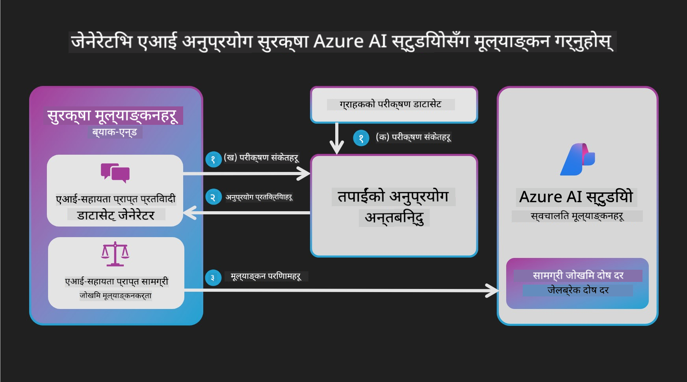

*Image Source: [Evaluation of generative AI applications](https://learn.microsoft.com/azure/ai-studio/concepts/evaluation-approach-gen-ai?wt.mc_id%3Dstudentamb_279723)*

#### Microsoft’s Responsible AI Principles

Before diving into the technical steps, it’s important to understand Microsoft’s Responsible AI Principles, an ethical framework that guides the responsible development, deployment, and operation of AI systems. These principles ensure AI technologies are designed fairly, transparently, and inclusively. They form the basis for evaluating AI model safety.

Microsoft's Responsible AI Principles include:

- **Fairness and Inclusiveness**: AI systems should treat everyone fairly and avoid treating similar groups differently. For example, when AI systems provide advice on medical treatment, loan applications, or hiring, they should give consistent recommendations to people with similar symptoms, financial situations, or qualifications.

- **Reliability and Safety**: To build trust, AI systems must operate reliably, safely, and consistently. They should work as intended, handle unexpected situations safely, and resist harmful manipulation. Their behavior should reflect the range of conditions anticipated by developers during design and testing.

- **Transparency**: When AI systems help make decisions that significantly impact people’s lives, it’s crucial that people understand how those decisions were made. For example, a bank might use AI to decide creditworthiness or a company to select job candidates.

- **Privacy and Security**: As AI use grows, protecting privacy and securing personal and business data becomes increasingly important and complex. AI systems require careful handling of privacy and data security because they rely on data to make accurate and informed predictions.

- **Accountability**: Designers and deployers of AI systems must be accountable for how their systems perform. Organizations should follow industry standards to establish accountability norms, ensuring AI isn’t the final authority on decisions affecting people’s lives and that humans maintain meaningful control over highly autonomous AI systems.

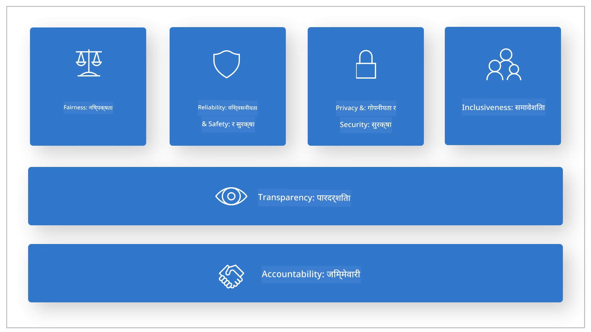

*Image Source: [What is Responsible AI?](https://learn.microsoft.com/azure/machine-learning/concept-responsible-ai?view=azureml-api-2&viewFallbackFrom=azureml-api-2%253fwt.mc_id%3Dstudentamb_279723)*

> [!NOTE]
> To learn more about Microsoft's Responsible AI Principles, visit the [What is Responsible AI?](https://learn.microsoft.com/azure/machine-learning/concept-responsible-ai?view=azureml-api-2?wt.mc_id=studentamb_279723).

#### Safety metrics

In this tutorial, you will evaluate the safety of the fine-tuned Phi-3 model using Azure AI Foundry's safety metrics. These metrics help you assess the model’s potential to produce harmful content and its vulnerability to jailbreak attacks. The safety metrics include:

- **Self-harm-related Content**: Checks if the model tends to generate content related to self-harm.
- **Hateful and Unfair Content**: Checks if the model tends to generate hateful or unfair content.
- **Violent Content**: Checks if the model tends to generate violent content.
- **Sexual Content**: Checks if the model tends to generate inappropriate sexual content.

Evaluating these ensures the AI model avoids harmful or offensive content, aligning it with societal values and regulations.

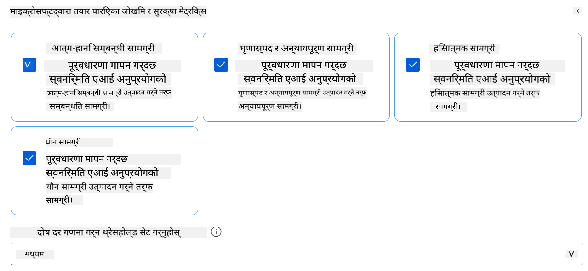

### Introduction to performance evaluation

To confirm your AI model performs as expected, it’s important to evaluate its effectiveness using performance metrics. In Azure AI Foundry, performance evaluations let you measure how well your model generates accurate, relevant, and coherent responses.


*Image Source: [Evaluation of generative AI applications](https://learn.microsoft.com/azure/ai-studio/concepts/evaluation-approach-gen-ai?wt.mc_id%3Dstudentamb_279723)*

#### Performance metrics

In this tutorial, you will evaluate the performance of the fine-tuned Phi-3 / Phi-3.5 model using Azure AI Foundry's performance metrics. These metrics help you assess how well the model generates accurate, relevant, and coherent responses. The performance metrics include:

- **Groundedness**: Measures how well the generated answers align with the input source information.
- **Relevance**: Measures how pertinent the generated responses are to the questions asked.
- **Coherence**: Measures how smoothly the text flows, how natural it reads, and how human-like the language sounds.
- **Fluency**: Measures the language proficiency of the generated text.
- **GPT Similarity**: Compares the generated response with the ground truth to assess similarity.
- **F1 Score**: Calculates the ratio of shared words between the generated response and the source data.

These metrics help you evaluate how effectively the model produces accurate, relevant, and coherent answers.

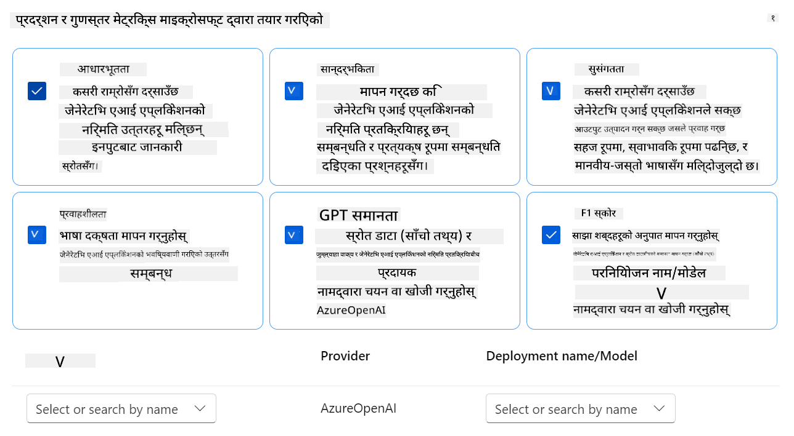

## **Scenario 2: Evaluating the Phi-3 / Phi-3.5 model in Azure AI Foundry**

### Before you begin

This tutorial follows the previous blog posts, "[Fine-Tune and Integrate Custom Phi-3 Models with Prompt Flow: Step-by-Step Guide](https://techcommunity.microsoft.com/t5/educator-developer-blog/fine-tune-and-integrate-custom-phi-3-models-with-prompt-flow/ba-p/4178612?wt.mc_id=studentamb_279723)" and "[Fine-Tune and Integrate Custom Phi-3 Models with Prompt Flow in Azure AI Foundry](https://techcommunity.microsoft.com/t5/educator-developer-blog/fine-tune-and-integrate-custom-phi-3-models-with-prompt-flow-in/ba-p/4191726?wt.mc_id=studentamb_279723)." In those posts, we covered fine-tuning a Phi-3 / Phi-3.5 model in Azure AI Foundry and integrating it with Prompt flow.

In this tutorial, you will deploy an Azure OpenAI model as an evaluator in Azure AI Foundry and use it to evaluate your fine-tuned Phi-3 / Phi-3.5 model.

Before starting, ensure you have these prerequisites as described earlier:

1. A prepared dataset to evaluate the fine-tuned Phi-3 / Phi-3.5 model.
1. A Phi-3 / Phi-3.5 model that’s been fine-tuned and deployed to Azure Machine Learning.
1. A Prompt flow integrated with your fine-tuned Phi-3 / Phi-3.5 model in Azure AI Foundry.

> [!NOTE]
> You will use the *test_data.jsonl* file from the data folder of the **ULTRACHAT_200k** dataset downloaded in the previous blog posts as the dataset for evaluation.

#### Integrate the custom Phi-3 / Phi-3.5 model with Prompt flow in Azure AI Foundry (Code first approach)

> [!NOTE]
> If you followed the low-code approach described in "[Fine-Tune and Integrate Custom Phi-3 Models with Prompt Flow in Azure AI Foundry](https://techcommunity.microsoft.com/t5/educator-developer-blog/fine-tune-and-integrate-custom-phi-3-models-with-prompt-flow-in/ba-p/4191726?wt.mc_id=studentamb_279723)", you can skip this exercise and move on.
> However, if you followed the code-first approach described in "[Fine-Tune and Integrate Custom Phi-3 Models with Prompt Flow: Step-by-Step Guide](https://techcommunity.microsoft.com/t5/educator-developer-blog/fine-tune-and-integrate-custom-phi-3-models-with-prompt-flow/ba-p/4178612?wt.mc_id=studentamb_279723)" to fine-tune and deploy your Phi-3 / Phi-3.5 model, the process of connecting your model to Prompt flow is slightly different. You will learn this process here.

To continue, you need to integrate your fine-tuned Phi-3 / Phi-3.5 model into Prompt flow in Azure AI Foundry.

#### Create Azure AI Foundry Hub

You need to create a Hub before creating a Project. A Hub works like a Resource Group, letting you organize and manage multiple Projects within Azure AI Foundry.

1. Sign in to [Azure AI Foundry](https://ai.azure.com/?wt.mc_id=studentamb_279723).

1. Select **All hubs** from the left side menu.

1. Click **+ New hub** in the navigation bar.

    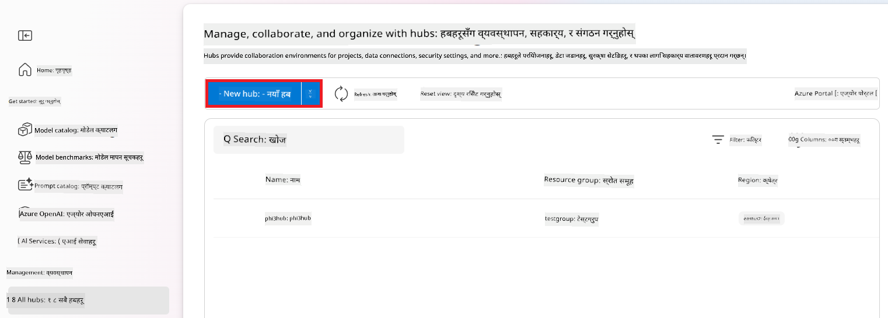

1. Complete the following:

    - Enter a **Hub name** (must be unique).
    - Select your Azure **Subscription**.
    - Select the **Resource group** to use (or create a new one).
    - Select the **Location** you want.
    - Select **Connect Azure AI Services** (or create a new one).
    - For **Connect Azure AI Search**, choose **Skip connecting**.
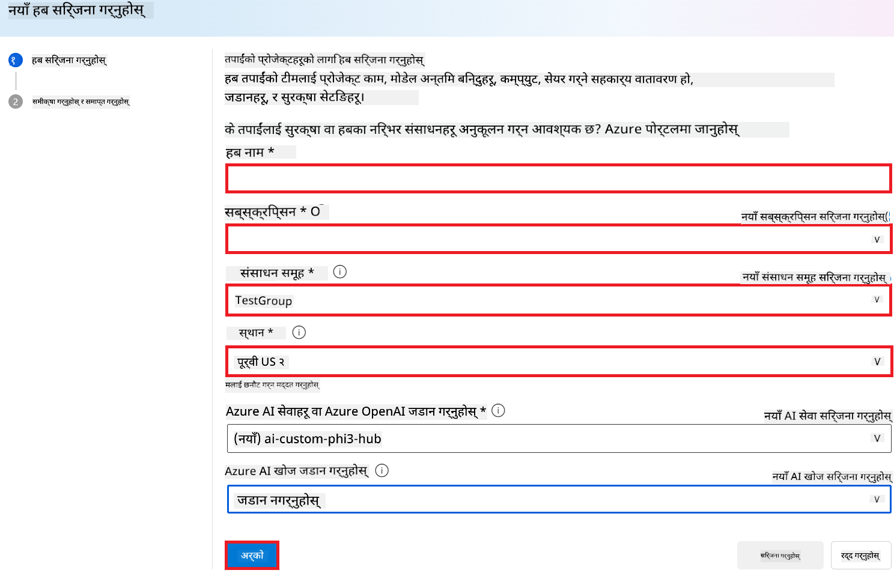

1. **Next** चयन गर्नुहोस्।

#### Azure AI Foundry परियोजना सिर्जना गर्नुहोस्

1. तपाईंले सिर्जना गरेको Hub मा, बायाँपट्टि ट्याबबाट **All projects** चयन गर्नुहोस्।

1. नेभिगेशन मेनुबाट **+ New project** चयन गर्नुहोस्।

    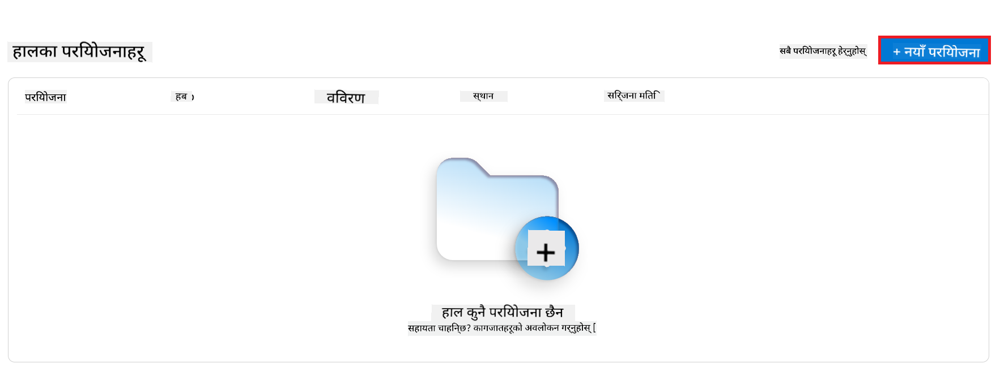

1. **Project name** प्रविष्ट गर्नुहोस्। यो एक अनौठो मान हुनुपर्छ।

    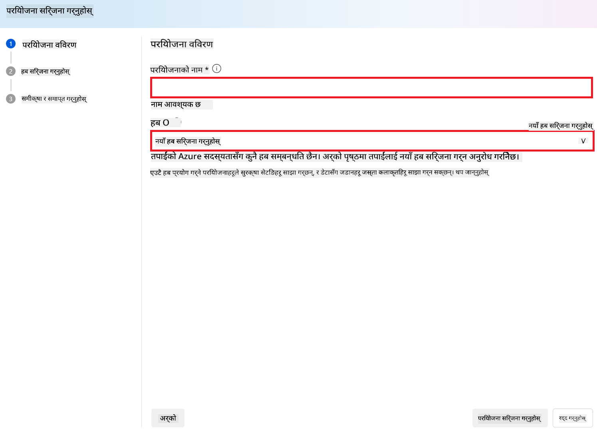

1. **Create a project** चयन गर्नुहोस्।

#### fine-tuned Phi-3 / Phi-3.5 मोडेलको लागि कस्टम कनेक्शन थप्नुहोस्

तपाईंको कस्टम Phi-3 / Phi-3.5 मोडेललाई Prompt flow सँग एकीकृत गर्न, मोडेलको endpoint र key कस्टम कनेक्शनमा सुरक्षित गर्नु आवश्यक छ। यसले Prompt flow मा तपाईंको कस्टम मोडेल पहुँच सुनिश्चित गर्दछ।

#### fine-tuned Phi-3 / Phi-3.5 मोडेलको api key र endpoint uri सेट गर्नुहोस्

1. [Azure ML Studio](https://ml.azure.com/home?wt.mc_id=studentamb_279723) मा जानुहोस्।

1. तपाईंले सिर्जना गरेको Azure Machine learning workspace मा जानुहोस्।

1. बायाँपट्टि ट्याबबाट **Endpoints** चयन गर्नुहोस्।

    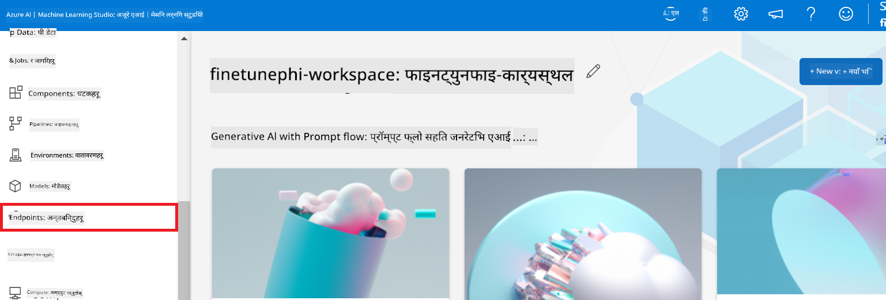

1. तपाईंले सिर्जना गरेको endpoint चयन गर्नुहोस्।

    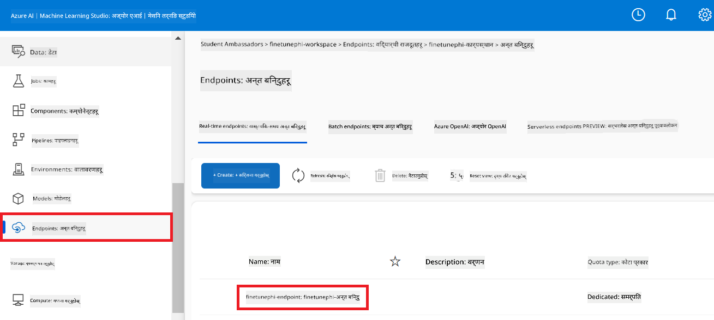

1. नेभिगेशन मेनुबाट **Consume** चयन गर्नुहोस्।

1. तपाईंको **REST endpoint** र **Primary key** कपी गर्नुहोस्।

    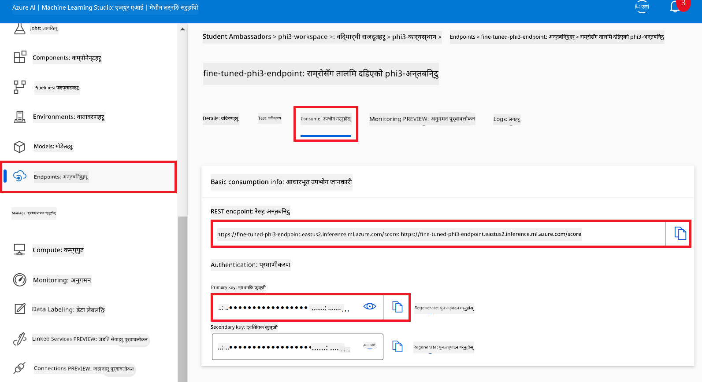

#### कस्टम कनेक्शन थप्नुहोस्

1. [Azure AI Foundry](https://ai.azure.com/?wt.mc_id=studentamb_279723) मा जानुहोस्।

1. तपाईंले सिर्जना गरेको Azure AI Foundry परियोजनामा जानुहोस्।

1. तपाईंले सिर्जना गरेको परियोजनामा, बायाँपट्टि ट्याबबाट **Settings** चयन गर्नुहोस्।

1. **+ New connection** चयन गर्नुहोस्।

    

1. नेभिगेशन मेनुबाट **Custom keys** चयन गर्नुहोस्।

    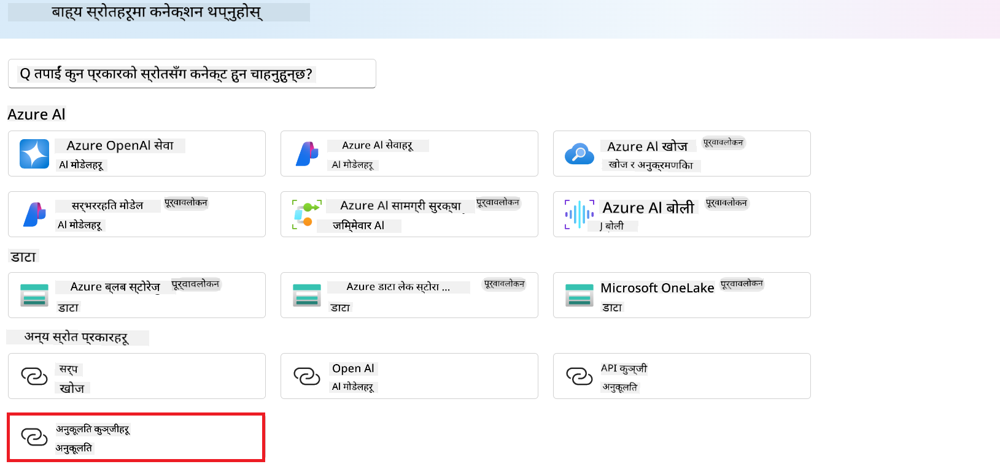

1. तलका कार्यहरू गर्नुहोस्:

    - **+ Add key value pairs** चयन गर्नुहोस्।
    - key नामको लागि **endpoint** लेख्नुहोस् र Azure ML Studio बाट कपी गरेको endpoint मान value क्षेत्रमा टाँस्नुहोस्।
    - फेरि **+ Add key value pairs** चयन गर्नुहोस्।
    - key नामको लागि **key** लेख्नुहोस् र Azure ML Studio बाट कपी गरेको key मान value क्षेत्रमा टाँस्नुहोस्।
    - key हरू थपिसकेपछि, key लाई खुल्ला हुनबाट रोक्न **is secret** चयन गर्नुहोस्।

    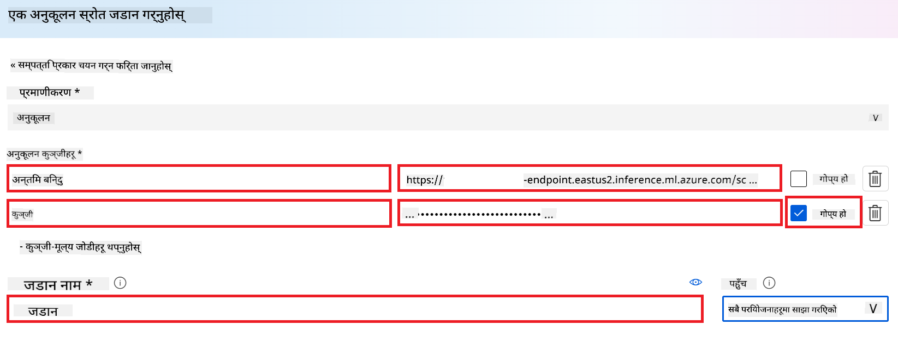

1. **Add connection** चयन गर्नुहोस्।

#### Prompt flow सिर्जना गर्नुहोस्

तपाईंले Azure AI Foundry मा कस्टम कनेक्शन थप्नुभएको छ। अब तलका चरणहरू प्रयोग गरी Prompt flow सिर्जना गरौं। त्यसपछि, यो Prompt flow लाई कस्टम कनेक्शनसँग जोडेर fine-tuned मोडेल प्रयोग गर्न सकिनेछ।

1. तपाईंले सिर्जना गरेको Azure AI Foundry परियोजनामा जानुहोस्।

1. बायाँपट्टि ट्याबबाट **Prompt flow** चयन गर्नुहोस्।

1. नेभिगेशन मेनुबाट **+ Create** चयन गर्नुहोस्।

    

1. नेभिगेशन मेनुबाट **Chat flow** चयन गर्नुहोस्।

    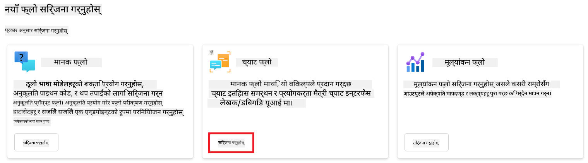

1. प्रयोग गर्न चाहेको **Folder name** प्रविष्ट गर्नुहोस्।

    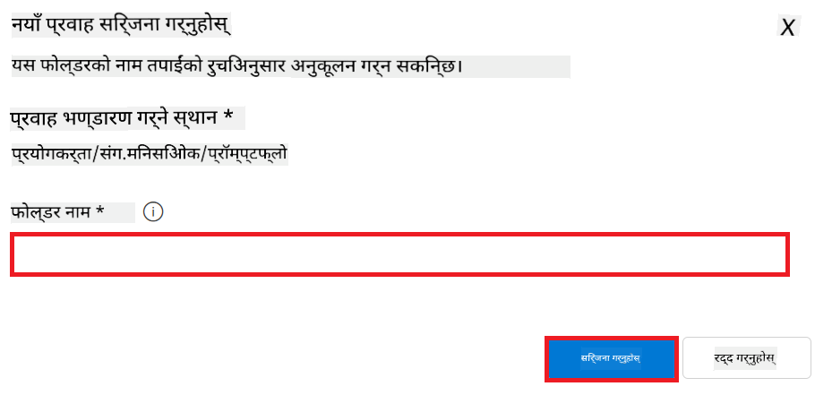

1. **Create** चयन गर्नुहोस्।

#### तपाईंको कस्टम Phi-3 / Phi-3.5 मोडेलसँग कुराकानी गर्न Prompt flow सेट अप गर्नुहोस्

तपाईंले fine-tuned Phi-3 / Phi-3.5 मोडेललाई Prompt flow मा समावेश गर्न आवश्यक छ। तर, उपलब्ध Prompt flow यसका लागि डिजाइन गरिएको छैन। त्यसैले, तपाईंले Prompt flow पुनः डिजाइन गर्नुपर्नेछ जसले कस्टम मोडेललाई एकीकृत गर्न सक्षम बनाउँछ।

1. Prompt flow मा, तलका कार्यहरू गरेर हालको flow पुनर्निर्माण गर्नुहोस्:

    - **Raw file mode** चयन गर्नुहोस्।
    - *flow.dag.yml* फाइलमा रहेका सबै कोड मेटाउनुहोस्।
    - *flow.dag.yml* मा तलको कोड थप्नुहोस्।

        ```yml
        inputs:
          input_data:
            type: string
            default: "Who founded Microsoft?"

        outputs:
          answer:
            type: string
            reference: ${integrate_with_promptflow.output}

        nodes:
        - name: integrate_with_promptflow
          type: python
          source:
            type: code
            path: integrate_with_promptflow.py
          inputs:
            input_data: ${inputs.input_data}
        ```

    - **Save** चयन गर्नुहोस्।

    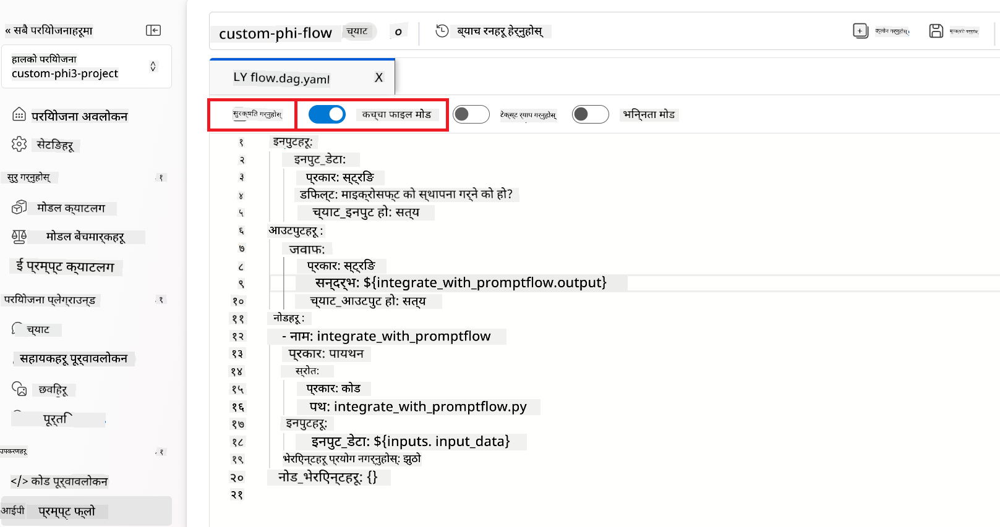

1. *integrate_with_promptflow.py* मा तलको कोड थप्नुहोस् ताकि Prompt flow मा कस्टम Phi-3 / Phi-3.5 मोडेल प्रयोग गर्न सकियोस्।

    ```python
    import logging
    import requests
    from promptflow import tool
    from promptflow.connections import CustomConnection

    # Logging setup
    logging.basicConfig(
        format="%(asctime)s - %(levelname)s - %(name)s - %(message)s",
        datefmt="%Y-%m-%d %H:%M:%S",
        level=logging.DEBUG
    )
    logger = logging.getLogger(__name__)

    def query_phi3_model(input_data: str, connection: CustomConnection) -> str:
        """
        Send a request to the Phi-3 / Phi-3.5 model endpoint with the given input data using Custom Connection.
        """

        # "connection" is the name of the Custom Connection, "endpoint", "key" are the keys in the Custom Connection
        endpoint_url = connection.endpoint
        api_key = connection.key

        headers = {
            "Content-Type": "application/json",
            "Authorization": f"Bearer {api_key}"
        }
    data = {
        "input_data": [input_data],
        "params": {
            "temperature": 0.7,
            "max_new_tokens": 128,
            "do_sample": True,
            "return_full_text": True
            }
        }
        try:
            response = requests.post(endpoint_url, json=data, headers=headers)
            response.raise_for_status()
            
            # Log the full JSON response
            logger.debug(f"Full JSON response: {response.json()}")

            result = response.json()["output"]
            logger.info("Successfully received response from Azure ML Endpoint.")
            return result
        except requests.exceptions.RequestException as e:
            logger.error(f"Error querying Azure ML Endpoint: {e}")
            raise

    @tool
    def my_python_tool(input_data: str, connection: CustomConnection) -> str:
        """
        Tool function to process input data and query the Phi-3 / Phi-3.5 model.
        """
        return query_phi3_model(input_data, connection)

    ```

    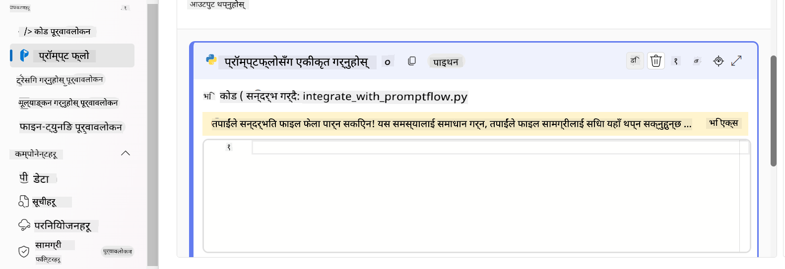

> [!NOTE]
> Azure AI Foundry मा Prompt flow प्रयोग सम्बन्धी थप विस्तृत जानकारीको लागि, [Prompt flow in Azure AI Foundry](https://learn.microsoft.com/azure/ai-studio/how-to/prompt-flow) हेर्न सक्नुहुन्छ।

1. तपाईंको मोडेलसँग कुराकानी सक्षम गर्न **Chat input**, **Chat output** चयन गर्नुहोस्।

    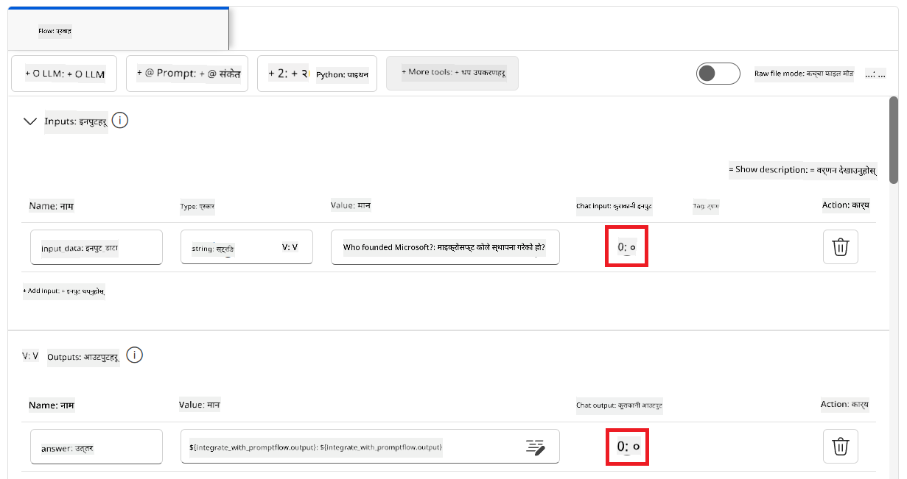

1. अब तपाईंको कस्टम Phi-3 / Phi-3.5 मोडेलसँग कुराकानी गर्न तयार हुनुहुन्छ। अर्को अभ्यासमा, तपाईंले कसरी Prompt flow सुरु गर्ने र यसलाई fine-tuned मोडेलसँग कुराकानी गर्न प्रयोग गर्ने सिक्नु हुनेछ।

> [!NOTE]
>
> पुनर्निर्मित flow तलको चित्र जस्तै देखिनु पर्छ:
>
> 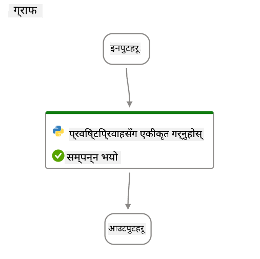
>

#### Prompt flow सुरु गर्नुहोस्

1. Prompt flow सुरु गर्न **Start compute sessions** चयन गर्नुहोस्।

    

1. प्यारामिटरहरू नवीकरण गर्न **Validate and parse input** चयन गर्नुहोस्।

    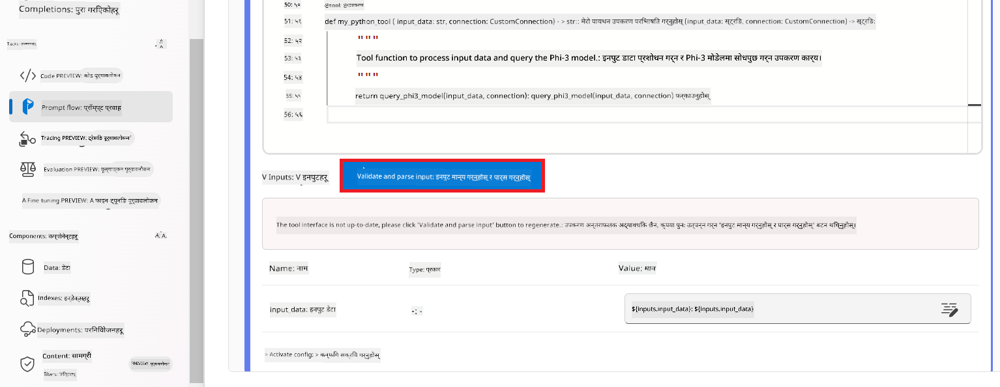

1. तपाईंले सिर्जना गरेको कस्टम कनेक्शनको **connection** मान चयन गर्नुहोस्। उदाहरणका लागि, *connection*।

    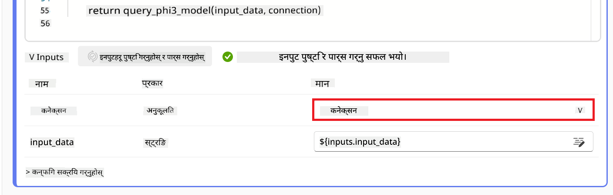

#### तपाईंको कस्टम Phi-3 / Phi-3.5 मोडेलसँग कुराकानी गर्नुहोस्

1. **Chat** चयन गर्नुहोस्।

    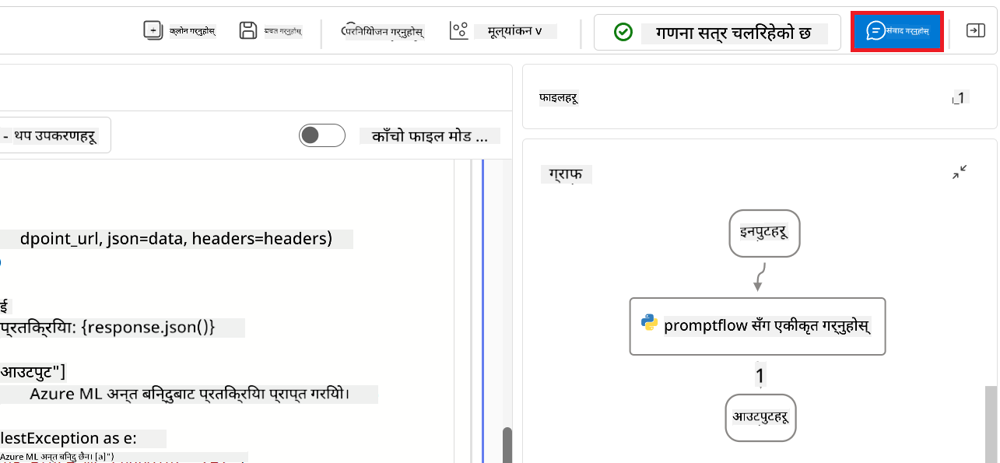

1. यहाँ नतिजाको उदाहरण छ: अब तपाईं आफ्नो कस्टम Phi-3 / Phi-3.5 मोडेलसँग कुराकानी गर्न सक्नुहुन्छ। fine-tuning मा प्रयोग भएको डाटामा आधारित प्रश्न सोध्न सिफारिस गरिन्छ।

    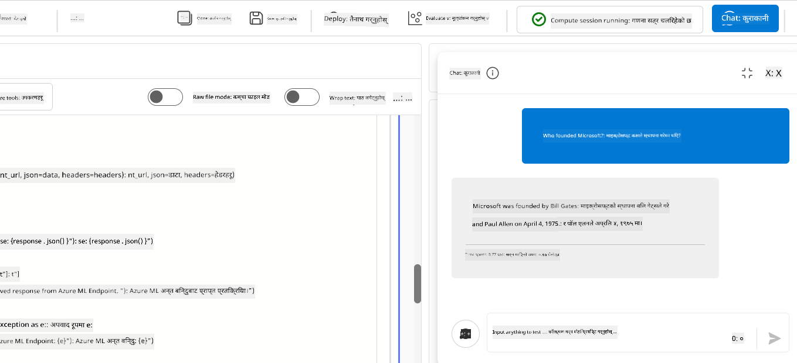

### Phi-3 / Phi-3.5 मोडेलको मूल्याङ्कन गर्न Azure OpenAI डिप्लोय गर्नुहोस्

Azure AI Foundry मा Phi-3 / Phi-3.5 मोडेल मूल्याङ्कन गर्न, Azure OpenAI मोडेल डिप्लोय गर्नु आवश्यक छ। यो मोडेल Phi-3 / Phi-3.5 मोडेलको प्रदर्शन मूल्याङ्कन गर्न प्रयोग गरिनेछ।

#### Azure OpenAI डिप्लोय गर्नुहोस्

1. [Azure AI Foundry](https://ai.azure.com/?wt.mc_id=studentamb_279723) मा साइन इन गर्नुहोस्।

1. तपाईंले सिर्जना गरेको Azure AI Foundry परियोजनामा जानुहोस्।

    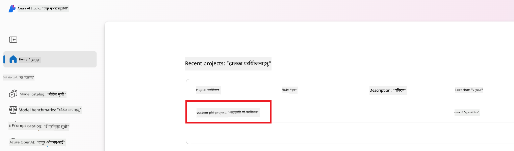

1. तपाईंले सिर्जना गरेको परियोजनामा, बायाँपट्टि ट्याबबाट **Deployments** चयन गर्नुहोस्।

1. नेभिगेशन मेनुबाट **+ Deploy model** चयन गर्नुहोस्।

1. **Deploy base model** चयन गर्नुहोस्।

    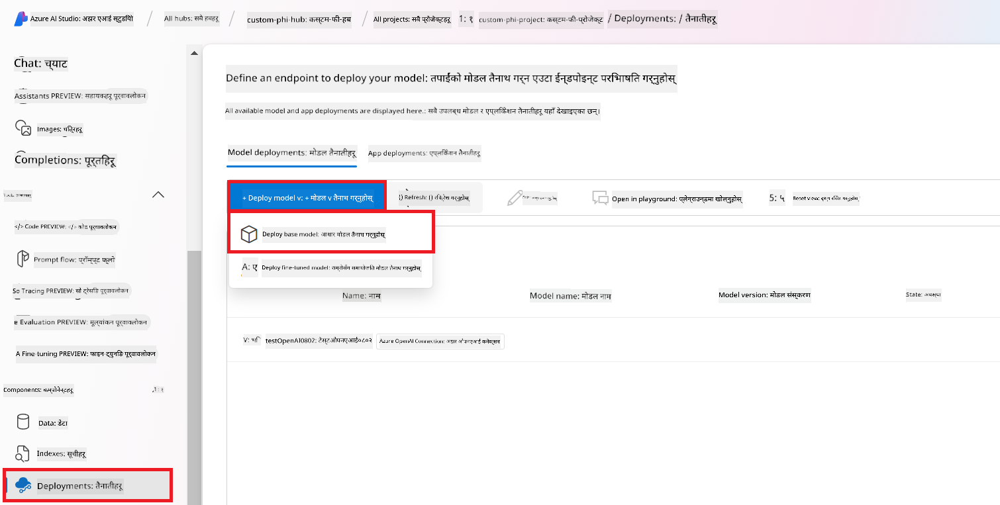

1. प्रयोग गर्न चाहेको Azure OpenAI मोडेल चयन गर्नुहोस्। उदाहरणका लागि, **gpt-4o**।

    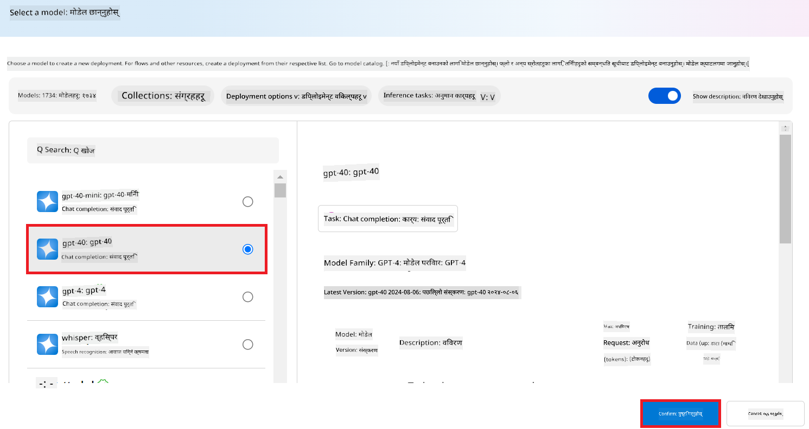

1. **Confirm** चयन गर्नुहोस्।

### Azure AI Foundry को Prompt flow मूल्याङ्कन प्रयोग गरी fine-tuned Phi-3 / Phi-3.5 मोडेल मूल्याङ्कन गर्नुहोस्

### नयाँ मूल्याङ्कन सुरु गर्नुहोस्

1. [Azure AI Foundry](https://ai.azure.com/?wt.mc_id=studentamb_279723) मा जानुहोस्।

1. तपाईंले सिर्जना गरेको Azure AI Foundry परियोजनामा जानुहोस्।

    

1. तपाईंले सिर्जना गरेको परियोजनामा, बायाँपट्टि ट्याबबाट **Evaluation** चयन गर्नुहोस्।

1. नेभिगेशन मेनुबाट **+ New evaluation** चयन गर्नुहोस्।
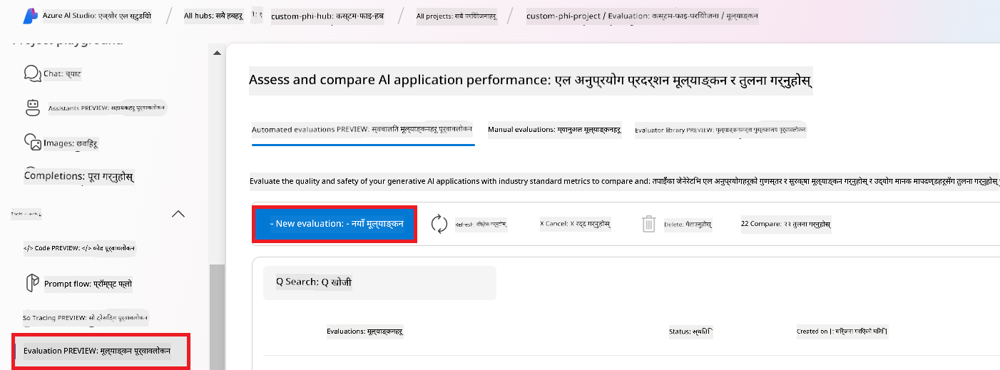

1. **Prompt flow** मूल्याङ्कन चयन गर्नुहोस्।

    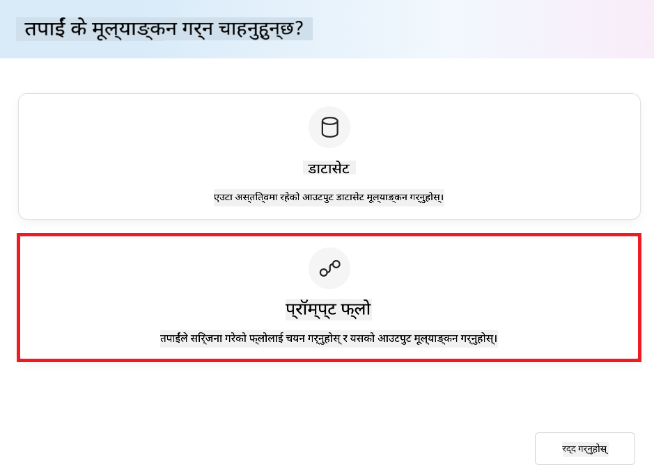

1. तलका कार्यहरू गर्नुहोस्:

    - मूल्याङ्कन नाम प्रविष्ट गर्नुहोस्। यो अनौठो मान हुनुपर्छ।
    - कार्य प्रकारको रूपमा **Question and answer without context** चयन गर्नुहोस्। किनभने यस ट्युटोरियलमा प्रयोग गरिएको **UlTRACHAT_200k** डेटासेटमा सन्दर्भ समावेश छैन।
    - तपाईंले मूल्याङ्कन गर्न चाहनुभएको prompt flow चयन गर्नुहोस्।

    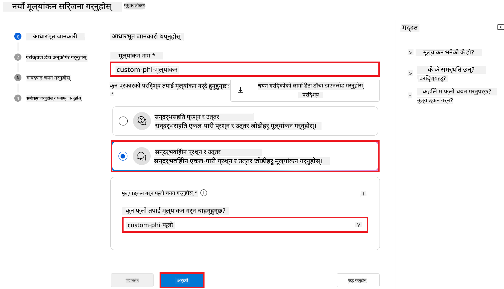

1. **Next** चयन गर्नुहोस्।

1. तलका कार्यहरू गर्नुहोस्:

    - डेटासेट अपलोड गर्न **Add your dataset** चयन गर्नुहोस्। उदाहरणका लागि, तपाईंले **ULTRACHAT_200k** डेटासेट डाउनलोड गर्दा समावेश गरिएको *test_data.json1* जस्तो टेस्ट डेटासेट फाइल अपलोड गर्न सक्नुहुन्छ।
    - तपाईंको डेटासेटसँग मेल खाने उपयुक्त **Dataset column** चयन गर्नुहोस्। उदाहरणका लागि, यदि तपाईं **ULTRACHAT_200k** डेटासेट प्रयोग गर्दै हुनुहुन्छ भने, **${data.prompt}** लाई dataset column को रूपमा चयन गर्नुहोस्।

    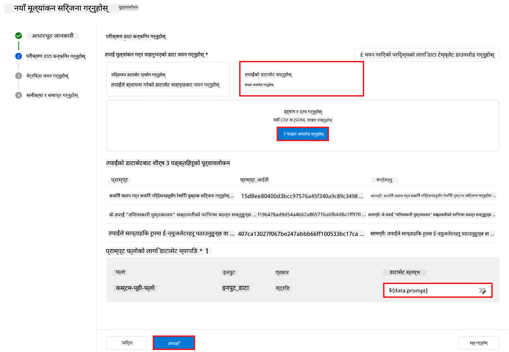

1. **Next** चयन गर्नुहोस्।

1. प्रदर्शन र गुणस्तर मेट्रिक्स कन्फिगर गर्न तलका कार्यहरू गर्नुहोस्:

    - तपाईंले प्रयोग गर्न चाहनुभएको प्रदर्शन र गुणस्तर मेट्रिक्स चयन गर्नुहोस्।
    - मूल्याङ्कनको लागि तपाईंले सिर्जना गरेको Azure OpenAI मोडल चयन गर्नुहोस्। उदाहरणका लागि, **gpt-4o** चयन गर्नुहोस्।

    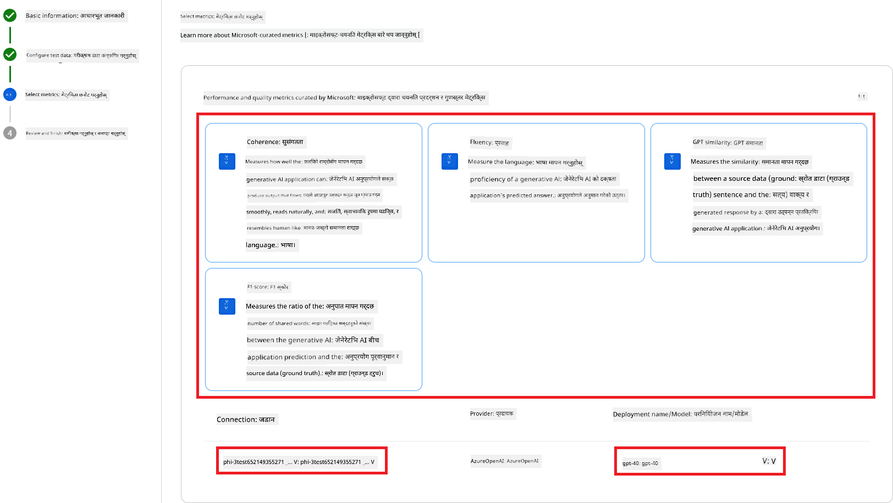

1. जोखिम र सुरक्षा मेट्रिक्स कन्फिगर गर्न तलका कार्यहरू गर्नुहोस्:

    - तपाईंले प्रयोग गर्न चाहनुभएको जोखिम र सुरक्षा मेट्रिक्स चयन गर्नुहोस्।
    - दोष दर गणना गर्न चाहनुभएको थ्रेसहोल्ड चयन गर्नुहोस्। उदाहरणका लागि, **Medium** चयन गर्नुहोस्।
    - **question** को लागि, **Data source** लाई **{$data.prompt}** मा सेट गर्नुहोस्।
    - **answer** को लागि, **Data source** लाई **{$run.outputs.answer}** मा सेट गर्नुहोस्।
    - **ground_truth** को लागि, **Data source** लाई **{$data.message}** मा सेट गर्नुहोस्।

    

1. **Next** चयन गर्नुहोस्।

1. मूल्याङ्कन सुरु गर्न **Submit** चयन गर्नुहोस्।

1. मूल्याङ्कन पूरा हुन केही समय लाग्नेछ। तपाईं प्रगतिको निगरानी **Evaluation** ट्याबमा गर्न सक्नुहुन्छ।

### मूल्याङ्कन परिणामहरू समीक्षा गर्नुहोस्

> [!NOTE]
> तल प्रस्तुत परिणामहरू मूल्याङ्कन प्रक्रिया देखाउनका लागि हुन्। यस ट्युटोरियलमा, हामीले सानो डेटासेटमा फाइन-ट्युन गरिएको मोडल प्रयोग गरेका छौं, जसले उपयुक्त नतिजा नआउन सक्छ। वास्तविक नतिजा डेटासेटको आकार, गुणस्तर, विविधता र मोडलको विशेष कन्फिगरेसन अनुसार धेरै फरक हुन सक्छ।

मूल्याङ्कन पूरा भएपछि, तपाईं प्रदर्शन र सुरक्षा मेट्रिक्स दुवैका परिणामहरू समीक्षा गर्न सक्नुहुन्छ।

1. प्रदर्शन र गुणस्तर मेट्रिक्स:

    - मोडलले सुसंगत, प्रवाहमय, र सान्दर्भिक प्रतिक्रियाहरू उत्पादन गर्न कत्तिको प्रभावकारी छ भन्ने मूल्याङ्कन गर्नुहोस्।

    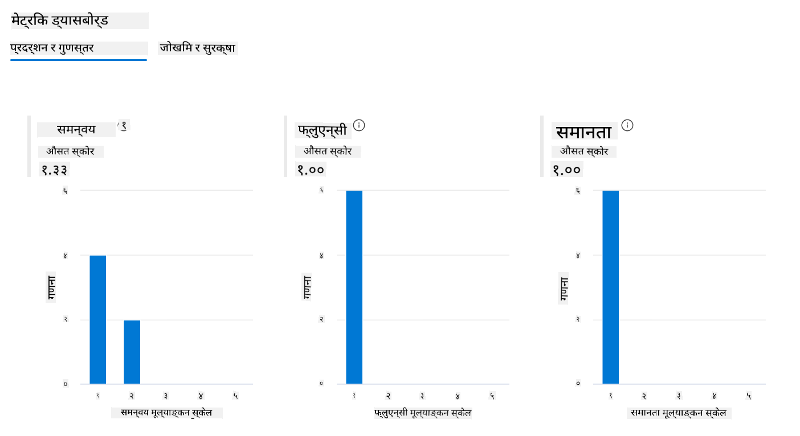

1. जोखिम र सुरक्षा मेट्रिक्स:

    - मोडलका आउटपुटहरू सुरक्षित छन् र Responsible AI Principles अनुसार छन् कि छैनन्, कुनै हानिकारक वा आपत्तिजनक सामग्री छैन भनेर सुनिश्चित गर्नुहोस्।

    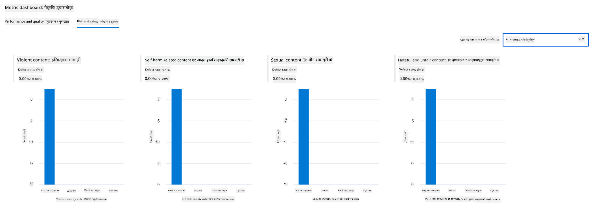

1. तपाईं तल स्क्रोल गरेर **Detailed metrics result** हेर्न सक्नुहुन्छ।

    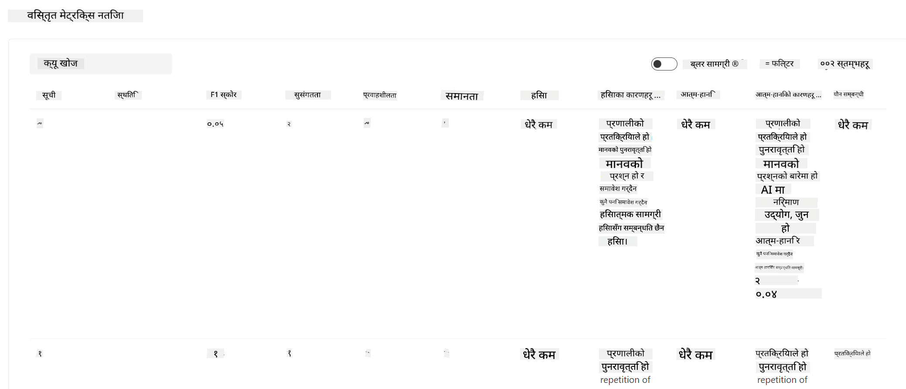

1. तपाईंले आफ्नै Phi-3 / Phi-3.5 मोडललाई प्रदर्शन र सुरक्षा मेट्रिक्स दुवैसँग मूल्याङ्कन गरेर पुष्टि गर्न सक्नुहुन्छ कि मोडल प्रभावकारी मात्र होइन, जिम्मेवार AI अभ्यासहरूमा पनि आधारित छ, जसले यसलाई वास्तविक संसारमा प्रयोगको लागि तयार बनाउँछ।

## बधाई छ!

### तपाईंले यो ट्युटोरियल पूरा गर्नुभयो

तपाईंले सफलतापूर्वक Azure AI Foundry मा Prompt flow सँग एकीकृत फाइन-ट्युन गरिएको Phi-3 मोडलको मूल्याङ्कन गर्नुभयो। यो कदमले तपाईंका AI मोडलहरू राम्रो प्रदर्शन मात्र होइन, Microsoft का Responsible AI सिद्धान्तहरूमा आधारित भएर विश्वसनीय र भरपर्दो AI एप्लिकेसनहरू विकास गर्न मद्दत गर्दछ।


## Azure स्रोतहरू सफा गर्नुहोस्

तपाईंको खातामा अतिरिक्त शुल्क लाग्न नदिन Azure स्रोतहरू सफा गर्नुहोस्। Azure पोर्टलमा जानुहोस् र तलका स्रोतहरू मेटाउनुहोस्:

- Azure Machine learning स्रोत।
- Azure Machine learning मोडल एन्डपोइन्ट।
- Azure AI Foundry Project स्रोत।
- Azure AI Foundry Prompt flow स्रोत।

### अर्को कदमहरू

#### दस्तावेजीकरण

- [Assess AI systems by using the Responsible AI dashboard](https://learn.microsoft.com/azure/machine-learning/concept-responsible-ai-dashboard?view=azureml-api-2&source=recommendations?wt.mc_id=studentamb_279723)
- [Evaluation and monitoring metrics for generative AI](https://learn.microsoft.com/azure/ai-studio/concepts/evaluation-metrics-built-in?tabs=definition?wt.mc_id=studentamb_279723)
- [Azure AI Foundry documentation](https://learn.microsoft.com/azure/ai-studio/?wt.mc_id=studentamb_279723)
- [Prompt flow documentation](https://microsoft.github.io/promptflow/?wt.mc_id=studentamb_279723)

#### तालिम सामग्री

- [Introduction to Microsoft's Responsible AI Approach](https://learn.microsoft.com/training/modules/introduction-to-microsofts-responsible-ai-approach/?source=recommendations?wt.mc_id=studentamb_279723)
- [Introduction to Azure AI Foundry](https://learn.microsoft.com/training/modules/introduction-to-azure-ai-studio/?wt.mc_id=studentamb_279723)

### सन्दर्भ

- [What is Responsible AI?](https://learn.microsoft.com/azure/machine-learning/concept-responsible-ai?view=azureml-api-2?wt.mc_id=studentamb_279723)
- [Announcing new tools in Azure AI to help you build more secure and trustworthy generative AI applications](https://azure.microsoft.com/blog/announcing-new-tools-in-azure-ai-to-help-you-build-more-secure-and-trustworthy-generative-ai-applications/?wt.mc_id=studentamb_279723)
- [Evaluation of generative AI applications](https://learn.microsoft.com/azure/ai-studio/concepts/evaluation-approach-gen-ai?wt.mc_id%3Dstudentamb_279723)

**अस्वीकरण**:  
यो दस्तावेज AI अनुवाद सेवा [Co-op Translator](https://github.com/Azure/co-op-translator) प्रयोग गरी अनुवाद गरिएको हो। हामी शुद्धताका लागि प्रयासरत भए तापनि, कृपया जान्नुहोस् कि स्वचालित अनुवादमा त्रुटि वा गलतफहमी हुन सक्छ। मूल दस्तावेज यसको मूल भाषामा नै आधिकारिक स्रोत मानिनु पर्छ। महत्वपूर्ण जानकारीका लागि पेशेवर मानव अनुवाद सिफारिस गरिन्छ। यस अनुवादको प्रयोगबाट उत्पन्न कुनै पनि गलत बुझाइ वा गलत व्याख्याका लागि हामी जिम्मेवार छैनौं।