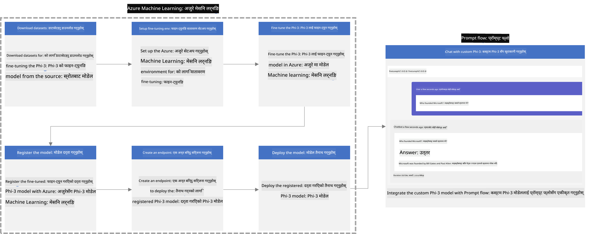
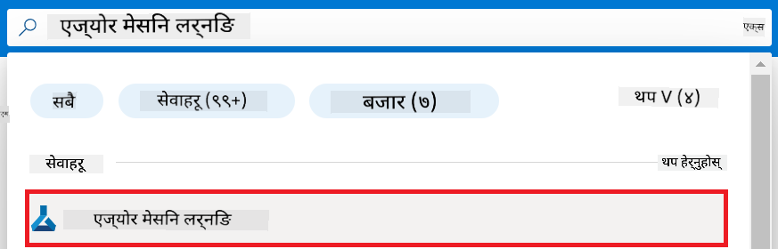
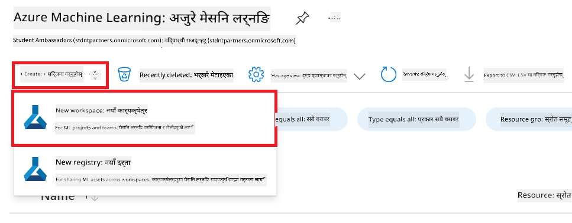
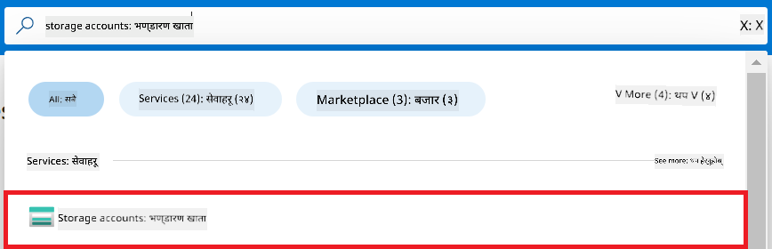
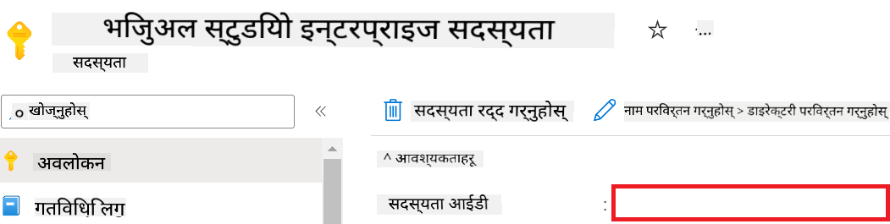
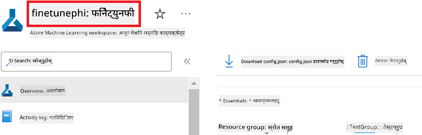
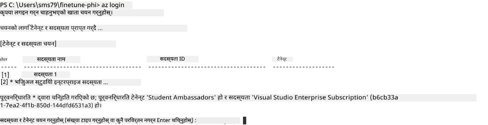
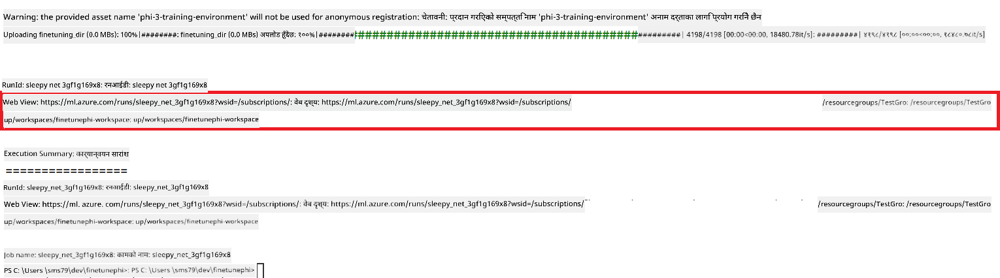
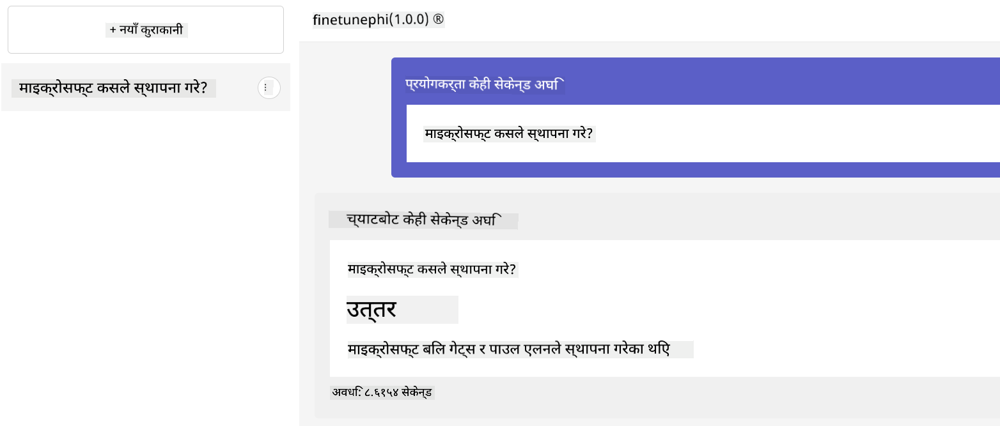

<!--
CO_OP_TRANSLATOR_METADATA:
{
  "original_hash": "7ca2c30fdb802664070e9cfbf92e24fe",
  "translation_date": "2026-01-05T02:18:11+00:00",
  "source_file": "md/02.Application/01.TextAndChat/Phi3/E2E_Phi-3-FineTuning_PromptFlow_Integration.md",
  "language_code": "ne"
}
-->
# कस्टम Phi-3 मोडेलहरूलाई Prompt flow सँग फाइन-ट्युन र एकीकृत गर्नुहोस्

यो end-to-end (E2E) नमूना Microsoft Tech Community मा प्रकाशित "[कस्टम Phi-3 मोडेलहरूलाई Prompt Flow सँग फाइन-ट्युन र एकीकृत गर्नुहोस्: चरण-दर-चरण मार्गदर्शिका](https://techcommunity.microsoft.com/t5/educator-developer-blog/fine-tune-and-integrate-custom-phi-3-models-with-prompt-flow/ba-p/4178612?WT.mc_id=aiml-137032-kinfeylo)" गाइडमा आधारित छ। यसले फाइन-ट्युन, डिप्लोय, र Prompt flow सँग कस्टम Phi-3 मोडेलहरू एकीकृत गर्ने प्रक्रियाहरू प्रस्तुत गर्दछ।

## अवलोकन

यस E2E नमुनामा, तपाईंले Phi-3 मोडेललाई कसरी फाइन-ट्युन गर्ने र यसलाई Prompt flow सँग कसरी एकीकृत गर्ने सिक्नुहुनेछ। Azure Machine Learning र Prompt flow को उपयोग गरेर, तपाईंले कस्टम AI मोडेलहरू डिप्लोय र प्रयोग गर्नका लागि एक कार्यप्रवाह स्थापना गर्नुहुनेछ। यो E2E नमुना तीन परिदृश्यहरूमा विभाजित गरिएको छ:

**परिदृश्य 1: Azure स्रोतहरू सेटअप गर्नुहोस् र फाइन-ट्युनको लागि तयारी गर्नुहोस्**

**परिदृश्य 2: Phi-3 मोडेल फाइन-ट्युन गर्नुहोस् र Azure Machine Learning Studio मा डिप्लोय गर्नुहोस्**

**परिदृश्य 3: Prompt flow सँग एकीकृत गर्नुहोस् र आफ्नो कस्टम मोडेलसँग कुराकानी गर्नुहोस्**

यहाँ यो E2E नमूनाको अवलोकन छ।



### सामग्री तालिका

1. **[परिदृश्य 1: Azure स्रोतहरू सेटअप गर्नुहोस् र फाइन-ट्युनको लागि तयारी गर्नुहोस्](../../../../../../md/02.Application/01.TextAndChat/Phi3)**
    - [Azure Machine Learning कार्यक्षेत्र सिर्जना गर्नुहोस्](../../../../../../md/02.Application/01.TextAndChat/Phi3)
    - [Azure Subscription मा GPU कोटा अनुरोध गर्नुहोस्](../../../../../../md/02.Application/01.TextAndChat/Phi3)
    - [भूमिका असाइन्मेन्ट थप्नुहोस्](../../../../../../md/02.Application/01.TextAndChat/Phi3)
    - [प्रोजेक्ट सेटअप गर्नुहोस्](../../../../../../md/02.Application/01.TextAndChat/Phi3)
    - [फाइन-ट्युनका लागि dataset तयारी गर्नुहोस्](../../../../../../md/02.Application/01.TextAndChat/Phi3)

1. **[परिदृश्य 2: Phi-3 मोडेल फाइन-ट्युन गर्नुहोस् र Azure Machine Learning Studio मा डिप्लोय गर्नुहोस्](../../../../../../md/02.Application/01.TextAndChat/Phi3)**
    - [Azure CLI सेटअप गर्नुहोस्](../../../../../../md/02.Application/01.TextAndChat/Phi3)
    - [Phi-3 मोडेल फाइन-ट्युन गर्नुहोस्](../../../../../../md/02.Application/01.TextAndChat/Phi3)
    - [फाइन-ट्युन गरिएको मोडेल डिप्लोय गर्नुहोस्](../../../../../../md/02.Application/01.TextAndChat/Phi3)

1. **[परिदृश्य 3: Prompt flow सँग एकीकृत गर्नुहोस् र आफ्नो कस्टम मोडेलसँग कुराकानी गर्नुहोस्](../../../../../../md/02.Application/01.TextAndChat/Phi3)**
    - [कस्टम Phi-3 मोडेललाई Prompt flow सँग एकीकृत गर्नुहोस्](../../../../../../md/02.Application/01.TextAndChat/Phi3)
    - [आफ्नो कस्टम मोडेलसँग कुराकानी गर्नुहोस्](../../../../../../md/02.Application/01.TextAndChat/Phi3)

## Scenario 1: Set up Azure resources and Prepare for fine-tuning

### Azure Machine Learning कार्यक्षेत्र सिर्जना गर्नुहोस्

1. पोर्टल पृष्ठको माथि रहेको **search bar** मा *azure machine learning* टाइप गर्नुहोस् र देखिने विकल्पहरूबाट **Azure Machine Learning** चयन गर्नुहोस्।

    

1. नेभिगेशन मेनुबाट **+ Create** चयन गर्नुहोस्।

1. नेभिगेशन मेनुबाट **New workspace** चयन गर्नुहोस्।

    

1. निम्न कार्यहरू गर्नुहोस्:

    - आफ्नो Azure **Subscription** चयन गर्नुहोस्।
    - प्रयोग गर्नको लागि **Resource group** चयन गर्नुहोस् (आवश्यक परे नयाँ बनाउनुहोस्)।
    - **Workspace Name** प्रविष्ट गर्नुहोस्। यसले अनौठो मान हुनु पर्छ।
    - प्रयोग गर्न चाहनु भएको **Region** चयन गर्नुहोस्।
    - प्रयोग गर्नको लागि **Storage account** चयन गर्नुहोस् (आवश्यक परे नयाँ बनाउनुहोस्)।
    - प्रयोग गर्नको लागि **Key vault** चयन गर्नुहोस् (आवश्यक परे नयाँ बनाउनुहोस्)।
    - प्रयोग गर्नको लागि **Application insights** चयन गर्नुहोस् (आवश्यक परे नयाँ बनाउनुहोस्)।
    - प्रयोग गर्नको लागि **Container registry** चयन गर्नुहोस् (आवश्यक परे नयाँ बनाउनुहोस्)।

    

1. **Review + Create** चयन गर्नुहोस्।

1. **Create** चयन गर्नुहोस्।

### Azure Subscription मा GPU कोटा अनुरोध गर्नुहोस्

यस E2E नमुनामा, तपाईं फाइन-ट्युनका लागि *Standard_NC24ads_A100_v4 GPU* प्रयोग गर्नुहुनेछ, जसले कोटा अनुरोध आवश्यक पार्दछ, र डिप्लोयमेन्टका लागि *Standard_E4s_v3* CPU प्रयोग हुनेछ, जसले कोटा अनुरोध आवश्यक पर्दैन।

> [!NOTE]
>
> केवल Pay-As-You-Go सदस्यताहरू (मानक सदस्यता प्रकार) GPU आवंटनका लागि योग्य छन्; लाभ सदस्यताहरू हाल समर्थन गरिँदैन।
>
> लाभ सदस्यताहरू (जस्तै Visual Studio Enterprise Subscription) प्रयोग गर्नेहरू वा फाइन-ट्युन र डिप्लोयमेन्ट प्रक्रिया छिटो परीक्षण गर्न चाहनेहरूका लागि, यो ट्युटोरियल CPU सँग सानो dataset प्रयोग गरी फाइन-ट्युन गर्ने निर्देशन पनि प्रदान गर्दछ। तथापि, ठूलो dataset र GPU प्रयोग गर्दा फाइन-ट्युन परिणामहरू उल्लेखनीय रूपमा राम्रो हुन्छन्।

1. [Azure ML Studio](https://ml.azure.com/home?wt.mc_id=studentamb_279723) भ्रमण गर्नुहोस्।

1. *Standard NCADSA100v4 Family* कोटा अनुरोध गर्न निम्न कार्यहरू गर्नुहोस्:

    - बाँया पट्टि रहेको ट्याबबाट **Quota** चयन गर्नुहोस्।
    - प्रयोग गर्न चाहनु भएको **Virtual machine family** चयन गर्नुहोस्। उदाहरणका लागि, *Standard NCADSA100v4 Family Cluster Dedicated vCPUs* चयन गर्नुहोस्, जसमा *Standard_NC24ads_A100_v4* GPU समावेश छ।
    - नेभिगेशन मेनुबाट **Request quota** चयन गर्नुहोस्।

        

    - Request quota पृष्ठ भित्र, प्रयोग गर्न चाहनु भएको **New cores limit** प्रविष्ट गर्नुहोस्। उदाहरणका लागि, 24।
    - Request quota पृष्ठ भित्र, GPU कोटा अनुरोध गर्न **Submit** चयन गर्नुहोस्।

> [!NOTE]
> तपाईं आफ्नो आवश्यकताअनुसार उपयुक्त GPU वा CPU छनोट गर्न [Sizes for Virtual Machines in Azure](https://learn.microsoft.com/azure/virtual-machines/sizes/overview?tabs=breakdownseries%2Cgeneralsizelist%2Ccomputesizelist%2Cmemorysizelist%2Cstoragesizelist%2Cgpusizelist%2Cfpgasizelist%2Chpcsizelist) कागजातलाई सन्दर्भ गर्न सक्नुहुन्छ।

### भूमिका असाइन्मेन्ट थप्नुहोस्

आफ्ना मोडेलहरू फाइन-ट्युन र डिप्लोय गर्नका लागि, तपाईंले पहिले User Assigned Managed Identity (UAI) सिर्जना गर्नुपर्छ र यसलाई उपयुक्त अनुमतिहरू दिनु आवश्यक छ। यो UAI डिप्लोयमेन्टको समयमा प्रमाणीकरणका लागि प्रयोग गरिनेछ।

#### User Assigned Managed Identity (UAI) सिर्जना गर्नुहोस्

1. पोर्टल पृष्ठको माथि रहेको **search bar** मा *managed identities* टाइप गर्नुहोस् र देखिने विकल्पहरूबाट **Managed Identities** चयन गर्नुहोस्।

    

1. **+ Create** चयन गर्नुहोस्।

    

1. निम्न कार्यहरू गर्नुहोस्:

    - आफ्नो Azure **Subscription** चयन गर्नुहोस्।
    - प्रयोग गर्नको लागि **Resource group** चयन गर्नुहोस् (आवश्यक परे नयाँ बनाउनुहोस्)।
    - प्रयोग गर्न चाहनु भएको **Region** चयन गर्नुहोस्।
    - **Name** प्रविष्ट गर्नुहोस्। यसले अनौठो मान हुनु पर्छ।

1. **Review + create** चयन गर्नुहोस्।

1. **+ Create** चयन गर्नुहोस्।

#### Managed Identity लाई Contributor भूमिका असाइन गर्नुहोस्

1. तपाईंले सिर्जना गरेको Managed Identity संसाधनमा नेभिगेट गर्नुहोस्।

1. बाँया पट्टि रहेको ट्याबबाट **Azure role assignments** चयन गर्नुहोस्।

1. नेभिगेशन मेनुबाट **+Add role assignment** चयन गर्नुहोस्।

1. Add role assignment पृष्ठ भित्र, निम्न कार्यहरू गर्नुहोस्:
    - **Scope** लाई **Resource group** मा सेट गर्नुहोस्।
    - आफ्नो Azure **Subscription** चयन गर्नुहोस्।
    - प्रयोग गर्नको लागि **Resource group** चयन गर्नुहोस्।
    - **Role** लाई **Contributor** मा सेट गर्नुहोस्।

    

1. **Save** चयन गर्नुहोस्।

#### Managed Identity लाई Storage Blob Data Reader भूमिका असाइन गर्नुहोस्

1. पोर्टल पृष्ठको माथि रहेको **search bar** मा *storage accounts* टाइप गर्नुहोस् र देखिने विकल्पहरूबाट **Storage accounts** चयन गर्नुहोस्।

    

1. तपाईंले सिर्जना गरेको Azure Machine Learning कार्यक्षेत्रसँग सम्बन्धित storage account चयन गर्नुहोस्। उदाहरणका लागि, *finetunephistorage*।

1. Add role assignment पृष्ठमा नेभिगेट गर्न निम्न कार्यहरू गर्नुहोस्:

    - तपाईंले सिर्जना गरेको Azure Storage account मा नेभिगेट गर्नुहोस्।
    - बाँया पट्टि रहेको ट्याबबाट **Access Control (IAM)** चयन गर्नुहोस्।
    - नेभिगेशन मेनुबाट **+ Add** चयन गर्नुहोस्।
    - नेभिगेशन मेनुबाट **Add role assignment** चयन गर्नुहोस्।

    

1. Add role assignment पृष्ठ भित्र, निम्न कार्यहरू गर्नुहोस्:

    - Role पृष्ठ भित्र, **search bar** मा *Storage Blob Data Reader* टाइप गर्नुहोस् र देखिने विकल्पबाट **Storage Blob Data Reader** चयन गर्नुहोस्।
    - Role पृष्ठ भित्र, **Next** चयन गर्नुहोस्।
    - Members पृष्ठ भित्र, **Assign access to** लाई **Managed identity** मा सेट गर्नुहोस्।
    - Members पृष्ठ भित्र, **+ Select members** चयन गर्नुहोस्।
    - Select managed identities पृष्ठ भित्र, आफ्नो Azure **Subscription** चयन गर्नुहोस्।
    - Select managed identities पृष्ठ भित्र, **Managed identity** लाई छान्नुहोस्।
    - Select managed identities पृष्ठ भित्र, तपाईंले सिर्जना गरेको Manage Identity छान्नुहोस्। उदाहरणका लागि, *finetunephi-managedidentity*।
    - Select managed identities पृष्ठ भित्र, **Select** चयन गर्नुहोस्।

    

1. **Review + assign** चयन गर्नुहोस्।

#### Managed Identity लाई AcrPull भूमिका असाइन गर्नुहोस्

1. पोर्टल पृष्ठको माथि रहेको **search bar** मा *container registries* टाइप गर्नुहोस् र देखिने विकल्पहरूबाट **Container registries** चयन गर्नुहोस्।

    

1. Azure Machine Learning कार्यक्षेत्रसँग सम्बन्धित container registry चयन गर्नुहोस्। उदाहरणका लागि, *finetunephicontainerregistries*

1. Add role assignment पृष्ठमा नेभिगेट गर्न निम्न कार्यहरू गर्नुहोस्:

    - बाँया पट्टि रहेको ट्याबबाट **Access Control (IAM)** चयन गर्नुहोस्।
    - नेभिगेशन मेनुबाट **+ Add** चयन गर्नुहोस्।
    - नेभिगेशन मेनुबाट **Add role assignment** चयन गर्नुहोस्।

1. Add role assignment पृष्ठ भित्र, निम्न कार्यहरू गर्नुहोस्:

    - Role पृष्ठ भित्र, **search bar** मा *AcrPull* टाइप गरी देखिने विकल्पबाट **AcrPull** चयन गर्नुहोस्।
    - Role पृष्ठ भित्र, **Next** चयन गर्नुहोस्।
    - Members पृष्ठ भित्र, **Assign access to** लाई **Managed identity** मा सेट गर्नुहोस्।
    - Members पृष्ठ भित्र, **+ Select members** चयन गर्नुहोस्।
    - Select managed identities पृष्ठ भित्र, आफ्नो Azure **Subscription** चयन गर्नुहोस्।
    - Select managed identities पृष्ठ भित्र, **Managed identity** लाई छान्नुहोस्।
    - Select managed identities पृष्ठ भित्र, तपाईंले सिर्जना गरेको Manage Identity छान्नुहोस्। उदाहरणका लागि, *finetunephi-managedidentity*।
    - Select managed identities पृष्ठ भित्र, **Select** चयन गर्नुहोस्।
    - **Review + assign** चयन गर्नुहोस्।

### प्रोजेक्ट सेटअप गर्नुहोस्

अब, तपाईंले काम गर्नका लागि एउटा फोल्डर सिर्जना गर्नुहुनेछ र एउटा भर्चुअल वातावरण सेटअप गर्नुहुनेछ जसले प्रयोगकर्तासँग अन्तरक्रिया गर्ने र Azure Cosmos DB मा सञ्चित च्याट इतिहास प्रयोग गरेर जवाफहरू सूचित गर्ने कार्यक्रम विकास गर्न मद्दत गर्नेछ।

#### काम गर्नको लागि फोल्डर सिर्जना गर्नुहोस्

1. टर्मिनल विन्डो खोल्नुहोस् र डिफल्ट पाथमा *finetune-phi* नामक फोल्डर सिर्जना गर्न तलको आदेश टाइप गर्नुहोस्।

    ```console
    mkdir finetune-phi
    ```

1. आफ्नो टर्मिनल भित्र निम्न आदेश टाइप गरी तपाईंले सिर्जना गरेको *finetune-phi* फोल्डरमा नेभिगेट गर्नुहोस्।

    ```console
    cd finetune-phi
    ```

#### भर्चुअल वातावरण सिर्जना गर्नुहोस्

1. आफ्नो टर्मिनल भित्र *.venv* नामको भर्चुअल वातावरण सिर्जना गर्न तलको आदेश टाइप गर्नुहोस्।

    ```console
    python -m venv .venv
    ```

1. आफ्नो टर्मिनल भित्र भर्चुअल वातावरण सक्रिय गर्न तलको आदेश टाइप गर्नुहोस्।

    ```console
    .venv\Scripts\activate.bat
    ```

> [!NOTE]
>
> यदि यो सफल भयो भने, कमाण्ड प्राम्प्ट भन्दा अगाडि *(.venv)* देखिनु पर्छ।

#### आवश्यक प्याकेजहरू इन्स्टल गर्नुहोस्

1. आवश्यक प्याकेजहरू इन्स्टल गर्न आफ्नो टर्मिनलमा तलका आदेशहरू टाइप गर्नुहोस्।

    ```console
    pip install datasets==2.19.1
    pip install transformers==4.41.1
    pip install azure-ai-ml==1.16.0
    pip install torch==2.3.1
    pip install trl==0.9.4
    pip install promptflow==1.12.0
    ```

#### प्रोजेक्ट फाइलहरू सिर्जना गर्नुहोस्
यस अभ्यासमा, तपाईं हाम्रो परियोजनाका लागि आवश्यक फाइलहरू सिर्जना गर्नु हुनेछ। यी फाइलहरूमा डेटासेट डाउनलोड गर्ने स्क्रिप्ट, Azure Machine Learning वातावरण सेटअप गर्ने स्क्रिप्ट, Phi-3 मोडेल फाइन-ट्यून गर्ने स्क्रिप्ट, र फाइन-ट्यून गरिएको मोडेल डिप्लोय गर्ने स्क्रिप्ट समावेश छन्। साथै तपाईंले फाइन-ट्यून वातावरण सेटअप गर्न *conda.yml* फाइल पनि सिर्जना गर्नु हुनेछ।

यस अभ्यासमा, तपाईंले:

- *download_dataset.py* फाइल सिर्जना गरी डेटासेट डाउनलोड गर्नु हुनेछ।
- *setup_ml.py* फाइल सिर्जना गरी Azure Machine Learning वातावरण सेटअप गर्नु हुनेछ।
- *finetuning_dir* फोल्डर भित्र *fine_tune.py* फाइल सिर्जना गरी डेटासेट प्रयोग गरी Phi-3 मोडेल फाइन-ट्यून गर्नु हुनेछ।
- फाइन-ट्यून वातावरण सेटअप गर्न *conda.yml* फाइल सिर्जना गर्नु हुनेछ।
- फाइन-ट्यून गरिएको मोडेल डिप्लोय गर्न *deploy_model.py* फाइल सिर्जना गर्नु हुनेछ।
- फाइन-ट्यून गरिएको मोडेललाई Prompt flow सँग एकीकृत गर्न र मोडेल चलाउन *integrate_with_promptflow.py* फाइल सिर्जना गर्नु हुनेछ।
- Prompt flow को workflow संरचना सेटअप गर्न flow.dag.yml फाइल सिर्जना गर्नु हुनेछ।
- Azure जानकारी प्रविष्ट गर्न *config.py* फाइल सिर्जना गर्नु हुनेछ।

> [!NOTE]
>
> Complete folder structure:
>
> ```text
> └── YourUserName
> .    └── finetune-phi
> .        ├── finetuning_dir
> .        │      └── fine_tune.py
> .        ├── conda.yml
> .        ├── config.py
> .        ├── deploy_model.py
> .        ├── download_dataset.py
> .        ├── flow.dag.yml
> .        ├── integrate_with_promptflow.py
> .        └── setup_ml.py
> ```

1. Open **Visual Studio Code**.

1. Select **File** from the menu bar.

1. Select **Open Folder**.

1. Select the *finetune-phi* folder that you created, which is located at *C:\Users\yourUserName\finetune-phi*.

    

1. In the left pane of Visual Studio Code, right-click and select **New File** to create a new file named *download_dataset.py*.

1. In the left pane of Visual Studio Code, right-click and select **New File** to create a new file named *setup_ml.py*.

1. In the left pane of Visual Studio Code, right-click and select **New File** to create a new file named *deploy_model.py*.

    

1. In the left pane of Visual Studio Code, right-click and select **New Folder** to create a new forder named *finetuning_dir*.

1. In the *finetuning_dir* folder, create a new file named *fine_tune.py*.

#### Create and Configure *conda.yml* file

1. In the left pane of Visual Studio Code, right-click and select **New File** to create a new file named *conda.yml*.

1. Add the following code to the *conda.yml* file to set up the fine-tuning environment for the Phi-3 model.

    ```yml
    name: phi-3-training-env
    channels:
      - defaults
      - conda-forge
    dependencies:
      - python=3.10
      - pip
      - numpy<2.0
      - pip:
          - torch==2.4.0
          - torchvision==0.19.0
          - trl==0.8.6
          - transformers==4.41
          - datasets==2.21.0
          - azureml-core==1.57.0
          - azure-storage-blob==12.19.0
          - azure-ai-ml==1.16
          - azure-identity==1.17.1
          - accelerate==0.33.0
          - mlflow==2.15.1
          - azureml-mlflow==1.57.0
    ```

#### Create and Configure *config.py* file

1. In the left pane of Visual Studio Code, right-click and select **New File** to create a new file named *config.py*.

1. Add the following code to the *config.py* file to include your Azure information.

    ```python
    # Azure सेटिङहरू
    AZURE_SUBSCRIPTION_ID = "your_subscription_id"
    AZURE_RESOURCE_GROUP_NAME = "your_resource_group_name" # "परीक्षण समूह"

    # Azure मेसिन लर्निङ सेटिङहरू
    AZURE_ML_WORKSPACE_NAME = "your_workspace_name" # "फाइनट्युनफाइ-वर्कस्पेस"

    # Azure प्रबन्धित आइडेन्टिटी सेटिङहरू
    AZURE_MANAGED_IDENTITY_CLIENT_ID = "your_azure_managed_identity_client_id"
    AZURE_MANAGED_IDENTITY_NAME = "your_azure_managed_identity_name" # "फाइनट्युनफाइ-म्यानेज्डआइडेन्टिटी"
    AZURE_MANAGED_IDENTITY_RESOURCE_ID = f"/subscriptions/{AZURE_SUBSCRIPTION_ID}/resourceGroups/{AZURE_RESOURCE_GROUP_NAME}/providers/Microsoft.ManagedIdentity/userAssignedIdentities/{AZURE_MANAGED_IDENTITY_NAME}"

    # डेटासेट फाइल पथहरू
    TRAIN_DATA_PATH = "data/train_data.jsonl"
    TEST_DATA_PATH = "data/test_data.jsonl"

    # फाइन-ट्युन गरिएको मोडेल सेटिङहरू
    AZURE_MODEL_NAME = "your_fine_tuned_model_name" # "फाइनट्युन-फाइ-मोडेल"
    AZURE_ENDPOINT_NAME = "your_fine_tuned_model_endpoint_name" # "फाइनट्युन-फाइ-एन्डपोइन्ट"
    AZURE_DEPLOYMENT_NAME = "your_fine_tuned_model_deployment_name" # "फाइनट्युन-फाइ-डिप्लोइमेन्ट"

    AZURE_ML_API_KEY = "your_fine_tuned_model_api_key"
    AZURE_ML_ENDPOINT = "your_fine_tuned_model_endpoint_uri" # "https://{तपाईंको-एन्डपोइन्ट-नाम}.{तपाईंको-क्षेत्र}.inference.ml.azure.com/score"
    ```

#### Add Azure environment variables

1. Perform the following tasks to add the Azure Subscription ID:

    - Type *subscriptions* in the **search bar** at the top of the portal page and select **Subscriptions** from the options that appear.
    - Select the Azure Subscription you are currently using.
    - Copy and paste your Subscription ID into the *config.py* file.

    

1. Perform the following tasks to add the Azure Workspace Name:

    - Navigate to the Azure Machine Learning resource that you created.
    - Copy and paste your account name into the *config.py* file.

    

1. Perform the following tasks to add the Azure Resource Group Name:

    - Navigate to the Azure Machine Learning resource that you created.
    - Copy and paste your Azure Resource Group Name into the *config.py* file.

    

2. Perform the following tasks to add the Azure Managed Identity name

    - Navigate to the Managed Identities resource that you created.
    - Copy and paste your Azure Managed Identity name into the *config.py* file.

    

### Prepare dataset for fine-tuning

In this exercise, you will run the *download_dataset.py* file to download the *ULTRACHAT_200k* datasets to your local environment. You will then use this datasets to fine-tune the Phi-3 model in Azure Machine Learning.

#### Download your dataset using *download_dataset.py*

1. Open the *download_dataset.py* file in Visual Studio Code.

1. Add the following code into *download_dataset.py*.

    ```python
    import json
    import os
    from datasets import load_dataset
    from config import (
        TRAIN_DATA_PATH,
        TEST_DATA_PATH)

    def load_and_split_dataset(dataset_name, config_name, split_ratio):
        """
        Load and split a dataset.
        """
        # निर्दिष्ट नाम, कन्फिगरेसन, र स्प्लिट अनुपातसहित डेटासेट लोड गर्नुहोस्
        dataset = load_dataset(dataset_name, config_name, split=split_ratio)
        print(f"Original dataset size: {len(dataset)}")
        
        # डेटासेटलाई ट्रेन र टेस्ट सेटमा विभाजन गर्नुहोस् (80% ट्रेन, 20% टेस्ट)
        split_dataset = dataset.train_test_split(test_size=0.2)
        print(f"Train dataset size: {len(split_dataset['train'])}")
        print(f"Test dataset size: {len(split_dataset['test'])}")
        
        return split_dataset

    def save_dataset_to_jsonl(dataset, filepath):
        """
        Save a dataset to a JSONL file.
        """
        # डाइरेक्टरी अवस्थित नभएमा सिर्जना गर्नुहोस्
        os.makedirs(os.path.dirname(filepath), exist_ok=True)
        
        # फाइललाई लेख्ने मोडमा खोल्नुहोस्
        with open(filepath, 'w', encoding='utf-8') as f:
            # डेटासेटका प्रत्येक रेकर्डमा दोहोर्याएर जानुहोस्
            for record in dataset:
                # रेकर्डलाई JSON वस्तुको रूपमा डम्प गरेर फाइलमा लेख्नुहोस्
                json.dump(record, f)
                # रेकर्डहरू छुट्याउन नयाँ लाइन क्यारेक्टर लेख्नुहोस्
                f.write('\n')
        
        print(f"Dataset saved to {filepath}")

    def main():
        """
        Main function to load, split, and save the dataset.
        """
        # ULTRACHAT_200k डेटासेटलाई विशिष्ट कन्फिगरेसन र स्प्लिट अनुपातसहित लोड र विभाजन गर्नुहोस्
        dataset = load_and_split_dataset("HuggingFaceH4/ultrachat_200k", 'default', 'train_sft[:1%]')
        
        # विभाजनबाट ट्रेन र टेस्ट डेटासेटहरू निकाल्नुहोस्
        train_dataset = dataset['train']
        test_dataset = dataset['test']

        # ट्रेन डेटासेटलाई JSONL फाइलमा सुरक्षित गर्नुहोस्
        save_dataset_to_jsonl(train_dataset, TRAIN_DATA_PATH)
        
        # टेस्ट डेटासेटलाई अलग JSONL फाइलमा सुरक्षित गर्नुहोस्
        save_dataset_to_jsonl(test_dataset, TEST_DATA_PATH)

    if __name__ == "__main__":
        main()

    ```

> [!TIP]
>
> **Guidance for fine-tuning with a minimal dataset using a CPU**
>
> If you want to use a CPU for fine-tuning, this approach is ideal for those with benefit subscriptions (such as Visual Studio Enterprise Subscription) or to quickly test the fine-tuning and deployment process.
>
> Replace `dataset = load_and_split_dataset("HuggingFaceH4/ultrachat_200k", 'default', 'train_sft[:1%]')` with `dataset = load_and_split_dataset("HuggingFaceH4/ultrachat_200k", 'default', 'train_sft[:10]')`
>

1. Type the following command inside your terminal to run the script and download the dataset to your local environment.

    ```console
    python download_data.py
    ```

1. Verify that the datasets were saved successfully to your local *finetune-phi/data* directory.

> [!NOTE]
>
> **Dataset size and fine-tuning time**
>
> In this E2E sample, you use only 1% of the dataset (`train_sft[:1%]`). This significantly reduces the amount of data, speeding up both the upload and fine-tuning processes. You can adjust the percentage to find the right balance between training time and model performance. Using a smaller subset of the dataset reduces the time required for fine-tuning, making the process more manageable for a E2E sample.

## Scenario 2: Fine-tune Phi-3 model and Deploy in Azure Machine Learning Studio

### Set up Azure CLI

You need to set up Azure CLI to authenticate your environment. Azure CLI allows you to manage Azure resources directly from the command line and provides the credentials necessary for Azure Machine Learning to access these resources. To get started install [Azure CLI](https://learn.microsoft.com/cli/azure/install-azure-cli)

1. Open a terminal window and type the following command to log in to your Azure account.

    ```console
    az login
    ```

1. Select your Azure account to use.

1. Select your Azure subscription to use.

    

> [!TIP]
>
> If you're having trouble signing in to Azure, try using a device code. Open a terminal window and type the following command to sign in to your Azure account:
>
> ```console
> az login --use-device-code
> ```
>

### Fine-tune the Phi-3 model

In this exercise, you will fine-tune the Phi-3 model using the provided dataset. First, you will define the fine-tuning process in the *fine_tune.py* file. Then, you will configure the Azure Machine Learning environment and initiate the fine-tuning process by running the *setup_ml.py* file. This script ensures that the fine-tuning occurs within the Azure Machine Learning environment.

By running *setup_ml.py*, you will run the fine-tuning process in the Azure Machine Learning environment.

#### Add code to the *fine_tune.py* file

1. Navigate to the *finetuning_dir* folder and Open the *fine_tune.py* file in Visual Studio Code.

1. Add the following code into *fine_tune.py*.

    ```python
    import argparse
    import sys
    import logging
    import os
    from datasets import load_dataset
    import torch
    import mlflow
    from transformers import AutoModelForCausalLM, AutoTokenizer, TrainingArguments
    from trl import SFTTrainer

    # MLflow मा INVALID_PARAMETER_VALUE त्रुटि टार्न, MLflow एकीकरण अक्षम गर्नुहोस्
    os.environ["DISABLE_MLFLOW_INTEGRATION"] = "True"

    # लगिङ सेटअप
    logging.basicConfig(
        format="%(asctime)s - %(levelname)s - %(name)s - %(message)s",
        datefmt="%Y-%m-%d %H:%M:%S",
        handlers=[logging.StreamHandler(sys.stdout)],
        level=logging.WARNING
    )
    logger = logging.getLogger(__name__)

    def initialize_model_and_tokenizer(model_name, model_kwargs):
        """
        Initialize the model and tokenizer with the given pretrained model name and arguments.
        """
        model = AutoModelForCausalLM.from_pretrained(model_name, **model_kwargs)
        tokenizer = AutoTokenizer.from_pretrained(model_name)
        tokenizer.model_max_length = 2048
        tokenizer.pad_token = tokenizer.unk_token
        tokenizer.pad_token_id = tokenizer.convert_tokens_to_ids(tokenizer.pad_token)
        tokenizer.padding_side = 'right'
        return model, tokenizer

    def apply_chat_template(example, tokenizer):
        """
        Apply a chat template to tokenize messages in the example.
        """
        messages = example["messages"]
        if messages[0]["role"] != "system":
            messages.insert(0, {"role": "system", "content": ""})
        example["text"] = tokenizer.apply_chat_template(
            messages, tokenize=False, add_generation_prompt=False
        )
        return example

    def load_and_preprocess_data(train_filepath, test_filepath, tokenizer):
        """
        Load and preprocess the dataset.
        """
        train_dataset = load_dataset('json', data_files=train_filepath, split='train')
        test_dataset = load_dataset('json', data_files=test_filepath, split='train')
        column_names = list(train_dataset.features)

        train_dataset = train_dataset.map(
            apply_chat_template,
            fn_kwargs={"tokenizer": tokenizer},
            num_proc=10,
            remove_columns=column_names,
            desc="Applying chat template to train dataset",
        )

        test_dataset = test_dataset.map(
            apply_chat_template,
            fn_kwargs={"tokenizer": tokenizer},
            num_proc=10,
            remove_columns=column_names,
            desc="Applying chat template to test dataset",
        )

        return train_dataset, test_dataset

    def train_and_evaluate_model(train_dataset, test_dataset, model, tokenizer, output_dir):
        """
        Train and evaluate the model.
        """
        training_args = TrainingArguments(
            bf16=True,
            do_eval=True,
            output_dir=output_dir,
            eval_strategy="epoch",
            learning_rate=5.0e-06,
            logging_steps=20,
            lr_scheduler_type="cosine",
            num_train_epochs=3,
            overwrite_output_dir=True,
            per_device_eval_batch_size=4,
            per_device_train_batch_size=4,
            remove_unused_columns=True,
            save_steps=500,
            seed=0,
            gradient_checkpointing=True,
            gradient_accumulation_steps=1,
            warmup_ratio=0.2,
        )

        trainer = SFTTrainer(
            model=model,
            args=training_args,
            train_dataset=train_dataset,
            eval_dataset=test_dataset,
            max_seq_length=2048,
            dataset_text_field="text",
            tokenizer=tokenizer,
            packing=True
        )

        train_result = trainer.train()
        trainer.log_metrics("train", train_result.metrics)

        mlflow.transformers.log_model(
            transformers_model={"model": trainer.model, "tokenizer": tokenizer},
            artifact_path=output_dir,
        )

        tokenizer.padding_side = 'left'
        eval_metrics = trainer.evaluate()
        eval_metrics["eval_samples"] = len(test_dataset)
        trainer.log_metrics("eval", eval_metrics)

    def main(train_file, eval_file, model_output_dir):
        """
        Main function to fine-tune the model.
        """
        model_kwargs = {
            "use_cache": False,
            "trust_remote_code": True,
            "torch_dtype": torch.bfloat16,
            "device_map": None,
            "attn_implementation": "eager"
        }

        # pretrained_model_name = "microsoft/Phi-3-mini-4k-instruct"
        pretrained_model_name = "microsoft/Phi-3.5-mini-instruct"

        with mlflow.start_run():
            model, tokenizer = initialize_model_and_tokenizer(pretrained_model_name, model_kwargs)
            train_dataset, test_dataset = load_and_preprocess_data(train_file, eval_file, tokenizer)
            train_and_evaluate_model(train_dataset, test_dataset, model, tokenizer, model_output_dir)

    if __name__ == "__main__":
        parser = argparse.ArgumentParser()
        parser.add_argument("--train-file", type=str, required=True, help="Path to the training data")
        parser.add_argument("--eval-file", type=str, required=True, help="Path to the evaluation data")
        parser.add_argument("--model_output_dir", type=str, required=True, help="Directory to save the fine-tuned model")
        args = parser.parse_args()
        main(args.train_file, args.eval_file, args.model_output_dir)

    ```

1. Save and close the *fine_tune.py* file.

> [!TIP]
> **You can fine-tune Phi-3.5 model**
>
> In *fine_tune.py* file, you can change the `pretrained_model_name` from `"microsoft/Phi-3-mini-4k-instruct"` to any model you want to fine-tune. For example, if you change it to `"microsoft/Phi-3.5-mini-instruct"`, you'll be using the Phi-3.5-mini-instruct model for fine-tuning. To find and use the model name you prefer, visit [Hugging Face](https://huggingface.co/), search for the model you're interested in, and then copy and paste its name into the `pretrained_model_name` field in your script.
>
> <image type="content" src="../../../../imgs/02/FineTuning-PromptFlow/finetunephi3.5.png" alt-text="Phi-3.5 लाई फाइन-ट्यून गर्नुहोस्।">
>

#### Add code to the *setup_ml.py* file

1. Open the *setup_ml.py* file in Visual Studio Code.

1. Add the following code into *setup_ml.py*.

    ```python
    import logging
    from azure.ai.ml import MLClient, command, Input
    from azure.ai.ml.entities import Environment, AmlCompute
    from azure.identity import AzureCliCredential
    from config import (
        AZURE_SUBSCRIPTION_ID,
        AZURE_RESOURCE_GROUP_NAME,
        AZURE_ML_WORKSPACE_NAME,
        TRAIN_DATA_PATH,
        TEST_DATA_PATH
    )

    # स्थिरांकहरू

    # प्रशिक्षणका लागि CPU इन्स्टान्स प्रयोग गर्न तलका लाइनहरूको कमेन्ट हटाउनुहोस्।
    # COMPUTE_INSTANCE_TYPE = "Standard_E16s_v3" # सीपीयू
    # COMPUTE_NAME = "cpu-e16s-v3"
    # DOCKER_IMAGE_NAME = "mcr.microsoft.com/azureml/openmpi4.1.0-ubuntu20.04:latest"

    # प्रशिक्षणका लागि GPU इन्स्टान्स प्रयोग गर्न तलका लाइनहरूको कमेन्ट हटाउनुहोस्।
    COMPUTE_INSTANCE_TYPE = "Standard_NC24ads_A100_v4"
    COMPUTE_NAME = "gpu-nc24s-a100-v4"
    DOCKER_IMAGE_NAME = "mcr.microsoft.com/azureml/curated/acft-hf-nlp-gpu:59"

    CONDA_FILE = "conda.yml"
    LOCATION = "eastus2" # तपाईंको कम्प्युट क्लस्टरको स्थान यहाँ राख्नुहोस्।
    FINETUNING_DIR = "./finetuning_dir" # फाइन-ट्यूनिङ स्क्रिप्टको पथ
    TRAINING_ENV_NAME = "phi-3-training-environment" # प्रशिक्षण वातावरणको नाम
    MODEL_OUTPUT_DIR = "./model_output" # Azure ML मा मोडेल आउटपुट डायरेक्टरीको पथ

    # प्रक्रियालाई ट्र्याक गर्नको लागि लगिङ सेटअप
    logger = logging.getLogger(__name__)
    logging.basicConfig(
        format="%(asctime)s - %(levelname)s - %(name)s - %(message)s",
        datefmt="%Y-%m-%d %H:%M:%S",
        level=logging.WARNING
    )

    def get_ml_client():
        """
        Initialize the ML Client using Azure CLI credentials.
        """
        credential = AzureCliCredential()
        return MLClient(credential, AZURE_SUBSCRIPTION_ID, AZURE_RESOURCE_GROUP_NAME, AZURE_ML_WORKSPACE_NAME)

    def create_or_get_environment(ml_client):
        """
        Create or update the training environment in Azure ML.
        """
        env = Environment(
            image=DOCKER_IMAGE_NAME,  # एन्भाइरनमेन्टका लागि Docker इमेज
            conda_file=CONDA_FILE,  # Conda वातावरण फाइल
            name=TRAINING_ENV_NAME,  # वातावरणको नाम
        )
        return ml_client.environments.create_or_update(env)

    def create_or_get_compute_cluster(ml_client, compute_name, COMPUTE_INSTANCE_TYPE, location):
        """
        Create or update the compute cluster in Azure ML.
        """
        try:
            compute_cluster = ml_client.compute.get(compute_name)
            logger.info(f"Compute cluster '{compute_name}' already exists. Reusing it for the current run.")
        except Exception:
            logger.info(f"Compute cluster '{compute_name}' does not exist. Creating a new one with size {COMPUTE_INSTANCE_TYPE}.")
            compute_cluster = AmlCompute(
                name=compute_name,
                size=COMPUTE_INSTANCE_TYPE,
                location=location,
                tier="Dedicated",  # कम्प्युट क्लस्टरको स्तर
                min_instances=0,  # न्यूनतम इन्स्टेन्स संख्या
                max_instances=1  # अधिकतम इन्स्टेन्स संख्या
            )
            ml_client.compute.begin_create_or_update(compute_cluster).wait()  # क्लस्टर सिर्जना हुनुन्जेल पर्खनुहोस्
        return compute_cluster

    def create_fine_tuning_job(env, compute_name):
        """
        Set up the fine-tuning job in Azure ML.
        """
        return command(
            code=FINETUNING_DIR,  # fine_tune.py को पथ
            command=(
                "python fine_tune.py "
                "--train-file ${{inputs.train_file}} "
                "--eval-file ${{inputs.eval_file}} "
                "--model_output_dir ${{inputs.model_output}}"
            ),
            environment=env,  # प्रशिक्षण वातावरण
            compute=compute_name,  # प्रयोग गर्नुपर्ने कम्प्युट क्लस्टर
            inputs={
                "train_file": Input(type="uri_file", path=TRAIN_DATA_PATH),  # प्रशिक्षण डाटा फाइलको पथ
                "eval_file": Input(type="uri_file", path=TEST_DATA_PATH),  # मूल्याङ्कन डाटा फाइलको पथ
                "model_output": MODEL_OUTPUT_DIR
            }
        )

    def main():
        """
        Main function to set up and run the fine-tuning job in Azure ML.
        """
        # ML क्लाइन्ट आरम्भ गर्नुहोस्
        ml_client = get_ml_client()

        # वातावरण सिर्जना गर्नुहोस्
        env = create_or_get_environment(ml_client)
        
        # सिर्जना गर्नुहोस् वा अवस्थित कम्प्युट क्लस्टर प्राप्त गर्नुहोस्
        create_or_get_compute_cluster(ml_client, COMPUTE_NAME, COMPUTE_INSTANCE_TYPE, LOCATION)

        # फाइन-ट्यूनिङ जॉब सिर्जना र सबमिट गर्नुहोस्
        job = create_fine_tuning_job(env, COMPUTE_NAME)
        returned_job = ml_client.jobs.create_or_update(job)  # जॉब सबमिट गर्नुहोस्
        ml_client.jobs.stream(returned_job.name)  # जॉबका लगहरू स्ट्रिम गर्नुहोस्
        
        # जॉबको नाम कैद गर्नुहोस्
        job_name = returned_job.name
        print(f"Job name: {job_name}")

    if __name__ == "__main__":
        main()

    ```

1. Replace `COMPUTE_INSTANCE_TYPE`, `COMPUTE_NAME`, and `LOCATION` with your specific details.

    ```python
   # प्रशिक्षणका लागि GPU इन्स्टेन्स प्रयोग गर्न तलका लाइनहरूको टिप्पणी हटाउनुहोस्
    COMPUTE_INSTANCE_TYPE = "Standard_NC24ads_A100_v4"
    COMPUTE_NAME = "gpu-nc24s-a100-v4"
    ...
    LOCATION = "eastus2" # आफ्नो कम्प्युट क्लस्टरको स्थानसँग प्रतिस्थापन गर्नुहोस्
    ```

> [!TIP]
>
> **Guidance for fine-tuning with a minimal dataset using a CPU**
>
> If you want to use a CPU for fine-tuning, this approach is ideal for those with benefit subscriptions (such as Visual Studio Enterprise Subscription) or to quickly test the fine-tuning and deployment process.
>
> 1. Open the *setup_ml* file.
> 1. Replace `COMPUTE_INSTANCE_TYPE`, `COMPUTE_NAME`, and `DOCKER_IMAGE_NAME` with the following. If you do not have access to *Standard_E16s_v3*, you can use an equivalent CPU instance or request a new quota.
> 1. Replace `LOCATION` with your specific details.
>
>    ```python
>    # Uncomment the following lines to use a CPU instance for training
>    COMPUTE_INSTANCE_TYPE = "Standard_E16s_v3" # cpu
>    COMPUTE_NAME = "cpu-e16s-v3"
>    DOCKER_IMAGE_NAME = "mcr.microsoft.com/azureml/openmpi4.1.0-ubuntu20.04:latest"
>    LOCATION = "eastus2" # Replace with the location of your compute cluster
>    ```
>

1. Type the following command to run the *setup_ml.py* script and start the fine-tuning process in Azure Machine Learning.

    ```python
    python setup_ml.py
    ```

1. In this exercise, you successfully fine-tuned the Phi-3 model using Azure Machine Learning. By running the *setup_ml.py* script, you have set up the Azure Machine Learning environment and initiated the fine-tuning process defined in *fine_tune.py* file. Please note that the fine-tuning process can take a considerable amount of time. After running the `python setup_ml.py` command, you need to wait for the process to complete. You can monitor the status of the fine-tuning job by following the link provided in the terminal to the Azure Machine Learning portal.

    

### Deploy the fine-tuned model

To integrate the fine-tuned Phi-3 model with Prompt Flow, you need to deploy the model to make it accessible for real-time inference. This process involves registering the model, creating an online endpoint, and deploying the model.

#### Set the model name, endpoint name, and deployment name for deployment

1. Open *config.py* file.

1. Replace `AZURE_MODEL_NAME = "your_fine_tuned_model_name"` with the desired name for your model.

1. Replace `AZURE_ENDPOINT_NAME = "your_fine_tuned_model_endpoint_name"` with the desired name for your endpoint.

1. Replace `AZURE_DEPLOYMENT_NAME = "your_fine_tuned_model_deployment_name"` with the desired name for your deployment.

#### Add code to the *deploy_model.py* file

Running the *deploy_model.py* file automates the entire deployment process. It registers the model, creates an endpoint, and executes the deployment based on the settings specified in the config.py file, which includes the model name, endpoint name, and deployment name.

1. Open the *deploy_model.py* file in Visual Studio Code.

1. Add the following code into *deploy_model.py*.

    ```python
    import logging
    from azure.identity import AzureCliCredential
    from azure.ai.ml import MLClient
    from azure.ai.ml.entities import Model, ProbeSettings, ManagedOnlineEndpoint, ManagedOnlineDeployment, IdentityConfiguration, ManagedIdentityConfiguration, OnlineRequestSettings
    from azure.ai.ml.constants import AssetTypes

    # कन्फिगरेसन आयातहरू
    from config import (
        AZURE_SUBSCRIPTION_ID,
        AZURE_RESOURCE_GROUP_NAME,
        AZURE_ML_WORKSPACE_NAME,
        AZURE_MANAGED_IDENTITY_RESOURCE_ID,
        AZURE_MANAGED_IDENTITY_CLIENT_ID,
        AZURE_MODEL_NAME,
        AZURE_ENDPOINT_NAME,
        AZURE_DEPLOYMENT_NAME
    )

    # स्थिर मानहरू
    JOB_NAME = "your-job-name"
    COMPUTE_INSTANCE_TYPE = "Standard_E4s_v3"

    deployment_env_vars = {
        "SUBSCRIPTION_ID": AZURE_SUBSCRIPTION_ID,
        "RESOURCE_GROUP_NAME": AZURE_RESOURCE_GROUP_NAME,
        "UAI_CLIENT_ID": AZURE_MANAGED_IDENTITY_CLIENT_ID,
    }

    # लगिङ सेटअप
    logging.basicConfig(
        format="%(asctime)s - %(levelname)s - %(name)s - %(message)s",
        datefmt="%Y-%m-%d %H:%M:%S",
        level=logging.DEBUG
    )
    logger = logging.getLogger(__name__)

    def get_ml_client():
        """Initialize and return the ML Client."""
        credential = AzureCliCredential()
        return MLClient(credential, AZURE_SUBSCRIPTION_ID, AZURE_RESOURCE_GROUP_NAME, AZURE_ML_WORKSPACE_NAME)

    def register_model(ml_client, model_name, job_name):
        """Register a new model."""
        model_path = f"azureml://jobs/{job_name}/outputs/artifacts/paths/model_output"
        logger.info(f"Registering model {model_name} from job {job_name} at path {model_path}.")
        run_model = Model(
            path=model_path,
            name=model_name,
            description="Model created from run.",
            type=AssetTypes.MLFLOW_MODEL,
        )
        model = ml_client.models.create_or_update(run_model)
        logger.info(f"Registered model ID: {model.id}")
        return model

    def delete_existing_endpoint(ml_client, endpoint_name):
        """Delete existing endpoint if it exists."""
        try:
            endpoint_result = ml_client.online_endpoints.get(name=endpoint_name)
            logger.info(f"Deleting existing endpoint {endpoint_name}.")
            ml_client.online_endpoints.begin_delete(name=endpoint_name).result()
            logger.info(f"Deleted existing endpoint {endpoint_name}.")
        except Exception as e:
            logger.info(f"No existing endpoint {endpoint_name} found to delete: {e}")

    def create_or_update_endpoint(ml_client, endpoint_name, description=""):
        """Create or update an endpoint."""
        delete_existing_endpoint(ml_client, endpoint_name)
        logger.info(f"Creating new endpoint {endpoint_name}.")
        endpoint = ManagedOnlineEndpoint(
            name=endpoint_name,
            description=description,
            identity=IdentityConfiguration(
                type="user_assigned",
                user_assigned_identities=[ManagedIdentityConfiguration(resource_id=AZURE_MANAGED_IDENTITY_RESOURCE_ID)]
            )
        )
        endpoint_result = ml_client.online_endpoints.begin_create_or_update(endpoint).result()
        logger.info(f"Created new endpoint {endpoint_name}.")
        return endpoint_result

    def create_or_update_deployment(ml_client, endpoint_name, deployment_name, model):
        """Create or update a deployment."""

        logger.info(f"Creating deployment {deployment_name} for endpoint {endpoint_name}.")
        deployment = ManagedOnlineDeployment(
            name=deployment_name,
            endpoint_name=endpoint_name,
            model=model.id,
            instance_type=COMPUTE_INSTANCE_TYPE,
            instance_count=1,
            environment_variables=deployment_env_vars,
            request_settings=OnlineRequestSettings(
                max_concurrent_requests_per_instance=3,
                request_timeout_ms=180000,
                max_queue_wait_ms=120000
            ),
            liveness_probe=ProbeSettings(
                failure_threshold=30,
                success_threshold=1,
                period=100,
                initial_delay=500,
            ),
            readiness_probe=ProbeSettings(
                failure_threshold=30,
                success_threshold=1,
                period=100,
                initial_delay=500,
            ),
        )
        deployment_result = ml_client.online_deployments.begin_create_or_update(deployment).result()
        logger.info(f"Created deployment {deployment.name} for endpoint {endpoint_name}.")
        return deployment_result

    def set_traffic_to_deployment(ml_client, endpoint_name, deployment_name):
        """Set traffic to the specified deployment."""
        try:
            # हालको अन्त्यबिन्दु विवरण प्राप्त गर्नुहोस्
            endpoint = ml_client.online_endpoints.get(name=endpoint_name)
            
            # डिबगिङका लागि हालको ट्राफिक आवंटन लग गर्नुहोस्
            logger.info(f"Current traffic allocation: {endpoint.traffic}")
            
            # डिप्लोयमेन्टका लागि ट्राफिक आवंटन सेट गर्नुहोस्
            endpoint.traffic = {deployment_name: 100}
            
            # नयाँ ट्राफिक आवंटनसहित अन्त्यबिन्दु अद्यावधिक गर्नुहोस्
            endpoint_poller = ml_client.online_endpoints.begin_create_or_update(endpoint)
            updated_endpoint = endpoint_poller.result()
            
            # डिबगिङका लागि अद्यावधिक ट्राफिक आवंटन लग गर्नुहोस्
            logger.info(f"Updated traffic allocation: {updated_endpoint.traffic}")
            logger.info(f"Set traffic to deployment {deployment_name} at endpoint {endpoint_name}.")
            return updated_endpoint
        except Exception as e:
            # प्रक्रियाको क्रममा उत्पन्न हुने कुनै पनि त्रुटिहरू लग गर्नुहोस्
            logger.error(f"Failed to set traffic to deployment: {e}")
            raise


    def main():
        ml_client = get_ml_client()

        registered_model = register_model(ml_client, AZURE_MODEL_NAME, JOB_NAME)
        logger.info(f"Registered model ID: {registered_model.id}")

        endpoint = create_or_update_endpoint(ml_client, AZURE_ENDPOINT_NAME, "Endpoint for finetuned Phi-3 model")
        logger.info(f"Endpoint {AZURE_ENDPOINT_NAME} is ready.")

        try:
            deployment = create_or_update_deployment(ml_client, AZURE_ENDPOINT_NAME, AZURE_DEPLOYMENT_NAME, registered_model)
            logger.info(f"Deployment {AZURE_DEPLOYMENT_NAME} is created for endpoint {AZURE_ENDPOINT_NAME}.")

            set_traffic_to_deployment(ml_client, AZURE_ENDPOINT_NAME, AZURE_DEPLOYMENT_NAME)
            logger.info(f"Traffic is set to deployment {AZURE_DEPLOYMENT_NAME} at endpoint {AZURE_ENDPOINT_NAME}.")
        except Exception as e:
            logger.error(f"Failed to create or update deployment: {e}")

    if __name__ == "__main__":
        main()

    ```

1. Perform the following tasks to get the `JOB_NAME`:

    - Navigate to Azure Machine Learning resource that you created.
    - Select **Studio web URL** to open the Azure Machine Learning workspace.
    - Select **Jobs** from the left side tab.
    - Select the experiment for fine-tuning. For example, *finetunephi*.
    - Select the job that you created.
    - आफ्नो Job नाम *deploy_model.py* फाइलमा रहेको `JOB_NAME = "your-job-name"` मा कपी र पेस्ट गर्नुहोस्।

1. `COMPUTE_INSTANCE_TYPE` लाई तपाईंको विशिष्ट विवरणले प्रतिस्थापन गर्नुहोस्।

1. Azure Machine Learning मा डिप्लोयमेन्ट प्रक्रिया सुरु गर्न *deploy_model.py* स्क्रिप्ट चलाउन तलको आदेश टाइप गर्नुहोस्।

    ```python
    python deploy_model.py
    ```

> [!WARNING]
> अतिरिक्त शुल्कहरूबाट बच्नका लागि, Azure Machine Learning workspace मा सिर्जना गरिएको endpoint मेटाउन सुनिश्चित गर्नुहोस्।
>

#### Azure Machine Learning Workspace मा डिप्लोयमेन्ट स्थिति जाँच गर्नुहोस्

1. [Azure ML Studio](https://ml.azure.com/home?wt.mc_id=studentamb_279723) मा जानुहोस्।

1. तपाईंले सिर्जना गरेको Azure Machine Learning workspace मा जानुहोस्।

1. Azure Machine Learning workspace खोल्न **Studio web URL** छान्नुहोस्।

1. बाँया पट्टि रहेको ट्याबबाट **Endpoints** चयन गर्नुहोस्।

    

2. तपाईंले सिर्जना गरेको endpoint चयन गर्नुहोस्।

    

3. यस पृष्ठमा, तपाईंले डिप्लोयमेन्ट प्रक्रियाको क्रममा सिर्जना गरेका एन्डपोइन्टहरू व्यवस्थापन गर्न सक्नुहुन्छ।

## परिदृश्य ३: Prompt flow सँग एकीकृत गर्नुहोस् र आफ्नो अनुकूलित मोडेलसँग कुराकानी गर्नुहोस्

### Prompt flow सँग अनुकूलित Phi-3 मोडेल एकीकृत गर्नुहोस्

तपाईंको फाइन-ट्यून गरिएको मोडेल सफलतापूर्वक डिप्लोय गरेपछि, अब यसलाई Prompt flow सँग एकीकृत गरेर रियल-टाइम अनुप्रयोगहरूमा प्रयोग गर्न सक्नुहुन्छ, जसले तपाईंको अनुकूलित Phi-3 मोडेलसँग विभिन्न अन्तरक्रियात्मक कार्यहरू सक्षम बनाउँछ।

#### फाइन-ट्यून गरिएको Phi-3 मोडेलको API कुञ्जी र endpoint URI सेट गर्नुहोस्

1. तपाईंले सिर्जना गरेको Azure Machine Learning workspace मा जानुहोस्।
1. बाँया पट्टि रहेको ट्याबबाट **Endpoints** चयन गर्नुहोस्।
1. तपाईंले सिर्जना गरेको endpoint चयन गर्नुहोस्।
1. नेभिगेसन मेनुबाट **Consume** चयन गर्नुहोस्।
1. आफ्नो **REST endpoint** लाई *config.py* फाइलमा कपी र पेस्ट गर्नुहोस्, `AZURE_ML_ENDPOINT = "your_fine_tuned_model_endpoint_uri"` लाई तपाइँको **REST endpoint** सँग प्रतिस्थापन गर्दै।
1. आफ्नो **Primary key** लाई *config.py* फाइलमा कपी र पेस्ट गर्नुहोस्, `AZURE_ML_API_KEY = "your_fine_tuned_model_api_key"` लाई तपाइँको **Primary key** सँग प्रतिस्थापन गर्दै।

    

#### *flow.dag.yml* फाइलमा कोड थप्नुहोस्

1. Visual Studio Code मा *flow.dag.yml* फाइल खोल्नुहोस्।

1. तलको कोड *flow.dag.yml* मा थप्नुहोस्।

    ```yml
    inputs:
      input_data:
        type: string
        default: "Who founded Microsoft?"

    outputs:
      answer:
        type: string
        reference: ${integrate_with_promptflow.output}

    nodes:
    - name: integrate_with_promptflow
      type: python
      source:
        type: code
        path: integrate_with_promptflow.py
      inputs:
        input_data: ${inputs.input_data}
    ```

#### *integrate_with_promptflow.py* फाइलमा कोड थप्नुहोस्

1. Visual Studio Code मा *integrate_with_promptflow.py* फाइल खोल्नुहोस्।

1. तलको कोड *integrate_with_promptflow.py* मा थप्नुहोस्।

    ```python
    import logging
    import requests
    from promptflow.core import tool
    import asyncio
    import platform
    from config import (
        AZURE_ML_ENDPOINT,
        AZURE_ML_API_KEY
    )

    # लगिङ सेटअप
    logging.basicConfig(
        format="%(asctime)s - %(levelname)s - %(name)s - %(message)s",
        datefmt="%Y-%m-%d %H:%M:%S",
        level=logging.DEBUG
    )
    logger = logging.getLogger(__name__)

    def query_azml_endpoint(input_data: list, endpoint_url: str, api_key: str) -> str:
        """
        Send a request to the Azure ML endpoint with the given input data.
        """
        headers = {
            "Content-Type": "application/json",
            "Authorization": f"Bearer {api_key}"
        }
        data = {
            "input_data": [input_data],
            "params": {
                "temperature": 0.7,
                "max_new_tokens": 128,
                "do_sample": True,
                "return_full_text": True
            }
        }
        try:
            response = requests.post(endpoint_url, json=data, headers=headers)
            response.raise_for_status()
            result = response.json()[0]
            logger.info("Successfully received response from Azure ML Endpoint.")
            return result
        except requests.exceptions.RequestException as e:
            logger.error(f"Error querying Azure ML Endpoint: {e}")
            raise

    def setup_asyncio_policy():
        """
        Setup asyncio event loop policy for Windows.
        """
        if platform.system() == 'Windows':
            asyncio.set_event_loop_policy(asyncio.WindowsSelectorEventLoopPolicy())
            logger.info("Set Windows asyncio event loop policy.")

    @tool
    def my_python_tool(input_data: str) -> str:
        """
        Tool function to process input data and query the Azure ML endpoint.
        """
        setup_asyncio_policy()
        return query_azml_endpoint(input_data, AZURE_ML_ENDPOINT, AZURE_ML_API_KEY)

    ```

### आफ्नो अनुकूलित मोडेलसँग कुराकानी गर्नुहोस्

1. Azure Machine Learning मा डिप्लोयमेन्ट प्रक्रिया सुरु गर्न *deploy_model.py* स्क्रिप्ट चलाउन तलको आदेश टाइप गर्नुहोस्।

    ```python
    pf flow serve --source ./ --port 8080 --host localhost
    ```

1. परिणामहरूको एक उदाहरण यहाँ छ: अब तपाईं आफ्नो अनुकूलित Phi-3 मोडेलसँग कुराकानी गर्न सक्नुहुन्छ। फाइन-ट्यूनिङका लागि प्रयोग गरिएको डाटामा आधारित प्रश्नहरू सोध्न सिफारिश गरिन्छ।

    

---

<!-- CO-OP TRANSLATOR DISCLAIMER START -->
अस्वीकरण:
यो दस्तावेज AI अनुवाद सेवा Co-op Translator (https://github.com/Azure/co-op-translator) प्रयोग गरेर अनुवाद गरिएको हो। हामी सटीकताको लागि प्रयत्न गर्छौं, तर कृपया ध्यान दिनुहोस् कि स्वचालित अनुवादमा त्रुटि वा अशुद्धता हुन सक्छ। मूल दस्तावेजलाई यसको मूल भाषामा प्रामाणिक स्रोत मानिनु पर्छ। महत्वपूर्ण जानकारीका लागि व्यावसायिक मानवीय अनुवाद सिफारिस गरिन्छ। यस अनुवादको प्रयोगबाट उत्पन्न कुनै पनि गलतफहमी वा गलत व्याख्याको लागि हामी जिम्मेवार छैनौं।
<!-- CO-OP TRANSLATOR DISCLAIMER END -->