<!--
CO_OP_TRANSLATOR_METADATA:
{
  "original_hash": "455be2b7b9c3390d367d528f8fab2aa0",
  "translation_date": "2025-05-09T17:23:19+00:00",
  "source_file": "md/02.Application/01.TextAndChat/Phi3/E2E_Phi-3-FineTuning_PromptFlow_Integration.md",
  "language_code": "ne"
}
-->
# Fine-tune ra Prompt flow sanga custom Phi-3 model haru integrate garnu

Yo end-to-end (E2E) sample Microsoft Tech Community ko "[Fine-Tune and Integrate Custom Phi-3 Models with Prompt Flow: Step-by-Step Guide](https://techcommunity.microsoft.com/t5/educator-developer-blog/fine-tune-and-integrate-custom-phi-3-models-with-prompt-flow/ba-p/4178612?WT.mc_id=aiml-137032-kinfeylo)" ma adharit cha. Yo fine-tuning, deployment, ra Prompt flow sanga custom Phi-3 model haru integrate garne prakriya haru parichaya dincha.

## Overview

Yo E2E sample ma, tapai haru le Phi-3 model lai fine-tune garne ra Prompt flow sanga integrate garne tarika siknu huncha. Azure Machine Learning ra Prompt flow ko upayog garera, tapai haru le custom AI model haru deploy ra prayog garna workflow sthapit garne cha. Yo E2E sample tin ota scenario ma vibhajit cha:

**Scenario 1: Azure resources set up garne ra fine-tuning ko lagi tayar garne**

**Scenario 2: Phi-3 model lai fine-tune garne ra Azure Machine Learning Studio ma deploy garne**

**Scenario 3: Prompt flow sanga integrate garne ra tapai ko custom model sanga chat garne**

Yo E2E sample ko samanya ruprekha yaha cha.


### Table of Contents

1. **[Scenario 1: Azure resources set up garne ra fine-tuning ko lagi tayar garne](../../../../../../md/02.Application/01.TextAndChat/Phi3)**
    - [Azure Machine Learning Workspace banau](../../../../../../md/02.Application/01.TextAndChat/Phi3)
    - [Azure Subscription ma GPU quota ko request garnu](../../../../../../md/02.Application/01.TextAndChat/Phi3)
    - [Role assignment add garnu](../../../../../../md/02.Application/01.TextAndChat/Phi3)
    - [Project set up garnu](../../../../../../md/02.Application/01.TextAndChat/Phi3)
    - [Fine-tuning ko lagi dataset prepare garnu](../../../../../../md/02.Application/01.TextAndChat/Phi3)

1. **[Scenario 2: Phi-3 model fine-tune garne ra Azure Machine Learning Studio ma deploy garne](../../../../../../md/02.Application/01.TextAndChat/Phi3)**
    - [Azure CLI set up garnu](../../../../../../md/02.Application/01.TextAndChat/Phi3)
    - [Phi-3 model fine-tune garnu](../../../../../../md/02.Application/01.TextAndChat/Phi3)
    - [Fine-tuned model deploy garnu](../../../../../../md/02.Application/01.TextAndChat/Phi3)

1. **[Scenario 3: Prompt flow sanga integrate garne ra tapai ko custom model sanga chat garne](../../../../../../md/02.Application/01.TextAndChat/Phi3)**
    - [Custom Phi-3 model lai Prompt flow sanga integrate garnu](../../../../../../md/02.Application/01.TextAndChat/Phi3)
    - [Tapai ko custom model sanga chat garnu](../../../../../../md/02.Application/01.TextAndChat/Phi3)

## Scenario 1: Azure resources set up garne ra fine-tuning ko lagi tayar garne

### Azure Machine Learning Workspace banau

1. Portal page ko mathi ko **search bar** ma *azure machine learning* type garnu ra aayeka options ma bata **Azure Machine Learning** channu.

    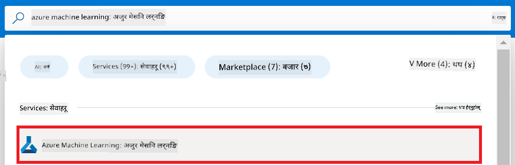

1. Navigation menu bata **+ Create** channu.

1. Navigation menu bata **New workspace** channu.

    

1. Nimnalikhit kaam haru garnu:

    - Tapai ko Azure **Subscription** channu.
    - Prayog garna ko lagi **Resource group** channu (awasyak parne ho bhane naya group banau).
    - **Workspace Name** halnu. Yo unique hunu parcha.
    - Prayog garna man parne **Region** channu.
    - Prayog garna man parne **Storage account** channu (awasyak parne ho bhane naya banau).
    - Prayog garna man parne **Key vault** channu (awasyak parne ho bhane naya banau).
    - Prayog garna man parne **Application insights** channu (awasyak parne ho bhane naya banau).
    - Prayog garna man parne **Container registry** channu (awasyak parne ho bhane naya banau).

    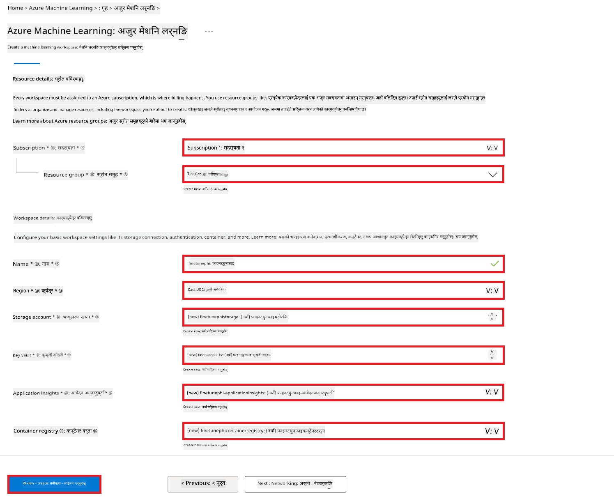

1. **Review + Create** channu.

1. **Create** channu.

### Azure Subscription ma GPU quota ko request garnu

Yo E2E sample ma, fine-tuning ko lagi *Standard_NC24ads_A100_v4 GPU* prayog garine cha, jaslai quota ko request garnu parcha, ra deployment ko lagi *Standard_E4s_v3* CPU prayog garine cha, jaslai quota request chahindaina.

> [!NOTE]
>
> Pay-As-You-Go subscription haru matra GPU allocation ko lagi eligible huncha; benefit subscription haru ahile support hudainan.
>
> Benefit subscription haru (jasta ki Visual Studio Enterprise Subscription) ya chito fine-tuning ra deployment process test garna chahane haru ko lagi, yo tutorial CPU sanga minimal dataset ko upayog garera fine-tuning garne guidance pani dincha. Tara, GPU ra thulo dataset ko upayog garda fine-tuning ko parinaam dherai ramro aaucha.

1. [Azure ML Studio](https://ml.azure.com/home?wt.mc_id=studentamb_279723) ma janu.

1. *Standard NCADSA100v4 Family* quota ko request garnu ko lagi nimnalikhit kaam haru garnu:

    - Left side tab bata **Quota** channu.
    - Prayog garna man parne **Virtual machine family** channu. Udaharan ko lagi, **Standard NCADSA100v4 Family Cluster Dedicated vCPUs** channu, jasma *Standard_NC24ads_A100_v4* GPU samet cha.
    - Navigation menu bata **Request quota** channu.

        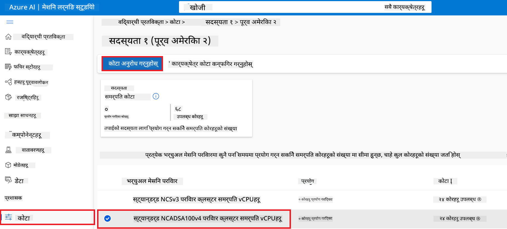

    - Request quota page bhitra, tapai le prayog garna man parne **New cores limit** halnu (jasta ki 24).
    - Request quota page bhitra, **Submit** channu GPU quota ko request garna.

> [!NOTE]
> Tapai le tapai ko awasyakta anusar GPU ya CPU channu saknu huncha [Sizes for Virtual Machines in Azure](https://learn.microsoft.com/azure/virtual-machines/sizes/overview?tabs=breakdownseries%2Cgeneralsizelist%2Ccomputesizelist%2Cmemorysizelist%2Cstoragesizelist%2Cgpusizelist%2Cfpgasizelist%2Chpcsizelist) document herera.

### Role assignment add garnu

Model haru fine-tune ra deploy garna, sabhanda pahile User Assigned Managed Identity (UAI) banayera uslai upayukt permissions dina parcha. Yo UAI deployment ko bela authentication ko lagi prayog huncha.

#### User Assigned Managed Identity (UAI) banau

1. Portal page ko mathi ko **search bar** ma *managed identities* type garnu ra aayeka options ma bata **Managed Identities** channu.

    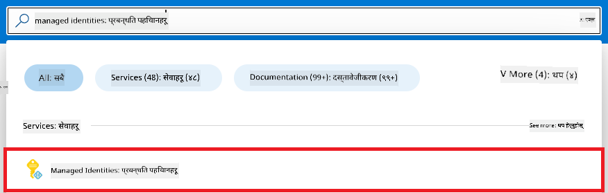

1. **+ Create** channu.

    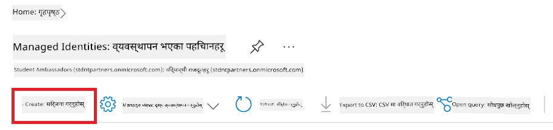

1. Nimnalikhit kaam haru garnu:

    - Tapai ko Azure **Subscription** channu.
    - Prayog garna ko lagi **Resource group** channu (awasyak parne ho bhane naya banau).
    - Prayog garna man parne **Region** channu.
    - **Name** halnu. Yo unique hunu parcha.

1. **Review + create** channu.

1. **+ Create** channu.

#### Managed Identity ma Contributor role assignment add garnu

1. Banayeko Managed Identity resource ma janu.

1. Left side tab bata **Azure role assignments** channu.

1. Navigation menu bata **+Add role assignment** channu.

1. Add role assignment page bhitra, nimnalikhit kaam garnu:
    - **Scope** lai **Resource group** ma set garnu.
    - Tapai ko Azure **Subscription** channu.
    - Prayog garna man parne **Resource group** channu.
    - **Role** lai **Contributor** ma set garnu.

    

1. **Save** channu.

#### Managed Identity ma Storage Blob Data Reader role assignment add garnu

1. Portal page ko mathi ko **search bar** ma *storage accounts* type garnu ra aayeka options ma bata **Storage accounts** channu.

    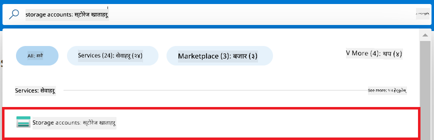

1. Azure Machine Learning workspace sanga sambandhit storage account channu. Udaharan ko lagi, *finetunephistorage*.

1. Add role assignment page ma janu ko lagi nimnalikhit kaam haru garnu:

    - Banayeko Azure Storage account ma janu.
    - Left side tab bata **Access Control (IAM)** channu.
    - Navigation menu bata **+ Add** channu.
    - Navigation menu bata **Add role assignment** channu.

    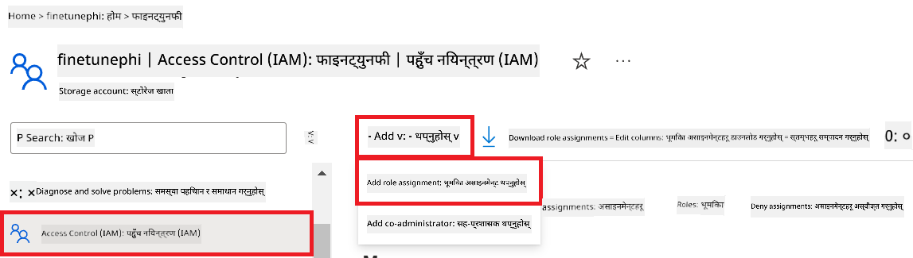

1. Add role assignment page bhitra, nimnalikhit kaam garnu:

    - Role page ma, **search bar** ma *Storage Blob Data Reader* type garnu ra aayeka options ma bata **Storage Blob Data Reader** channu.
    - Role page ma, **Next** channu.
    - Members page ma, **Assign access to** ma **Managed identity** channu.
    - Members page ma, **+ Select members** channu.
    - Select managed identities page ma, tapai ko Azure **Subscription** channu.
    - Select managed identities page ma, **Managed identity** lai **Manage Identity** ma set garnu.
    - Banayeko Manage Identity channu. Udaharan ko lagi, *finetunephi-managedidentity*.
    - **Select** channu.

    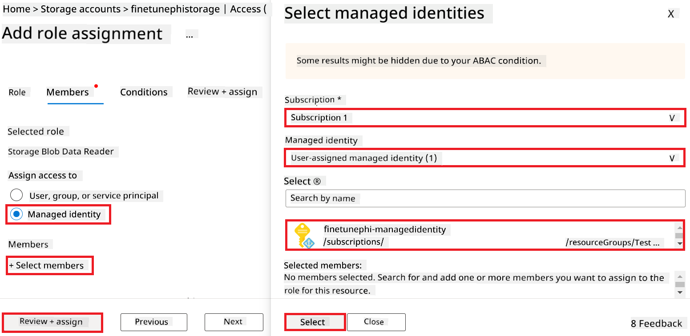

1. **Review + assign** channu.

#### Managed Identity ma AcrPull role assignment add garnu

1. Portal page ko mathi ko **search bar** ma *container registries* type garnu ra aayeka options ma bata **Container registries** channu.

    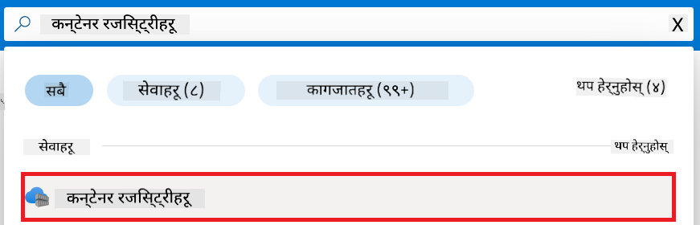

1. Azure Machine Learning workspace sanga sambandhit container registry channu. Udaharan ko lagi, *finetunephicontainerregistries*.

1. Add role assignment page ma janu ko lagi nimnalikhit kaam haru garnu:

    - Left side tab bata **Access Control (IAM)** channu.
    - Navigation menu bata **+ Add** channu.
    - Navigation menu bata **Add role assignment** channu.

1. Add role assignment page bhitra, nimnalikhit kaam garnu:

    - Role page ma, **search bar** ma *AcrPull* type garnu ra aayeka options ma bata **AcrPull** channu.
    - Role page ma, **Next** channu.
    - Members page ma, **Assign access to** ma **Managed identity** channu.
    - Members page ma, **+ Select members** channu.
    - Select managed identities page ma, tapai ko Azure **Subscription** channu.
    - Select managed identities page ma, **Managed identity** lai **Manage Identity** ma set garnu.
    - Banayeko Manage Identity channu. Udaharan ko lagi, *finetunephi-managedidentity*.
    - **Select** channu.
    - **Review + assign** channu.

### Project set up garnu

Aba, tapai le ek folder banayera tyo vitra kaam garnu parcha ra virtual environment set up garera program development garne cha, jun program user sanga interact garne ra Azure Cosmos DB ma stored chat history ko adhar ma response dincha.

#### Kaam garna ko lagi folder banau

1. Terminal window kholnu ra nimnalikhit command type garera *finetune-phi* bhanne folder default path ma banau.

    ```console
    mkdir finetune-phi
    ```

1. Nimnalikhit command terminal ma type garera *finetune-phi* folder vitra janu.

    ```console
    cd finetune-phi
    ```

#### Virtual environment banau

1. Nimnalikhit command terminal ma type garera *.venv* bhanne virtual environment banau.

    ```console
    python -m venv .venv
    ```

1. Nimnalikhit command terminal ma type garera virtual environment activate gar.

    ```console
    .venv\Scripts\activate.bat
    ```

> [!NOTE]
>
> Yo sahi bhaye, command prompt agadi *(.venv)* dekhincha.

#### Awasyak packages install garnu

1. Nimnalikhit command haru terminal ma type garera awasyak packages install garnu.

    ```console
    pip install datasets==2.19.1
    pip install transformers==4.41.1
    pip install azure-ai-ml==1.16.0
    pip install torch==2.3.1
    pip install trl==0.9.4
    pip install promptflow==1.12.0
    ```

#### Project file haru banau

Yo exercise ma, tapai haru le hamro project ko awasyak file haru banaucha. Yo file haru ma dataset download garne script, Azure Machine Learning environment setup garne script, Phi-3 model fine-tune garne script, ra fine-tuned model deploy garne script samet cha. Tapai le *conda.yml* file pani banayera fine-tuning environment setup garne cha.

Yo exercise ma tapai le:

- Dataset download garna *download_dataset.py* file banau.
- Azure Machine Learning environment setup garna *setup_ml.py* file banau.
- Dataset ko upayog garera Phi-3 model fine-tune garna *finetuning_dir* folder vitra *fine_tune.py* file banau.
- Fine-tuning environment setup garna *conda.yml* file banau.
- Fine-tuned model deploy garna *deploy_model.py* file banau.
- Fine-tuned model integrate garera Prompt flow ma execute garna *integrate_with_promptflow.py* file banau.
- Prompt flow ko workflow structure set up garna *flow.dag.yml* file banau.
- Azure ko information halna *config.py* file banau.

> [!NOTE]
>
> Sampurna folder structure:
>
> ```text
> └── YourUserName
> .    └── finetune-phi
> .        ├── finetuning_dir
> .        │      └── fine_tune.py
> .        ├── conda.yml
> .        ├── config.py
> .        ├── deploy_model.py
> .        ├── download_dataset.py
> .        ├── flow.dag.yml
> .        ├── integrate_with_promptflow.py
> .        └── setup_ml.py
> ```

1. **Visual Studio Code** kholnu.

1. Menu bar bata **File** channu.

1. **Open Folder** channu.

1. *finetune-phi* folder channu, jo *C:\Users\yourUserName\finetune-phi* ma cha.

    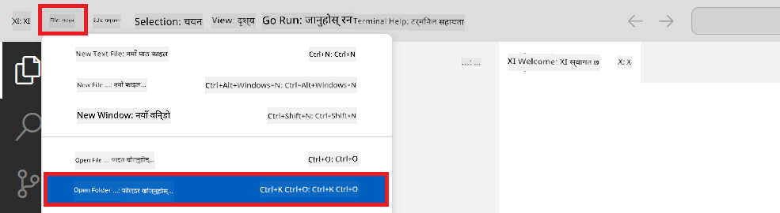

1. Visual Studio Code ko left pane ma right-click gari **New File** channu ra *download_dataset.py* file banau.

1. Left pane ma right-click gari **New File** channu ra *setup_ml.py* file banau.

1. Left pane ma right-click gari **New File** channu ra *deploy_model.py* file banau.

    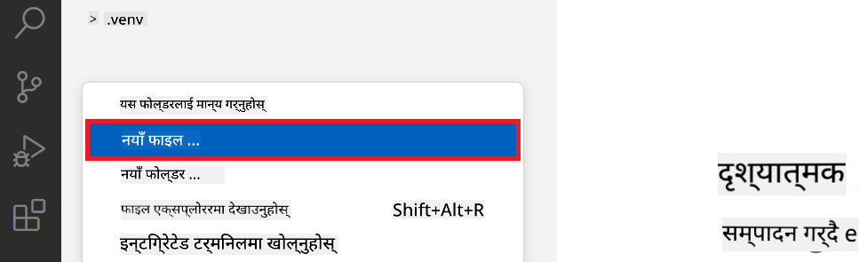

1. Left pane ma right-click gari **New Folder** channu ra *finetuning_dir* bhanne naya folder banau.

1. *finetuning_dir* folder vitra *fine_tune.py* bhanne naya file banau.

#### *conda.yml* file banau ra configure garnu

1. Visual Studio Code ko left pane ma right-click gari **New File** channu ra *conda.yml* file banau.

1. *conda.yml* file vitra nimnalikhit code halera Phi-3 model ko fine-tuning environment setup garnu.

    ```yml
    name: phi-3-training-env
    channels:
      - defaults
      - conda-forge
    dependencies:
      - python=3.10
      - pip
      - numpy<2.0
      - pip:
          - torch==2.4.0
          - torchvision==0.19.0
          - trl==0.8.6
          - transformers==4.41
          - datasets==2.21.0
          - azureml-core==1.57.0
          - azure-storage-blob==12.19.0
          - azure-ai-ml==1.16
          - azure-identity==1.17.1
          - accelerate==0.33.0
          - mlflow==2.15.1
          - azureml-mlflow==1.57.0
    ```

#### *config.py* file banau ra configure garnu

1. Visual Studio Code ko left pane ma right-click gari **New File** channu ra *config.py* file banau.

1. Nimnalikhit code *config.py* file vitra halera Azure ko information sametnu.

    ```python
    # Azure settings
    AZURE_SUBSCRIPTION_ID = "your_subscription_id"
    AZURE_RESOURCE_GROUP_NAME = "your_resource_group_name" # "TestGroup"

    # Azure Machine Learning settings
    AZURE_ML_WORKSPACE_NAME = "your_workspace_name" # "finetunephi-workspace"

    # Azure Managed Identity settings
    AZURE_MANAGED_IDENTITY_CLIENT_ID = "your_azure_managed_identity_client_id"
    AZURE_MANAGED_IDENTITY_NAME = "your_azure_managed_identity_name" # "finetunephi-mangedidentity"
    AZURE_MANAGED_IDENTITY_RESOURCE_ID = f"/subscriptions/{AZURE_SUBSCRIPTION_ID}/resourceGroups/{AZURE_RESOURCE_GROUP_NAME}/providers/Microsoft.ManagedIdentity/userAssignedIdentities/{AZURE_MANAGED_IDENTITY_NAME}"

    # Dataset file paths
    TRAIN_DATA_PATH = "data/train_data.jsonl"
    TEST_DATA_PATH = "data/test_data.jsonl"

    # Fine-tuned model settings
    AZURE_MODEL_NAME = "your_fine_tuned_model_name" # "finetune-phi-model"
    AZURE_ENDPOINT_NAME = "your_fine_tuned_model_endpoint_name" # "finetune-phi-endpoint"
    AZURE_DEPLOYMENT_NAME = "your_fine_tuned_model_deployment_name" # "finetune-phi-deployment"

    AZURE_ML_API_KEY = "your_fine_tuned_model_api_key"
    AZURE_ML_ENDPOINT = "your_fine_tuned_model_endpoint_uri" # "https://{your-endpoint-name}.{your-region}.inference.ml.azure.com/score"
    ```

#### Azure environment variables halnu

1. Azure Subscription ID halna nimnalikhit kaam haru garnu:

    - Portal page ko mathi ko **search bar** ma *subscriptions* type garnu ra aayeka options ma bata **Subscriptions** channu.
    - Tapai le prayog gariraheko Azure Subscription channu.
    - Tapai ko Subscription ID copy garera *config.py* file vitra paste garnu.
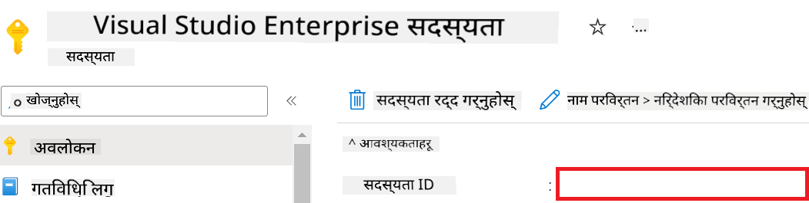

1. Azure Workspace Name थप्नका लागि तलका कार्यहरू गर्नुहोस्:

    - तपाईंले सिर्जना गरेको Azure Machine Learning स्रोतमा जानुहोस्।
    - आफ्नो खाता नाम *config.py* फाइलमा कपी गरेर पेस्ट गर्नुहोस्।

    

1. Azure Resource Group Name थप्नका लागि तलका कार्यहरू गर्नुहोस्:

    - तपाईंले सिर्जना गरेको Azure Machine Learning स्रोतमा जानुहोस्।
    - आफ्नो Azure Resource Group Name *config.py* फाइलमा कपी गरेर पेस्ट गर्नुहोस्।

    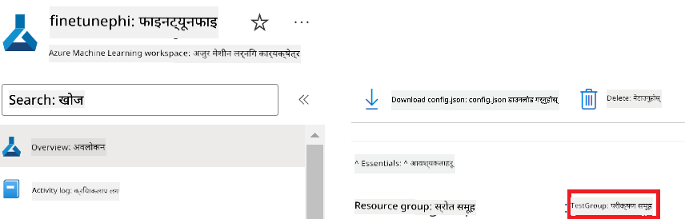

2. Azure Managed Identity नाम थप्नका लागि तलका कार्यहरू गर्नुहोस्

    - तपाईंले सिर्जना गरेको Managed Identities स्रोतमा जानुहोस्।
    - आफ्नो Azure Managed Identity नाम *config.py* फाइलमा कपी गरेर पेस्ट गर्नुहोस्।

    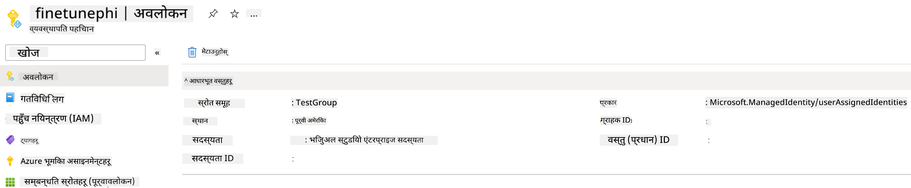

### Fine-tuning का लागि dataset तयार पार्नुहोस्

यस अभ्यासमा, तपाईं *download_dataset.py* फाइल चलाएर *ULTRACHAT_200k* dataset तपाईंको स्थानीय वातावरणमा डाउनलोड गर्नुहुनेछ। त्यसपछि, तपाईंले यो dataset प्रयोग गरी Azure Machine Learning मा Phi-3 मोडेललाई fine-tune गर्नु हुनेछ।

#### *download_dataset.py* प्रयोग गरी dataset डाउनलोड गर्नुहोस्

1. Visual Studio Code मा *download_dataset.py* फाइल खोल्नुहोस्।

1. *download_dataset.py* मा तलको कोड थप्नुहोस्।

    ```python
    import json
    import os
    from datasets import load_dataset
    from config import (
        TRAIN_DATA_PATH,
        TEST_DATA_PATH)

    def load_and_split_dataset(dataset_name, config_name, split_ratio):
        """
        Load and split a dataset.
        """
        # Load the dataset with the specified name, configuration, and split ratio
        dataset = load_dataset(dataset_name, config_name, split=split_ratio)
        print(f"Original dataset size: {len(dataset)}")
        
        # Split the dataset into train and test sets (80% train, 20% test)
        split_dataset = dataset.train_test_split(test_size=0.2)
        print(f"Train dataset size: {len(split_dataset['train'])}")
        print(f"Test dataset size: {len(split_dataset['test'])}")
        
        return split_dataset

    def save_dataset_to_jsonl(dataset, filepath):
        """
        Save a dataset to a JSONL file.
        """
        # Create the directory if it does not exist
        os.makedirs(os.path.dirname(filepath), exist_ok=True)
        
        # Open the file in write mode
        with open(filepath, 'w', encoding='utf-8') as f:
            # Iterate over each record in the dataset
            for record in dataset:
                # Dump the record as a JSON object and write it to the file
                json.dump(record, f)
                # Write a newline character to separate records
                f.write('\n')
        
        print(f"Dataset saved to {filepath}")

    def main():
        """
        Main function to load, split, and save the dataset.
        """
        # Load and split the ULTRACHAT_200k dataset with a specific configuration and split ratio
        dataset = load_and_split_dataset("HuggingFaceH4/ultrachat_200k", 'default', 'train_sft[:1%]')
        
        # Extract the train and test datasets from the split
        train_dataset = dataset['train']
        test_dataset = dataset['test']

        # Save the train dataset to a JSONL file
        save_dataset_to_jsonl(train_dataset, TRAIN_DATA_PATH)
        
        # Save the test dataset to a separate JSONL file
        save_dataset_to_jsonl(test_dataset, TEST_DATA_PATH)

    if __name__ == "__main__":
        main()

    ```

> [!TIP]
>
> **CPU प्रयोग गरेर न्यूनतम dataset सँग fine-tuning गर्ने सुझाव**
>
> यदि तपाईं CPU प्रयोग गरेर fine-tuning गर्न चाहनुहुन्छ भने, यो तरिका विशेष गरी benefit subscriptions (जस्तै Visual Studio Enterprise Subscription) भएका प्रयोगकर्ताहरूका लागि वा छिटो fine-tuning र deployment प्रक्रिया परीक्षण गर्न उपयुक्त छ।
>
> `dataset = load_and_split_dataset("HuggingFaceH4/ultrachat_200k", 'default', 'train_sft[:1%]')` with `dataset = load_and_split_dataset("HuggingFaceH4/ultrachat_200k", 'default', 'train_sft[:10]')` सँग प्रतिस्थापन गर्नुहोस्
>

1. आफ्नो टर्मिनलमा तलको आदेश टाइप गरेर स्क्रिप्ट चलाउनुहोस् र dataset स्थानीय वातावरणमा डाउनलोड गर्नुहोस्।

    ```console
    python download_data.py
    ```

1. dataset सफलतापूर्वक *finetune-phi/data* डाइरेक्टरीमा सुरक्षित भएको छ कि छैन जाँच गर्नुहोस्।

> [!NOTE]
>
> **Dataset आकार र fine-tuning समय**
>
> यस E2E नमूनामा, तपाईं dataset को केवल 1% (`train_sft[:1%]`) मात्र प्रयोग गर्नुहुन्छ। यसले डेटा मात्रा कम गरेर अपलोड र fine-tuning दुवै प्रक्रिया छिटो बनाउँछ। तपाईं प्रशिक्षण समय र मोडेल प्रदर्शन बीच सन्तुलन मिलाउन प्रतिशत समायोजन गर्न सक्नुहुन्छ। dataset को सानो उपसमूह प्रयोग गर्दा fine-tuning को लागि आवश्यक समय कम हुन्छ, जसले E2E नमूनाका लागि प्रक्रिया सजिलो बनाउँछ।

## Scenario 2: Phi-3 मोडेल fine-tune गरी Azure Machine Learning Studio मा Deploy गर्नुहोस्

### Azure CLI सेटअप गर्नुहोस्

तपाईंले आफ्नो वातावरण प्रमाणित गर्न Azure CLI सेटअप गर्न आवश्यक छ। Azure CLI ले कमाण्ड लाइनबाट Azure स्रोतहरू व्यवस्थापन गर्न अनुमति दिन्छ र Azure Machine Learning लाई यी स्रोतहरू पहुँच गर्न आवश्यक प्रमाणपत्रहरू उपलब्ध गराउँछ। सुरु गर्न [Azure CLI](https://learn.microsoft.com/cli/azure/install-azure-cli) इन्स्टल गर्नुहोस्।

1. टर्मिनल विन्डो खोल्नुहोस् र Azure खाता लगइन गर्न तलको आदेश टाइप गर्नुहोस्।

    ```console
    az login
    ```

1. प्रयोग गर्न आफ्नो Azure खाता चयन गर्नुहोस्।

1. प्रयोग गर्न Azure subscription चयन गर्नुहोस्।

    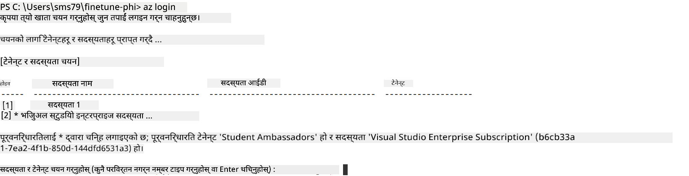

> [!TIP]
>
> Azure मा साइन इन गर्न समस्या परेमा, device code प्रयोग गरेर साइन इन गर्न प्रयास गर्नुहोस्। टर्मिनल विन्डो खोल्नुहोस् र तलको आदेश टाइप गर्नुहोस्:
>
> ```console
> az login --use-device-code
> ```
>

### Phi-3 मोडेल fine-tune गर्नुहोस्

यस अभ्यासमा, तपाईंले दिइएको dataset प्रयोग गरी Phi-3 मोडेल fine-tune गर्नुहुनेछ। पहिले, *fine_tune.py* फाइलमा fine-tuning प्रक्रिया परिभाषित गर्नुहोस्। त्यसपछि, Azure Machine Learning वातावरण कन्फिगर गरी *setup_ml.py* फाइल चलाएर fine-tuning प्रक्रिया सुरु गर्नुहोस्। यस स्क्रिप्टले Azure Machine Learning वातावरण भित्र fine-tuning सुनिश्चित गर्दछ।

*setup_ml.py* चलाउँदा, fine-tuning प्रक्रिया Azure Machine Learning वातावरणमा चल्नेछ।

#### *fine_tune.py* फाइलमा कोड थप्नुहोस्

1. *finetuning_dir* फोल्डरमा जानुहोस् र Visual Studio Code मा *fine_tune.py* फाइल खोल्नुहोस्।

1. *fine_tune.py* मा तलको कोड थप्नुहोस्।

    ```python
    import argparse
    import sys
    import logging
    import os
    from datasets import load_dataset
    import torch
    import mlflow
    from transformers import AutoModelForCausalLM, AutoTokenizer, TrainingArguments
    from trl import SFTTrainer

    # To avoid the INVALID_PARAMETER_VALUE error in MLflow, disable MLflow integration
    os.environ["DISABLE_MLFLOW_INTEGRATION"] = "True"

    # Logging setup
    logging.basicConfig(
        format="%(asctime)s - %(levelname)s - %(name)s - %(message)s",
        datefmt="%Y-%m-%d %H:%M:%S",
        handlers=[logging.StreamHandler(sys.stdout)],
        level=logging.WARNING
    )
    logger = logging.getLogger(__name__)

    def initialize_model_and_tokenizer(model_name, model_kwargs):
        """
        Initialize the model and tokenizer with the given pretrained model name and arguments.
        """
        model = AutoModelForCausalLM.from_pretrained(model_name, **model_kwargs)
        tokenizer = AutoTokenizer.from_pretrained(model_name)
        tokenizer.model_max_length = 2048
        tokenizer.pad_token = tokenizer.unk_token
        tokenizer.pad_token_id = tokenizer.convert_tokens_to_ids(tokenizer.pad_token)
        tokenizer.padding_side = 'right'
        return model, tokenizer

    def apply_chat_template(example, tokenizer):
        """
        Apply a chat template to tokenize messages in the example.
        """
        messages = example["messages"]
        if messages[0]["role"] != "system":
            messages.insert(0, {"role": "system", "content": ""})
        example["text"] = tokenizer.apply_chat_template(
            messages, tokenize=False, add_generation_prompt=False
        )
        return example

    def load_and_preprocess_data(train_filepath, test_filepath, tokenizer):
        """
        Load and preprocess the dataset.
        """
        train_dataset = load_dataset('json', data_files=train_filepath, split='train')
        test_dataset = load_dataset('json', data_files=test_filepath, split='train')
        column_names = list(train_dataset.features)

        train_dataset = train_dataset.map(
            apply_chat_template,
            fn_kwargs={"tokenizer": tokenizer},
            num_proc=10,
            remove_columns=column_names,
            desc="Applying chat template to train dataset",
        )

        test_dataset = test_dataset.map(
            apply_chat_template,
            fn_kwargs={"tokenizer": tokenizer},
            num_proc=10,
            remove_columns=column_names,
            desc="Applying chat template to test dataset",
        )

        return train_dataset, test_dataset

    def train_and_evaluate_model(train_dataset, test_dataset, model, tokenizer, output_dir):
        """
        Train and evaluate the model.
        """
        training_args = TrainingArguments(
            bf16=True,
            do_eval=True,
            output_dir=output_dir,
            eval_strategy="epoch",
            learning_rate=5.0e-06,
            logging_steps=20,
            lr_scheduler_type="cosine",
            num_train_epochs=3,
            overwrite_output_dir=True,
            per_device_eval_batch_size=4,
            per_device_train_batch_size=4,
            remove_unused_columns=True,
            save_steps=500,
            seed=0,
            gradient_checkpointing=True,
            gradient_accumulation_steps=1,
            warmup_ratio=0.2,
        )

        trainer = SFTTrainer(
            model=model,
            args=training_args,
            train_dataset=train_dataset,
            eval_dataset=test_dataset,
            max_seq_length=2048,
            dataset_text_field="text",
            tokenizer=tokenizer,
            packing=True
        )

        train_result = trainer.train()
        trainer.log_metrics("train", train_result.metrics)

        mlflow.transformers.log_model(
            transformers_model={"model": trainer.model, "tokenizer": tokenizer},
            artifact_path=output_dir,
        )

        tokenizer.padding_side = 'left'
        eval_metrics = trainer.evaluate()
        eval_metrics["eval_samples"] = len(test_dataset)
        trainer.log_metrics("eval", eval_metrics)

    def main(train_file, eval_file, model_output_dir):
        """
        Main function to fine-tune the model.
        """
        model_kwargs = {
            "use_cache": False,
            "trust_remote_code": True,
            "torch_dtype": torch.bfloat16,
            "device_map": None,
            "attn_implementation": "eager"
        }

        # pretrained_model_name = "microsoft/Phi-3-mini-4k-instruct"
        pretrained_model_name = "microsoft/Phi-3.5-mini-instruct"

        with mlflow.start_run():
            model, tokenizer = initialize_model_and_tokenizer(pretrained_model_name, model_kwargs)
            train_dataset, test_dataset = load_and_preprocess_data(train_file, eval_file, tokenizer)
            train_and_evaluate_model(train_dataset, test_dataset, model, tokenizer, model_output_dir)

    if __name__ == "__main__":
        parser = argparse.ArgumentParser()
        parser.add_argument("--train-file", type=str, required=True, help="Path to the training data")
        parser.add_argument("--eval-file", type=str, required=True, help="Path to the evaluation data")
        parser.add_argument("--model_output_dir", type=str, required=True, help="Directory to save the fine-tuned model")
        args = parser.parse_args()
        main(args.train_file, args.eval_file, args.model_output_dir)

    ```

1. *fine_tune.py* फाइल सुरक्षित गरी बन्द गर्नुहोस्।

> [!TIP]
> **Phi-3.5 मोडेल पनि fine-tune गर्न सकिन्छ**
>
> *fine_tune.py* फाइलमा, तपाईं `pretrained_model_name` from `"microsoft/Phi-3-mini-4k-instruct"` to any model you want to fine-tune. For example, if you change it to `"microsoft/Phi-3.5-mini-instruct"`, you'll be using the Phi-3.5-mini-instruct model for fine-tuning. To find and use the model name you prefer, visit [Hugging Face](https://huggingface.co/), search for the model you're interested in, and then copy and paste its name into the `pretrained_model_name` फिल्ड आफ्नो स्क्रिप्टमा परिवर्तन गर्न सक्नुहुन्छ।
>
> :::image type="content" source="../../imgs/03/FineTuning-PromptFlow/finetunephi3.5.png" alt-text="Fine tune Phi-3.5.":::
>

#### *setup_ml.py* फाइलमा कोड थप्नुहोस्

1. Visual Studio Code मा *setup_ml.py* फाइल खोल्नुहोस्।

1. *setup_ml.py* मा तलको कोड थप्नुहोस्।

    ```python
    import logging
    from azure.ai.ml import MLClient, command, Input
    from azure.ai.ml.entities import Environment, AmlCompute
    from azure.identity import AzureCliCredential
    from config import (
        AZURE_SUBSCRIPTION_ID,
        AZURE_RESOURCE_GROUP_NAME,
        AZURE_ML_WORKSPACE_NAME,
        TRAIN_DATA_PATH,
        TEST_DATA_PATH
    )

    # Constants

    # Uncomment the following lines to use a CPU instance for training
    # COMPUTE_INSTANCE_TYPE = "Standard_E16s_v3" # cpu
    # COMPUTE_NAME = "cpu-e16s-v3"
    # DOCKER_IMAGE_NAME = "mcr.microsoft.com/azureml/openmpi4.1.0-ubuntu20.04:latest"

    # Uncomment the following lines to use a GPU instance for training
    COMPUTE_INSTANCE_TYPE = "Standard_NC24ads_A100_v4"
    COMPUTE_NAME = "gpu-nc24s-a100-v4"
    DOCKER_IMAGE_NAME = "mcr.microsoft.com/azureml/curated/acft-hf-nlp-gpu:59"

    CONDA_FILE = "conda.yml"
    LOCATION = "eastus2" # Replace with the location of your compute cluster
    FINETUNING_DIR = "./finetuning_dir" # Path to the fine-tuning script
    TRAINING_ENV_NAME = "phi-3-training-environment" # Name of the training environment
    MODEL_OUTPUT_DIR = "./model_output" # Path to the model output directory in azure ml

    # Logging setup to track the process
    logger = logging.getLogger(__name__)
    logging.basicConfig(
        format="%(asctime)s - %(levelname)s - %(name)s - %(message)s",
        datefmt="%Y-%m-%d %H:%M:%S",
        level=logging.WARNING
    )

    def get_ml_client():
        """
        Initialize the ML Client using Azure CLI credentials.
        """
        credential = AzureCliCredential()
        return MLClient(credential, AZURE_SUBSCRIPTION_ID, AZURE_RESOURCE_GROUP_NAME, AZURE_ML_WORKSPACE_NAME)

    def create_or_get_environment(ml_client):
        """
        Create or update the training environment in Azure ML.
        """
        env = Environment(
            image=DOCKER_IMAGE_NAME,  # Docker image for the environment
            conda_file=CONDA_FILE,  # Conda environment file
            name=TRAINING_ENV_NAME,  # Name of the environment
        )
        return ml_client.environments.create_or_update(env)

    def create_or_get_compute_cluster(ml_client, compute_name, COMPUTE_INSTANCE_TYPE, location):
        """
        Create or update the compute cluster in Azure ML.
        """
        try:
            compute_cluster = ml_client.compute.get(compute_name)
            logger.info(f"Compute cluster '{compute_name}' already exists. Reusing it for the current run.")
        except Exception:
            logger.info(f"Compute cluster '{compute_name}' does not exist. Creating a new one with size {COMPUTE_INSTANCE_TYPE}.")
            compute_cluster = AmlCompute(
                name=compute_name,
                size=COMPUTE_INSTANCE_TYPE,
                location=location,
                tier="Dedicated",  # Tier of the compute cluster
                min_instances=0,  # Minimum number of instances
                max_instances=1  # Maximum number of instances
            )
            ml_client.compute.begin_create_or_update(compute_cluster).wait()  # Wait for the cluster to be created
        return compute_cluster

    def create_fine_tuning_job(env, compute_name):
        """
        Set up the fine-tuning job in Azure ML.
        """
        return command(
            code=FINETUNING_DIR,  # Path to fine_tune.py
            command=(
                "python fine_tune.py "
                "--train-file ${{inputs.train_file}} "
                "--eval-file ${{inputs.eval_file}} "
                "--model_output_dir ${{inputs.model_output}}"
            ),
            environment=env,  # Training environment
            compute=compute_name,  # Compute cluster to use
            inputs={
                "train_file": Input(type="uri_file", path=TRAIN_DATA_PATH),  # Path to the training data file
                "eval_file": Input(type="uri_file", path=TEST_DATA_PATH),  # Path to the evaluation data file
                "model_output": MODEL_OUTPUT_DIR
            }
        )

    def main():
        """
        Main function to set up and run the fine-tuning job in Azure ML.
        """
        # Initialize ML Client
        ml_client = get_ml_client()

        # Create Environment
        env = create_or_get_environment(ml_client)
        
        # Create or get existing compute cluster
        create_or_get_compute_cluster(ml_client, COMPUTE_NAME, COMPUTE_INSTANCE_TYPE, LOCATION)

        # Create and Submit Fine-Tuning Job
        job = create_fine_tuning_job(env, COMPUTE_NAME)
        returned_job = ml_client.jobs.create_or_update(job)  # Submit the job
        ml_client.jobs.stream(returned_job.name)  # Stream the job logs
        
        # Capture the job name
        job_name = returned_job.name
        print(f"Job name: {job_name}")

    if __name__ == "__main__":
        main()

    ```

1. `COMPUTE_INSTANCE_TYPE`, `COMPUTE_NAME`, and `LOCATION` लाई तपाईंको विवरण अनुसार परिवर्तन गर्नुहोस्।

    ```python
   # Uncomment the following lines to use a GPU instance for training
    COMPUTE_INSTANCE_TYPE = "Standard_NC24ads_A100_v4"
    COMPUTE_NAME = "gpu-nc24s-a100-v4"
    ...
    LOCATION = "eastus2" # Replace with the location of your compute cluster
    ```

> [!TIP]
>
> **CPU प्रयोग गरेर न्यूनतम dataset सँग fine-tuning गर्ने सुझाव**
>
> यदि CPU प्रयोग गरेर fine-tuning गर्न चाहनुहुन्छ भने, यो तरिका विशेष गरी benefit subscriptions (जस्तै Visual Studio Enterprise Subscription) भएका प्रयोगकर्ताहरूका लागि वा छिटो fine-tuning र deployment प्रक्रिया परीक्षण गर्न उपयुक्त छ।
>
> 1. *setup_ml* फाइल खोल्नुहोस्।
> 1. `COMPUTE_INSTANCE_TYPE`, `COMPUTE_NAME`, and `DOCKER_IMAGE_NAME` with the following. If you do not have access to *Standard_E16s_v3*, you can use an equivalent CPU instance or request a new quota.
> 1. Replace `LOCATION` लाई तपाईंको विवरण अनुसार परिवर्तन गर्नुहोस्।
>
>    ```python
>    # Uncomment the following lines to use a CPU instance for training
>    COMPUTE_INSTANCE_TYPE = "Standard_E16s_v3" # cpu
>    COMPUTE_NAME = "cpu-e16s-v3"
>    DOCKER_IMAGE_NAME = "mcr.microsoft.com/azureml/openmpi4.1.0-ubuntu20.04:latest"
>    LOCATION = "eastus2" # Replace with the location of your compute cluster
>    ```
>

1. *setup_ml.py* स्क्रिप्ट चलाएर Azure Machine Learning मा fine-tuning प्रक्रिया सुरु गर्न तलको आदेश टाइप गर्नुहोस्।

    ```python
    python setup_ml.py
    ```

1. यस अभ्यासमा, तपाईंले Azure Machine Learning प्रयोग गरी सफलतापूर्वक Phi-3 मोडेल fine-tune गर्नुभयो। *setup_ml.py* स्क्रिप्ट चलाउँदा Azure Machine Learning वातावरण तयार पारिएको र *fine_tune.py* फाइलमा परिभाषित fine-tuning प्रक्रिया सुरु गरिएको छ। कृपया ध्यान दिनुहोस् कि fine-tuning प्रक्रियामा धेरै समय लाग्न सक्छ। `python setup_ml.py` command, you need to wait for the process to complete. You can monitor the status of the fine-tuning job by following the link provided in the terminal to the Azure Machine Learning portal.

    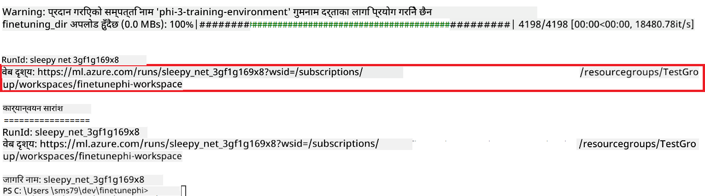

### Deploy the fine-tuned model

To integrate the fine-tuned Phi-3 model with Prompt Flow, you need to deploy the model to make it accessible for real-time inference. This process involves registering the model, creating an online endpoint, and deploying the model.

#### Set the model name, endpoint name, and deployment name for deployment

1. Open *config.py* file.

1. Replace `AZURE_MODEL_NAME = "your_fine_tuned_model_name"` with the desired name for your model.

1. Replace `AZURE_ENDPOINT_NAME = "your_fine_tuned_model_endpoint_name"` with the desired name for your endpoint.

1. Replace `AZURE_DEPLOYMENT_NAME = "your_fine_tuned_model_deployment_name"` मा आफ्नो deployment को नाम राखेर चलाउनुहोस्।

#### *deploy_model.py* फाइलमा कोड थप्नुहोस्

*deploy_model.py* फाइल चलाउँदा सम्पूर्ण deployment प्रक्रिया स्वचालित हुन्छ। यसले मोडेल दर्ता गर्छ, endpoint सिर्जना गर्छ, र config.py फाइलमा निर्दिष्ट सेटिङ्स अनुसार deployment कार्यान्वयन गर्छ, जसमा मोडेल नाम, endpoint नाम, र deployment नाम समावेश छन्।

1. Visual Studio Code मा *deploy_model.py* फाइल खोल्नुहोस्।

1. *deploy_model.py* मा तलको कोड थप्नुहोस्।

    ```python
    import logging
    from azure.identity import AzureCliCredential
    from azure.ai.ml import MLClient
    from azure.ai.ml.entities import Model, ProbeSettings, ManagedOnlineEndpoint, ManagedOnlineDeployment, IdentityConfiguration, ManagedIdentityConfiguration, OnlineRequestSettings
    from azure.ai.ml.constants import AssetTypes

    # Configuration imports
    from config import (
        AZURE_SUBSCRIPTION_ID,
        AZURE_RESOURCE_GROUP_NAME,
        AZURE_ML_WORKSPACE_NAME,
        AZURE_MANAGED_IDENTITY_RESOURCE_ID,
        AZURE_MANAGED_IDENTITY_CLIENT_ID,
        AZURE_MODEL_NAME,
        AZURE_ENDPOINT_NAME,
        AZURE_DEPLOYMENT_NAME
    )

    # Constants
    JOB_NAME = "your-job-name"
    COMPUTE_INSTANCE_TYPE = "Standard_E4s_v3"

    deployment_env_vars = {
        "SUBSCRIPTION_ID": AZURE_SUBSCRIPTION_ID,
        "RESOURCE_GROUP_NAME": AZURE_RESOURCE_GROUP_NAME,
        "UAI_CLIENT_ID": AZURE_MANAGED_IDENTITY_CLIENT_ID,
    }

    # Logging setup
    logging.basicConfig(
        format="%(asctime)s - %(levelname)s - %(name)s - %(message)s",
        datefmt="%Y-%m-%d %H:%M:%S",
        level=logging.DEBUG
    )
    logger = logging.getLogger(__name__)

    def get_ml_client():
        """Initialize and return the ML Client."""
        credential = AzureCliCredential()
        return MLClient(credential, AZURE_SUBSCRIPTION_ID, AZURE_RESOURCE_GROUP_NAME, AZURE_ML_WORKSPACE_NAME)

    def register_model(ml_client, model_name, job_name):
        """Register a new model."""
        model_path = f"azureml://jobs/{job_name}/outputs/artifacts/paths/model_output"
        logger.info(f"Registering model {model_name} from job {job_name} at path {model_path}.")
        run_model = Model(
            path=model_path,
            name=model_name,
            description="Model created from run.",
            type=AssetTypes.MLFLOW_MODEL,
        )
        model = ml_client.models.create_or_update(run_model)
        logger.info(f"Registered model ID: {model.id}")
        return model

    def delete_existing_endpoint(ml_client, endpoint_name):
        """Delete existing endpoint if it exists."""
        try:
            endpoint_result = ml_client.online_endpoints.get(name=endpoint_name)
            logger.info(f"Deleting existing endpoint {endpoint_name}.")
            ml_client.online_endpoints.begin_delete(name=endpoint_name).result()
            logger.info(f"Deleted existing endpoint {endpoint_name}.")
        except Exception as e:
            logger.info(f"No existing endpoint {endpoint_name} found to delete: {e}")

    def create_or_update_endpoint(ml_client, endpoint_name, description=""):
        """Create or update an endpoint."""
        delete_existing_endpoint(ml_client, endpoint_name)
        logger.info(f"Creating new endpoint {endpoint_name}.")
        endpoint = ManagedOnlineEndpoint(
            name=endpoint_name,
            description=description,
            identity=IdentityConfiguration(
                type="user_assigned",
                user_assigned_identities=[ManagedIdentityConfiguration(resource_id=AZURE_MANAGED_IDENTITY_RESOURCE_ID)]
            )
        )
        endpoint_result = ml_client.online_endpoints.begin_create_or_update(endpoint).result()
        logger.info(f"Created new endpoint {endpoint_name}.")
        return endpoint_result

    def create_or_update_deployment(ml_client, endpoint_name, deployment_name, model):
        """Create or update a deployment."""

        logger.info(f"Creating deployment {deployment_name} for endpoint {endpoint_name}.")
        deployment = ManagedOnlineDeployment(
            name=deployment_name,
            endpoint_name=endpoint_name,
            model=model.id,
            instance_type=COMPUTE_INSTANCE_TYPE,
            instance_count=1,
            environment_variables=deployment_env_vars,
            request_settings=OnlineRequestSettings(
                max_concurrent_requests_per_instance=3,
                request_timeout_ms=180000,
                max_queue_wait_ms=120000
            ),
            liveness_probe=ProbeSettings(
                failure_threshold=30,
                success_threshold=1,
                period=100,
                initial_delay=500,
            ),
            readiness_probe=ProbeSettings(
                failure_threshold=30,
                success_threshold=1,
                period=100,
                initial_delay=500,
            ),
        )
        deployment_result = ml_client.online_deployments.begin_create_or_update(deployment).result()
        logger.info(f"Created deployment {deployment.name} for endpoint {endpoint_name}.")
        return deployment_result

    def set_traffic_to_deployment(ml_client, endpoint_name, deployment_name):
        """Set traffic to the specified deployment."""
        try:
            # Fetch the current endpoint details
            endpoint = ml_client.online_endpoints.get(name=endpoint_name)
            
            # Log the current traffic allocation for debugging
            logger.info(f"Current traffic allocation: {endpoint.traffic}")
            
            # Set the traffic allocation for the deployment
            endpoint.traffic = {deployment_name: 100}
            
            # Update the endpoint with the new traffic allocation
            endpoint_poller = ml_client.online_endpoints.begin_create_or_update(endpoint)
            updated_endpoint = endpoint_poller.result()
            
            # Log the updated traffic allocation for debugging
            logger.info(f"Updated traffic allocation: {updated_endpoint.traffic}")
            logger.info(f"Set traffic to deployment {deployment_name} at endpoint {endpoint_name}.")
            return updated_endpoint
        except Exception as e:
            # Log any errors that occur during the process
            logger.error(f"Failed to set traffic to deployment: {e}")
            raise


    def main():
        ml_client = get_ml_client()

        registered_model = register_model(ml_client, AZURE_MODEL_NAME, JOB_NAME)
        logger.info(f"Registered model ID: {registered_model.id}")

        endpoint = create_or_update_endpoint(ml_client, AZURE_ENDPOINT_NAME, "Endpoint for finetuned Phi-3 model")
        logger.info(f"Endpoint {AZURE_ENDPOINT_NAME} is ready.")

        try:
            deployment = create_or_update_deployment(ml_client, AZURE_ENDPOINT_NAME, AZURE_DEPLOYMENT_NAME, registered_model)
            logger.info(f"Deployment {AZURE_DEPLOYMENT_NAME} is created for endpoint {AZURE_ENDPOINT_NAME}.")

            set_traffic_to_deployment(ml_client, AZURE_ENDPOINT_NAME, AZURE_DEPLOYMENT_NAME)
            logger.info(f"Traffic is set to deployment {AZURE_DEPLOYMENT_NAME} at endpoint {AZURE_ENDPOINT_NAME}.")
        except Exception as e:
            logger.error(f"Failed to create or update deployment: {e}")

    if __name__ == "__main__":
        main()

    ```

1. `JOB_NAME`:

    - Navigate to Azure Machine Learning resource that you created.
    - Select **Studio web URL** to open the Azure Machine Learning workspace.
    - Select **Jobs** from the left side tab.
    - Select the experiment for fine-tuning. For example, *finetunephi*.
    - Select the job that you created.
    - Copy and paste your job Name into the `JOB_NAME = "your-job-name"` in *deploy_model.py* file.

1. Replace `COMPUTE_INSTANCE_TYPE` तपाईंको विवरण अनुसार परिवर्तन गर्नुहोस्।

1. *deploy_model.py* स्क्रिप्ट चलाएर Azure Machine Learning मा deployment प्रक्रिया सुरु गर्न तलको आदेश टाइप गर्नुहोस्।

    ```python
    python deploy_model.py
    ```

> [!WARNING]
> तपाईंको खातामा अनावश्यक शुल्क लाग्नबाट बच्न, Azure Machine Learning workspace मा सिर्जना गरिएको endpoint मेटाउन नबिर्सनुहोस्।
>

#### Azure Machine Learning Workspace मा deployment स्थिति जाँच गर्नुहोस्

1. [Azure ML Studio](https://ml.azure.com/home?wt.mc_id=studentamb_279723) मा जानुहोस्।

1. तपाईंले सिर्जना गरेको Azure Machine Learning workspace मा जानुहोस्।

1. Azure Machine Learning workspace खोल्न **Studio web URL** चयन गर्नुहोस्।

1. बायाँ पट्टि रहेको ट्याबबाट **Endpoints** चयन गर्नुहोस्।

    

2. तपाईंले सिर्जना गरेको endpoint चयन गर्नुहोस्।

    

3. यस पृष्ठमा, तपाईंले deployment प्रक्रियामा सिर्जना गरिएका endpoints व्यवस्थापन गर्न सक्नुहुन्छ।

## Scenario 3: Prompt flow सँग एकीकृत गरी आफ्नो custom मोडेलसँग कुराकानी गर्नुहोस्

### Prompt flow सँग custom Phi-3 मोडेल एकीकृत गर्नुहोस्

तपाईंले सफलतापूर्वक fine-tuned मोडेल deployment गरेपछि, अब यसलाई Prompt flow सँग जोड्न सक्नुहुन्छ जसले तपाईंको मोडेललाई real-time एप्लिकेसनहरूमा प्रयोग गर्न अनुमति दिन्छ र विभिन्न interactive कार्यहरू गर्न सक्षम बनाउँछ।

#### Fine-tuned Phi-3 मोडेलको api key र endpoint uri सेट गर्नुहोस्

1. तपाईंले सिर्जना गरेको Azure Machine Learning workspace मा जानुहोस्।
1. बायाँ पट्टि ट्याबबाट **Endpoints** चयन गर्नुहोस्।
1. तपाईंले सिर्जना गरेको endpoint चयन गर्नुहोस्।
1. नेभिगेसन मेनुबाट **Consume** चयन गर्नुहोस्।
1. आफ्नो **REST endpoint** कपी गरेर *config.py* फाइलमा पेस्ट गर्नुहोस्, र `AZURE_ML_ENDPOINT = "your_fine_tuned_model_endpoint_uri"` with your **REST endpoint**.
1. Copy and paste your **Primary key** into the *config.py* file, replacing `AZURE_ML_API_KEY = "your_fine_tuned_model_api_key"` लाई आफ्नो **Primary key** सँग प्रतिस्थापन गर्नुहोस्।

    

#### *flow.dag.yml* फाइलमा कोड थप्नुहोस्

1. Visual Studio Code मा *flow.dag.yml* फाइल खोल्नुहोस्।

1. *flow.dag.yml* मा तलको कोड थप्नुहोस्।

    ```yml
    inputs:
      input_data:
        type: string
        default: "Who founded Microsoft?"

    outputs:
      answer:
        type: string
        reference: ${integrate_with_promptflow.output}

    nodes:
    - name: integrate_with_promptflow
      type: python
      source:
        type: code
        path: integrate_with_promptflow.py
      inputs:
        input_data: ${inputs.input_data}
    ```

#### *integrate_with_promptflow.py* फाइलमा कोड थप्नुहोस्

1. Visual Studio Code मा *integrate_with_promptflow.py* फाइल खोल्नुहोस्।

1. *integrate_with_promptflow.py* मा तलको कोड थप्नुहोस्।

    ```python
    import logging
    import requests
    from promptflow.core import tool
    import asyncio
    import platform
    from config import (
        AZURE_ML_ENDPOINT,
        AZURE_ML_API_KEY
    )

    # Logging setup
    logging.basicConfig(
        format="%(asctime)s - %(levelname)s - %(name)s - %(message)s",
        datefmt="%Y-%m-%d %H:%M:%S",
        level=logging.DEBUG
    )
    logger = logging.getLogger(__name__)

    def query_azml_endpoint(input_data: list, endpoint_url: str, api_key: str) -> str:
        """
        Send a request to the Azure ML endpoint with the given input data.
        """
        headers = {
            "Content-Type": "application/json",
            "Authorization": f"Bearer {api_key}"
        }
        data = {
            "input_data": [input_data],
            "params": {
                "temperature": 0.7,
                "max_new_tokens": 128,
                "do_sample": True,
                "return_full_text": True
            }
        }
        try:
            response = requests.post(endpoint_url, json=data, headers=headers)
            response.raise_for_status()
            result = response.json()[0]
            logger.info("Successfully received response from Azure ML Endpoint.")
            return result
        except requests.exceptions.RequestException as e:
            logger.error(f"Error querying Azure ML Endpoint: {e}")
            raise

    def setup_asyncio_policy():
        """
        Setup asyncio event loop policy for Windows.
        """
        if platform.system() == 'Windows':
            asyncio.set_event_loop_policy(asyncio.WindowsSelectorEventLoopPolicy())
            logger.info("Set Windows asyncio event loop policy.")

    @tool
    def my_python_tool(input_data: str) -> str:
        """
        Tool function to process input data and query the Azure ML endpoint.
        """
        setup_asyncio_policy()
        return query_azml_endpoint(input_data, AZURE_ML_ENDPOINT, AZURE_ML_API_KEY)

    ```

### आफ्नो custom मोडेलसँग कुराकानी गर्नुहोस्

1. *deploy_model.py* स्क्रिप्ट चलाएर Azure Machine Learning मा deployment प्रक्रिया सुरु गर्न तलको आदेश टाइप गर्नुहोस्।

    ```python
    pf flow serve --source ./ --port 8080 --host localhost
    ```

1. यहाँ परिणामको उदाहरण छ: अब तपाईं आफ्नो custom Phi-3 मोडेलसँग कुराकानी गर्न सक्नुहुन्छ। fine-tuning मा प्रयोग भएको डाटामा आधारित प्रश्नहरू सोध्न सिफारिस गरिन्छ।

    

**अस्वीकरण**:  
यो दस्तावेज AI अनुवाद सेवा [Co-op Translator](https://github.com/Azure/co-op-translator) प्रयोग गरी अनुवाद गरिएको हो। हामी शुद्धताको प्रयास गर्छौं, तर कृपया जान्नुहोस् कि स्वचालित अनुवादमा त्रुटिहरू वा अशुद्धताहरू हुन सक्छन्। मूल दस्तावेज यसको मूल भाषामा आधिकारिक स्रोत मानिनुपर्छ। महत्वपूर्ण जानकारीको लागि, पेशेवर मानव अनुवाद सिफारिस गरिन्छ। यस अनुवादको प्रयोगबाट उत्पन्न कुनै पनि गलतफहमी वा गलत व्याख्याका लागि हामी जिम्मेवार छैनौं।