<!--
CO_OP_TRANSLATOR_METADATA:
{
  "original_hash": "7ca2c30fdb802664070e9cfbf92e24fe",
  "translation_date": "2026-01-05T16:50:26+00:00",
  "source_file": "md/02.Application/01.TextAndChat/Phi3/E2E_Phi-3-FineTuning_PromptFlow_Integration.md",
  "language_code": "ne"
}
-->
# Fine-tune र अनुकूलित Phi-3 मोडेलहरू Prompt flow सँग एकीकृत गर्नुहोस्

यस अन्त-देखि-अन्त (E2E) नमुनाले Microsoft Tech Community बाट "[Fine-Tune and Integrate Custom Phi-3 Models with Prompt Flow: Step-by-Step Guide](https://techcommunity.microsoft.com/t5/educator-developer-blog/fine-tune-and-integrate-custom-phi-3-models-with-prompt-flow/ba-p/4178612?WT.mc_id=aiml-137032-kinfeylo)" मार्गदर्शनमा आधारित छ। यसले Fine-tuning, डिप्लोइमेन्ट, र अनुकूलित Phi-3 मोडेलहरू Prompt flow सँग एकीकृत गर्ने प्रक्रियाहरू परिचय गराउँछ।

## अवलोकन

यस E2E नमुनामा, तपाईं Phi-3 मोडेललाई कसरी fine-tune गर्ने र Prompt flow सँग कसरी एकीकृत गर्ने सिक्नुहुनेछ। Azure Machine Learning र Prompt flow को उपयोग गर्दै, तपाईं अनुकूलित AI मोडेलहरू डिप्लोय र उपयोग गर्ने कार्यप्रवाह स्थापना गर्नुहुनेछ। यो E2E नमुना तीन परिदृश्यहरूमा विभाजित छ:

**परिदृश्य 1: Azure स्रोतहरू सेट अप गर्नुहोस् र Fine-tuning का लागि तयारी गर्नुहोस्**

**परिदृश्य 2: Phi-3 मोडेल fine-tune गर्नुहोस् र Azure Machine Learning Studio मा डिप्लोय गर्नुहोस्**

**परिदृश्य 3: Prompt flow सँग एकीकृत गर्नुहोस् र तपाईंको अनुकूलित मोडेलसँग च्याट गर्नुहोस्**

यहाँ यस E2E नमुनाको अवलोकन छ।


### तालिका

1. **[परिदृश्य 1: Azure स्रोतहरू सेट अप गर्नुहोस् र Fine-tuning का लागि तयारी गर्नुहोस्](../../../../../../md/02.Application/01.TextAndChat/Phi3)**
    - [Azure Machine Learning Workspace सिर्जना गर्नुहोस्](../../../../../../md/02.Application/01.TextAndChat/Phi3)
    - [Azure Subscription मा GPU कोटा अनुरोध गर्नुहोस्](../../../../../../md/02.Application/01.TextAndChat/Phi3)
    - [भूमिका (role) असाइनमेन्ट थप्नुहोस्](../../../../../../md/02.Application/01.TextAndChat/Phi3)
    - [प्रोजेक्ट सेट अप गर्नुहोस्](../../../../../../md/02.Application/01.TextAndChat/Phi3)
    - [Fine-tuning को लागि Dataset तयार गर्नुहोस्](../../../../../../md/02.Application/01.TextAndChat/Phi3)

1. **[परिदृश्य 2: Phi-3 मोडेल fine-tune गर्नुहोस् र Azure Machine Learning Studio मा डिप्लोय गर्नुहोस्](../../../../../../md/02.Application/01.TextAndChat/Phi3)**
    - [Azure CLI सेट अप गर्नुहोस्](../../../../../../md/02.Application/01.TextAndChat/Phi3)
    - [Phi-3 मोडेल fine-tune गर्नुहोस्](../../../../../../md/02.Application/01.TextAndChat/Phi3)
    - [Fine-tuned मोडेल डिप्लोय गर्नुहोस्](../../../../../../md/02.Application/01.TextAndChat/Phi3)

1. **[परिदृश्य 3: Prompt flow सँग एकीकृत गर्नुहोस् र तपाईंको अनुकूलित मोडेलसँग च्याट गर्नुहोस्](../../../../../../md/02.Application/01.TextAndChat/Phi3)**
    - [अनुकूलित Phi-3 मोडेल Prompt flow सँग एकीकृत गर्नुहोस्](../../../../../../md/02.Application/01.TextAndChat/Phi3)
    - [तपाईंको अनुकूलित मोडेलसँग च्याट गर्नुहोस्](../../../../../../md/02.Application/01.TextAndChat/Phi3)

## परिदृश्य 1: Azure स्रोतहरू सेट अप गर्नुहोस् र Fine-tuning का लागि तयारी गर्नुहोस्

### Azure Machine Learning Workspace सिर्जना गर्नुहोस्

1. पोर्टल पृष्ठको माथि रहेको **खोज बार** मा *azure machine learning* टाइप गर्नुहोस् र देखा पर्ने विकल्पहरूबाट **Azure Machine Learning** चयन गर्नुहोस्।

    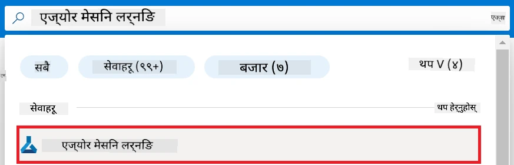

1. नेभिगेसन मेनुबाट **+ Create** चयन गर्नुहोस्।

1. नेभिगेसन मेनुबाट **New workspace** चयन गर्नुहोस्।

    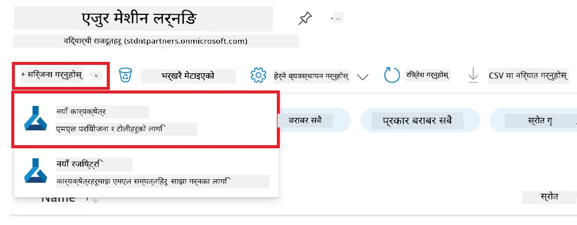

1. तलका कार्यहरू गर्नुहोस्:

    - आफ्नो Azure **Subscription** चयन गर्नुहोस्।
    - प्रयोग गर्नुपर्ने **Resource group** चयन गर्नुहोस् (आवश्यक परे नयाँ सिर्जना गर्न सक्नुहुन्छ)।
    - **Workspace Name** प्रविष्टि गर्नुहोस्। यो अनौठो हुनुपर्छ।
    - प्रयोग गर्न चाहेअनुसार **Region** चयन गर्नुहोस्।
    - प्रयोग गर्नुपर्ने **Storage account** चयन गर्नुहोस् (नयाँ सिर्जना गर्न सकिन्छ)।
    - प्रयोग गर्नुपर्ने **Key vault** चयन गर्नुहोस् (नयाँ सिर्जना गर्न सकिन्छ)।
    - प्रयोग गर्नुपर्ने **Application insights** चयन गर्नुहोस् (नयाँ सिर्जना गर्न सकिन्छ)।
    - प्रयोग गर्नुपर्ने **Container registry** चयन गर्नुहोस् (नयाँ सिर्जना गर्न सकिन्छ)।

    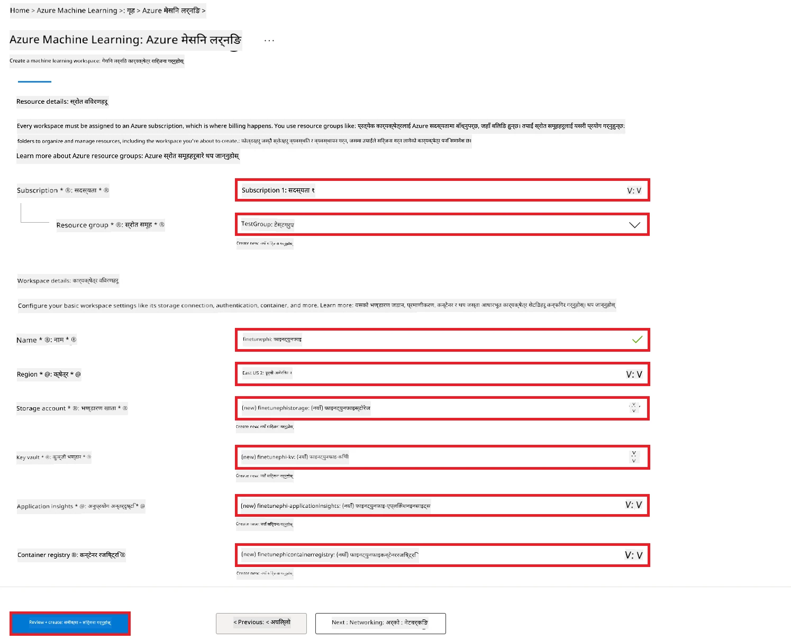

1. **Review + Create** चयन गर्नुहोस्।

1. **Create** चयन गर्नुहोस्।

### Azure Subscription मा GPU कोटा अनुरोध गर्नुहोस्

यस E2E नमुनामा, तपाईं *Standard_NC24ads_A100_v4 GPU* fine-tuning का लागि प्रयोग गर्नुहुनेछ, जसको लागि कोटा अनुरोध आवश्यक हुन्छ, र *Standard_E4s_v3* CPU deployment का लागि प्रयोग गर्नुहुनेछ, जुन कोटा अनुरोध आवश्यक पर्दैन।

> [!NOTE]
>
> केवल Pay-As-You-Go सब्सक्रिप्शनहरू (सामान्य सब्सक्रिप्शन प्रकार) GPU आबंटनको लागि पात्र छन्; लाभ subsciptions हाल समर्थित छैनन्।
>
> लाभ सब्सक्रिप्शनहरू (जस्तै Visual Studio Enterprise Subscription) प्रयोग गर्नेहरू वा छिटो fine-tuning र deployment प्रक्रिया परीक्षण गर्न चाहनेहरूका लागि, यो ट्युटोरियलले CPU प्रयोग गरेर न्यूनतम dataset सँग fine-tuning गर्ने मार्गदर्शन पनि प्रदान गर्छ। तर GPU र ठूलो dataset प्रयोग गर्दा fine-tuning नतिजा धेरै राम्रो हुन्छ।

1. [Azure ML Studio](https://ml.azure.com/home?wt.mc_id=studentamb_279723) भ्रमण गर्नुहोस्।

1. *Standard NCADSA100v4 Family* कोटा अनुरोध गर्न तलका कार्यहरू गर्नुहोस्:

    - बाँया पट्टि रहेको tab बाट **Quota** चयन गर्नुहोस्।
    - प्रयोग गर्नुपर्ने **Virtual machine family** चयन गर्नुहोस्। उदाहरणका लागि, *Standard NCADSA100v4 Family Cluster Dedicated vCPUs* चयन गर्नुहोस्, जसमा *Standard_NC24ads_A100_v4* GPU समावेश छ।
    - नेभिगेसन मेनुबाट **Request quota** छनौट गर्नुहोस्।

        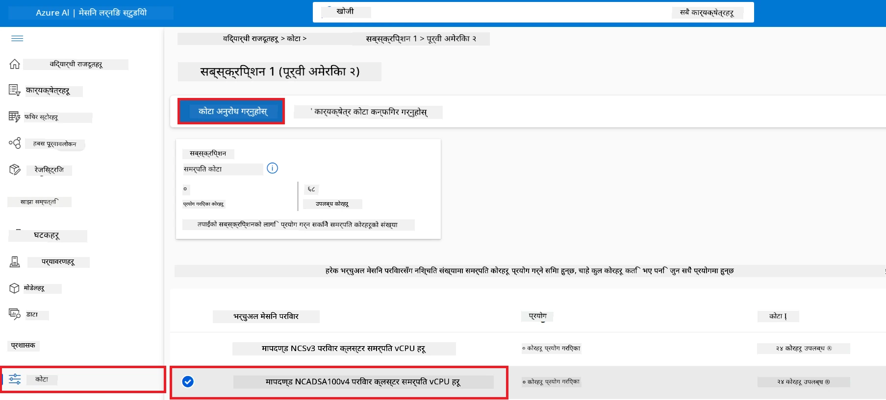

    - Request quota पृष्ठमा, प्रयोग गर्न चाहेको **New cores limit** प्रविष्टि गर्नुहोस्। उदाहरणका लागि, २४।
    - Request quota पृष्ठमा, GPU कोटा अनुरोध गर्न **Submit** चयन गर्नुहोस्।

> [!NOTE]
> तपाईं आफ्नो आवश्यकताअनुसार GPU वा CPU छनौट गर्न [Sizes for Virtual Machines in Azure](https://learn.microsoft.com/azure/virtual-machines/sizes/overview?tabs=breakdownseries%2Cgeneralsizelist%2Ccomputesizelist%2Cmemorysizelist%2Cstoragesizelist%2Cgpusizelist%2Cfpgasizelist%2Chpcsizelist) दस्तावेज हेर्न सक्नुहुन्छ।

### भूमिका (role) असाइनमेन्ट थप्नुहोस्

तपाईंका मोडेलहरू fine-tune र डिप्लोय गर्न, पहिला User Assigned Managed Identity (UAI) सिर्जना गर्नुहोस् र यसलाई उपयुक्त अनुमति दिनुहोस्। यो UAI डिप्लोयमेन्टको क्रममा प्रमाणीकरणका लागि प्रयोग गरिनेछ।

#### User Assigned Managed Identity (UAI) सिर्जना गर्नुहोस्

1. पोर्टल पृष्ठको माथि रहेको **खोज बार** मा *managed identities* टाइप गर्नुहोस् र देखा पर्ने विकल्पहरूबाट **Managed Identities** चयन गर्नुहोस्।

    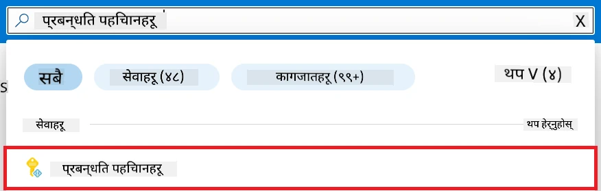

1. **+ Create** चयन गर्नुहोस्।

    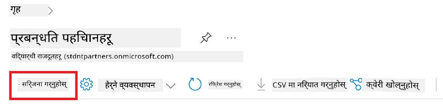

1. तलका कार्यहरू गर्नुहोस्:

    - आफ्नो Azure **Subscription** चयन गर्नुहोस्।
    - प्रयोग गर्नुपर्ने **Resource group** चयन गर्नुहोस् (नयाँ पनि बनाउन सक्नुहुन्छ)।
    - प्रयोग गर्नुपर्ने **Region** चयन गर्नुहोस्।
    - अनौठो हुनुपर्ने **Name** प्रविष्टि गर्नुहोस्।

1. **Review + create** चयन गर्नुहोस्।

1. **+ Create** चयन गर्नुहोस्।

#### Managed Identity लाई Contributor भूमिका असाइन गर्नुहोस्

1. तपाईंले सिर्जना गरेको Managed Identity स्रोतमा जानुहोस्।

1. बाँया पट्टि रहेको tab बाट **Azure role assignments** चयन गर्नुहोस्।

1. नेभिगेसन मेनुबाट **+Add role assignment** चयन गर्नुहोस्।

1. Add role assignment पृष्ठमा, तलका कार्यहरू गर्नुहोस्:
    - **Scope** लाई **Resource group** मा सेट गर्नुहोस्।
    - आफ्नो Azure **Subscription** चयन गर्नुहोस्।
    - प्रयोग गर्नुपर्ने **Resource group** चयन गर्नुहोस्।
    - **Role** लाई **Contributor** मा सेट गर्नुहोस्।

    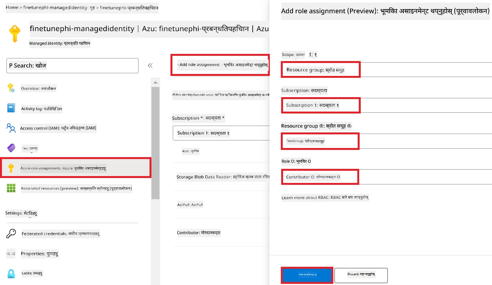

1. **Save** चयन गर्नुहोस्।

#### Managed Identity लाई Storage Blob Data Reader भूमिका असाइन गर्नुहोस्

1. पोर्टल पृष्ठको माथि रहेको **खोज बार** मा *storage accounts* टाइप गर्नुहोस् र देखा पर्ने विकल्पहरूबाट **Storage accounts** चयन गर्नुहोस्।

    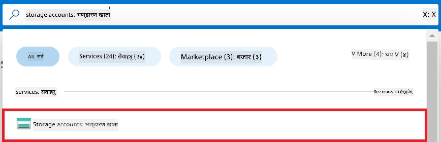

1. Azure Machine Learning workspace सँग सम्बन्धित storage account चयन गर्नुहोस्। उदाहरणका लागि, *finetunephistorage*।

1. Add role assignment पृष्ठमा जान तलका कार्यहरू गर्नुहोस्:

    - तपाईंले सिर्जना गरेको Azure Storage खातामा जानुहोस्।
    - बाँया पट्टि रहेको tab बाट **Access Control (IAM)** चयन गर्नुहोस्।
    - नेभिगेसन मेनुबाट **+ Add** चयन गर्नुहोस्।
    - नेभिगेसन मेनुबाट **Add role assignment** चयन गर्नुहोस्।

    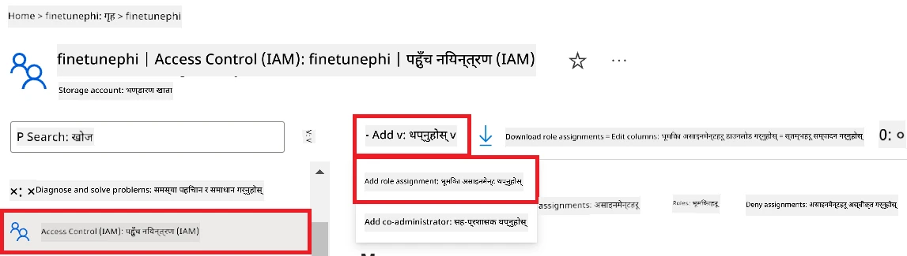

1. Add role assignment पृष्ठमा, तलका कार्यहरू गर्नुहोस्:

    - Role पृष्ठमा, **search bar** मा *Storage Blob Data Reader* टाइप गरी देखा पर्ने विकल्पबाट **Storage Blob Data Reader** चयन गर्नुहोस्।
    - Role पृष्ठमा, **Next** चयन गर्नुहोस्।
    - Members पृष्ठमा, **Assign access to** मा **Managed identity** चयन गर्नुहोस्।
    - Members पृष्ठमा, **+ Select members** चयन गर्नुहोस्।
    - Select managed identities पृष्ठमा, Azure **Subscription** चयन गर्नुहोस्।
    - Select managed identities पृष्ठमा, **Managed identity** लाई **Manage Identity** चयन गर्नुहोस्।
    - Select managed identities पृष्ठमा, तपाईंले सिर्जना गरेको Managed Identity चयन गर्नुहोस्। उदाहरणका लागि, *finetunephi-managedidentity*।
    - Select managed identities पृष्ठमा, **Select** चयन गर्नुहोस्।

    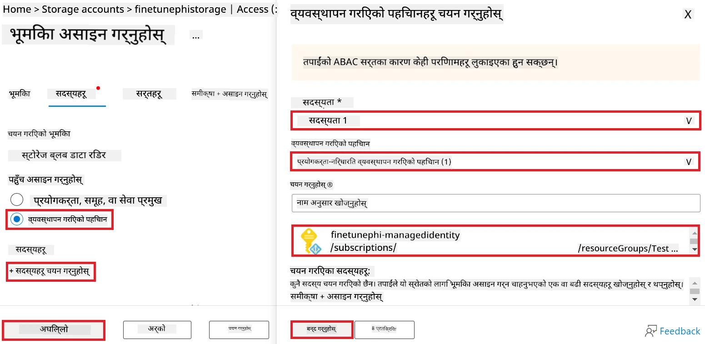

1. **Review + assign** चयन गर्नुहोस्।

#### Managed Identity लाई AcrPull भूमिका असाइन गर्नुहोस्

1. पोर्टल पृष्ठको माथि रहेको **खोज बार** मा *container registries* टाइप गर्नुहोस् र देखा पर्ने विकल्पहरूबाट **Container registries** चयन गर्नुहोस्।

    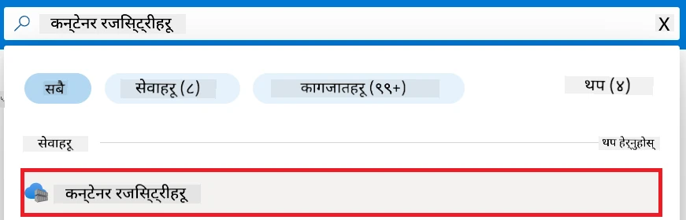

1. Azure Machine Learning workspace सँग सम्बन्धित container registry चयन गर्नुहोस्। उदाहरणका लागि, *finetunephicontainerregistries*

1. Add role assignment पृष्ठमा जान तलका कार्यहरू गर्नुहोस्:

    - बाँया पट्टि रहेको tab बाट **Access Control (IAM)** चयन गर्नुहोस्।
    - नेभिगेसन मेनुबाट **+ Add** चयन गर्नुहोस्।
    - नेभिगेसन मेनुबाट **Add role assignment** चयन गर्नुहोस्।

1. Add role assignment पृष्ठमा, तलका कार्यहरू गर्नुहोस्:

    - Role पृष्ठमा, **search bar** मा *AcrPull* टाइप गरी देखा पर्ने विकल्पबाट **AcrPull** चयन गर्नुहोस्।
    - Role पृष्ठमा, **Next** चयन गर्नुहोस्।
    - Members पृष्ठमा, **Assign access to** मा **Managed identity** चयन गर्नुहोस्।
    - Members पृष्ठमा, **+ Select members** चयन गर्नुहोस्।
    - Select managed identities पृष्ठमा, Azure **Subscription** चयन गर्नुहोस्।
    - Select managed identities पृष्ठमा, **Managed identity** लाई **Manage Identity** चयन गर्नुहोस्।
    - Select managed identities पृष्ठमा, तपाईंले सिर्जना गरेको Managed Identity चयन गर्नुहोस्। उदाहरणका लागि, *finetunephi-managedidentity*।
    - Select managed identities पृष्ठमा, **Select** चयन गर्नुहोस्।
    - **Review + assign** चयन गर्नुहोस्।

### प्रोजेक्ट सेट अप गर्नुहोस्

अब, तपाईंले एउटा फोल्डर सिर्जना गर्नुहुनेछ जहाँ काम गर्न सकिनेछ र भर्चुअल वातावरण सेटअप गर्नुहुनेछ ताकि प्रयोगकर्तासँग अन्तरक्रिया गर्ने र Azure Cosmos DB बाट सञ्चित च्याट इतिहास प्रयोग गरी प्रतिक्रिया दिन सकिने प्रोग्राम विकास गर्न सकियोस।

#### काम गर्ने फोल्डर सिर्जना गर्नुहोस्

1. टर्मिनल विण्डो खोल्नुहोस् र डिफल्ट पथमा *finetune-phi* नामको फोल्डर सिर्जना गर्न तलको आदेश टाइप गर्नुहोस्।

    ```console
    mkdir finetune-phi
    ```

1. तपाईंले सिर्जना गरेको *finetune-phi* फोल्डरमा जान तलको आदेश टाइप गर्नुहोस्।

    ```console
    cd finetune-phi
    ```

#### भर्चुअल वातावरण सिर्जना गर्नुहोस्

1. *.venv* नामको भर्चुअल वातावरण सिर्जना गर्न तलको आदेश टाइप गर्नुहोस्।

    ```console
    python -m venv .venv
    ```

1. भर्चुअल वातावरण सक्रिय गर्न तलको आदेश टाइप गर्नुहोस्।

    ```console
    .venv\Scripts\activate.bat
    ```

> [!NOTE]
>
> सफल भएमा, आदेश संकेत अघि *(.venv)* देखिनु पर्छ।

#### आवश्यक प्याकेजहरू स्थापना गर्नुहोस्

1. आवश्यकता अनुसार प्याकेजहरू स्थापना गर्न तलका आदेशहरू टाइप गर्नुहोस्।

    ```console
    pip install datasets==2.19.1
    pip install transformers==4.41.1
    pip install azure-ai-ml==1.16.0
    pip install torch==2.3.1
    pip install trl==0.9.4
    pip install promptflow==1.12.0
    ```

#### प्रोजेक्ट फाइलहरू सिर्जना गर्नुहोस्
यस अभ्यासमा, तपाईंले हाम्रो परियोजनाका लागि आवश्यक फाइलहरू सिर्जना गर्नुहुनेछ। यी फाइलहरूमा डेटासेट डाउनलोड गर्ने स्क्रिप्टहरू, Azure Machine Learning वातावरण सेटअप गर्ने, Phi-3 मोडेललाई फाइन-ट्यून गर्ने, र फाइन-ट्यून गरिएको मोडेललाई परिनियोजन गर्ने समावेश छन्। तपाईंले फाइन-ट्यूनिङ वातावरण सेटअप गर्नका लागि *conda.yml* फाइल पनि सिर्जना गर्नुहुनेछ।

यस अभ्यासमा, तपाईंले:

- डेटासेट डाउनलोड गर्न *download_dataset.py* फाइल सिर्जना गर्नुहोस्।
- Azure Machine Learning वातावरण सेटअप गर्न *setup_ml.py* फाइल सिर्जना गर्नुहोस्।
- डेटासेट प्रयोग गरी Phi-3 मोडेललाई फाइन-ट्यून गर्न *finetuning_dir* फोल्डरमा *fine_tune.py* फाइल सिर्जना गर्नुहोस्।
- फाइन-ट्यूनिङ वातावरण सेटअप गर्न *conda.yml* फाइल सिर्जना गर्नुहोस्।
- फाइन-ट्यून गरिएको मोडेल परिनियोजन गर्न *deploy_model.py* फाइल सिर्जना गर्नुहोस्।
- फाइन-ट्यून गरिएको मोडेललाई Prompt flow सँग इन्फिगर गर्ने र मोडेल चलाउन *integrate_with_promptflow.py* फाइल सिर्जना गर्नुहोस्।
- Prompt flow को लागि workflow संरचना सेटअप गर्न flow.dag.yml फाइल सिर्जना गर्नुहोस्।
- Azure जानकारी प्रविष्ट गर्न *config.py* फाइल सिर्जना गर्नुहोस्।

> [!NOTE]
>
> पूर्ण फोल्डर संरचना:
>
> ```text
> └── YourUserName
> .    └── finetune-phi
> .        ├── finetuning_dir
> .        │      └── fine_tune.py
> .        ├── conda.yml
> .        ├── config.py
> .        ├── deploy_model.py
> .        ├── download_dataset.py
> .        ├── flow.dag.yml
> .        ├── integrate_with_promptflow.py
> .        └── setup_ml.py
> ```

1. **Visual Studio Code** खोल्नुहोस्।

1. मेनु बारबाट **File** चयन गर्नुहोस्।

1. **Open Folder** चयन गर्नुहोस्।

1. तपाईंले सिर्जना गर्नुभएको *finetune-phi* फोल्डर चयन गर्नुहोस्, जुन *C:\Users\yourUserName\finetune-phi* मा अवस्थित छ।

    

1. Visual Studio Code को बायाँ प्यानलमा, राइट-क्लिक गर्नुहोस् र **New File** चयन गरी *download_dataset.py* नामक नयाँ फाइल सिर्जना गर्नुहोस्।

1. Visual Studio Code को बायाँ प्यानलमा, राइट-क्लिक गर्नुहोस् र **New File** चयन गरी *setup_ml.py* नामक नयाँ फाइल सिर्जना गर्नुहोस्।

1. Visual Studio Code को बायाँ प्यानलमा, राइट-क्लिक गर्नुहोस् र **New File** चयन गरी *deploy_model.py* नामक नयाँ फाइल सिर्जना गर्नुहोस्।

    

1. Visual Studio Code को बायाँ प्यानलमा, राइट-क्लिक गर्नुहोस् र **New Folder** चयन गरी *finetuning_dir* नामक नयाँ फोल्डर सिर्जना गर्नुहोस्।

1. *finetuning_dir* फोल्डरमा, *fine_tune.py* नामक नयाँ फाइल सिर्जना गर्नुहोस्।

#### *conda.yml* फाइल सिर्जना र कन्फिगर गर्नुहोस्

1. Visual Studio Code को बायाँ प्यानलमा, राइट-क्लिक गर्नुहोस् र **New File** चयन गरी *conda.yml* नामक नयाँ फाइल सिर्जना गर्नुहोस्।

1. *conda.yml* फाइलमा निम्न कोड थप्नुहोस् ताकि Phi-3 मोडेलको फाइन-ट्यूनिङ वातावरण सेटअप होस्।

    ```yml
    name: phi-3-training-env
    channels:
      - defaults
      - conda-forge
    dependencies:
      - python=3.10
      - pip
      - numpy<2.0
      - pip:
          - torch==2.4.0
          - torchvision==0.19.0
          - trl==0.8.6
          - transformers==4.41
          - datasets==2.21.0
          - azureml-core==1.57.0
          - azure-storage-blob==12.19.0
          - azure-ai-ml==1.16
          - azure-identity==1.17.1
          - accelerate==0.33.0
          - mlflow==2.15.1
          - azureml-mlflow==1.57.0
    ```

#### *config.py* फाइल सिर्जना र कन्फिगर गर्नुहोस्

1. Visual Studio Code को बायाँ प्यानलमा, राइट-क्लिक गर्नुहोस् र **New File** चयन गरी *config.py* नामक नयाँ फाइल सिर्जना गर्नुहोस्।

1. आफ्नो Azure जानकारी समावेश गर्न *config.py* फाइलमा निम्न कोड थप्नुहोस्।

    ```python
    # Azure सेटिङहरू
    AZURE_SUBSCRIPTION_ID = "your_subscription_id"
    AZURE_RESOURCE_GROUP_NAME = "your_resource_group_name" # "TestGroup"

    # Azure मेशिन लर्निङ सेटिङहरू
    AZURE_ML_WORKSPACE_NAME = "your_workspace_name" # "finetunephi-workspace"

    # Azure व्यवस्थापन गरिएको पहिचान सेटिङहरू
    AZURE_MANAGED_IDENTITY_CLIENT_ID = "your_azure_managed_identity_client_id"
    AZURE_MANAGED_IDENTITY_NAME = "your_azure_managed_identity_name" # "finetunephi-mangedidentity"
    AZURE_MANAGED_IDENTITY_RESOURCE_ID = f"/subscriptions/{AZURE_SUBSCRIPTION_ID}/resourceGroups/{AZURE_RESOURCE_GROUP_NAME}/providers/Microsoft.ManagedIdentity/userAssignedIdentities/{AZURE_MANAGED_IDENTITY_NAME}"

    # डेटा सेट फाइल पथहरू
    TRAIN_DATA_PATH = "data/train_data.jsonl"
    TEST_DATA_PATH = "data/test_data.jsonl"

    # फाइन-ट्यून गरिएको मोडेल सेटिङहरू
    AZURE_MODEL_NAME = "your_fine_tuned_model_name" # "finetune-phi-model"
    AZURE_ENDPOINT_NAME = "your_fine_tuned_model_endpoint_name" # "finetune-phi-endpoint"
    AZURE_DEPLOYMENT_NAME = "your_fine_tuned_model_deployment_name" # "finetune-phi-deployment"

    AZURE_ML_API_KEY = "your_fine_tuned_model_api_key"
    AZURE_ML_ENDPOINT = "your_fine_tuned_model_endpoint_uri" # "https://{your-endpoint-name}.{your-region}.inference.ml.azure.com/score"
    ```

#### Azure वातावरण चरहरू थप्नुहोस्

1. Azure Subscription ID थप्न तलका कार्यहरू गर्नुहोस्:

    - पोर्टल पेजको माथि रहेको **search bar** मा *subscriptions* टाइप गर्नुहोस् र देखा पर्ने विकल्पहरूबाट **Subscriptions** चयन गर्नुहोस्।
    - तपाईं हाल प्रयोग गर्दै भएको Azure Subscription चयन गर्नुहोस्।
    - आफ्नो Subscription ID *config.py* फाइलमा कपी र पेस्ट गर्नुहोस्।

    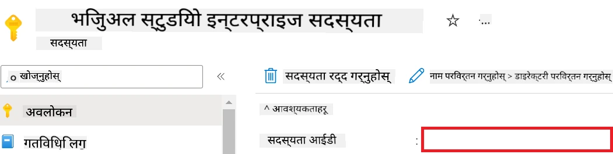

1. Azure Workspace Name थप्न तलका कार्यहरू गर्नुहोस्:

    - तपाईंले सिर्जना गर्नुभएको Azure Machine Learning स्रोतमा जानुहोस्।
    - आफ्नो खाताको नाम *config.py* फाइलमा कपी र पेस्ट गर्नुहोस्।

    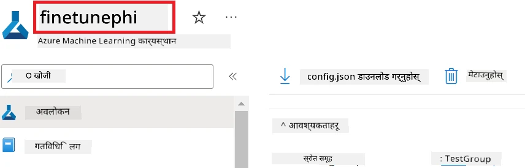

1. Azure Resource Group Name थप्न तलका कार्यहरू गर्नुहोस्:

    - तपाईंले सिर्जना गर्नुभएको Azure Machine Learning स्रोतमा जानुहोस्।
    - आफ्नो Azure Resource Group Name *config.py* फाइलमा कपी र पेस्ट गर्नुहोस्।

    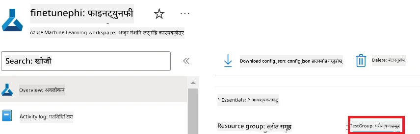

2. Azure Managed Identity नाम थप्न तलका कार्यहरू गर्नुहोस्:

    - तपाईंले सिर्जना गर्नुभएको Managed Identities स्रोतमा जानुहोस्।
    - आफ्नो Azure Managed Identity नाम *config.py* फाइलमा कपी र पेस्ट गर्नुहोस्।

    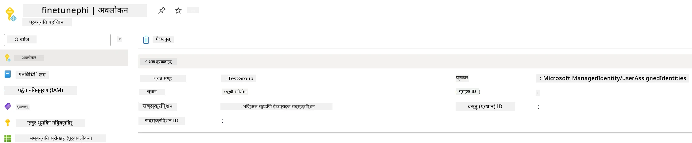

### फाइन-ट्यूनिङको लागि डेटासेट तयार गर्नुहोस्

यस अभ्यासमा, तपाईंले आफ्नो स्थानीय वातावरणमा *ULTRACHAT_200k* डेटासेटहरू डाउनलोड गर्न *download_dataset.py* फाइल चलाउनुहुनेछ। त्यसपछि, यस डेटासेटलाई Azure Machine Learning मा Phi-3 मोडेल फाइन-ट्यून गर्न प्रयोग गर्नुहुनेछ।

#### *download_dataset.py* प्रयोग गरी आफ्नो डेटासेट डाउनलोड गर्नुहोस्

1. Visual Studio Code मा *download_dataset.py* फाइल खोल्नुहोस्।

1. *download_dataset.py* मा तलको कोड थप्नुहोस्।

    ```python
    import json
    import os
    from datasets import load_dataset
    from config import (
        TRAIN_DATA_PATH,
        TEST_DATA_PATH)

    def load_and_split_dataset(dataset_name, config_name, split_ratio):
        """
        Load and split a dataset.
        """
        # निर्दिष्ट नाम, कन्फिगरेसन र स्प्लिट अनुपात संग डेटासेट लोड गर्नुहोस्
        dataset = load_dataset(dataset_name, config_name, split=split_ratio)
        print(f"Original dataset size: {len(dataset)}")
        
        # डेटासेटलाई ट्रेन र टेस्ट सेटमा विभाजन गर्नुहोस् (८०% ट्रेन, २०% टेस्ट)
        split_dataset = dataset.train_test_split(test_size=0.2)
        print(f"Train dataset size: {len(split_dataset['train'])}")
        print(f"Test dataset size: {len(split_dataset['test'])}")
        
        return split_dataset

    def save_dataset_to_jsonl(dataset, filepath):
        """
        Save a dataset to a JSONL file.
        """
        # डाइरेक्टरी छैन भने बनाउनुहोस्
        os.makedirs(os.path.dirname(filepath), exist_ok=True)
        
        # फाइललाई लेख्ने मोडमा खोल्नुहोस्
        with open(filepath, 'w', encoding='utf-8') as f:
            # डेटासेटका प्रत्येक रेकर्डमा इटरेट गर्नुहोस्
            for record in dataset:
                # रेकर्डलाई JSON वस्तुका रूपमा डम्प गरी फाइलमा लेख्नुहोस्
                json.dump(record, f)
                # रेकर्डहरू छुट्याउन नयाँ लाइन क्यारेक्टर लेख्नुहोस्
                f.write('\n')
        
        print(f"Dataset saved to {filepath}")

    def main():
        """
        Main function to load, split, and save the dataset.
        """
        # ULTRACHAT_200k डेटासेटलाई विशेष कन्फिगरेसन र स्प्लिट अनुपातसँग लोड र विभाजन गर्नुहोस्
        dataset = load_and_split_dataset("HuggingFaceH4/ultrachat_200k", 'default', 'train_sft[:1%]')
        
        # स्प्लिटबाट ट्रेन र टेस्ट डेटासेट निकाल्नुहोस्
        train_dataset = dataset['train']
        test_dataset = dataset['test']

        # ट्रेन डेटासेटलाई JSONL फाइलमा सेभ गर्नुहोस्
        save_dataset_to_jsonl(train_dataset, TRAIN_DATA_PATH)
        
        # टेस्ट डेटासेटलाई पृथक JSONL फाइलमा सेभ गर्नुहोस्
        save_dataset_to_jsonl(test_dataset, TEST_DATA_PATH)

    if __name__ == "__main__":
        main()

    ```

> [!TIP]
>
> **CPU प्रयोग गरेर न्यूनतम डेटासेटसँग फाइन-ट्यूनिङको लागि मार्गनिर्देशन**
>
> यदि तपाईं फाइन-ट्यूनिङका लागि CPU प्रयोग गर्न चाहनुहुन्छ भने, यो विधि लाभदायक सदस्यता (जस्तै Visual Studio Enterprise Subscription) भएका वा छिटो फाइन-ट्यूनिङ र परिनियोजन प्रक्रिया परीक्षण गर्न चाहनेहरूका लागि उपयुक्त छ।
>
> `dataset = load_and_split_dataset("HuggingFaceH4/ultrachat_200k", 'default', 'train_sft[:1%]')` लाई `dataset = load_and_split_dataset("HuggingFaceH4/ultrachat_200k", 'default', 'train_sft[:10]')` ले प्रतिस्थापन गर्नुहोस्।
>

1. आफ्नो टर्मिनलमा तलको आदेश टाइप गरी स्क्रिप्ट चलाउनुहोस् र डेटासेट आफ्नो स्थानीय वातावरणमा डाउनलोड गर्नुहोस्।

    ```console
    python download_data.py
    ```

1. सुनिश्चित गर्नुहोस् कि डेटासेटहरू सफलतापूर्वक आफ्नो स्थानीय *finetune-phi/data* निर्देशिकामा बचत भएका छन्।

> [!NOTE]
>
> **डेटासेट साइज र फाइन-ट्यूनिङ समय**
>
> यस E2E नमुना मा, तपाईंले डेटासेटको केवल १% (`train_sft[:1%]`) प्रयोग गर्नुहुन्छ। यसले डेटाको मात्रा धेरै कम गर्छ, जसले अपलोड र फाइन-ट्यूनिङ दुवै प्रक्रियालाई छिटो बनाउँछ। तपाईंले निकाल्ने प्रतिशतलाई समायोजन गरेर प्रशिक्षण समय र मोडेल प्रदर्शनबीच सन्तुलन खोज्न सक्नुहुन्छ। डेटासेटको सानो उपसमूह प्रयोग गर्दा फाइन-ट्यूनिङमा लाग्ने समय कम हुन्छ, जसले E2E नमुनालाई अझ व्यवस्थापनयोग्य बनाउँछ।

## परिदृश्य २: Phi-3 मोडेललाई फाइन-ट्यून गरी Azure Machine Learning Studio मा परिनियोजन गर्नुहोस्

### Azure CLI सेटअप गर्नुहोस्

तपाईंको वातावरण प्रमाणित गर्न Azure CLI सेटअप गर्नु आवश्यक छ। Azure CLI ले तपाईंलाई कमाण्ड लाइनबाट सिधा Azure स्रोतहरू व्यवस्थापन गर्न अनुमति दिन्छ र Azure Machine Learning लाई यी स्रोतहरू पहुँच गर्न आवश्यक क्रेडेन्शियल प्रदान गर्दछ। सुरु गर्न [Azure CLI](https://learn.microsoft.com/cli/azure/install-azure-cli) इन्स्टल गर्नुहोस्।

1. टर्मिनल विन्डो खोल्नुहोस् र Azure खातामा लगइन गर्न तलको आदेश टाइप गर्नुहोस्।

    ```console
    az login
    ```

1. प्रयोग गर्न चाहनुभएको Azure खाता चयन गर्नुहोस्।

1. प्रयोग गर्न चाहनुभएको Azure सदस्यता चयन गर्नुहोस्।

    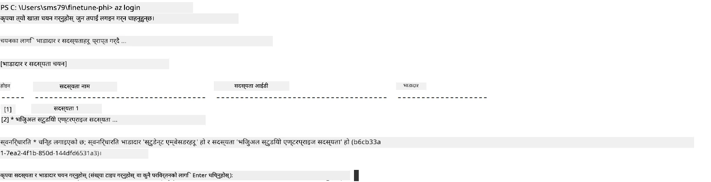

> [!TIP]
>
> यदि Azure मा साइन इन गर्न समस्या आएमा, डिभाइस कोड प्रयोग गरेर प्रयास गर्नुहोस्। टर्मिनल विन्डो खोल्नुहोस् र Azure खातामा साइन इन गर्न तलको आदेश टाइप गर्नुहोस्:
>
> ```console
> az login --use-device-code
> ```
>

### Phi-3 मोडेल फाइन-ट्यून गर्नुहोस्

यस अभ्यासमा, तपाईंले उपलब्ध गराइएको डेटासेट प्रयोग गरी Phi-3 मोडेल फाइन-ट्यून गर्नुहुनेछ। पहिले, *fine_tune.py* फाइलमा फाइन-ट्यूनिङ प्रक्रिया परिभाषित गर्नुहोस्। त्यसपछि, Azure Machine Learning वातावरण कन्फिगर गरी *setup_ml.py* फाइल चलाएर फाइन-ट्यूनिङ प्रक्रिया सुरु गर्नुहोस्। यस स्क्रिप्टले Azure Machine Learning वातावरण भित्र फाइन-ट्यूनिङ सुनिश्चित गर्दछ।

*setup_ml.py* चलाउँदा, फाइन-ट्यूनिङ प्रक्रिया Azure Machine Learning वातावरणमा चल्नेछ।

#### *fine_tune.py* फाइलमा कोड थप्नुहोस्

1. *finetuning_dir* फोल्डरमा जानुहोस् र Visual Studio Code मा *fine_tune.py* फाइल खोल्नुहोस्।

1. *fine_tune.py* मा तलको कोड थप्नुहोस्।

    ```python
    import argparse
    import sys
    import logging
    import os
    from datasets import load_dataset
    import torch
    import mlflow
    from transformers import AutoModelForCausalLM, AutoTokenizer, TrainingArguments
    from trl import SFTTrainer

    # MLflow मा INVALID_PARAMETER_VALUE त्रुटि टाढा राख्न, MLflow एकीकरण अक्षम गर्नुहोस्
    os.environ["DISABLE_MLFLOW_INTEGRATION"] = "True"

    # लग इन सेटअप
    logging.basicConfig(
        format="%(asctime)s - %(levelname)s - %(name)s - %(message)s",
        datefmt="%Y-%m-%d %H:%M:%S",
        handlers=[logging.StreamHandler(sys.stdout)],
        level=logging.WARNING
    )
    logger = logging.getLogger(__name__)

    def initialize_model_and_tokenizer(model_name, model_kwargs):
        """
        Initialize the model and tokenizer with the given pretrained model name and arguments.
        """
        model = AutoModelForCausalLM.from_pretrained(model_name, **model_kwargs)
        tokenizer = AutoTokenizer.from_pretrained(model_name)
        tokenizer.model_max_length = 2048
        tokenizer.pad_token = tokenizer.unk_token
        tokenizer.pad_token_id = tokenizer.convert_tokens_to_ids(tokenizer.pad_token)
        tokenizer.padding_side = 'right'
        return model, tokenizer

    def apply_chat_template(example, tokenizer):
        """
        Apply a chat template to tokenize messages in the example.
        """
        messages = example["messages"]
        if messages[0]["role"] != "system":
            messages.insert(0, {"role": "system", "content": ""})
        example["text"] = tokenizer.apply_chat_template(
            messages, tokenize=False, add_generation_prompt=False
        )
        return example

    def load_and_preprocess_data(train_filepath, test_filepath, tokenizer):
        """
        Load and preprocess the dataset.
        """
        train_dataset = load_dataset('json', data_files=train_filepath, split='train')
        test_dataset = load_dataset('json', data_files=test_filepath, split='train')
        column_names = list(train_dataset.features)

        train_dataset = train_dataset.map(
            apply_chat_template,
            fn_kwargs={"tokenizer": tokenizer},
            num_proc=10,
            remove_columns=column_names,
            desc="Applying chat template to train dataset",
        )

        test_dataset = test_dataset.map(
            apply_chat_template,
            fn_kwargs={"tokenizer": tokenizer},
            num_proc=10,
            remove_columns=column_names,
            desc="Applying chat template to test dataset",
        )

        return train_dataset, test_dataset

    def train_and_evaluate_model(train_dataset, test_dataset, model, tokenizer, output_dir):
        """
        Train and evaluate the model.
        """
        training_args = TrainingArguments(
            bf16=True,
            do_eval=True,
            output_dir=output_dir,
            eval_strategy="epoch",
            learning_rate=5.0e-06,
            logging_steps=20,
            lr_scheduler_type="cosine",
            num_train_epochs=3,
            overwrite_output_dir=True,
            per_device_eval_batch_size=4,
            per_device_train_batch_size=4,
            remove_unused_columns=True,
            save_steps=500,
            seed=0,
            gradient_checkpointing=True,
            gradient_accumulation_steps=1,
            warmup_ratio=0.2,
        )

        trainer = SFTTrainer(
            model=model,
            args=training_args,
            train_dataset=train_dataset,
            eval_dataset=test_dataset,
            max_seq_length=2048,
            dataset_text_field="text",
            tokenizer=tokenizer,
            packing=True
        )

        train_result = trainer.train()
        trainer.log_metrics("train", train_result.metrics)

        mlflow.transformers.log_model(
            transformers_model={"model": trainer.model, "tokenizer": tokenizer},
            artifact_path=output_dir,
        )

        tokenizer.padding_side = 'left'
        eval_metrics = trainer.evaluate()
        eval_metrics["eval_samples"] = len(test_dataset)
        trainer.log_metrics("eval", eval_metrics)

    def main(train_file, eval_file, model_output_dir):
        """
        Main function to fine-tune the model.
        """
        model_kwargs = {
            "use_cache": False,
            "trust_remote_code": True,
            "torch_dtype": torch.bfloat16,
            "device_map": None,
            "attn_implementation": "eager"
        }

        # pretrained_model_name = "microsoft/Phi-3-mini-4k-instruct"
        pretrained_model_name = "microsoft/Phi-3.5-mini-instruct"

        with mlflow.start_run():
            model, tokenizer = initialize_model_and_tokenizer(pretrained_model_name, model_kwargs)
            train_dataset, test_dataset = load_and_preprocess_data(train_file, eval_file, tokenizer)
            train_and_evaluate_model(train_dataset, test_dataset, model, tokenizer, model_output_dir)

    if __name__ == "__main__":
        parser = argparse.ArgumentParser()
        parser.add_argument("--train-file", type=str, required=True, help="Path to the training data")
        parser.add_argument("--eval-file", type=str, required=True, help="Path to the evaluation data")
        parser.add_argument("--model_output_dir", type=str, required=True, help="Directory to save the fine-tuned model")
        args = parser.parse_args()
        main(args.train_file, args.eval_file, args.model_output_dir)

    ```

1. *fine_tune.py* फाइल बचत गरी बन्द गर्नुहोस्।

> [!TIP]
> **तपाईं Phi-3.5 मोडेल पनि फाइन-ट्यून गर्न सक्नुहुन्छ**
>
> *fine_tune.py* फाइलमा, `pretrained_model_name` लाई `"microsoft/Phi-3-mini-4k-instruct"` बाट तपाईंले फाइन-ट्यून गर्न चाहनुभएको कुनै पनि मोडेलको नाममा परिवर्तन गर्न सक्नुहुन्छ। उदाहरणका लागि, `"microsoft/Phi-3.5-mini-instruct"` मा परिवर्तन गर्दा, तपाईं Phi-3.5-mini-instruct मोडेल फाइन-ट्यून गर्दै हुनुहुनेछ। आफूलाई चाहिएको मोडेलको नाम पत्ता लगाउन र प्रयोग गर्न [Hugging Face](https://huggingface.co/) मा जानुहोस्, आफूलाई चाहिएको मोडेल खोज्नुहोस् र त्यसको नाम स्क्रिप्टको `pretrained_model_name` फिल्डमा कपी र पेस्ट गर्नुहोस्।
>
> <image type="content" src="../../../../imgs/02/FineTuning-PromptFlow/finetunephi3.5.png" alt-text="Fine tune Phi-3.5.">
>

#### *setup_ml.py* फाइलमा कोड थप्नुहोस्

1. Visual Studio Code मा *setup_ml.py* फाइल खोल्नुहोस्।

1. *setup_ml.py* मा तलको कोड थप्नुहोस्।

    ```python
    import logging
    from azure.ai.ml import MLClient, command, Input
    from azure.ai.ml.entities import Environment, AmlCompute
    from azure.identity import AzureCliCredential
    from config import (
        AZURE_SUBSCRIPTION_ID,
        AZURE_RESOURCE_GROUP_NAME,
        AZURE_ML_WORKSPACE_NAME,
        TRAIN_DATA_PATH,
        TEST_DATA_PATH
    )

    # स्थिरांकहरू

    # तालिमको लागि CPU उदाहरण प्रयोग गर्न तलका पंक्तिहरू अनकमेंट गर्नुहोस्
    # COMPUTE_INSTANCE_TYPE = "Standard_E16s_v3" # cpu
    # COMPUTE_NAME = "cpu-e16s-v3"
    # DOCKER_IMAGE_NAME = "mcr.microsoft.com/azureml/openmpi4.1.0-ubuntu20.04:latest"

    # तालिमको लागि GPU उदाहरण प्रयोग गर्न तलका पंक्तिहरू अनकमेंट गर्नुहोस्
    COMPUTE_INSTANCE_TYPE = "Standard_NC24ads_A100_v4"
    COMPUTE_NAME = "gpu-nc24s-a100-v4"
    DOCKER_IMAGE_NAME = "mcr.microsoft.com/azureml/curated/acft-hf-nlp-gpu:59"

    CONDA_FILE = "conda.yml"
    LOCATION = "eastus2" # आफ्नो कम्प्युट क्लस्टरको स्थानसँग प्रतिस्थापन गर्नुहोस्
    FINETUNING_DIR = "./finetuning_dir" # फाइन-ट्यूनिङ स्क्रिप्टको पथ
    TRAINING_ENV_NAME = "phi-3-training-environment" # तालिम वातावरणको नाम
    MODEL_OUTPUT_DIR = "./model_output" # azure ml मा मोडेल आउटपुट डाइरेक्टरीको पथ

    # प्रक्रियालाई ट्र्याक गर्न लगिङ सेटअप
    logger = logging.getLogger(__name__)
    logging.basicConfig(
        format="%(asctime)s - %(levelname)s - %(name)s - %(message)s",
        datefmt="%Y-%m-%d %H:%M:%S",
        level=logging.WARNING
    )

    def get_ml_client():
        """
        Initialize the ML Client using Azure CLI credentials.
        """
        credential = AzureCliCredential()
        return MLClient(credential, AZURE_SUBSCRIPTION_ID, AZURE_RESOURCE_GROUP_NAME, AZURE_ML_WORKSPACE_NAME)

    def create_or_get_environment(ml_client):
        """
        Create or update the training environment in Azure ML.
        """
        env = Environment(
            image=DOCKER_IMAGE_NAME,  # वातावरणको लागि डोकर छवि
            conda_file=CONDA_FILE,  # कोंडा वातावरण फाइल
            name=TRAINING_ENV_NAME,  # वातावरणको नाम
        )
        return ml_client.environments.create_or_update(env)

    def create_or_get_compute_cluster(ml_client, compute_name, COMPUTE_INSTANCE_TYPE, location):
        """
        Create or update the compute cluster in Azure ML.
        """
        try:
            compute_cluster = ml_client.compute.get(compute_name)
            logger.info(f"Compute cluster '{compute_name}' already exists. Reusing it for the current run.")
        except Exception:
            logger.info(f"Compute cluster '{compute_name}' does not exist. Creating a new one with size {COMPUTE_INSTANCE_TYPE}.")
            compute_cluster = AmlCompute(
                name=compute_name,
                size=COMPUTE_INSTANCE_TYPE,
                location=location,
                tier="Dedicated",  # कम्प्युट क्लस्टरको तह
                min_instances=0,  # न्यूनतम उदाहरण संख्या
                max_instances=1  # अधिकतम उदाहरण संख्या
            )
            ml_client.compute.begin_create_or_update(compute_cluster).wait()  # क्लस्टर सिर्जना हुन कुर्नुहोस्
        return compute_cluster

    def create_fine_tuning_job(env, compute_name):
        """
        Set up the fine-tuning job in Azure ML.
        """
        return command(
            code=FINETUNING_DIR,  # fine_tune.py को पथ
            command=(
                "python fine_tune.py "
                "--train-file ${{inputs.train_file}} "
                "--eval-file ${{inputs.eval_file}} "
                "--model_output_dir ${{inputs.model_output}}"
            ),
            environment=env,  # तालिम वातावरण
            compute=compute_name,  # प्रयोग गर्ने कम्प्युट क्लस्टर
            inputs={
                "train_file": Input(type="uri_file", path=TRAIN_DATA_PATH),  # तालिम डेटा फाइलको पथ
                "eval_file": Input(type="uri_file", path=TEST_DATA_PATH),  # मूल्यांकन डेटा फाइलको पथ
                "model_output": MODEL_OUTPUT_DIR
            }
        )

    def main():
        """
        Main function to set up and run the fine-tuning job in Azure ML.
        """
        # ML क्लाइन्ट शुरु गर्नुहोस्
        ml_client = get_ml_client()

        # वातावरण सिर्जना गर्नुहोस्
        env = create_or_get_environment(ml_client)
        
        # विद्यमान कम्प्युट क्लस्टर सिर्जना वा प्राप्त गर्नुहोस्
        create_or_get_compute_cluster(ml_client, COMPUTE_NAME, COMPUTE_INSTANCE_TYPE, LOCATION)

        # फाइन-ट्यूनिङ काम सिर्जना र सबमिट गर्नुहोस्
        job = create_fine_tuning_job(env, COMPUTE_NAME)
        returned_job = ml_client.jobs.create_or_update(job)  # काम सबमिट गर्नुहोस्
        ml_client.jobs.stream(returned_job.name)  # कामको लगहरू स्ट्रिम गर्नुहोस्
        
        # कामको नाम कैद गर्नुहोस्
        job_name = returned_job.name
        print(f"Job name: {job_name}")

    if __name__ == "__main__":
        main()

    ```

1. `COMPUTE_INSTANCE_TYPE`, `COMPUTE_NAME`, र `LOCATION` लाई तपाईंको विवरण अनुसार प्रतिस्थापन गर्नुहोस्।

    ```python
   # प्रशिक्षणको लागि GPU उदाहरण प्रयोग गर्न तलका लाइनहरू अनकमेंट गर्नुहोस्
    COMPUTE_INSTANCE_TYPE = "Standard_NC24ads_A100_v4"
    COMPUTE_NAME = "gpu-nc24s-a100-v4"
    ...
    LOCATION = "eastus2" # आफ्नो कम्प्युट क्लस्टरको स्थानसँग प्रतिस्थापन गर्नुहोस्
    ```

> [!TIP]
>
> **CPU प्रयोग गरेर न्यूनतम डेटासेटसँग फाइन-ट्यूनिङको लागि मार्गनिर्देशन**
>
> यदि तपाईं CPU प्रयोग गरेर फाइन-ट्यून गर्न चाहनुहुन्छ भने, यो विधि लाभदायक सदस्यता (जस्तै Visual Studio Enterprise Subscription) भएका वा छिटो परीक्षणका लागि उपयुक्त छ।
>
> 1. *setup_ml* फाइल खोल्नुहोस्।
> 1. `COMPUTE_INSTANCE_TYPE`, `COMPUTE_NAME`, र `DOCKER_IMAGE_NAME` लाई निम्न अनुसार प्रतिस्थापन गर्नुहोस्। यदि तपाईंलाई *Standard_E16s_v3* उपलब्ध छैन भने, तपाईं CPU इन्स्ट्यान्सको समानान्तर प्रयोग गर्न सक्नुहुन्छ वा नयाँ क्वोटा अनुरोध गर्न सक्नुहुन्छ।
> 1. `LOCATION` लाई तपाईंको विवरणअनुसार प्रतिस्थापन गर्नुहोस्।
>
>    ```python
>    # Uncomment the following lines to use a CPU instance for training
>    COMPUTE_INSTANCE_TYPE = "Standard_E16s_v3" # cpu
>    COMPUTE_NAME = "cpu-e16s-v3"
>    DOCKER_IMAGE_NAME = "mcr.microsoft.com/azureml/openmpi4.1.0-ubuntu20.04:latest"
>    LOCATION = "eastus2" # Replace with the location of your compute cluster
>    ```
>

1. Azure Machine Learning मा फाइन-ट्यूनिङ प्रक्रिया सुरु गर्न *setup_ml.py* स्क्रिप्ट चलाउन तलको कमाण्ड टाइप गर्नुहोस्।

    ```python
    python setup_ml.py
    ```

1. यस अभ्यासमा, तपाईंले सफलतापूर्वक Azure Machine Learning प्रयोग गरी Phi-3 मोडेल फाइन-ट्यून गर्नुभयो। *setup_ml.py* स्क्रिप्ट चलाउँदा Azure Machine Learning वातावरण सेटअप भयो र *fine_tune.py* फाइलमा परिभाषित फाइन-ट्यूनिङ प्रक्रिया सुरु भयो। कृपया ध्यान दिनुहोस् कि फाइन-ट्यूनिङ प्रक्रियामा लामो समय लाग्न सक्छ। `python setup_ml.py` आदेश चलाएपछि प्रक्रिया पूरा हुन पर्खनुहोस्। तपाईं टर्मिनलमा दिइएको लिंकबाट Azure Machine Learning पोर्टलमा गएर फाइन-ट्यूनिङ जॉबको स्थिति अनुगमन गर्न सक्नुहुन्छ।

    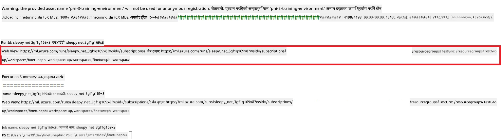

### फाइन-ट्यून गरिएको मोडेल परिनियोजन गर्नुहोस्

फाइन-ट्यून गरिएको Phi-3 मोडेललाई Prompt Flow सँग एकीकृत गर्नका लागि, तपाईंले मोडेललाई वास्तविक समयको पूर्वानुमानको लागि पहुँचयोग्य बनाउन परिनियोजन गर्नु आवश्यक छ। यो प्रक्रिया मोडेल दर्ता गर्ने, अनलाइन अन्तबिन्दु सिर्जना गर्ने र मोडेल परिनियोजन गर्ने समावेश गर्दछ।

#### परिनियोजनका लागि मोडेल नाम, अन्तबिन्दु नाम र परिनियोजन नाम सेट गर्नुहोस्

1. *config.py* फाइल खोल्नुहोस्।

1. `AZURE_MODEL_NAME = "your_fine_tuned_model_name"` लाई आफ्नो मनपर्ने मोडेल नामले प्रतिस्थापन गर्नुहोस्।

1. `AZURE_ENDPOINT_NAME = "your_fine_tuned_model_endpoint_name"` लाई आफ्नो मनपर्ने अन्तबिन्दु नामले प्रतिस्थापन गर्नुहोस्।

1. `AZURE_DEPLOYMENT_NAME = "your_fine_tuned_model_deployment_name"` लाई आफ्नो मनपर्ने परिनियोजन नामले प्रतिस्थापन गर्नुहोस्।

#### *deploy_model.py* फाइलमा कोड थप्नुहोस्

*deploy_model.py* फाइल चलाउँदा सम्पूर्ण परिनियोजन प्रक्रिया स्वतः हुन्छ। यसले मोडेल दर्ता गर्छ, अन्तबिन्दु सिर्जना गर्छ, र config.py फाइलमा निर्दिष्ट सेटिङहरू (जस्तै मोडेल नाम, अन्तबिन्दु नाम, र परिनियोजन नाम) अनुसार परिनियोजन कार्यान्वयन गर्छ।

1. Visual Studio Code मा *deploy_model.py* फाइल खोल्नुहोस्।

1. *deploy_model.py* मा निम्न कोड थप्नुहोस्।

    ```python
    import logging
    from azure.identity import AzureCliCredential
    from azure.ai.ml import MLClient
    from azure.ai.ml.entities import Model, ProbeSettings, ManagedOnlineEndpoint, ManagedOnlineDeployment, IdentityConfiguration, ManagedIdentityConfiguration, OnlineRequestSettings
    from azure.ai.ml.constants import AssetTypes

    # कन्फिगरेसन आयातहरू
    from config import (
        AZURE_SUBSCRIPTION_ID,
        AZURE_RESOURCE_GROUP_NAME,
        AZURE_ML_WORKSPACE_NAME,
        AZURE_MANAGED_IDENTITY_RESOURCE_ID,
        AZURE_MANAGED_IDENTITY_CLIENT_ID,
        AZURE_MODEL_NAME,
        AZURE_ENDPOINT_NAME,
        AZURE_DEPLOYMENT_NAME
    )

    # स्थिरांकहरू
    JOB_NAME = "your-job-name"
    COMPUTE_INSTANCE_TYPE = "Standard_E4s_v3"

    deployment_env_vars = {
        "SUBSCRIPTION_ID": AZURE_SUBSCRIPTION_ID,
        "RESOURCE_GROUP_NAME": AZURE_RESOURCE_GROUP_NAME,
        "UAI_CLIENT_ID": AZURE_MANAGED_IDENTITY_CLIENT_ID,
    }

    # लगिङ सेटअप
    logging.basicConfig(
        format="%(asctime)s - %(levelname)s - %(name)s - %(message)s",
        datefmt="%Y-%m-%d %H:%M:%S",
        level=logging.DEBUG
    )
    logger = logging.getLogger(__name__)

    def get_ml_client():
        """Initialize and return the ML Client."""
        credential = AzureCliCredential()
        return MLClient(credential, AZURE_SUBSCRIPTION_ID, AZURE_RESOURCE_GROUP_NAME, AZURE_ML_WORKSPACE_NAME)

    def register_model(ml_client, model_name, job_name):
        """Register a new model."""
        model_path = f"azureml://jobs/{job_name}/outputs/artifacts/paths/model_output"
        logger.info(f"Registering model {model_name} from job {job_name} at path {model_path}.")
        run_model = Model(
            path=model_path,
            name=model_name,
            description="Model created from run.",
            type=AssetTypes.MLFLOW_MODEL,
        )
        model = ml_client.models.create_or_update(run_model)
        logger.info(f"Registered model ID: {model.id}")
        return model

    def delete_existing_endpoint(ml_client, endpoint_name):
        """Delete existing endpoint if it exists."""
        try:
            endpoint_result = ml_client.online_endpoints.get(name=endpoint_name)
            logger.info(f"Deleting existing endpoint {endpoint_name}.")
            ml_client.online_endpoints.begin_delete(name=endpoint_name).result()
            logger.info(f"Deleted existing endpoint {endpoint_name}.")
        except Exception as e:
            logger.info(f"No existing endpoint {endpoint_name} found to delete: {e}")

    def create_or_update_endpoint(ml_client, endpoint_name, description=""):
        """Create or update an endpoint."""
        delete_existing_endpoint(ml_client, endpoint_name)
        logger.info(f"Creating new endpoint {endpoint_name}.")
        endpoint = ManagedOnlineEndpoint(
            name=endpoint_name,
            description=description,
            identity=IdentityConfiguration(
                type="user_assigned",
                user_assigned_identities=[ManagedIdentityConfiguration(resource_id=AZURE_MANAGED_IDENTITY_RESOURCE_ID)]
            )
        )
        endpoint_result = ml_client.online_endpoints.begin_create_or_update(endpoint).result()
        logger.info(f"Created new endpoint {endpoint_name}.")
        return endpoint_result

    def create_or_update_deployment(ml_client, endpoint_name, deployment_name, model):
        """Create or update a deployment."""

        logger.info(f"Creating deployment {deployment_name} for endpoint {endpoint_name}.")
        deployment = ManagedOnlineDeployment(
            name=deployment_name,
            endpoint_name=endpoint_name,
            model=model.id,
            instance_type=COMPUTE_INSTANCE_TYPE,
            instance_count=1,
            environment_variables=deployment_env_vars,
            request_settings=OnlineRequestSettings(
                max_concurrent_requests_per_instance=3,
                request_timeout_ms=180000,
                max_queue_wait_ms=120000
            ),
            liveness_probe=ProbeSettings(
                failure_threshold=30,
                success_threshold=1,
                period=100,
                initial_delay=500,
            ),
            readiness_probe=ProbeSettings(
                failure_threshold=30,
                success_threshold=1,
                period=100,
                initial_delay=500,
            ),
        )
        deployment_result = ml_client.online_deployments.begin_create_or_update(deployment).result()
        logger.info(f"Created deployment {deployment.name} for endpoint {endpoint_name}.")
        return deployment_result

    def set_traffic_to_deployment(ml_client, endpoint_name, deployment_name):
        """Set traffic to the specified deployment."""
        try:
            # हालको इन्डपोइन्ट विवरणहरू प्राप्त गर्नुहोस्
            endpoint = ml_client.online_endpoints.get(name=endpoint_name)
            
            # डिबगिङका लागि हालको ट्राफिक आवंटन लग गर्नुहोस्
            logger.info(f"Current traffic allocation: {endpoint.traffic}")
            
            # डिप्लोइमेण्टका लागि ट्राफिक आवंटन सेट गर्नुहोस्
            endpoint.traffic = {deployment_name: 100}
            
            # नयाँ ट्राफिक आवंटन सहित इन्डपोइन्ट अपडेट गर्नुहोस्
            endpoint_poller = ml_client.online_endpoints.begin_create_or_update(endpoint)
            updated_endpoint = endpoint_poller.result()
            
            # डिबगिङका लागि अद्यावधिक ट्राफिक आवंटन लग गर्नुहोस्
            logger.info(f"Updated traffic allocation: {updated_endpoint.traffic}")
            logger.info(f"Set traffic to deployment {deployment_name} at endpoint {endpoint_name}.")
            return updated_endpoint
        except Exception as e:
            # प्रक्रियाको क्रममा हुने कुनै पनि त्रुटिहरू लग गर्नुहोस्
            logger.error(f"Failed to set traffic to deployment: {e}")
            raise


    def main():
        ml_client = get_ml_client()

        registered_model = register_model(ml_client, AZURE_MODEL_NAME, JOB_NAME)
        logger.info(f"Registered model ID: {registered_model.id}")

        endpoint = create_or_update_endpoint(ml_client, AZURE_ENDPOINT_NAME, "Endpoint for finetuned Phi-3 model")
        logger.info(f"Endpoint {AZURE_ENDPOINT_NAME} is ready.")

        try:
            deployment = create_or_update_deployment(ml_client, AZURE_ENDPOINT_NAME, AZURE_DEPLOYMENT_NAME, registered_model)
            logger.info(f"Deployment {AZURE_DEPLOYMENT_NAME} is created for endpoint {AZURE_ENDPOINT_NAME}.")

            set_traffic_to_deployment(ml_client, AZURE_ENDPOINT_NAME, AZURE_DEPLOYMENT_NAME)
            logger.info(f"Traffic is set to deployment {AZURE_DEPLOYMENT_NAME} at endpoint {AZURE_ENDPOINT_NAME}.")
        except Exception as e:
            logger.error(f"Failed to create or update deployment: {e}")

    if __name__ == "__main__":
        main()

    ```

1. `JOB_NAME` प्राप्त गर्न तलका कार्यहरू गर्नुहोस्:

    - तपाईंले सिर्जना गर्नुभएको Azure Machine Learning स्रोतमा जानुहोस्।
    - Azure Machine Learning कार्यक्षेत्र खोल्न **Studio web URL** चयन गर्नुहोस्।
    - बायाँपट्टि ट्याबबाट **Jobs** चयन गर्नुहोस्।
    - फाइन-ट्यूनिङको लागि प्रयोग गरिएको प्रयोग (experiment) चयन गर्नुहोस्, जस्तै *finetunephi*।
    - सिर्जना गरिएको जॉब चयन गर्नुहोस्।
- आफ्नो जागिरे नाम `JOB_NAME = "your-job-name"` लाई *deploy_model.py* फाइलमा पेस्ट गर्नुहोस्।

1. `COMPUTE_INSTANCE_TYPE` लाई आफ्नो विशेष विवरण अनुसार परिवर्तन गर्नुहोस्।

1. तलको कमान्ड टाइप गरी *deploy_model.py* स्क्रिप्ट चलाउनुस् र Azure Machine Learning मा डिप्लॉयमेन्ट प्रक्रिया सुरु गर्नुहोस्।

    ```python
    python deploy_model.py
    ```

> [!WARNING]
> आफ्नो खातामा थप शुल्क लाग्नबाट बच्नको लागि, Azure Machine Learning कार्यक्षेत्रमा सिर्जना गरिएको एन्डपोइन्ट मेटाउन निश्चित हुनुहोस्।
>

#### Azure Machine Learning कार्यक्षेत्रमा डिप्लॉयमेन्ट अवस्था जाँच्नुहोस्

1. [Azure ML Studio](https://ml.azure.com/home?wt.mc_id=studentamb_279723) मा जानुस्।

1. तपाईंले सिर्जना गर्नुभएको Azure Machine Learning कार्यक्षेत्रमा जानुस्।

1. Azure Machine Learning कार्यक्षेत्र खोल्न **Studio web URL** चयन गर्नुहोस्।

1. बायाँ पट्टि रहेको ट्याबबाट **Endpoints** चयन गर्नुहोस्।

    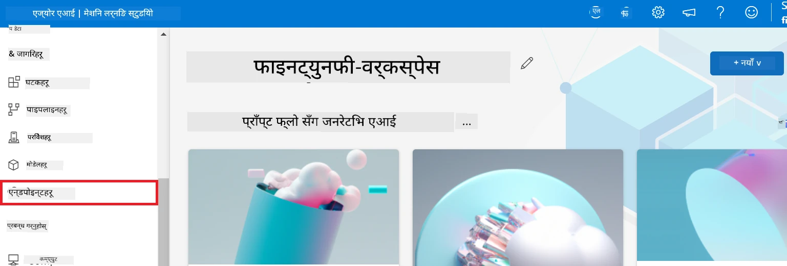

2. तपाईंले सिर्जना गरेको एन्डपोइन्ट चयन गर्नुहोस्।

    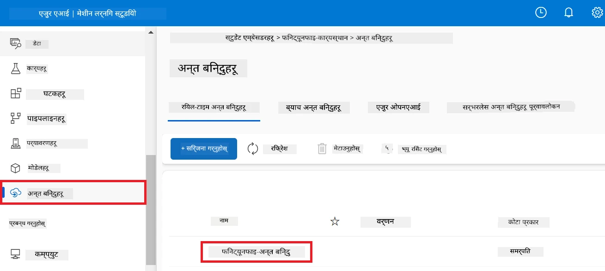

3. यस पृष्ठमा, डिप्लॉयमेन्ट प्रक्रियामा सिर्जना गरिएका एन्डपोइन्टहरू व्यवस्थापन गर्न सकिन्छ।

## परिदृश्य ३: Prompt flow सँग एकीकृत गर्नुहोस् र आफ्नो कस्टम मोडेलसँग कुराकानी गर्नुहोस्

### कस्टम Phi-3 मोडेललाई Prompt flow सँग एकीकृत गर्नुहोस्

तपाईंको फाइन-ट्युन गरिएको मोडेल सफलतापूर्वक डिप्लॉय गरेपछि, तपाईं यसलाई Prompt flow सँग एकीकृत गर्न सक्नुहुन्छ जसले तपाईंको मोडेललाई वास्तविक-समय अनुप्रयोगहरूमा प्रयोग गर्न अनुमति दिन्छ, र तपाईंको कस्टम Phi-3 मोडेलसँग विभिन्न अन्तरक्रियात्मक कार्यहरू गर्न सक्षम बनाउँछ।

#### फाइन-ट्युन गरेको Phi-3 मोडेलको api कुञ्जी र एन्डपोइन्ट यूआरआई सेट गर्नुहोस्

1. तपाईंले सिर्जना गर्नुभएको Azure Machine learning कार्यक्षेत्रमा जानुस्।
1. बायाँ पट्टि रहेको ट्याबबाट **Endpoints** चयन गर्नुहोस्।
1. तपाईंले सिर्जना गरेको एन्डपोइन्ट चयन गर्नुहोस्।
1. नेभिगेसन मेनुबाट **Consume** चयन गर्नुहोस्।
1. आफ्नो **REST endpoint** लाई *config.py* फाइलमा पेस्ट गर्नुहोस्, र `AZURE_ML_ENDPOINT = "your_fine_tuned_model_endpoint_uri"` लाई तपाईंको **REST endpoint** सँग परिवर्तन गर्नुहोस्।
1. आफ्नो **Primary key** लाई *config.py* फाइलमा पेस्ट गर्नुहोस्, र `AZURE_ML_API_KEY = "your_fine_tuned_model_api_key"` लाई तपाईंको **Primary key** सँग परिवर्तन गर्नुहोस्।

    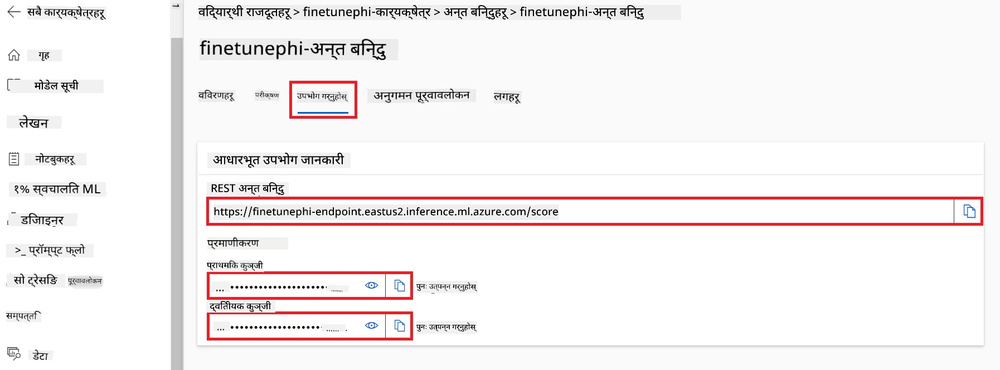

#### *flow.dag.yml* फाइलमा कोड थप्नुहोस्

1. Visual Studio Code मा *flow.dag.yml* फाइल खोल्नुहोस्।

1. *flow.dag.yml* मा तलको कोड थप्नुहोस्।

    ```yml
    inputs:
      input_data:
        type: string
        default: "Who founded Microsoft?"

    outputs:
      answer:
        type: string
        reference: ${integrate_with_promptflow.output}

    nodes:
    - name: integrate_with_promptflow
      type: python
      source:
        type: code
        path: integrate_with_promptflow.py
      inputs:
        input_data: ${inputs.input_data}
    ```

#### *integrate_with_promptflow.py* फाइलमा कोड थप्नुहोस्

1. Visual Studio Code मा *integrate_with_promptflow.py* फाइल खोल्नुहोस्।

1. *integrate_with_promptflow.py* मा तलको कोड थप्नुहोस्।

    ```python
    import logging
    import requests
    from promptflow.core import tool
    import asyncio
    import platform
    from config import (
        AZURE_ML_ENDPOINT,
        AZURE_ML_API_KEY
    )

    # लगिङ सेटअप
    logging.basicConfig(
        format="%(asctime)s - %(levelname)s - %(name)s - %(message)s",
        datefmt="%Y-%m-%d %H:%M:%S",
        level=logging.DEBUG
    )
    logger = logging.getLogger(__name__)

    def query_azml_endpoint(input_data: list, endpoint_url: str, api_key: str) -> str:
        """
        Send a request to the Azure ML endpoint with the given input data.
        """
        headers = {
            "Content-Type": "application/json",
            "Authorization": f"Bearer {api_key}"
        }
        data = {
            "input_data": [input_data],
            "params": {
                "temperature": 0.7,
                "max_new_tokens": 128,
                "do_sample": True,
                "return_full_text": True
            }
        }
        try:
            response = requests.post(endpoint_url, json=data, headers=headers)
            response.raise_for_status()
            result = response.json()[0]
            logger.info("Successfully received response from Azure ML Endpoint.")
            return result
        except requests.exceptions.RequestException as e:
            logger.error(f"Error querying Azure ML Endpoint: {e}")
            raise

    def setup_asyncio_policy():
        """
        Setup asyncio event loop policy for Windows.
        """
        if platform.system() == 'Windows':
            asyncio.set_event_loop_policy(asyncio.WindowsSelectorEventLoopPolicy())
            logger.info("Set Windows asyncio event loop policy.")

    @tool
    def my_python_tool(input_data: str) -> str:
        """
        Tool function to process input data and query the Azure ML endpoint.
        """
        setup_asyncio_policy()
        return query_azml_endpoint(input_data, AZURE_ML_ENDPOINT, AZURE_ML_API_KEY)

    ```

### आफ्नो कस्टम मोडेलसँग कुराकानी गर्नुहोस्

1. तलको कमान्ड टाइप गरी *deploy_model.py* स्क्रिप्ट चलाउनुस् र Azure Machine Learning मा डिप्लॉयमेन्ट प्रक्रिया सुरु गर्नुस्।

    ```python
    pf flow serve --source ./ --port 8080 --host localhost
    ```

1. यहाँ परिणामहरूको एउटा उदाहरण छ: अब तपाईं आफ्नो कस्टम Phi-3 मोडेलसँग कुराकानी गर्न सक्नुहुन्छ। फाइन-ट्युनिङका लागि प्रयोग गरिएको डाटामा आधारित प्रश्न सोध्न सिफारिस गरिन्छ।

    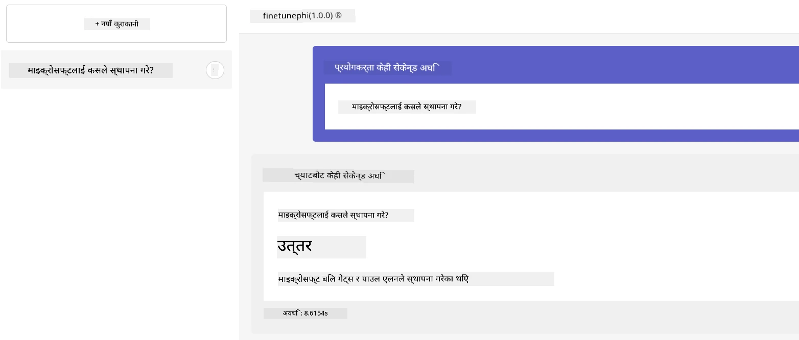

---

<!-- CO-OP TRANSLATOR DISCLAIMER START -->
**अस्वीकरण**:  
यो दस्तावेज AI अनुवाद सेवा [Co-op Translator](https://github.com/Azure/co-op-translator) प्रयोग गरी अनुवाद गरिएको हो। हामी शुद्धताका लागि प्रयासरत भए पनि, कृपया जानकारि हुनुस् कि स्वचालित अनुवादमा त्रुटि वा गलत जानकारी हुनसक्छ। मूल दस्तावेज यसको स्वदेशी भाषामा आधिकारिक स्रोत मानिनुपर्छ। महत्वपूर्ण जानकारीका लागि पेशेवर मानव अनुवादको सिफारिस गरिन्छ। यस अनुवादको प्रयोगबाट उत्पन्न कुनै पनि गलतफहमी वा गलत व्याख्याप्रति हामी जिम्मेवार छैनौं।
<!-- CO-OP TRANSLATOR DISCLAIMER END -->