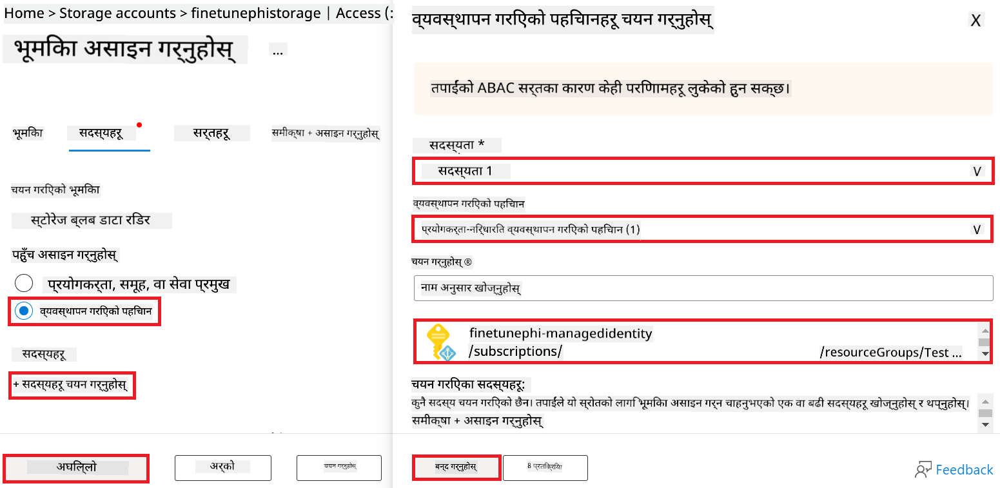
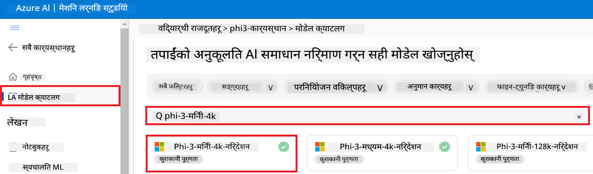
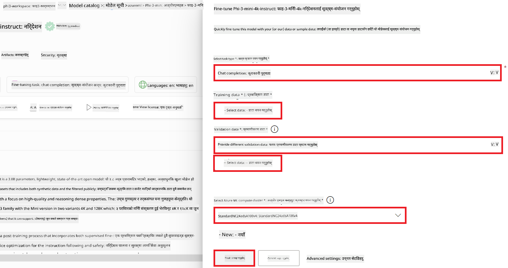
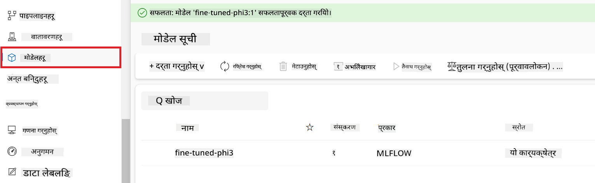
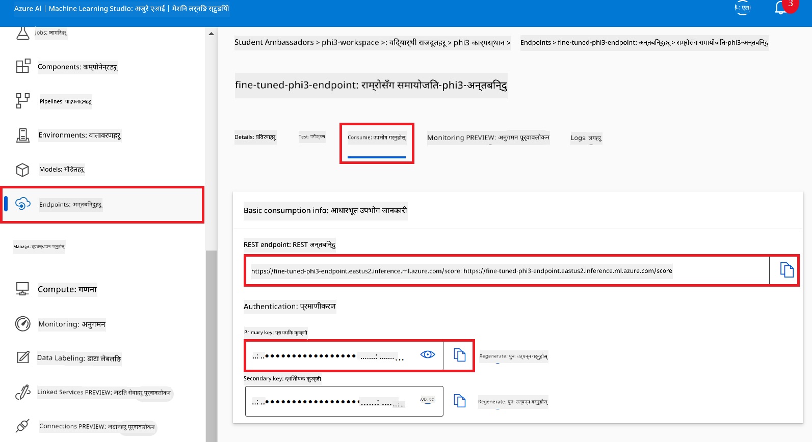
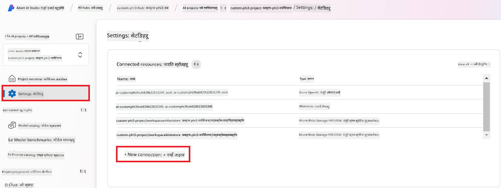

<!--
CO_OP_TRANSLATOR_METADATA:
{
  "original_hash": "0df910a227098303cc392b6ad204c271",
  "translation_date": "2026-01-06T04:28:32+00:00",
  "source_file": "md/02.Application/01.TextAndChat/Phi3/E2E_Phi-3-FineTuning_PromptFlow_Integration_AIFoundry.md",
  "language_code": "ne"
}
-->
# Fine-tune र Prompt flow सँग Azure AI Foundry मा कस्टम Phi-3 मोडेलहरू एकीकृत गर्नुहोस्

यो अन्त देखि अन्त (E2E) नमूना Microsoft Tech Community बाट "[Fine-Tune and Integrate Custom Phi-3 Models with Prompt Flow in Azure AI Foundry](https://techcommunity.microsoft.com/t5/educator-developer-blog/fine-tune-and-integrate-custom-phi-3-models-with-prompt-flow-in/ba-p/4191726?WT.mc_id=aiml-137032-kinfeylo)" मार्गनिर्देशनमा आधारित छ। यसले Azure AI Foundry मा Prompt flow सँग कस्टम Phi-3 मोडेलहरूलाई fine-tuning, तैनाथ गर्ने, र एकीकृत गर्ने प्रक्रियाहरू परिचय गराउँछ।
E2E नमूनाबाट फरक, "[Fine-Tune and Integrate Custom Phi-3 Models with Prompt Flow](./E2E_Phi-3-FineTuning_PromptFlow_Integration.md)" जसले स्थानीय रूपमा कोड चलाउन समावेश थियो, यो ट्युटोरियलले पूर्ण रूपमा Azure AI / ML Studio भित्र तपाईंको मोडेललाई fine-tune र एकीकृत गर्नेमा केन्द्रित छ।

## अवलोकन

यस E2E नमूनामा, तपाईंले Phi-3 मोडेललाई fine-tune गर्ने र Azure AI Foundry मा Prompt flow सँग यसलाई एकीकृत गर्ने तरिका सिक्नुहुनेछ। Azure AI / ML Studio प्रयोग गरेर, तपाईं कस्टम AI मोडेलहरू तैनाथ गर्ने र प्रयोग गर्ने कार्यप्रवाह स्थापना गर्नुहुनेछ। यो E2E नमुना तीन परिदृश्यहरूमा विभाजन गरिएको छ:

**परिदृश्य १: Azure स्रोतहरू सेट अप गर्ने र fine-tuning को लागि तयारी गर्ने**

**परिदृश्य २: Phi-3 मोडेललाई fine-tune गर्ने र Azure Machine Learning Studio मा तैनाथ गर्ने**

**परिदृश्य ३: Prompt flow सँग एकीकृत गर्ने र Azure AI Foundry मा तपाईंको कस्टम मोडेलसँग कुराकानी गर्ने**

यहाँ यस E2E नमूनाको अवलोकन छ।


### सूची

1. **[परिदृश्य १: Azure स्रोतहरू सेट अप गर्ने र fine-tuning को लागि तयारी गर्ने](../../../../../../md/02.Application/01.TextAndChat/Phi3)**
    - [Azure Machine Learning Workspace सिर्जना गर्ने](../../../../../../md/02.Application/01.TextAndChat/Phi3)
    - [Azure Subscription मा GPU कोटा अनुरोध गर्ने](../../../../../../md/02.Application/01.TextAndChat/Phi3)
    - [भूमिका विनियोजन थप्ने](../../../../../../md/02.Application/01.TextAndChat/Phi3)
    - [प्रोजेक्ट सेट अप गर्ने](../../../../../../md/02.Application/01.TextAndChat/Phi3)
    - [Fine-tuning को लागि डेटासेट तयारी गर्ने](../../../../../../md/02.Application/01.TextAndChat/Phi3)

1. **[परिदृश्य २: Phi-3 मोडेल fine-tune गर्ने र Azure Machine Learning Studio मा तैनाथ गर्ने](../../../../../../md/02.Application/01.TextAndChat/Phi3)**
    - [Phi-3 मोडेल fine-tune गर्ने](../../../../../../md/02.Application/01.TextAndChat/Phi3)
    - [Fine-tuned Phi-3 मोडेल तैनाथ गर्ने](../../../../../../md/02.Application/01.TextAndChat/Phi3)

1. **[परिदृश्य ३: Prompt flow सँग एकीकृत गर्ने र Azure AI Foundry मा तपाईंको कस्टम मोडेलसँग कुराकानी गर्ने](../../../../../../md/02.Application/01.TextAndChat/Phi3)**
    - [कस्टम Phi-3 मोडेललाई Prompt flow सँग एकीकृत गर्ने](../../../../../../md/02.Application/01.TextAndChat/Phi3)
    - [तपाईंको कस्टम Phi-3 मोडेलसँग कुराकानी गर्ने](../../../../../../md/02.Application/01.TextAndChat/Phi3)

## परिदृश्य १: Azure स्रोतहरू सेट अप गर्ने र fine-tuning को लागि तयारी गर्ने

### Azure Machine Learning Workspace सिर्जना गर्ने

1. पोर्टल पृष्ठको माथिल्लो भागमा रहेको **search bar** मा *azure machine learning* टाइप गर्नुहोस् र देखिएको विकल्पहरूबाट **Azure Machine Learning** चयन गर्नुहोस्।

    

2. नेभिगेसन मेनूबाट **+ Create** चयन गर्नुहोस्।

3. नेभिगेसन मेनूबाट **New workspace** चयन गर्नुहोस्।

    

4. तलका कार्यहरू गर्नुहोस्:

    - तपाईंको Azure **Subscription** चयन गर्नुहोस्।
    - प्रयोग गर्ने **Resource group** चयन गर्नुहोस् (आवश्यक परे नयाँ सिर्जना गर्नुहोस्)।
    - **Workspace Name** प्रविष्ट गर्नुहोस्। यो एक अद्वितीय मान हुनुपर्छ।
    - तपाईंले प्रयोग गर्न चाहेको **Region** चयन गर्नुहोस्।
    - प्रयोग गर्ने **Storage account** चयन गर्नुहोस् (आवश्यक परे नयाँ सिर्जना गर्नुहोस्)।
    - प्रयोग गर्ने **Key vault** चयन गर्नुहोस् (आवश्यक परे नयाँ सिर्जना गर्नुहोस्)।
    - प्रयोग गर्ने **Application insights** चयन गर्नुहोस् (आवश्यक परे नयाँ सिर्जना गर्नुहोस्)।
    - प्रयोग गर्ने **Container registry** चयन गर्नुहोस् (आवश्यक परे नयाँ सिर्जना गर्नुहोस्)।

    

5. **Review + Create** चयन गर्नुहोस्।

6. **Create** चयन गर्नुहोस्।

### Azure Subscription मा GPU कोटा अनुरोध गर्ने

यस ट्युटोरियलमा, तपाईं Phi-3 मोडेल fine-tune र तैनाथ गर्ने तरिका GPU हरू प्रयोग गरेर सिक्नुहुनेछ। Fine-tuning को लागि, तपाईंले *Standard_NC24ads_A100_v4* GPU प्रयोग गर्नु हुनेछ, जसका लागि कोटा अनुरोध आवश्यक छ। तैनाथीकरणका लागि, तपाईंले *Standard_NC6s_v3* GPU प्रयोग गर्नुहुनेछ, जसका लागि पनि कोटा अनुरोध आवश्यक छ।

> [!NOTE]
>
> केवल Pay-As-You-Go सदस्यताहरू (सामान्य सदस्यता प्रकार) ले GPU आवंटनको लागि योग्य छन्; लाभ सदस्यताहरू हाल समर्थन गरिएको छैनन्।
>

1. [Azure ML Studio](https://ml.azure.com/home?wt.mc_id=studentamb_279723) भ्रमण गर्नुहोस्।

1. *Standard NCADSA100v4 Family* कोटा अनुरोध गर्न निम्न कार्यहरू गर्नुहोस्:

    - बाँया पट्टि ट्याबबाट **Quota** चयन गर्नुहोस्।
    - प्रयोग गर्नुपर्ने **Virtual machine family** चयन गर्नुहोस्। उदाहरणका लागि, *Standard NCADSA100v4 Family Cluster Dedicated vCPUs* चयन गर्नुहोस्, जसले *Standard_NC24ads_A100_v4* GPU समावेश गर्दछ।
    - नेभिगेसन मेनूबाट **Request quota** चयन गर्नुहोस्।

        

    - Request quota पृष्ठ भित्र, तपाईंले प्रयोग गर्न चाहनुभएको **New cores limit** प्रविष्ट गर्नुहोस्। उदाहरणका लागि, २४।
    - Request quota पृष्ठ भित्र, GPU कोटा अनुरोध गर्न **Submit** चयन गर्नुहोस्।

1. *Standard NCSv3 Family* कोटा अनुरोध गर्न निम्न कार्यहरू गर्नुहोस्:

    - बाँया पट्टि ट्याबबाट **Quota** चयन गर्नुहोस्।
    - प्रयोग गर्नुपर्ने **Virtual machine family** चयन गर्नुहोस्। उदाहरणका लागि, *Standard NCSv3 Family Cluster Dedicated vCPUs* चयन गर्नुहोस्, जसले *Standard_NC6s_v3* GPU समावेश गर्दछ।
    - नेभिगेसन मेनूबाट **Request quota** चयन गर्नुहोस्।
    - Request quota पृष्ठ भित्र, तपाईंले प्रयोग गर्न चाहनुभएको **New cores limit** प्रविष्ट गर्नुहोस्। उदाहरणका लागि, २४।
    - Request quota पृष्ठ भित्र, GPU कोटा अनुरोध गर्न **Submit** चयन गर्नुहोस्।

### भूमिका विनियोजन थप्ने

तपाईंले मोडेलहरू fine-tune र तैनाथ गर्न User Assigned Managed Identity (UAI) सिर्जना गरी यसलाई उपयुक्त अनुमति दिनुपर्छ। यो UAI तैनाथीकरणको क्रममा प्रमाणीकरणका लागि प्रयोग हुनेछ।

#### User Assigned Managed Identity (UAI) सिर्जना गर्ने

1. पोर्टल पृष्ठको माथिल्लो भागमा रहेको **search bar** मा *managed identities* टाइप गर्नुहोस् र देखिएको विकल्पहरूबाट **Managed Identities** चयन गर्नुहोस्।

    

1. **+ Create** चयन गर्नुहोस्।

    

1. निम्न कार्यहरू गर्नुहोस्:

    - तपाईंको Azure **Subscription** चयन गर्नुहोस्।
    - प्रयोग गर्ने **Resource group** चयन गर्नुहोस् (आवश्यक परे नयाँ सिर्जना गर्नुहोस्)।
    - तपाईंले प्रयोग गर्न चाहेको **Region** चयन गर्नुहोस्।
    - **Name** प्रविष्ट गर्नुहोस्। यो एक अद्वितीय मान हुनुपर्छ।

    

1. **Review + create** चयन गर्नुहोस्।

1. **+ Create** चयन गर्नुहोस्।

#### Managed Identity लाई Contributor भूमिका विनियोजन थप्ने

1. तपाईंले सिर्जना गरेको Managed Identity स्रोतमा नेभिगेट गर्नुहोस्।

1. बाँया पट्टि ट्याबबाट **Azure role assignments** चयन गर्नुहोस्।

1. नेभिगेसन मेनूबाट **+Add role assignment** चयन गर्नुहोस्।

1. Add role assignment पृष्ठ भित्र, निम्न कार्यहरू गर्नुहोस्:
    - **Scope** लाई **Resource group** मा सेट गर्नुहोस्।
    - तपाईंको Azure **Subscription** चयन गर्नुहोस्।
    - प्रयोग गर्ने **Resource group** चयन गर्नुहोस्।
    - **Role** लाई **Contributor** मा सेट गर्नुहोस्।

    

2. **Save** चयन गर्नुहोस्।

#### Managed Identity लाई Storage Blob Data Reader भूमिका विनियोजन थप्ने

1. पोर्टल पृष्ठको माथिल्लो भागमा रहेको **search bar** मा *storage accounts* टाइप गर्नुहोस् र देखिएको विकल्पहरूबाट **Storage accounts** चयन गर्नुहोस्।

    

1. Azure Machine Learning workspace सँग सम्बन्धित storage account चयन गर्नुहोस्। उदाहरणका लागि, *finetunephistorage*।

1. Add role assignment पृष्ठमा नेभिगेट गर्न निम्न कार्यहरू गर्नुहोस्:

    - तपाईंले सिर्जना गरेको Azure Storage account मा नेभिगेट गर्नुहोस्।
    - बाँया पट्टि ट्याबबाट **Access Control (IAM)** चयन गर्नुहोस्।
    - नेभिगेसन मेनूबाट **+ Add** चयन गर्नुहोस्।
    - नेभिगेसन मेनूबाट **Add role assignment** चयन गर्नुहोस्।

    

1. Add role assignment पृष्ठ भित्र, निम्न कार्यहरू गर्नुहोस्:

    - Role पृष्ठ भित्र, **search bar** मा *Storage Blob Data Reader* टाइप गरी देखिएको विकल्पहरूबाट **Storage Blob Data Reader** चयन गर्नुहोस्।
    - Role पृष्ठ भित्र, **Next** चयन गर्नुहोस्।
    - Members पृष्ठ भित्र, **Assign access to** मा **Managed identity** चयन गर्नुहोस्।
    - Members पृष्ठ भित्र, **+ Select members** चयन गर्नुहोस्।
    - Select managed identities पृष्ठ भित्र, तपाईंको Azure **Subscription** चयन गर्नुहोस्।
    - Select managed identities पृष्ठ भित्र, **Managed identity** लाई **Manage Identity** चयन गर्नुहोस्।
    - Select managed identities पृष्ठ भित्र, तपाईंले सिर्जना गरेको Manage Identity चयन गर्नुहोस्। उदाहरणका लागि, *finetunephi-managedidentity*।
    - Select managed identities पृष्ठ भित्र, **Select** चयन गर्नुहोस्।

    

1. **Review + assign** चयन गर्नुहोस्।

#### Managed Identity लाई AcrPull भूमिका विनियोजन थप्ने

1. पोर्टल पृष्ठको माथिल्लो भागमा रहेको **search bar** मा *container registries* टाइप गर्नुहोस् र देखिएको विकल्पहरूबाट **Container registries** चयन गर्नुहोस्।

    

1. Azure Machine Learning workspace सँग सम्बन्धित container registry चयन गर्नुहोस्। उदाहरणका लागि, *finetunephicontainerregistry*

1. Add role assignment पृष्ठमा नेभिगेट गर्न निम्न कार्यहरू गर्नुहोस्:

    - बाँया पट्टि ट्याबबाट **Access Control (IAM)** चयन गर्नुहोस्।
    - नेभिगेसन मेनूबाट **+ Add** चयन गर्नुहोस्।
    - नेभिगेसन मेनूबाट **Add role assignment** चयन गर्नुहोस्।

1. Add role assignment पृष्ठ भित्र, निम्न कार्यहरू गर्नुहोस्:

    - Role पृष्ठ भित्र, **search bar** मा *AcrPull* टाइप गरी देखिएको विकल्पहरूबाट **AcrPull** चयन गर्नुहोस्।
    - Role पृष्ठ भित्र, **Next** चयन गर्नुहोस्।
    - Members पृष्ठ भित्र, **Assign access to** मा **Managed identity** चयन गर्नुहोस्।
    - Members पृष्ठ भित्र, **+ Select members** चयन गर्नुहोस्।
    - Select managed identities पृष्ठ भित्र, तपाईंको Azure **Subscription** चयन गर्नुहोस्।
    - Select managed identities पृष्ठ भित्र, **Managed identity** लाई **Manage Identity** चयन गर्नुहोस्।
    - Select managed identities पृष्ठ भित्र, तपाईंले सिर्जना गरेको Manage Identity चयन गर्नुहोस्। उदाहरणका लागि, *finetunephi-managedidentity*।
    - Select managed identities पृष्ठ भित्र, **Select** चयन गर्नुहोस्।
    - **Review + assign** चयन गर्नुहोस्।

### प्रोजेक्ट सेट अप गर्ने

Fine-tuning को लागि आवश्यक डेटासेटहरू डाउनलोड गर्न तपाईंले स्थानीय वातावरण सेट अप गर्नुहुनेछ।

यस अभ्यासमा, तपाईं

- काम गर्न एक फोल्डर सिर्जना गर्नुहुनेछ।
- एउटा virtual environment सिर्जना गर्नुहुनेछ।
- आवश्यक प्याकेजहरू स्थापना गर्नुहुनेछ।
- डेटासेट डाउनलोड गर्न *download_dataset.py* फाइल सिर्जना गर्नेछ।

#### काम गर्न फोल्डर सिर्जना गर्ने

1. टर्मिनल विन्डो खोल्नुहोस् र तल्लो आदेश टाइप गरेर पूर्वनिर्धारित बाटोमा *finetune-phi* नामक फोल्डर सिर्जना गर्नुहोस्।

    ```console
    mkdir finetune-phi
    ```

2. तपाईंले सिर्जना गर्नुभएको *finetune-phi* फोल्डरमा जानका लागि आफ्नो टर्मिनल भित्र तलको आदेश टाइप गर्नुहोस्।

    ```console
    cd finetune-phi
    ```

#### भर्चुअल वातावरण सिर्जना गर्नुहोस्

1. भर्चुअल वातावरण *.venv* नामले सिर्जना गर्नको लागि आफ्नो टर्मिनल भित्र तलको आदेश टाइप गर्नुहोस्।

    ```console
    python -m venv .venv
    ```

2. भर्चुअल वातावरण सक्रिय गर्नको लागि आफ्नो टर्मिनल भित्र तलको आदेश टाइप गर्नुहोस्।

    ```console
    .venv\Scripts\activate.bat
    ```

> [!NOTE]
> यदि सफल भयो भने, आदेश प्रॉम्प्ट अघि *(.venv)* देख्नु पर्नेछ।

#### आवश्यक प्याकेजहरू इन्स्टल गर्नुहोस्

1. आवश्यक प्याकेजहरू इन्स्टल गर्नको लागि आफ्नो टर्मिनल भित्र तलका आदेशहरू टाइप गर्नुहोस्।

    ```console
    pip install datasets==2.19.1
    ```

#### `donload_dataset.py` सिर्जना गर्नुहोस्

> [!NOTE]
> पूर्ण फोल्डर संरचना:
>
> ```text
> └── YourUserName
> .    └── finetune-phi
> .        └── download_dataset.py
> ```

1. **Visual Studio Code** खोल्नुहोस्।

1. मेनु बारबाट **File** रोज्नुहोस्।

1. **Open Folder** रोज्नुहोस्।

1. तपाईंले सिर्जना गर्नुभएको *finetune-phi* फोल्डर चयन गर्नुहोस्, जुन *C:\Users\yourUserName\finetune-phi* मा अवस्थित छ।

    

1. Visual Studio Code को बायाँ पेनमा, राइट-क्लिक गरेर **New File** चयन गर्नुहोस् र *download_dataset.py* नामको नयाँ फाइल सिर्जना गर्नुहोस्।

    

### फाइन-ट्यूनिंगको लागि डेटासेट तयार पार्नुहोस्

यस अभ्यासमा, तपाईंले *download_dataset.py* फाइल चलाएर *ultrachat_200k* डेटासेटहरू आफ्नो स्थानीय वातावरणमा डाउनलोड गर्नु हुनेछ। त्यसपछि तपाईंले यो डेटासेट प्रयोग गरी Azure Machine Learning मा Phi-3 मोडेललाई फाइन-ट्यून गर्नुहुनेछ।

यस अभ्यासमा तपाईंले:

- *download_dataset.py* फाइलमा कोड थपेर डेटासेटहरू डाउनलोड गर्नुहोस्।
- *download_dataset.py* फाइल चलाएर डेटासेटहरू स्थानीय वातावरणमा डाउनलोड गर्नुहोस्।

#### *download_dataset.py* प्रयोग गरी आफ्नो डेटासेट डाउनलोड गर्नुहोस्

1. Visual Studio Code मा *download_dataset.py* फाइल खोल्नुहोस्।

1. *download_dataset.py* फाइलमा तलको कोड थप्नुहोस्।

    ```python
    import json
    import os
    from datasets import load_dataset

    def load_and_split_dataset(dataset_name, config_name, split_ratio):
        """
        Load and split a dataset.
        """
        # निर्दिष्ट नाम, कन्फिगरेसन र स्प्लिट अनुपातसँग डेटासेट लोड गर्नुहोस्
        dataset = load_dataset(dataset_name, config_name, split=split_ratio)
        print(f"Original dataset size: {len(dataset)}")
        
        # डेटासेटलाई ट्रेन र टेस्ट सेटमा विभाजन गर्नुहोस् (८०% ट्रेन, २०% टेस्ट)
        split_dataset = dataset.train_test_split(test_size=0.2)
        print(f"Train dataset size: {len(split_dataset['train'])}")
        print(f"Test dataset size: {len(split_dataset['test'])}")
        
        return split_dataset

    def save_dataset_to_jsonl(dataset, filepath):
        """
        Save a dataset to a JSONL file.
        """
        # निर्देशिका छैन भने बनाउनुहोस्
        os.makedirs(os.path.dirname(filepath), exist_ok=True)
        
        # फाईललाई लेखन मोडमा खोल्नुहोस्
        with open(filepath, 'w', encoding='utf-8') as f:
            # डेटासेटका प्रत्येक रेकर्डमा दोहोर्याउनुहोस्
            for record in dataset:
                # रेकर्डलाई JSON वस्तु रूपमा डम्प गरेर फाईलमा लेख्नुहोस्
                json.dump(record, f)
                # रेकर्डहरूलाई अलग गर्ने नयाँ लाइन क्यारेक्टर लेख्नुहोस्
                f.write('\n')
        
        print(f"Dataset saved to {filepath}")

    def main():
        """
        Main function to load, split, and save the dataset.
        """
        # विशेष कन्फिगरेसन र स्प्लिट अनुपातसहित ULTRACHAT_200k डेटासेट लोड र विभाजन गर्नुहोस्
        dataset = load_and_split_dataset("HuggingFaceH4/ultrachat_200k", 'default', 'train_sft[:1%]')
        
        # स्प्लिटबाट ट्रेन र टेस्ट डेटासेट निकाल्नुहोस्
        train_dataset = dataset['train']
        test_dataset = dataset['test']

        # ट्रेन डेटासेटलाई JSONL फाईलमा बचत गर्नुहोस्
        save_dataset_to_jsonl(train_dataset, "data/train_data.jsonl")
        
        # टेस्ट डेटासेटलाई पृथक JSONL फाईलमा बचत गर्नुहोस्
        save_dataset_to_jsonl(test_dataset, "data/test_data.jsonl")

    if __name__ == "__main__":
        main()

    ```

1. स्क्रिप्ट चलाएर डेटासेट स्थानीय वातावरणमा डाउनलोड गर्नको लागि तलको आदेश टाइप गर्नुहोस्।

    ```console
    python download_dataset.py
    ```

1. सुनिश्चित गर्नुहोस् कि डेटासेटहरू सफलतापूर्वक स्थानीय *finetune-phi/data* डाइरेक्टरीमा सुरक्षित गरिएको छ।

> [!NOTE]
>
> #### डेटासेटको आकार र फाइन-ट्यूनिंग समय सम्बन्धी नोट
>
> यस ट्युटोरियलमा, तपाईंले डेटासेटको केवल 1% (`split='train[:1%]'`) मात्र प्रयोग गर्नुभएको छ। यसले डेटा मात्रा निकै घटाउँछ र अपलोड तथा फाइन-ट्यूनिंग प्रक्रिया द्रुत बनाउँछ। तपाईं प्रशिक्षण समय र मोडेल प्रदर्शन बीच सन्तुलन मिलाउनको लागि प्रतिशत समायोजन गर्न सक्नुहुन्छ। डेटासेटको सानो उपसमूहले फाइन-ट्यूनिंगमा लाग्ने समय घटाउँछ, जसले ट्युटोरियलका लागि प्रक्रियालाई सजिलो बनाउँछ।

## परिदृश्य 2: Phi-3 मोडेल फाइन-ट्यून गर्नुहोस् र Azure Machine Learning Studio मा डिप्लोय गर्नुहोस्

### Phi-3 मोडेल फाइन-ट्यून गर्नुहोस्

यस अभ्यासमा, तपाईं Azure Machine Learning Studio मा Phi-3 मोडेललाई फाइन-ट्यून गर्नुहुनेछ।

यस अभ्यासमा तपाईंले:

- फाइन-ट्यूनिंगका लागि कम्प्युटर क्लस्टर सिर्जना गर्नुहोस्।
- Azure Machine Learning Studio मा Phi-3 मोडेल फाइन-ट्यून गर्नुहोस्।

#### फाइन-ट्यूनिंगका लागि कम्प्युटर क्लस्टर सिर्जना गर्नुहोस्

1. [Azure ML Studio](https://ml.azure.com/home?wt.mc_id=studentamb_279723) भ्रमण गर्नुहोस्।

1. बायाँपट्टि रहेको ट्याबबाट **Compute** चयन गर्नुहोस्।

1. नेभिगेसन मेनुबाट **Compute clusters** चयन गर्नुहोस्।

1. **+ New** चयन गर्नुहोस्।

    

1. तलका कार्यहरू गर्नुहोस्:

    - तपाईं प्रयोग गर्न चाहनुभएको **Region** चयन गर्नुहोस्।
    - **Virtual machine tier** लाई **Dedicated** मा चयन गर्नुहोस्।
    - **Virtual machine type** लाई **GPU** मा चयन गर्नुहोस्।
    - **Virtual machine size** फिल्टरलाई **Select from all options** मा चयन गर्नुहोस्।
    - **Virtual machine size** लाई **Standard_NC24ads_A100_v4** मा चयन गर्नुहोस्।

    

1. **Next** चयन गर्नुहोस्।

1. तलका कार्यहरू गर्नुहोस्:

    - **Compute name** प्रविष्टि गर्नुहोस्। यो एक अनौठो मान हुनुपर्छ।
    - **Minimum number of nodes** लाई **0** मा चयन गर्नुहोस्।
    - **Maximum number of nodes** लाई **1** मा चयन गर्नुहोस्।
    - **Idle seconds before scale down** लाई **120** मा चयन गर्नुहोस्।

    

1. **Create** चयन गर्नुहोस्।

#### Phi-3 मोडेल फाइन-ट्यून गर्नुहोस्

1. [Azure ML Studio](https://ml.azure.com/home?wt.mc_id=studentamb_279723) भ्रमण गर्नुहोस्।

1. तपाईंले सिर्जना गर्नुभएको Azure Machine Learning कार्यक्षेत्र चयन गर्नुहोस्।

    

1. तलका कार्यहरू गर्नुहोस्:

    - बायाँपट्टि ट्याबबाट **Model catalog** चयन गर्नुहोस्।
    - **search bar** मा *phi-3-mini-4k* टाइप गर्नुहोस् र देखिने विकल्पहरूबाट **Phi-3-mini-4k-instruct** चयन गर्नुहोस्।

    

1. नेभिगेसन मेनुबाट **Fine-tune** चयन गर्नुहोस्।

    

1. तलका कार्यहरू गर्नुहोस्:

    - **Select task type** मा **Chat completion** चयन गर्नुहोस्।
    - **+ Select data** क्लिक गरेर **Training data** अपलोड गर्नुहोस्।
    - Validation data अपलोड प्रकारलाई **Provide different validation data** मा चयन गर्नुहोस्।
    - **+ Select data** क्लिक गरेर **Validation data** अपलोड गर्नुहोस्।

    

> [!TIP]
>
> तपाईंले **Advanced settings** चयन गरी **learning_rate** र **lr_scheduler_type** लगायतका कन्फिगरेसनहरू अनुकूल बनाउन सक्नुहुन्छ, जसले फाइन-ट्युनिङ प्रक्रियालाई तपाईंको आवश्यकताअनुसार सुधार गर्नेछ।

1. **Finish** चयन गर्नुहोस्।

1. यस अभ्यासमा, तपाईंले सफलतापूर्वक Azure Machine Learning प्रयोग गरी Phi-3 मोडेल फाइन-ट्यून गर्नुभयो। कृपया ध्यान दिनुहोस् कि फाइन-ट्युनिङ प्रक्रिया केही समय लाग्न सक्छ। फाइन-ट्युनिङ काम चलाएपछि, यसले पूरा हुन पर्खनुपर्छ। फाइन-ट्युनिङ कामको स्थिति जान्नको लागि Azure Machine Learning कार्यक्षेत्रको बायाँपट्टि रहेको Jobs ट्याबमा जान सक्नुहुन्छ। अर्को सिरिजमा, तपाईं फाइन-ट्यून गरिएको मोडेललाई डिप्लोय गरी Prompt flow सँग एकीकृत गर्नुहुनेछ।

    

### फाइन-ट्यून गरिएको Phi-3 मोडेल डिप्लोय गर्नुहोस्

फाइन-ट्यून गरिएको Phi-3 मोडेल Prompt flow सँग एकीकृत गर्न, तपाईंलाई मोडेललाई वास्तविक-समय पूर्वानुमान (inference) को लागि पहुँचयोग्य बनाउन डिप्लोय गर्नुपर्ने हुन्छ। यो प्रक्रिया मोडेल दर्ता, अनलाइन इन्टपोइन्ट सिर्जना, र मोडेल डिप्लोयमेन्ट समावेश गर्दछ।

यस अभ्यासमा तपाईंले:

- Azure Machine Learning कार्यक्षेत्रमा फाइन-ट्यून गरिएको मोडेल दर्ता गर्नुहोस्।
- अनलाइन इन्टपोइन्ट सिर्जना गर्नुहोस्।
- दर्ता गरिएको फाइन-ट्यून गरिएको Phi-3 मोडेल डिप्लोय गर्नुहोस्।

#### फाइन-ट्यून गरिएको मोडेल दर्ता गर्नुहोस्

1. [Azure ML Studio](https://ml.azure.com/home?wt.mc_id=studentamb_279723) भ्रमण गर्नुहोस्।

1. तपाईंले सिर्जना गर्नुभएको Azure Machine Learning कार्यक्षेत्र चयन गर्नुहोस्।

    

1. बायाँपट्टि ट्याबबाट **Models** चयन गर्नुहोस्।
1. **+ Register** चयन गर्नुहोस्।
1. **From a job output** चयन गर्नुहोस्।

    

1. तपाईंले सिर्जना गर्नुभएको जागिर चयन गर्नुहोस्।

    

1. **Next** चयन गर्नुहोस्।

1. **Model type** लाई **MLflow** मा चयन गर्नुहोस्।

1. **Job output** चयन भएको सुनिश्चित गर्नुहोस्; यो स्वचालित रूपमा चयन हुने छ।

    

2. **Next** चयन गर्नुहोस्।

3. **Register** चयन गर्नुहोस्।

    

4. तपाईं दर्ता गरिएको मोडेल बायाँपट्टि ट्याबबाट **Models** मेनुमा गई हेर्न सक्नुहुन्छ।

    

#### फाइन-ट्यून गरिएको मोडेल डिप्लोय गर्नुहोस्

1. तपाईंले सिर्जना गर्नुभएको Azure Machine Learning कार्यक्षेत्रमा जानुहोस्।

1. बायाँपट्टि ट्याबबाट **Endpoints** चयन गर्नुहोस्।

1. नेभिगेसन मेनुबाट **Real-time endpoints** चयन गर्नुहोस्।

    

1. **Create** चयन गर्नुहोस्।

1. तपाईंले सिर्जना गर्नुभएको दर्ता गरिएको मोडेल चयन गर्नुहोस्।

    

1. तलका कार्यहरू गर्नुहोस्:

    - **Virtual machine** लाई *Standard_NC6s_v3* मा चयन गर्नुहोस्।
    - तपाईं प्रयोग गर्न चाहनुभएको **Instance count** चयन गर्नुहोस्। उदाहरणका लागि, *1*।
    - **Endpoint** लाई नयाँ बनाउन **New** मा चयन गर्नुहोस्।
    - **Endpoint name** प्रविष्टि गर्नुहोस्। यो एउटा अनौठो मान हुनुपर्छ।
    - **Deployment name** प्रविष्टि गर्नुहोस्। यो एउटा अनौठो मान हुनुपर्छ।

    

1. **Deploy** चयन गर्नुहोस्।

> [!WARNING]
> तपाईंको खातामा अतिरिक्त शुल्क लाग्न नदिनका लागि, Azure Machine Learning कार्यक्षेत्रमा सिर्जना गरिएको इन्टपोइन्ट मेटाउने सुनिश्चित गर्नुहोस्।
>

#### Azure Machine Learning कार्यक्षेत्रमा डिप्लोयमेन्ट स्थिति जाँच गर्नुहोस्

1. तपाईंले सिर्जना गर्नुभएको Azure Machine Learning कार्यक्षेत्रमा जानुहोस्।

1. बायाँपट्टि ट्याबबाट **Endpoints** चयन गर्नुहोस्।

1. तपाईंले सिर्जना गर्नुभएको इन्टपोइन्ट चयन गर्नुहोस्।

    

1. यस पृष्ठमा, तपाईं डिप्लोयमेन्ट प्रक्रियाका बेला इन्टपोइन्टहरू व्यवस्थापन गर्न सक्नुहुन्छ।

> [!NOTE]
> एकपटक डिप्लोयमेन्ट पूरा भएपछि, सुनिश्चित गर्नुहोस् कि **Live traffic** लाई **100%** मा सेट गरिएको छ। यदि यस्तो छैन भने, **Update traffic** चयन गरेर ट्राफिक सेटिङहरू समायोजन गर्नुहोस्। ट्राफिक 0% मा सेट भएको खण्डमा मोडेल परीक्षण गर्न सकिदैन।
>
> 
>

## परिदृश्य 3: Prompt flow सँग एकीकृत गर्नुहोस् र Azure AI Foundry मा आफ्नो कस्टम मोडेलसँग संवाद गर्नुहोस्

### कस्टम Phi-3 मोडेललाई Prompt flow सँग एकीकृत गर्नुहोस्

फाइन-ट्यून गरिएको मोडेल सफलतापूर्वक डिप्लोय गरेपछि, अब तपाईं यसलाई Prompt Flow सँग एकीकृत गर्न सक्नुहुन्छ ताकि तपाईंको मोडेललाई वास्तविक-समय अनुप्रयोगहरूमा प्रयोग गर्न सकियोस्, जसले तपाईंको कस्टम Phi-3 मोडेलसँग विभिन्न अन्तरक्रियात्मक कार्यहरू सक्षम बनाउँछ।

यस अभ्यासमा तपाईंले:

- Azure AI Foundry Hub सिर्जना गर्नुहोस्।
- Azure AI Foundry Project सिर्जना गर्नुहोस्।
- Prompt flow सिर्जना गर्नुहोस्।
- फाइन-ट्यून गरिएको Phi-3 मोडेलको लागि कस्टम कन्टेक्शन थप्नुहोस्।
- आफ्नो कस्टम Phi-3 मोडेलसँग कुराकानी गर्न Prompt flow सेटअप गर्नुहोस्।

> [!NOTE]
> तपाईं Azure ML Studio प्रयोग गरेर पनि Promptflow सँग एकीकृत गर्न सक्नुहुन्छ। एउटै एकीकरण प्रक्रिया Azure ML Studio मा पनि लागू हुन्छ।

#### Azure AI Foundry Hub सिर्जना गर्नुहोस्

Project सिर्जना गर्नु अघि Hub सिर्जना गर्नुपर्छ। Hub ले Azure AI Foundry भित्र विभिन्न Project हरू व्यवस्थापन गर्न र व्यवस्थित गर्न Resource Group को रूपमा काम गर्दछ।

1. [Azure AI Foundry](https://ai.azure.com/?WT.mc_id=aiml-137032-kinfeylo) भ्रमण गर्नुहोस्।

1. बायाँपट्टि ट्याबबाट **All hubs** चयन गर्नुहोस्।

1. नेभिगेसन मेनुबाट **+ New hub** चयन गर्नुहोस्।
    

1. तलका कार्यहरू गर्नुहोस्:

    - **Hub name** प्रविष्ट गर्नुहोस्। यो एक अनूठो मान हुनुपर्छ।
    - आफ्नो Azure **Subscription** चयन गर्नुहोस्।
    - प्रयोग गर्न चाहनुभएको **Resource group** चयन गर्नुहोस् (आवश्यक परे नयाँ बनाउनुहोस्)।
    - प्रयोग गर्न चाहनुभएको **Location** चयन गर्नुहोस्।
    - प्रयोग गर्न चाहनुभएको **Connect Azure AI Services** चयन गर्नुहोस् (आवश्यक परे नयाँ बनाउनुहोस्)।
    - **Connect Azure AI Search** मा **Skip connecting** चयन गर्नुहोस्।

    

1. **Next** चयन गर्नुहोस्।

#### Azure AI Foundry Project सिर्जना गर्नुहोस्

1. तपाईंले सिर्जना गर्नुभएको Hub मा, बायाँपट्टि ट्याबबाट **All projects** चयन गर्नुहोस्।

1. नेभिगेसन मेनुबाट **+ New project** चयन गर्नुहोस्।

    

1. **Project name** प्रविष्ट गर्नुहोस्। यो एक अनूठो मान हुनुपर्छ।

    

1. **Create a project** चयन गर्नुहोस्।

#### fine-tuned Phi-3 मोडेलको लागि कस्टम कनेक्शन थप्नुहोस्

तपाईंको कस्टम Phi-3 मोडेललाई Prompt flow सँग एकीकृत गर्न, मोडेलको endpoint र key लाई कस्टम कनेक्शनमा सुरक्षित गर्न आवश्यक छ। यसले Prompt flow मा तपाईंको कस्टम Phi-3 मोडेलमा पहुँच सुनिश्चित गर्दछ।

#### fine-tuned Phi-3 मोडेलको api key र endpoint uri सेट गर्नुहोस्

1. [Azure ML Studio](https://ml.azure.com/home?WT.mc_id=aiml-137032-kinfeylo) मा जानुहोस्।

1. तपाईंले सिर्जना गर्नुभएको Azure Machine learning workspace मा जानुहोस्।

1. बायाँपट्टि ट्याबबाट **Endpoints** चयन गर्नुहोस्।

    

1. तपाईंले सिर्जना गर्नुभएको endpoint चयन गर्नुहोस्।

    

1. नेभिगेसन मेनुबाट **Consume** चयन गर्नुहोस्।

1. तपाईंको **REST endpoint** र **Primary key** कपी गर्नुहोस्।

    

#### कस्टम कनेक्शन थप्नुहोस्

1. [Azure AI Foundry](https://ai.azure.com/?WT.mc_id=aiml-137032-kinfeylo) मा जानुहोस्।

1. तपाईंले सिर्जना गर्नुभएको Azure AI Foundry प्रोजेक्टमा जानुहोस्।

1. तपाईंले सिर्जना गर्नुभएको प्रोजेक्टमा, बायाँपट्टि ट्याबबाट **Settings** चयन गर्नुहोस्।

1. **+ New connection** चयन गर्नुहोस्।

    

1. नेभिगेसन मेनुबाट **Custom keys** चयन गर्नुहोस्।

    

1. तलका कार्यहरू गर्नुहोस्:

    - **+ Add key value pairs** चयन गर्नुहोस्।
    - key नामका लागि **endpoint** लेख्नुहोस् र Azure ML Studio बाट कपी गरेको endpoint मान फिल्डमा टाँस्नुहोस्।
    - फेरि **+ Add key value pairs** चयन गर्नुहोस्।
    - key नामका लागि **key** लेख्नुहोस् र Azure ML Studio बाट कपी गरेको key मान फिल्डमा टाँस्नुहोस्।
    - keys थपिसकेपछि, key प्रकट हुनबाट रोक्न **is secret** चयन गर्नुहोस्।

    

1. **Add connection** चयन गर्नुहोस्।

#### Prompt flow सिर्जना गर्नुहोस्

तपाईंले Azure AI Foundry मा कस्टम कनेक्शन थप्नुभयो। अब, निम्न चरणहरू प्रयोग गरी Prompt flow सिर्जना गरौं। त्यसपछि, तपाईंले यस Prompt flow लाई कस्टम कनेक्शनसँग जडान गर्नुहुनेछ, जसले तपाईँलाई fine-tuned मोडेल Prompt flow भित्र प्रयोग गर्न सक्षम बनाउँछ।

1. तपाईंले सिर्जना गर्नुभएको Azure AI Foundry प्रोजेक्टमा जानुहोस्।

1. बायाँपट्टि ट्याबबाट **Prompt flow** चयन गर्नुहोस्।

1. नेभिगेसन मेनुबाट **+ Create** चयन गर्नुहोस्।

    

1. नेभिगेसन मेनुबाट **Chat flow** चयन गर्नुहोस्।

    

1. प्रयोग गर्न **Folder name** प्रविष्ट गर्नुहोस्।

    

2. **Create** चयन गर्नुहोस्।

#### तपाईँको कस्टम Phi-3 मोडेलसँग च्याट गर्न Prompt flow सेट अप गर्नुहोस्

तपाईंले fine-tuned Phi-3 मोडेललाई Prompt flow मा एकीकृत गर्न आवश्यक छ। हालको उपलब्ध Prompt flow यस उद्देश्यका लागि डिजाइन गरिएको छैन। त्यसैले, तपाईंले कस्टम मोडेलको एकीकरण सक्षम बनाउन Prompt flow पुनः डिजाइन गर्नुपर्नेछ।

1. Prompt flow मा, अवस्थित फ्लो पुनर्निर्माण गर्न तलका कार्यहरू गर्नुहोस्:

    - **Raw file mode** चयन गर्नुहोस्।
    - *flow.dag.yml* फाइलमा रहेका सबै कोड मेटाउनुहोस्।
    - *flow.dag.yml* फाइलमा तलको कोड थप्नुहोस्।

        ```yml
        inputs:
          input_data:
            type: string
            default: "Who founded Microsoft?"

        outputs:
          answer:
            type: string
            reference: ${integrate_with_promptflow.output}

        nodes:
        - name: integrate_with_promptflow
          type: python
          source:
            type: code
            path: integrate_with_promptflow.py
          inputs:
            input_data: ${inputs.input_data}
        ```

    - **Save** चयन गर्नुहोस्।

    

1. Prompt flow मा कस्टम Phi-3 मोडेल प्रयोग गर्न *integrate_with_promptflow.py* फाइलमा तलको कोड थप्नुहोस्।

    ```python
    import logging
    import requests
    from promptflow import tool
    from promptflow.connections import CustomConnection

    # लगिङ सेटअप
    logging.basicConfig(
        format="%(asctime)s - %(levelname)s - %(name)s - %(message)s",
        datefmt="%Y-%m-%d %H:%M:%S",
        level=logging.DEBUG
    )
    logger = logging.getLogger(__name__)

    def query_phi3_model(input_data: str, connection: CustomConnection) -> str:
        """
        Send a request to the Phi-3 model endpoint with the given input data using Custom Connection.
        """

        # "connection" अनुकूलित कनेक्शनको नाम हो, "endpoint", "key" अनुकूलित कनेक्शनभित्रका कुञ्जीहरू हुन्
        endpoint_url = connection.endpoint
        api_key = connection.key

        headers = {
            "Content-Type": "application/json",
            "Authorization": f"Bearer {api_key}"
        }
        data = {
            "input_data": {
                "input_string": [
                    {"role": "user", "content": input_data}
                ],
                "parameters": {
                    "temperature": 0.7,
                    "max_new_tokens": 128
                }
            }
        }
        try:
            response = requests.post(endpoint_url, json=data, headers=headers)
            response.raise_for_status()
            
            # पूर्ण JSON प्रतिक्रिया लग गर्नुहोस्
            logger.debug(f"Full JSON response: {response.json()}")

            result = response.json()["output"]
            logger.info("Successfully received response from Azure ML Endpoint.")
            return result
        except requests.exceptions.RequestException as e:
            logger.error(f"Error querying Azure ML Endpoint: {e}")
            raise

    @tool
    def my_python_tool(input_data: str, connection: CustomConnection) -> str:
        """
        Tool function to process input data and query the Phi-3 model.
        """
        return query_phi3_model(input_data, connection)

    ```

    

> [!NOTE]
> Azure AI Foundry मा Prompt flow प्रयोग गर्ने सम्बन्धी विस्तृत जानकारीको लागि, तपाईं [Prompt flow in Azure AI Foundry](https://learn.microsoft.com/azure/ai-studio/how-to/prompt-flow) हेर्न सक्नुहुन्छ।

1. तपाईंको मोडेलसँग चैट सक्षम पार्न **Chat input**, **Chat output** चयन गर्नुहोस्।

    

1. अब तपाईं तयार हुनुहुन्छ तपाईँको कस्टम Phi-3 मोडेलसँग च्याट गर्न। अर्को अभ्यासमा, तपाईंले Prompt flow सुरु गर्ने र यसलाई प्रयोग गरी तपाईँको fine-tuned Phi-3 मोडेलसँग कसरी च्याट गर्ने सिक्नुहुनेछ।

> [!NOTE]
>
> पुनर्निर्मित फ्लो तल दिइएको चित्र जस्तो देखिनु पर्छ:
>
> 
>

### तपाईंको कस्टम Phi-3 मोडेलसँग च्याट गर्नुहोस्

अब तपाईंले fine-tune गरी आफ्नो कस्टम Phi-3 मोडेल Prompt flow मा एकीकृत गर्नुभयो, बस तयार हुनुहोस् यसको साथ अन्तरक्रिया सुरु गर्न। यस अभ्यासले तपाईंलाई Model सँग च्याट गर्न Prompt flow सेटअप र सुरु गर्ने प्रक्रिया देखाउनेछ। यी चरणहरू पालना गरेर, तपाईं आफ्नो fine-tuned Phi-3 मोडेलका विभिन्न कार्यहरू र कुराकानीहरूको लागि पूर्णरूपमा प्रयोग गर्न सक्नुहुनेछ।

- Prompt flow प्रयोग गरेर आफ्नै कस्टम Phi-3 मोडेलसँग च्याट गर्नुहोस्।

#### Prompt flow सुरु गर्नुहोस्

1. Prompt flow सुरु गर्न **Start compute sessions** चयन गर्नुहोस्।

    

1. प्यारामिटरहरू पुनः नविकरण गर्न **Validate and parse input** चयन गर्नुहोस्।

    

1. तपाईंले सिर्जना गरेको कस्टम कनेक्शनको **connection** को **Value** चयन गर्नुहोस्। उदाहरणको लागि, *connection*।

    

#### तपाईंको कस्टम मोडेलसँग च्याट गर्नुहोस्

1. **Chat** चयन गर्नुहोस्।

    

1. परिणामको उदाहरण यहाँ छ: अब तपाईं आफ्नो कस्टम Phi-3 मोडेलसँग च्याट गर्न सक्नुहुन्छ। fine-tuning का लागि प्रयोग गरिएको डाटामा आधारित प्रश्न सोध्न सिफारिस गरिन्छ।

    

---

<!-- CO-OP TRANSLATOR DISCLAIMER START -->
**अस्वीकरण**:
यस दस्तावेजलाई AI अनुवाद सेवा [Co-op Translator](https://github.com/Azure/co-op-translator) प्रयोग गरी अनुवाद गरिएको हो। हामी सही अनुवादको प्रयास गर्छौं भने पनि, कृपया ध्यान दिनुहोस् कि स्वचालित अनुवादमा त्रुटि वा अशुद्धि हुन सक्छ। मूल दस्तावेज यसको मूल भाषामा आधिकारिक स्रोत मानिनेछ। महत्वपूर्ण जानकारीका लागि, व्यावसायिक मानवीय अनुवाद सिफारिस गरिन्छ। यस अनुवादको प्रयोगबाट उत्पन्न भएका कुनै पनि गलतफहमी वा व्याख्यामा हामी जिम्मेवार हुनेछैनौं।
<!-- CO-OP TRANSLATOR DISCLAIMER END -->