<!--
CO_OP_TRANSLATOR_METADATA:
{
  "original_hash": "ecbd9179a21edbaafaf114d47f09f3e3",
  "translation_date": "2025-07-17T01:18:30+00:00",
  "source_file": "md/02.Application/01.TextAndChat/Phi3/E2E_Phi-3-FineTuning_PromptFlow_Integration_AIFoundry.md",
  "language_code": "ne"
}
-->
# Azure AI Foundry मा Prompt flow सँग कस्टम Phi-3 मोडेलहरू फाइन-ट्यून र एकीकृत गर्नुहोस्

यो अन्त्य-देखि-अन्त (E2E) नमूना Microsoft Tech Community को "[Fine-Tune and Integrate Custom Phi-3 Models with Prompt Flow in Azure AI Foundry](https://techcommunity.microsoft.com/t5/educator-developer-blog/fine-tune-and-integrate-custom-phi-3-models-with-prompt-flow-in/ba-p/4191726?WT.mc_id=aiml-137032-kinfeylo)" मार्गदर्शनमा आधारित छ। यसले Azure AI Foundry मा Prompt flow सँग कस्टम Phi-3 मोडेलहरू फाइन-ट्यून गर्ने, तैनाथ गर्ने, र एकीकृत गर्ने प्रक्रियाहरू परिचय गराउँछ।  
E2E नमूनाको विपरीत, "[Fine-Tune and Integrate Custom Phi-3 Models with Prompt Flow](./E2E_Phi-3-FineTuning_PromptFlow_Integration.md)" जसमा स्थानीय रूपमा कोड चलाइएको थियो, यो ट्युटोरियल पूर्ण रूपमा Azure AI / ML Studio भित्र मोडेल फाइन-ट्यून र एकीकृत गर्न केन्द्रित छ।

## अवलोकन

यस E2E नमूनामा, तपाईंले Phi-3 मोडेल कसरी फाइन-ट्यून गर्ने र Azure AI Foundry मा Prompt flow सँग कसरी एकीकृत गर्ने सिक्नुहुनेछ। Azure AI / ML Studio को उपयोग गरेर, तपाईंले कस्टम AI मोडेलहरू तैनाथ गर्ने र प्रयोग गर्ने कार्यप्रवाह स्थापना गर्नुहुनेछ। यो E2E नमूना तीन परिदृश्यहरूमा विभाजित छ:

**परिदृश्य १: Azure स्रोतहरू सेटअप गर्नुहोस् र फाइन-ट्यूनिङको लागि तयारी गर्नुहोस्**

**परिदृश्य २: Phi-3 मोडेल फाइन-ट्यून गर्नुहोस् र Azure Machine Learning Studio मा तैनाथ गर्नुहोस्**

**परिदृश्य ३: Prompt flow सँग एकीकृत गर्नुहोस् र Azure AI Foundry मा आफ्नो कस्टम मोडेलसँग कुराकानी गर्नुहोस्**

यहाँ यस E2E नमूनाको अवलोकन छ।


### सामग्री तालिका

1. **[परिदृश्य १: Azure स्रोतहरू सेटअप गर्नुहोस् र फाइन-ट्यूनिङको लागि तयारी गर्नुहोस्](../../../../../../md/02.Application/01.TextAndChat/Phi3)**
    - [Azure Machine Learning Workspace सिर्जना गर्नुहोस्](../../../../../../md/02.Application/01.TextAndChat/Phi3)
    - [Azure Subscription मा GPU कोटा अनुरोध गर्नुहोस्](../../../../../../md/02.Application/01.TextAndChat/Phi3)
    - [भूमिका असाइनमेन्ट थप्नुहोस्](../../../../../../md/02.Application/01.TextAndChat/Phi3)
    - [प्रोजेक्ट सेटअप गर्नुहोस्](../../../../../../md/02.Application/01.TextAndChat/Phi3)
    - [फाइन-ट्यूनिङको लागि डेटासेट तयार गर्नुहोस्](../../../../../../md/02.Application/01.TextAndChat/Phi3)

1. **[परिदृश्य २: Phi-3 मोडेल फाइन-ट्यून गर्नुहोस् र Azure Machine Learning Studio मा तैनाथ गर्नुहोस्](../../../../../../md/02.Application/01.TextAndChat/Phi3)**
    - [Phi-3 मोडेल फाइन-ट्यून गर्नुहोस्](../../../../../../md/02.Application/01.TextAndChat/Phi3)
    - [फाइन-ट्यून गरिएको Phi-3 मोडेल तैनाथ गर्नुहोस्](../../../../../../md/02.Application/01.TextAndChat/Phi3)

1. **[परिदृश्य ३: Prompt flow सँग एकीकृत गर्नुहोस् र Azure AI Foundry मा आफ्नो कस्टम मोडेलसँग कुराकानी गर्नुहोस्](../../../../../../md/02.Application/01.TextAndChat/Phi3)**
    - [कस्टम Phi-3 मोडेललाई Prompt flow सँग एकीकृत गर्नुहोस्](../../../../../../md/02.Application/01.TextAndChat/Phi3)
    - [आफ्नो कस्टम Phi-3 मोडेलसँग कुराकानी गर्नुहोस्](../../../../../../md/02.Application/01.TextAndChat/Phi3)

## परिदृश्य १: Azure स्रोतहरू सेटअप गर्नुहोस् र फाइन-ट्यूनिङको लागि तयारी गर्नुहोस्

### Azure Machine Learning Workspace सिर्जना गर्नुहोस्

1. पोर्टल पृष्ठको माथिल्लो भागमा रहेको **search bar** मा *azure machine learning* टाइप गर्नुहोस् र देखिएका विकल्पहरूबाट **Azure Machine Learning** चयन गर्नुहोस्।

    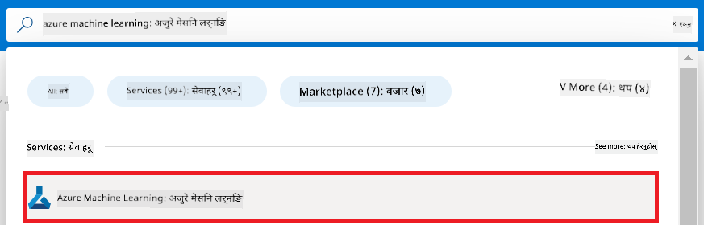

2. नेभिगेसन मेनुबाट **+ Create** चयन गर्नुहोस्।

3. नेभिगेसन मेनुबाट **New workspace** चयन गर्नुहोस्।

    

4. तलका कार्यहरू गर्नुहोस्:

    - आफ्नो Azure **Subscription** चयन गर्नुहोस्।
    - प्रयोग गर्नुपर्ने **Resource group** चयन गर्नुहोस् (आवश्यक परे नयाँ बनाउनुहोस्)।
    - **Workspace Name** प्रविष्ट गर्नुहोस्। यो अनौठो हुनुपर्छ।
    - प्रयोग गर्न चाहेको **Region** चयन गर्नुहोस्।
    - प्रयोग गर्नुपर्ने **Storage account** चयन गर्नुहोस् (आवश्यक परे नयाँ बनाउनुहोस्)।
    - प्रयोग गर्नुपर्ने **Key vault** चयन गर्नुहोस् (आवश्यक परे नयाँ बनाउनुहोस्)।
    - प्रयोग गर्नुपर्ने **Application insights** चयन गर्नुहोस् (आवश्यक परे नयाँ बनाउनुहोस्)।
    - प्रयोग गर्नुपर्ने **Container registry** चयन गर्नुहोस् (आवश्यक परे नयाँ बनाउनुहोस्)।

    

5. **Review + Create** चयन गर्नुहोस्।

6. **Create** चयन गर्नुहोस्।

### Azure Subscription मा GPU कोटा अनुरोध गर्नुहोस्

यस ट्युटोरियलमा, तपाईं GPU प्रयोग गरेर Phi-3 मोडेल फाइन-ट्यून र तैनाथ गर्ने तरिका सिक्नुहुनेछ। फाइन-ट्यूनिङको लागि *Standard_NC24ads_A100_v4* GPU प्रयोग गरिनेछ, जसका लागि कोटा अनुरोध आवश्यक छ। तैनाथीकरणको लागि *Standard_NC6s_v3* GPU प्रयोग गरिनेछ, जसका लागि पनि कोटा अनुरोध आवश्यक छ।

> [!NOTE]
>
> केवल Pay-As-You-Go सब्सक्रिप्शनहरू (मानक सब्सक्रिप्शन प्रकार) GPU आवंटनको लागि योग्य छन्; लाभ सब्सक्रिप्शनहरू हाल समर्थित छैनन्।
>

1. [Azure ML Studio](https://ml.azure.com/home?wt.mc_id=studentamb_279723) मा जानुहोस्।

1. *Standard NCADSA100v4 Family* कोटा अनुरोध गर्न तलका कार्यहरू गर्नुहोस्:

    - बायाँपट्टि ट्याबबाट **Quota** चयन गर्नुहोस्।
    - प्रयोग गर्नुपर्ने **Virtual machine family** चयन गर्नुहोस्। उदाहरणका लागि, *Standard NCADSA100v4 Family Cluster Dedicated vCPUs* चयन गर्नुहोस्, जसमा *Standard_NC24ads_A100_v4* GPU समावेश छ।
    - नेभिगेसन मेनुबाट **Request quota** चयन गर्नुहोस्।

        

    - Request quota पृष्ठमा, तपाईंले प्रयोग गर्न चाहेको **New cores limit** प्रविष्ट गर्नुहोस्। उदाहरणका लागि, २४।
    - Request quota पृष्ठमा, GPU कोटा अनुरोध गर्न **Submit** चयन गर्नुहोस्।

1. *Standard NCSv3 Family* कोटा अनुरोध गर्न तलका कार्यहरू गर्नुहोस्:

    - बायाँपट्टि ट्याबबाट **Quota** चयन गर्नुहोस्।
    - प्रयोग गर्नुपर्ने **Virtual machine family** चयन गर्नुहोस्। उदाहरणका लागि, *Standard NCSv3 Family Cluster Dedicated vCPUs* चयन गर्नुहोस्, जसमा *Standard_NC6s_v3* GPU समावेश छ।
    - नेभिगेसन मेनुबाट **Request quota** चयन गर्नुहोस्।
    - Request quota पृष्ठमा, तपाईंले प्रयोग गर्न चाहेको **New cores limit** प्रविष्ट गर्नुहोस्। उदाहरणका लागि, २४।
    - Request quota पृष्ठमा, GPU कोटा अनुरोध गर्न **Submit** चयन गर्नुहोस्।

### भूमिका असाइनमेन्ट थप्नुहोस्

तपाईंको मोडेलहरू फाइन-ट्यून र तैनाथ गर्न, पहिले User Assigned Managed Identity (UAI) सिर्जना गर्नुहोस् र यसलाई उपयुक्त अनुमति दिनुहोस्। यो UAI तैनाथीकरणको क्रममा प्रमाणीकरणका लागि प्रयोग हुनेछ।

#### User Assigned Managed Identity (UAI) सिर्जना गर्नुहोस्

1. पोर्टल पृष्ठको माथिल्लो भागमा रहेको **search bar** मा *managed identities* टाइप गर्नुहोस् र देखिएका विकल्पहरूबाट **Managed Identities** चयन गर्नुहोस्।

    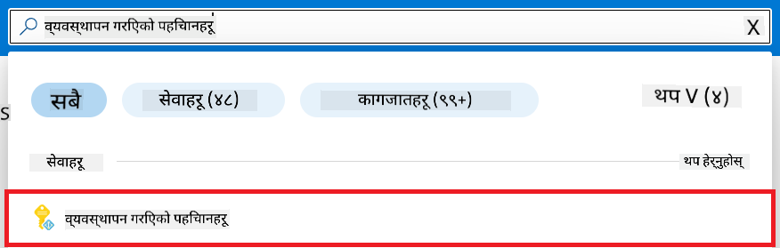

1. **+ Create** चयन गर्नुहोस्।

    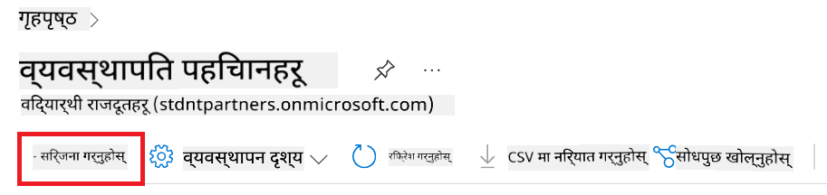

1. तलका कार्यहरू गर्नुहोस्:

    - आफ्नो Azure **Subscription** चयन गर्नुहोस्।
    - प्रयोग गर्नुपर्ने **Resource group** चयन गर्नुहोस् (आवश्यक परे नयाँ बनाउनुहोस्)।
    - प्रयोग गर्न चाहेको **Region** चयन गर्नुहोस्।
    - **Name** प्रविष्ट गर्नुहोस्। यो अनौठो हुनुपर्छ।

    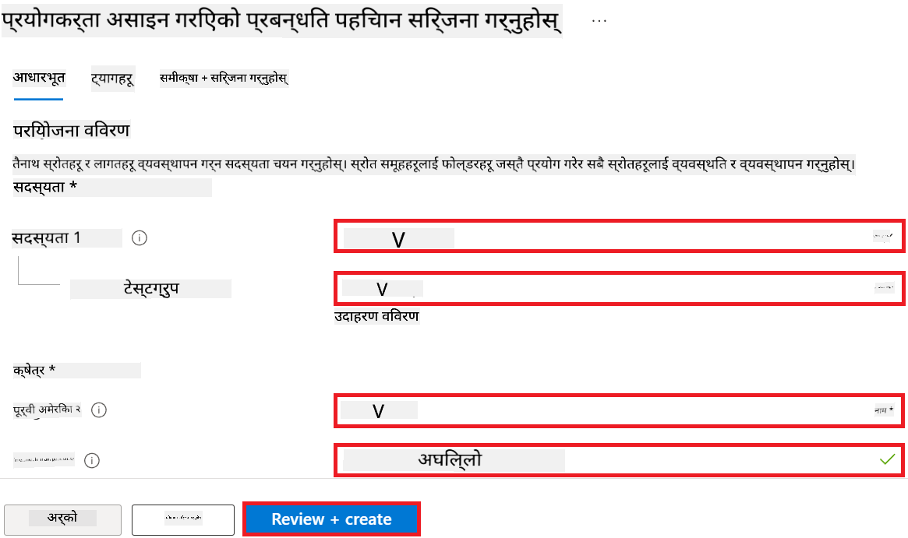

1. **Review + create** चयन गर्नुहोस्।

1. **+ Create** चयन गर्नुहोस्।

#### Managed Identity लाई Contributor भूमिका असाइन गर्नुहोस्

1. तपाईंले सिर्जना गरेको Managed Identity स्रोतमा जानुहोस्।

1. बायाँपट्टि ट्याबबाट **Azure role assignments** चयन गर्नुहोस्।

1. नेभिगेसन मेनुबाट **+Add role assignment** चयन गर्नुहोस्।

1. Add role assignment पृष्ठमा, तलका कार्यहरू गर्नुहोस्:
    - **Scope** लाई **Resource group** मा सेट गर्नुहोस्।
    - आफ्नो Azure **Subscription** चयन गर्नुहोस्।
    - प्रयोग गर्नुपर्ने **Resource group** चयन गर्नुहोस्।
    - **Role** लाई **Contributor** मा सेट गर्नुहोस्।

    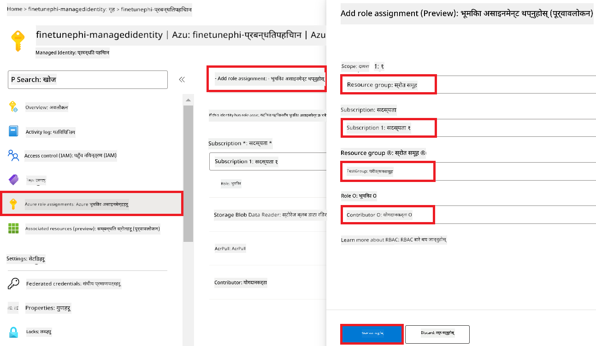

2. **Save** चयन गर्नुहोस्।

#### Managed Identity लाई Storage Blob Data Reader भूमिका असाइन गर्नुहोस्

1. पोर्टल पृष्ठको माथिल्लो भागमा रहेको **search bar** मा *storage accounts* टाइप गर्नुहोस् र देखिएका विकल्पहरूबाट **Storage accounts** चयन गर्नुहोस्।

    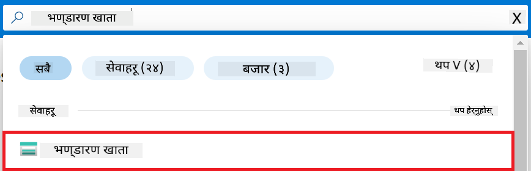

1. तपाईंले सिर्जना गरेको Azure Machine Learning workspace सँग सम्बन्धित storage account चयन गर्नुहोस्। उदाहरणका लागि, *finetunephistorage*।

1. Add role assignment पृष्ठमा जान तलका कार्यहरू गर्नुहोस्:

    - सिर्जना गरेको Azure Storage account मा जानुहोस्।
    - बायाँपट्टि ट्याबबाट **Access Control (IAM)** चयन गर्नुहोस्।
    - नेभिगेसन मेनुबाट **+ Add** चयन गर्नुहोस्।
    - नेभिगेसन मेनुबाट **Add role assignment** चयन गर्नुहोस्।

    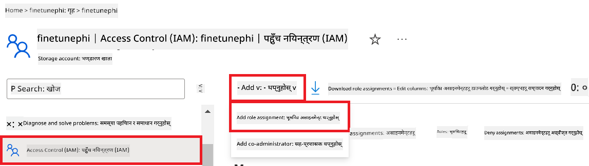

1. Add role assignment पृष्ठमा, तलका कार्यहरू गर्नुहोस्:

    - Role पृष्ठमा, **search bar** मा *Storage Blob Data Reader* टाइप गर्नुहोस् र देखिएका विकल्पहरूबाट **Storage Blob Data Reader** चयन गर्नुहोस्।
    - Role पृष्ठमा, **Next** चयन गर्नुहोस्।
    - Members पृष्ठमा, **Assign access to** मा **Managed identity** चयन गर्नुहोस्।
    - Members पृष्ठमा, **+ Select members** चयन गर्नुहोस्।
    - Select managed identities पृष्ठमा, आफ्नो Azure **Subscription** चयन गर्नुहोस्।
    - Select managed identities पृष्ठमा, **Managed identity** लाई **Manage Identity** मा सेट गर्नुहोस्।
    - Select managed identities पृष्ठमा, तपाईंले सिर्जना गरेको Manage Identity चयन गर्नुहोस्। उदाहरणका लागि, *finetunephi-managedidentity*।
    - Select managed identities पृष्ठमा, **Select** चयन गर्नुहोस्।

    

1. **Review + assign** चयन गर्नुहोस्।

#### Managed Identity लाई AcrPull भूमिका असाइन गर्नुहोस्

1. पोर्टल पृष्ठको माथिल्लो भागमा रहेको **search bar** मा *container registries* टाइप गर्नुहोस् र देखिएका विकल्पहरूबाट **Container registries** चयन गर्नुहोस्।

    

1. Azure Machine Learning workspace सँग सम्बन्धित container registry चयन गर्नुहोस्। उदाहरणका लागि, *finetunephicontainerregistry*

1. Add role assignment पृष्ठमा जान तलका कार्यहरू गर्नुहोस्:

    - बायाँपट्टि ट्याबबाट **Access Control (IAM)** चयन गर्नुहोस्।
    - नेभिगेसन मेनुबाट **+ Add** चयन गर्नुहोस्।
    - नेभिगेसन मेनुबाट **Add role assignment** चयन गर्नुहोस्।

1. Add role assignment पृष्ठमा, तलका कार्यहरू गर्नुहोस्:

    - Role पृष्ठमा, **search bar** मा *AcrPull* टाइप गर्नुहोस् र देखिएका विकल्पहरूबाट **AcrPull** चयन गर्नुहोस्।
    - Role पृष्ठमा, **Next** चयन गर्नुहोस्।
    - Members पृष्ठमा, **Assign access to** मा **Managed identity** चयन गर्नुहोस्।
    - Members पृष्ठमा, **+ Select members** चयन गर्नुहोस्।
    - Select managed identities पृष्ठमा, आफ्नो Azure **Subscription** चयन गर्नुहोस्।
    - Select managed identities पृष्ठमा, **Managed identity** लाई **Manage Identity** मा सेट गर्नुहोस्।
    - Select managed identities पृष्ठमा, तपाईंले सिर्जना गरेको Manage Identity चयन गर्नुहोस्। उदाहरणका लागि, *finetunephi-managedidentity*।
    - Select managed identities पृष्ठमा, **Select** चयन गर्नुहोस्।
    - **Review + assign** चयन गर्नुहोस्।

### प्रोजेक्ट सेटअप गर्नुहोस्

फाइन-ट्यूनिङको लागि आवश्यक डेटासेटहरू डाउनलोड गर्न, तपाईंले स्थानीय वातावरण सेटअप गर्नुहुनेछ।

यस अभ्यासमा, तपाईंले

- काम गर्नको लागि एउटा फोल्डर सिर्जना गर्नुहुनेछ।
- भर्चुअल वातावरण सिर्जना गर्नुहुनेछ।
- आवश्यक प्याकेजहरू इन्स्टल गर्नुहुनेछ।
- डेटासेट डाउनलोड गर्न *download_dataset.py* फाइल सिर्जना गर्नुहुनेछ।

#### काम गर्नको लागि फोल्डर सिर्जना गर्नुहोस्

1. टर्मिनल विन्डो खोल्नुहोस् र तलको कमाण्ड टाइप गरेर डिफल्ट पथमा *finetune-phi* नामको फोल्डर सिर्जना गर्नुहोस्।

    ```console
    mkdir finetune-phi
    ```

2. टर्मिनलमा तलको कमाण्ड टाइप गरेर तपाईंले सिर्जना गरेको *finetune-phi* फोल्डरमा जानुहोस्।
#### भर्चुअल वातावरण सिर्जना गर्नुहोस्

1. आफ्नो टर्मिनलमा तलको कमाण्ड टाइप गरेर *.venv* नामको भर्चुअल वातावरण सिर्जना गर्नुहोस्।

    ```console
    python -m venv .venv
    ```

2. आफ्नो टर्मिनलमा तलको कमाण्ड टाइप गरेर भर्चुअल वातावरण सक्रिय गर्नुहोस्।

    ```console
    .venv\Scripts\activate.bat
    ```


> [!NOTE]
> यदि सफल भयो भने, कमाण्ड प्रॉम्प्ट अघि *(.venv)* देखिनु पर्छ।

#### आवश्यक प्याकेजहरू इन्स्टल गर्नुहोस्

1. आफ्नो टर्मिनलमा तलका कमाण्डहरू टाइप गरेर आवश्यक प्याकेजहरू इन्स्टल गर्नुहोस्।

    ```console
    pip install datasets==2.19.1
    ```

#### `download_dataset.py` सिर्जना गर्नुहोस्

> [!NOTE]
> पूर्ण फोल्डर संरचना:
>
> ```text
> └── YourUserName
> .    └── finetune-phi
> .        └── download_dataset.py
> ```

1. **Visual Studio Code** खोल्नुहोस्।

1. मेनु बारबाट **File** चयन गर्नुहोस्।

1. **Open Folder** चयन गर्नुहोस्।

1. तपाईंले सिर्जना गरेको *finetune-phi* फोल्डर चयन गर्नुहोस्, जुन *C:\Users\yourUserName\finetune-phi* मा अवस्थित छ।

    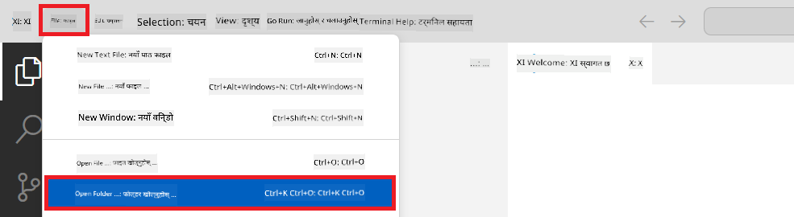

1. Visual Studio Code को बायाँ प्यानलमा राइट-क्लिक गरेर **New File** चयन गरी *download_dataset.py* नामको नयाँ फाइल सिर्जना गर्नुहोस्।

    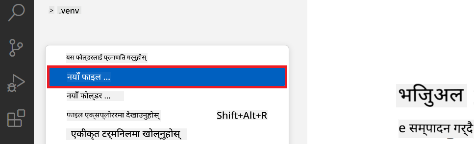

### फाइन-ट्युनिङका लागि डेटासेट तयार गर्नुहोस्

यस अभ्यासमा, तपाईंले *download_dataset.py* फाइल चलाएर *ultrachat_200k* डेटासेटहरू आफ्नो स्थानीय वातावरणमा डाउनलोड गर्नुहुनेछ। त्यसपछि यी डेटासेटहरूलाई Azure Machine Learning मा Phi-3 मोडेल फाइन-ट्युन गर्न प्रयोग गर्नुहुनेछ।

यस अभ्यासमा, तपाईंले:

- *download_dataset.py* फाइलमा कोड थपेर डेटासेट डाउनलोड गर्ने।
- *download_dataset.py* फाइल चलाएर डेटासेटहरू आफ्नो स्थानीय वातावरणमा डाउनलोड गर्ने।

#### *download_dataset.py* प्रयोग गरी आफ्नो डेटासेट डाउनलोड गर्नुहोस्

1. Visual Studio Code मा *download_dataset.py* फाइल खोल्नुहोस्।

1. तलको कोड *download_dataset.py* फाइलमा थप्नुहोस्।

    ```python
    import json
    import os
    from datasets import load_dataset

    def load_and_split_dataset(dataset_name, config_name, split_ratio):
        """
        Load and split a dataset.
        """
        # Load the dataset with the specified name, configuration, and split ratio
        dataset = load_dataset(dataset_name, config_name, split=split_ratio)
        print(f"Original dataset size: {len(dataset)}")
        
        # Split the dataset into train and test sets (80% train, 20% test)
        split_dataset = dataset.train_test_split(test_size=0.2)
        print(f"Train dataset size: {len(split_dataset['train'])}")
        print(f"Test dataset size: {len(split_dataset['test'])}")
        
        return split_dataset

    def save_dataset_to_jsonl(dataset, filepath):
        """
        Save a dataset to a JSONL file.
        """
        # Create the directory if it does not exist
        os.makedirs(os.path.dirname(filepath), exist_ok=True)
        
        # Open the file in write mode
        with open(filepath, 'w', encoding='utf-8') as f:
            # Iterate over each record in the dataset
            for record in dataset:
                # Dump the record as a JSON object and write it to the file
                json.dump(record, f)
                # Write a newline character to separate records
                f.write('\n')
        
        print(f"Dataset saved to {filepath}")

    def main():
        """
        Main function to load, split, and save the dataset.
        """
        # Load and split the ULTRACHAT_200k dataset with a specific configuration and split ratio
        dataset = load_and_split_dataset("HuggingFaceH4/ultrachat_200k", 'default', 'train_sft[:1%]')
        
        # Extract the train and test datasets from the split
        train_dataset = dataset['train']
        test_dataset = dataset['test']

        # Save the train dataset to a JSONL file
        save_dataset_to_jsonl(train_dataset, "data/train_data.jsonl")
        
        # Save the test dataset to a separate JSONL file
        save_dataset_to_jsonl(test_dataset, "data/test_data.jsonl")

    if __name__ == "__main__":
        main()

    ```

1. आफ्नो टर्मिनलमा तलको कमाण्ड टाइप गरेर स्क्रिप्ट चलाउनुहोस् र डेटासेट आफ्नो स्थानीय वातावरणमा डाउनलोड गर्नुहोस्।

    ```console
    python download_dataset.py
    ```

1. डेटासेटहरू सफलतापूर्वक तपाईंको स्थानीय *finetune-phi/data* डाइरेक्टरीमा सुरक्षित भएको छ कि छैन जाँच गर्नुहोस्।

> [!NOTE]
>
> #### डेटासेटको आकार र फाइन-ट्युनिङ समय सम्बन्धी नोट
>
> यस ट्युटोरियलमा, तपाईंले डेटासेटको केवल १% (`split='train[:1%]'`) मात्र प्रयोग गर्नुहुन्छ। यसले डाटाको मात्रा निकै कम गर्छ र अपलोड र फाइन-ट्युनिङ दुवै प्रक्रिया छिटो हुन्छ। तपाईंले प्रशिक्षण समय र मोडेल प्रदर्शनको सन्तुलन मिलाउन प्रतिशत समायोजन गर्न सक्नुहुन्छ। सानो उपसमूह प्रयोग गर्दा फाइन-ट्युनिङको समय कम हुन्छ, जसले ट्युटोरियलका लागि प्रक्रिया सजिलो बनाउँछ।

## परिदृश्य २: Phi-3 मोडेल फाइन-ट्युन गर्नुहोस् र Azure Machine Learning Studio मा डिप्लोय गर्नुहोस्

### Phi-3 मोडेल फाइन-ट्युन गर्नुहोस्

यस अभ्यासमा, तपाईं Azure Machine Learning Studio मा Phi-3 मोडेल फाइन-ट्युन गर्नुहुनेछ।

यस अभ्यासमा, तपाईंले:

- फाइन-ट्युनिङका लागि कम्प्युटर क्लस्टर सिर्जना गर्ने।
- Azure Machine Learning Studio मा Phi-3 मोडेल फाइन-ट्युन गर्ने।

#### फाइन-ट्युनिङका लागि कम्प्युटर क्लस्टर सिर्जना गर्नुहोस्

1. [Azure ML Studio](https://ml.azure.com/home?wt.mc_id=studentamb_279723) मा जानुहोस्।

1. बायाँपट्टि ट्याबबाट **Compute** चयन गर्नुहोस्।

1. नेभिगेसन मेनुबाट **Compute clusters** चयन गर्नुहोस्।

1. **+ New** चयन गर्नुहोस्।

    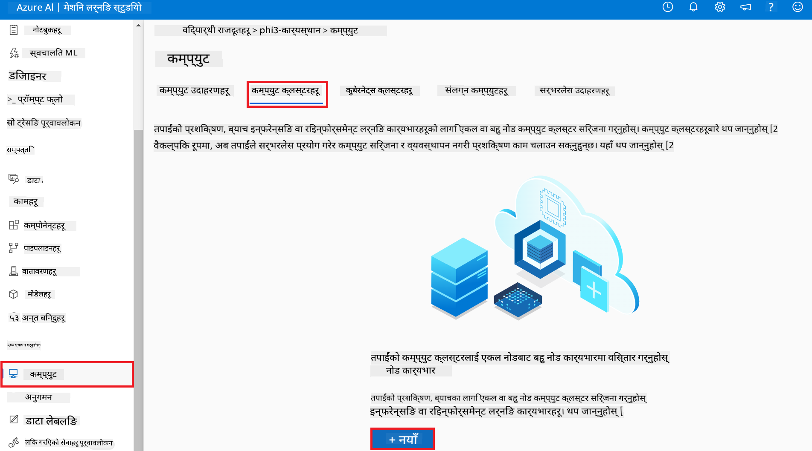

1. तलका कार्यहरू गर्नुहोस्:

    - तपाईंले प्रयोग गर्न चाहनुभएको **Region** चयन गर्नुहोस्।
    - **Virtual machine tier** लाई **Dedicated** मा सेट गर्नुहोस्।
    - **Virtual machine type** लाई **GPU** मा सेट गर्नुहोस्।
    - **Virtual machine size** फिल्टरलाई **Select from all options** मा सेट गर्नुहोस्।
    - **Virtual machine size** लाई **Standard_NC24ads_A100_v4** चयन गर्नुहोस्।

    

1. **Next** चयन गर्नुहोस्।

1. तलका कार्यहरू गर्नुहोस्:

    - **Compute name** प्रविष्ट गर्नुहोस्। यो अनौठो हुनुपर्छ।
    - **Minimum number of nodes** लाई **0** मा सेट गर्नुहोस्।
    - **Maximum number of nodes** लाई **1** मा सेट गर्नुहोस्।
    - **Idle seconds before scale down** लाई **120** मा सेट गर्नुहोस्।

    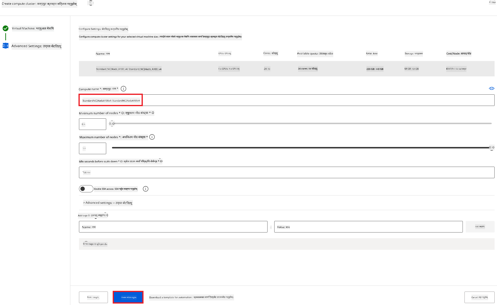

1. **Create** चयन गर्नुहोस्।

#### Phi-3 मोडेल फाइन-ट्युन गर्नुहोस्

1. [Azure ML Studio](https://ml.azure.com/home?wt.mc_id=studentamb_279723) मा जानुहोस्।

1. तपाईंले सिर्जना गरेको Azure Machine Learning workspace चयन गर्नुहोस्।

    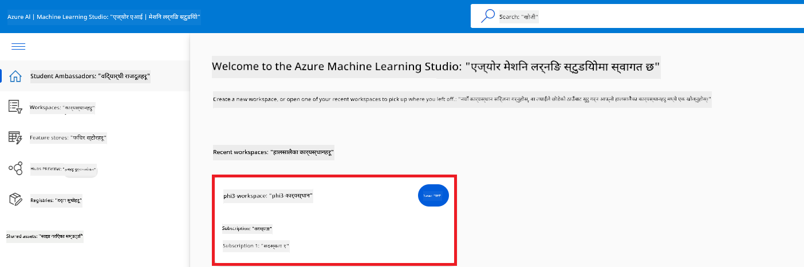

1. तलका कार्यहरू गर्नुहोस्:

    - बायाँपट्टि ट्याबबाट **Model catalog** चयन गर्नुहोस्।
    - **search bar** मा *phi-3-mini-4k* टाइप गर्नुहोस् र देखिएका विकल्पहरूबाट **Phi-3-mini-4k-instruct** चयन गर्नुहोस्।

    

1. नेभिगेसन मेनुबाट **Fine-tune** चयन गर्नुहोस्।

    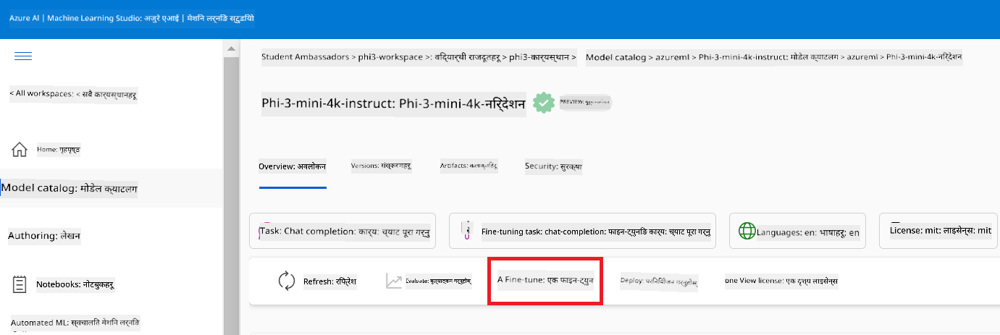

1. तलका कार्यहरू गर्नुहोस्:

    - **Select task type** लाई **Chat completion** मा सेट गर्नुहोस्।
    - **+ Select data** मा क्लिक गरेर **Training data** अपलोड गर्नुहोस्।
    - Validation data अपलोड प्रकारलाई **Provide different validation data** मा सेट गर्नुहोस्।
    - **+ Select data** मा क्लिक गरेर **Validation data** अपलोड गर्नुहोस्।

    

    > [!TIP]
    >
    > तपाईंले **Advanced settings** चयन गरेर **learning_rate** र **lr_scheduler_type** जस्ता कन्फिगरेसनहरू अनुकूलन गर्न सक्नुहुन्छ, जसले फाइन-ट्युनिङ प्रक्रियालाई तपाईंको आवश्यकताअनुसार सुधार गर्न मद्दत गर्छ।

1. **Finish** चयन गर्नुहोस्।

1. यस अभ्यासमा, तपाईंले Azure Machine Learning प्रयोग गरी सफलतापूर्वक Phi-3 मोडेल फाइन-ट्युन गर्नुभयो। कृपया ध्यान दिनुहोस् कि फाइन-ट्युनिङ प्रक्रिया केही समय लाग्न सक्छ। फाइन-ट्युनिङ जॉब चलाएपछि, यसको पूरा हुन कुर्नुहोस्। तपाईंले Azure Machine Learning Workspace को बायाँपट्टि रहेको Jobs ट्याबमा गएर फाइन-ट्युनिङ जॉबको स्थिति अनुगमन गर्न सक्नुहुन्छ। अर्को श्रृंखलामा, तपाईंले फाइन-ट्युन गरिएको मोडेल डिप्लोय गरी Prompt flow सँग एकीकृत गर्नुहुनेछ।

    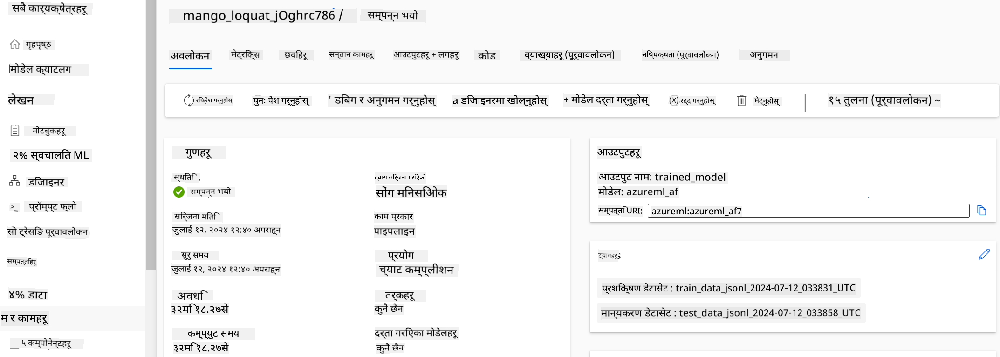

### फाइन-ट्युन गरिएको Phi-3 मोडेल डिप्लोय गर्नुहोस्

फाइन-ट्युन गरिएको Phi-3 मोडेललाई Prompt flow सँग एकीकृत गर्न, तपाईंले मोडेललाई रियल-टाइम इन्फरेन्सका लागि पहुँचयोग्य बनाउन डिप्लोय गर्न आवश्यक छ। यस प्रक्रियामा मोडेल दर्ता गर्ने, अनलाइन एन्डपोइन्ट सिर्जना गर्ने, र मोडेल डिप्लोय गर्ने समावेश छ।

यस अभ्यासमा, तपाईंले:

- Azure Machine Learning workspace मा फाइन-ट्युन गरिएको मोडेल दर्ता गर्ने।
- अनलाइन एन्डपोइन्ट सिर्जना गर्ने।
- दर्ता गरिएको फाइन-ट्युन गरिएको Phi-3 मोडेल डिप्लोय गर्ने।

#### फाइन-ट्युन गरिएको मोडेल दर्ता गर्नुहोस्

1. [Azure ML Studio](https://ml.azure.com/home?wt.mc_id=studentamb_279723) मा जानुहोस्।

1. तपाईंले सिर्जना गरेको Azure Machine Learning workspace चयन गर्नुहोस्।

    

1. बायाँपट्टि ट्याबबाट **Models** चयन गर्नुहोस्।

1. **+ Register** चयन गर्नुहोस्।

1. **From a job output** चयन गर्नुहोस्।

    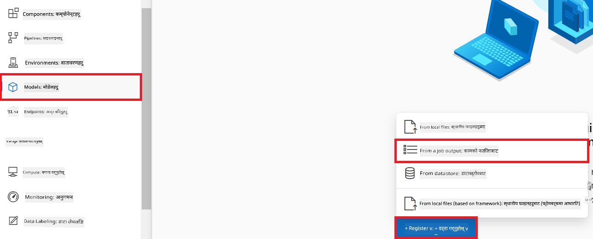

1. तपाईंले सिर्जना गरेको जॉब चयन गर्नुहोस्।

    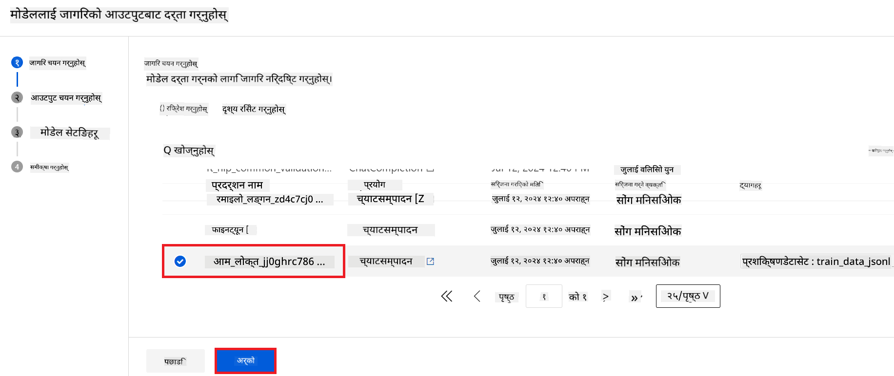

1. **Next** चयन गर्नुहोस्।

1. **Model type** लाई **MLflow** मा सेट गर्नुहोस्।

1. **Job output** चयन गरिएको छ कि छैन सुनिश्चित गर्नुहोस्; यो स्वचालित रूपमा चयन हुन्छ।

    

2. **Next** चयन गर्नुहोस्।

3. **Register** चयन गर्नुहोस्।

    

4. तपाईंले दर्ता गरेको मोडेल बायाँपट्टि ट्याबको **Models** मेनुमा गएर हेर्न सक्नुहुन्छ।

    

#### फाइन-ट्युन गरिएको मोडेल डिप्लोय गर्नुहोस्

1. तपाईंले सिर्जना गरेको Azure Machine Learning workspace मा जानुहोस्।

1. बायाँपट्टि ट्याबबाट **Endpoints** चयन गर्नुहोस्।

1. नेभिगेसन मेनुबाट **Real-time endpoints** चयन गर्नुहोस्।

    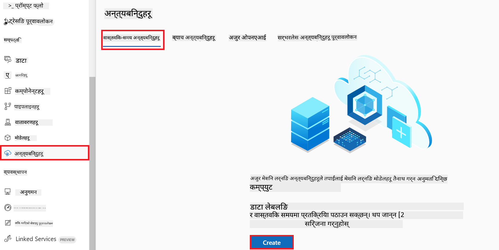

1. **Create** चयन गर्नुहोस्।

1. तपाईंले दर्ता गरेको मोडेल चयन गर्नुहोस्।

    

1. **Select** चयन गर्नुहोस्।

1. तलका कार्यहरू गर्नुहोस्:

    - **Virtual machine** लाई *Standard_NC6s_v3* मा सेट गर्नुहोस्।
    - तपाईंले प्रयोग गर्न चाहनुभएको **Instance count** चयन गर्नुहोस्। उदाहरणका लागि, *1*।
    - **Endpoint** लाई नयाँ बनाउन **New** चयन गर्नुहोस्।
    - **Endpoint name** प्रविष्ट गर्नुहोस्। यो अनौठो हुनुपर्छ।
    - **Deployment name** प्रविष्ट गर्नुहोस्। यो अनौठो हुनुपर्छ।

    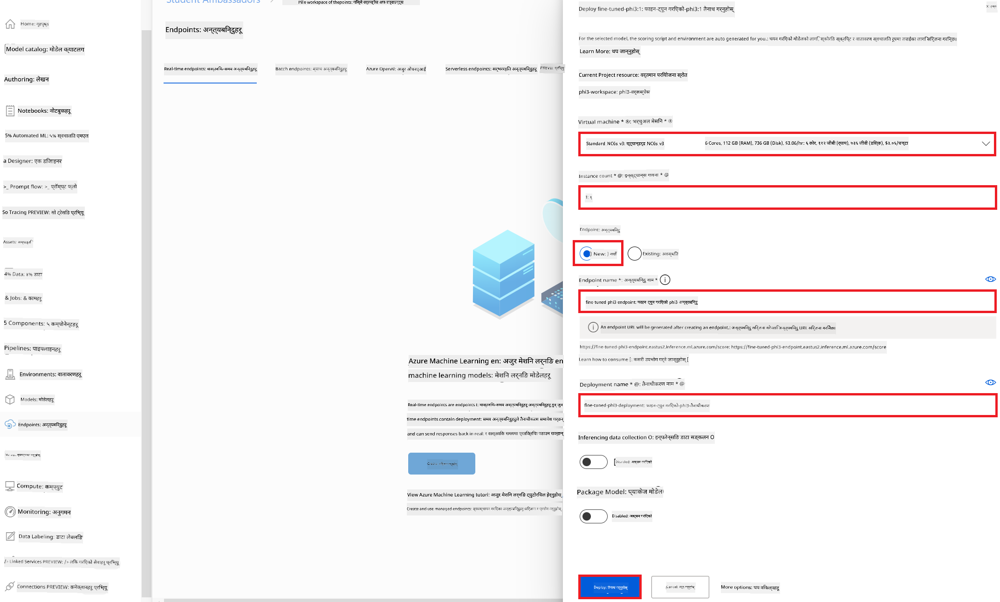

1. **Deploy** चयन गर्नुहोस्।

> [!WARNING]
> तपाईंको खातामा अतिरिक्त शुल्क लाग्न नदिन, Azure Machine Learning workspace मा सिर्जना गरिएको एन्डपोइन्ट मेटाउन नबिर्सनुहोस्।
>

#### Azure Machine Learning Workspace मा डिप्लोयमेन्ट स्थिति जाँच गर्नुहोस्

1. तपाईंले सिर्जना गरेको Azure Machine Learning workspace मा जानुहोस्।

1. बायाँपट्टि ट्याबबाट **Endpoints** चयन गर्नुहोस्।

1. तपाईंले सिर्जना गरेको एन्डपोइन्ट चयन गर्नुहोस्।

    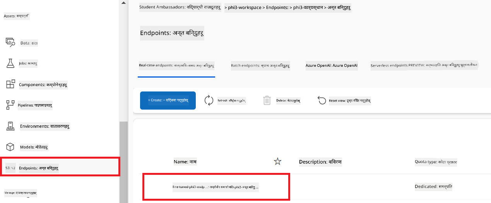

1. यस पृष्ठमा, तपाईंले डिप्लोयमेन्ट प्रक्रियाको क्रममा एन्डपोइन्टहरू व्यवस्थापन गर्न सक्नुहुन्छ।

> [!NOTE]
> डिप्लोयमेन्ट पूरा भएपछि, सुनिश्चित गर्नुहोस् कि **Live traffic** लाई **100%** मा सेट गरिएको छ। यदि छैन भने, **Update traffic** चयन गरेर ट्राफिक सेटिङ समायोजन गर्नुहोस्। ट्राफिक 0% मा सेट भएमा मोडेल परीक्षण गर्न सकिँदैन।
>
> 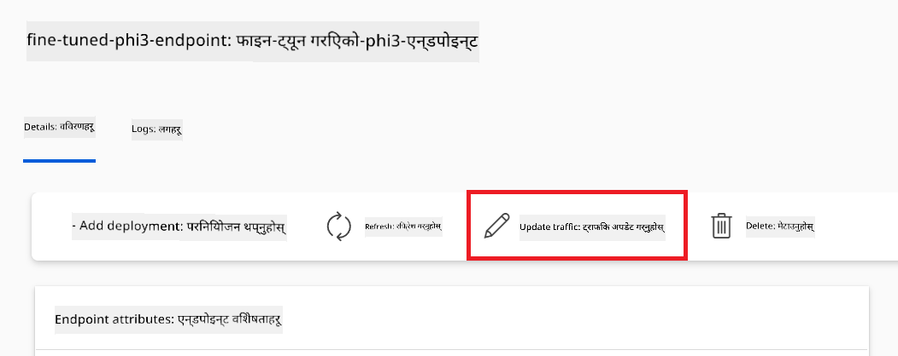
>

## परिदृश्य ३: Prompt flow सँग एकीकृत गर्नुहोस् र Azure AI Foundry मा आफ्नो कस्टम मोडेलसँग कुराकानी गर्नुहोस्

### कस्टम Phi-3 मोडेललाई Prompt flow सँग एकीकृत गर्नुहोस्

तपाईंले सफलतापूर्वक फाइन-ट्युन गरेको मोडेल डिप्लोय गरेपछि, अब यसलाई Prompt Flow सँग एकीकृत गरेर आफ्नो मोडेललाई रियल-टाइम एप्लिकेसनहरूमा प्रयोग गर्न सक्नुहुन्छ, जसले तपाईंको कस्टम Phi-3 मोडेलसँग विभिन्न अन्तरक्रियात्मक कार्यहरू गर्न सक्षम बनाउँछ।

यस अभ्यासमा, तपाईंले:

- Azure AI Foundry Hub सिर्जना गर्ने।
- Azure AI Foundry Project सिर्जना गर्ने।
- Prompt flow सिर्जना गर्ने।
- फाइन-ट्युन गरिएको Phi-3 मोडेलका लागि कस्टम कनेक्शन थप्ने।
- Prompt flow सेटअप गरेर आफ्नो कस्टम Phi-3 मोडेलसँग कुराकानी गर्ने।
> [!NOTE]
> तपाईं Azure ML Studio सँग Promptflow पनि एकीकृत गर्न सक्नुहुन्छ। Azure ML Studio मा पनि उही एकीकरण प्रक्रिया लागू गर्न सकिन्छ।
#### Azure AI Foundry Hub सिर्जना गर्नुहोस्

प्रोजेक्ट सिर्जना गर्नु अघि तपाईंले एउटा Hub सिर्जना गर्नुपर्छ। Hub ले Resource Group जस्तै काम गर्छ, जसले तपाईंलाई Azure AI Foundry भित्र धेरै प्रोजेक्टहरू व्यवस्थित र व्यवस्थापन गर्न मद्दत गर्छ।

1. [Azure AI Foundry](https://ai.azure.com/?WT.mc_id=aiml-137032-kinfeylo) मा जानुहोस्।

1. बाँया पट्टि रहेको ट्याबबाट **All hubs** चयन गर्नुहोस्।

1. नेभिगेसन मेनुबाट **+ New hub** चयन गर्नुहोस्।

    

1. तलका कार्यहरू गर्नुहोस्:

    - **Hub name** प्रविष्ट गर्नुहोस्। यो अनौठो हुनुपर्छ।
    - आफ्नो Azure **Subscription** चयन गर्नुहोस्।
    - प्रयोग गर्न चाहेको **Resource group** चयन गर्नुहोस् (आवश्यक परे नयाँ बनाउनुहोस्)।
    - प्रयोग गर्न चाहेको **Location** चयन गर्नुहोस्।
    - प्रयोग गर्न चाहेको **Connect Azure AI Services** चयन गर्नुहोस् (आवश्यक परे नयाँ बनाउनुहोस्)।
    - **Connect Azure AI Search** मा **Skip connecting** चयन गर्नुहोस्।

    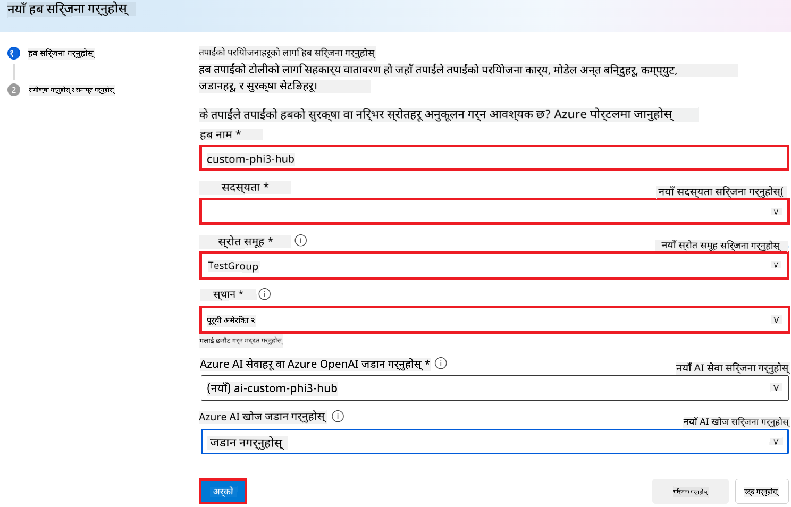

1. **Next** चयन गर्नुहोस्।

#### Azure AI Foundry Project सिर्जना गर्नुहोस्

1. तपाईंले सिर्जना गरेको Hub भित्र, बाँया पट्टि रहेको ट्याबबाट **All projects** चयन गर्नुहोस्।

1. नेभिगेसन मेनुबाट **+ New project** चयन गर्नुहोस्।

    

1. **Project name** प्रविष्ट गर्नुहोस्। यो अनौठो हुनुपर्छ।

    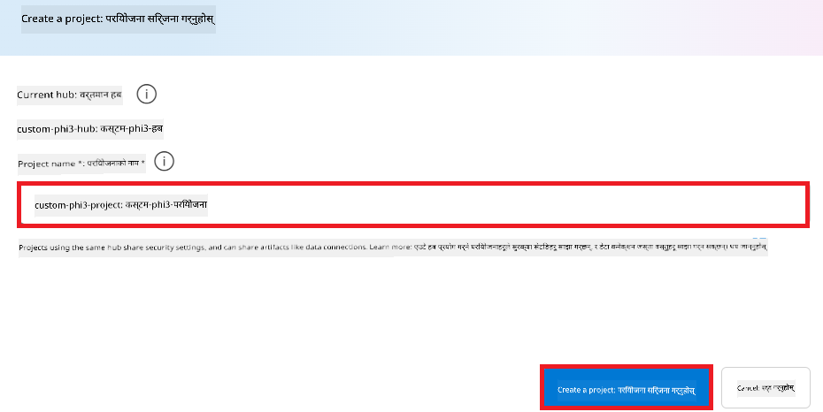

1. **Create a project** चयन गर्नुहोस्।

#### fine-tuned Phi-3 मोडेलको लागि कस्टम कनेक्शन थप्नुहोस्

तपाईंको कस्टम Phi-3 मोडेललाई Prompt flow सँग एकीकृत गर्न, मोडेलको endpoint र key कस्टम कनेक्शनमा सुरक्षित गर्न आवश्यक छ। यसले Prompt flow भित्र तपाईंको कस्टम Phi-3 मोडेल पहुँच सुनिश्चित गर्छ।

#### fine-tuned Phi-3 मोडेलको api key र endpoint uri सेट गर्नुहोस्

1. [Azure ML Studio](https://ml.azure.com/home?WT.mc_id=aiml-137032-kinfeylo) मा जानुहोस्।

1. तपाईंले सिर्जना गरेको Azure Machine learning workspace मा जानुहोस्।

1. बाँया पट्टि रहेको ट्याबबाट **Endpoints** चयन गर्नुहोस्।

    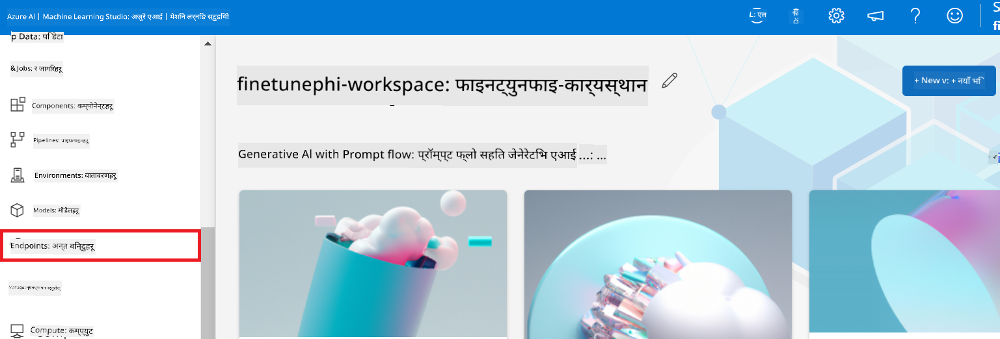

1. तपाईंले सिर्जना गरेको endpoint चयन गर्नुहोस्।

    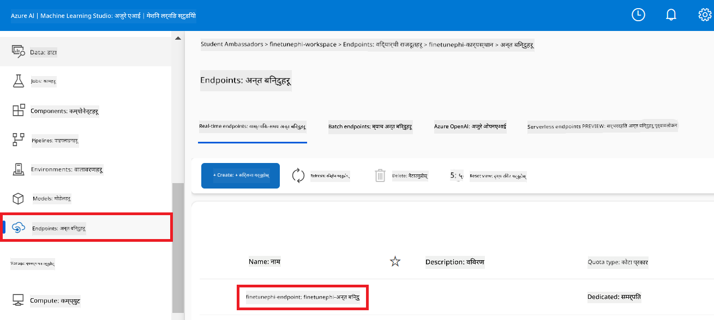

1. नेभिगेसन मेनुबाट **Consume** चयन गर्नुहोस्।

1. आफ्नो **REST endpoint** र **Primary key** कपी गर्नुहोस्।

    

#### कस्टम कनेक्शन थप्नुहोस्

1. [Azure AI Foundry](https://ai.azure.com/?WT.mc_id=aiml-137032-kinfeylo) मा जानुहोस्।

1. तपाईंले सिर्जना गरेको Azure AI Foundry प्रोजेक्टमा जानुहोस्।

1. तपाईंले सिर्जना गरेको प्रोजेक्ट भित्र, बाँया पट्टि रहेको ट्याबबाट **Settings** चयन गर्नुहोस्।

1. **+ New connection** चयन गर्नुहोस्।

    

1. नेभिगेसन मेनुबाट **Custom keys** चयन गर्नुहोस्।

    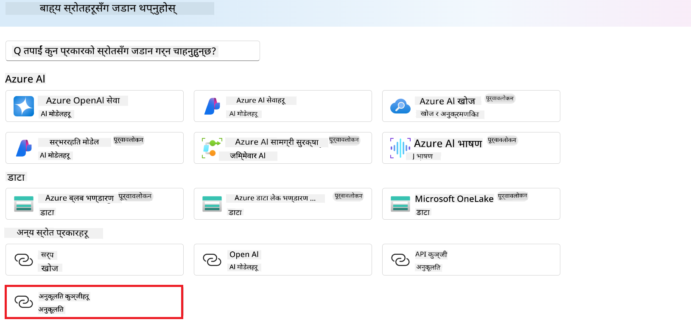

1. तलका कार्यहरू गर्नुहोस्:

    - **+ Add key value pairs** चयन गर्नुहोस्।
    - key नामको लागि **endpoint** लेख्नुहोस् र Azure ML Studio बाट कपी गरेको endpoint मानमा टाँस्नुहोस्।
    - फेरि **+ Add key value pairs** चयन गर्नुहोस्।
    - key नामको लागि **key** लेख्नुहोस् र Azure ML Studio बाट कपी गरेको key मानमा टाँस्नुहोस्।
    - key हरू थपिसकेपछि, key लाई सार्वजनिक हुनबाट रोक्न **is secret** चयन गर्नुहोस्।

    

1. **Add connection** चयन गर्नुहोस्।

#### Prompt flow सिर्जना गर्नुहोस्

तपाईंले Azure AI Foundry मा कस्टम कनेक्शन थप्नुभयो। अब, तलका चरणहरू प्रयोग गरेर Prompt flow सिर्जना गरौं। त्यसपछि, तपाईंले यो Prompt flow लाई कस्टम कनेक्शनसँग जोड्नुहुनेछ ताकि fine-tuned मोडेल Prompt flow भित्र प्रयोग गर्न सकियोस्।

1. तपाईंले सिर्जना गरेको Azure AI Foundry प्रोजेक्टमा जानुहोस्।

1. बाँया पट्टि रहेको ट्याबबाट **Prompt flow** चयन गर्नुहोस्।

1. नेभिगेसन मेनुबाट **+ Create** चयन गर्नुहोस्।

    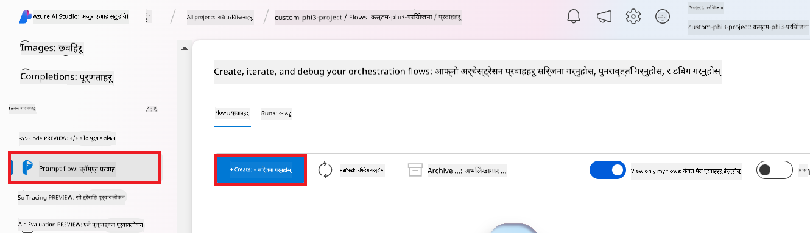

1. नेभिगेसन मेनुबाट **Chat flow** चयन गर्नुहोस्।

    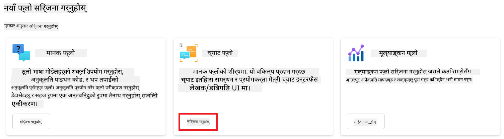

1. प्रयोग गर्न चाहेको **Folder name** प्रविष्ट गर्नुहोस्।

    

2. **Create** चयन गर्नुहोस्।

#### तपाईंको कस्टम Phi-3 मोडेलसँग कुराकानी गर्न Prompt flow सेटअप गर्नुहोस्

तपाईंले fine-tuned Phi-3 मोडेललाई Prompt flow मा एकीकृत गर्न आवश्यक छ। तर, उपलब्ध Prompt flow यस उद्देश्यका लागि डिजाइन गरिएको छैन। त्यसैले, तपाईंले Prompt flow पुनः डिजाइन गर्नुपर्नेछ ताकि कस्टम मोडेल एकीकृत गर्न सकियोस्।

1. Prompt flow भित्र, पुरानो फ्लो पुनर्निर्माण गर्न तलका कार्यहरू गर्नुहोस्:

    - **Raw file mode** चयन गर्नुहोस्।
    - *flow.dag.yml* फाइलमा भएका सबै कोड मेटाउनुहोस्।
    - *flow.dag.yml* फाइलमा तलको कोड थप्नुहोस्।

        ```yml
        inputs:
          input_data:
            type: string
            default: "Who founded Microsoft?"

        outputs:
          answer:
            type: string
            reference: ${integrate_with_promptflow.output}

        nodes:
        - name: integrate_with_promptflow
          type: python
          source:
            type: code
            path: integrate_with_promptflow.py
          inputs:
            input_data: ${inputs.input_data}
        ```

    - **Save** चयन गर्नुहोस्।

    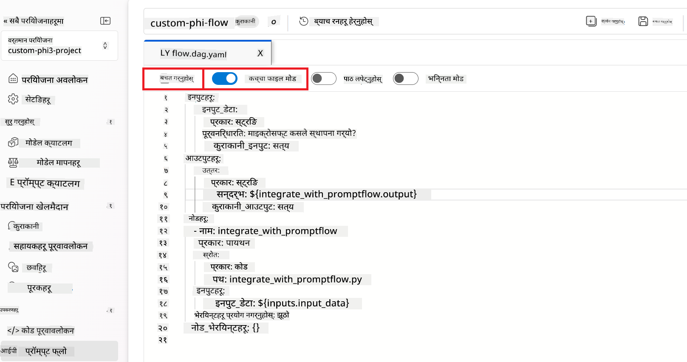

1. Prompt flow मा कस्टम Phi-3 मोडेल प्रयोग गर्न *integrate_with_promptflow.py* फाइलमा तलको कोड थप्नुहोस्।

    ```python
    import logging
    import requests
    from promptflow import tool
    from promptflow.connections import CustomConnection

    # Logging setup
    logging.basicConfig(
        format="%(asctime)s - %(levelname)s - %(name)s - %(message)s",
        datefmt="%Y-%m-%d %H:%M:%S",
        level=logging.DEBUG
    )
    logger = logging.getLogger(__name__)

    def query_phi3_model(input_data: str, connection: CustomConnection) -> str:
        """
        Send a request to the Phi-3 model endpoint with the given input data using Custom Connection.
        """

        # "connection" is the name of the Custom Connection, "endpoint", "key" are the keys in the Custom Connection
        endpoint_url = connection.endpoint
        api_key = connection.key

        headers = {
            "Content-Type": "application/json",
            "Authorization": f"Bearer {api_key}"
        }
        data = {
            "input_data": {
                "input_string": [
                    {"role": "user", "content": input_data}
                ],
                "parameters": {
                    "temperature": 0.7,
                    "max_new_tokens": 128
                }
            }
        }
        try:
            response = requests.post(endpoint_url, json=data, headers=headers)
            response.raise_for_status()
            
            # Log the full JSON response
            logger.debug(f"Full JSON response: {response.json()}")

            result = response.json()["output"]
            logger.info("Successfully received response from Azure ML Endpoint.")
            return result
        except requests.exceptions.RequestException as e:
            logger.error(f"Error querying Azure ML Endpoint: {e}")
            raise

    @tool
    def my_python_tool(input_data: str, connection: CustomConnection) -> str:
        """
        Tool function to process input data and query the Phi-3 model.
        """
        return query_phi3_model(input_data, connection)

    ```

    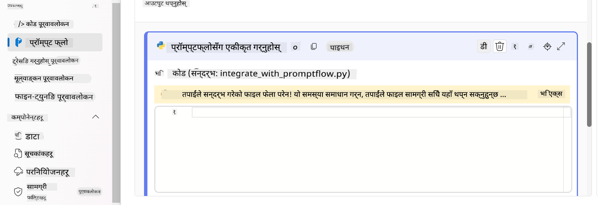

> [!NOTE]
> Azure AI Foundry मा Prompt flow प्रयोग गर्ने थप विस्तृत जानकारीका लागि, तपाईं [Prompt flow in Azure AI Foundry](https://learn.microsoft.com/azure/ai-studio/how-to/prompt-flow) हेर्न सक्नुहुन्छ।

1. **Chat input**, **Chat output** चयन गरेर तपाईंको मोडेलसँग कुराकानी सक्षम गर्नुहोस्।

    

1. अब तपाईं आफ्नो कस्टम Phi-3 मोडेलसँग कुराकानी गर्न तयार हुनुहुन्छ। अर्को अभ्यासमा, तपाईंले कसरी Prompt flow सुरु गर्ने र यसलाई प्रयोग गरेर fine-tuned Phi-3 मोडेलसँग कुराकानी गर्ने सिक्नुहुनेछ।

> [!NOTE]
>
> पुनर्निर्मित फ्लो तलको चित्र जस्तो देखिनु पर्छ:
>
> 
>

### तपाईंको कस्टम Phi-3 मोडेलसँग कुराकानी गर्नुहोस्

अब तपाईंले आफ्नो कस्टम Phi-3 मोडेललाई fine-tune गरी Prompt flow सँग एकीकृत गर्नुभयो, तपाईं यससँग कुराकानी सुरु गर्न तयार हुनुहुन्छ। यो अभ्यासले तपाईंलाई Prompt flow प्रयोग गरेर मोडेलसँग कुराकानी सुरु गर्ने प्रक्रिया सिकाउनेछ। यी चरणहरू पालना गरेर, तपाईं आफ्नो fine-tuned Phi-3 मोडेलका विभिन्न कार्य र संवादहरूमा पूर्ण रूपमा उपयोग गर्न सक्नुहुनेछ।

- Prompt flow प्रयोग गरेर तपाईंको कस्टम Phi-3 मोडेलसँग कुराकानी गर्नुहोस्।

#### Prompt flow सुरु गर्नुहोस्

1. Prompt flow सुरु गर्न **Start compute sessions** चयन गर्नुहोस्।

    

1. प्यारामिटरहरू नवीकरण गर्न **Validate and parse input** चयन गर्नुहोस्।

    

1. तपाईंले सिर्जना गरेको कस्टम कनेक्शनको **connection** को **Value** चयन गर्नुहोस्। उदाहरणका लागि, *connection*।

    

#### तपाईंको कस्टम मोडेलसँग कुराकानी गर्नुहोस्

1. **Chat** चयन गर्नुहोस्।

    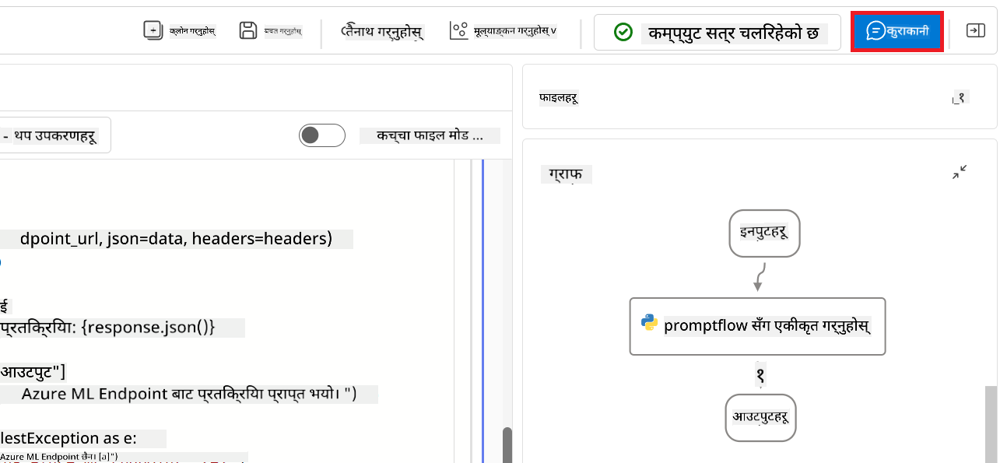

1. यहाँ परिणामको उदाहरण छ: अब तपाईं आफ्नो कस्टम Phi-3 मोडेलसँग कुराकानी गर्न सक्नुहुन्छ। fine-tuning मा प्रयोग गरिएको डाटामा आधारित प्रश्न सोध्न सिफारिस गरिन्छ।

    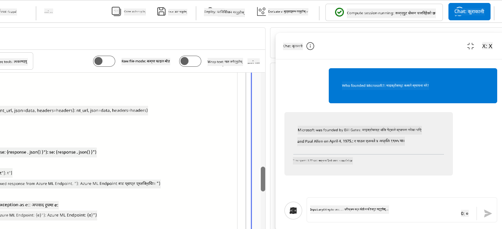

**अस्वीकरण**:  
यो दस्तावेज AI अनुवाद सेवा [Co-op Translator](https://github.com/Azure/co-op-translator) प्रयोग गरी अनुवाद गरिएको हो। हामी शुद्धताका लागि प्रयासरत छौं, तर कृपया ध्यान दिनुहोस् कि स्वचालित अनुवादमा त्रुटि वा अशुद्धता हुन सक्छ। मूल दस्तावेज यसको मूल भाषामा नै अधिकारिक स्रोत मानिनु पर्छ। महत्वपूर्ण जानकारीका लागि व्यावसायिक मानव अनुवाद सिफारिस गरिन्छ। यस अनुवादको प्रयोगबाट उत्पन्न कुनै पनि गलतफहमी वा गलत व्याख्याका लागि हामी जिम्मेवार छैनौं।