<!--
CO_OP_TRANSLATOR_METADATA:
{
  "original_hash": "ecbd9179a21edbaafaf114d47f09f3e3",
  "translation_date": "2025-05-09T17:57:22+00:00",
  "source_file": "md/02.Application/01.TextAndChat/Phi3/E2E_Phi-3-FineTuning_PromptFlow_Integration_AIFoundry.md",
  "language_code": "ne"
}
-->
# Fine-tune र Azure AI Foundry मा Prompt flow सँग custom Phi-3 मोडेलहरू एकीकृत गर्नुहोस्

यो end-to-end (E2E) नमूना Microsoft Tech Community को "[Fine-Tune and Integrate Custom Phi-3 Models with Prompt Flow in Azure AI Foundry](https://techcommunity.microsoft.com/t5/educator-developer-blog/fine-tune-and-integrate-custom-phi-3-models-with-prompt-flow-in/ba-p/4191726?WT.mc_id=aiml-137032-kinfeylo)" मार्गदर्शनमा आधारित छ। यसले Azure AI Foundry मा custom Phi-3 मोडेलहरूलाई fine-tune, deploy, र Prompt flow सँग कसरी एकीकृत गर्ने प्रक्रिया प्रस्तुत गर्दछ। स्थानीय रूपमा कोड चलाउने E2E नमूना "[Fine-Tune and Integrate Custom Phi-3 Models with Prompt Flow](./E2E_Phi-3-FineTuning_PromptFlow_Integration.md)" भन्दा फरक, यो ट्युटोरियल Azure AI / ML Studio भित्र मोडेललाई fine-tune र एकीकृत गर्ने कुरामा केन्द्रित छ।

## अवलोकन

यस E2E नमूनामा, तपाईंले Phi-3 मोडेललाई fine-tune गर्ने र Azure AI Foundry मा Prompt flow सँग एकीकृत गर्ने तरिका सिक्नुहुनेछ। Azure AI / ML Studio को मद्दतले, तपाईंले custom AI मोडेलहरू deploy र प्रयोग गर्ने workflow स्थापना गर्नुहुनेछ। यो E2E नमूना तीन परिदृश्यहरूमा विभाजित गरिएको छ:

**परिदृश्य 1: Azure स्रोतहरू सेटअप गर्नुहोस् र fine-tuning को तयारी गर्नुहोस्**

**परिदृश्य 2: Phi-3 मोडेल fine-tune गर्नुहोस् र Azure Machine Learning Studio मा deploy गर्नुहोस्**

**परिदृश्य 3: Prompt flow सँग एकीकृत गर्नुहोस् र Azure AI Foundry मा तपाईंको custom मोडेलसँग कुरा गर्नुहोस्**

यहाँ यस E2E नमूनाको अवलोकन छ।

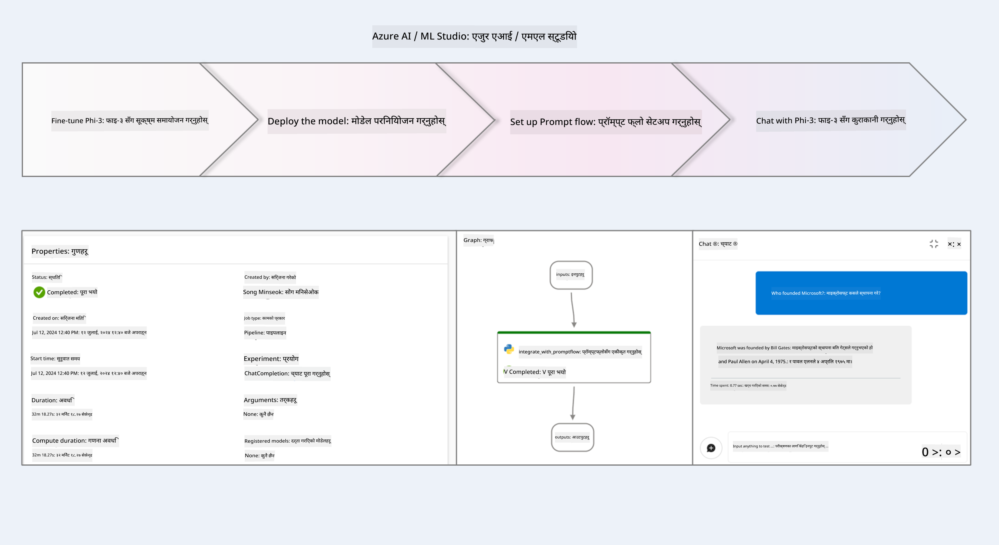

### सामग्री सूची

1. **[परिदृश्य 1: Azure स्रोतहरू सेटअप गर्नुहोस् र fine-tuning को तयारी गर्नुहोस्](../../../../../../md/02.Application/01.TextAndChat/Phi3)**
    - [Azure Machine Learning Workspace सिर्जना गर्नुहोस्](../../../../../../md/02.Application/01.TextAndChat/Phi3)
    - [Azure Subscription मा GPU कोटा अनुरोध गर्नुहोस्](../../../../../../md/02.Application/01.TextAndChat/Phi3)
    - [Role assignment थप्नुहोस्](../../../../../../md/02.Application/01.TextAndChat/Phi3)
    - [प्रोजेक्ट सेटअप गर्नुहोस्](../../../../../../md/02.Application/01.TextAndChat/Phi3)
    - [Fine-tuning को लागि dataset तयार गर्नुहोस्](../../../../../../md/02.Application/01.TextAndChat/Phi3)

1. **[परिदृश्य 2: Phi-3 मोडेल fine-tune गर्नुहोस् र Azure Machine Learning Studio मा deploy गर्नुहोस्](../../../../../../md/02.Application/01.TextAndChat/Phi3)**
    - [Phi-3 मोडेल fine-tune गर्नुहोस्](../../../../../../md/02.Application/01.TextAndChat/Phi3)
    - [Fine-tuned Phi-3 मोडेल deploy गर्नुहोस्](../../../../../../md/02.Application/01.TextAndChat/Phi3)

1. **[परिदृश्य 3: Prompt flow सँग एकीकृत गर्नुहोस् र Azure AI Foundry मा तपाईंको custom मोडेलसँग कुरा गर्नुहोस्](../../../../../../md/02.Application/01.TextAndChat/Phi3)**
    - [Custom Phi-3 मोडेल Prompt flow सँग एकीकृत गर्नुहोस्](../../../../../../md/02.Application/01.TextAndChat/Phi3)
    - [तपाईंको custom Phi-3 मोडेलसँग कुरा गर्नुहोस्](../../../../../../md/02.Application/01.TextAndChat/Phi3)

## परिदृश्य 1: Azure स्रोतहरू सेटअप गर्नुहोस् र fine-tuning को तयारी गर्नुहोस्

### Azure Machine Learning Workspace सिर्जना गर्नुहोस्

1. पोर्टल पृष्ठको माथि रहेको **search bar** मा *azure machine learning* टाइप गर्नुहोस् र देखिएको विकल्पहरूबाट **Azure Machine Learning** चयन गर्नुहोस्।

    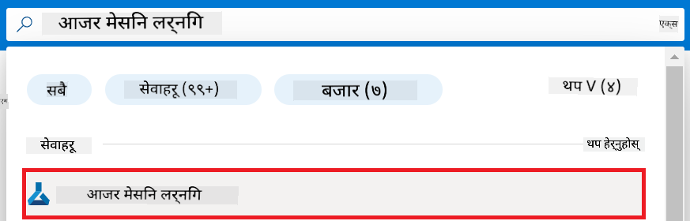

2. नेभिगेशन मेनुबाट **+ Create** चयन गर्नुहोस्।

3. नेभिगेशन मेनुबाट **New workspace** चयन गर्नुहोस्।

    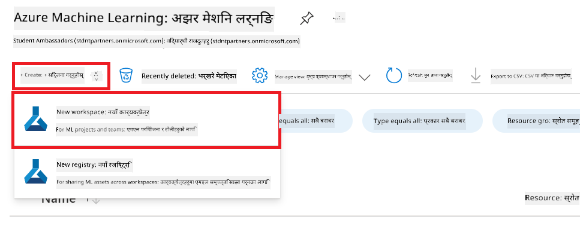

4. तलका कार्यहरू गर्नुहोस्:

    - आफ्नो Azure **Subscription** चयन गर्नुहोस्।
    - प्रयोग गर्न चाहेको **Resource group** चयन गर्नुहोस् (आवश्यक परे नयाँ बनाउनुहोस्)।
    - **Workspace Name** प्रविष्ट गर्नुहोस्। यो अनौठो हुनुपर्छ।
    - प्रयोग गर्न चाहेको **Region** चयन गर्नुहोस्।
    - प्रयोग गर्न चाहेको **Storage account** चयन गर्नुहोस् (आवश्यक परे नयाँ बनाउनुहोस्)।
    - प्रयोग गर्न चाहेको **Key vault** चयन गर्नुहोस् (आवश्यक परे नयाँ बनाउनुहोस्)।
    - प्रयोग गर्न चाहेको **Application insights** चयन गर्नुहोस् (आवश्यक परे नयाँ बनाउनुहोस्)।
    - प्रयोग गर्न चाहेको **Container registry** चयन गर्नुहोस् (आवश्यक परे नयाँ बनाउनुहोस्)।

    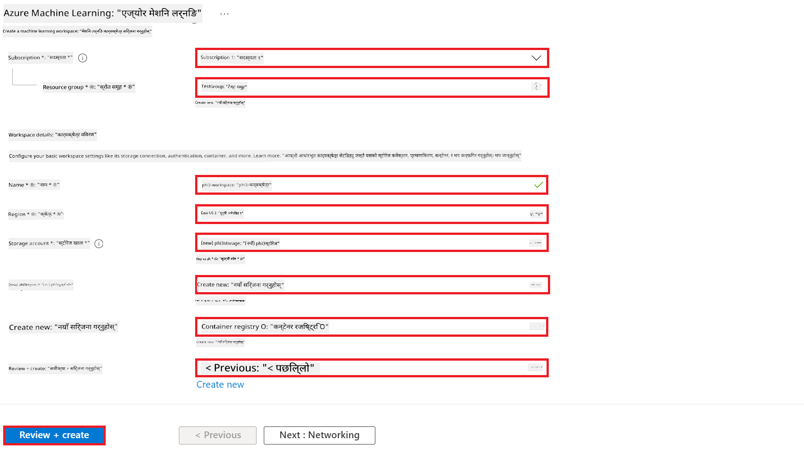

5. **Review + Create** चयन गर्नुहोस्।

6. **Create** चयन गर्नुहोस्।

### Azure Subscription मा GPU कोटा अनुरोध गर्नुहोस्

यस ट्युटोरियलमा, तपाईं Phi-3 मोडेललाई GPUs प्रयोग गरेर fine-tune र deploy गर्न सिक्नुहुनेछ। Fine-tuning को लागि *Standard_NC24ads_A100_v4* GPU प्रयोग हुनेछ, जसका लागि कोटा अनुरोध आवश्यक छ। Deployment को लागि *Standard_NC6s_v3* GPU प्रयोग हुनेछ, जसका लागि पनि कोटा अनुरोध आवश्यक छ।

> [!NOTE]
>
> केवल Pay-As-You-Go सब्स्क्रिप्शनहरू (सामान्य सब्स्क्रिप्शन प्रकार) GPU आवंटनको लागि योग्य छन्; लाभ सब्स्क्रिप्शनहरू हाल समर्थित छैनन्।
>

1. [Azure ML Studio](https://ml.azure.com/home?wt.mc_id=studentamb_279723) मा जानुहोस्।

1. *Standard NCADSA100v4 Family* कोटा अनुरोध गर्न तलका कार्यहरू गर्नुहोस्:

    - बायाँपट्टि ट्याबबाट **Quota** चयन गर्नुहोस्।
    - प्रयोग गर्न चाहेको **Virtual machine family** चयन गर्नुहोस्। उदाहरणका लागि, *Standard NCADSA100v4 Family Cluster Dedicated vCPUs*, जसमा *Standard_NC24ads_A100_v4* GPU समावेश छ।
    - नेभिगेशन मेनुबाट **Request quota** चयन गर्नुहोस्।

        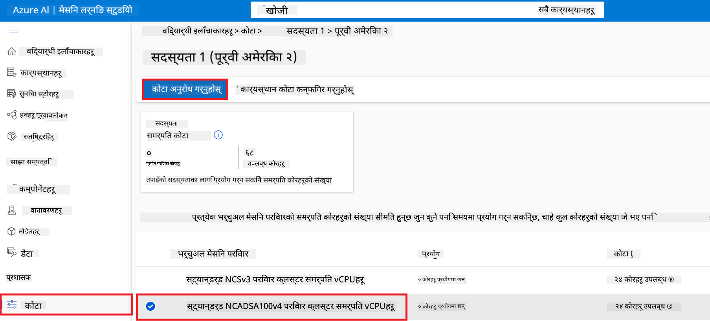

    - Request quota पृष्ठमा, तपाईंले चाहेको **New cores limit** प्रविष्ट गर्नुहोस्। उदाहरणका लागि, 24।
    - Request quota पृष्ठमा, GPU कोटा अनुरोध गर्न **Submit** चयन गर्नुहोस्।

1. *Standard NCSv3 Family* कोटा अनुरोध गर्न तलका कार्यहरू गर्नुहोस्:

    - बायाँपट्टि ट्याबबाट **Quota** चयन गर्नुहोस्।
    - प्रयोग गर्न चाहेको **Virtual machine family** चयन गर्नुहोस्। उदाहरणका लागि, *Standard NCSv3 Family Cluster Dedicated vCPUs*, जसमा *Standard_NC6s_v3* GPU समावेश छ।
    - नेभिगेशन मेनुबाट **Request quota** चयन गर्नुहोस्।
    - Request quota पृष्ठमा, तपाईंले चाहेको **New cores limit** प्रविष्ट गर्नुहोस्। उदाहरणका लागि, 24।
    - Request quota पृष्ठमा, GPU कोटा अनुरोध गर्न **Submit** चयन गर्नुहोस्।

### Role assignment थप्नुहोस्

तपाईंको मोडेलहरू fine-tune र deploy गर्न, पहिले User Assigned Managed Identity (UAI) सिर्जना गर्नुहोस् र यसलाई उपयुक्त अनुमति दिनुहोस्। यो UAI deployment समयमा प्रमाणीकरणका लागि प्रयोग हुनेछ।

#### User Assigned Managed Identity (UAI) सिर्जना गर्नुहोस्

1. पोर्टल पृष्ठको माथि रहेको **search bar** मा *managed identities* टाइप गर्नुहोस् र देखिएको विकल्पहरूबाट **Managed Identities** चयन गर्नुहोस्।

    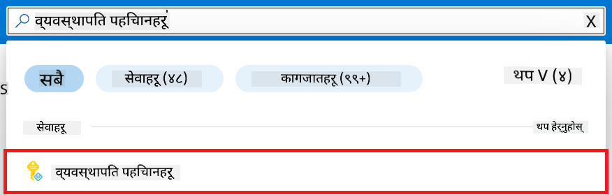

1. **+ Create** चयन गर्नुहोस्।

    

1. तलका कार्यहरू गर्नुहोस्:

    - आफ्नो Azure **Subscription** चयन गर्नुहोस्।
    - प्रयोग गर्न चाहेको **Resource group** चयन गर्नुहोस् (आवश्यक परे नयाँ बनाउनुहोस्)।
    - प्रयोग गर्न चाहेको **Region** चयन गर्नुहोस्।
    - **Name** प्रविष्ट गर्नुहोस्। यो अनौठो हुनुपर्छ।

    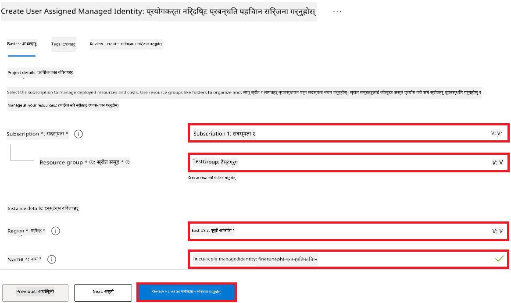

1. **Review + create** चयन गर्नुहोस्।

1. **+ Create** चयन गर्नुहोस्।

#### Managed Identity लाई Contributor role assignment थप्नुहोस्

1. तपाईंले सिर्जना गर्नुभएको Managed Identity स्रोतमा जानुहोस्।

1. बायाँपट्टि ट्याबबाट **Azure role assignments** चयन गर्नुहोस्।

1. नेभिगेशन मेनुबाट **+Add role assignment** चयन गर्नुहोस्।

1. Add role assignment पृष्ठमा, तलका कार्यहरू गर्नुहोस्:
    - **Scope** लाई **Resource group** मा सेट गर्नुहोस्।
    - आफ्नो Azure **Subscription** चयन गर्नुहोस्।
    - प्रयोग गर्न चाहेको **Resource group** चयन गर्नुहोस्।
    - **Role** लाई **Contributor** मा सेट गर्नुहोस्।

    

2. **Save** चयन गर्नुहोस्।

#### Managed Identity लाई Storage Blob Data Reader role assignment थप्नुहोस्

1. पोर्टल पृष्ठको माथि रहेको **search bar** मा *storage accounts* टाइप गर्नुहोस् र देखिएको विकल्पहरूबाट **Storage accounts** चयन गर्नुहोस्।

    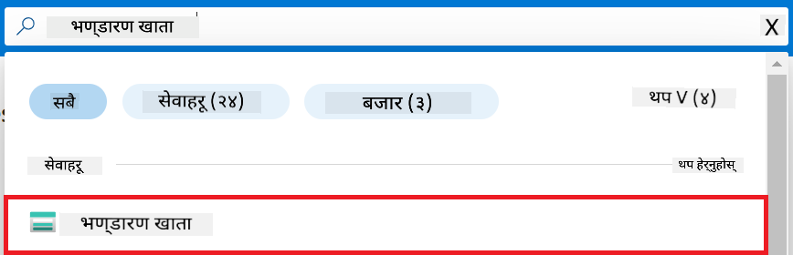

1. Azure Machine Learning workspace सँग सम्बन्धित storage account चयन गर्नुहोस्। उदाहरणका लागि, *finetunephistorage*।

1. Add role assignment पृष्ठमा जान तलका कार्यहरू गर्नुहोस्:

    - सिर्जना गरेको Azure Storage account मा जानुहोस्।
    - बायाँपट्टि ट्याबबाट **Access Control (IAM)** चयन गर्नुहोस्।
    - नेभिगेशन मेनुबाट **+ Add** चयन गर्नुहोस्।
    - नेभिगेशन मेनुबाट **Add role assignment** चयन गर्नुहोस्।

    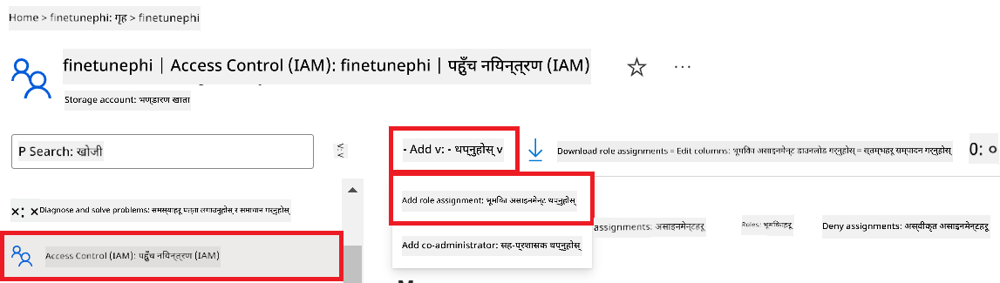

1. Add role assignment पृष्ठमा, तलका कार्यहरू गर्नुहोस्:

    - Role पृष्ठमा, **search bar** मा *Storage Blob Data Reader* टाइप गर्नुहोस् र देखिएको विकल्पबाट **Storage Blob Data Reader** चयन गर्नुहोस्।
    - Role पृष्ठमा, **Next** चयन गर्नुहोस्।
    - Members पृष्ठमा, **Assign access to** मा **Managed identity** चयन गर्नुहोस्।
    - Members पृष्ठमा, **+ Select members** चयन गर्नुहोस्।
    - Select managed identities पृष्ठमा, आफ्नो Azure **Subscription** चयन गर्नुहोस्।
    - Select managed identities पृष्ठमा, **Managed identity** लाई **Manage Identity** मा सेट गर्नुहोस्।
    - Select managed identities पृष्ठमा, तपाईंले सिर्जना गरेको Manage Identity चयन गर्नुहोस्। उदाहरणका लागि, *finetunephi-managedidentity*।
    - Select managed identities पृष्ठमा, **Select** चयन गर्नुहोस्।

    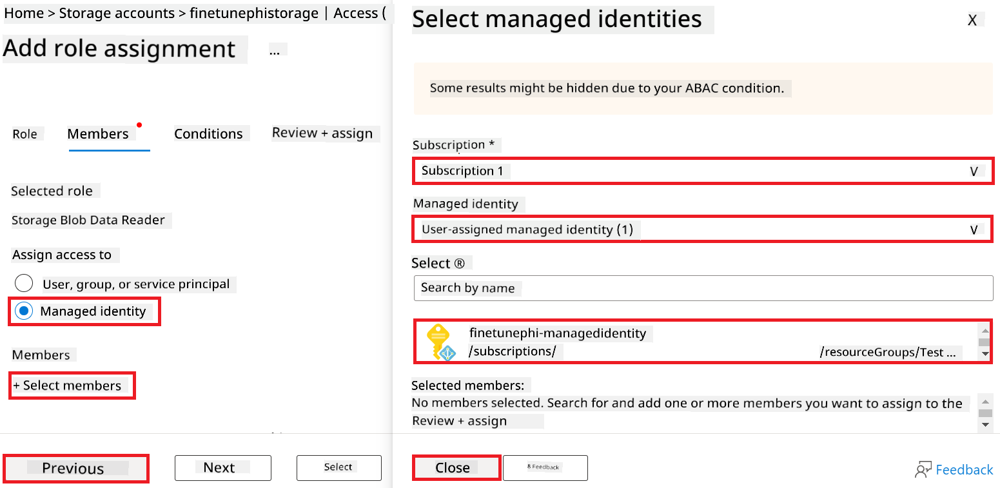

1. **Review + assign** चयन गर्नुहोस्।

#### Managed Identity लाई AcrPull role assignment थप्नुहोस्

1. पोर्टल पृष्ठको माथि रहेको **search bar** मा *container registries* टाइप गर्नुहोस् र देखिएको विकल्पहरूबाट **Container registries** चयन गर्नुहोस्।

    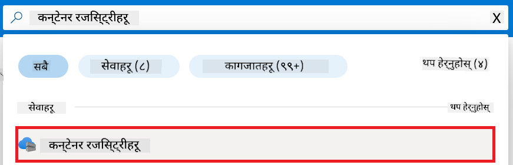

1. Azure Machine Learning workspace सँग सम्बन्धित container registry चयन गर्नुहोस्। उदाहरणका लागि, *finetunephicontainerregistry*

1. Add role assignment पृष्ठमा जान तलका कार्यहरू गर्नुहोस्:

    - बायाँपट्टि ट्याबबाट **Access Control (IAM)** चयन गर्नुहोस्।
    - नेभिगेशन मेनुबाट **+ Add** चयन गर्नुहोस्।
    - नेभिगेशन मेनुबाट **Add role assignment** चयन गर्नुहोस्।

1. Add role assignment पृष्ठमा, तलका कार्यहरू गर्नुहोस्:

    - Role पृष्ठमा, **search bar** मा *AcrPull* टाइप गर्नुहोस् र देखिएको विकल्पबाट **AcrPull** चयन गर्नुहोस्।
    - Role पृष्ठमा, **Next** चयन गर्नुहोस्।
    - Members पृष्ठमा, **Assign access to** मा **Managed identity** चयन गर्नुहोस्।
    - Members पृष्ठमा, **+ Select members** चयन गर्नुहोस्।
    - Select managed identities पृष्ठमा, आफ्नो Azure **Subscription** चयन गर्नुहोस्।
    - Select managed identities पृष्ठमा, **Managed identity** लाई **Manage Identity** मा सेट गर्नुहोस्।
    - Select managed identities पृष्ठमा, तपाईंले सिर्जना गरेको Manage Identity चयन गर्नुहोस्। उदाहरणका लागि, *finetunephi-managedidentity*।
    - Select managed identities पृष्ठमा, **Select** चयन गर्नुहोस्।
    - **Review + assign** चयन गर्नुहोस्।

### प्रोजेक्ट सेटअप गर्नुहोस्

Fine-tuning का लागि आवश्यक dataset डाउनलोड गर्न, तपाईंले स्थानीय वातावरण सेटअप गर्नु पर्नेछ।

यस अभ्यासमा, तपाईंले

- काम गर्नको लागि एउटा फोल्डर सिर्जना गर्नुहुनेछ।
- भर्चुअल वातावरण बनाउनुहुनेछ।
- आवश्यक प्याकेजहरू इन्स्टल गर्नुहुनेछ।
- dataset डाउनलोड गर्न *download_dataset.py* फाइल सिर्जना गर्नुहुनेछ।

#### काम गर्नको लागि फोल्डर सिर्जना गर्नुहोस्

1. टर्मिनल विन्डो खोल्नुहोस् र तलको आदेश टाइप गरेर default path मा *finetune-phi* नामक फोल्डर सिर्जना गर्नुहोस्।

    ```console
    mkdir finetune-phi
    ```

2. टर्मिनलमा तलको आदेश टाइप गरेर सिर्जना गरेको *finetune-phi* फोल्डरमा जानुहोस्।

    ```console
    cd finetune-phi
    ```

#### भर्चुअल वातावरण सिर्जना गर्नुहोस्

1. टर्मिनलमा तलको आदेश टाइप गरेर *.venv* नामक भर्चुअल वातावरण सिर्जना गर्नुहोस्।

    ```console
    python -m venv .venv
    ```

2. टर्मिनलमा तलको आदेश टाइप गरेर भर्चुअल वातावरण सक्रिय गर्नुहोस्।

    ```console
    .venv\Scripts\activate.bat
    ```

> [!NOTE]
> सफल भएमा, कमाण्ड प्रम्प्ट अगाडि *(.venv)* देखिनेछ।

#### आवश्यक प्याकेजहरू इन्स्टल गर्नुहोस्

1. टर्मिनलमा तलको आदेशहरू टाइप गरेर आवश्यक प्याकेजहरू इन्स्टल गर्नुहोस्।

    ```console
    pip install datasets==2.19.1
    ```

#### `download_dataset.py` सिर्जना गर्नुहोस्

> [!NOTE]
> सम्पूर्ण फोल्डर संरचना:
>
> ```text
> └── YourUserName
> .    └── finetune-phi
> .        └── download_dataset.py
> ```

1. **Visual Studio Code** खोल्नुहोस्।

1. मेनु बारबाट **File** चयन गर्नुहोस्।

1. **Open Folder** चयन गर्नुहोस्।

1. तपाईंले सिर्जना गरेको *finetune-phi* फोल्डर चयन गर्नुहोस्, जुन *C:\Users\yourUserName\finetune-phi* मा अवस्थित छ।

    

1. Visual Studio Code को बायाँपट्टि प्यानलमा दायाँ-क्लिक गरेर **New File** चयन गरी *download_dataset.py* नामक नयाँ फाइल सिर्जना गर्नुहोस्।

    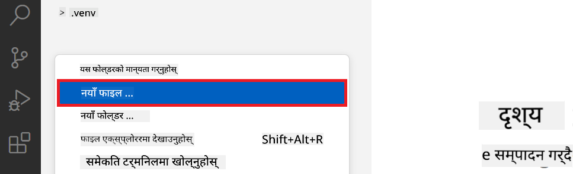

### Fine-tuning को लागि dataset तयार गर्नुहोस्

यस अभ्यासमा, तपाईंले *download_dataset.py* फाइल चलाएर *ultrachat_200k* dataset आफ्नो स्थानीय वातावरणमा डाउनलोड गर्नुहुनेछ। त्यसपछि यो dataset प्रयोग गरेर Azure Machine Learning मा Phi-3 मोडेल fine-tune गर्नुहुनेछ।

यस अभ्यासमा, तपाईंले:

- *download_dataset.py* फाइलमा dataset डाउनलोड गर्ने कोड थप्नुहुनेछ।
- *download_dataset.py* फाइल चलाएर dataset आफ्नो स्थानीय वातावरणमा डाउनलोड गर्नुहुनेछ।

#### *download_dataset.py* प्रयोग गरेर dataset डाउनलोड गर्नुहोस्

1. Visual Studio Code मा *download_dataset.py* फाइल खोल्नुहोस्।

1. *download_dataset.py* फाइलमा तलको कोड थप्नुहोस्।

    ```python
    import json
    import os
    from datasets import load_dataset

    def load_and_split_dataset(dataset_name, config_name, split_ratio):
        """
        Load and split a dataset.
        """
        # Load the dataset with the specified name, configuration, and split ratio
        dataset = load_dataset(dataset_name, config_name, split=split_ratio)
        print(f"Original dataset size: {len(dataset)}")
        
        # Split the dataset into train and test sets (80% train, 20% test)
        split_dataset = dataset.train_test_split(test_size=0.2)
        print(f"Train dataset size: {len(split_dataset['train'])}")
        print(f"Test dataset size: {len(split_dataset['test'])}")
        
        return split_dataset

    def save_dataset_to_jsonl(dataset, filepath):
        """
        Save a dataset to a JSONL file.
        """
        # Create the directory if it does not exist
        os.makedirs(os.path.dirname(filepath), exist_ok=True)
        
        # Open the file in write mode
        with open(filepath, 'w', encoding='utf-8') as f:
            # Iterate over each record in the dataset
            for record in dataset:
                # Dump the record as a JSON object and write it to the file
                json.dump(record, f)
                # Write a newline character to separate records
                f.write('\n')
        
        print(f"Dataset saved to {filepath}")

    def main():
        """
        Main function to load, split, and save the dataset.
        """
        # Load and split the ULTRACHAT_200k dataset with a specific configuration and split ratio
        dataset = load_and_split_dataset("HuggingFaceH4/ultrachat_200k", 'default', 'train_sft[:1%]')
        
        # Extract the train and test datasets from the split
        train_dataset = dataset['train']
        test_dataset = dataset['test']

        # Save the train dataset to a JSONL file
        save_dataset_to_jsonl(train_dataset, "data/train_data.jsonl")
        
        # Save the test dataset to a separate JSONL file
        save_dataset_to_jsonl(test_dataset, "data/test_data.jsonl")

    if __name__ == "__main__":
        main()

    ```

1. टर्मिनलमा तलको आदेश टाइप गरेर स्क्रिप्ट चलाउनुहोस् र dataset आफ्नो स्थानीय वातावरणमा डाउनलोड गर्नुहोस्।

    ```console
    python download_dataset.py
    ```

1. dataset सफलतापूर्वक तपाईंको स्थानीय *finetune-phi/data* निर्देशिकामा सुरक्षित भएको पुष्टि गर्नुहोस्।

> [!NOTE]
>
> #### Dataset आकार र fine-tuning समय सम्बन्धी नोट
>
> यस ट्युटोरियलमा, तपाईंले dataset को केवल 1% (`split='train[:1%]'`) मात्र प्रयोग गर्नुभएको छ। यसले डाटा
1. [Azure ML Studio](https://ml.azure.com/home?wt.mc_id=studentamb_279723) मा जानुहोस्।

1. बायाँपट्टि रहेको ट्याबबाट **Compute** चयन गर्नुहोस्।

1. नेभिगेसन मेनुबाट **Compute clusters** चयन गर्नुहोस्।

1. **+ New** चयन गर्नुहोस्।

    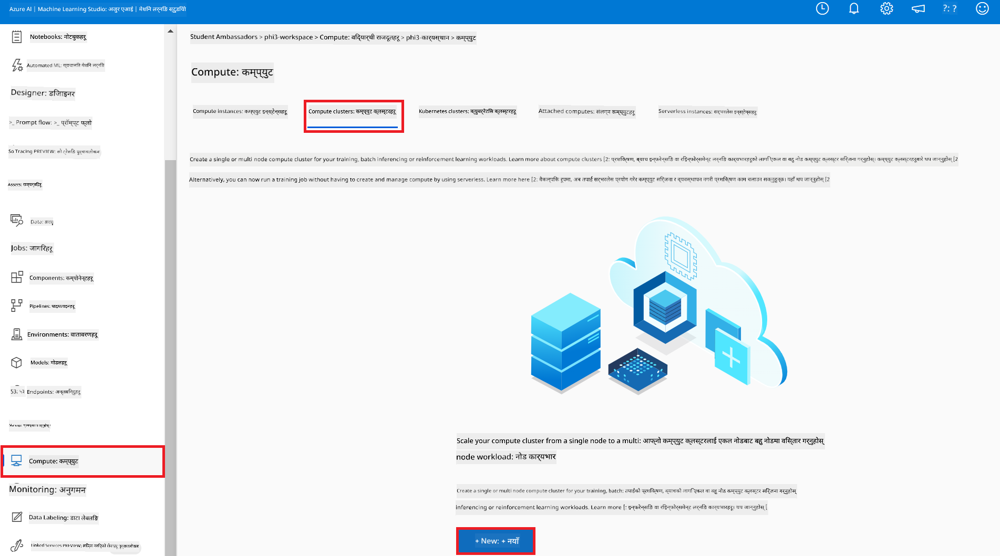

1. तलका कार्यहरू गर्नुहोस्:

    - तपाईंले प्रयोग गर्न चाहनुभएको **Region** चयन गर्नुहोस्।
    - **Virtual machine tier** लाई **Dedicated** मा सेट गर्नुहोस्।
    - **Virtual machine type** लाई **GPU** मा चयन गर्नुहोस्।
    - **Virtual machine size** फिल्टरलाई **Select from all options** मा सेट गर्नुहोस्।
    - **Virtual machine size** मा **Standard_NC24ads_A100_v4** चयन गर्नुहोस्।

    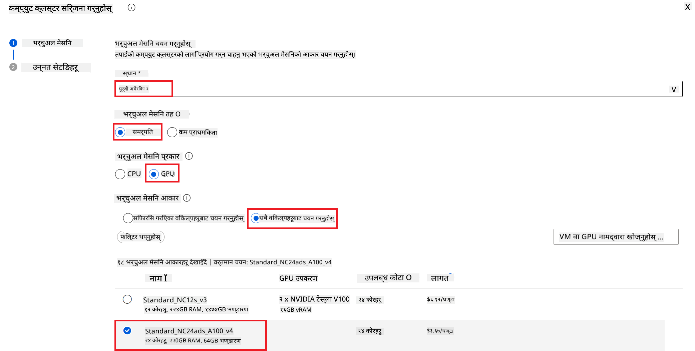

1. **Next** चयन गर्नुहोस्।

1. तलका कार्यहरू गर्नुहोस्:

    - **Compute name** प्रविष्ट गर्नुहोस्। यो अनौठो हुनैपर्छ।
    - **Minimum number of nodes** लाई **0** मा सेट गर्नुहोस्।
    - **Maximum number of nodes** लाई **1** मा सेट गर्नुहोस्।
    - **Idle seconds before scale down** लाई **120** मा सेट गर्नुहोस्।

    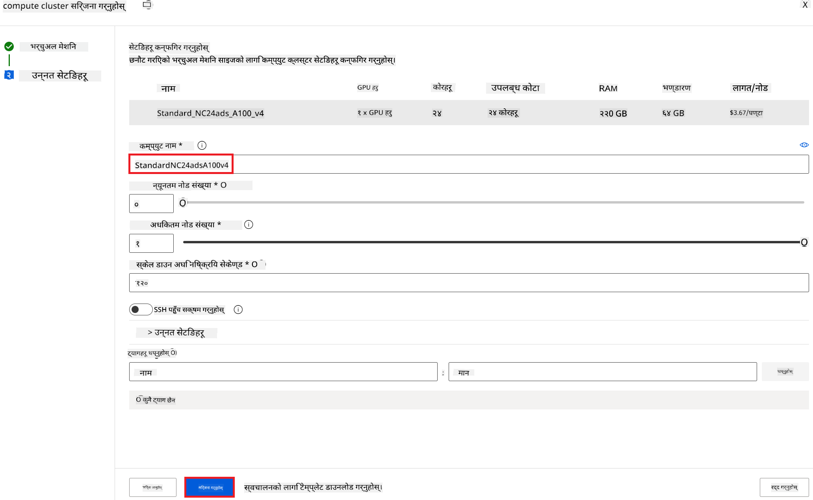

1. **Create** चयन गर्नुहोस्।

#### Phi-3 मोडेललाई Fine-tune गर्ने

1. [Azure ML Studio](https://ml.azure.com/home?wt.mc_id=studentamb_279723) मा जानुहोस्।

1. तपाईंले बनाएको Azure Machine Learning workspace चयन गर्नुहोस्।

    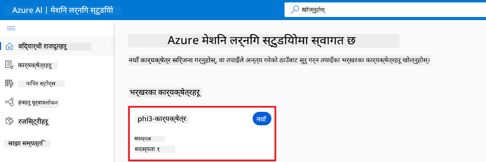

1. तलका कार्यहरू गर्नुहोस्:

    - बायाँपट्टि ट्याबबाट **Model catalog** चयन गर्नुहोस्।
    - **search bar** मा *phi-3-mini-4k* टाइप गर्नुहोस् र देखिएका विकल्पहरूबाट **Phi-3-mini-4k-instruct** चयन गर्नुहोस्।

    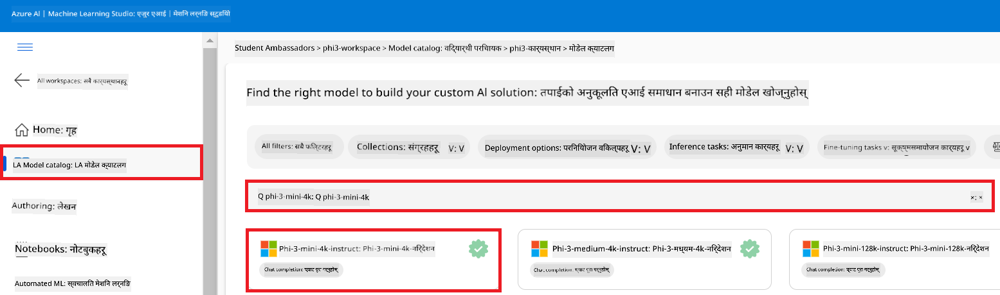

1. नेभिगेसन मेनुबाट **Fine-tune** चयन गर्नुहोस्।

    

1. तलका कार्यहरू गर्नुहोस्:

    - **Select task type** मा **Chat completion** चयन गर्नुहोस्।
    - **+ Select data** मा क्लिक गरेर **Training data** अपलोड गर्नुहोस्।
    - Validation data अपलोड प्रकारलाई **Provide different validation data** मा सेट गर्नुहोस्।
    - फेरि **+ Select data** मा क्लिक गरेर **Validation data** अपलोड गर्नुहोस्।

    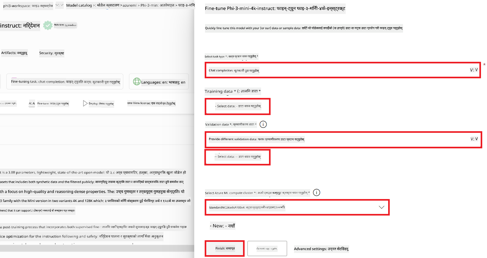

    > [!TIP]
    >
    > तपाईंले **Advanced settings** मा गएर **learning_rate** र **lr_scheduler_type** जस्ता कन्फिगरेसनहरू अनुकूलन गर्न सक्नुहुन्छ, जसले fine-tuning प्रक्रिया तपाईंको आवश्यकताअनुसार सुधार्न मद्दत गर्छ।

1. **Finish** चयन गर्नुहोस्।

1. यस अभ्यासमा, तपाईंले Azure Machine Learning प्रयोग गरी सफलतापूर्वक Phi-3 मोडेललाई fine-tune गर्नुभयो। कृपया ध्यान दिनुहोस् कि fine-tuning प्रक्रिया लामो समय लिन सक्छ। एकपटक fine-tuning काम सुरु भएपछि, यसको पूरा हुन कुर्नु पर्छ। तपाईंले Azure Machine Learning Workspace को बायाँपट्टि रहेको Jobs ट्याबमा गएर fine-tuning कामको स्थिति ट्र्याक गर्न सक्नुहुन्छ। अर्को श्रृंखलामा, तपाईंले fine-tuned मोडेललाई तैनाथ गर्ने र Prompt flow सँग जोड्ने प्रक्रिया सिक्नु हुनेछ।

    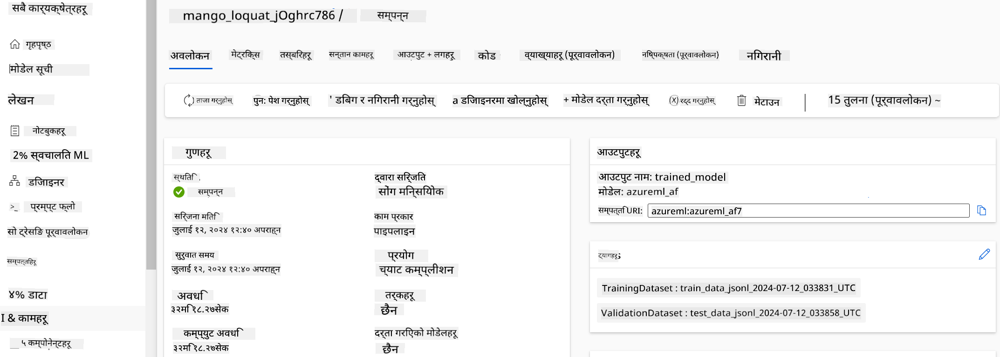

### Fine-tuned Phi-3 मोडेल तैनाथ गर्ने

Fine-tuned Phi-3 मोडेललाई Prompt flow सँग जोड्न, मोडेललाई तैनाथ गर्नुपर्छ ताकि यो रियल-टाइम इन्फरेन्सका लागि उपलब्ध होस्। यस प्रक्रियामा मोडेल दर्ता गर्ने, अनलाइन एन्डपोइन्ट सिर्जना गर्ने, र मोडेल तैनाथ गर्ने समावेश छ।

यस अभ्यासमा तपाईंले:

- Azure Machine Learning workspace मा fine-tuned मोडेल दर्ता गर्नुहुनेछ।
- अनलाइन एन्डपोइन्ट सिर्जना गर्नुहुनेछ।
- दर्ता गरिएको fine-tuned Phi-3 मोडेल तैनाथ गर्नुहुनेछ।

#### Fine-tuned मोडेल दर्ता गर्ने

1. [Azure ML Studio](https://ml.azure.com/home?wt.mc_id=studentamb_279723) मा जानुहोस्।

1. तपाईंले बनाएको Azure Machine Learning workspace चयन गर्नुहोस्।

    

1. बायाँपट्टि ट्याबबाट **Models** चयन गर्नुहोस्।
1. **+ Register** चयन गर्नुहोस्।
1. **From a job output** चयन गर्नुहोस्।

    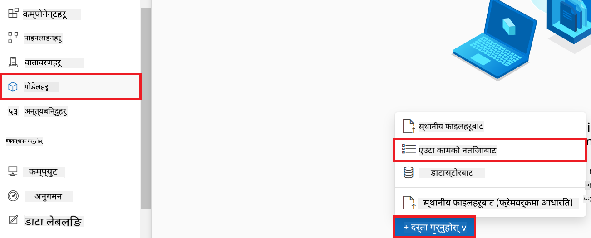

1. तपाईंले बनाएको job चयन गर्नुहोस्।

    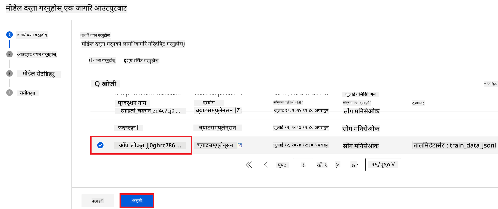

1. **Next** चयन गर्नुहोस्।

1. **Model type** मा **MLflow** चयन गर्नुहोस्।

1. **Job output** चयन गरिएको छ भनी सुनिश्चित गर्नुहोस्; यो स्वचालित रूपमा चयन हुनेछ।

    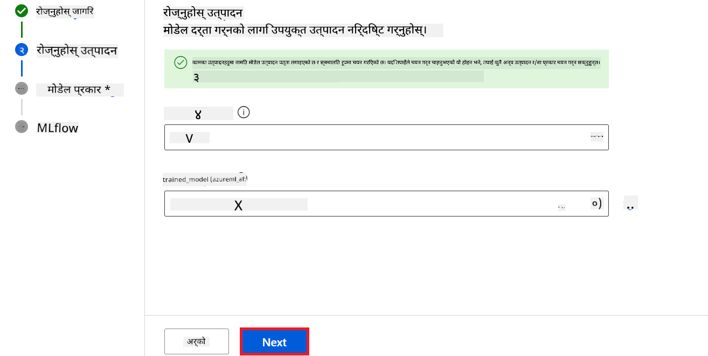

2. **Next** चयन गर्नुहोस्।

3. **Register** चयन गर्नुहोस्।

    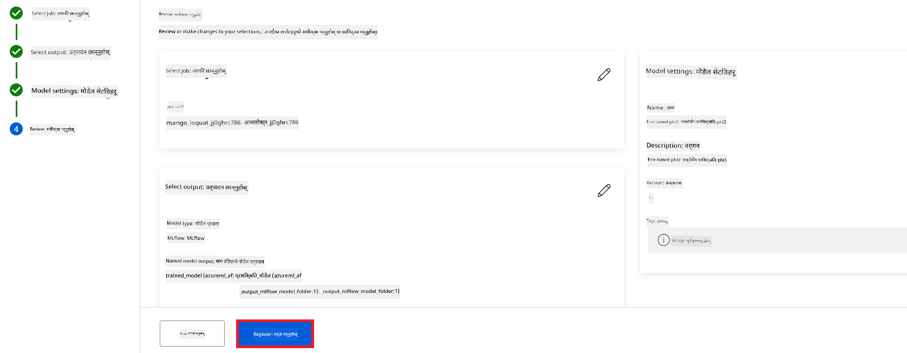

4. तपाईंले दर्ता गरेको मोडेल बायाँपट्टि ट्याबको **Models** मेनुमा गएर हेर्न सक्नुहुन्छ।

    

#### Fine-tuned मोडेल तैनाथ गर्ने

1. तपाईंले बनाएको Azure Machine Learning workspace मा जानुहोस्।

1. बायाँपट्टि ट्याबबाट **Endpoints** चयन गर्नुहोस्।

1. नेभिगेसन मेनुबाट **Real-time endpoints** चयन गर्नुहोस्।

    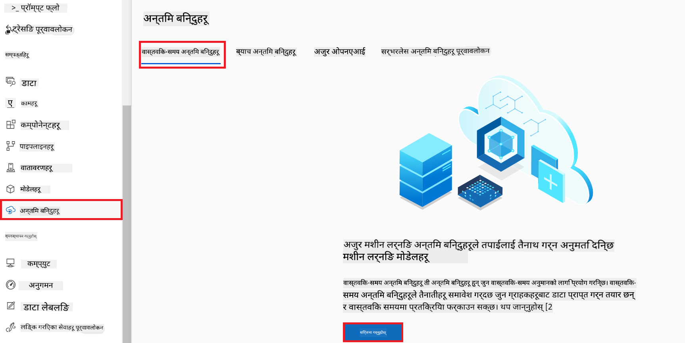

1. **Create** चयन गर्नुहोस्।

1. तपाईंले दर्ता गरेको मोडेल चयन गर्नुहोस्।

    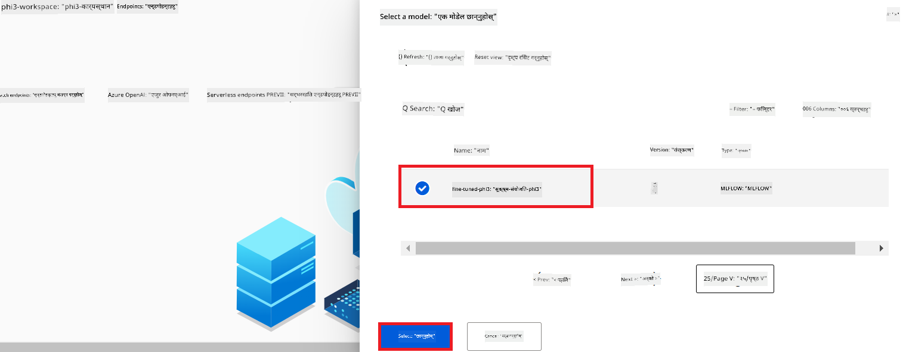

1. **Select** चयन गर्नुहोस्।

1. तलका कार्यहरू गर्नुहोस्:

    - **Virtual machine** मा *Standard_NC6s_v3* चयन गर्नुहोस्।
    - तपाईंले प्रयोग गर्न चाहनुभएको **Instance count** चयन गर्नुहोस्। जस्तै, *1*।
    - **Endpoint** लाई नयाँ बनाउन **New** चयन गर्नुहोस्।
    - **Endpoint name** प्रविष्ट गर्नुहोस्। यो अनौठो हुनैपर्छ।
    - **Deployment name** प्रविष्ट गर्नुहोस्। यो अनौठो हुनैपर्छ।

    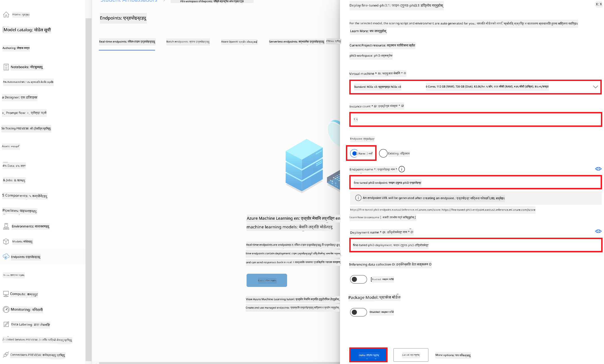

1. **Deploy** चयन गर्नुहोस्।

> [!WARNING]
> तपाईंको खातामा अतिरिक्त शुल्क लाग्न नदिन, Azure Machine Learning workspace मा सिर्जना गरिएको endpoint मेटाउन नबिर्सनुहोस्।
>

#### Azure Machine Learning Workspace मा तैनाथी स्थिति जाँच्ने

1. तपाईंले बनाएको Azure Machine Learning workspace मा जानुहोस्।

1. बायाँपट्टि ट्याबबाट **Endpoints** चयन गर्नुहोस्।

1. तपाईंले बनाएको endpoint चयन गर्नुहोस्।

    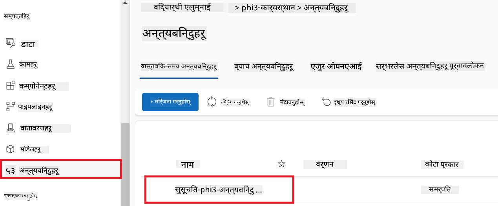

1. यस पृष्ठमा, तपाईंले तैनाथी प्रक्रियाको समयमा endpoint हरू व्यवस्थापन गर्न सक्नुहुन्छ।

> [!NOTE]
> तैनाथी पूरा भएपछि, **Live traffic** लाई **100%** मा सेट गरिएको छ कि छैन सुनिश्चित गर्नुहोस्। यदि छैन भने, ट्राफिक सेटिङ समायोजन गर्न **Update traffic** चयन गर्नुहोस्। ट्राफिक 0% मा सेट भए मोडेल परीक्षण गर्न सकिँदैन।
>
> 
>

## परिदृश्य ३: Prompt flow सँग एकीकृत गरी Azure AI Foundry मा आफ्नो कस्टम मोडेलसँग कुराकानी गर्ने

### कस्टम Phi-3 मोडेललाई Prompt flow सँग एकीकृत गर्ने

तपाईंले सफलतापूर्वक fine-tuned मोडेल तैनाथ गरेपछि, अब यसलाई Prompt Flow सँग जोडेर वास्तविक-समयका अनुप्रयोगहरूमा प्रयोग गर्न सक्नुहुन्छ, जसले तपाईंको कस्टम Phi-3 मोडेलसँग विभिन्न अन्तरक्रियात्मक कार्यहरू गर्न सक्षम बनाउँछ।

यस अभ्यासमा तपाईंले:

- Azure AI Foundry Hub सिर्जना गर्नुहुनेछ।
- Azure AI Foundry Project सिर्जना गर्नुहुनेछ।
- Prompt flow सिर्जना गर्नुहुनेछ।
- fine-tuned Phi-3 मोडेलका लागि कस्टम कनेक्शन थप्नुहुनेछ।
- कस्टम Phi-3 मोडेलसँग कुराकानी गर्न Prompt flow सेटअप गर्नुहुनेछ।

> [!NOTE]
> तपाईं Azure ML Studio प्रयोग गरेर पनि Promptflow सँग एकीकृत गर्न सक्नुहुन्छ। एकै प्रक्रिया Azure ML Studio मा पनि लागू हुन्छ।

#### Azure AI Foundry Hub सिर्जना गर्ने

Project सिर्जना गर्नु अघि Hub बनाउन आवश्यक हुन्छ। Hub ले Resource Group जस्तै काम गर्छ, जसले Azure AI Foundry भित्र धेरै Project हरूलाई व्यवस्थित र व्यवस्थापन गर्न मद्दत गर्छ।

1. [Azure AI Foundry](https://ai.azure.com/?WT.mc_id=aiml-137032-kinfeylo) मा जानुहोस्।

1. बायाँपट्टि ट्याबबाट **All hubs** चयन गर्नुहोस्।

1. नेभिगेसन मेनुबाट **+ New hub** चयन गर्नुहोस्।

    

1. तलका कार्यहरू गर्नुहोस्:

    - **Hub name** प्रविष्ट गर्नुहोस्। यो अनौठो हुनैपर्छ।
    - आफ्नो Azure **Subscription** चयन गर्नुहोस्।
    - प्रयोग गर्न चाहनुभएको **Resource group** चयन गर्नुहोस् (आवश्यक परे नयाँ बनाउनुहोस्)।
    - तपाईंले प्रयोग गर्न चाहनुभएको **Location** चयन गर्नुहोस्।
    - प्रयोग गर्न चाहनुभएको **Connect Azure AI Services** चयन गर्नुहोस् (आवश्यक परे नयाँ बनाउनुहोस्)।
    - **Connect Azure AI Search** लाई **Skip connecting** मा सेट गर्नुहोस्।

    

1. **Next** चयन गर्नुहोस्।

#### Azure AI Foundry Project सिर्जना गर्ने

1. तपाईंले बनाएको Hub मा गएर बायाँपट्टि ट्याबबाट **All projects** चयन गर्नुहोस्।

1. नेभिगेसन मेनुबाट **+ New project** चयन गर्नुहोस्।

    

1. **Project name** प्रविष्ट गर्नुहोस्। यो अनौठो हुनैपर्छ।

    

1. **Create a project** चयन गर्नुहोस्।

#### fine-tuned Phi-3 मोडेलका लागि कस्टम कनेक्शन थप्ने

तपाईंको कस्टम Phi-3 मोडेललाई Prompt flow सँग जोड्न, मोडेलको endpoint र key कस्टम कनेक्शनमा सुरक्षित गर्न आवश्यक छ। यसले Prompt flow मा तपाईंको कस्टम Phi-3 मोडेल पहुँच सुनिश्चित गर्दछ।

#### fine-tuned Phi-3 मोडेलको api key र endpoint uri सेट गर्ने

1. [Azure ML Studio](https://ml.azure.com/home?WT.mc_id=aiml-137032-kinfeylo) मा जानुहोस्।

1. तपाईंले बनाएको Azure Machine Learning workspace मा जानुहोस्।

1. बायाँपट्टि ट्याबबाट **Endpoints** चयन गर्नुहोस्।

    

1. तपाईंले बनाएको endpoint चयन गर्नुहोस्।

    

1. नेभिगेसन मेनुबाट **Consume** चयन गर्नुहोस्।

1. आफ्नो **REST endpoint** र **Primary key** कपी गर्नुहोस्।


#### कस्टम कनेक्शन थप्नुहोस्

1. [Azure AI Foundry](https://ai.azure.com/?WT.mc_id=aiml-137032-kinfeylo) मा जानुहोस्।

1. तपाईंले सिर्जना गरेको Azure AI Foundry प्रोजेक्टमा जानुहोस्।

1. तपाईंले सिर्जना गरेको प्रोजेक्टमा, बायाँपट्टि रहेको ट्याबबाट **Settings** छान्नुहोस्।

1. **+ New connection** छान्नुहोस्।

    

1. नेभिगेसन मेनुबाट **Custom keys** छान्नुहोस्।

    

1. तलका कार्यहरू गर्नुहोस्:

    - **+ Add key value pairs** छान्नुहोस्।
    - कुञ्जी नाममा **endpoint** लेख्नुहोस् र Azure ML Studio बाट कपी गरेको endpoint मान फिल्डमा टाँस्नुहोस्।
    - फेरि **+ Add key value pairs** छान्नुहोस्।
    - कुञ्जी नाममा **key** लेख्नुहोस् र Azure ML Studio बाट कपी गरेको key मान फिल्डमा टाँस्नुहोस्।
    - कुञ्जीहरू थपिसकेपछि, **is secret** छान्नुहोस् ताकि key खुल्ला नहोस्।

    

1. **Add connection** छान्नुहोस्।

#### Prompt flow सिर्जना गर्नुहोस्

तपाईंले Azure AI Foundry मा कस्टम कनेक्शन थप्नुभयो। अब, तलका चरणहरू अनुसरण गरेर Prompt flow सिर्जना गरौं। त्यसपछि, तपाईंले यो Prompt flow लाई कस्टम कनेक्शनसँग जोड्नेछौं ताकि fine-tuned मोडेल Prompt flow भित्र प्रयोग गर्न सकियोस्।

1. तपाईंले सिर्जना गरेको Azure AI Foundry प्रोजेक्टमा जानुहोस्।

1. बायाँपट्टि ट्याबबाट **Prompt flow** छान्नुहोस्।

1. नेभिगेसन मेनुबाट **+ Create** छान्नुहोस्।

    

1. नेभिगेसन मेनुबाट **Chat flow** छान्नुहोस्।

    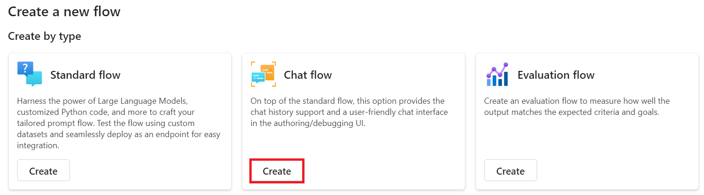

1. प्रयोग गर्न चाहेको **Folder name** लेख्नुहोस्।

    

2. **Create** छान्नुहोस्।

#### तपाईंको कस्टम Phi-3 मोडेलसँग कुराकानी गर्न Prompt flow सेटअप गर्नुहोस्

तपाईंले fine-tuned Phi-3 मोडेललाई Prompt flow मा समावेश गर्न आवश्यक छ। तर, दिइएको मौजुदा Prompt flow यसका लागि डिजाइन गरिएको छैन। त्यसैले, तपाईंले Prompt flow पुनः डिजाइन गरेर कस्टम मोडेल समावेश गर्नुपर्छ।

1. Prompt flow भित्र, तलका कार्यहरू गरेर मौजुदा flow पुनर्निर्माण गर्नुहोस्:

    - **Raw file mode** छान्नुहोस्।
    - *flow.dag.yml* फाइलमा भएका सबै कोडहरू मेटाउनुहोस्।
    - *flow.dag.yml* फाइलमा तलको कोड थप्नुहोस्।

        ```yml
        inputs:
          input_data:
            type: string
            default: "Who founded Microsoft?"

        outputs:
          answer:
            type: string
            reference: ${integrate_with_promptflow.output}

        nodes:
        - name: integrate_with_promptflow
          type: python
          source:
            type: code
            path: integrate_with_promptflow.py
          inputs:
            input_data: ${inputs.input_data}
        ```

    - **Save** छान्नुहोस्।

    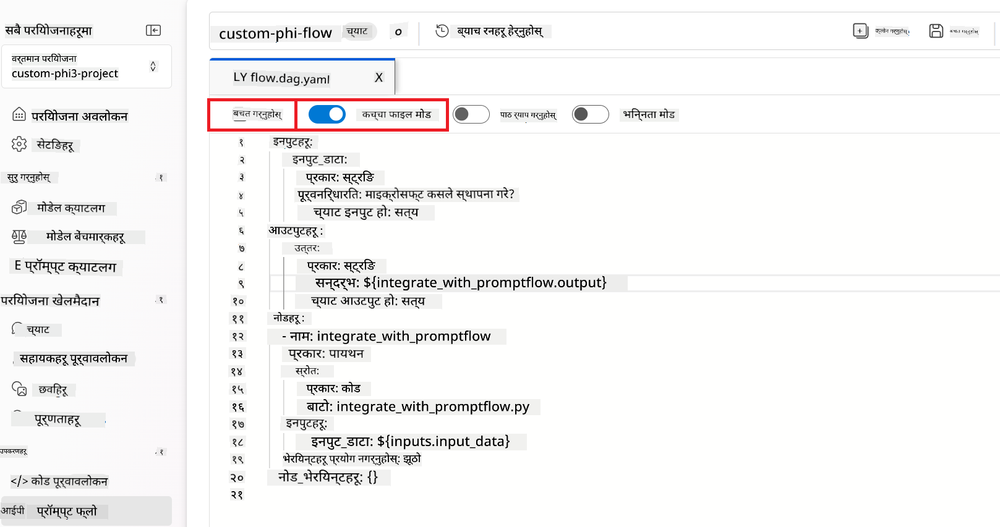

1. Prompt flow मा कस्टम Phi-3 मोडेल प्रयोग गर्न *integrate_with_promptflow.py* फाइलमा तलको कोड थप्नुहोस्।

    ```python
    import logging
    import requests
    from promptflow import tool
    from promptflow.connections import CustomConnection

    # Logging setup
    logging.basicConfig(
        format="%(asctime)s - %(levelname)s - %(name)s - %(message)s",
        datefmt="%Y-%m-%d %H:%M:%S",
        level=logging.DEBUG
    )
    logger = logging.getLogger(__name__)

    def query_phi3_model(input_data: str, connection: CustomConnection) -> str:
        """
        Send a request to the Phi-3 model endpoint with the given input data using Custom Connection.
        """

        # "connection" is the name of the Custom Connection, "endpoint", "key" are the keys in the Custom Connection
        endpoint_url = connection.endpoint
        api_key = connection.key

        headers = {
            "Content-Type": "application/json",
            "Authorization": f"Bearer {api_key}"
        }
        data = {
            "input_data": {
                "input_string": [
                    {"role": "user", "content": input_data}
                ],
                "parameters": {
                    "temperature": 0.7,
                    "max_new_tokens": 128
                }
            }
        }
        try:
            response = requests.post(endpoint_url, json=data, headers=headers)
            response.raise_for_status()
            
            # Log the full JSON response
            logger.debug(f"Full JSON response: {response.json()}")

            result = response.json()["output"]
            logger.info("Successfully received response from Azure ML Endpoint.")
            return result
        except requests.exceptions.RequestException as e:
            logger.error(f"Error querying Azure ML Endpoint: {e}")
            raise

    @tool
    def my_python_tool(input_data: str, connection: CustomConnection) -> str:
        """
        Tool function to process input data and query the Phi-3 model.
        """
        return query_phi3_model(input_data, connection)

    ```

    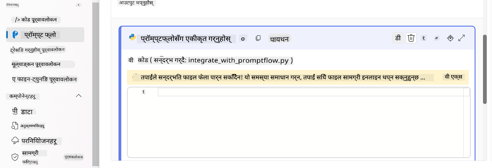

> [!NOTE]
> Azure AI Foundry मा Prompt flow को विस्तृत जानकारीको लागि, तपाईं [Prompt flow in Azure AI Foundry](https://learn.microsoft.com/azure/ai-studio/how-to/prompt-flow) हेर्न सक्नुहुन्छ।

1. **Chat input**, **Chat output** छान्नुहोस् ताकि तपाईंको मोडेलसँग कुराकानी गर्न सकियोस्।

    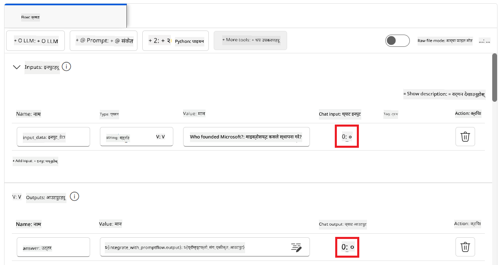

1. अब तपाईं आफ्नो कस्टम Phi-3 मोडेलसँग कुराकानी गर्न तयार हुनुहुन्छ। अर्को अभ्यासमा, तपाईंले कसरी Prompt flow सुरु गर्ने र fine-tuned Phi-3 मोडेलसँग कुराकानी गर्ने सिक्नु हुनेछ।

> [!NOTE]
>
> पुनर्निर्मित flow तलको तस्वीर जस्तो देखिनुपर्छ:
>
> 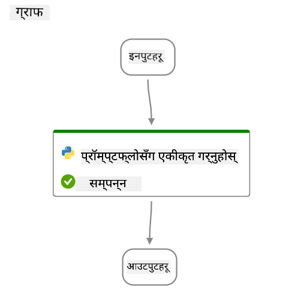
>

### तपाईंको कस्टम Phi-3 मोडेलसँग कुराकानी गर्नुहोस्

अब तपाईंले आफ्नो कस्टम Phi-3 मोडेललाई fine-tune गरी Prompt flow सँग समावेश गर्नुभयो, तपाईं यससँग कुराकानी सुरु गर्न तयार हुनुहुन्छ। यो अभ्यासले तपाईंलाई Prompt flow प्रयोग गरेर मोडेलसँग कुराकानी सुरु गर्ने तरिका सिकाउनेछ। यी चरणहरू पालना गरेर, तपाईं आफ्नो fine-tuned Phi-3 मोडेलका सबै क्षमताहरू विभिन्न कार्य र संवादहरूमा उपयोग गर्न सक्नुहुनेछ।

- Prompt flow प्रयोग गरी तपाईंको कस्टम Phi-3 मोडेलसँग कुराकानी गर्नुहोस्।

#### Prompt flow सुरु गर्नुहोस्

1. Prompt flow सुरु गर्न **Start compute sessions** छान्नुहोस्।

    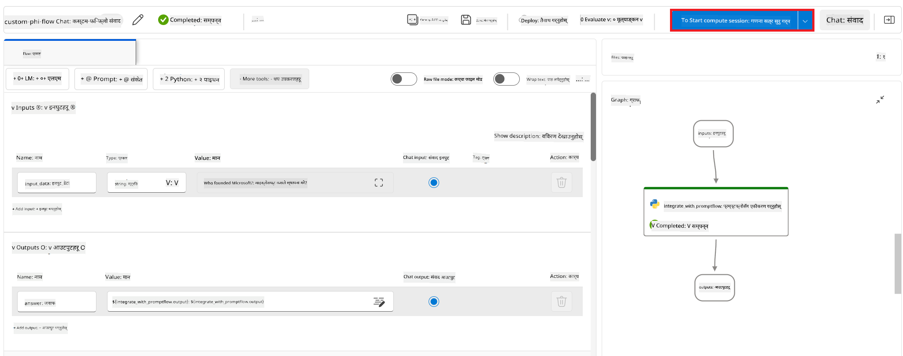

1. प्यारामिटरहरू नवीकरण गर्न **Validate and parse input** छान्नुहोस्।

    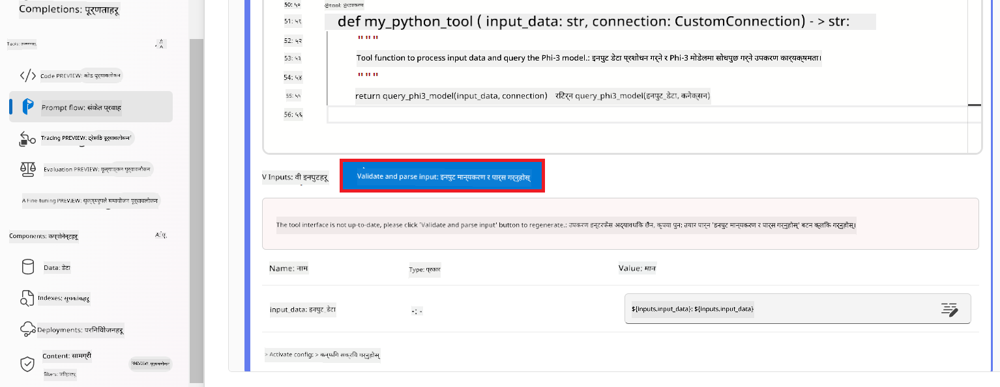

1. तपाईंले सिर्जना गरेको कस्टम कनेक्शनको **connection** को **Value** छान्नुहोस्। उदाहरणका लागि, *connection*।

    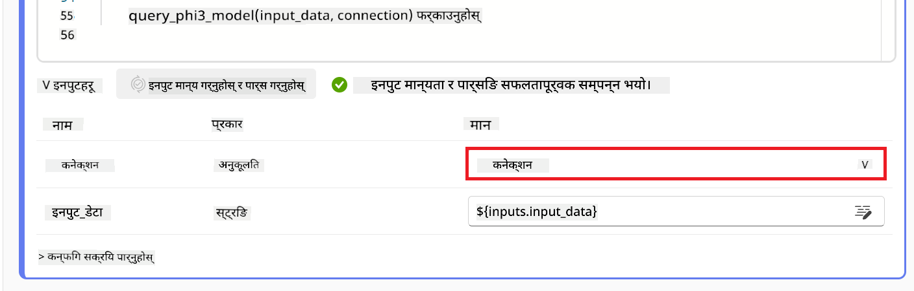

#### तपाईंको कस्टम मोडेलसँग कुराकानी गर्नुहोस्

1. **Chat** छान्नुहोस्।

    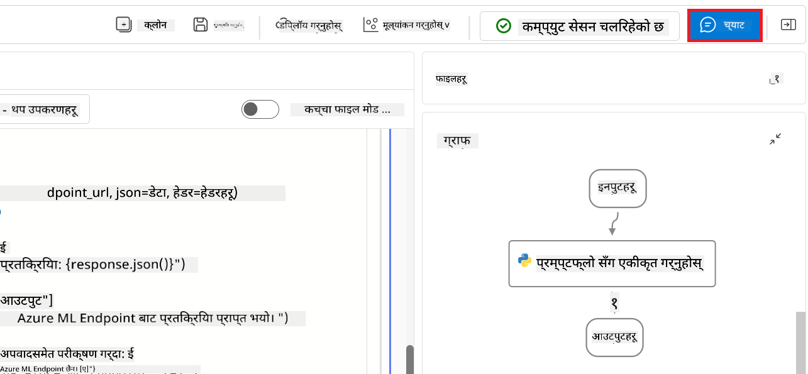

1. यहाँ परिणामको उदाहरण छ: अब तपाईं आफ्नो कस्टम Phi-3 मोडेलसँग कुराकानी गर्न सक्नुहुन्छ। fine-tuning मा प्रयोग गरिएको डाटामा आधारित प्रश्न सोध्न सिफारिस गरिन्छ।

    

**अस्वीकरण**:  
यो दस्तावेज़लाई AI अनुवाद सेवा [Co-op Translator](https://github.com/Azure/co-op-translator) प्रयोग गरेर अनुवाद गरिएको हो। हामी शुद्धताका लागि प्रयास गर्छौं, तर कृपया ध्यान दिनुहोस् कि स्वचालित अनुवादहरूमा त्रुटिहरू वा अशुद्धिहरू हुन सक्छन्। मूल दस्तावेज़ यसको मूल भाषामा आधिकारिक स्रोत मानिनुपर्छ। महत्वपूर्ण जानकारीका लागि व्यावसायिक मानव अनुवाद सिफारिस गरिन्छ। यस अनुवादको प्रयोगबाट उत्पन्न कुनै पनि गलतफहमी वा गलत व्याख्याका लागि हामी जिम्मेवार छैनौं।