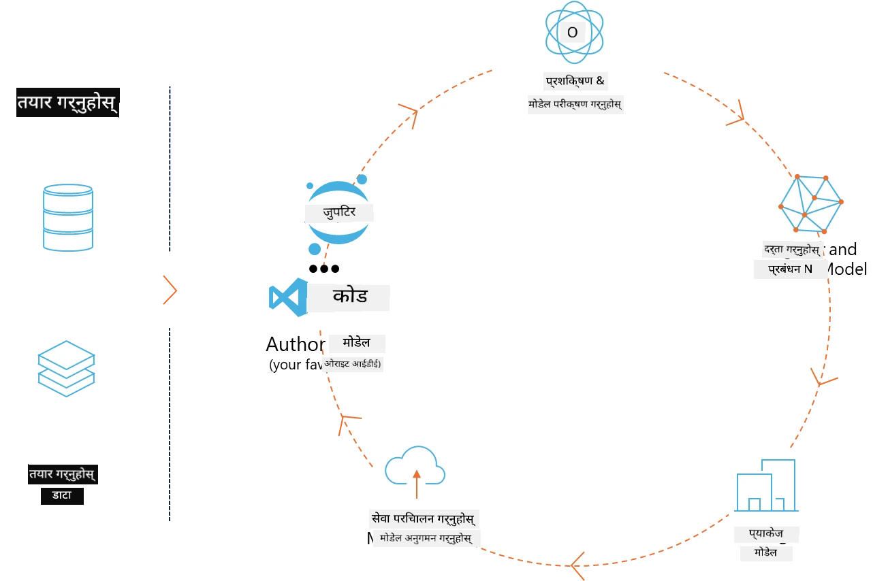
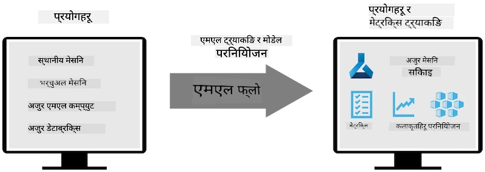
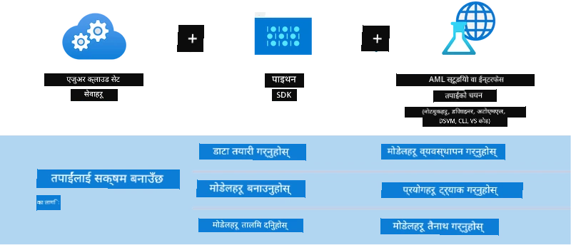

# MLflow

[MLflow](https://mlflow.org/) एक खुला स्रोत प्लेटफर्म हो जुन मेसिन लर्निङको सम्पूर्ण जीवनचक्र व्यवस्थापन गर्न डिजाइन गरिएको हो।



MLFlow मेसिन लर्निङ जीवनचक्र व्यवस्थापन गर्न प्रयोग गरिन्छ, जसमा प्रयोग, पुनरुत्पादन, परिनियोजन र केन्द्रीय मोडेल रजिस्ट्री समावेश छन्। MLflow हाल चार कम्पोनेन्टहरू प्रदान गर्दछ।

- **MLflow Tracking:** प्रयोग, कोड, डाटा कन्फिग र नतिजाहरू रेकर्ड र सोधपुछ गर्न।
- **MLflow Projects:** डाटा साइन्स कोडलाई यस्तो ढाँचामा प्याकेज गर्न जसले कुनै पनि प्लेटफर्ममा पुनरुत्पादन गर्न सकियोस्।
- **Mlflow Models:** मेसिन लर्निङ मोडेलहरूलाई विभिन्न सेवा वातावरणहरूमा परिनियोजन गर्न।
- **Model Registry:** मोडेलहरूलाई केन्द्रीय रिपोजिटरीमा भण्डारण, टिप्पणी र व्यवस्थापन गर्न।

यसले प्रयोगहरू ट्र्याक गर्ने, कोडलाई पुनरुत्पादनयोग्य रनहरूमा प्याकेज गर्ने, र मोडेलहरू साझा र परिनियोजन गर्ने क्षमता समावेश गर्दछ। MLFlow Databricks मा एकीकृत छ र विभिन्न ML पुस्तकालयहरूलाई समर्थन गर्दछ, जसले यसलाई पुस्तकालय-स्वतन्त्र बनाउँछ। यसलाई कुनै पनि मेसिन लर्निङ पुस्तकालय र कुनै पनि प्रोग्रामिङ भाषामा प्रयोग गर्न सकिन्छ, किनभने यसले सुविधा स्वरूप REST API र CLI प्रदान गर्दछ।



MLFlow का मुख्य विशेषताहरू:

- **Experiment Tracking:** प्यारामिटरहरू र नतिजाहरू रेकर्ड र तुलना गर्न।
- **Model Management:** मोडेलहरूलाई विभिन्न सेवा र अनुमान प्लेटफर्महरूमा परिनियोजन गर्न।
- **Model Registry:** MLflow मोडेलहरूको जीवनचक्र सहकार्यमा व्यवस्थापन गर्न, जसमा संस्करण व्यवस्थापन र टिप्पणीहरू समावेश छन्।
- **Projects:** ML कोडलाई साझा वा उत्पादन प्रयोगका लागि प्याकेज गर्न।

MLFlow ले MLOps लूपलाई पनि समर्थन गर्दछ, जसमा डाटा तयारी, मोडेल दर्ता र व्यवस्थापन, मोडेलहरूलाई कार्यान्वयनका लागि प्याकेजिङ, सेवा परिनियोजन, र मोडेलहरूको अनुगमन समावेश छ। यसले प्रोटोटाइपबाट उत्पादन कार्यप्रवाहमा जानको प्रक्रिया सरल बनाउन लक्ष्य राखेको छ, विशेष गरी क्लाउड र एज वातावरणहरूमा।

## E2E परिदृश्य - Wrapper बनाउने र Phi-3 लाई MLFlow मोडेलको रूपमा प्रयोग गर्ने

यस E2E नमुनामा हामी Phi-3 सानो भाषा मोडेल (SLM) वरिपरि दुई फरक तरिकाले wrapper बनाउने र त्यसलाई MLFlow मोडेलको रूपमा स्थानीय वा क्लाउडमा, जस्तै Azure Machine Learning कार्यक्षेत्रमा चलाउने तरिका देखाउनेछौं।



| परियोजना | विवरण | स्थान |
| ------------ | ----------- | -------- |
| Transformer Pipeline | यदि तपाईं HuggingFace मोडेललाई MLFlow को प्रयोगात्मक transformers फ्लेवरसँग प्रयोग गर्न चाहनुहुन्छ भने Transformer Pipeline wrapper बनाउन सबैभन्दा सजिलो विकल्प हो। | [**TransformerPipeline.ipynb**](../../../../../../code/06.E2E/E2E_Phi-3-MLflow_TransformerPipeline.ipynb) |
| Custom Python Wrapper | लेख्ने समयमा, transformer pipeline ले HuggingFace मोडेलहरूको ONNX ढाँचामा MLFlow wrapper निर्माण समर्थन गर्दैनथ्यो, यहाँसम्म कि प्रयोगात्मक optimum Python प्याकेजसँग पनि। यस्तो अवस्थामा, तपाईं आफ्नो कस्टम Python wrapper बनाउन सक्नुहुन्छ। | [**CustomPythonWrapper.ipynb**](../../../../../../code/06.E2E/E2E_Phi-3-MLflow_CustomPythonWrapper.ipynb) |

## परियोजना: Transformer Pipeline

1. तपाईंलाई MLFlow र HuggingFace का सम्बन्धित Python प्याकेजहरू आवश्यक पर्छन्:

    ``` Python
    import mlflow
    import transformers
    ```

2. त्यसपछि, HuggingFace रजिस्ट्रीमा रहेको लक्षित Phi-3 मोडेललाई सन्दर्भ गर्दै transformer pipeline सुरु गर्नुहोस्। _Phi-3-mini-4k-instruct_ को मोडेल कार्डबाट देखिन्छ कि यसको कार्य “Text Generation” प्रकारको हो:

    ``` Python
    pipeline = transformers.pipeline(
        task = "text-generation",
        model = "microsoft/Phi-3-mini-4k-instruct"
    )
    ```

3. अब तपाईं आफ्नो Phi-3 मोडेलको transformer pipeline लाई MLFlow ढाँचामा बचत गर्न सक्नुहुन्छ र थप विवरणहरू जस्तै लक्षित आर्टिफ्याक्ट पथ, विशेष मोडेल कन्फिगरेसन सेटिङहरू र अनुमान API प्रकार प्रदान गर्न सक्नुहुन्छ:

    ``` Python
    model_info = mlflow.transformers.log_model(
        transformers_model = pipeline,
        artifact_path = "phi3-mlflow-model",
        model_config = model_config,
        task = "llm/v1/chat"
    )
    ```

## परियोजना: Custom Python Wrapper

1. यहाँ हामी Microsoft को [ONNX Runtime generate() API](https://github.com/microsoft/onnxruntime-genai) लाई ONNX मोडेलको अनुमान र टोकन इन्कोडिङ/डिकोडिङका लागि प्रयोग गर्न सक्छौं। तपाईंले आफ्नो लक्षित कम्प्युटका लागि _onnxruntime_genai_ प्याकेज रोज्नुपर्छ, तलको उदाहरण CPU लक्षित छ:

    ``` Python
    import mlflow
    from mlflow.models import infer_signature
    import onnxruntime_genai as og
    ```

1. हाम्रो कस्टम क्लासले दुई विधिहरू कार्यान्वयन गर्छ: _load_context()_ जसले Phi-3 Mini 4K Instruct को **ONNX मोडेल**, **जनरेटर प्यारामिटरहरू** र **tokenizer** सुरु गर्छ; र _predict()_ जसले दिइएको प्रॉम्प्टका लागि आउटपुट टोकनहरू उत्पादन गर्छ:

    ``` Python
    class Phi3Model(mlflow.pyfunc.PythonModel):
        def load_context(self, context):
            # Retrieving model from the artifacts
            model_path = context.artifacts["phi3-mini-onnx"]
            model_options = {
                 "max_length": 300,
                 "temperature": 0.2,         
            }
        
            # Defining the model
            self.phi3_model = og.Model(model_path)
            self.params = og.GeneratorParams(self.phi3_model)
            self.params.set_search_options(**model_options)
            
            # Defining the tokenizer
            self.tokenizer = og.Tokenizer(self.phi3_model)
    
        def predict(self, context, model_input):
            # Retrieving prompt from the input
            prompt = model_input["prompt"][0]
            self.params.input_ids = self.tokenizer.encode(prompt)
    
            # Generating the model's response
            response = self.phi3_model.generate(self.params)
    
            return self.tokenizer.decode(response[0][len(self.params.input_ids):])
    ```

1. अब तपाईं _mlflow.pyfunc.log_model()_ फंक्शन प्रयोग गरेर Phi-3 मोडेलको लागि कस्टम Python wrapper (pickle ढाँचामा) बनाउन सक्नुहुन्छ, मूल ONNX मोडेल र आवश्यक निर्भरताहरू सहित:

    ``` Python
    model_info = mlflow.pyfunc.log_model(
        artifact_path = artifact_path,
        python_model = Phi3Model(),
        artifacts = {
            "phi3-mini-onnx": "cpu_and_mobile/cpu-int4-rtn-block-32-acc-level-4",
        },
        input_example = input_example,
        signature = infer_signature(input_example, ["Run"]),
        extra_pip_requirements = ["torch", "onnxruntime_genai", "numpy"],
    )
    ```

## उत्पन्न MLFlow मोडेलहरूको सिग्नेचरहरू

1. माथि Transformer Pipeline परियोजनाको चरण 3 मा, हामीले MLFlow मोडेलको कार्यलाई “_llm/v1/chat_” मा सेट गरेका थियौं। यस्तो निर्देशनले OpenAI को Chat API सँग मिल्ने मोडेलको API wrapper उत्पन्न गर्छ, तल देखाइएको छ:

    ``` Python
    {inputs: 
      ['messages': Array({content: string (required), name: string (optional), role: string (required)}) (required), 'temperature': double (optional), 'max_tokens': long (optional), 'stop': Array(string) (optional), 'n': long (optional), 'stream': boolean (optional)],
    outputs: 
      ['id': string (required), 'object': string (required), 'created': long (required), 'model': string (required), 'choices': Array({finish_reason: string (required), index: long (required), message: {content: string (required), name: string (optional), role: string (required)} (required)}) (required), 'usage': {completion_tokens: long (required), prompt_tokens: long (required), total_tokens: long (required)} (required)],
    params: 
      None}
    ```

1. परिणामस्वरूप, तपाईं आफ्नो प्रॉम्प्ट निम्न ढाँचामा पठाउन सक्नुहुन्छ:

    ``` Python
    messages = [{"role": "user", "content": "What is the capital of Spain?"}]
    ```

1. त्यसपछि, OpenAI API-संग मिल्ने पोस्ट-प्रोसेसिङ प्रयोग गर्नुहोस्, जस्तै _response[0][‘choices’][0][‘message’][‘content’]_, जसले तपाईंको आउटपुटलाई यस प्रकार सुन्दर बनाउँछ:

    ``` JSON
    Question: What is the capital of Spain?
    
    Answer: The capital of Spain is Madrid. It is the largest city in Spain and serves as the political, economic, and cultural center of the country. Madrid is located in the center of the Iberian Peninsula and is known for its rich history, art, and architecture, including the Royal Palace, the Prado Museum, and the Plaza Mayor.
    
    Usage: {'prompt_tokens': 11, 'completion_tokens': 73, 'total_tokens': 84}
    ```

1. माथि Custom Python Wrapper परियोजनाको चरण 3 मा, हामीले MLFlow प्याकेजलाई दिइएको इनपुट उदाहरणबाट मोडेलको सिग्नेचर उत्पन्न गर्न अनुमति दिएका छौं। हाम्रो MLFlow wrapper को सिग्नेचर यस प्रकार देखिन्छ:

    ``` Python
    {inputs: 
      ['prompt': string (required)],
    outputs: 
      [string (required)],
    params: 
      None}
    ```

1. त्यसैले, हाम्रो प्रॉम्प्टमा "prompt" डिक्सनरी कुञ्जी समावेश हुनुपर्छ, यसरी:

    ``` Python
    {"prompt": "<|system|>You are a stand-up comedian.<|end|><|user|>Tell me a joke about atom<|end|><|assistant|>",}
    ```

1. मोडेलको आउटपुट त्यसपछि स्ट्रिङ ढाँचामा प्रदान गरिनेछ:

    ``` JSON
    Alright, here's a little atom-related joke for you!
    
    Why don't electrons ever play hide and seek with protons?
    
    Because good luck finding them when they're always "sharing" their electrons!
    
    Remember, this is all in good fun, and we're just having a little atomic-level humor!
    ```

**अस्वीकरण**:  
यो दस्तावेज AI अनुवाद सेवा [Co-op Translator](https://github.com/Azure/co-op-translator) प्रयोग गरी अनुवाद गरिएको हो। हामी शुद्धताका लागि प्रयासरत छौं, तर कृपया ध्यान दिनुहोस् कि स्वचालित अनुवादमा त्रुटि वा अशुद्धता हुनसक्छ। मूल दस्तावेज यसको मूल भाषामा नै अधिकारिक स्रोत मानिनुपर्छ। महत्वपूर्ण जानकारीका लागि व्यावसायिक मानव अनुवाद सिफारिस गरिन्छ। यस अनुवादको प्रयोगबाट उत्पन्न कुनै पनि गलतफहमी वा गलत व्याख्याका लागि हामी जिम्मेवार छैनौं।