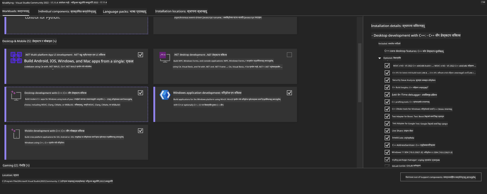
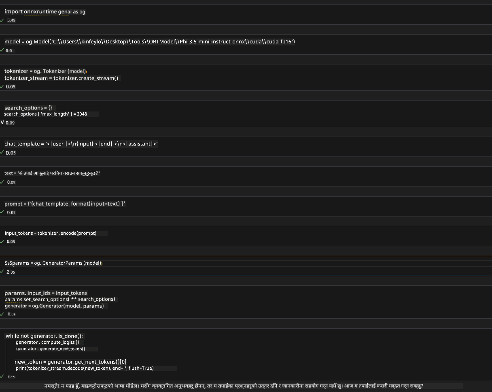
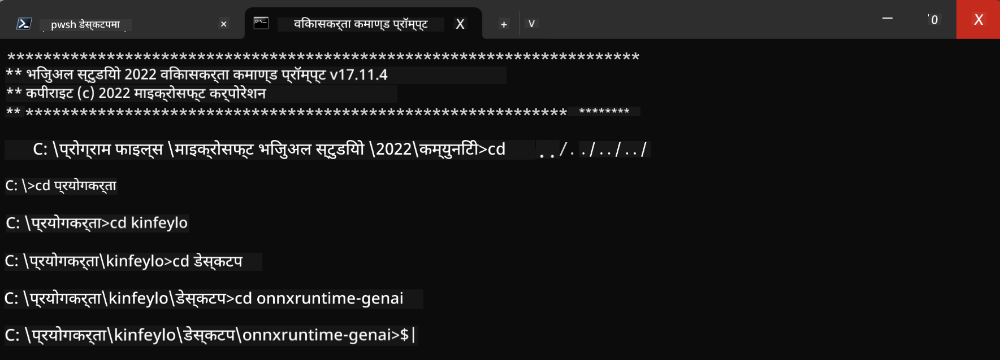

<!--
CO_OP_TRANSLATOR_METADATA:
{
  "original_hash": "b066fc29c1b2129df84e027cb75119ce",
  "translation_date": "2025-05-09T18:42:15+00:00",
  "source_file": "md/02.Application/01.TextAndChat/Phi3/ORTWindowGPUGuideline.md",
  "language_code": "ne"
}
-->
# **OnnxRuntime GenAI Windows GPU का दिशानिर्देश**

यह दिशानिर्देश Windows पर ONNX Runtime (ORT) को GPU के साथ सेटअप और उपयोग करने के लिए कदम बताता है। इसका उद्देश्य आपके मॉडल्स के लिए GPU एक्सेलेरेशन का लाभ उठाना है, जिससे प्रदर्शन और दक्षता बेहतर हो।

दस्तावेज़ में निम्नलिखित विषयों पर मार्गदर्शन दिया गया है:

- पर्यावरण सेटअप: CUDA, cuDNN, और ONNX Runtime जैसी आवश्यक निर्भरताओं को इंस्टॉल करने के निर्देश।
- कॉन्फ़िगरेशन: GPU संसाधनों का प्रभावी उपयोग करने के लिए पर्यावरण और ONNX Runtime को कैसे कॉन्फ़िगर करें।
- अनुकूलन सुझाव: सर्वोत्तम प्रदर्शन के लिए GPU सेटिंग्स को कैसे ठीक करें।

### **1. Python 3.10.x /3.11.8**

   ***Note*** अपने Python पर्यावरण के लिए [miniforge](https://github.com/conda-forge/miniforge/releases/latest/download/Miniforge3-Windows-x86_64.exe) का उपयोग करने की सलाह दी जाती है

   ```bash

   conda create -n pydev python==3.11.8

   conda activate pydev

   ```

   ***Reminder*** यदि आपने Python ONNX लाइब्रेरी इंस्टॉल की है तो कृपया उसे अनइंस्टॉल कर दें

### **2. winget से CMake इंस्टॉल करें**


   ```bash

   winget install -e --id Kitware.CMake

   ```

### **3. Visual Studio 2022 - Desktop Development with C++ इंस्टॉल करें**

   ***Note*** यदि आप कंपाइल नहीं करना चाहते हैं तो इस चरण को छोड़ सकते हैं




### **4. NVIDIA ड्राइवर इंस्टॉल करें**

1. **NVIDIA GPU Driver**  [https://www.nvidia.com/en-us/drivers/](https://www.nvidia.com/en-us/drivers/)

2. **NVIDIA CUDA 12.4** [https://developer.nvidia.com/cuda-12-4-0-download-archive](https://developer.nvidia.com/cuda-12-4-0-download-archive)

3. **NVIDIA CUDNN 9.4**  [https://developer.nvidia.com/cudnn-downloads](https://developer.nvidia.com/cudnn-downloads)

***Reminder*** इंस्टॉलेशन प्रक्रिया में डिफ़ॉल्ट सेटिंग्स का उपयोग करें

### **5. NVIDIA पर्यावरण सेट करें**

NVIDIA CUDNN 9.4 के lib, bin, include फोल्डर्स को NVIDIA CUDA 12.4 के lib, bin, include में कॉपी करें

- *'C:\Program Files\NVIDIA\CUDNN\v9.4\bin\12.6'* की फाइलें *'C:\Program Files\NVIDIA GPU Computing Toolkit\CUDA\v12.4\bin'* में कॉपी करें

- *'C:\Program Files\NVIDIA\CUDNN\v9.4\include\12.6'* की फाइलें *'C:\Program Files\NVIDIA GPU Computing Toolkit\CUDA\v12.4\include'* में कॉपी करें

- *'C:\Program Files\NVIDIA\CUDNN\v9.4\lib\12.6'* की फाइलें *'C:\Program Files\NVIDIA GPU Computing Toolkit\CUDA\v12.4\lib\x64'* में कॉपी करें


### **6. Phi-3.5-mini-instruct-onnx डाउनलोड करें**


   ```bash

   winget install -e --id Git.Git

   winget install -e --id GitHub.GitLFS

   git lfs install

   git clone https://huggingface.co/microsoft/Phi-3.5-mini-instruct-onnx

   ```

### **7. InferencePhi35Instruct.ipynb चलाएं**

   [Notebook](../../../../../../code/09.UpdateSamples/Aug/ortgpu-phi35-instruct.ipynb) खोलें और इसे एक्सेक्यूट करें





### **8. ORT GenAI GPU कंपाइल करें**


   ***Note*** 
   
   1. कृपया सबसे पहले onnx, onnxruntime, और onnxruntime-genai से संबंधित सभी पैकेज अनइंस्टॉल करें

   
   ```bash

   pip list 
   
   ```

   फिर सभी onnxruntime लाइब्रेरीज को अनइंस्टॉल करें, जैसे कि 


   ```bash

   pip uninstall onnxruntime

   pip uninstall onnxruntime-genai

   pip uninstall onnxruntume-genai-cuda
   
   ```

   2. Visual Studio एक्सटेंशन सपोर्ट चेक करें

   C:\Program Files\NVIDIA GPU Computing Toolkit\CUDA\v12.4\extras में जाकर जांचें कि C:\Program Files\NVIDIA GPU Computing Toolkit\CUDA\v12.4\extras\visual_studio_integration मौजूद है या नहीं।  
   
   यदि नहीं है तो अन्य CUDA टूलकिट ड्राइवर फोल्डर्स देखें और visual_studio_integration फोल्डर और उसकी सामग्री को C:\Program Files\NVIDIA GPU Computing Toolkit\CUDA\v12.4\extras\visual_studio_integration में कॉपी करें


   - यदि आप कंपाइल नहीं करना चाहते तो इस चरण को छोड़ सकते हैं


   ```bash

   git clone https://github.com/microsoft/onnxruntime-genai

   ```

   - [https://github.com/microsoft/onnxruntime/releases/download/v1.19.2/onnxruntime-win-x64-gpu-1.19.2.zip](https://github.com/microsoft/onnxruntime/releases/download/v1.19.2/onnxruntime-win-x64-gpu-1.19.2.zip) डाउनलोड करें

   - onnxruntime-win-x64-gpu-1.19.2.zip को अनजिप करें, इसे **ort** नाम दें, और ort फोल्डर को onnxruntime-genai में कॉपी करें

   - Windows Terminal का उपयोग करके, VS 2022 के Developer Command Prompt में जाएं और onnxruntime-genai डायरेक्टरी में जाएं



   - अपने Python पर्यावरण के साथ इसे कंपाइल करें

   
   ```bash

   cd onnxruntime-genai

   python build.py --use_cuda  --cuda_home "C:\Program Files\NVIDIA GPU Computing Toolkit\CUDA\v12.4" --config Release
 

   cd build/Windows/Release/Wheel

   pip install .whl

   ```

**अस्वीकरण**:  
यो दस्तावेज़ AI अनुवाद सेवा [Co-op Translator](https://github.com/Azure/co-op-translator) को प्रयोग गरी अनुवाद गरिएको हो। हामी शुद्धताको लागि प्रयासरत छौं, तर कृपया ध्यान दिनुहोस् कि स्वचालित अनुवादमा त्रुटि वा अशुद्धि हुन सक्छ। मूल दस्तावेज़ यसको मूल भाषामा नै आधिकारिक स्रोत मानिनु पर्छ। महत्वपूर्ण जानकारीको लागि व्यावसायिक मानव अनुवाद सिफारिस गरिन्छ। यस अनुवादको प्रयोगबाट उत्पन्न कुनै पनि गलतफहमी वा गलत व्याख्याका लागि हामी जिम्मेवार हौंन।