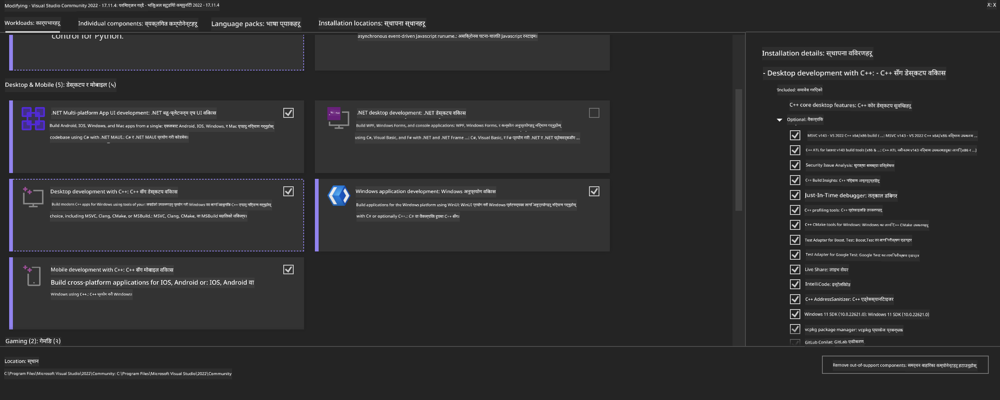
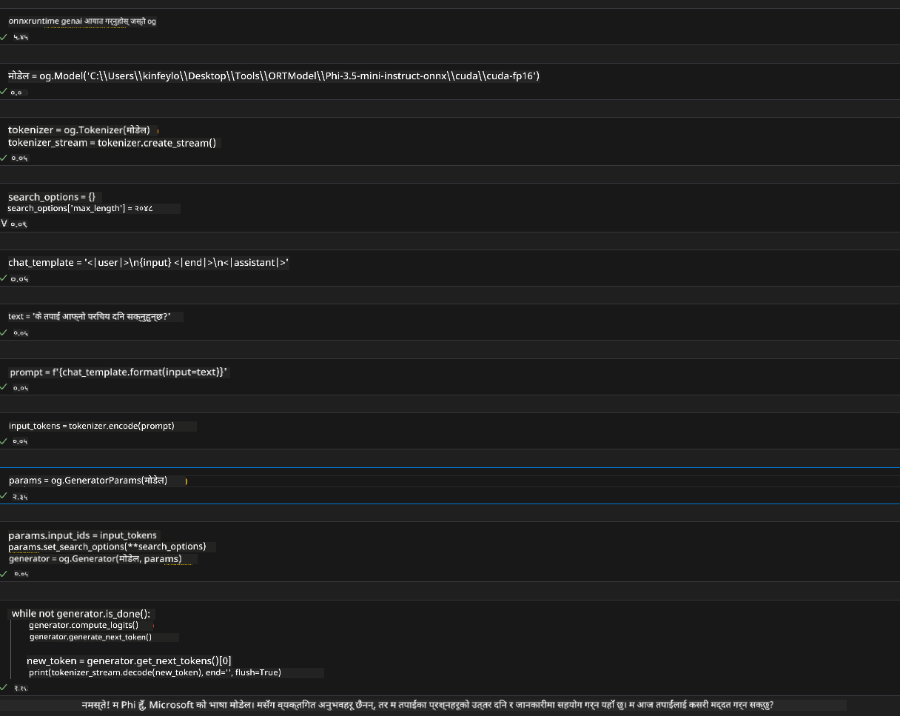
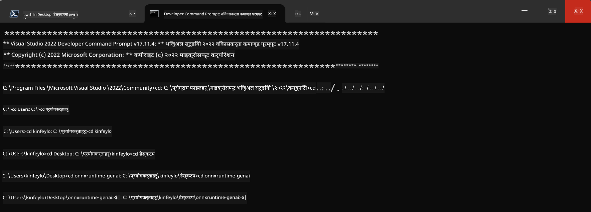

<!--
CO_OP_TRANSLATOR_METADATA:
{
  "original_hash": "b066fc29c1b2129df84e027cb75119ce",
  "translation_date": "2025-07-17T02:41:48+00:00",
  "source_file": "md/02.Application/01.TextAndChat/Phi3/ORTWindowGPUGuideline.md",
  "language_code": "ne"
}
-->
# **OnnxRuntime GenAI Windows GPU का लागि मार्गनिर्देशन**

यो मार्गनिर्देशनले Windows मा GPU सँग ONNX Runtime (ORT) सेटअप र प्रयोग गर्ने चरणहरू प्रदान गर्दछ। यसले तपाईंलाई GPU एक्सेलेरेशनको फाइदा उठाएर मोडेलहरूको प्रदर्शन र दक्षता सुधार गर्न मद्दत पुर्‍याउँछ।

यस दस्तावेजले निम्न विषयहरूमा मार्गदर्शन गर्दछ:

- वातावरण सेटअप: CUDA, cuDNN, र ONNX Runtime जस्ता आवश्यक निर्भरता स्थापना गर्ने निर्देशनहरू।
- कन्फिगरेसन: GPU स्रोतहरू प्रभावकारी रूपमा प्रयोग गर्न वातावरण र ONNX Runtime कसरी कन्फिगर गर्ने।
- अनुकूलन सुझावहरू: उत्कृष्ट प्रदर्शनका लागि GPU सेटिङहरू कसरी परिमार्जन गर्ने सल्लाहहरू।

### **1. Python 3.10.x /3.11.8**

   ***Note*** तपाईंको Python वातावरणको लागि [miniforge](https://github.com/conda-forge/miniforge/releases/latest/download/Miniforge3-Windows-x86_64.exe) प्रयोग गर्न सिफारिस गरिन्छ

   ```bash

   conda create -n pydev python==3.11.8

   conda activate pydev

   ```

   ***Reminder*** यदि तपाईंले पहिले Python ONNX लाइब्रेरी स्थापना गर्नुभएको छ भने, कृपया यसलाई अनइन्स्टल गर्नुहोस्

### **2. winget मार्फत CMake स्थापना गर्नुहोस्**

   ```bash

   winget install -e --id Kitware.CMake

   ```

### **3. Visual Studio 2022 - Desktop Development with C++ स्थापना गर्नुहोस्**

   ***Note*** यदि तपाईंले कम्पाइल गर्न चाहनुहुन्न भने यो चरण छोड्न सक्नुहुन्छ



### **4. NVIDIA ड्राइभर स्थापना गर्नुहोस्**

1. **NVIDIA GPU Driver**  [https://www.nvidia.com/en-us/drivers/](https://www.nvidia.com/en-us/drivers/)

2. **NVIDIA CUDA 12.4** [https://developer.nvidia.com/cuda-12-4-0-download-archive](https://developer.nvidia.com/cuda-12-4-0-download-archive)

3. **NVIDIA CUDNN 9.4**  [https://developer.nvidia.com/cudnn-downloads](https://developer.nvidia.com/cudnn-downloads)

***Reminder*** कृपया स्थापना प्रक्रियामा डिफल्ट सेटिङहरू प्रयोग गर्नुहोस्

### **5. NVIDIA वातावरण सेट गर्नुहोस्**

NVIDIA CUDNN 9.4 को lib, bin, include फोल्डरहरू NVIDIA CUDA 12.4 को lib, bin, include मा कपी गर्नुहोस्

- *'C:\Program Files\NVIDIA\CUDNN\v9.4\bin\12.6'* का फाइलहरू *'C:\Program Files\NVIDIA GPU Computing Toolkit\CUDA\v12.4\bin'* मा कपी गर्नुहोस्

- *'C:\Program Files\NVIDIA\CUDNN\v9.4\include\12.6'* का फाइलहरू *'C:\Program Files\NVIDIA GPU Computing Toolkit\CUDA\v12.4\include'* मा कपी गर्नुहोस्

- *'C:\Program Files\NVIDIA\CUDNN\v9.4\lib\12.6'* का फाइलहरू *'C:\Program Files\NVIDIA GPU Computing Toolkit\CUDA\v12.4\lib\x64'* मा कपी गर्नुहोस्

### **6. Phi-3.5-mini-instruct-onnx डाउनलोड गर्नुहोस्**

   ```bash

   winget install -e --id Git.Git

   winget install -e --id GitHub.GitLFS

   git lfs install

   git clone https://huggingface.co/microsoft/Phi-3.5-mini-instruct-onnx

   ```

### **7. InferencePhi35Instruct.ipynb चलाउनुहोस्**

   [Notebook](../../../../../../code/09.UpdateSamples/Aug/ortgpu-phi35-instruct.ipynb) खोल्नुहोस् र कार्यान्वयन गर्नुहोस्



### **8. ORT GenAI GPU कम्पाइल गर्नुहोस्**

   ***Note*** 
   
   1. कृपया सबै onnx, onnxruntime, र onnxruntime-genai लाई पहिले अनइन्स्टल गर्नुहोस्

   ```bash

   pip list 
   
   ```

   त्यसपछि सबै onnxruntime लाइब्रेरीहरू अनइन्स्टल गर्नुहोस्, जस्तै:

   ```bash

   pip uninstall onnxruntime

   pip uninstall onnxruntime-genai

   pip uninstall onnxruntume-genai-cuda
   
   ```

   2. Visual Studio Extension समर्थन जाँच गर्नुहोस्

   C:\Program Files\NVIDIA GPU Computing Toolkit\CUDA\v12.4\extras मा गएर सुनिश्चित गर्नुहोस् कि C:\Program Files\NVIDIA GPU Computing Toolkit\CUDA\v12.4\extras\visual_studio_integration फोल्डर छ। 

   यदि फेला परेन भने, अन्य CUDA toolkit ड्राइभर फोल्डरहरू जाँच्नुहोस् र visual_studio_integration फोल्डर र त्यसका सामग्रीहरू C:\Program Files\NVIDIA GPU Computing Toolkit\CUDA\v12.4\extras\visual_studio_integration मा कपी गर्नुहोस्

   - यदि तपाईंले कम्पाइल गर्न चाहनुहुन्न भने यो चरण छोड्न सक्नुहुन्छ

   ```bash

   git clone https://github.com/microsoft/onnxruntime-genai

   ```

   - [https://github.com/microsoft/onnxruntime/releases/download/v1.19.2/onnxruntime-win-x64-gpu-1.19.2.zip](https://github.com/microsoft/onnxruntime/releases/download/v1.19.2/onnxruntime-win-x64-gpu-1.19.2.zip) बाट डाउनलोड गर्नुहोस्

   - onnxruntime-win-x64-gpu-1.19.2.zip अनजिप गरी यसलाई **ort** नाम दिनुहोस्, र ort फोल्डरलाई onnxruntime-genai मा कपी गर्नुहोस्

   - Windows Terminal प्रयोग गरी VS 2022 को Developer Command Prompt खोल्नुहोस् र onnxruntime-genai मा जानुहोस्



   - तपाईंको Python वातावरणसँग कम्पाइल गर्नुहोस्

   ```bash

   cd onnxruntime-genai

   python build.py --use_cuda  --cuda_home "C:\Program Files\NVIDIA GPU Computing Toolkit\CUDA\v12.4" --config Release
 

   cd build/Windows/Release/Wheel

   pip install .whl

   ```

**अस्वीकरण**:  
यो दस्तावेज AI अनुवाद सेवा [Co-op Translator](https://github.com/Azure/co-op-translator) प्रयोग गरी अनुवाद गरिएको हो। हामी शुद्धताका लागि प्रयासरत छौं, तर कृपया ध्यान दिनुहोस् कि स्वचालित अनुवादमा त्रुटि वा अशुद्धता हुन सक्छ। मूल दस्तावेज यसको मूल भाषामा नै अधिकारिक स्रोत मानिनु पर्छ। महत्वपूर्ण जानकारीका लागि व्यावसायिक मानव अनुवाद सिफारिस गरिन्छ। यस अनुवादको प्रयोगबाट उत्पन्न कुनै पनि गलतफहमी वा गलत व्याख्याका लागि हामी जिम्मेवार छैनौं।