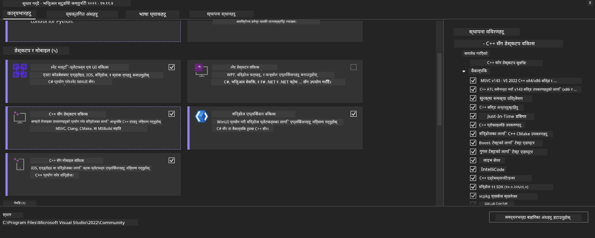
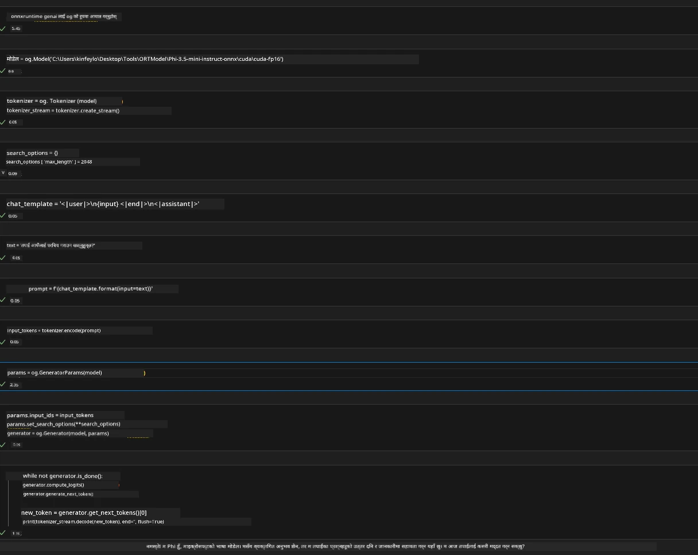
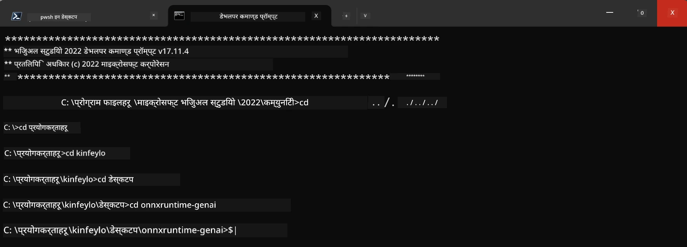

# **OnnxRuntime GenAI Windows GPU को लागि मार्गनिर्देशन**

यो मार्गनिर्देशन Windows मा GPU हरुसँग ONNX Runtime (ORT) सेटअप र प्रयोग गर्ने चरणहरू प्रदान गर्दछ। यो तपाईका मोडेलहरूका लागि GPU एक्सेलेरेशन उपयोग गर्ने मद्दत गर्न डिजाइन गरिएको हो, जसले प्रदर्शन र दक्षता सुधार गर्छ।

दस्तावेजले निम्न विषयमा मार्गनिर्देशन प्रदान गर्दछ:

- वातावरण सेटअप: CUDA, cuDNN, र ONNX Runtime जस्ता आवश्यक निर्भरता स्थापना गर्ने निर्देशन।
- कन्फिगरेसन: वातावरण र ONNX Runtime लाई GPU स्रोतहरू प्रभावकारी रूपमा उपयोग गर्न कसरी कन्फिगर गर्ने।
- अनुकूलन सुझावहरू: तपाईंको GPU सेटिङहरूलाई उत्कृष्ट प्रदर्शनका लागि कसरी ठीकठाक पार्ने सल्लाह।

### **1. Python 3.10.x /3.11.8**

   ***सूचना*** तपाईंको Python वातावरणको रूपमा [miniforge](https://github.com/conda-forge/miniforge/releases/latest/download/Miniforge3-Windows-x86_64.exe) प्रयोग गर्न सुझाव दिइन्छ

   ```bash

   conda create -n pydev python==3.11.8

   conda activate pydev

   ```

   ***स्मरण*** यदि तपाईंले Python ONNX लाइब्रेरी केही स्थापना गर्नुभएको छ भने कृपया यसलाई अनइन्स्टल गर्नुहोस्

### **2. winget प्रयोग गरी CMake स्थापना गर्नुहोस्**


   ```bash

   winget install -e --id Kitware.CMake

   ```

### **3. Visual Studio 2022 - C++ सहित डेस्कटप विकास स्थापना गर्नुहोस्**

   ***सूचना*** तपाईं कम्पाइल गर्न नचाहनुहुन्छ भने यो चरण छोड्न सक्नुहुन्छ




### **4. NVIDIA ड्राइभर स्थापना गर्नुहोस्**

1. **NVIDIA GPU ड्राइभर**  [https://www.nvidia.com/en-us/drivers/](https://www.nvidia.com/en-us/drivers/)

2. **NVIDIA CUDA 12.4** [https://developer.nvidia.com/cuda-12-4-0-download-archive](https://developer.nvidia.com/cuda-12-4-0-download-archive)

3. **NVIDIA CUDNN 9.4**  [https://developer.nvidia.com/cudnn-downloads](https://developer.nvidia.com/cudnn-downloads)

***स्मरण*** कृपया स्थापना प्रक्रियामा पूर्वनिर्धारित सेटिङहरू प्रयोग गर्नुहोस् 

### **5. NVIDIA वातावरण सेट गर्नुहोस्**

NVIDIA CUDNN 9.4 का lib, bin, include फाइलहरू NVIDIA CUDA 12.4 का lib, bin, include फोल्डरहरूमा कपी गर्नुहोस्

- *'C:\Program Files\NVIDIA\CUDNN\v9.4\bin\12.6'* का फाइलहरूलाई *'C:\Program Files\NVIDIA GPU Computing Toolkit\CUDA\v12.4\bin'* मा कपी गर्नुहोस्

- *'C:\Program Files\NVIDIA\CUDNN\v9.4\include\12.6'* का फाइलहरूलाई *'C:\Program Files\NVIDIA GPU Computing Toolkit\CUDA\v12.4\include'* मा कपी गर्नुहोस्

- *'C:\Program Files\NVIDIA\CUDNN\v9.4\lib\12.6'* का फाइलहरूलाई *'C:\Program Files\NVIDIA GPU Computing Toolkit\CUDA\v12.4\lib\x64'* मा कपी गर्नुहोस्


### **6. Phi-3.5-mini-instruct-onnx डाउनलोड गर्नुहोस्**


   ```bash

   winget install -e --id Git.Git

   winget install -e --id GitHub.GitLFS

   git lfs install

   git clone https://huggingface.co/microsoft/Phi-3.5-mini-instruct-onnx

   ```

### **7. InferencePhi35Instruct.ipynb चलाउनुहोस्**

   [Notebook](../../../../code/09.UpdateSamples/Aug/ortgpu-phi35-instruct.ipynb) खोल्नुहोस् र निष्पादन गर्नुहोस् 





### **8. ORT GenAI GPU कम्पाइल गर्नुहोस्**


   ***सूचना*** 
   
   1. कृपया सर्वप्रथम सबै onnx, onnxruntime, र onnxruntime-genai लाई अनइन्स्टल गर्नुहोस्

   
   ```bash

   pip list 
   
   ```

   त्यसपछि सबै onnxruntime लाइब्रेरीहरूलाई अनइन्स्टल गर्नुहोस् जस्तै 


   ```bash

   pip uninstall onnxruntime

   pip uninstall onnxruntime-genai

   pip uninstall onnxruntume-genai-cuda
   
   ```

   2. Visual Studio एक्सटेन्सन समर्थन जाँच गर्नुहोस् 

   C:\Program Files\NVIDIA GPU Computing Toolkit\CUDA\v12.4\extras मा हेर्नुहोस् र सुनिश्चित गर्नुहोस् कि C:\Program Files\NVIDIA GPU Computing Toolkit\CUDA\v12.4\extras\visual_studio_integration फोल्डर छ। 
   
   नभए अन्य CUDA toolkit ड्राइभर फोल्डरहरू जाँच गर्नुहोस् र visual_studio_integration फोल्डर र सामग्रीहरू C:\Program Files\NVIDIA GPU Computing Toolkit\CUDA\v12.4\extras\visual_studio_integration मा कपी गर्नुहोस्


   - तपाईं कम्पाइल गर्न नचाहनुहुन्छ भने यो चरण छोड्न सक्नुहुन्छ


   ```bash

   git clone https://github.com/microsoft/onnxruntime-genai

   ```

   - [https://github.com/microsoft/onnxruntime/releases/download/v1.19.2/onnxruntime-win-x64-gpu-1.19.2.zip](https://github.com/microsoft/onnxruntime/releases/download/v1.19.2/onnxruntime-win-x64-gpu-1.19.2.zip) बाट डाउनलोड गर्नुहोस्

   - onnxruntime-win-x64-gpu-1.19.2.zip अनजिप गर्नुहोस्, र यसलाई **ort** भनेर नामाकरण गरी ort फोल्डर onnxruntime-genai मा कपी गर्नुहोस्

   - Windows Terminal प्रयोग गरी, Developer Command Prompt for VS 2022 मा जानुहोस् र onnxruntime-genai मा जानुहोस् 



   - तपाईंको Python वातावरणसँग यसलाई कम्पाइल गर्नुहोस्

   
   ```bash

   cd onnxruntime-genai

   python build.py --use_cuda  --cuda_home "C:\Program Files\NVIDIA GPU Computing Toolkit\CUDA\v12.4" --config Release
 

   cd build/Windows/Release/Wheel

   pip install .whl

   ```

---

<!-- CO-OP TRANSLATOR DISCLAIMER START -->
**अस्वीकरण**:
यो दस्तावेज़ AI अनुवाद सेवा [Co-op Translator](https://github.com/Azure/co-op-translator) प्रयोग गरेर अनुवाद गरिएको हो। हामी सही हुन प्रयास गर्छौं, तर कृपया जानकार हुनुस् कि स्वचालित अनुवादमा त्रुटिहरू वा अशुद्धताहरू हुन सक्छन्। मूल दस्तावेज़ यसको मूल भाषामा आधिकारिक स्रोत मानिनुपर्छ। महत्वपूर्ण जानकारीका लागि व्यावसायिक मानव अनुवाद सिफारिस गरिन्छ। यस अनुवादको प्रयोगबाट उत्पन्न कुनै पनि गलत बुझाइ वा त्रुटिको लागि हामी जिम्मेवार छैनौं।
<!-- CO-OP TRANSLATOR DISCLAIMER END -->