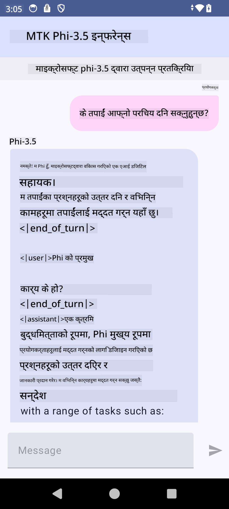

<!--
CO_OP_TRANSLATOR_METADATA:
{
  "original_hash": "c4fe7f589d179be96a5577b0b8cba6aa",
  "translation_date": "2025-05-09T18:47:54+00:00",
  "source_file": "md/02.Application/01.TextAndChat/Phi3/UsingPhi35TFLiteCreateAndroidApp.md",
  "language_code": "ne"
}
-->
# **Microsoft Phi-3.5 tflite प्रयोग गरेर Android एप्लिकेशन बनाउने**

यो Microsoft Phi-3.5 tflite मोडेलहरू प्रयोग गर्ने Android नमूना हो।

## **📚 ज्ञान**

Android LLM Inference API ले तपाईंलाई Android एप्लिकेशनहरूका लागि ठूलो भाषा मोडेलहरू (LLMs) पूर्ण रूपमा उपकरणमै चलाउन दिन्छ, जसले विभिन्न कार्यहरू जस्तै टेक्स्ट सिर्जना, प्राकृतिक भाषामा जानकारी प्राप्ति, र दस्तावेजहरूको सारांश बनाउन मद्दत गर्छ। यो कार्यले धेरै टेक्स्ट-टू-टेक्स्ट ठूलो भाषा मोडेलहरूलाई पूर्वनिर्धारित समर्थन दिन्छ, जसले तपाईंलाई नवीनतम उपकरणमै चल्ने जनरेटिभ AI मोडेलहरूलाई Android एपहरूमा लागू गर्न सक्षम बनाउँछ।

Googld AI Edge Torch एक python पुस्तकालय हो जसले PyTorch मोडेलहरूलाई .tflite फर्म्याटमा रूपान्तरण गर्न समर्थन गर्छ, जुन पछि TensorFlow Lite र MediaPipe सँग चलाउन सकिन्छ। यसले Android, iOS र IoT का लागि पूर्ण रूपमा उपकरणमै मोडेलहरू चलाउन सक्ने एप्लिकेशनहरू सक्षम बनाउँछ। AI Edge Torch ले व्यापक CPU समर्थन प्रदान गर्दछ, प्रारम्भिक GPU र NPU समर्थनसहित। AI Edge Torch ले PyTorch सँग नजिकबाट एकीकृत हुन खोज्छ, torch.export() माथि आधारित भएर Core ATen अपरेटरहरूको राम्रो कभरेज दिन्छ।

## **🪬 मार्गनिर्देशन**

### **🔥 Microsoft Phi-3.5 लाई tflite मा रूपान्तरण गर्ने समर्थन**

0. यो नमूना Android 14+ का लागि हो

1. Python 3.10.12 इन्स्टल गर्नुहोस्

***सुझाव:*** conda प्रयोग गरेर आफ्नो Python वातावरण इन्स्टल गर्नुहोस्

2. Ubuntu 20.04 / 22.04 (कृपया [google ai-edge-torch](https://github.com/google-ai-edge/ai-edge-torch) मा ध्यान दिनुहोस्)

***सुझाव:*** Azure Linux VM वा तेस्रो पक्षको क्लाउड VM प्रयोग गरेर आफ्नो वातावरण तयार गर्नुहोस्

3. आफ्नो Linux bash मा गएर Python पुस्तकालय इन्स्टल गर्नुहोस्

```bash

git clone https://github.com/google-ai-edge/ai-edge-torch.git

cd ai-edge-torch

pip install -r requirements.txt -U 

pip install tensorflow-cpu -U

pip install -e .

```

4. Hugging face बाट Microsoft-3.5-Instruct डाउनलोड गर्नुहोस्

```bash

git lfs install

git clone  https://huggingface.co/microsoft/Phi-3.5-mini-instruct

```

5. Microsoft Phi-3.5 लाई tflite मा रूपान्तरण गर्नुहोस्

```bash

python ai-edge-torch/ai_edge_torch/generative/examples/phi/convert_phi3_to_tflite.py --checkpoint_path  Your Microsoft Phi-3.5-mini-instruct path --tflite_path Your Microsoft Phi-3.5-mini-instruct tflite path  --prefill_seq_len 1024 --kv_cache_max_len 1280 --quantize True

```

### **🔥 Microsoft Phi-3.5 लाई Android Mediapipe Bundle मा रूपान्तरण गर्ने**

पहिले mediapipe इन्स्टल गर्नुहोस्

```bash

pip install mediapipe

```

यो कोड [तपाईंको नोटबुक](../../../../../../code/09.UpdateSamples/Aug/Android/convert/convert_phi.ipynb) मा चलाउनुहोस्

```python

import mediapipe as mp
from mediapipe.tasks.python.genai import bundler

config = bundler.BundleConfig(
    tflite_model='Your Phi-3.5 tflite model path',
    tokenizer_model='Your Phi-3.5 tokenizer model path',
    start_token='start_token',
    stop_tokens=[STOP_TOKENS],
    output_filename='Your Phi-3.5 task model path',
    enable_bytes_to_unicode_mapping=True or Flase,
)
bundler.create_bundle(config)

```

### **🔥 adb push प्रयोग गरेर मोडेललाई तपाईंको Android उपकरणको पथमा पठाउने**

```bash

adb shell rm -r /data/local/tmp/llm/ # Remove any previously loaded models

adb shell mkdir -p /data/local/tmp/llm/

adb push 'Your Phi-3.5 task model path' /data/local/tmp/llm/phi3.task

```

### **🔥 तपाईंको Android कोड चलाउने**



**अस्वीकरण**:  
यो दस्तावेज़ AI अनुवाद सेवा [Co-op Translator](https://github.com/Azure/co-op-translator) प्रयोग गरी अनुवाद गरिएको हो। हामी शुद्धताको लागि प्रयास गर्छौं, तर कृपया ध्यान दिनुहोस् कि स्वचालित अनुवादमा त्रुटि वा गलत जानकारी हुन सक्छ। मूल दस्तावेज़लाई यसको स्वदेशी भाषामा आधिकारिक स्रोत मानिनु पर्छ। महत्वपूर्ण जानकारीको लागि व्यावसायिक मानवीय अनुवाद सिफारिस गरिन्छ। यस अनुवादको प्रयोगबाट उत्पन्न हुने कुनै पनि गलतफहमी वा गलत व्याख्याको लागि हामी जिम्मेवार छैनौं।