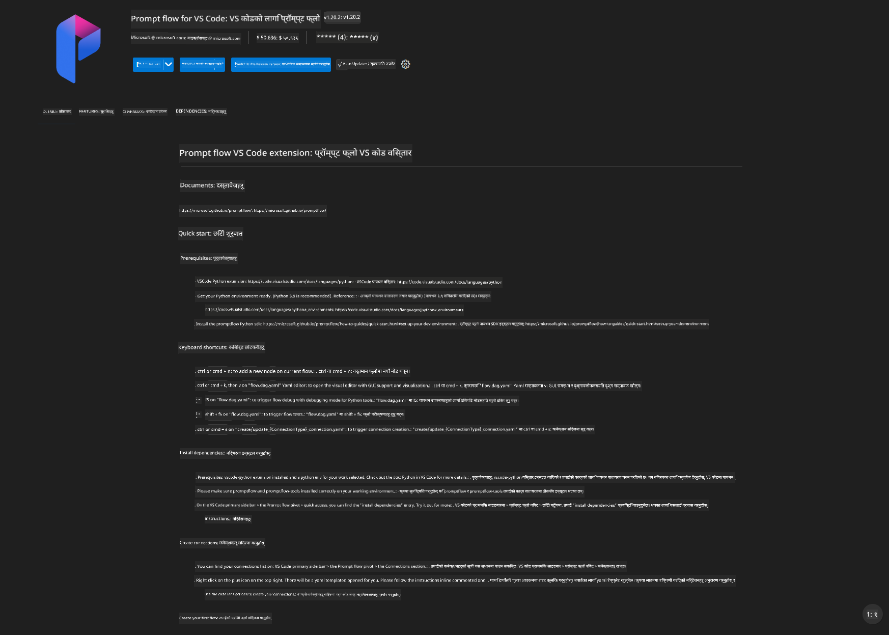
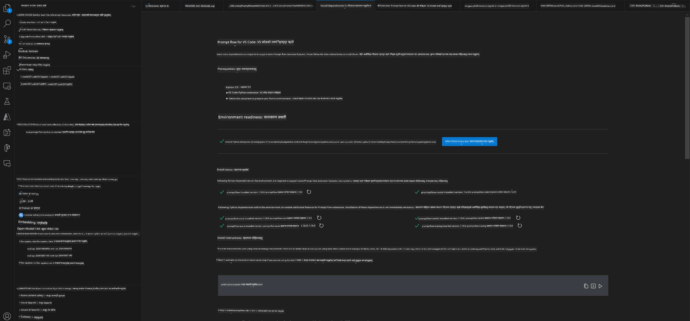
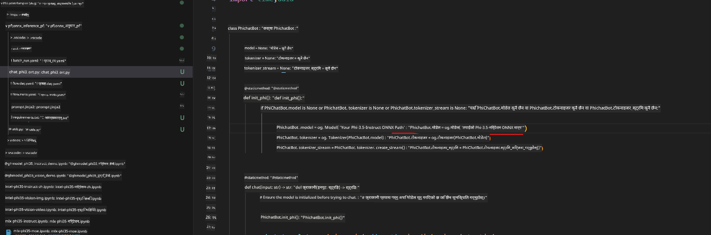
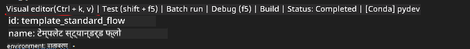
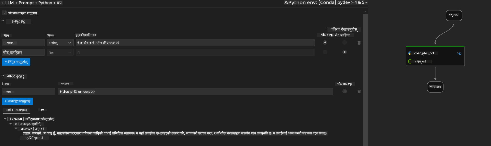
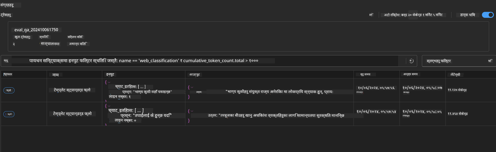

<!--
CO_OP_TRANSLATOR_METADATA:
{
  "original_hash": "92e7dac1e5af0dd7c94170fdaf6860fe",
  "translation_date": "2025-05-09T18:51:47+00:00",
  "source_file": "md/02.Application/01.TextAndChat/Phi3/UsingPromptFlowWithONNX.md",
  "language_code": "ne"
}
-->
# Windows GPU प्रयोग गरी Phi-3.5-Instruct ONNX सँग Prompt flow समाधान सिर्जना गर्ने तरिका

तलको दस्तावेजले ONNX (Open Neural Network Exchange) सँग PromptFlow कसरी प्रयोग गर्ने भन्ने उदाहरण प्रस्तुत गर्दछ, जसले Phi-3 मोडेलहरूमा आधारित AI अनुप्रयोगहरू विकास गर्न सहयोग पुर्‍याउँछ।

PromptFlow एउटा विकास उपकरणहरूको सेट हो जसले LLM-आधारित (Large Language Model) AI अनुप्रयोगहरूको सम्पूर्ण विकास चक्रलाई सजिलो बनाउँछ, विचार निर्माणदेखि प्रोटोटाइपिङ, परीक्षण र मूल्याङ्कनसम्म।

PromptFlow लाई ONNX सँग एकीकृत गरेर, विकासकर्ताहरूले:

- मोडेल प्रदर्शन अनुकूलन गर्नुहोस्: ONNX प्रयोग गरेर प्रभावकारी मोडेल इन्फरेन्स र डिप्लोयमेन्ट गर्नुहोस्।
- विकास प्रक्रिया सरल बनाउनुहोस्: PromptFlow प्रयोग गरेर वर्कफ्लो व्यवस्थापन र दोहोरिने कार्यहरू स्वचालित गर्नुहोस्।
- सहकार्यलाई सुधार गर्नुहोस्: साझा विकास वातावरण प्रदान गरेर टिम सदस्यहरूबीच राम्रो सहकार्य सुनिश्चित गर्नुहोस्।

**Prompt flow** LLM-आधारित AI अनुप्रयोगहरूको सम्पूर्ण विकास चक्रलाई सजिलो बनाउने विकास उपकरणहरूको सेट हो, जसले विचार निर्माण, प्रोटोटाइपिङ, परीक्षण, मूल्याङ्कनदेखि उत्पादन डिप्लोयमेन्ट र अनुगमनसम्म मद्दत गर्दछ। यसले prompt engineering लाई धेरै सजिलो बनाउँछ र तपाईँलाई उत्पादन स्तरको गुणस्तरका साथ LLM एपहरू निर्माण गर्न सक्षम बनाउँछ।

Prompt flow OpenAI, Azure OpenAI Service, र अनुकूलनयोग्य मोडेलहरू (Huggingface, स्थानीय LLM/SLM) सँग जडान गर्न सक्छ। हामी Phi-3.5 को क्वान्टाइज्ड ONNX मोडेल स्थानीय अनुप्रयोगहरूमा डिप्लोय गर्ने योजना बनाउँदैछौं। Prompt flow ले हाम्रो व्यवसाय योजना बनाउन र Phi-3.5 आधारित स्थानीय समाधानहरू पूरा गर्न मद्दत गर्न सक्छ। यस उदाहरणमा, हामी Windows GPU मा आधारित Prompt flow समाधान पूरा गर्न ONNX Runtime GenAI Library सँग संयोजन गर्नेछौं।

## **इन्स्टलेसन**

### **Windows GPU का लागि ONNX Runtime GenAI**

Windows GPU का लागि ONNX Runtime GenAI सेटअप गर्न यो मार्गनिर्देशन पढ्नुहोस् [click here](./ORTWindowGPUGuideline.md)

### **VSCode मा Prompt flow सेटअप गर्नुहोस्**

1. Prompt flow VS Code Extension इन्स्टल गर्नुहोस्



2. Prompt flow VS Code Extension इन्स्टल गरेपछि, एक्सटेन्सनमा क्लिक गर्नुहोस् र **Installation dependencies** रोजेर यो मार्गनिर्देशन अनुसार तपाईँको वातावरणमा Prompt flow SDK इन्स्टल गर्नुहोस्



3. [Sample Code](../../../../../../code/09.UpdateSamples/Aug/pf/onnx_inference_pf) डाउनलोड गर्नुहोस् र VS Code मा यो नमुना खोल्नुहोस्


4. आफ्नो Python वातावरण छनोट गर्न **flow.dag.yaml** खोल्नुहोस्


   आफ्नो Phi-3.5-instruct ONNX मोडेल स्थान परिवर्तन गर्न **chat_phi3_ort.py** खोल्नुहोस्



5. तपाईँको prompt flow परीक्षण गर्न चलाउनुहोस्

**flow.dag.yaml** खोल्नुहोस् र visual editor मा क्लिक गर्नुहोस्



यसमा क्लिक गरेपछि, चलाएर परीक्षण गर्नुहोस्



1. थप परिणामहरू हेर्न टर्मिनलमा ब्याच चलाउन सक्नुहुन्छ

```bash

pf run create --file batch_run.yaml --stream --name 'Your eval qa name'    

```

तपाईँले आफ्नो डिफल्ट ब्राउजरमा परिणामहरू जाँच गर्न सक्नुहुन्छ



**अस्वीकरण**:  
यो दस्तावेज़ AI अनुवाद सेवा [Co-op Translator](https://github.com/Azure/co-op-translator) प्रयोग गरी अनुवाद गरिएको हो। हामी शुद्धताको लागि प्रयास गर्छौं, तर कृपया जानकार हुनुहोस् कि स्वचालित अनुवादमा त्रुटि वा गलतफहमी हुन सक्दछ। मूल दस्तावेज़ यसको मातृ भाषामा नै अधिकारिक स्रोत मानिनु पर्छ। महत्वपूर्ण जानकारीको लागि व्यावसायिक मानव अनुवाद सिफारिस गरिन्छ। यस अनुवादको प्रयोगबाट उत्पन्न कुनै पनि गलतफहमी वा गलत व्याख्याको लागि हामी जिम्मेवार छैनौं।