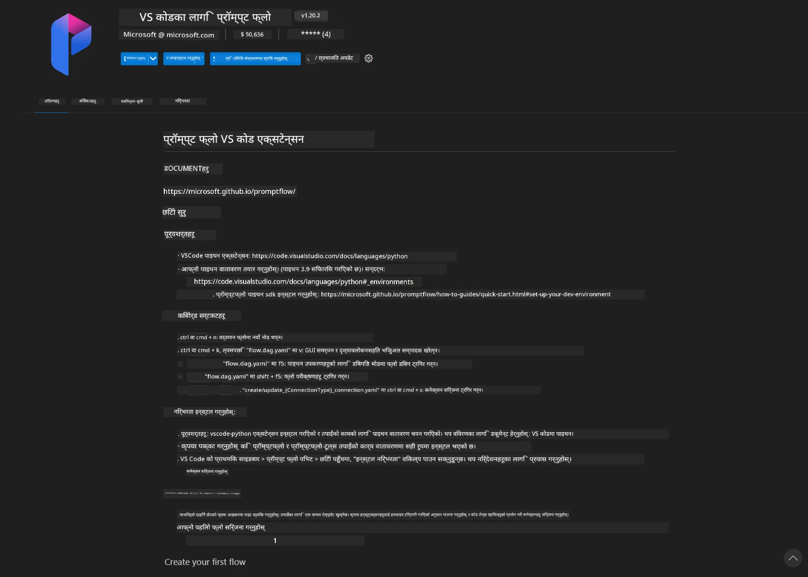
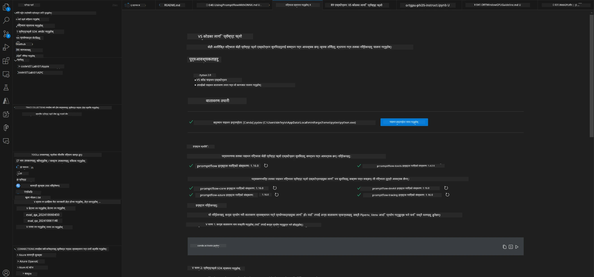
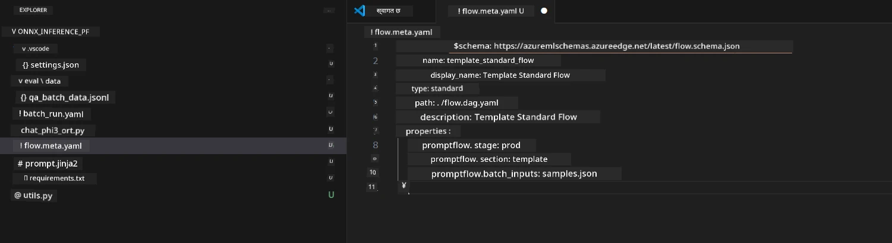
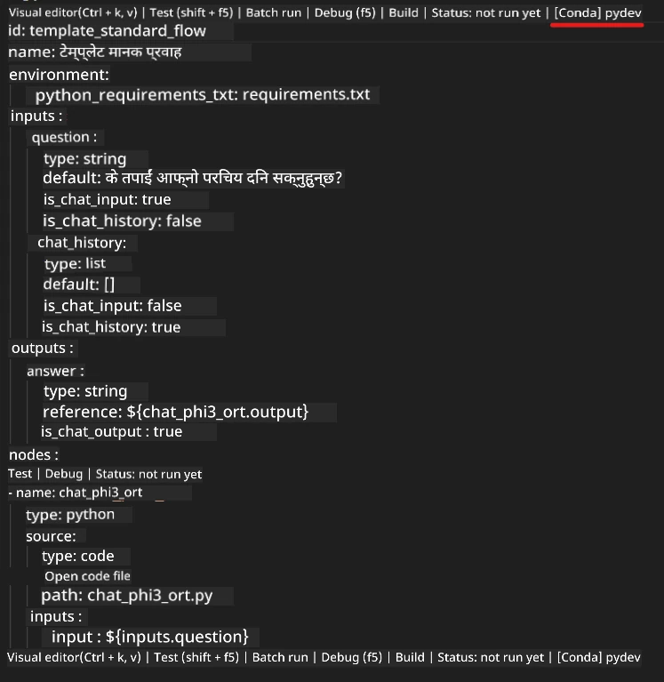
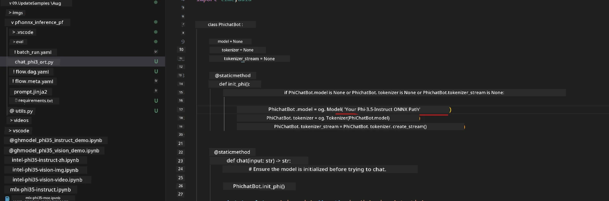
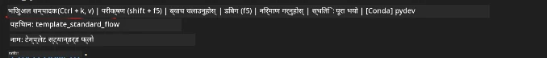
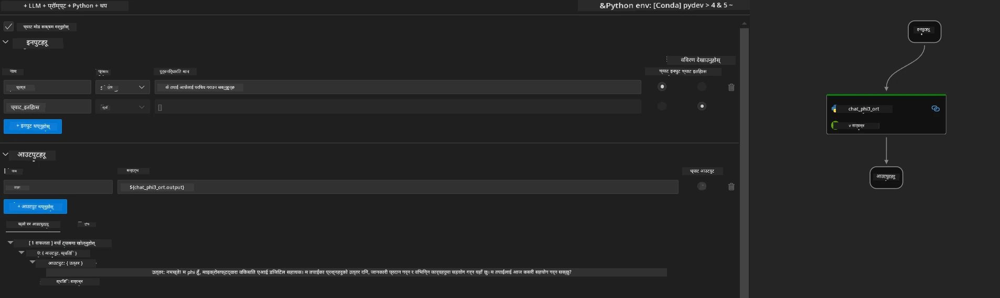
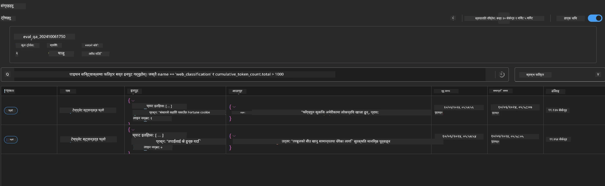

<!--
CO_OP_TRANSLATOR_METADATA:
{
  "original_hash": "92e7dac1e5af0dd7c94170fdaf6860fe",
  "translation_date": "2025-07-17T02:59:11+00:00",
  "source_file": "md/02.Application/01.TextAndChat/Phi3/UsingPromptFlowWithONNX.md",
  "language_code": "ne"
}
-->
# Windows GPU प्रयोग गरेर Phi-3.5-Instruct ONNX सँग Prompt flow समाधान बनाउने तरिका

तलको दस्तावेजले Phi-3 मोडेलहरूमा आधारित AI अनुप्रयोग विकासका लागि ONNX (Open Neural Network Exchange) सँग PromptFlow कसरी प्रयोग गर्ने भन्ने उदाहरण प्रस्तुत गर्दछ।

PromptFlow LLM-आधारित (Large Language Model) AI अनुप्रयोगहरूको विकास चक्रलाई सहज बनाउन डिजाइन गरिएको विकास उपकरणहरूको सेट हो, जसले विचार निर्माणदेखि प्रोटोटाइपिङ, परीक्षण र मूल्यांकनसम्मको प्रक्रिया समेट्छ।

PromptFlow लाई ONNX सँग एकीकृत गरेर विकासकर्ताहरूले:

- मोडेल प्रदर्शन सुधार गर्न सक्छन्: ONNX को प्रयोगले मोडेल इन्फरेन्स र डिप्लोयमेन्टलाई प्रभावकारी बनाउँछ।
- विकास प्रक्रिया सरल बनाउँछ: PromptFlow ले कार्यप्रवाह व्यवस्थापन र दोहोरिने कामहरू स्वचालित बनाउँछ।
- सहकार्यलाई बढावा दिन्छ: एकीकृत विकास वातावरण प्रदान गरेर टोली सदस्यहरूबीच राम्रो सहकार्य सम्भव बनाउँछ।

**Prompt flow** LLM-आधारित AI अनुप्रयोगहरूको विकास चक्रलाई विचार निर्माण, प्रोटोटाइपिङ, परीक्षण, मूल्यांकनदेखि उत्पादन डिप्लोयमेन्ट र अनुगमनसम्म सहज बनाउन डिजाइन गरिएको विकास उपकरणहरूको सेट हो। यसले prompt engineering लाई धेरै सजिलो बनाउँछ र उत्पादन गुणस्तरका LLM अनुप्रयोगहरू बनाउन सक्षम बनाउँछ।

Prompt flow ले OpenAI, Azure OpenAI Service, र अनुकूलनयोग्य मोडेलहरू (Huggingface, स्थानीय LLM/SLM) सँग जडान गर्न सक्छ। हामी Phi-3.5 को क्वान्टाइज्ड ONNX मोडेललाई स्थानीय अनुप्रयोगहरूमा डिप्लोय गर्न चाहन्छौं। Prompt flow ले हामीलाई हाम्रो व्यवसाय राम्रोसँग योजना बनाउन र Phi-3.5 आधारित स्थानीय समाधानहरू पूरा गर्न मद्दत गर्न सक्छ। यस उदाहरणमा, हामी Windows GPU मा आधारित Prompt flow समाधान पूरा गर्न ONNX Runtime GenAI Library सँग संयोजन गर्नेछौं।

## **इन्स्टलेशन**

### **Windows GPU का लागि ONNX Runtime GenAI**

Windows GPU का लागि ONNX Runtime GenAI सेटअप गर्न यो मार्गनिर्देशन पढ्नुहोस् [यहाँ क्लिक गर्नुहोस्](./ORTWindowGPUGuideline.md)

### **VSCode मा Prompt flow सेटअप गर्ने तरिका**

1. Prompt flow VS Code Extension इन्स्टल गर्नुहोस्



2. Prompt flow VS Code Extension इन्स्टल गरेपछि, एक्सटेन्सनमा क्लिक गरी **Installation dependencies** रोज्नुहोस् र यस मार्गनिर्देशन अनुसार आफ्नो वातावरणमा Prompt flow SDK इन्स्टल गर्नुहोस्



3. [Sample Code](../../../../../../code/09.UpdateSamples/Aug/pf/onnx_inference_pf) डाउनलोड गरी VS Code मा खोल्नुहोस्



4. **flow.dag.yaml** खोल्नुहोस् र आफ्नो Python वातावरण चयन गर्नुहोस्



   **chat_phi3_ort.py** खोल्नुहोस् र आफ्नो Phi-3.5-instruct ONNX मोडेलको स्थान परिवर्तन गर्नुहोस्



5. आफ्नो prompt flow परीक्षण गर्न चलाउनुहोस्

**flow.dag.yaml** खोल्नुहोस् र visual editor मा क्लिक गर्नुहोस्



यसमा क्लिक गरेपछि, परीक्षण गर्न चलाउनुहोस्



1. थप परिणामहरू जाँच्न टर्मिनलमा ब्याच चलाउन सक्नुहुन्छ

```bash

pf run create --file batch_run.yaml --stream --name 'Your eval qa name'    

```

तपाईं आफ्नो डिफल्ट ब्राउजरमा परिणामहरू हेर्न सक्नुहुन्छ



**अस्वीकरण**:  
यो दस्तावेज AI अनुवाद सेवा [Co-op Translator](https://github.com/Azure/co-op-translator) प्रयोग गरी अनुवाद गरिएको हो। हामी शुद्धताका लागि प्रयासरत छौं, तर कृपया ध्यान दिनुहोस् कि स्वचालित अनुवादमा त्रुटि वा अशुद्धता हुनसक्छ। मूल दस्तावेज यसको मूल भाषामा नै अधिकारिक स्रोत मानिनुपर्छ। महत्वपूर्ण जानकारीका लागि व्यावसायिक मानव अनुवाद सिफारिस गरिन्छ। यस अनुवादको प्रयोगबाट उत्पन्न कुनै पनि गलतफहमी वा गलत व्याख्याका लागि हामी जिम्मेवार छैनौं।