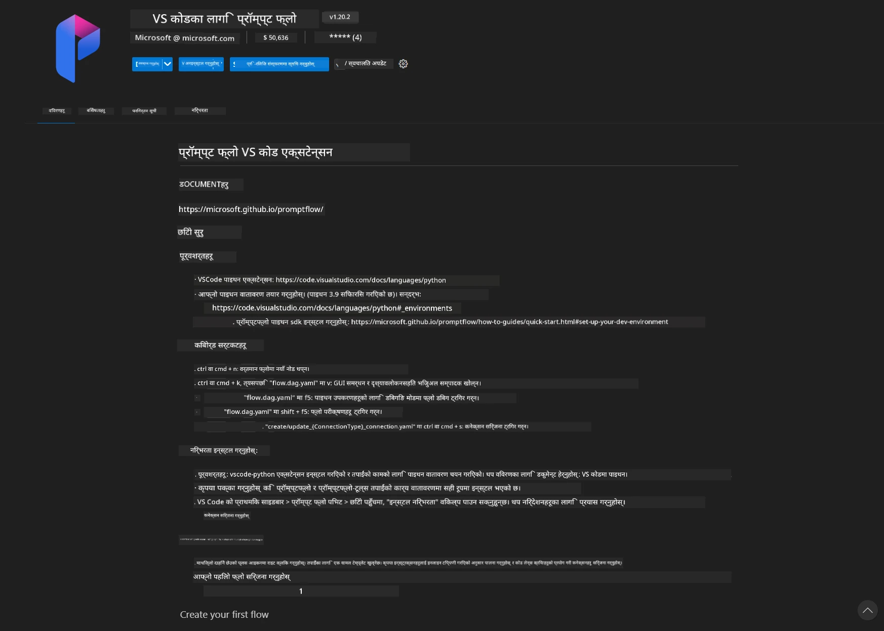
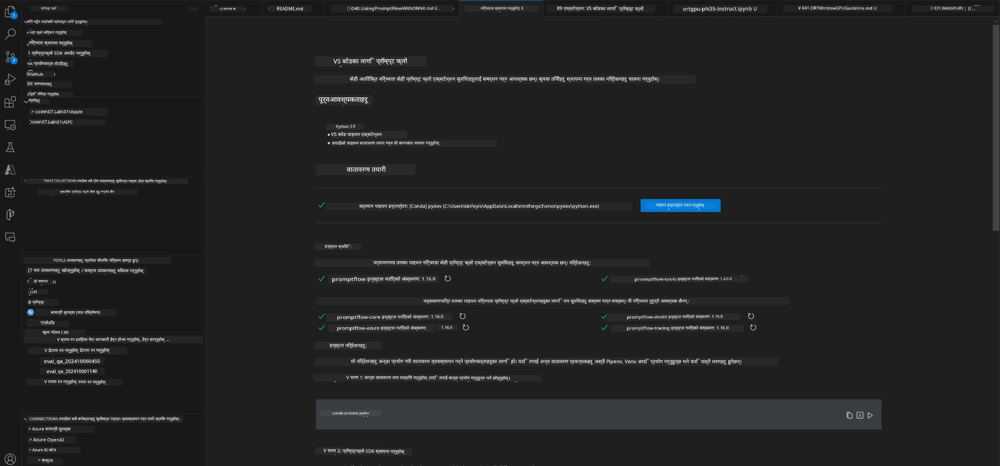
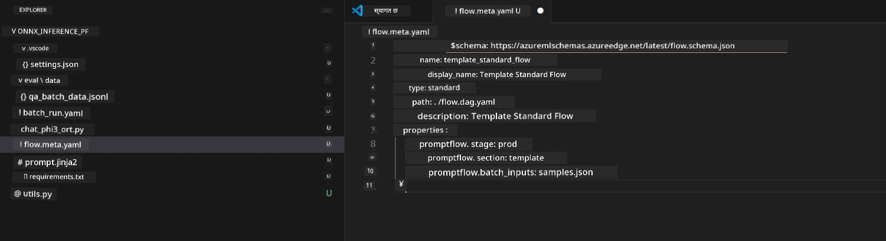
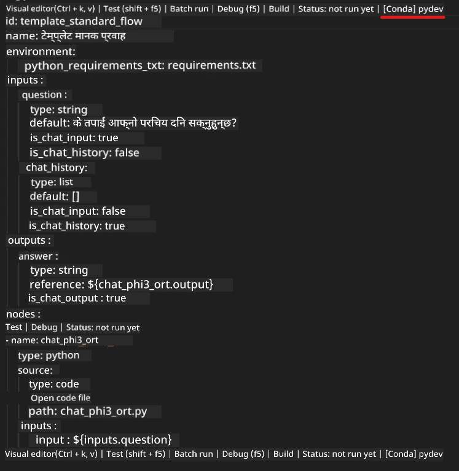
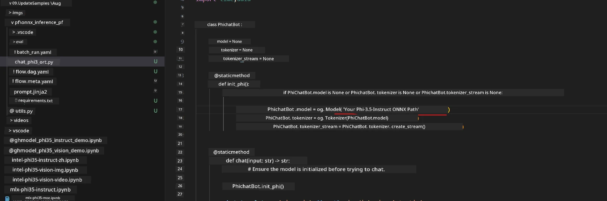
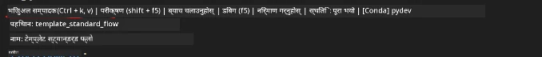
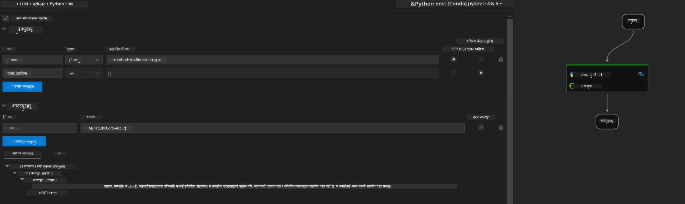
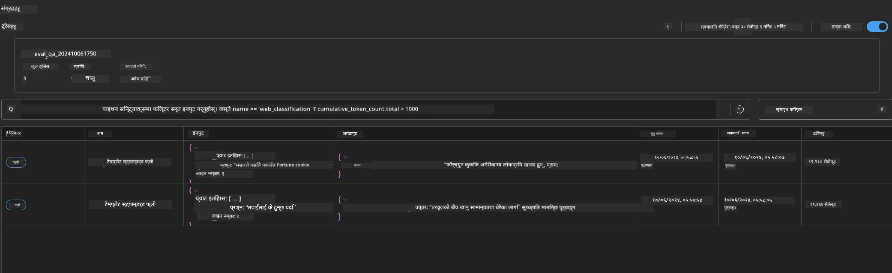

# Windows GPU प्रयोग गरेर Phi-3.5-Instruct ONNX सँग Prompt flow समाधान सिर्जना गर्ने तरिका 

तलको दस्तावेजले Phi-3 मोडेल आधारित AI अनुप्रयोग विकासको लागि ONNX (Open Neural Network Exchange) सँग PromptFlow कसरी प्रयोग गर्ने भन्ने उदाहरण प्रस्तुत गर्दछ।

PromptFlow LLM-आधारित (Large Language Model) AI अनुप्रयोगहरूको अन्त-देखि-अन्त विकास चक्रलाई सहज बनाउन डिजाइन गरिएको उपकरणहरूको सेट हो, जसमा विचार उत्पन्न गर्ने, प्रोटोटाइप बनाउने, परीक्षण गर्ने र मूल्याङ्कन सम्मका चरणहरू समावेश छन्।

PromptFlow लाई ONNX सँग एकीकृत गर्दा, विकासकर्ताहरूले निम्न कार्यहरू गर्न सक्छन्:

- मोडेल प्रदर्शन अनुकूलन गर्नुहोस्: दक्ष मोडेल इन्फरेन्स र परिनियोजनको लागि ONNX प्रयोग गर्नुहोस्।
- विकास सजिलो बनाउनुहोस्: कार्यप्रवाह व्यवस्थापन र दोहोरिने कार्यहरूसमेत स्वचालित गर्न PromptFlow प्रयोग गर्नुहोस्।
- सहकार्य वृद्धि गर्नुहोस्: एकीकृत विकास वातावरण प्रदान गरेर टोली सदस्यहरू बीच राम्रो सहकार्य सहज गर्नुहोस्।

**Prompt flow** भनेको LLM-आधारित AI अनुप्रयोगहरूको अन्त-देखि-अन्त विकास चक्रलाई सहज बनाउन डिजाइन गरिएको उपकरणहरूको सेट हो, जसमा विचार उत्पन्न गर्ने, प्रोटोटाइप बनाउने, परीक्षण गर्ने, मूल्याङ्कनदेखि उत्पादन वितरण र अनुगमन सम्मका चरणहरू छन्। यसले prompt engineering लाई धेरै सहज बनाउँछ र तपाईँलाई उत्पादन गुणस्तरका LLM अनुप्रयोगहरू निर्माण गर्न सक्षम पार्दछ।

Prompt flow ले OpenAI, Azure OpenAI सेवा, र अनुकूलनयोग्य मोडेलहरू (Huggingface, स्थानीय LLM/SLM) सँग जडान गर्न सक्छ। हामी Phi-3.5 को क्वान्टाइज्ड ONNX मोडेललाई स्थानीय अनुप्रयोगहरूमा परिनियोजित गर्ने अपेक्षा राख्छौं। Prompt flow ले हामीलाई हाम्रो व्यवसाय राम्रोसँग योजना बनाउन र Phi-3.5 आधारित स्थानीय समाधानहरू पूरा गर्न मद्दत पुऱ्याउँछ। यस उदाहरणमा, हामी Windows GPU आधारित Prompt flow समाधान पूरा गर्न ONNX Runtime GenAI लाइब्रेरीलाई संयोजन गर्नेछौं।

## **स्थापना**

### **Windows GPU का लागि ONNX Runtime GenAI**

Windows GPU का लागि ONNX Runtime GenAI सेटअप गर्न यो मार्गनिर्देशन पढ्नुहोस् [click here](./ORTWindowGPUGuideline.md)

### **VSCode मा Prompt flow सेटअप गर्नुहोस्**

1. Prompt flow VS Code Extension स्थापना गर्नुहोस्



2. Prompt flow VS Code Extension स्थापना गरेपछि, एक्सटेन्सनमा क्लिक गरी **Installation dependencies** रोज्नुहोस् र यो मार्गनिर्देशन अनुसार Prompt flow SDK तपाईँको वातावरणमा स्थापना गर्नुहोस्



3. [Sample Code](../../../../../../code/09.UpdateSamples/Aug/pf/onnx_inference_pf) डाउनलोड गरी VS Code मार्फत यो नमूना खोल्नुहोस्



4. **flow.dag.yaml** खोल्नुहोस् र आफ्नो Python वातावरण चयन गर्नुहोस्



   **chat_phi3_ort.py** खोल्नुहोस् र आफ्नो Phi-3.5-instruct ONNX मोडेलको स्थान परिवर्तन गर्नुहोस्



5. आफ्नो prompt flow परीक्षण गर्न चलाउनुहोस्

**flow.dag.yaml** खोल्नुहोस् र visual editor मा क्लिक गर्नुहोस्



यसमा क्लिक गरेपछि, यसलाई चलाएर परीक्षण गर्नुहोस्



1. थप नतिजा हेर्नको लागि टर्मिनलमा ब्याच चलाउन सक्नुहुन्छ


```bash

pf run create --file batch_run.yaml --stream --name 'Your eval qa name'    

```

आफ्नो पूर्वनिर्धारित ब्राउजरमा नतिजा हेर्न सक्नुहुन्छ




---

<!-- CO-OP TRANSLATOR DISCLAIMER START -->
**अस्वीकरण**:
यो दस्तावेज़ AI अनुवाद सेवा [Co-op Translator](https://github.com/Azure/co-op-translator) प्रयोग गरेर अनुवाद गरिएको हो। हामी सही हुन प्रयास गर्छौं, तर कृपया जानकार हुनुस् कि स्वचालित अनुवादमा त्रुटिहरू वा अशुद्धताहरू हुन सक्छन्। मूल दस्तावेज़ यसको मूल भाषामा आधिकारिक स्रोत मानिनुपर्छ। महत्वपूर्ण जानकारीका लागि व्यावसायिक मानव अनुवाद सिफारिस गरिन्छ। यस अनुवादको प्रयोगबाट उत्पन्न कुनै पनि गलत बुझाइ वा त्रुटिको लागि हामी जिम्मेवार छैनौं।
<!-- CO-OP TRANSLATOR DISCLAIMER END -->