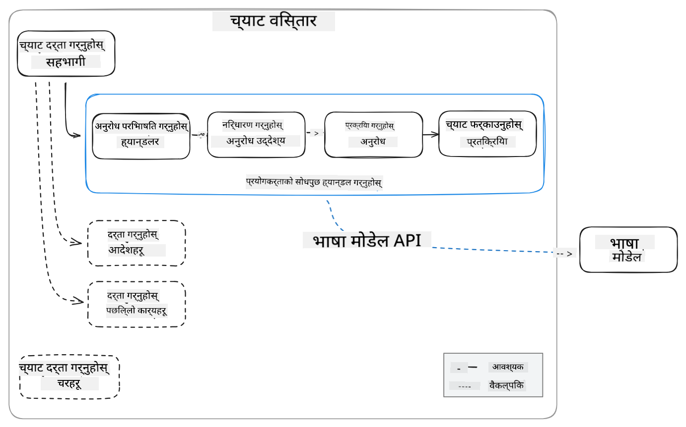

<!--
CO_OP_TRANSLATOR_METADATA:
{
  "original_hash": "35bf81388ac6917277b8d9a0c39bdc70",
  "translation_date": "2025-07-17T03:24:21+00:00",
  "source_file": "md/02.Application/02.Code/Phi3/CreateVSCodeChatAgentWithGitHubModels.md",
  "language_code": "ne"
}
-->
# **GitHub Models द्वारा Phi-3.5 सँग आफ्नो Visual Studio Code Chat Copilot Agent बनाउनुहोस्**

के तपाईं Visual Studio Code Copilot प्रयोग गर्दै हुनुहुन्छ? विशेष गरी Chat मा, तपाईंले विभिन्न एजेन्टहरू प्रयोग गरेर Visual Studio Code मा परियोजनाहरू सिर्जना, लेखन, र मर्मतसम्भार गर्ने क्षमता सुधार गर्न सक्नुहुन्छ। Visual Studio Code ले एउटा API प्रदान गर्दछ जसले कम्पनीहरू र व्यक्तिहरूलाई आफ्नो व्यवसाय अनुसार विभिन्न एजेन्टहरू सिर्जना गर्न अनुमति दिन्छ, जसले उनीहरूको विशिष्ट क्षेत्रहरूमा क्षमता विस्तार गर्न मद्दत गर्छ। यस लेखमा, हामी GitHub Models का **Phi-3.5-mini-instruct (128k)** र **Phi-3.5-vision-instruct (128k)** मा केन्द्रित भएर आफ्नो Visual Studio Code Agent कसरी बनाउने भन्ने कुरा हेर्नेछौं।

## **GitHub Models मा Phi-3.5 को बारेमा**

हामीलाई थाहा छ कि Phi-3/3.5-mini-instruct, Phi-3/3.5 परिवारमा, बलियो कोड बुझ्ने र सिर्जना गर्ने क्षमता राख्छ, र Gemma-2-9b र Mistral-Nemo-12B-instruct-2407 भन्दा केही फाइदा छ।


हालैका GitHub Models ले Phi-3.5-mini-instruct (128k) र Phi-3.5-vision-instruct (128k) मोडेलहरू पहुँचयोग्य गराइसकेका छन्। विकासकर्ताहरूले यी मोडेलहरू OpenAI SDK, Azure AI Inference SDK, र REST API मार्फत पहुँच गर्न सक्छन्।


***Note: *** यहाँ Azure AI Inference SDK प्रयोग गर्न सिफारिस गरिन्छ, किनभने यो उत्पादन वातावरणमा Azure Model Catalog सँग राम्रोसँग स्विच गर्न सक्छ।

तल GitHub Models सँग जोडिएपछि कोड सिर्जना परिदृश्यमा **Phi-3.5-mini-instruct (128k)** र **Phi-3.5-vision-instruct (128k)** का परिणामहरू छन्, साथै आगामी उदाहरणहरूको तयारी पनि गरिएको छ।

**Demo: GitHub Models Phi-3.5-mini-instruct (128k) बाट Prompt अनुसार कोड सिर्जना** ([यो लिंकमा क्लिक गर्नुहोस्](../../../../../../code/09.UpdateSamples/Aug/ghmodel_phi35_instruct_demo.ipynb))

**Demo: GitHub Models Phi-3.5-vision-instruct (128k) बाट छवि अनुसार कोड सिर्जना** ([यो लिंकमा क्लिक गर्नुहोस्](../../../../../../code/09.UpdateSamples/Aug/ghmodel_phi35_vision_demo.ipynb))


## **GitHub Copilot Chat Agent को बारेमा**

GitHub Copilot Chat Agent ले कोडको आधारमा विभिन्न परियोजना परिदृश्यहरूमा फरक-फरक कार्यहरू पूरा गर्न सक्छ। प्रणालीमा चार एजेन्टहरू छन्: workspace, github, terminal, vscode


एजेन्टको नामसँग ‘@’ थपेर तपाईं छिटो सम्बन्धित काम पूरा गर्न सक्नुहुन्छ। उद्यमहरूको लागि, यदि तपाईंले आफ्नो व्यवसायसँग सम्बन्धित सामग्री जस्तै आवश्यकताहरू, कोडिङ, परीक्षण विशिष्टता, र रिलिज थप्नुभयो भने, GitHub Copilot मा आधारित अझ शक्तिशाली निजी उद्यम सुविधाहरू प्राप्त गर्न सक्नुहुन्छ।

Visual Studio Code Chat Agent ले अब आधिकारिक रूपमा आफ्नो API जारी गरेको छ, जसले उद्यमहरू वा उद्यम विकासकर्ताहरूलाई फरक सफ्टवेयर व्यवसाय इकोसिस्टमहरूमा आधारित एजेन्टहरू विकास गर्न अनुमति दिन्छ। Visual Studio Code Extension Development को विकास विधिमा आधारित भएर, तपाईं सजिलै Visual Studio Code Chat Agent API को इन्टरफेस पहुँच गर्न सक्नुहुन्छ। हामी यस प्रक्रियामा आधारित विकास गर्न सक्छौं।



विकास परिदृश्यले तेस्रो पक्ष मोडेल API हरू (जस्तै GitHub Models, Azure Model Catalog, र खुला स्रोत मोडेलहरूमा आधारित स्वनिर्मित सेवाहरू) पहुँच समर्थन गर्दछ र GitHub Copilot द्वारा प्रदान गरिएका gpt-35-turbo, gpt-4, र gpt-4o मोडेलहरू पनि प्रयोग गर्न सक्छ।

## **Phi-3.5 मा आधारित @phicoding एजेन्ट थप्नुहोस्**

हामी Phi-3.5 को प्रोग्रामिङ क्षमताहरूलाई एकीकृत गरेर कोड लेखन, छवि सिर्जना कोड, र अन्य कार्यहरू पूरा गर्ने प्रयास गर्दैछौं। Phi-3.5 वरिपरि निर्मित @PHI नामक एजेन्ट पूरा गर्नुहोस्, तल केही कार्यहरू छन्:

1. GitHub Copilot द्वारा प्रदान गरिएको GPT-4o मा आधारित आत्मपरिचय **@phicoding /help** कमाण्ड मार्फत सिर्जना गर्नुहोस्।

2. **Phi-3.5-mini-instruct (128k)** मा आधारित विभिन्न प्रोग्रामिङ भाषाहरूको कोड **@phicoding /gen** कमाण्ड मार्फत सिर्जना गर्नुहोस्।

3. **Phi-3.5-vision-instruct (128k)** र छवि पूर्ति मा आधारित कोड **@phicoding /image** कमाण्ड मार्फत सिर्जना गर्नुहोस्।


## **सम्बन्धित चरणहरू**

1. npm प्रयोग गरेर Visual Studio Code Extension विकास समर्थन स्थापना गर्नुहोस्

```bash

npm install --global yo generator-code 

```
2. Visual Studio Code Extension प्लगइन सिर्जना गर्नुहोस् (Typescript विकास मोड प्रयोग गरी, नाम phiext राख्नुहोस्)

```bash

yo code 

```

3. सिर्जना गरिएको परियोजना खोल्नुहोस् र package.json परिमार्जन गर्नुहोस्। यहाँ सम्बन्धित निर्देशनहरू र कन्फिगरेसनहरू छन्, साथै GitHub Models को कन्फिगरेसन पनि। ध्यान दिनुहोस् कि तपाईंले यहाँ आफ्नो GitHub Models टोकन थप्न आवश्यक छ।

```json

{
  "name": "phiext",
  "displayName": "phiext",
  "description": "",
  "version": "0.0.1",
  "engines": {
    "vscode": "^1.93.0"
  },
  "categories": [
    "AI",
    "Chat"
  ],
  "activationEvents": [],
  "enabledApiProposals": [
      "chatVariableResolver"
  ],
  "main": "./dist/extension.js",
  "contributes": {
    "chatParticipants": [
        {
            "id": "chat.phicoding",
            "name": "phicoding",
            "description": "Hey! I am Microsoft Phi-3.5, She can help me with coding problems, such as generation code with your natural language, or even generation code about chart from images. Just ask me anything!",
            "isSticky": true,
            "commands": [
                {
                    "name": "help",
                    "description": "Introduce myself to you"
                },
                {
                    "name": "gen",
                    "description": "Generate code for you with Microsoft Phi-3.5-mini-instruct"
                },
                {
                    "name": "image",
                    "description": "Generate code for chart from image(png or jpg) with Microsoft Phi-3.5-vision-instruct, please add image url like this : https://ajaytech.co/wp-content/uploads/2019/09/index.png"
                }
            ]
        }
    ],
    "commands": [
        {
            "command": "phicoding.namesInEditor",
            "title": "Use Microsoft Phi 3.5 in Editor"
        }
    ],
    "configuration": {
      "type": "object",
      "title": "githubmodels",
      "properties": {
        "githubmodels.endpoint": {
          "type": "string",
          "default": "https://models.inference.ai.azure.com",
          "description": "Your GitHub Models Endpoint",
          "order": 0
        },
        "githubmodels.api_key": {
          "type": "string",
          "default": "Your GitHub Models Token",
          "description": "Your GitHub Models Token",
          "order": 1
        },
        "githubmodels.phi35instruct": {
          "type": "string",
          "default": "Phi-3.5-mini-instruct",
          "description": "Your Phi-35-Instruct Model",
          "order": 2
        },
        "githubmodels.phi35vision": {
          "type": "string",
          "default": "Phi-3.5-vision-instruct",
          "description": "Your Phi-35-Vision Model",
          "order": 3
        }
      }
    }
  },
  "scripts": {
    "vscode:prepublish": "npm run package",
    "compile": "webpack",
    "watch": "webpack --watch",
    "package": "webpack --mode production --devtool hidden-source-map",
    "compile-tests": "tsc -p . --outDir out",
    "watch-tests": "tsc -p . -w --outDir out",
    "pretest": "npm run compile-tests && npm run compile && npm run lint",
    "lint": "eslint src",
    "test": "vscode-test"
  },
  "devDependencies": {
    "@types/vscode": "^1.93.0",
    "@types/mocha": "^10.0.7",
    "@types/node": "20.x",
    "@typescript-eslint/eslint-plugin": "^8.3.0",
    "@typescript-eslint/parser": "^8.3.0",
    "eslint": "^9.9.1",
    "typescript": "^5.5.4",
    "ts-loader": "^9.5.1",
    "webpack": "^5.94.0",
    "webpack-cli": "^5.1.4",
    "@vscode/test-cli": "^0.0.10",
    "@vscode/test-electron": "^2.4.1"
  },
  "dependencies": {
    "@types/node-fetch": "^2.6.11",
    "node-fetch": "^3.3.2",
    "@azure-rest/ai-inference": "latest",
    "@azure/core-auth": "latest",
    "@azure/core-sse": "latest"
  }
}


```

4. src/extension.ts परिमार्जन गर्नुहोस्

```typescript

// The module 'vscode' contains the VS Code extensibility API
// Import the module and reference it with the alias vscode in your code below
import * as vscode from 'vscode';
import ModelClient from "@azure-rest/ai-inference";
import { AzureKeyCredential } from "@azure/core-auth";


interface IPhiChatResult extends vscode.ChatResult {
    metadata: {
        command: string;
    };
}


const MODEL_SELECTOR: vscode.LanguageModelChatSelector = { vendor: 'copilot', family: 'gpt-4o' };

function isValidImageUrl(url: string): boolean {
    const regex = /^(https?:\/\/.*\.(?:png|jpg))$/i;
    return regex.test(url);
}
  

// This method is called when your extension is activated
// Your extension is activated the very first time the command is executed
export function activate(context: vscode.ExtensionContext) {

    const codinghandler: vscode.ChatRequestHandler = async (request: vscode.ChatRequest, context: vscode.ChatContext, stream: vscode.ChatResponseStream, token: vscode.CancellationToken): Promise<IPhiChatResult> => {


        const config : any = vscode.workspace.getConfiguration('githubmodels');
        const endPoint: string = config.get('endpoint');
        const apiKey: string = config.get('api_key');
        const phi35instruct: string = config.get('phi35instruct');
        const phi35vision: string = config.get('phi35vision');
        
        if (request.command === 'help') {

            const content = "Welcome to Coding assistant with Microsoft Phi-3.5"; 
            stream.progress(content);


            try {
                const [model] = await vscode.lm.selectChatModels(MODEL_SELECTOR);
                if (model) {
                    const messages = [
                        vscode.LanguageModelChatMessage.User("Please help me express this content in a humorous way: I am a programming assistant who can help you convert natural language into code and generate code based on the charts in the images. output format like this : Hey I am Phi ......")
                    ];
                    const chatResponse = await model.sendRequest(messages, {}, token);
                    for await (const fragment of chatResponse.text) {
                        stream.markdown(fragment);
                    }
                }
            } catch(err) {
                console.log(err);
            }


            return { metadata: { command: 'help' } };

        }

        
        if (request.command === 'gen') {

            const content = "Welcome to use phi-3.5 to generate code";

            stream.progress(content);

            const client = new ModelClient(endPoint, new AzureKeyCredential(apiKey));

            const response = await client.path("/chat/completions").post({
              body: {
                messages: [
                  { role:"system", content: "You are a coding assistant.Help answer all code generation questions." },
                  { role:"user", content: request.prompt }
                ],
                model: phi35instruct,
                temperature: 0.4,
                max_tokens: 1000,
                top_p: 1.
              }
            });

            stream.markdown(response.body.choices[0].message.content);

            return { metadata: { command: 'gen' } };

        }


        
        if (request.command === 'image') {


            const content = "Welcome to use phi-3.5 to generate code from image(png or jpg),image url like this:https://ajaytech.co/wp-content/uploads/2019/09/index.png";

            stream.progress(content);

            if (!isValidImageUrl(request.prompt)) {
                stream.markdown('Please provide a valid image URL');
                return { metadata: { command: 'image' } };
            }
            else
            {

                const client = new ModelClient(endPoint, new AzureKeyCredential(apiKey));
    
                const response = await client.path("/chat/completions").post({
                    body: {
                      messages: [
                        { role: "system", content: "You are a helpful assistant that describes images in details." },
                        { role: "user", content: [
                            { type: "text", text: "Please generate code according to the chart in the picture according to the following requirements\n1. Keep all information in the chart, including data and text\n2. Do not generate additional information that is not included in the chart\n3. Please extract data from the picture, do not generate it from csv\n4. Please save the regenerated chart as a chart and save it to ./output/demo.png"},
                            { type: "image_url", image_url: {url: request.prompt}
                            }
                          ]
                        }
                      ],
                      model: phi35vision,
                      temperature: 0.4,
                      max_tokens: 2048,
                      top_p: 1.
                    }
                  });
    
                
                stream.markdown(response.body.choices[0].message.content);
    
                return { metadata: { command: 'image' } };
            }


        }


        return { metadata: { command: '' } };
    };


    const phi_ext = vscode.chat.createChatParticipant("chat.phicoding", codinghandler);

    phi_ext.iconPath = new vscode.ThemeIcon('sparkle');


    phi_ext.followupProvider = {
        provideFollowups(result: IPhiChatResult, context: vscode.ChatContext, token: vscode.CancellationToken) {
            return [{
                prompt: 'Let us coding with Phi-3.5 😋😋😋😋',
                label: vscode.l10n.t('Enjoy coding with Phi-3.5'),
                command: 'help'
            } satisfies vscode.ChatFollowup];
        }
    };

    context.subscriptions.push(phi_ext);
}

// This method is called when your extension is deactivated
export function deactivate() {}


```

6. चलाउनुहोस्

***/help***


***@phicoding /help***


***@phicoding /gen***


***@phicoding /image***


तपाईं नमूना कोड डाउनलोड गर्न सक्नुहुन्छ: [यहाँ क्लिक गर्नुहोस्](../../../../../../code/09.UpdateSamples/Aug/vscode)

## **स्रोतहरू**

1. GitHub Models मा साइन अप गर्नुहोस् [https://gh.io/models](https://gh.io/models)

2. Visual Studio Code Extension Development सिक्नुहोस् [https://code.visualstudio.com/api/get-started/your-first-extension](https://code.visualstudio.com/api/get-started/your-first-extension)

3. Visual Studio Code Copilot Chat API को बारेमा जान्नुहोस् [https://code.visualstudio.com/api/extension-guides/chat](https://code.visualstudio.com/api/extension-guides/chat)

**अस्वीकरण**:  
यो दस्तावेज AI अनुवाद सेवा [Co-op Translator](https://github.com/Azure/co-op-translator) प्रयोग गरी अनुवाद गरिएको हो। हामी शुद्धताका लागि प्रयासरत छौं, तर कृपया ध्यान दिनुहोस् कि स्वचालित अनुवादमा त्रुटि वा अशुद्धता हुन सक्छ। मूल दस्तावेज यसको मूल भाषामा नै अधिकारिक स्रोत मानिनु पर्छ। महत्वपूर्ण जानकारीका लागि व्यावसायिक मानव अनुवाद सिफारिस गरिन्छ। यस अनुवादको प्रयोगबाट उत्पन्न कुनै पनि गलतफहमी वा गलत व्याख्याका लागि हामी जिम्मेवार छैनौं।