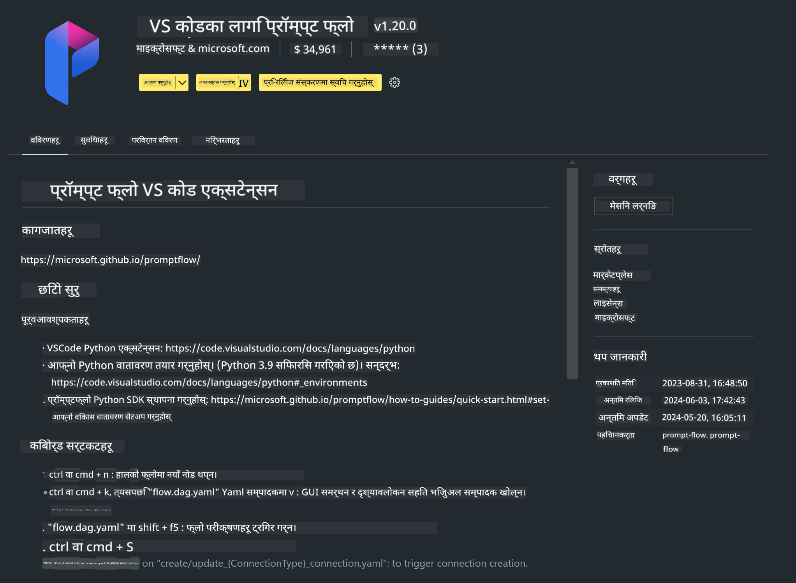

<!--
CO_OP_TRANSLATOR_METADATA:
{
  "original_hash": "a4ef39027902e82f2c33d568d2a2259a",
  "translation_date": "2025-07-17T03:49:30+00:00",
  "source_file": "md/02.Application/02.Code/Phi3/VSCodeExt/HOL/AIPC/01.Installations.md",
  "language_code": "ne"
}
-->
# **Lab 0 - स्थापना**

जब हामी Lab मा प्रवेश गर्छौं, हामीले सम्बन्धित वातावरण कन्फिगर गर्नुपर्छ :


### **1. Python 3.11+**

तपाईंको Python वातावरण कन्फिगर गर्न miniforge प्रयोग गर्न सिफारिस गरिन्छ

miniforge कन्फिगर गर्न, कृपया [https://github.com/conda-forge/miniforge](https://github.com/conda-forge/miniforge) हेर्नुहोस्

miniforge कन्फिगर गरेपछि, Power Shell मा तलको कमाण्ड चलाउनुहोस्

```bash

conda create -n pyenv python==3.11.8 -y

conda activate pyenv

```


### **2. Prompt flow SDK स्थापना गर्नुहोस्**

Lab 1 मा, हामी Prompt flow प्रयोग गर्छौं, त्यसैले तपाईंले Prompt flow SDK कन्फिगर गर्नुपर्छ।

```bash

pip install promptflow --upgrade

```

तपाईं यो कमाण्डमा promptflow sdk जाँच गर्न सक्नुहुन्छ


```bash

pf --version

```

### **3. Visual Studio Code Prompt flow Extension स्थापना गर्नुहोस्**




### **4. Intel NPU Acceleration Library**

Intel को नयाँ पुस्ताका प्रोसेसरहरूले NPU समर्थन गर्छन्। यदि तपाईंले LLMs / SLMs स्थानीय रूपमा चलाउन NPU प्रयोग गर्न चाहनुहुन्छ भने, तपाईं ***Intel NPU Acceleration Library*** प्रयोग गर्न सक्नुहुन्छ। थप जान्न चाहनुहुन्छ भने, [https://github.com/microsoft/PhiCookBook/blob/main/md/01.Introduction/03/AIPC_Inference.md](https://github.com/microsoft/PhiCookBook/blob/main/md/01.Introduction/03/AIPC_Inference.md) पढ्न सक्नुहुन्छ।

bash मा Intel NPU Acceleration Library स्थापना गर्नुहोस्


```bash

pip install intel-npu-acceleration-library

```

***Note***: कृपया ध्यान दिनुहोस् कि यो लाइब्रेरी transformers ***4.40.2*** लाई समर्थन गर्छ, कृपया संस्करण पुष्टि गर्नुहोस्


### **5. अन्य Python लाइब्रेरीहरू**


requirements.txt बनाउनुहोस् र यस सामग्री थप्नुहोस्

```txt

notebook
numpy 
scipy 
scikit-learn 
matplotlib 
pandas 
pillow 
graphviz

```


### **6. NVM स्थापना गर्नुहोस्**

Powershell मा nvm स्थापना गर्नुहोस्


```bash

winget install -e --id CoreyButler.NVMforWindows

```

nodejs 18.20 स्थापना गर्नुहोस्


```bash

nvm install 18.20.0

nvm use 18.20.0

```

### **7. Visual Studio Code Development Support स्थापना गर्नुहोस्**


```bash

npm install --global yo generator-code

```

बधाई छ! तपाईंले सफलतापूर्वक SDK कन्फिगर गर्नुभयो। अब, hands-on चरणहरूमा अगाडि बढ्नुहोस्।

**अस्वीकरण**:  
यो दस्तावेज AI अनुवाद सेवा [Co-op Translator](https://github.com/Azure/co-op-translator) प्रयोग गरी अनुवाद गरिएको हो। हामी शुद्धताका लागि प्रयासरत छौं, तर कृपया ध्यान दिनुहोस् कि स्वचालित अनुवादमा त्रुटि वा अशुद्धता हुन सक्छ। मूल दस्तावेज यसको मूल भाषामा नै अधिकारिक स्रोत मानिनु पर्छ। महत्वपूर्ण जानकारीका लागि व्यावसायिक मानव अनुवाद सिफारिस गरिन्छ। यस अनुवादको प्रयोगबाट उत्पन्न कुनै पनि गलतफहमी वा गलत व्याख्याका लागि हामी जिम्मेवार छैनौं।