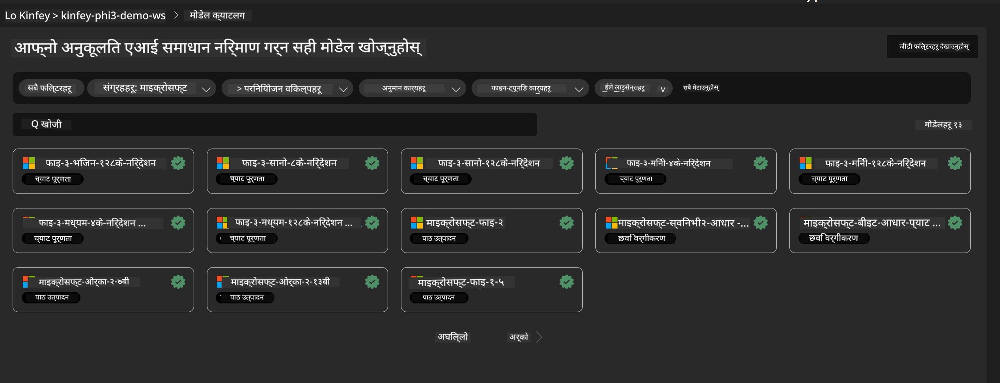
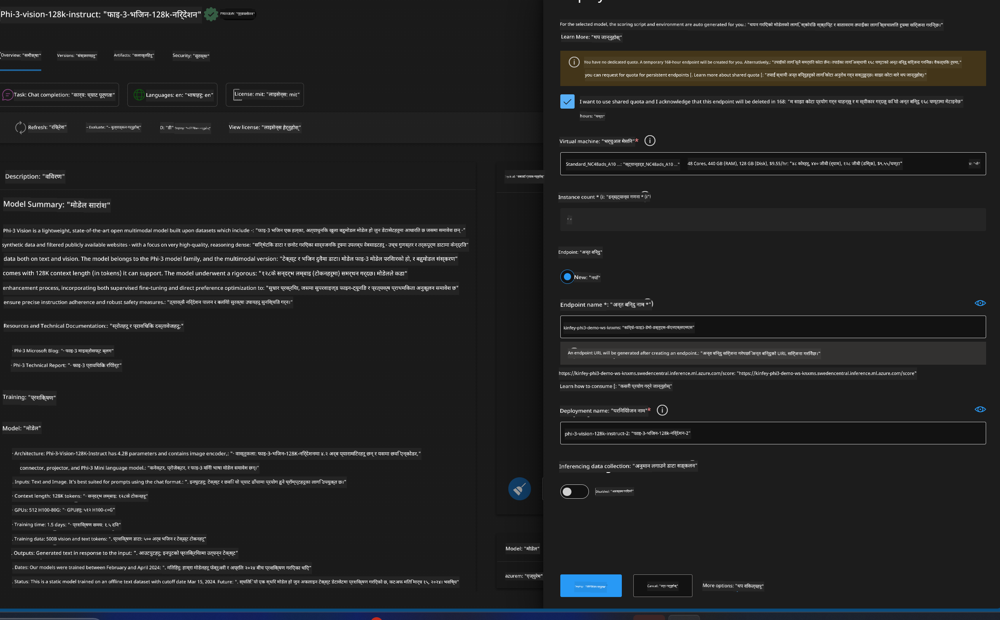
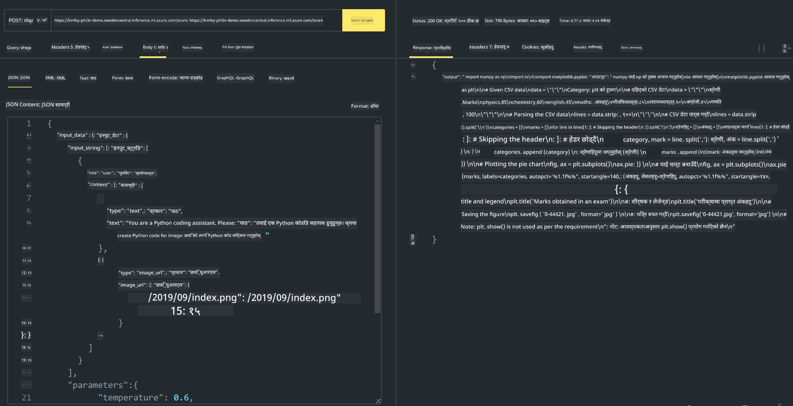

<!--
CO_OP_TRANSLATOR_METADATA:
{
  "original_hash": "20cb4e6ac1686248e8be913ccf6c2bc2",
  "translation_date": "2025-07-17T04:05:35+00:00",
  "source_file": "md/02.Application/02.Code/Phi3/VSCodeExt/HOL/AIPC/03.DeployPhi3VisionOnAzure.md",
  "language_code": "ne"
}
-->
# **प्रयोगशाला ३ - Azure Machine Learning Service मा Phi-3-vision तैनाथ गर्ने**

हामीले स्थानीय कोडको उत्पादन तैनाथी पूरा गर्न NPU प्रयोग गर्छौं, र त्यसपछि PHI-3-VISION लाई यसमार्फत परिचय गराएर तस्बिरबाट कोड उत्पन्न गर्ने क्षमता ल्याउन चाहन्छौं।

यस परिचयमा, हामी छिटो Azure Machine Learning Service मा Model As Service Phi-3 Vision सेवा निर्माण गर्न सक्छौं।

***Note***： Phi-3 Vision ले छिटो सामग्री उत्पन्न गर्न कम्प्युटिङ शक्ति आवश्यक पर्छ। यसका लागि हामीलाई क्लाउड कम्प्युटिङ शक्तिको सहयोग चाहिन्छ।


### **१. Azure Machine Learning Service सिर्जना गर्ने**

हामीले Azure Portal मा Azure Machine Learning Service सिर्जना गर्नुपर्छ। कसरी गर्ने जान्न चाहनुहुन्छ भने, कृपया यो लिंकमा जानुहोस् [https://learn.microsoft.com/azure/machine-learning/quickstart-create-resources?view=azureml-api-2](https://learn.microsoft.com/azure/machine-learning/quickstart-create-resources?view=azureml-api-2)


### **२. Azure Machine Learning Service मा Phi-3 Vision छान्ने**




### **३. Azure मा Phi-3-Vision तैनाथ गर्ने**





### **४. Postman मा Endpoint परीक्षण गर्ने**





***Note***

1. पठाउनुपर्ने प्यारामिटरहरूमा Authorization, azureml-model-deployment, र Content-Type समावेश हुनैपर्छ। तैनाथी जानकारी जाँचेर यी प्राप्त गर्नुपर्छ।

2. प्यारामिटरहरू पठाउन Phi-3-Vision ले तस्बिर लिंक पठाउन आवश्यक पर्छ। कृपया GPT-4-Vision विधि अनुसार प्यारामिटरहरू पठाउन सन्दर्भ लिनुहोस्, जस्तै

```json

{
  "input_data":{
    "input_string":[
      {
        "role":"user",
        "content":[ 
          {
            "type": "text",
            "text": "You are a Python coding assistant.Please create Python code for image "
          },
          {
              "type": "image_url",
              "image_url": {
                "url": "https://ajaytech.co/wp-content/uploads/2019/09/index.png"
              }
          }
        ]
      }
    ],
    "parameters":{
          "temperature": 0.6,
          "top_p": 0.9,
          "do_sample": false,
          "max_new_tokens": 2048
    }
  }
}

```

3. Post विधि प्रयोग गरी **/score** कल गर्नुहोस्

**बधाई छ**! तपाईंले छिटो PHI-3-VISION तैनाथी पूरा गर्नुभयो र तस्बिरबाट कोड कसरी उत्पन्न गर्ने प्रयास गर्नुभयो। अब हामी NPU र क्लाउडसँग मिलाएर अनुप्रयोगहरू निर्माण गर्न सक्छौं।

**अस्वीकरण**:  
यो दस्तावेज AI अनुवाद सेवा [Co-op Translator](https://github.com/Azure/co-op-translator) प्रयोग गरी अनुवाद गरिएको हो। हामी शुद्धताका लागि प्रयासरत छौं, तर कृपया ध्यान दिनुहोस् कि स्वचालित अनुवादमा त्रुटि वा अशुद्धता हुन सक्छ। मूल दस्तावेज यसको मूल भाषामा नै अधिकारिक स्रोत मानिनुपर्छ। महत्वपूर्ण जानकारीका लागि व्यावसायिक मानव अनुवाद सिफारिस गरिन्छ। यस अनुवादको प्रयोगबाट उत्पन्न कुनै पनि गलतफहमी वा गलत व्याख्याका लागि हामी जिम्मेवार छैनौं।