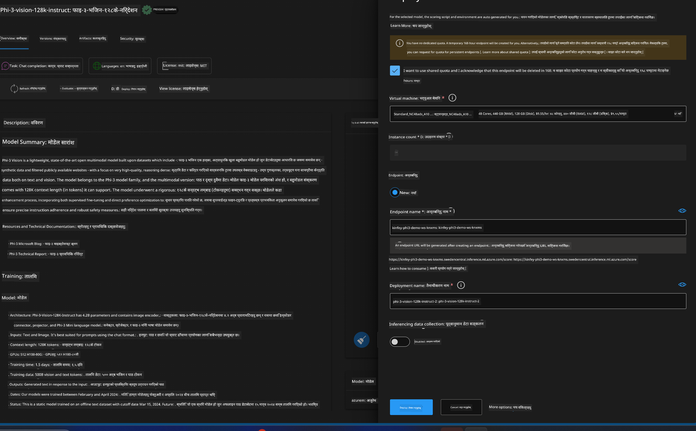
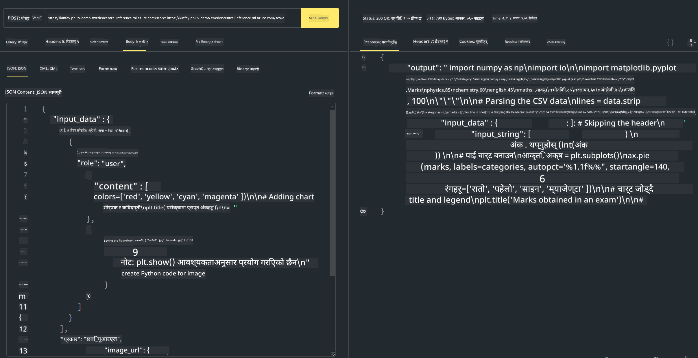

<!--
CO_OP_TRANSLATOR_METADATA:
{
  "original_hash": "20cb4e6ac1686248e8be913ccf6c2bc2",
  "translation_date": "2025-05-09T19:27:25+00:00",
  "source_file": "md/02.Application/02.Code/Phi3/VSCodeExt/HOL/AIPC/03.DeployPhi3VisionOnAzure.md",
  "language_code": "ne"
}
-->
# **Lab 3 - Azure Machine Learning Service मा Phi-3-vision तैनाथ गर्नुहोस्**

हामीले NPU प्रयोग गरेर स्थानीय कोडको उत्पादन तैनाथी पूरा गर्छौं, र त्यसपछि यसमा PHI-3-VISION समावेश गर्ने क्षमता थपेर तस्वीरबाट कोड उत्पन्न गर्ने लक्ष्य राख्छौं।

यस परिचयमा, हामी छिटो Azure Machine Learning Service मा Model As Service Phi-3 Vision सेवा निर्माण गर्न सक्छौं।

***Note***： Phi-3 Vision ले छिटो सामग्री उत्पादन गर्न कम्प्युटिङ शक्ति आवश्यक पर्छ। यसका लागि हामीलाई क्लाउड कम्प्युटिङ शक्ति चाहिन्छ।


### **1. Azure Machine Learning Service सिर्जना गर्नुहोस्**

हामीले Azure Portal मा Azure Machine Learning Service सिर्जना गर्नुपर्छ। कसरी गर्ने जान्नका लागि कृपया यो लिंक भ्रमण गर्नुहोस् [https://learn.microsoft.com/azure/machine-learning/quickstart-create-resources?view=azureml-api-2](https://learn.microsoft.com/azure/machine-learning/quickstart-create-resources?view=azureml-api-2)


### **2. Azure Machine Learning Service मा Phi-3 Vision चयन गर्नुहोस्**


### **3. Azure मा Phi-3-Vision तैनाथ गर्नुहोस्**





### **4. Postman मा Endpoint परीक्षण गर्नुहोस्**





***Note***

1. पठाउनुपर्ने प्यारामिटरहरूमा Authorization, azureml-model-deployment, र Content-Type समावेश हुनुपर्छ। तैनाथी जानकारीबाट यी प्राप्त गर्नुहोस्।

2. प्यारामिटर पठाउन Phi-3-Vision ले तस्बिर लिंक पठाउन आवश्यक पर्छ। कृपया GPT-4-Vision विधि अनुसार प्यारामिटर पठाउन सन्दर्भ लिनुहोस्, जस्तै

```json

{
  "input_data":{
    "input_string":[
      {
        "role":"user",
        "content":[ 
          {
            "type": "text",
            "text": "You are a Python coding assistant.Please create Python code for image "
          },
          {
              "type": "image_url",
              "image_url": {
                "url": "https://ajaytech.co/wp-content/uploads/2019/09/index.png"
              }
          }
        ]
      }
    ],
    "parameters":{
          "temperature": 0.6,
          "top_p": 0.9,
          "do_sample": false,
          "max_new_tokens": 2048
    }
  }
}

```

3. Post विधि प्रयोग गरी **/score** कल गर्नुहोस्

**बधाई छ**! तपाईंले छिटो PHI-3-VISION तैनाथी पूरा गर्नुभयो र तस्वीरबाट कोड कसरी उत्पन्न गर्ने सिक्नुभयो। अब हामी NPU र क्लाउडसँग मिलेर एप्लिकेशनहरू निर्माण गर्न सक्छौं।

**अस्वीकरण**:  
यो दस्तावेज AI अनुवाद सेवा [Co-op Translator](https://github.com/Azure/co-op-translator) प्रयोग गरी अनुवाद गरिएको हो। हामी शुद्धताको प्रयास गर्छौं, तर कृपया ध्यान दिनुहोस् कि स्वचालित अनुवादमा त्रुटि वा अशुद्धि हुन सक्छ। मूल दस्तावेज यसको मूल भाषामा नै आधिकारिक स्रोत मानिनु पर्छ। महत्वपूर्ण जानकारीको लागि व्यावसायिक मानव अनुवाद सिफारिस गरिन्छ। यस अनुवादको प्रयोगबाट उत्पन्न हुने कुनै पनि गलतफहमी वा गलत व्याख्याका लागि हामी जिम्मेवार छैनौं।