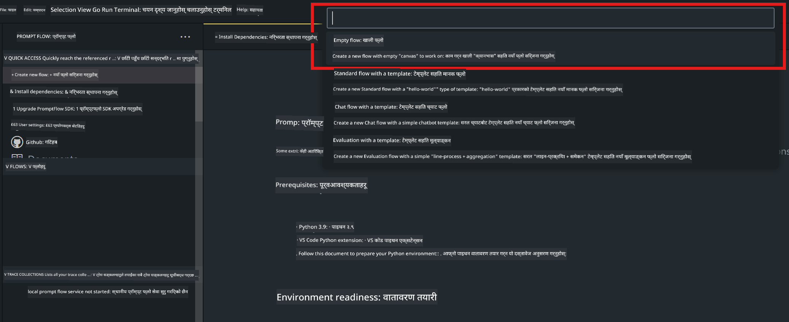
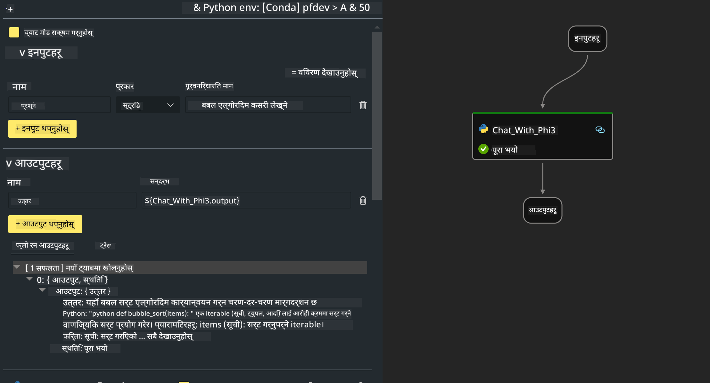

<!--
CO_OP_TRANSLATOR_METADATA:
{
  "original_hash": "3dbbf568625b1ee04b354c2dc81d3248",
  "translation_date": "2025-07-17T04:24:53+00:00",
  "source_file": "md/02.Application/02.Code/Phi3/VSCodeExt/HOL/Apple/02.PromptflowWithMLX.md",
  "language_code": "ne"
}
-->
# **Lab 2 - AIPC मा Phi-3-mini सँग Prompt flow चलाउने**

## **Prompt flow के हो**

Prompt flow LLM-आधारित AI अनुप्रयोगहरूको अन्त्यदेखि अन्त्य विकास चक्रलाई सहज बनाउन डिजाइन गरिएको विकास उपकरणहरूको सेट हो, जसले विचार निर्माण, प्रोटोटाइपिङ, परीक्षण, मूल्याङ्कनदेखि उत्पादन तैनाती र अनुगमनसम्म समेट्छ। यसले prompt engineering लाई धेरै सजिलो बनाउँछ र तपाईंलाई उत्पादन गुणस्तरका LLM एपहरू बनाउन सक्षम बनाउँछ।

Prompt flow सँग, तपाईंले गर्न सक्नुहुन्छ:

- LLMs, prompts, Python कोड र अन्य उपकरणहरूलाई एक कार्यान्वयनयोग्य workflow मा जोड्ने flows सिर्जना गर्न।

- तपाईंका flows लाई डिबग र पुनरावृत्ति गर्न, विशेष गरी LLMs सँगको अन्तरक्रिया सजिलैसँग।

- तपाईंका flows को मूल्याङ्कन गर्न, ठूलो डेटासेटहरूसँग गुणस्तर र प्रदर्शन मेट्रिक्स गणना गर्न।

- परीक्षण र मूल्याङ्कनलाई तपाईंको CI/CD प्रणालीमा एकीकृत गर्न ताकि तपाईंको flow को गुणस्तर सुनिश्चित होस्।

- तपाईंले रोजेको सेवा प्लेटफर्ममा तपाईंका flows तैनाथ गर्न वा सजिलैसँग तपाईंको एपको कोड बेसमा एकीकृत गर्न।

- (वैकल्पिक तर अत्यन्त सिफारिस गरिएको) Azure AI मा Prompt flow को क्लाउड संस्करण प्रयोग गरेर तपाईंको टोलीसँग सहकार्य गर्न।

## **Apple Silicon मा generation code flows बनाउने**

***Note*** ：यदि तपाईंले वातावरण स्थापना पूरा गर्नुभएको छैन भने, कृपया [Lab 0 -Installations](./01.Installations.md) हेर्नुहोस्।

1. Visual Studio Code मा Prompt flow Extension खोल्नुहोस् र खाली flow प्रोजेक्ट सिर्जना गर्नुहोस्।



2. Inputs र Outputs प्यारामिटरहरू थप्नुहोस् र नयाँ flow को रूपमा Python कोड थप्नुहोस्।



तपाईंले आफ्नो flow निर्माण गर्न यो संरचना (flow.dag.yaml) सन्दर्भ गर्न सक्नुहुन्छ।

```yaml

inputs:
  prompt:
    type: string
    default: Write python code for Fibonacci serie. Please use markdown as output
outputs:
  result:
    type: string
    reference: ${gen_code_by_phi3.output}
nodes:
- name: gen_code_by_phi3
  type: python
  source:
    type: code
    path: gen_code_by_phi3.py
  inputs:
    prompt: ${inputs.prompt}


```

3. phi-3-mini लाई quantify गर्नुहोस्

हामी स्थानीय उपकरणहरूमा SLM राम्रोसँग चलाउन चाहन्छौं। सामान्यतया, हामी मोडेललाई quantify गर्छौं (INT4, FP16, FP32)।

```bash

python -m mlx_lm.convert --hf-path microsoft/Phi-3-mini-4k-instruct

```

**Note:** डिफल्ट फोल्डर mlx_model हो।

4. ***Chat_With_Phi3.py*** मा कोड थप्नुहोस्।

```python


from promptflow import tool

from mlx_lm import load, generate


# The inputs section will change based on the arguments of the tool function, after you save the code
# Adding type to arguments and return value will help the system show the types properly
# Please update the function name/signature per need
@tool
def my_python_tool(prompt: str) -> str:

    model_id = './mlx_model_phi3_mini'

    model, tokenizer = load(model_id)

    # <|user|>\nWrite python code for Fibonacci serie. Please use markdown as output<|end|>\n<|assistant|>

    response = generate(model, tokenizer, prompt="<|user|>\n" + prompt  + "<|end|>\n<|assistant|>", max_tokens=2048, verbose=True)

    return response


```

4. तपाईं Debug वा Run बाट flow परीक्षण गर्न सक्नुहुन्छ कि generation code ठीक छ कि छैन।


5. टर्मिनलमा विकास API को रूपमा flow चलाउनुहोस्।

```

pf flow serve --source ./ --port 8080 --host localhost   

```

तपाईं यसलाई Postman / Thunder Client मा परीक्षण गर्न सक्नुहुन्छ।

### **Note**

1. पहिलो पटक चलाउँदा धेरै समय लाग्छ। Hugging face CLI बाट phi-3 मोडेल डाउनलोड गर्न सिफारिस गरिन्छ।

2. Intel NPU को सीमित कम्प्युटिङ शक्ति विचार गर्दा, Phi-3-mini-4k-instruct प्रयोग गर्न सिफारिस गरिन्छ।

3. हामी Intel NPU Acceleration प्रयोग गरेर INT4 रूपान्तरण क्वान्टाइज गर्छौं, तर सेवा पुन: चलाउँदा cache र nc_workshop फोल्डरहरू मेटाउन आवश्यक पर्छ।

## **स्रोतहरू**

1. Promptflow सिक्न [https://microsoft.github.io/promptflow/](https://microsoft.github.io/promptflow/)

2. Intel NPU Acceleration सिक्न [https://github.com/intel/intel-npu-acceleration-library](https://github.com/intel/intel-npu-acceleration-library)

3. नमूना कोड, डाउनलोड [Local NPU Agent Sample Code](../../../../../../../../../code/07.Lab/01/AIPC/local-npu-agent)

**अस्वीकरण**:  
यो दस्तावेज AI अनुवाद सेवा [Co-op Translator](https://github.com/Azure/co-op-translator) प्रयोग गरी अनुवाद गरिएको हो। हामी शुद्धताका लागि प्रयासरत छौं, तर कृपया ध्यान दिनुहोस् कि स्वचालित अनुवादमा त्रुटि वा अशुद्धता हुन सक्छ। मूल दस्तावेज यसको मूल भाषामा आधिकारिक स्रोत मानिनुपर्छ। महत्वपूर्ण जानकारीका लागि व्यावसायिक मानव अनुवाद सिफारिस गरिन्छ। यस अनुवादको प्रयोगबाट उत्पन्न कुनै पनि गलतफहमी वा गलत व्याख्याका लागि हामी जिम्मेवार छैनौं।