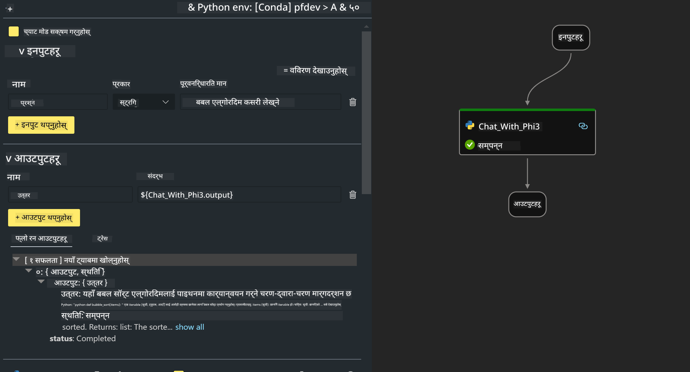
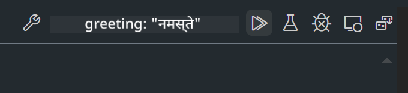

<!--
CO_OP_TRANSLATOR_METADATA:
{
  "original_hash": "3dbbf568625b1ee04b354c2dc81d3248",
  "translation_date": "2025-05-09T19:38:07+00:00",
  "source_file": "md/02.Application/02.Code/Phi3/VSCodeExt/HOL/Apple/02.PromptflowWithMLX.md",
  "language_code": "ne"
}
-->
# **Lab 2 - Phi-3-mini सँग AIPC मा Prompt flow चलाउने**

## **Prompt flow भनेको के हो**

Prompt flow भनेको LLM-आधारित AI एप्लिकेसनहरूको विकास चक्रलाई सजिलो बनाउन बनाइएको उपकरणहरूको सेट हो, जसले विचार सिर्जना, प्रोटोटाइप बनाउने, परीक्षण गर्ने, मूल्यांकन गर्नेदेखि लिएर उत्पादनमा तैनाथ गर्ने र निगरानीसम्म सबै प्रक्रिया समेट्छ। यसले prompt engineering लाई धेरै सहज बनाउँछ र तपाईंलाई उत्पादन स्तरको LLM एप्लिकेसन बनाउन सक्षम बनाउँछ।

Prompt flow सँग तपाईंले गर्न सक्नुहुन्छ:

- LLMs, prompts, Python कोड र अन्य उपकरणहरूलाई जोडेर executable workflow तयार पार्न।

- तपाईंका फ्लोहरू, विशेष गरी LLM सँगको अन्तरक्रिया सजिलै डिबग र सुधार गर्न।

- ठूलो डाटासेटसँग फ्लोहरूको मूल्यांकन गर्न, गुणस्तर र प्रदर्शन मेट्रिक्स गणना गर्न।

- तपाईंको CI/CD प्रणालीमा परीक्षण र मूल्यांकन एकीकृत गरेर फ्लोको गुणस्तर सुनिश्चित गर्न।

- तपाईंले रोजेको सेवा प्लेटफर्ममा फ्लो तैनाथ गर्न वा तपाईंको एपको कोडमा सजिलै समाहित गर्न।

- (वैकल्पिक तर अत्यन्त सिफारिस गरिएको) Azure AI मा Prompt flow को क्लाउड संस्करण प्रयोग गरेर टोलीसँग सहकार्य गर्न।


## **Apple Silicon मा generation code flow बनाउने**

***Note*** ：यदि तपाईंले वातावरण स्थापना पूरा गर्नुभएको छैन भने, कृपया [Lab 0 -Installations](./01.Installations.md) हेर्नुहोस्।

1. Visual Studio Code मा Prompt flow Extension खोल्नुहोस् र खाली flow प्रोजेक्ट बनाउनुहोस्


2. Inputs र Outputs प्यारामिटरहरू थप्नुहोस् र नयाँ flow को रूपमा Python Code थप्नुहोस्



तपाईं flow बनाउँदा यो संरचना (flow.dag.yaml) लाई सन्दर्भ गर्न सक्नुहुन्छ

```yaml

inputs:
  prompt:
    type: string
    default: Write python code for Fibonacci serie. Please use markdown as output
outputs:
  result:
    type: string
    reference: ${gen_code_by_phi3.output}
nodes:
- name: gen_code_by_phi3
  type: python
  source:
    type: code
    path: gen_code_by_phi3.py
  inputs:
    prompt: ${inputs.prompt}


```

3. phi-3-mini लाई quantify गर्नुहोस्

हामी स्थानीय उपकरणहरूमा SLM राम्रोसँग चलाउन चाहन्छौं। सामान्यतया, हामी मोडललाई quantify गर्छौं (INT4, FP16, FP32)

```bash

python -m mlx_lm.convert --hf-path microsoft/Phi-3-mini-4k-instruct

```

**Note:** डिफल्ट फोल्डर mlx_model हो

4. ***Chat_With_Phi3.py*** मा कोड थप्नुहोस्

```python


from promptflow import tool

from mlx_lm import load, generate


# The inputs section will change based on the arguments of the tool function, after you save the code
# Adding type to arguments and return value will help the system show the types properly
# Please update the function name/signature per need
@tool
def my_python_tool(prompt: str) -> str:

    model_id = './mlx_model_phi3_mini'

    model, tokenizer = load(model_id)

    # <|user|>\nWrite python code for Fibonacci serie. Please use markdown as output<|end|>\n<|assistant|>

    response = generate(model, tokenizer, prompt="<|user|>\n" + prompt  + "<|end|>\n<|assistant|>", max_tokens=2048, verbose=True)

    return response


```

4. तपाईं Debug वा Run बाट फ्लो परीक्षण गर्न सक्नुहुन्छ कि generation code ठीक छ कि छैन



5. टर्मिनलमा विकास API को रूपमा फ्लो चलाउनुहोस्

```

pf flow serve --source ./ --port 8080 --host localhost   

```

Postman / Thunder Client मा परीक्षण गर्न सकिन्छ


### **Note**

1. पहिलो पटक चलाउँदा धेरै समय लाग्छ। phi-3 मोडल Hugging face CLI बाट डाउनलोड गर्न सिफारिस गरिन्छ।

2. Intel NPU को सीमित गणनाशक्ति विचार गर्दा, Phi-3-mini-4k-instruct प्रयोग गर्न सिफारिस गरिन्छ।

3. हामी Intel NPU Acceleration प्रयोग गरेर INT4 मा quantify गर्छौं, तर सेवा पुन: चलाउँदा cache र nc_workshop फोल्डरहरू मेटाउनुपर्छ।


## **स्रोतहरू**

1. Promptflow सिक्न [https://microsoft.github.io/promptflow/](https://microsoft.github.io/promptflow/)

2. Intel NPU Acceleration सिक्न [https://github.com/intel/intel-npu-acceleration-library](https://github.com/intel/intel-npu-acceleration-library)

3. नमूना कोड, डाउनलोड [Local NPU Agent Sample Code](../../../../../../../../../code/07.Lab/01/AIPC/local-npu-agent)

**अस्वीकरण**:  
यो दस्तावेज AI अनुवाद सेवा [Co-op Translator](https://github.com/Azure/co-op-translator) प्रयोग गरी अनुवाद गरिएको हो। हामी शुद्धताको लागि प्रयासरत छौं, तर कृपया ध्यान दिनुहोस् कि स्वचालित अनुवादमा त्रुटिहरू वा असत्यताहरू हुनसक्छन्। मूल दस्तावेज यसको मातृभाषामा नै अधिकारिक स्रोत मानिनु पर्छ। महत्वपूर्ण जानकारीको लागि व्यावसायिक मानव अनुवाद सिफारिस गरिन्छ। यस अनुवादको प्रयोगबाट उत्पन्न कुनै पनि गलत बुझाइ वा व्याख्याका लागि हामी जिम्मेवार छैनौं।