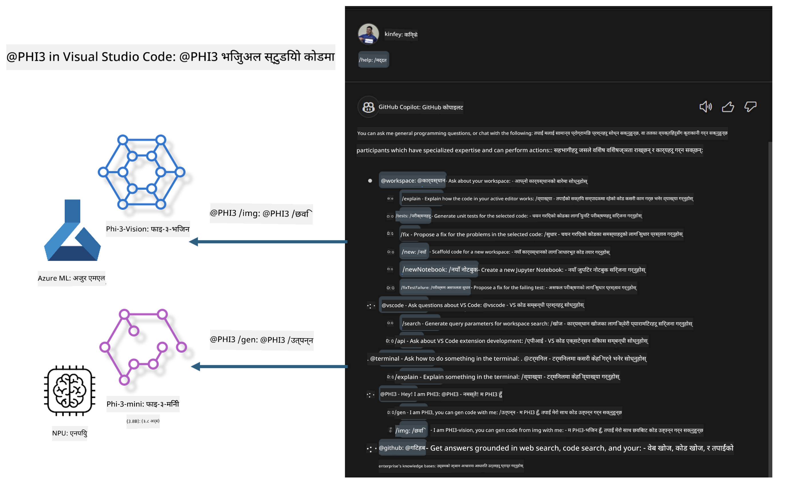

<!--
CO_OP_TRANSLATOR_METADATA:
{
  "original_hash": "00b7a699de8ac405fa821f4c0f7fc0ab",
  "translation_date": "2025-07-17T03:37:11+00:00",
  "source_file": "md/02.Application/02.Code/Phi3/VSCodeExt/README.md",
  "language_code": "ne"
}
-->
# **आफ्नो Visual Studio Code GitHub Copilot Chat Microsoft Phi-3 परिवारसँग बनाउनुहोस्**

के तपाईंले GitHub Copilot Chat मा workspace agent प्रयोग गर्नुभएको छ? के तपाईं आफ्नो टिमको कोड एजेन्ट बनाउन चाहनुहुन्छ? यो व्यावहारिक प्रयोगशालाले खुला स्रोत मोडेललाई मिलाएर उद्यम स्तरको कोड व्यवसाय एजेन्ट बनाउन सहयोग गर्ने आशा राख्छ।

## **आधारभूत**

### **किन Microsoft Phi-3 रोज्ने**

Phi-3 परिवार श्रृंखला हो, जसमा phi-3-mini, phi-3-small, र phi-3-medium समावेश छन्, जुन विभिन्न प्रशिक्षण प्यारामिटरहरूमा आधारित छन् जस्तै पाठ सिर्जना, संवाद पूरा गर्ने, र कोड सिर्जना गर्ने। त्यहाँ Vision मा आधारित phi-3-vision पनि छ। यो उद्यमहरू वा विभिन्न टिमहरूलाई अफलाइन जेनेरेटिभ AI समाधानहरू बनाउन उपयुक्त छ।

यो लिंक पढ्न सिफारिस गरिन्छ [https://github.com/microsoft/PhiCookBook/blob/main/md/01.Introduction/01/01.PhiFamily.md](https://github.com/microsoft/PhiCookBook/blob/main/md/01.Introduction/01/01.PhiFamily.md)

### **Microsoft GitHub Copilot Chat**

GitHub Copilot Chat एक्सटेन्सनले तपाईंलाई एउटा च्याट इन्टरफेस दिन्छ जसले तपाईंलाई GitHub Copilot सँग अन्तरक्रिया गर्न र कोडिङ सम्बन्धी प्रश्नहरूको जवाफ सिधै VS Code भित्रै प्राप्त गर्न मद्दत गर्छ, जसका लागि तपाईंले दस्तावेजहरू हेर्न वा अनलाइन फोरमहरू खोज्न आवश्यक पर्दैन।

Copilot Chat ले उत्पन्न जवाफलाई स्पष्ट बनाउन syntax highlighting, indentation, र अन्य फर्म्याटिङ सुविधाहरू प्रयोग गर्न सक्छ। प्रयोगकर्ताबाट आएको प्रश्नको प्रकार अनुसार, परिणाममा Copilot ले जवाफ सिर्जना गर्दा प्रयोग गरेको सन्दर्भका लिंकहरू, जस्तै स्रोत कोड फाइलहरू वा दस्तावेजहरू, वा VS Code को कार्यक्षमतामा पहुँचका लागि बटनहरू समावेश हुन सक्छ।

- Copilot Chat तपाईंको विकासकर्ताको प्रवाहमा एकीकृत हुन्छ र जहाँ आवश्यक हुन्छ त्यहाँ सहयोग दिन्छ:

- सम्पादक वा टर्मिनलबाट सिधै इनलाइन च्याट सुरु गरेर कोडिङ गर्दा सहयोग लिनुहोस्

- Chat दृश्य प्रयोग गरेर सधैं AI सहायकलाई साथमा राख्नुहोस्

- Quick Chat सुरु गरेर छिटो प्रश्न सोध्नुहोस् र आफ्नो काममा फर्कनुहोस्

तपाईं GitHub Copilot Chat विभिन्न परिदृश्यहरूमा प्रयोग गर्न सक्नुहुन्छ, जस्तै:

- समस्याको समाधान कसरी गर्ने भन्ने कोडिङ प्रश्नहरूको उत्तर दिनु

- अरूको कोड व्याख्या गर्नु र सुधार सुझाव दिनु

- कोड सुधार प्रस्ताव गर्नु

- युनिट टेस्ट केसहरू सिर्जना गर्नु

- कोड दस्तावेजीकरण सिर्जना गर्नु

यो लिंक पढ्न सिफारिस गरिन्छ [https://code.visualstudio.com/docs/copilot/copilot-chat](https://code.visualstudio.com/docs/copilot/copilot-chat?WT.mc_id=aiml-137032-kinfeylo)

###  **Microsoft GitHub Copilot Chat @workspace**

Copilot Chat मा **@workspace** सन्दर्भ गर्दा तपाईंले आफ्नो सम्पूर्ण कोडबेस सम्बन्धी प्रश्न सोध्न सक्नुहुन्छ। प्रश्नको आधारमा, Copilot बुद्धिमानीपूर्वक सम्बन्धित फाइलहरू र प्रतीकहरू खोज्छ, जुन जवाफमा लिंक र कोड उदाहरणका रूपमा समावेश हुन्छन्।

तपाईंको प्रश्नको उत्तर दिन, **@workspace** ले VS Code मा कोडबेस नेभिगेट गर्दा विकासकर्ताले प्रयोग गर्ने स्रोतहरू खोज्छ:

- workspace का सबै फाइलहरू, .gitignore फाइलले बेवास्ता गरेका फाइलहरू बाहेक

- फोल्डर र फाइल नामहरू सहितको डाइरेक्टरी संरचना

- GitHub को कोड खोज इन्डेक्स, यदि workspace GitHub रिपोजिटरी हो र कोड खोजद्वारा इन्डेक्स गरिएको छ भने

- workspace भित्रका प्रतीकहरू र परिभाषाहरू

- हाल चयन गरिएको वा सक्रिय सम्पादकमा देखिने पाठ

ध्यान दिनुहोस्: .gitignore बेवास्ता गरिन्छ यदि तपाईंले बेवास्ता गरिएको फाइल खोल्नुभएको छ वा त्यसमा पाठ चयन गर्नुभएको छ।

यो लिंक पढ्न सिफारिस गरिन्छ [[https://code.visualstudio.com/docs/copilot/copilot-chat](https://code.visualstudio.com/docs/copilot/workspace-context?WT.mc_id=aiml-137032-kinfeylo)]

## **यस प्रयोगशालाबारे थप जान्नुहोस्**

GitHub Copilot ले उद्यमहरूको प्रोग्रामिङ दक्षता धेरै सुधार गरेको छ, र प्रत्येक उद्यमले GitHub Copilot का सम्बन्धित कार्यहरू अनुकूलन गर्न चाहन्छ। धेरै उद्यमहरूले आफ्नै व्यापारिक परिदृश्य र खुला स्रोत मोडेलहरूमा आधारित GitHub Copilot जस्ता अनुकूलित एक्सटेन्सनहरू विकास गरेका छन्। उद्यमहरूको लागि, अनुकूलित एक्सटेन्सनहरू नियन्त्रण गर्न सजिलो हुन्छ, तर यसले प्रयोगकर्ता अनुभवमा असर पार्न सक्छ। अन्ततः, GitHub Copilot सामान्य परिदृश्य र व्यावसायिकतामा बलियो छ। यदि अनुभव निरन्तर राख्न सकिन्छ भने, उद्यमको आफ्नै एक्सटेन्सन अनुकूलन गर्नु राम्रो हुन्छ। GitHub Copilot Chat ले उद्यमहरूलाई च्याट अनुभव विस्तार गर्न सम्बन्धित API हरू प्रदान गर्छ। निरन्तर अनुभव कायम राख्नु र अनुकूलित कार्यहरू हुनु राम्रो प्रयोगकर्ता अनुभव हो।

यो प्रयोगशालाले मुख्य रूपमा Phi-3 मोडेललाई स्थानीय NPU र Azure हाइब्रिडसँग मिलाएर GitHub Copilot Chat मा कस्टम एजेन्ट ***@PHI3*** निर्माण गर्छ, जसले उद्यम विकासकर्ताहरूलाई कोड सिर्जना पूरा गर्न ***(@PHI3 /gen)*** र छविहरूको आधारमा कोड सिर्जना गर्न ***(@PHI3 /img)*** सहयोग पुर्‍याउँछ।

### ***ध्यान दिनुहोस्:*** 

यो प्रयोगशाला हाल Intel CPU र Apple Silicon को AIPC मा कार्यान्वयन गरिएको छ। हामी Qualcomm संस्करणको NPU अपडेट गर्दै जानेछौं।

## **प्रयोगशाला**

| नाम | विवरण | AIPC | Apple |
| ------------ | ----------- | -------- |-------- |
| Lab0 - Installations(✅) | सम्बन्धित वातावरण र स्थापना उपकरणहरू कन्फिगर र स्थापना गर्नुहोस् | [Go](./HOL/AIPC/01.Installations.md) |[Go](./HOL/Apple/01.Installations.md) |
| Lab1 - Run Prompt flow with Phi-3-mini (✅) | AIPC / Apple Silicon सँग मिलाएर स्थानीय NPU प्रयोग गरी Phi-3-mini मार्फत कोड सिर्जना गर्नुहोस् | [Go](./HOL/AIPC/02.PromptflowWithNPU.md) |  [Go](./HOL/Apple/02.PromptflowWithMLX.md) |
| Lab2 - Deploy Phi-3-vision on Azure Machine Learning Service(✅) | Azure Machine Learning Service को Model Catalog - Phi-3-vision छवि तैनाथ गरेर कोड सिर्जना गर्नुहोस् | [Go](./HOL/AIPC/03.DeployPhi3VisionOnAzure.md) |[Go](./HOL/Apple/03.DeployPhi3VisionOnAzure.md) |
| Lab3 - Create a @phi-3 agent in GitHub Copilot Chat(✅)  | GitHub Copilot Chat मा कस्टम Phi-3 एजेन्ट सिर्जना गरेर कोड सिर्जना, ग्राफ कोड सिर्जना, RAG आदि पूरा गर्नुहोस् | [Go](./HOL/AIPC/04.CreatePhi3AgentInVSCode.md) | [Go](./HOL/Apple/04.CreatePhi3AgentInVSCode.md) |
| Sample Code (✅)  | नमूना कोड डाउनलोड गर्नुहोस् | [Go](../../../../../../../code/07.Lab/01/AIPC) | [Go](../../../../../../../code/07.Lab/01/Apple) |

## **स्रोतहरू**

1. Phi-3 Cookbook [https://github.com/microsoft/Phi-3CookBook](https://github.com/microsoft/Phi-3CookBook)

2. GitHub Copilot बारे थप जान्न [https://learn.microsoft.com/training/paths/copilot/](https://learn.microsoft.com/training/paths/copilot/?WT.mc_id=aiml-137032-kinfeylo)

3. GitHub Copilot Chat बारे थप जान्न [https://learn.microsoft.com/training/paths/accelerate-app-development-using-github-copilot/](https://learn.microsoft.com/training/paths/accelerate-app-development-using-github-copilot/?WT.mc_id=aiml-137032-kinfeylo)

4. GitHub Copilot Chat API बारे थप जान्न [https://code.visualstudio.com/api/extension-guides/chat](https://code.visualstudio.com/api/extension-guides/chat?WT.mc_id=aiml-137032-kinfeylo)

5. Azure AI Foundry बारे थप जान्न [https://learn.microsoft.com/training/paths/create-custom-copilots-ai-studio/](https://learn.microsoft.com/training/paths/create-custom-copilots-ai-studio/?WT.mc_id=aiml-137032-kinfeylo)

6. Azure AI Foundry को Model Catalog बारे थप जान्न [https://learn.microsoft.com/azure/ai-studio/how-to/model-catalog-overview](https://learn.microsoft.com/azure/ai-studio/how-to/model-catalog-overview)

**अस्वीकरण**:  
यो दस्तावेज AI अनुवाद सेवा [Co-op Translator](https://github.com/Azure/co-op-translator) प्रयोग गरी अनुवाद गरिएको हो। हामी शुद्धताका लागि प्रयासरत छौं, तर कृपया ध्यान दिनुहोस् कि स्वचालित अनुवादमा त्रुटि वा अशुद्धता हुन सक्छ। मूल दस्तावेज यसको मूल भाषामा नै अधिकारिक स्रोत मानिनु पर्छ। महत्वपूर्ण जानकारीका लागि व्यावसायिक मानव अनुवाद सिफारिस गरिन्छ। यस अनुवादको प्रयोगबाट उत्पन्न कुनै पनि गलतफहमी वा गलत व्याख्याका लागि हामी जिम्मेवार छैनौं।