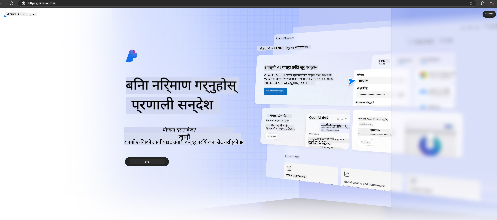

<!--
CO_OP_TRANSLATOR_METADATA:
{
  "original_hash": "3a1e48b628022485aac989c9f733e792",
  "translation_date": "2025-07-17T05:21:59+00:00",
  "source_file": "md/02.QuickStart/AzureAIFoundry_QuickStart.md",
  "language_code": "ne"
}
-->
# **Azure AI Foundry मा Phi-3 को प्रयोग**

Generative AI को विकाससँगै, हामी विभिन्न LLM र SLM, उद्यम डेटा एकीकरण, fine-tuning/RAG अपरेसनहरू, र LLM र SLM एकीकरण पछि विभिन्न उद्यम व्यवसायहरूको मूल्याङ्कनलाई व्यवस्थापन गर्न एकीकृत प्लेटफर्म प्रयोग गर्ने आशा गर्छौं, जसले गर्दा जनरेटिभ AI स्मार्ट अनुप्रयोगहरूलाई अझ राम्रोसँग कार्यान्वयन गर्न सकियोस्। [Azure AI Foundry](https://ai.azure.com) एक उद्यम-स्तरको जनरेटिभ AI अनुप्रयोग प्लेटफर्म हो।

Azure AI Foundry मार्फत, तपाईं ठूलो भाषा मोडेल (LLM) का प्रतिक्रियाहरू मूल्याङ्कन गर्न र prompt flow को साथ prompt अनुप्रयोग कम्पोनेन्टहरूलाई समन्वय गर्न सक्नुहुन्छ जसले प्रदर्शनलाई सुधार गर्छ। यो प्लेटफर्मले proof of concept लाई पूर्ण उत्पादनमा सजिलै रूपान्तरण गर्न स्केलेबिलिटी प्रदान गर्छ। निरन्तर अनुगमन र सुधारले दीर्घकालीन सफलतालाई समर्थन गर्दछ।

हामी सजिलै Azure AI Foundry मा Phi-3 मोडेल छिटो तैनाथ गर्न सक्छौं, र त्यसपछि Azure AI Foundry प्रयोग गरेर Phi-3 सम्बन्धित Playground/Chat, Fine-tuning, मूल्याङ्कन र अन्य सम्बन्धित कार्यहरू पूरा गर्न सक्छौं।

## **1. तयारी**

यदि तपाईंको मेसिनमा पहिले नै [Azure Developer CLI](https://learn.microsoft.com/azure/developer/azure-developer-cli/overview?WT.mc_id=aiml-138114-kinfeylo) इन्स्टल गरिएको छ भने, यो टेम्प्लेट प्रयोग गर्न नयाँ डाइरेक्टरीमा यो कमाण्ड चलाउनु पर्याप्त छ।

## म्यानुअल सिर्जना

Microsoft Azure AI Foundry प्रोजेक्ट र हब सिर्जना गर्नु तपाईंको AI कामलाई व्यवस्थित र व्यवस्थापन गर्ने राम्रो तरिका हो। यहाँ सुरु गर्नका लागि चरण-द्वारा-चरण मार्गदर्शन छ:

### Azure AI Foundry मा प्रोजेक्ट सिर्जना गर्ने तरिका

1. **Azure AI Foundry मा जानुहोस्**: Azure AI Foundry पोर्टलमा साइन इन गर्नुहोस्।
2. **प्रोजेक्ट सिर्जना गर्नुहोस्**:
   - यदि तपाईं कुनै प्रोजेक्टमा हुनुहुन्छ भने, पृष्ठको माथिल्लो बाँया कुनामा "Azure AI Foundry" चयन गरेर होम पृष्ठमा जानुहोस्।
   - "+ Create project" चयन गर्नुहोस्।
   - प्रोजेक्टको नाम प्रविष्ट गर्नुहोस्।
   - यदि तपाईंको हब छ भने, त्यो डिफल्ट रूपमा चयन हुनेछ। यदि तपाईंलाई एक भन्दा बढी हबमा पहुँच छ भने, ड्रपडाउनबाट फरक हब चयन गर्न सक्नुहुन्छ। नयाँ हब सिर्जना गर्न चाहनुहुन्छ भने "Create new hub" चयन गरी नाम दिनुहोस्।
   - "Create" चयन गर्नुहोस्।

### Azure AI Foundry मा हब सिर्जना गर्ने तरिका

1. **Azure AI Foundry मा जानुहोस्**: आफ्नो Azure खाताबाट साइन इन गर्नुहोस्।
2. **हब सिर्जना गर्नुहोस्**:
   - बाँया मेनुबाट Management center चयन गर्नुहोस्।
   - "All resources" चयन गर्नुहोस्, त्यसपछि "+ New project" को छेउमा रहेको तल तीरमा क्लिक गरी "+ New hub" चयन गर्नुहोस्।
   - "Create a new hub" संवाद बक्समा आफ्नो हबको नाम (जस्तै, contoso-hub) प्रविष्ट गर्नुहोस् र अन्य फिल्डहरू आवश्यक अनुसार परिमार्जन गर्नुहोस्।
   - "Next" चयन गरी जानकारी समीक्षा गर्नुहोस् र "Create" चयन गर्नुहोस्।

थप विस्तृत निर्देशनका लागि, तपाईं आधिकारिक [Microsoft दस्तावेज](https://learn.microsoft.com/azure/ai-studio/how-to/create-projects) हेर्न सक्नुहुन्छ।

सफलतापूर्वक सिर्जना पछि, तपाईंले [ai.azure.com](https://ai.azure.com/) मार्फत सिर्जना गरेको स्टुडियोमा पहुँच पाउन सक्नुहुन्छ।

एउटा AI Foundry मा धेरै प्रोजेक्टहरू हुन सक्छन्। AI Foundry मा प्रोजेक्ट सिर्जना गरेर तयारी गर्नुहोस्।

Azure AI Foundry [QuickStarts](https://learn.microsoft.com/azure/ai-studio/quickstarts/get-started-code) सिर्जना गर्नुहोस्।

## **2. Azure AI Foundry मा Phi मोडेल तैनाथ गर्ने**

प्रोजेक्टको Explore विकल्पमा क्लिक गरी Model Catalog मा प्रवेश गर्नुहोस् र Phi-3 चयन गर्नुहोस्।

Phi-3-mini-4k-instruct चयन गर्नुहोस्।

'Deploy' मा क्लिक गरी Phi-3-mini-4k-instruct मोडेल तैनाथ गर्नुहोस्।

> [!NOTE]
>
> तैनाथ गर्दा तपाईं कम्प्युटिङ पावर चयन गर्न सक्नुहुन्छ।

## **3. Azure AI Foundry मा Playground Chat Phi**

तैनाथ पृष्ठमा जानुहोस्, Playground चयन गर्नुहोस्, र Azure AI Foundry को Phi-3 सँग कुराकानी गर्नुहोस्।

## **4. Azure AI Foundry बाट मोडेल तैनाथ गर्ने तरिका**

Azure Model Catalog बाट मोडेल तैनाथ गर्न, यी चरणहरू पालना गर्नुहोस्:

- Azure AI Foundry मा साइन इन गर्नुहोस्।
- Azure AI Foundry मोडेल क्याटलगबाट तैनाथ गर्न चाहेको मोडेल चयन गर्नुहोस्।
- मोडेलको Details पृष्ठमा Deploy चयन गर्नुहोस् र त्यसपछि Serverless API with Azure AI Content Safety चयन गर्नुहोस्।
- आफ्नो मोडेलहरू तैनाथ गर्न चाहेको प्रोजेक्ट चयन गर्नुहोस्। Serverless API प्रयोग गर्न, तपाईंको कार्यक्षेत्र East US 2 वा Sweden Central क्षेत्र अन्तर्गत हुनुपर्छ। तपाईं Deployment नाम अनुकूलन गर्न सक्नुहुन्छ।
- तैनाथ विजार्डमा Pricing र terms चयन गरी मूल्य र प्रयोग सर्तहरू जान्नुहोस्।
- Deploy चयन गर्नुहोस्। तैनाथ प्रक्रिया तयार नभएसम्म पर्खनुहोस् र तपाईं Deployments पृष्ठमा पुनः निर्देशित हुनुहुनेछ।
- Open in playground चयन गरी मोडेलसँग अन्तरक्रिया सुरु गर्नुहोस्।
- तपाईं Deployments पृष्ठमा फर्केर तैनाथ चयन गर्न सक्नुहुन्छ र endpoint को Target URL र Secret Key नोट गर्न सक्नुहुन्छ, जसले तैनाथलाई कल गर्न र completions उत्पन्न गर्न प्रयोग हुन्छ।
- तपाईं सधैं Build ट्याबमा गएर Components सेक्सनबाट Deployments चयन गरी endpoint को विवरण, URL, र पहुँच कुञ्जीहरू फेला पार्न सक्नुहुन्छ।

> [!NOTE]
> कृपया ध्यान दिनुहोस् कि यी चरणहरू गर्न तपाईंको खातामा Resource Group मा Azure AI Developer भूमिका अनुमति हुनुपर्छ।

## **5. Azure AI Foundry मा Phi API को प्रयोग**

तपाईं https://{Your project name}.region.inference.ml.azure.com/swagger.json लाई Postman GET मार्फत पहुँच गर्न सक्नुहुन्छ र Key सँग जोडेर उपलब्ध इन्टरफेसहरूबारे जान्न सक्नुहुन्छ।

तपाईं अनुरोधका प्यारामिटरहरू र प्रतिक्रिया प्यारामिटरहरू सजिलै प्राप्त गर्न सक्नुहुन्छ।

**अस्वीकरण**:  
यो दस्तावेज AI अनुवाद सेवा [Co-op Translator](https://github.com/Azure/co-op-translator) प्रयोग गरी अनुवाद गरिएको हो। हामी शुद्धताका लागि प्रयासरत छौं, तर कृपया ध्यान दिनुहोस् कि स्वचालित अनुवादमा त्रुटि वा अशुद्धता हुनसक्छ। मूल दस्तावेज यसको मूल भाषामा नै अधिकारिक स्रोत मानिनुपर्छ। महत्वपूर्ण जानकारीका लागि व्यावसायिक मानव अनुवाद सिफारिस गरिन्छ। यस अनुवादको प्रयोगबाट उत्पन्न कुनै पनि गलतफहमी वा गलत व्याख्याका लागि हामी जिम्मेवार छैनौं।