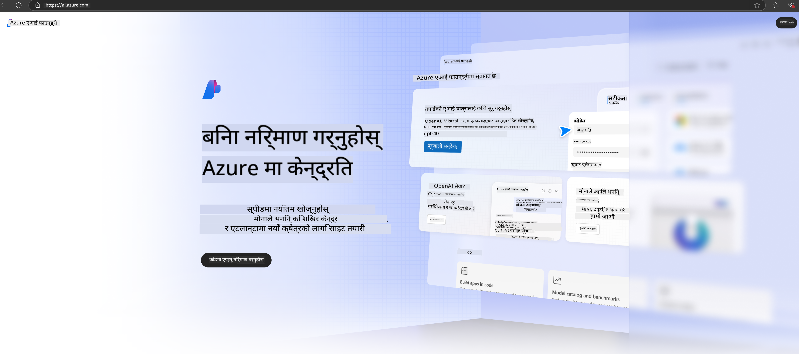

<!--
CO_OP_TRANSLATOR_METADATA:
{
  "original_hash": "3a1e48b628022485aac989c9f733e792",
  "translation_date": "2025-05-09T20:10:14+00:00",
  "source_file": "md/02.QuickStart/AzureAIFoundry_QuickStart.md",
  "language_code": "ne"
}
-->
# **Phi-3 को Azure AI Foundry मा प्रयोग गर्ने तरिका**

Generative AI को विकाससँगै, हामीले विभिन्न LLM र SLM, उद्यम डेटा एकीकरण, fine-tuning/RAG अपरेसनहरू, र LLM तथा SLM एकीकृत गरेपछि विभिन्न उद्यम व्यवसायहरूको मूल्याङ्कनलाई एउटै प्लेटफर्मबाट व्यवस्थापन गर्ने आशा गरेका छौं, जसले गर्दा Smart एप्लिकेशनहरूमा जनरेटिभ AI लाई अझ राम्रोसँग लागू गर्न सकियोस्। [Azure AI Foundry](https://ai.azure.com) एक उद्यम-स्तरको जनरेटिभ AI एप्लिकेशन प्लेटफर्म हो।

Azure AI Foundry मार्फत, तपाईं ठूलो भाषा मोडल (LLM) को प्रतिक्रिया मूल्याङ्कन गर्न र prompt flow सँग prompt एप्लिकेशन कम्पोनेन्टहरू समन्वय गर्न सक्नुहुन्छ जसले प्रदर्शन सुधार गर्दछ। यो प्लेटफर्मले proof of concept लाई सजिलै पूर्ण उत्पादनमा रूपान्तरण गर्न मापनयोग्य बनाउँछ। निरन्तर निगरानी र सुधारले दीर्घकालीन सफलतालाई समर्थन गर्दछ।

हामी सजिलै Azure AI Foundry मा Phi-3 मोडल तैनाथ गर्न सक्छौं र त्यसपछि Azure AI Foundry प्रयोग गरी Phi-3 सम्बन्धित Playground/Chat, Fine-tuning, मूल्याङ्कन र अन्य सम्बन्धित कार्यहरू पूरा गर्न सक्छौं।

## **1. तयारी**

यदि तपाईंको मेसिनमा पहिले नै [Azure Developer CLI](https://learn.microsoft.com/azure/developer/azure-developer-cli/overview?WT.mc_id=aiml-138114-kinfeylo) इन्स्टल गरिएको छ भने, यो टेम्प्लेट प्रयोग गर्न नयाँ डाइरेक्टरीमा यो कमाण्ड चलाउनु पर्याप्त छ।

## म्यानुअल निर्माण

Microsoft Azure AI Foundry प्रोजेक्ट र हब सिर्जना गर्नु तपाईंको AI कार्यलाई व्यवस्थित र व्यवस्थापन गर्ने राम्रो तरिका हो। यहाँ सुरु गर्न चरणबद्ध मार्गदर्शन छ:

### Azure AI Foundry मा प्रोजेक्ट सिर्जना गर्ने तरिका

1. **Azure AI Foundry मा जानुहोस्**: Azure AI Foundry पोर्टलमा लगइन गर्नुहोस्।
2. **प्रोजेक्ट सिर्जना गर्नुहोस्**:
   - यदि तपाईं कुनै प्रोजेक्टमा हुनुहुन्छ भने, पृष्ठको माथिल्लो बाँया कुनामा "Azure AI Foundry" चयन गरी Home पृष्ठमा जानुहोस्।
   - "+ Create project" चयन गर्नुहोस्।
   - प्रोजेक्टको नाम प्रविष्ट गर्नुहोस्।
   - यदि तपाईंको हब छ भने, त्यो स्वतः चयन हुनेछ। यदि तपाईंलाई धेरै हबहरूमा पहुँच छ भने, ड्रपडाउनबाट फरक हब चयन गर्न सक्नुहुन्छ। नयाँ हब सिर्जना गर्न चाहनुहुन्छ भने "Create new hub" चयन गरी नाम दिनुहोस्।
   - "Create" चयन गर्नुहोस्।

### Azure AI Foundry मा हब सिर्जना गर्ने तरिका

1. **Azure AI Foundry मा जानुहोस्**: Azure खाताबाट लगइन गर्नुहोस्।
2. **हब सिर्जना गर्नुहोस्**:
   - बाँया मेनुबाट Management center चयन गर्नुहोस्।
   - "All resources" चयन गरी "+ New project" को छेउमा रहेको तल तीर क्लिक गरी "+ New hub" चयन गर्नुहोस्।
   - "Create a new hub" संवादमा हबको नाम (जस्तै, contoso-hub) प्रविष्ट गर्नुहोस् र अन्य फिल्डहरू आवश्यक अनुसार परिवर्तन गर्नुहोस्।
   - "Next" चयन गरी जानकारी समीक्षा गर्नुहोस् र "Create" थिच्नुहोस्।

थप विस्तृत निर्देशनका लागि आधिकारिक [Microsoft कागजात](https://learn.microsoft.com/azure/ai-studio/how-to/create-projects) हेर्न सक्नुहुन्छ।

सफलतापूर्वक सिर्जना भएपछि, तपाईंले सिर्जना गरेको स्टुडियोमा [ai.azure.com](https://ai.azure.com/) मार्फत पहुँच गर्न सक्नुहुन्छ।

एउटा AI Foundry मा धेरै प्रोजेक्टहरू हुन सक्छन्। AI Foundry मा प्रोजेक्ट सिर्जना गरेर तयारी गर्नुहोस्।

Azure AI Foundry [QuickStarts](https://learn.microsoft.com/azure/ai-studio/quickstarts/get-started-code) पनि हेर्न सक्नुहुन्छ।

## **2. Azure AI Foundry मा Phi मोडल तैनाथ गर्ने तरिका**

प्रोजेक्टको Explore विकल्पमा क्लिक गरी Model Catalog मा प्रवेश गर्नुहोस् र Phi-3 चयन गर्नुहोस्।

Phi-3-mini-4k-instruct चयन गर्नुहोस्।

'Deploy' क्लिक गरी Phi-3-mini-4k-instruct मोडल तैनाथ गर्नुहोस्।

> [!NOTE]
>
> तैनाथ गर्दा तपाईंले कम्प्युटिङ पावर चयन गर्न सक्नुहुन्छ।

## **3. Azure AI Foundry मा Playground Chat Phi**

तैनाथ पृष्ठमा जानुहोस्, Playground चयन गर्नुहोस्, र Azure AI Foundry को Phi-3 सँग कुराकानी गर्नुहोस्।

## **4. Azure AI Foundry बाट मोडल तैनाथ गर्ने तरिका**

Azure Model Catalog बाट मोडल तैनाथ गर्न, तलका चरणहरू पालना गर्नुहोस्:

- Azure AI Foundry मा लगइन गर्नुहोस्।
- Azure AI Foundry मोडल क्याटलगबाट तैनाथ गर्न चाहेको मोडल चयन गर्नुहोस्।
- मोडलको Details पृष्ठमा Deploy चयन गरी Serverless API with Azure AI Content Safety चयन गर्नुहोस्।
- तपाईंले मोडल तैनाथ गर्न चाहेको प्रोजेक्ट चयन गर्नुहोस्। Serverless API प्रयोग गर्नको लागि, तपाईंको workspace East US 2 वा Sweden Central क्षेत्रको हुनुपर्छ। Deployment नाम कस्टमाइज गर्न सक्नुहुन्छ।
- Deployment विजार्डमा Pricing र terms अध्ययन गर्नुहोस्।
- Deploy चयन गर्नुहोस्। तैनाथी तयार नहुँदासम्म पर्खनुहोस् र Deployments पृष्ठमा रिडाइरेक्ट हुनुहोस्।
- Open in playground चयन गरी मोडलसँग अन्तरक्रिया सुरु गर्नुहोस्।
- Deployments पृष्ठमा फर्केर तैनाथी चयन गर्नुहोस् र endpoint को Target URL र Secret Key नोट गर्नुहोस्, जसले तपाईंलाई तैनाथी कल गर्न र completions उत्पन्न गर्न मद्दत गर्छ।
- Endpoint का विवरण, URL र access keys सधैं Build ट्याबमा गएर Components सेक्सन अन्तर्गत Deployments बाट प्राप्त गर्न सकिन्छ।

> [!NOTE]
> कृपया ध्यान दिनुहोस् कि यी चरणहरू गर्न तपाईंको खातामा Resource Group मा Azure AI Developer भूमिका अनुमति हुनुपर्छ।

## **5. Azure AI Foundry मा Phi API प्रयोग गर्ने तरिका**

Postman GET मार्फत https://{Your project name}.region.inference.ml.azure.com/swagger.json मा पहुँच गर्नुहोस् र Key सँग जोडेर उपलब्ध इन्टरफेसहरू बुझ्न सक्नुहुन्छ।

यसले अनुरोधका प्यारामिटरहरू र प्रतिक्रिया प्यारामिटरहरू सजिलै प्राप्त गर्न मद्दत गर्छ।

**अस्वीकरण**:  
यो दस्तावेज AI अनुवाद सेवा [Co-op Translator](https://github.com/Azure/co-op-translator) प्रयोग गरी अनुवाद गरिएको हो। हामी शुद्धताको लागि प्रयासरत छौं, तर कृपया ध्यान दिनुहोस् कि स्वचालित अनुवादमा त्रुटिहरू वा गलतफहमी हुन सक्छन्। मूल दस्तावेज यसको मूल भाषामा नै अधिकारिक स्रोत मानिनुपर्छ। महत्वपूर्ण जानकारीका लागि पेशेवर मानव अनुवाद सिफारिस गरिन्छ। यस अनुवादको प्रयोगबाट हुने कुनै पनि गलतफहमी वा गलत व्याख्याका लागि हामी जिम्मेवार छैनौं।