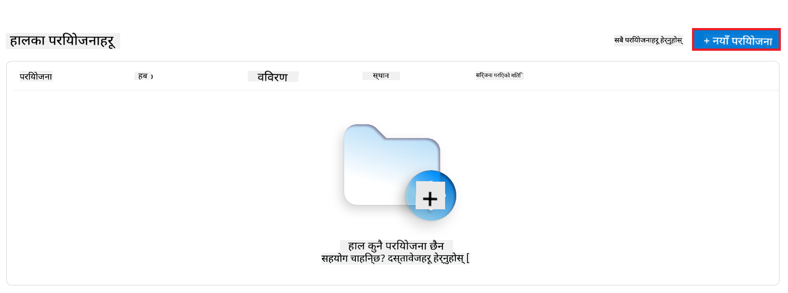
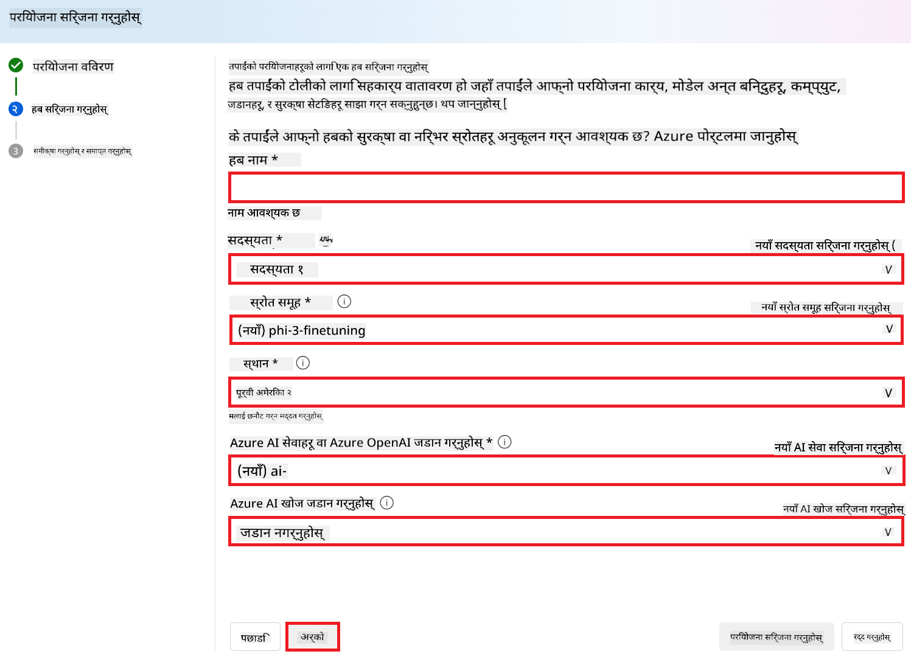
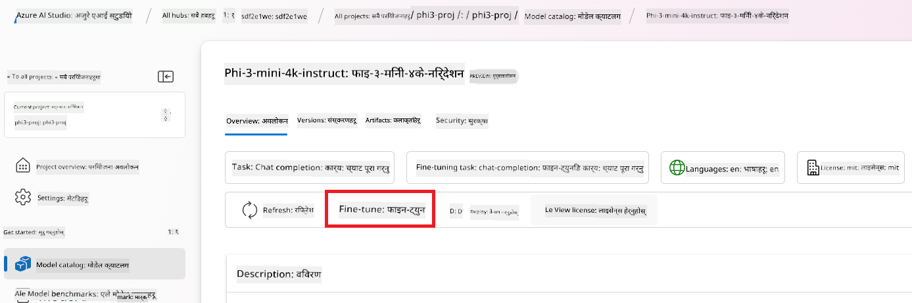

<!--
CO_OP_TRANSLATOR_METADATA:
{
  "original_hash": "c1559c5af6caccf6f623fd43a6b3a9a3",
  "translation_date": "2025-07-17T06:01:29+00:00",
  "source_file": "md/03.FineTuning/FineTuning_AIFoundry.md",
  "language_code": "ne"
}
-->
# Azure AI Foundry सँग Phi-3 लाई फाइन-ट्यून गर्ने तरिका

आउनुहोस् Microsoft को Phi-3 Mini भाषा मोडेललाई Azure AI Foundry प्रयोग गरेर कसरी फाइन-ट्यून गर्ने भनेर अन्वेषण गरौं। फाइन-ट्यूनिङले तपाईंलाई Phi-3 Mini लाई विशेष कार्यहरूका लागि अनुकूल बनाउन मद्दत गर्छ, जसले यसलाई अझ शक्तिशाली र सन्दर्भ-सम्झदार बनाउँछ।

## विचार गर्नुपर्ने कुराहरू

- **क्षमताहरू:** कुन मोडेलहरू फाइन-ट्यून गर्न सकिन्छ? आधारभूत मोडेललाई के के गर्न फाइन-ट्यून गर्न सकिन्छ?
- **लागत:** फाइन-ट्यूनिङको मूल्य निर्धारण मोडेल कस्तो छ?
- **अनुकूलन क्षमता:** म आधारभूत मोडेललाई कति र कसरी परिमार्जन गर्न सक्छु?
- **सुविधा:** फाइन-ट्यूनिङ कसरी हुन्छ? के मलाई कस्टम कोड लेख्न आवश्यक छ? के मलाई आफ्नै कम्प्युट ल्याउनुपर्छ?
- **सुरक्षा:** फाइन-ट्यून गरिएको मोडेलहरूमा सुरक्षा जोखिमहरू हुन्छन् – के त्यस्ता जोखिमहरूबाट बच्न कुनै सुरक्षा उपायहरू छन्?


## फाइन-ट्यूनिङको तयारी

### पूर्व आवश्यकताहरू

> [!NOTE]
> Phi-3 परिवारका मोडेलहरूका लागि, pay-as-you-go मोडेल फाइन-ट्यूनिङ सुविधा केवल **East US 2** क्षेत्रहरूमा सिर्जना गरिएका हबहरूमा उपलब्ध छ।

- Azure सदस्यता। यदि तपाईं सँग Azure सदस्यता छैन भने, सुरु गर्न [पेड Azure खाता](https://azure.microsoft.com/pricing/purchase-options/pay-as-you-go) सिर्जना गर्नुहोस्।

- एक [AI Foundry परियोजना](https://ai.azure.com?WT.mc_id=aiml-138114-kinfeylo)।
- Azure RBAC (Role-Based Access Control) प्रयोग गरेर Azure AI Foundry मा अपरेसनहरूमा पहुँच दिन्छ। यस लेखका चरणहरू गर्न तपाईंको प्रयोगकर्ता खातामा __Azure AI Developer भूमिका__ स्रोत समूहमा असाइन गरिएको हुनुपर्छ।

### सदस्यता प्रदायक दर्ता

सुनिश्चित गर्नुहोस् कि सदस्यता `Microsoft.Network` स्रोत प्रदायकमा दर्ता गरिएको छ।

1. [Azure पोर्टल](https://portal.azure.com) मा साइन इन गर्नुहोस्।
2. बाँया मेनुबाट **Subscriptions** चयन गर्नुहोस्।
3. प्रयोग गर्न चाहेको सदस्यता चयन गर्नुहोस्।
4. बाँया मेनुबाट **AI project settings** > **Resource providers** चयन गर्नुहोस्।
5. सूचीमा **Microsoft.Network** छ कि छैन जाँच गर्नुहोस्। नभए थप्नुहोस्।

### डाटा तयारी

तपाईंको मोडेललाई फाइन-ट्यून गर्न प्रशिक्षण र मान्यकरण डाटा तयार गर्नुहोस्। तपाईंको प्रशिक्षण र मान्यकरण डाटा सेटहरूमा इनपुट र आउटपुट उदाहरणहरू हुन्छन् जसले मोडेललाई कस्तो प्रदर्शन गर्न चाहिन्छ भनेर देखाउँछन्।

सुनिश्चित गर्नुहोस् कि सबै प्रशिक्षण उदाहरणहरू अपेक्षित इन्फरेन्स ढाँचामा छन्। प्रभावकारी फाइन-ट्यूनिङका लागि सन्तुलित र विविध डाटासेट आवश्यक छ।

यसमा डाटा सन्तुलन कायम राख्नु, विभिन्न परिदृश्यहरू समावेश गर्नु, र समय-समयमा प्रशिक्षण डाटा परिमार्जन गरेर वास्तविक विश्वका अपेक्षासँग मेल खाने सुनिश्चित गर्नु पर्दछ, जसले अन्ततः मोडेलको जवाफलाई अधिक सटीक र सन्तुलित बनाउँछ।

विभिन्न मोडेल प्रकारहरूका लागि फरक ढाँचाको प्रशिक्षण डाटा आवश्यक पर्छ।

### Chat Completion

तपाईंले प्रयोग गर्ने प्रशिक्षण र मान्यकरण डाटा **JSON Lines (JSONL)** ढाँचामा हुनैपर्छ। `Phi-3-mini-128k-instruct` को लागि फाइन-ट्यूनिङ डाटासेटले Chat completions API मा प्रयोग हुने संवादात्मक ढाँचामा हुनुपर्छ।

### उदाहरण फाइल ढाँचा

```json
    {"messages": [{"role": "system", "content": "You are an Xbox customer support agent whose primary goal is to help users with issues they are experiencing with their Xbox devices. You are friendly and concise. You only provide factual answers to queries, and do not provide answers that are not related to Xbox."}, {"role": "user", "content": "Is Xbox better than PlayStation?"}, {"role": "assistant", "content": "I apologize, but I cannot provide personal opinions. My primary job is to assist you with any issues related to your Xbox device. Do you have any Xbox-related issues that need addressing?"}]}
    {"messages": [{"role": "system", "content": "You are an Xbox customer support agent whose primary goal is to help users with issues they are experiencing with their Xbox devices. You are friendly and concise. You only provide factual answers to queries, and do not provide answers that are not related to Xbox."}, {"role": "user", "content": "Can I play PC games on my Xbox?"}, {"role": "assistant", "content": "While Xbox consoles don't natively support PC games, they can play an array of Xbox games, many of which are also available on PC. Can I assist you with finding games compatible with your Xbox device?"}]}
    {"messages": [{"role": "system", "content": "You are an Xbox customer support agent whose primary goal is to help users with issues they are experiencing with their Xbox devices. You are friendly and concise. You only provide factual answers to queries, and do not provide answers that are not related to Xbox."}, {"role": "user", "content": "I'm having trouble connecting my Xbox to the Wi-Fi."}, {"role": "assistant", "content": "No worries, let's go through the network settings on your Xbox. Can you please tell me what happens when you try to connect it to the Wi-Fi?"}]}
```

समर्थित फाइल प्रकार JSON Lines हो। फाइलहरू डिफल्ट डाटास्टोरमा अपलोड गरिन्छ र तपाईंको परियोजनामा उपलब्ध गराइन्छ।

## Azure AI Foundry सँग Phi-3 लाई फाइन-ट्यून गर्ने तरिका

Azure AI Foundry ले ठूलो भाषा मोडेलहरूलाई तपाईंको व्यक्तिगत डाटासेट अनुसार अनुकूल बनाउन फाइन-ट्यूनिङ प्रक्रिया प्रयोग गर्दछ। फाइन-ट्यूनिङले विशेष कार्य र अनुप्रयोगहरूका लागि अनुकूलन र सुधारको ठूलो मूल्य प्रदान गर्छ। यसले प्रदर्शन सुधार, लागत दक्षता, कम विलम्बता, र अनुकूलित आउटपुटहरू ल्याउँछ।


### नयाँ परियोजना सिर्जना गर्नुहोस्

1. [Azure AI Foundry](https://ai.azure.com) मा साइन इन गर्नुहोस्।

2. Azure AI Foundry मा नयाँ परियोजना सिर्जना गर्न **+New project** चयन गर्नुहोस्।

    

3. तलका कार्यहरू गर्नुहोस्:

    - परियोजनाको **Hub name** प्रविष्ट गर्नुहोस्। यो अनौठो हुनुपर्छ।
    - प्रयोग गर्न चाहेको **Hub** चयन गर्नुहोस् (आवश्यक परे नयाँ सिर्जना गर्नुहोस्)।

    

4. नयाँ हब सिर्जना गर्न तलका कार्यहरू गर्नुहोस्:

    - **Hub name** प्रविष्ट गर्नुहोस्। यो अनौठो हुनुपर्छ।
    - तपाईंको Azure **Subscription** चयन गर्नुहोस्।
    - प्रयोग गर्न चाहेको **Resource group** चयन गर्नुहोस् (आवश्यक परे नयाँ सिर्जना गर्नुहोस्)।
    - प्रयोग गर्न चाहेको **Location** चयन गर्नुहोस्।
    - प्रयोग गर्न चाहेको **Connect Azure AI Services** चयन गर्नुहोस् (आवश्यक परे नयाँ सिर्जना गर्नुहोस्)।
    - **Connect Azure AI Search** मा **Skip connecting** चयन गर्नुहोस्।

    

5. **Next** चयन गर्नुहोस्।
6. **Create a project** चयन गर्नुहोस्।

### डाटा तयारी

फाइन-ट्यूनिङ अघि, तपाईंको कार्यसँग सम्बन्धित डाटासेट सङ्कलन वा सिर्जना गर्नुहोस्, जस्तै च्याट निर्देशनहरू, प्रश्न-उत्तर जोडीहरू, वा अन्य सान्दर्भिक पाठ डाटा। यस डाटालाई सफा र पूर्वप्रक्रिया गर्नुहोस् – अवाञ्छित तत्वहरू हटाउनुहोस्, हराएका मानहरू व्यवस्थापन गर्नुहोस्, र पाठलाई टोकनाइज गर्नुहोस्।

### Azure AI Foundry मा Phi-3 मोडेलहरू फाइन-ट्यून गर्नुहोस्

> [!NOTE]
> Phi-3 मोडेलहरूको फाइन-ट्यूनिङ हाल East US 2 मा अवस्थित परियोजनाहरूमा मात्र समर्थित छ।

1. बाँया पट्टि ट्याबबाट **Model catalog** चयन गर्नुहोस्।

2. **search bar** मा *phi-3* टाइप गर्नुहोस् र प्रयोग गर्न चाहेको phi-3 मोडेल चयन गर्नुहोस्।

    

3. **Fine-tune** चयन गर्नुहोस्।

    

4. **Fine-tuned model name** प्रविष्ट गर्नुहोस्।

    

5. **Next** चयन गर्नुहोस्।

6. तलका कार्यहरू गर्नुहोस्:

    - **task type** मा **Chat completion** चयन गर्नुहोस्।
    - प्रयोग गर्न चाहेको **Training data** चयन गर्नुहोस्। तपाईं Azure AI Foundry को डाटा वा स्थानीय वातावरणबाट अपलोड गर्न सक्नुहुन्छ।

    

7. **Next** चयन गर्नुहोस्।

8. प्रयोग गर्न चाहेको **Validation data** अपलोड गर्नुहोस् वा **Automatic split of training data** चयन गर्नुहोस्।

    

9. **Next** चयन गर्नुहोस्।

10. तलका कार्यहरू गर्नुहोस्:

    - प्रयोग गर्न चाहेको **Batch size multiplier** चयन गर्नुहोस्।
    - प्रयोग गर्न चाहेको **Learning rate** चयन गर्नुहोस्।
    - प्रयोग गर्न चाहेको **Epochs** चयन गर्नुहोस्।

    

11. फाइन-ट्यूनिङ प्रक्रिया सुरु गर्न **Submit** चयन गर्नुहोस्।

    

12. तपाईंको मोडेल फाइन-ट्यून भएपछि, स्थिति **Completed** देखाइनेछ। अब तपाईं मोडेललाई डिप्लोय गर्न सक्नुहुन्छ र आफ्नो अनुप्रयोग, प्लेग्राउन्ड, वा प्रॉम्प्ट फ्लोमा प्रयोग गर्न सक्नुहुन्छ। थप जानकारीका लागि हेर्नुहोस् [Azure AI Foundry सँग Phi-3 परिवारका साना भाषा मोडेलहरू कसरी डिप्लोय गर्ने](https://learn.microsoft.com/azure/ai-studio/how-to/deploy-models-phi-3?tabs=phi-3-5&pivots=programming-language-python)।

    

> [!NOTE]
> Phi-3 को फाइन-ट्यूनिङ सम्बन्धी विस्तृत जानकारीका लागि कृपया [Azure AI Foundry मा Phi-3 मोडेलहरू फाइन-ट्यून गर्ने](https://learn.microsoft.com/azure/ai-studio/how-to/fine-tune-phi-3?tabs=phi-3-mini) हेर्नुहोस्।

## तपाईंको फाइन-ट्यून गरिएको मोडेलहरू सफा गर्ने तरिका

तपाईं [Azure AI Foundry](https://ai.azure.com) मा फाइन-ट्यून गरिएको मोडेल सूचीबाट वा मोडेल विवरण पृष्ठबाट फाइन-ट्यून गरिएको मोडेल मेटाउन सक्नुहुन्छ। फाइन-ट्यून पृष्ठबाट मेटाउन चाहेको मोडेल चयन गरी Delete बटन थिच्नुहोस्।

> [!NOTE]
> यदि तपाईंको कस्टम मोडेलमा डिप्लोयमेन्ट छ भने तपाईंले सो डिप्लोयमेन्ट पहिले मेटाउनुपर्छ, त्यसपछि मात्र कस्टम मोडेल मेटाउन सकिन्छ।

## लागत र कोटा

### Phi-3 मोडेलहरूलाई सेवा रूपमा फाइन-ट्यून गर्दा लागत र कोटा सम्बन्धी विचारहरू

Phi मोडेलहरू Microsoft द्वारा सेवा रूपमा प्रदान गरिन्छ र Azure AI Foundry सँग एकीकृत छन्। तपाईंले मोडेलहरू डिप्लोय गर्दा वा फाइन-ट्यून गर्दा मूल्य निर्धारण [डिप्लोयमेन्ट विजार्ड](https://learn.microsoft.com/azure/ai-studio/how-to/deploy-models-phi-3?tabs=phi-3-5&pivots=programming-language-python) को Pricing and terms ट्याबमा हेर्न सक्नुहुन्छ।

## सामग्री फिल्टरिङ

Pay-as-you-go सेवा रूपमा डिप्लोय गरिएका मोडेलहरू Azure AI Content Safety द्वारा सुरक्षित छन्। वास्तविक-समय अन्त बिन्दुहरूमा डिप्लोय गर्दा तपाईं यस सुविधा छोड्न सक्नुहुन्छ। Azure AI Content Safety सक्षम हुँदा, प्रॉम्प्ट र कम्प्लीसन दुवै हानिकारक सामग्री पत्ता लगाउन र रोक्न विभिन्न वर्गीकरण मोडेलहरूको समूहबाट गुज्रन्छ। सामग्री फिल्टरिङ प्रणालीले इनपुट प्रॉम्प्ट र आउटपुट कम्प्लीसनमा सम्भावित हानिकारक सामग्रीका विशेष वर्गहरू पत्ता लगाएर आवश्यक कदम चाल्छ। थप जान्न [Azure AI Content Safety](https://learn.microsoft.com/azure/ai-studio/concepts/content-filtering) हेर्नुहोस्।

**फाइन-ट्यूनिङ कन्फिगरेसन**

हाइपरप्यारामिटरहरू: सिकाइ दर, ब्याच साइज, र प्रशिक्षण इपोक्सको संख्या जस्ता हाइपरप्यारामिटरहरू परिभाषित गर्नुहोस्।

**लस फंक्शन**

तपाईंको कार्यका लागि उपयुक्त लस फंक्शन चयन गर्नुहोस् (जस्तै, क्रस-एन्ट्रोपी)।

**अप्टिमाइजर**

प्रशिक्षणको क्रममा ग्रेडियन्ट अपडेटका लागि अप्टिमाइजर चयन गर्नुहोस् (जस्तै, Adam)।

**फाइन-ट्यूनिङ प्रक्रिया**

- पूर्व-प्रशिक्षित मोडेल लोड गर्नुहोस्: Phi-3 Mini चेकपोइन्ट लोड गर्नुहोस्।
- कस्टम लेयर्स थप्नुहोस्: कार्य-विशिष्ट लेयर्स थप्नुहोस् (जस्तै, च्याट निर्देशनका लागि वर्गीकरण हेड)।

**मोडेल प्रशिक्षण**

तयार गरिएको डाटासेट प्रयोग गरेर मोडेल फाइन-ट्यून गर्नुहोस्। प्रशिक्षण प्रगति अनुगमन गर्नुहोस् र आवश्यक अनुसार हाइपरप्यारामिटरहरू समायोजन गर्नुहोस्।

**मूल्यांकन र मान्यकरण**

मान्यकरण सेट: तपाईंको डाटालाई प्रशिक्षण र मान्यकरण सेटमा विभाजन गर्नुहोस्।

**प्रदर्शन मूल्यांकन**

मोडेलको प्रदर्शन मापन गर्न शुद्धता, F1-स्कोर, वा पर्प्लेक्सिटी जस्ता मेट्रिक्स प्रयोग गर्नुहोस्।

## फाइन-ट्यून गरिएको मोडेल सुरक्षित गर्नुहोस्

**चेकपोइन्ट**

भविष्यमा प्रयोगका लागि फाइन-ट्यून गरिएको मोडेलको चेकपोइन्ट सुरक्षित गर्नुहोस्।

## डिप्लोयमेन्ट

- वेब सेवा रूपमा डिप्लोय गर्नुहोस्: Azure AI Foundry मा तपाईंको फाइन-ट्यून गरिएको मोडेल वेब सेवा रूपमा डिप्लोय गर्नुहोस्।
- अन्त बिन्दु परीक्षण गर्नुहोस्: डिप्लोय गरिएको अन्त बिन्दुमा परीक्षण क्वेरीहरू पठाएर यसको कार्यक्षमता जाँच गर्नुहोस्।

## पुनरावृत्ति र सुधार

पुनरावृत्ति गर्नुहोस्: यदि प्रदर्शन सन्तोषजनक छैन भने, हाइपरप्यारामिटरहरू समायोजन गरेर, थप डाटा थपेर, वा थप इपोक्सका लागि फाइन-ट्यून गरेर पुनरावृत्ति गर्नुहोस्।

## अनुगमन र परिमार्जन

मोडेलको व्यवहार निरन्तर अनुगमन गर्नुहोस् र आवश्यक अनुसार सुधार गर्नुहोस्।

## अनुकूलन र विस्तार

कस्टम कार्यहरू: Phi-3 Mini लाई च्याट निर्देशन बाहेकका विभिन्न कार्यहरूका लागि पनि फाइन-ट्यून गर्न सकिन्छ। अन्य प्रयोगहरू अन्वेषण गर्नुहोस्!
प्रयोग गर्नुहोस्: प्रदर्शन सुधार गर्न विभिन्न आर्किटेक्चर, लेयर संयोजन, र प्रविधिहरू प्रयोग गरेर परीक्षण गर्नुहोस्।

> [!NOTE]
> फाइन-ट्यूनिङ एक पुनरावृत्तिमूलक प्रक्रिया हो। प्रयोग गर्नुहोस्, सिक्नुहोस्, र तपाईंको विशिष्ट कार्यका लागि उत्कृष्ट परिणामहरू प्राप्त गर्न मोडेललाई अनुकूल बनाउनुहोस्!

**अस्वीकरण**:  
यो दस्तावेज AI अनुवाद सेवा [Co-op Translator](https://github.com/Azure/co-op-translator) प्रयोग गरी अनुवाद गरिएको हो। हामी शुद्धताका लागि प्रयासरत छौं, तर कृपया ध्यान दिनुहोस् कि स्वचालित अनुवादमा त्रुटि वा अशुद्धता हुन सक्छ। मूल दस्तावेज यसको मूल भाषामा नै अधिकारिक स्रोत मानिनु पर्छ। महत्वपूर्ण जानकारीका लागि व्यावसायिक मानव अनुवाद सिफारिस गरिन्छ। यस अनुवादको प्रयोगबाट उत्पन्न कुनै पनि गलतफहमी वा गलत व्याख्याका लागि हामी जिम्मेवार छैनौं।