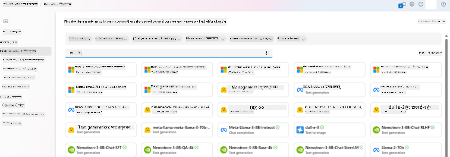
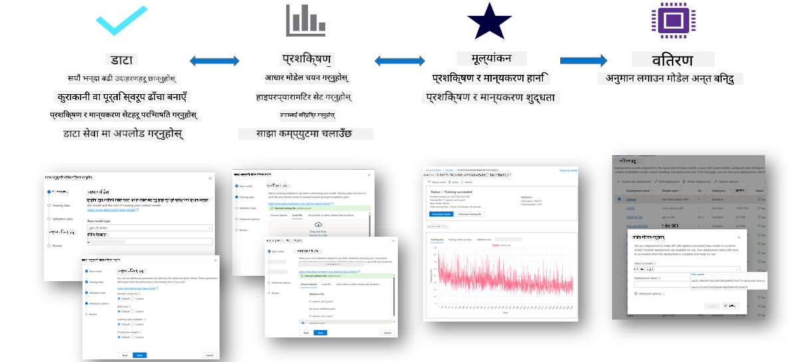
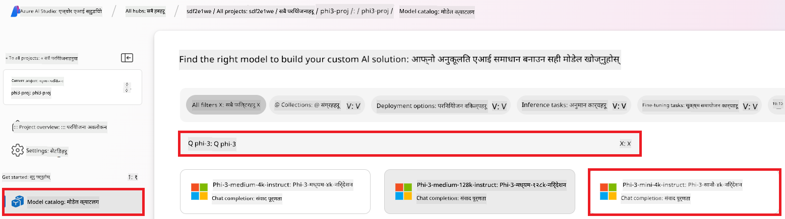
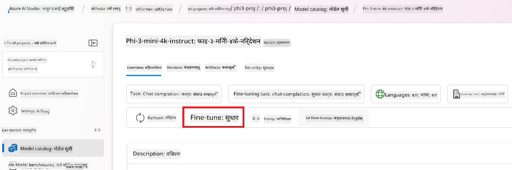
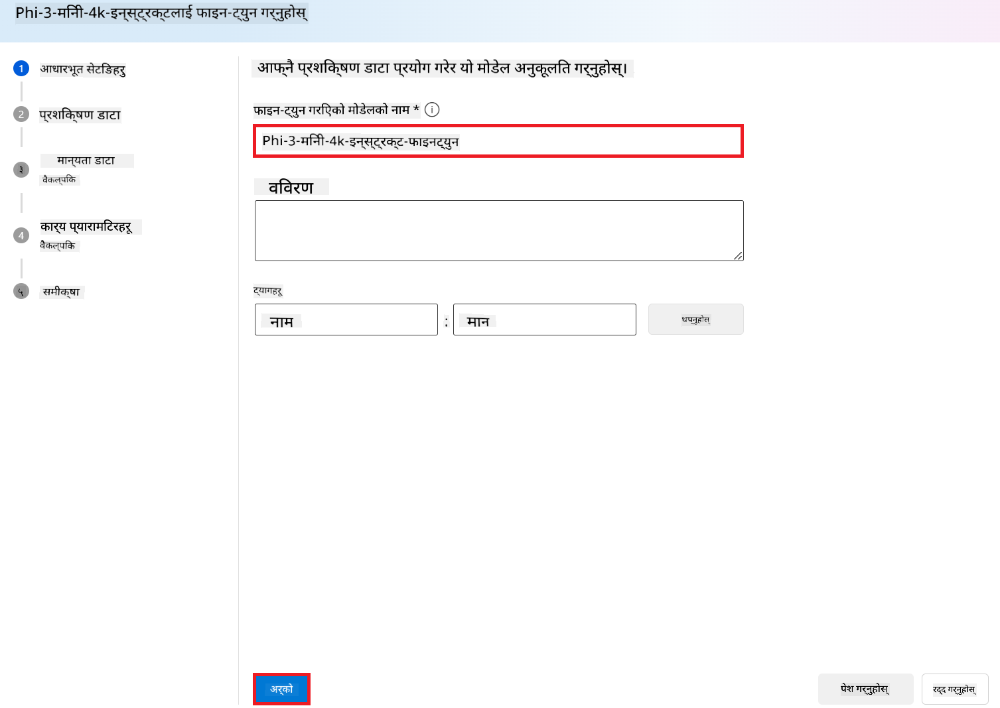
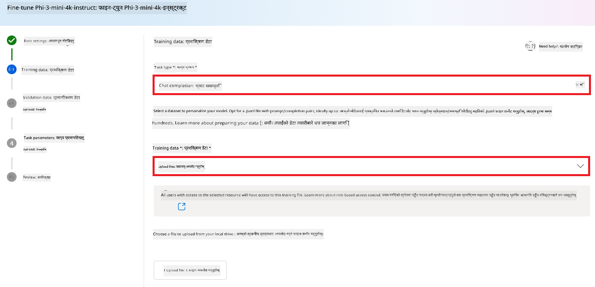
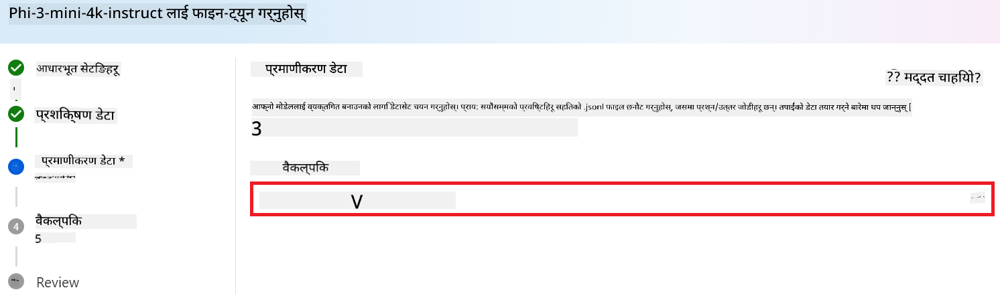
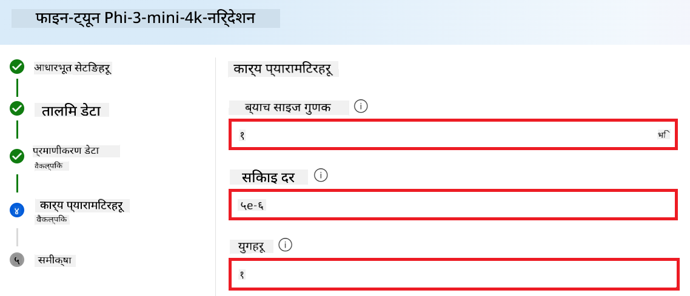
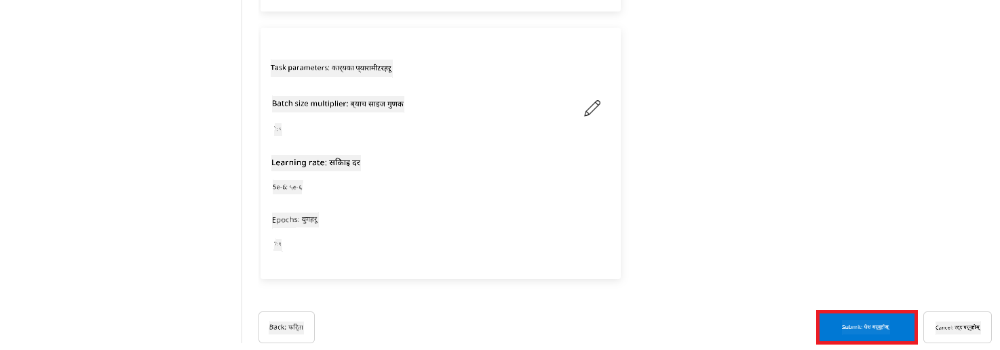
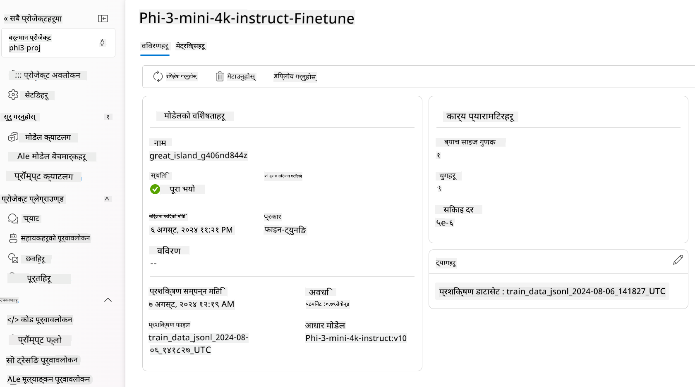

<!--
CO_OP_TRANSLATOR_METADATA:
{
  "original_hash": "c1559c5af6caccf6f623fd43a6b3a9a3",
  "translation_date": "2025-05-09T20:28:33+00:00",
  "source_file": "md/03.FineTuning/FineTuning_AIFoundry.md",
  "language_code": "ne"
}
-->
# Azure AI Foundry सँग Phi-3 लाई फाइन-ट्यून गर्ने तरिका

आउनुहोस्, Azure AI Foundry प्रयोग गरी Microsoft को Phi-3 Mini भाषा मोडललाई कसरी फाइन-ट्यून गर्ने भनेर हेर्नुहोस्। फाइन-ट्यूनिङले Phi-3 Mini लाई विशेष कामहरूका लागि अनुकूल बनाउन मद्दत गर्छ, जसले यसलाई अझ शक्तिशाली र सन्दर्भ-सम्झदार बनाउँछ।

## विचार गर्नुपर्ने कुराहरू

- **क्षमताहरू:** कुन मोडलहरू फाइन-ट्यून गर्न सकिन्छ? आधार मोडललाई के-कसरी फाइन-ट्यून गर्न सकिन्छ?
- **खर्च:** फाइन-ट्यूनिङको मूल्य निर्धारण कस्तो छ?
- **अनुकूलन:** आधार मोडलमा कति परिवर्तन गर्न सकिन्छ – र कुन तरिकाले?
- **सुविधा:** फाइन-ट्यूनिङ कसरी हुन्छ – के मलाई कस्टम कोड लेख्नुपर्छ? के मलाई आफ्नै कम्प्युटिङ ल्याउनुपर्छ?
- **सुरक्षा:** फाइन-ट्यून गरिएको मोडलहरूमा सुरक्षा जोखिमहरू हुन्छन् – के कुनै सुरक्षा उपायहरू छन् जसले अनपेक्षित नोक्सानबाट बचाउँछ?



## फाइन-ट्यूनिङको तयारी

### पूर्वशर्तहरू

> [!NOTE]
> Phi-3 परिवारका मोडलहरूका लागि, pay-as-you-go मोडल फाइन-ट्यून सेवा केवल **East US 2** क्षेत्रहरूमा सिर्जना गरिएका हबहरूमा उपलब्ध छ।

- Azure सदस्यता। यदि तपाईंको Azure सदस्यता छैन भने, सुरु गर्न [पेड Azure खाता](https://azure.microsoft.com/pricing/purchase-options/pay-as-you-go) सिर्जना गर्नुहोस्।

- [AI Foundry परियोजना](https://ai.azure.com?WT.mc_id=aiml-138114-kinfeylo)।
- Azure RBAC (Role-Based Access Controls) प्रयोग गरेर Azure AI Foundry मा अपरेसनहरूको पहुँच दिन्छ। यस लेखका कदमहरू गर्न, तपाईंको प्रयोगकर्ता खातामा स्रोत समूहमा __Azure AI Developer भूमिका__ अनिवार्य छ।

### सदस्यता प्रदायक दर्ता

सुनिश्चित गर्नुहोस् कि सदस्यता `Microsoft.Network` स्रोत प्रदायकमा दर्ता गरिएको छ।

1. [Azure पोर्टल](https://portal.azure.com) मा साइन इन गर्नुहोस्।
1. बाँया मेनुबाट **Subscriptions** चयन गर्नुहोस्।
1. तपाईंले प्रयोग गर्न चाहेको सदस्यता चयन गर्नुहोस्।
1. बाँया मेनुबाट **AI project settings** > **Resource providers** चयन गर्नुहोस्।
1. **Microsoft.Network** स्रोत प्रदायक सूचीमा छ कि छैन पुष्टि गर्नुहोस्। नभए थप्नुहोस्।

### डाटा तयारी

तपाईंको मोडललाई फाइन-ट्यून गर्न प्रशिक्षण र मान्यकरण डाटा तयार गर्नुहोस्। तपाईंको प्रशिक्षण र मान्यकरण डाटा सेटहरूमा मोडलले कसरि काम गर्ने भनेर इनपुट र आउटपुट उदाहरणहरू समावेश हुन्छन्।

सबै प्रशिक्षण उदाहरणहरू अपेक्षित इनफरेन्स ढाँचामा हुनु आवश्यक छ। प्रभावकारी फाइन-ट्यूनिङका लागि सन्तुलित र विविध डाटासेट सुनिश्चित गर्नुहोस्।

यसमा डाटा सन्तुलन कायम राख्नु, विभिन्न परिदृश्यहरू समावेश गर्नु, र प्रशिक्षण डाटा समय-समयमा सुधार गर्दै वास्तविक संसारका अपेक्षासँग मेल खाने बनाउनु पर्दछ जसले अधिक सटीक र सन्तुलित मोडल प्रतिक्रियाहरू ल्याउँछ।

विभिन्न मोडल प्रकारहरूले फरक ढाँचाको प्रशिक्षण डाटा चाहिन्छ।

### Chat Completion

तपाईंले प्रयोग गर्ने प्रशिक्षण र मान्यकरण डाटा **JSON Lines (JSONL)** ढाँचामा हुनु आवश्यक छ। `Phi-3-mini-128k-instruct` को लागि फाइन-ट्यूनिङ डाटासेटले Chat completions API मा प्रयोग हुने संवादात्मक ढाँचामा हुनु पर्दछ।

### उदाहरण फाइल ढाँचा

```json
    {"messages": [{"role": "system", "content": "You are an Xbox customer support agent whose primary goal is to help users with issues they are experiencing with their Xbox devices. You are friendly and concise. You only provide factual answers to queries, and do not provide answers that are not related to Xbox."}, {"role": "user", "content": "Is Xbox better than PlayStation?"}, {"role": "assistant", "content": "I apologize, but I cannot provide personal opinions. My primary job is to assist you with any issues related to your Xbox device. Do you have any Xbox-related issues that need addressing?"}]}
    {"messages": [{"role": "system", "content": "You are an Xbox customer support agent whose primary goal is to help users with issues they are experiencing with their Xbox devices. You are friendly and concise. You only provide factual answers to queries, and do not provide answers that are not related to Xbox."}, {"role": "user", "content": "Can I play PC games on my Xbox?"}, {"role": "assistant", "content": "While Xbox consoles don't natively support PC games, they can play an array of Xbox games, many of which are also available on PC. Can I assist you with finding games compatible with your Xbox device?"}]}
    {"messages": [{"role": "system", "content": "You are an Xbox customer support agent whose primary goal is to help users with issues they are experiencing with their Xbox devices. You are friendly and concise. You only provide factual answers to queries, and do not provide answers that are not related to Xbox."}, {"role": "user", "content": "I'm having trouble connecting my Xbox to the Wi-Fi."}, {"role": "assistant", "content": "No worries, let's go through the network settings on your Xbox. Can you please tell me what happens when you try to connect it to the Wi-Fi?"}]}
```

समर्थित फाइल प्रकार JSON Lines हो। फाइलहरू डिफल्ट डाटास्टोरमा अपलोड गरिन्छ र तपाईंको परियोजनामा उपलब्ध गराइन्छ।

## Azure AI Foundry सँग Phi-3 लाई फाइन-ट्यून गर्ने तरिका

Azure AI Foundry ले ठूलो भाषा मोडलहरूलाई तपाईंको व्यक्तिगत डाटासेट अनुसार अनुकूल बनाउन फाइन-ट्यूनिङ प्रक्रिया प्रयोग गर्न दिन्छ। फाइन-ट्यूनिङले विशेष काम र अनुप्रयोगहरूका लागि अनुकूलन र सुधार गर्ने ठूलो मूल्य दिन्छ। यसले प्रदर्शन सुधार, लागत-कुशलता, कम विलम्बता, र अनुकूलित नतिजा ल्याउँछ।



### नयाँ परियोजना सिर्जना गर्नुहोस्

1. [Azure AI Foundry](https://ai.azure.com) मा साइन इन गर्नुहोस्।

1. Azure AI Foundry मा नयाँ परियोजना सिर्जना गर्न **+New project** चयन गर्नुहोस्।

    

1. निम्न कार्यहरू गर्नुहोस्:

    - परियोजनाको **Hub name** राख्नुहोस्। यो अद्वितीय हुनुपर्छ।
    - प्रयोग गर्न चाहेको **Hub** चयन गर्नुहोस् (आवश्यक भए नयाँ बनाउनुहोस्)।

    

1. नयाँ हब सिर्जना गर्न निम्न कार्यहरू गर्नुहोस्:

    - **Hub name** प्रविष्ट गर्नुहोस्। यो अद्वितीय हुनुपर्छ।
    - तपाईंको Azure **Subscription** चयन गर्नुहोस्।
    - प्रयोग गर्न चाहेको **Resource group** चयन गर्नुहोस् (आवश्यक भए नयाँ बनाउनुहोस्)।
    - प्रयोग गर्न चाहेको **Location** चयन गर्नुहोस्।
    - प्रयोग गर्न चाहेको **Connect Azure AI Services** चयन गर्नुहोस् (आवश्यक भए नयाँ बनाउनुहोस्)।
    - **Connect Azure AI Search** मा **Skip connecting** चयन गर्नुहोस्।

    

1. **Next** चयन गर्नुहोस्।
1. **Create a project** चयन गर्नुहोस्।

### डाटा तयारी

फाइन-ट्यूनिङ अघि, आफ्नो कामसँग सम्बन्धित डाटासेट जम्मा गर्नुहोस् वा सिर्जना गर्नुहोस्, जस्तै च्याट निर्देशनहरू, प्रश्न-उत्तर जोडीहरू, वा अन्य सम्बन्धित पाठ डाटा। यस डाटालाई सफा र पूर्वप्रक्रिया गर्नुहोस् – आवाज हटाउनुहोस्, हराएका मानहरू व्यवस्थापन गर्नुहोस्, र टेक्स्ट टोकनाइज गर्नुहोस्।

### Azure AI Foundry मा Phi-3 मोडलहरू फाइन-ट्यून गर्नुहोस्

> [!NOTE]
> Phi-3 मोडलहरूको फाइन-ट्यूनिङ हाल East US 2 मा अवस्थित परियोजनाहरूमा मात्र समर्थित छ।

1. बाँया पट्टि ट्याबबाट **Model catalog** चयन गर्नुहोस्।

1. **search bar** मा *phi-3* टाइप गर्नुहोस् र प्रयोग गर्न चाहेको phi-3 मोडल चयन गर्नुहोस्।

    

1. **Fine-tune** चयन गर्नुहोस्।

    

1. **Fine-tuned model name** प्रविष्ट गर्नुहोस्।

    

1. **Next** चयन गर्नुहोस्।

1. निम्न कार्यहरू गर्नुहोस्:

    - **task type** मा **Chat completion** चयन गर्नुहोस्।
    - प्रयोग गर्न चाहेको **Training data** चयन गर्नुहोस्। Azure AI Foundry को डाटा वा स्थानीय वातावरणबाट अपलोड गर्न सकिन्छ।

    

1. **Next** चयन गर्नुहोस्।

1. प्रयोग गर्न चाहेको **Validation data** अपलोड गर्नुहोस् वा **Automatic split of training data** चयन गर्न सक्नुहुन्छ।

    

1. **Next** चयन गर्नुहोस्।

1. निम्न कार्यहरू गर्नुहोस्:

    - प्रयोग गर्न चाहेको **Batch size multiplier** चयन गर्नुहोस्।
    - प्रयोग गर्न चाहेको **Learning rate** चयन गर्नुहोस्।
    - प्रयोग गर्न चाहेको **Epochs** चयन गर्नुहोस्।

    

1. फाइन-ट्यूनिङ प्रक्रिया सुरु गर्न **Submit** चयन गर्नुहोस्।

    

1. तपाईंको मोडल फाइन-ट्यून भएपछि, स्थिति **Completed** देखाइनेछ। अब तपाईं मोडललाई डिप्लोय गर्न सक्नुहुन्छ र आफ्नो अनुप्रयोग, प्लेग्राउन्ड, वा प्रॉम्प्ट फ्लोमा प्रयोग गर्न सक्नुहुन्छ। थप जानकारीको लागि [How to deploy Phi-3 family of small language models with Azure AI Foundry](https://learn.microsoft.com/azure/ai-studio/how-to/deploy-models-phi-3?tabs=phi-3-5&pivots=programming-language-python) हेर्नुहोस्।

    

> [!NOTE]
> Phi-3 को फाइन-ट्यूनिङ सम्बन्धी थप विस्तृत जानकारीको लागि [Fine-tune Phi-3 models in Azure AI Foundry](https://learn.microsoft.com/azure/ai-studio/how-to/fine-tune-phi-3?tabs=phi-3-mini) भ्रमण गर्नुहोस्।

## फाइन-ट्यून गरिएको मोडलहरू सफा गर्ने तरिका

तपाईं [Azure AI Foundry](https://ai.azure.com) मा फाइन-ट्यूनिङ मोडल सूचीबाट वा मोडल विवरण पृष्ठबाट फाइन-ट्यून गरिएको मोडल मेटाउन सक्नुहुन्छ। फाइन-ट्यून पृष्ठबाट मेटाउन चाहेको मोडल चयन गरी Delete बटन थिच्नुहोस्।

> [!NOTE]
> यदि कस्टम मोडलमा हाल कुनै डिप्लोयमेन्ट छ भने, त्यो मोडल मेटाउन सकिँदैन। पहिले डिप्लोयमेन्ट मेटाउनु पर्छ।

## खर्च र कोटा

### Phi-3 मोडलहरूलाई सेवा रूपमा फाइन-ट्यून गर्दा खर्च र कोटा

Phi मोडलहरू Microsoft द्वारा सेवा रूपमा प्रदान गरिन्छ र Azure AI Foundry सँग एकीकृत छन्। मूल्य जानकारी [डिप्लोय](https://learn.microsoft.com/azure/ai-studio/how-to/deploy-models-phi-3?tabs=phi-3-5&pivots=programming-language-python) वा फाइन-ट्यूनिङ गर्दा Deployment Wizard को Pricing and terms ट्याबमा भेट्न सकिन्छ।

## सामग्री फिल्टरिङ

Pay-as-you-go सेवा रूपमा डिप्लोय गरिएका मोडलहरू Azure AI Content Safety द्वारा सुरक्षित छन्। रियल-टाइम एन्डपोइन्टहरूमा डिप्लोय गर्दा, यो क्षमता अक्षम गर्न सकिन्छ। Azure AI Content Safety सक्षम हुँदा, प्रॉम्प्ट र कम्प्लीसन दुवै हानिकारक सामग्री पहिचान र रोक्न डिजाइन गरिएको वर्गीकरण मोडलहरूको समूहबाट गुज्रन्छ। सामग्री फिल्टरिङ प्रणालीले सम्भावित हानिकारक सामग्रीका विशेष वर्गहरूलाई इनपुट र आउटपुट दुवैमा पहिचान गरी आवश्यक कदम चाल्छ। थप जानकारीको लागि [Azure AI Content Safety](https://learn.microsoft.com/azure/ai-studio/concepts/content-filtering) हेर्नुहोस्।

**फाइन-ट्यूनिङ कन्फिगरेसन**

हाइपरप्यारामिटरहरू: सिकाइ दर, ब्याच साइज, र प्रशिक्षण ईपोक्स जस्ता हाइपरप्यारामिटरहरू परिभाषित गर्नुहोस्।

**हानि कार्य (Loss Function)**

आफ्नो कामको लागि उपयुक्त हानि कार्य चयन गर्नुहोस् (जस्तै, cross-entropy)।

**अप्टिमाइजर**

प्रशिक्षणको क्रममा ग्रेडियन्ट अपडेटका लागि अप्टिमाइजर चयन गर्नुहोस् (जस्तै, Adam)।

**फाइन-ट्यूनिङ प्रक्रिया**

- प्रि-ट्रेन्ड मोडल लोड गर्नुहोस्: Phi-3 Mini checkpoint लोड गर्नुहोस्।
- कस्टम लेयर्स थप्नुहोस्: काम विशेष लेयर्स थप्नुहोस् (जस्तै, च्याट निर्देशनका लागि classification head)।

**मोडल प्रशिक्षण**

तयार गरिएको डाटासेट प्रयोग गरी मोडललाई फाइन-ट्यून गर्नुहोस्। प्रशिक्षण प्रगति अनुगमन गर्नुहोस् र आवश्यक परे हाइपरप्यारामिटर समायोजन गर्नुहोस्।

**मूल्यांकन र मान्यकरण**

मान्यकरण सेट: आफ्नो डाटालाई प्रशिक्षण र मान्यकरण सेटमा विभाजन गर्नुहोस्।

**प्रदर्शन मूल्यांकन**

सटीकता, F1-स्कोर, वा perplexity जस्ता मेट्रिक्स प्रयोग गरी मोडल प्रदर्शन मूल्यांकन गर्नुहोस्।

## फाइन-ट्यून गरिएको मोडल सुरक्षित गर्नुहोस्

**Checkpoint**

भविष्यमा प्रयोगका लागि फाइन-ट्यून गरिएको मोडलको checkpoint सुरक्षित गर्नुहोस्।

## डिप्लोयमेन्ट

- वेब सेवा रूपमा डिप्लोय गर्नुहोस्: Azure AI Foundry मा आफ्नो फाइन-ट्यून गरिएको मोडल वेब सेवा रूपमा डिप्लोय गर्नुहोस्।
- एन्डपोइन्ट परीक्षण गर्नुहोस्: डिप्लोय गरिएको एन्डपोइन्टमा टेस्ट क्वेरीहरू पठाएर यसको कार्यक्षमता जाँच गर्नुहोस्।

## पुनरावृत्ति र सुधार

यदि प्रदर्शन सन्तोषजनक छैन भने, हाइपरप्यारामिटर समायोजन गरेर, थप डाटा थपेर, वा थप ईपोक्स फाइन-ट्यून गरेर पुनरावृत्ति गर्नुहोस्।

## अनुगमन र सुधार

मोडलको व्यवहार निरन्तर अनुगमन गर्नुहोस् र आवश्यक परे सुधार गर्नुहोस्।

## अनुकूलन र विस्तार

कस्टम कामहरू: Phi-3 Mini लाई च्याट निर्देशन बाहेकका विभिन्न कामहरूका लागि पनि फाइन-ट्यून गर्न सकिन्छ। अन्य प्रयोगहरू अन्वेषण गर्नुहोस्!
प्रयोग: प्रदर्शन सुधार गर्न विभिन्न आर्किटेक्चर, लेयर संयोजनहरू, र प्रविधिहरू प्रयास गर्नुहोस्।

> [!NOTE]
> फाइन-ट्यूनिङ एक पुनरावृत्तिमूलक प्रक्रिया हो। प्रयोग गर्नुहोस्, सिक्नुहोस्, र आफ्नो विशिष्ट कामका लागि उत्तम नतिजा पाउन मोडल अनुकूलन गर्नुहोस्!

**अस्वीकरण**:  
यो दस्तावेज AI अनुवाद सेवा [Co-op Translator](https://github.com/Azure/co-op-translator) प्रयोग गरी अनुवाद गरिएको हो। हामी शुद्धताका लागि प्रयासरत छौं, तर कृपया ध्यान दिनुहोस् कि स्वचालित अनुवादमा त्रुटि वा अशुद्धता हुन सक्छ। मूल दस्तावेज यसको मूल भाषामा नै अधिकारिक स्रोत मानिनुपर्छ। महत्वपूर्ण जानकारीका लागि व्यावसायिक मानवीय अनुवाद सिफारिस गरिन्छ। यस अनुवादको प्रयोगबाट उत्पन्न कुनै पनि गलतफहमी वा गलत व्याख्याका लागि हामी जिम्मेवार छैनौं।