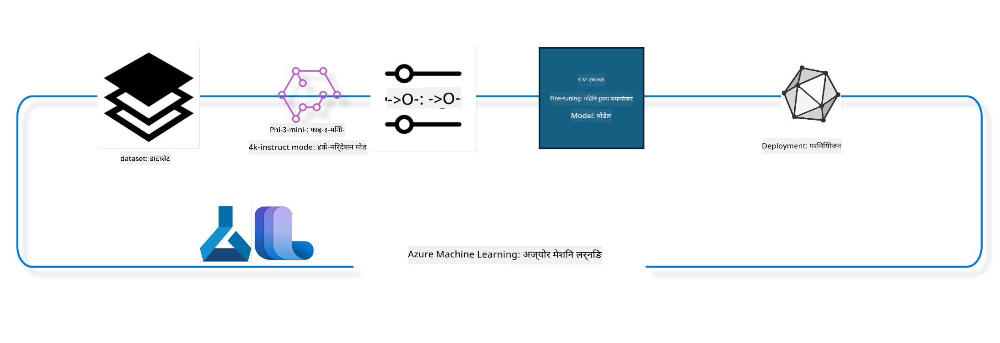

<!--
CO_OP_TRANSLATOR_METADATA:
{
  "original_hash": "944949f040e61b2ea25b3460f7394fd4",
  "translation_date": "2025-05-09T21:00:06+00:00",
  "source_file": "md/03.FineTuning/FineTuning_MLSDK.md",
  "language_code": "ne"
}
-->
## Azure ML सिस्टम रजिस्ट्रीबाट चैट-सम्पूर्णता कम्पोनेंटहरू कसरी प्रयोग गर्ने र मोडेललाई फाइन ट्यून गर्ने

यस उदाहरणमा, हामी Phi-3-mini-4k-instruct मोडेललाई दुई व्यक्तिबीचको संवाद पूरा गर्न ultrachat_200k डेटासेट प्रयोग गरी फाइन ट्यून गर्नेछौं।



यस उदाहरणले तपाईंलाई Azure ML SDK र Python प्रयोग गरी फाइन ट्यून कसरी गर्ने र त्यसपछि फाइन ट्यून गरिएको मोडेललाई रियल टाइम इन्फरेन्सको लागि अनलाइन एन्डपोइन्टमा कसरी डिप्लोय गर्ने देखाउनेछ।

### तालिम डेटा

हामी ultrachat_200k डेटासेट प्रयोग गर्नेछौं। यो UltraChat डेटासेटको निकै फिल्टर गरिएको संस्करण हो र Zephyr-7B-β, जुन एक अत्याधुनिक 7b चैट मोडेल हो, प्रशिक्षण गर्न प्रयोग गरिएको थियो।

### मोडेल

हामी Phi-3-mini-4k-instruct मोडेल प्रयोग गर्नेछौं जसले देखाउँछ कि प्रयोगकर्ताले कसरी चैट-सम्पूर्णता कार्यको लागि मोडेललाई फाइन ट्यून गर्न सक्छ। यदि तपाईंले यो नोटबुक कुनै विशेष मोडेल कार्डबाट खोलेको हो भने, निश्चित मोडेल नाम परिवर्तन गर्न नबिर्सनुहोस्।

### कार्यहरू

- फाइन ट्यून गर्न मोडेल छान्नुहोस्।
- तालिम डेटा छान्नुहोस् र अन्वेषण गर्नुहोस्।
- फाइन ट्यूनिङ काम कन्फिगर गर्नुहोस्।
- फाइन ट्यूनिङ काम चलाउनुहोस्।
- तालिम र मूल्याङ्कन मेट्रिक्स समीक्षा गर्नुहोस्।
- फाइन ट्यून गरिएको मोडेल दर्ता गर्नुहोस्।
- रियल टाइम इन्फरेन्सको लागि फाइन ट्यून गरिएको मोडेल डिप्लोय गर्नुहोस्।
- स्रोतहरू सफा गर्नुहोस्।

## १. पूर्व आवश्यकताहरू सेटअप गर्नुहोस्

- निर्भरता स्थापना गर्नुहोस्
- AzureML Workspace सँग जडान गर्नुहोस्। SDK प्रमाणीकरण सेटअप बारे थप जान्न यहाँ हेर्नुहोस्। तल <WORKSPACE_NAME>, <RESOURCE_GROUP> र <SUBSCRIPTION_ID> प्रतिस्थापन गर्नुहोस्।
- azureml सिस्टम रजिस्ट्रीसँग जडान गर्नुहोस्
- वैकल्पिक प्रयोग प्रयोग प्रयोग प्रयोग प्रयोग प्रयोग प्रयोग प्रयोग प्रयोग प्रयोग प्रयोग प्रयोग प्रयोग प्रयोग प्रयोग प्रयोग प्रयोग प्रयोग प्रयोग प्रयोग प्रयोग प्रयोग प्रयोग प्रयोग प्रयोग प्रयोग प्रयोग प्रयोग प्रयोग प्रयोग प्रयोग प्रयोग प्रयोग प्रयोग प्रयोग प्रयोग प्रयोग प्रयोग प्रयोग प्रयोग प्रयोग प्रयोग प्रयोग प्रयोग प्रयोग प्रयोग प्रयोग प्रयोग प्रयोग प्रयोग प्रयोग प्रयोग प्रयोग प्रयोग प्रयोग प्रयोग प्रयोग प्रयोग प्रयोग प्रयोग प्रयोग प्रयोग प्रयोग प्रयोग प्रयोग प्रयोग प्रयोग प्रयोग प्रयोग प्रयोग प्रयोग प्रयोग प्रयोग प्रयोग प्रयोग प्रयोग प्रयोग प्रयोग प्रयोग प्रयोग प्रयोग प्रयोग प्रयोग प्रयोग प्रयोग प्रयोग प्रयोग प्रयोग प्रयोग प्रयोग प्रयोग प्रयोग प्रयोग प्रयोग प्रयोग प्रयोग प्रयोग प्रयोग प्रयोग प्रयोग प्रयोग प्रयोग प्रयोग प्रयोग प्रयोग प्रयोग प्रयोग प्रयोग प्रयोग प्रयोग प्रयोग प्रयोग प्रयोग प्रयोग प्रयोग प्रयोग प्रयोग प्रयोग प्रयोग प्रयोग प्रयोग प्रयोग प्रयोग प्रयोग प्रयोग प्रयोग प्रयोग प्रयोग प्रयोग प्रयोग प्रयोग प्रयोग प्रयोग प्रयोग प्रयोग प्रयोग प्रयोग प्रयोग प्रयोग प्रयोग प्रयोग प्रयोग प्रयोग प्रयोग प्रयोग प्रयोग प्रयोग प्रयोग प्रयोग प्रयोग प्रयोग प्रयोग प्रयोग प्रयोग प्रयोग प्रयोग प्रयोग प्रयोग प्रयोग प्रयोग प्रयोग प्रयोग प्रयोग प्रयोग प्रयोग प्रयोग प्रयोग प्रयोग प्रयोग प्रयोग प्रयोग प्रयोग प्रयोग प्रयोग प्रयोग प्रयोग प्रयोग प्रयोग प्रयोग प्रयोग प्रयोग प्रयोग प्रयोग प्रयोग प्रयोग प्रयोग प्रयोग प्रयोग प्रयोग प्रयोग प्रयोग प्रयोग प्रयोग प्रयोग प्रयोग प्रयोग प्रयोग प्रयोग प्रयोग प्रयोग प्रयोग प्रयोग प्रयोग प्रयोग प्रयोग प्रयोग प्रयोग प्रयोग प्रयोग प्रयोग प्रयोग प्रयोग प्रयोग प्रयोग प्रयोग प्रयोग प्रयोग प्रयोग प्रयोग प्रयोग प्रयोग प्रयोग प्रयोग प्रयोग प्रयोग प्रयोग प्रयोग प्रयोग प्रयोग प्रयोग प्रयोग प्रयोग प्रयोग प्रयोग प्रयोग प्रयोग प्रयोग प्रयोग प्रयोग प्रयोग प्रयोग प्रयोग प्रयोग प्रयोग प्रयोग प्रयोग प्रयोग प्रयोग प्रयोग प्रयोग प्रयोग प्रयोग प्रयोग प्रयोग प्रयोग प्रयोग प्रयोग प्रयोग प्रयोग प्रयोग प्रयोग प्रयोग प्रयोग प्रयोग प्रयोग प्रयोग प्रयोग प्रयोग प्रयोग प्रयोग प्रयोग प्रयोग प्रयोग प्रयोग प्रयोग प्रयोग प्रयोग प्रयोग प्रयोग प्रयोग प्रयोग प्रयोग प्रयोग प्रयोग प्रयोग प्रयोग प्रयोग प्रयोग प्रयोग प्रयोग प्रयोग प्रयोग प्रयोग प्रयोग प्रयोग प्रयोग प्रयोग प्रयोग प्रयोग प्रयोग प्रयोग प्रयोग प्रयोग प्रयोग प्रयोग प्रयोग प्रयोग प्रयोग प्रयोग प्रयोग प्रयोग प्रयोग प्रयोग प्रयोग प्रयोग प्रयोग प्रयोग प्रयोग प्रयोग प्रयोग प्रयोग प्रयोग प्रयोग प्रयोग प्रयोग प्रयोग प्रयोग प्रयोग प्रयोग प्रयोग प्रयोग प्रयोग प्रयोग प्रयोग प्रयोग प्रयोग प्रयोग प्रयोग प्रयोग प्रयोग प्रयोग प्रयोग प्रयोग प्रयोग प्रयोग प्रयोग प्रयोग प्रयोग प्रयोग प्रयोग प्रयोग प्रयोग प्रयोग प्रयोग प्रयोग प्रयोग प्रयोग प्रयोग प्रयोग प्रयोग प्रयोग प्रयोग प्रयोग प्रयोग प्रयोग प्रयोग प्रयोग प्रयोग प्रयोग प्रयोग प्रयोग प्रयोग प्रयोग प्रयोग प्रयोग प्रयोग प्रयोग प्रयोग प्रयोग प्रयोग प्रयोग प्रयोग प्रयोग प्रयोग प्रयोग प्रयोग प्रयोग प्रयोग प्रयोग प्रयोग प्रयोग प्रयोग प्रयोग प्रयोग प्रयोग प्रयोग प्रयोग प्रयोग प्रयोग प्रयोग प्रयोग प्रयोग प्रयोग प्रयोग प्रयोग प्रयोग प्रयोग प्रयोग प्रयोग प्रयोग प्रयोग प्रयोग प्रयोग प्रयोग प्रयोग प्रयोग प्रयोग प्रयोग प्रयोग प्रयोग प्रयोग प्रयोग प्रयोग प्रयोग प्रयोग प्रयोग प्रयोग प्रयोग प्रयोग प्रयोग प्रयोग प्रयोग प्रयोग प्रयोग प्रयोग प्रयोग प्रयोग प्रयोग प्रयोग प्रयोग प्रयोग प्रयोग प्रयोग प्रयोग प्रयोग प्रयोग प्रयोग प्रयोग प्रयोग प्रयोग प्रयोग प्रयोग प्रयोग प्रयोग प्रयोग प्रयोग प्रयोग प्रयोग प्रयोग प्रयोग प्रयोग प्रयोग प्रयोग प्रयोग प्रयोग प्रयोग प्रयोग प्रयोग प्रयोग प्रयोग प्रयोग प्रयोग प्रयोग प्रयोग प्रयोग प्रयोग प्रयोग प्रयोग प्रयोग प्रयोग प्रयोग प्रयोग प्रयोग प्रयोग प्रयोग प्रयोग प्रयोग प्रयोग प्रयोग प्रयोग प्रयोग प्रयोग प्रयोग प्रयोग प्रयोग प्रयोग प्रयोग प्रयोग प्रयोग प्रयोग प्रयोग प्रयोग प्रयोग प्रयोग प्रयोग प्रयोग प्रयोग प्रयोग प्रयोग प्रयोग प्रयोग प्रयोग प्रयोग प्रयोग प्रयोग प्रयोग प्रयोग प्रयोग प्रयोग प्रयोग प्रयोग प्रयोग प्रयोग प्रयोग प्रयोग प्रयोग प्रयोग प्रयोग प्रयोग प्रयोग प्रयोग प्रयोग प्रयोग प्रयोग प्रयोग प्रयोग प्रयोग प्रयोग प्रयोग प्रयोग प्रयोग प्रयोग प्रयोग प्रयोग प्रयोग प्रयोग प्रयोग प्रयोग प्रयोग प्रयोग प्रयोग प्रयोग प्रयोग प्रयोग प्रयोग प्रयोग प्रयोग प्रयोग प्रयोग प्रयोग प्रयोग प्रयोग प्रयोग प्रयोग प्रयोग प्रयोग प्रयोग प्रयोग प्रयोग प्रयोग प्रयोग प्रयोग प्रयोग प्रयोग प्रयोग प्रयोग प्रयोग प्रयोग प्रयोग प्रयोग प्रयोग प्रयोग प्रयोग प्रयोग प्रयोग प्रयोग प्रयोग प्रयोग प्रयोग प्रयोग प्रयोग प्रयोग प्रयोग प्रयोग प्रयोग प्रयोग प्रयोग प्रयोग प्रयोग प्रयोग प्रयोग प्रयोग प्रयोग प्रयोग प्रयोग प्रयोग प्रयोग प्रयोग प्रयोग प्रयोग प्रयोग प्रयोग प्रयोग प्रयोग प्रयोग प्रयोग प्रयोग प्रयोग प्रयोग प्रयोग प्रयोग प्रयोग प्रयोग प्रयोग प्रयोग प्रयोग प्रयोग प्रयोग प्रयोग प्रयोग प्रयोग प्रयोग प्रयोग प्रयोग प्रयोग प्रयोग प्रयोग प्रयोग प्रयोग प्रयोग प्रयोग प्रयोग प्रयोग प्रयोग प्रयोग प्रयोग प्रयोग प्रयोग प्रयोग प्रयोग प्रयोग प्रयोग प्रयोग प्रयोग प्रयोग प्रयोग प्रयोग प्रयोग प्रयोग प्रयोग प्रयोग प्रयोग प्रयोग प्रयोग प्रयोग प्रयोग प्रयोग प्रयोग प्रयोग प्रयोग प्रयोग प्रयोग प्रयोग प्रयोग प्रयोग प्रयोग प्रयोग प्रयोग प्रयोग प्रयोग प्रयोग प्रयोग प्रयोग प्रयोग प्रयोग प्रयोग प्रयोग प्रयोग प्रयोग प्रयोग प्रयोग प्रयोग प्रयोग प्रयोग प्रयोग प्रयोग प्रयोग प्रयोग प्रयोग प्रयोग प्रयोग प्रयोग प्रयोग प्रयोग प्रयोग प्रयोग प्रयोग प्रयोग प्रयोग प्रयोग प्रयोग प्रयोग प्रयोग प्रयोग प्रयोग प्रयोग प्रयोग प्रयोग प्रयोग प्रयोग प्रयोग प्रयोग प्रयोग प्रयोग प्रयोग प्रयोग प्रयोग प्रयोग प्रयोग प्रयोग प्रयोग प्रयोग प्रयोग प्रयोग प्रयोग प्रयोग प्रयोग प्रयोग प्रयोग प्रयोग प्रयोग प्रयोग प्रयोग प्रयोग प्रयोग प्रयोग प्रयोग प्रयोग प्रयोग प्रयोग प्रयोग प्रयोग प्रयोग प्रयोग प्रयोग प्रयोग प्रयोग प्रयोग प्रयोग प्रयोग प्रयोग प्रयोग प्रयोग प्रयोग प्रयोग प्रयोग प्रयोग प्रयोग प्रयोग प्रयोग प्रयोग प्रयोग प्रयोग प्रयोग प्रयोग प्रयोग प्रयोग प्रयोग प्रयोग प्रयोग प्रयोग प्रयोग प्रयोग प्रयोग प्रयोग प्रयोग प्रयोग प्रयोग प्रयोग प्रयोग प्रयोग प्रयोग प्रयोग प्रयोग प्रयोग प्रयोग प्रयोग प्रयोग प्रयोग प्रयोग प्रयोग प्रयोग प्रयोग प्रयोग प्रयोग प्रयोग प्रयोग प्रयोग प्रयोग प्रयोग प्रयोग प्रयोग प्रयोग प्रयोग प्रयोग प्रयोग प्रयोग प्रयोग प्रयोग प्रयोग प्रयोग प्रयोग प्रयोग प्रयोग प्रयोग प्रयोग प्रयोग प्रयोग प्रयोग प्रयोग प्रयोग प्रयोग प्रयोग प्रयोग प्रयोग प्रयोग प्रयोग प्रयोग प्रयोग प्रयोग प्रयोग प्रयोग प्रयोग प्रयोग प्रयोग प्रयोग प्रयोग प्रयोग प्रयोग प्रयोग प्रयोग प्रयोग प्रयोग प्रयोग प्रयोग प्रयोग प्रयोग प्रयोग प्रयोग प्रयोग प्रयोग प्रयोग प्रयोग प्रयोग प्रयोग प्रयोग प्रयोग प्रयोग प्रयोग प्रयोग प्रयोग प्रयोग प्रयोग प्रयोग प्रयोग प्रयोग प्रयोग प्रयोग प्रयोग प्रयोग प्रयोग प्रयोग प्रयोग प्रयोग प्रयोग प्रयोग प्रयोग प्रयोग प्रयोग प्रयोग प्रयोग प्रयोग प्रयोग प्रयोग प्रयोग प्रयोग प्रयोग प्रयोग प्रयोग प्रयोग प्रयोग प्रयोग प्रयोग प्रयोग प्रयोग प्रयोग प्रयोग प्रयोग प्रयोग प्रयोग प्रयोग प्रयोग प्रयोग प्रयोग प्रयोग प्रयोग प्रयोग प्रयोग प्रयोग प्रयोग प्रयोग प्रयोग प्रयोग प्रयोग प्रयोग प्रयोग प्रयोग प्रयोग प्रयोग प्रयोग प्रयोग प्रयोग प्रयोग प्रयोग प्रयोग प्रयोग प्रयोग प्रयोग प्रयोग प्रयोग प्रयोग प्रयोग प्रयोग प्रयोग प्रयोग प्रयोग प्रयोग प्रयोग प्रयोग प्रयोग प्रयोग प्रयोग प्रयोग प्रयोग प्रयोग प्रयोग प्रयोग प्रयोग प्रयोग प्रयोग प्रयोग प्रयोग प्रयोग प्रयोग प्रयोग प्रयोग प्रयोग प्रयोग प्रयोग प्रयोग प्रयोग प्रयोग प्रयोग प्रयोग प्रयोग प्रयोग प्रयोग प्रयोग प्रयोग प्रयोग प्रयोग प्रयोग प्रयोग प्रयोग प्रयोग प्रयोग प्रयोग प्रयोग प्रयोग प्रयोग प्रयोग प्रयोग प्रयोग प्रयोग प्रयोग प्रयोग प्रयोग प्रयोग प्रयोग प्रयोग प्रयोग प्रयोग प्रयोग प्रयोग प्रयोग प्रयोग प्रयोग प्रयोग प्रयोग प्रयोग प्रयोग प्रयोग प्रयोग प्रयोग प्रयोग प्रयोग प्रयोग प्रयोग प्रयोग प्रयोग प्रयोग प्रयोग प्रयोग प्रयोग प्रयोग प्रयोग प्रयोग प्रयोग प्रयोग प्रयोग प्रयोग प्रयोग प्रयोग प्रयोग प्रयोग प्रयोग प्रयोग प्रयोग प्रयोग प्रयोग प्रयोग प्रयोग प्रयोग प्रयोग प्रयोग प्रयोग प्रयोग प्रयोग प्रयोग प्रयोग प्रयोग प्रयोग प्रयोग प्रयोग प्रयोग प्रयोग प्रयोग प्रयोग प्रयोग प्रयोग प्रयोग प्रयोग प्रयोग प्रयोग प्रयोग प्रयोग प्रयोग प्रयोग प्रयोग प्रयोग प्रयोग प्रयोग प्रयोग प्रयोग प्रयोग प्रयोग प्रयोग प्रयोग प्रयोग प्रयोग प्रयोग प्रयोग प्रयोग प्रयोग प्रयोग प्रयोग प्रयोग प्रयोग प्रयोग प्रयोग प्रयोग प्रयोग प्रयोग प्रयोग प्रयोग प्रयोग प्रयोग प्रयोग प्रयोग प्रयोग प्रयोग प्रयोग प्रयोग प्रयोग प्रयोग प्रयोग प्रयोग प्रयोग प्रयोग प्रयोग प्रयोग प्रयोग प्रयोग प्रयोग प्रयोग प्रयोग प्रयोग प्रयोग प्रयोग प्रयोग प्रयोग प्रयोग प्रयोग प्रयोग प्रयोग प्रयोग प्रयोग प्रयोग प्रयोग प्रयोग प्रयोग प्रयोग प्रयोग प्रयोग प्रयोग प्रयोग प्रयोग प्रयोग प्रयोग प्रयोग प्रयोग प्रयोग प्रयोग प्रयोग प्रयोग प्रयोग प्रयोग प्रयोग प्रयोग प्रयोग प्रयोग प्रयोग प्रयोग प्रयोग प्रयोग प्रयोग प्रयोग प्रयोग प्रयोग प्रयोग प्रयोग प्रयोग प्रयोग प्रयोग प्रयोग प्रयोग प्रयोग प्रयोग प्रयोग प्रयोग प्रयोग प्रयोग प्रयोग प्रयोग प्रयोग प्रयोग प्रयोग प्रयोग प्रयोग प्रयोग प्रयोग प्रयोग प्रयोग प्रयोग प्रयोग प्रयोग प्रयोग प्रयोग प्रयोग प्रयोग प्रयोग प्रयोग प्रयोग प्रयोग प्रयोग प्रयोग प्रयोग प्रयोग प्रयोग प्रयोग प्रयोग प्रयोग प्रयोग प्रयोग प्रयोग प्रयोग प्रयोग प्रयोग प्रयोग प्रयोग प्रयोग प्रयोग प्रयोग प्रयोग प्रयोग प्रयोग प्रयोग प्रयोग प्रयोग प्रयोग प्रयोग प्रयोग प्रयोग प्रयोग प्रयोग प्रयोग प्रयोग प्रयोग प्रयोग प्रयोग प्रयोग प्रयोग प्रयोग प्रयोग प्रयोग प्रयोग प्रयोग प्रयोग प्रयोग प्रयोग प्रयोग प्रयोग प्रयोग प्रयोग प्रयोग प्रयोग प्रयोग प्रयोग प्रयोग प्रयोग प्रयोग प्रयोग प्रयोग प्रयोग प्रयोग प्रयोग प्रयोग प्रयोग प्रयोग प्रयोग प्रयोग प्रयोग प्रयोग प्रयोग प्रयोग प्रयोग प्रयोग प्रयोग प्रयोग प्रयोग प्रयोग प्रयोग प्रयोग प्रयोग प्रयोग प्रयोग प्रयोग प्रयोग प्रयोग प्रयोग प्रयोग प्रयोग प्रयोग प्रयोग प्रयोग प्रयोग प्रयोग प्रयोग प्रयोग प्रयोग प्रयोग प्रयोग प्रयोग प्रयोग प्रयोग प्रयोग प्रयोग प्रयोग प्रयोग प्रयोग प्रयोग प्रयोग प्रयोग प्रयोग प्रयोग प्रयोग प्रयोग प्रयोग प्रयोग प्रयोग प्रयोग प्रयोग प्रयोग प्रयोग प्रयोग प्रयोग प्रयोग प्रयोग प्रयोग प्रयोग प्रयोग प्रयोग प्रयोग प्रयोग प्रयोग प्रयोग प्रयोग प्रयोग प्रयोग प्रयोग प्रयोग प्रयोग प्रयोग प्रयोग प्रयोग प्रयोग प्रयोग प्रयोग प्रयोग प्रयोग प्रयोग प्रयोग प्रयोग प्रयोग प्रयोग प्रयोग प्रयोग प्रयोग प्रयोग प्रयोग प्रयोग प्रयोग प्रयोग प्रयोग प्रयोग प्रयोग प्रयोग प्रयोग प्रयोग प्रयोग प्रयोग प्रयोग प्रयोग प्रयोग प्रयोग प्रयोग प्रयोग प्रयोग प्रयोग प्रयोग प्रयोग प्रयोग प्रयोग प्रयोग प्रयोग प्रयोग प्रयोग प्रयोग प्रयोग प्रयोग प्रयोग प्रयोग प्रयोग प्रयोग प्रयोग प्रयोग प्रयोग प्रयोग प्रयोग प्रयोग प्रयोग प्रयोग प्रयोग प्रयोग प्रयोग प्रयोग प्रयोग प्रयोग प्रयोग प्रयोग प्रयोग प्रयोग प्रयोग प्रयोग प्रयोग प्रयोग प्रयोग प्रयोग प्रयोग प्रयोग प्रयोग प्रयोग प्रयोग प्रयोग प्रयोग प्रयोग प्रयोग प्रयोग प्रयोग प्रयोग प्रयोग प्रयोग प्रयोग प्रयोग प्रयोग प्रयोग प्रयोग प्रयोग प्रयोग प्रयोग प्रयोग प्रयोग प्रयोग प्रयोग प्रयोग प्रयोग प्रयोग प्रयोग प्रयोग प्रयोग प्रयोग प्रयोग प्रयोग प्रयोग प्रयोग प्रयोग प्रयोग प्रयोग प्रयोग प्रयोग प्रयोग प्रयोग प्रयोग प्रयोग प्रयोग प्रयोग प्रयोग प्रयोग प्रयोग प्रयोग प्रयोग प्रयोग प्रयोग प्रयोग प्रयोग प्रयोग प्रयोग प्रयोग प्रयोग प्रयोग प्रयोग प्रयोग प्रयोग प्रयोग प्रयोग प्रयोग प्रयोग प्रयोग प्रयोग प्रयोग प्रयोग प्रयोग प्रयोग प्रयोग प्रयोग प्रयोग प्रयोग प्रयोग प्रयोग प्रयोग प्रयोग प्रयोग प्रयोग प्रयोग प्रयोग प्रयोग प्रयोग प्रयोग प्रयोग प्रयोग प्रयोग प्रयोग प्रयोग प्रयोग प्रयोग प्रयोग प्रयोग प्रयोग प्रयोग प्रयोग प्रयोग प्रयोग प्रयोग प्रयोग प्रयोग प्रयोग प्रयोग प्रयोग प्रयोग प्रयोग प्रयोग प्रयोग प्रयोग प्रयोग प्रयोग प्रयोग प्रयोग प्रयोग प्रयोग प्रयोग प्रयोग प्रयोग प्रयोग प्रयोग प्रयोग प्रयोग प्रयोग प्रयोग प्रयोग प्रयोग प्रयोग प्रयोग प्रयोग प्रयोग प्रयोग प्रयोग प्रयोग प्रयोग प्रयोग प्रयोग प्रयोग प्रयोग प्रयोग प्रयोग प्रयोग प्रयोग प्रयोग प्रयोग प्रयोग प्रयोग प्रयोग प्रयोग प्रयोग प्रयोग प्रयोग प्रयोग प्रयोग प्रयोग प्रयोग प्रयोग प्रयोग प्रयोग प्रयोग प्रयोग प्रयोग प्रयोग प्रयोग प्रयोग प्रयोग प्रयोग प्रयोग प्रयोग प्रयोग प्रयोग प्रयोग प्रयोग प्रयोग प्रयोग प्रयोग प्रयोग प्रयोग प्रयोग प्रयोग प्रयोग प्रयोग प्रयोग प्रयोग प्रयोग प्रयोग प्रयोग प्रयोग प्रयोग प्रयोग प्रयोग प्रयोग प्रयोग प्रयोग प्रयोग प्रयोग प्रयोग प्रयोग प्रयोग प्रयोग प्रयोग प्रयोग प्रयोग प्रयोग प्रयोग प्रयोग प्रयोग प्रयोग प्रयोग प्रयोग प्रयोग प्रयोग प्रयोग प्रयोग प्रयोग प्रयोग प्रयोग प्रयोग प्रयोग प्रयोग प्रयोग प्रयोग प्रयोग प्रयोग प्रयोग प्रयोग प्रयोग प्रयोग प्रयोग प्रयोग प्रयोग प्रयोग प्रयोग प्रयोग प्रयोग प्रयोग प्रयोग प्रयोग प्रयोग प्रयोग प्रयोग प्रयोग प्रयोग प्रयोग प्रयोग प्रयोग प्रयोग प्रयोग प्रयोग प्रयोग प्रयोग प्रयोग प्रयोग प्रयोग प्रयोग प्रयोग प्रयोग प्रयोग प्रयोग प्रयोग प्रयोग प्रयोग प्रयोग प्रयोग प्रयोग प्रयोग प्रयोग प्रयोग प्रयोग प्रयोग प्रयोग प्रयोग प्रयोग प्रयोग प्रयोग प्रयोग प्रयोग प्रयोग प्रयोग प्रयोग प्रयोग प्रयोग प्रयोग प्रयोग प्रयोग प्रयोग प्रयोग प्रयोग प्रयोग प्रयोग प्रयोग प्रयोग प्रयोग प्रयोग प्रयोग प्रयोग प्रयोग प्रयोग प्रयोग प्रयोग प्रयोग प्रयोग प्रयोग प्रयोग प्रयोग प्रयोग प्रयोग प्रयोग प्रयोग प्रयोग प्रयोग प्रयोग प्रयोग प्रयोग प्रयोग प्रयोग प्रयोग प्रयोग प्रयोग प्रयोग प्रयोग प्रयोग प्रयोग प्रयोग प्रयोग प्रयोग प्रयोग प्रयोग प्रयोग प्रयोग प्रयोग प्रयोग प्रयोग प्रयोग प्रयोग प्रयोग प्रयोग प्रयोग प्रयोग प्रयोग प्रयोग प्रयोग प्रयोग प्रयोग प्रयोग प्रयोग प्रयोग प्रयोग प्रयोग प्रयोग प्रयोग प्रयोग प्रयोग प्रयोग प्रयोग प्रयोग प्रयोग प्रयोग प्रयोग प्रयोग प्रयोग प्रयोग प्रयोग प्रयोग प्रयोग प्रयोग प्रयोग प्रयोग प्रयोग प्रयोग प्रयोग प्रयोग प्रयोग प्रयोग प्रयोग प्रयोग प्रयोग प्रयोग प्रयोग प्रयोग प्रयोग प्रयोग प्रयोग प्रयोग प्रयोग प्रयोग प्रयोग प्रयोग प्रयोग प्रयोग प्रयोग प्रयोग प्रयोग प्रयोग प्रयोग प्रयोग प्रयोग प्रयोग प्रयोग प्रयोग प्रयोग प्रयोग प्रयोग प्रयोग प्रयोग प्रयोग प्रयोग प्रयोग प्रयोग प्रयोग प्रयोग प्रयोग प्रयोग प्रयोग प्रयोग प्रयोग प्रयोग प्रयोग प्रयोग प्रयोग प्रयोग प्रयोग प्रयोग प्रयोग प्रयोग प्रयोग प्रयोग प्रयोग प्रयोग प्रयोग प्रयोग प्रयोग प्रयोग प्रयोग प्रयोग प्रयोग प्रयोग प्रयोग प्रयोग प्रयोग प्रयोग प्रयोग प्रयोग प्रयोग प्रयोग प्रयोग प्रयोग प्रयोग प्रयोग प्रयोग प्रयोग प्रयोग प्रयोग प्रयोग प्रयोग प्रयोग प्रयोग प्रयोग प्रयोग प्रयोग प्रयोग प्रयोग प्रयोग प्रयोग प्रयोग प्रयोग प्रयोग प्रयोग प्रयोग प्रयोग प्रयोग प्रयोग प्रयोग प्रयोग प्रयोग प्रयोग प्रयोग प्रयोग प्रयोग प्रयोग प्रयोग प्रयोग प्रयोग प्रयोग प्रयोग प्रयोग प्रयोग प्रयोग प्रयोग प्रयोग प्रयोग प्रयोग प्रयोग प्रयोग प्रयोग प्रयोग प्रयोग प्रयोग प्रयोग प्रयोग प्रयोग प्रयोग प्रयोग प्रयोग प्रयोग प्रयोग प्रयोग प्रयोग प्रयोग प्रयोग प्रयोग प्रयोग प्रयोग प्रयोग प्रयोग प्रयोग प्रयोग प्रयोग प्रयोग प्रयोग प्रयोग प्रयोग प्रयोग प्रयोग प्रयोग प्रयोग प्रयोग प्रयोग प्रयोग प्रयोग प्रयोग प्रयोग प्रयोग प्रयोग प्रयोग प्रयोग प्रयोग प्रयोग प्रयोग प्रयोग प्रयोग प्रयोग प्रयोग प्रयोग प्रयोग प्रयोग प्रयोग प्रयोग प्रयोग प्रयोग प्रयोग प्रयोग प्रयोग प्रयोग प्रयोग प्रयोग प्रयोग प्रयोग प्रयोग प्रयोग प्रयोग प्रयोग प्रयोग प्रयोग प्रयोग प्रयोग प्रयोग प्रयोग प्रयोग प्रयोग प्रयोग प्रयोग प्रयोग प्रयोग प्रयोग प्रयोग प्रयोग प्रयोग प्रयोग प्रयोग प्रयोग प्रयोग प्रयोग प्रयोग प्रयोग प्रयोग प्रयोग प्रयोग प्रयोग प्रयोग प्रयोग प्रयोग प्रयोग प्रयोग प्रयोग प्रयोग प्रयोग प्रयोग प्रयोग प्रयोग प्रयोग प्रयोग प्रयोग प्रयोग प्रयोग प्रयोग प्रयोग प्रयोग प्रयोग प्रयोग प्रयोग प्रयोग प्रयोग प्रयोग प्रयोग प्रयोग प्रयोग प्रयोग प्रयोग प्रयोग प्रयोग प्रयोग प्रयोग प्रयोग प्रयोग प्रयोग प्रयोग प्रयोग प्रयोग प्रयोग प्रयोग प्रयोग प्रयोग प्रयोग प्रयोग प्रयोग प्रयोग प्रयोग प्रयोग प्रयोग प्रयोग प्रयोग प्रयोग प्रयोग प्रयोग प्रयोग प्रयोग प्रयोग प्रयोग प्रयोग प्रयोग प्रयोग प्रयोग प्रयोग प्रयोग प्रयोग प्रयोग प्रयोग प्रयोग प्रयोग प्रयोग प्रयोग प्रयोग प्रयोग प्रयोग प्रयोग प्रयोग प्रयोग प्रयोग प्रयोग प्रयोग प्रयोग प्रयोग प्रयोग प्रयोग प्रयोग प्रयोग प्रयोग प्रयोग प्रयोग प्रयोग प्रयोग प्रयोग प्रयोग प्रयोग प्रयोग प्रयोग प्रयोग प्रयोग प्रयोग प्रयोग प्रयोग प्रयोग प्रयोग प्रयोग प्रयोग प्रयोग प्रयोग प्रयोग प्रयोग प्रयोग प्रयोग प्रयोग प्रयोग प्रयोग प्रयोग प्रयोग प्रयोग प्रयोग प्रयोग प्रयोग प्रयोग प्रयोग प्रयोग प्रयोग प्रयोग प्रयोग प्रयोग प्रयोग प्रयोग प्रयोग प्रयोग प्रयोग प्रयोग प्रयोग प्रयोग प्रयोग प्रयोग प्रयोग प्रयोग प्रयोग प्रयोग प्रयोग प्रयोग प्रयोग प्रयोग प्रयोग प्रयोग प्रयोग प्रयोग प्रयोग प्रयोग प्रयोग प्रयोग प्रयोग प्रयोग प्रयोग प्रयोग प्रयोग प्रयोग प्रयोग प्रयोग प्रयोग प्रयोग प्रयोग प्रयोग प्रयोग प्रयोग प्रयोग प्रयोग प्रयोग प्रयोग प्रयोग प्रयोग प्रयोग प्रयोग प्रयोग प्रयोग प्रयोग प्रयोग प्रयोग प्रयोग प्रयोग प्रयोग प्रयोग प्रयोग प्रयोग प्रयोग प्रयोग प्रयोग प्रयोग प्रयोग प्रयोग प्रयोग प्रयोग प्रयोग प्रयोग प्रयोग प्रयोग प्रयोग प्रयोग प्रयोग प्रयोग प्रयोग प्रयोग प्रयोग प्रयोग प्रयोग प्रयोग प्रयोग प्रयोग प्रयोग प्रयोग प्रयोग प्रयोग प्रयोग प्रयोग प्रयोग प्रयोग प्रयोग प्रयोग प्रयोग प्रयोग प्रयोग प्रयोग प्रयोग प्रयोग प्रयोग प्रयोग प्रयोग प्रयोग प्रयोग प्रयोग प्रयोग प्रयोग प्रयोग प्रयोग प्रयोग प्रयोग प्रयोग प्रयोग प्रयोग प्रयोग प्रयोग प्रयोग प्रयोग प्रयोग प्रयोग प्रयोग प्रयोग प्रयोग प्रयोग प्रयोग प्रयोग प्रयोग प्रयोग प्रयोग प्रयोग प्रयोग प्रयोग प्रयोग प्रयोग प्रयोग प्रयोग प्रयोग प्रयोग प्रयोग प्रयोग प्रयोग प्रयोग प्रयोग प्रयोग प्रयोग प्रयोग प्रयोग प्रयोग प्रयोग प्रयोग प्रयोग प्रयोग प्रयोग प्रयोग प्रयोग प्रयोग प्रयोग प्रयोग प्रयोग प्रयोग प्रयोग प्रयोग प्रयोग प्रयोग प्रयोग प्रयोग प्रयोग प्रयोग प्रयोग प्रयोग प्रयोग प्रयोग प्रयोग प्रयोग प्रयोग प्रयोग प्रयोग प्रयोग प्रयोग प्रयोग प्रयोग प्रयोग प्रयोग प्रयोग प्रयोग प्रयोग प्रयोग प्रयोग प्रयोग प्रयोग प्रयोग प्रयोग प्रयोग प्रयोग प्रयोग प्रयोग प्रयोग प्रयोग प्रयोग प्रयोग प्रयोग प्रयोग प्रयोग प्रयोग प्रयोग प्रयोग प्रयोग प्रयोग प्रयोग प्रयोग प्रयोग प्रयोग प्रयोग प्रयोग प्रयोग प्रयोग प्रयोग प्रयोग प्रयोग प्रयोग प्रयोग प्रयोग प्रयोग प्रयोग प्रयोग प्रयोग प्रयोग प्रयोग प्रयोग प्रयोग प्रयोग प्रयोग प्रयोग प्रयोग प्रयोग प्रयोग प्रयोग प्रयोग प्रयोग प्रयोग प्रयोग प्रयोग प्रयोग प्रयोग प्रयोग प्रयोग प्रयोग प्रयोग प्रयोग प्रयोग प्रयोग प्रयोग प्रयोग प्रयोग प्रयोग प्रयोग प्रयोग प्रयोग प्रयोग प्रयोग प्रयोग प्रयोग प्रयोग प्रयोग प्रयोग प्रयोग प्रयोग प्रयोग प्रयोग प्रयोग प्रयोग प्रयोग प्रयोग प्रयोग प्रयोग प्रयोग प्रयोग प्रयोग प्रयोग प्रयोग प्रयोग प्रयोग प्रयोग प्रयोग प्रयोग प्रयोग प्रयोग प्रयोग प्रयोग प्रयोग प्रयोग प्रयोग प्रयोग प्रयोग प्रयोग प्रयोग प्रयोग प्रयोग प्रयोग प्रयोग प्रयोग प्रयोग प्रयोग प्रयोग प्रयोग प्रयोग प्रयोग प्रयोग प्रयोग प्रयोग प्रयोग प्रयोग प्रयोग प्रयोग प्रयोग प्रयोग प्रयोग प्रयोग प्रयोग प्रयोग प्रयोग प्रयोग प्रयोग प्रयोग प्रयोग प्रयोग प्रयोग प्रयोग प्रयोग प्रयोग प्रयोग प्रयोग प्रयोग प्रयोग प्रयोग प्रयोग प्रयोग प्रयोग प्रयोग प्रयोग प्रयोग प्रयोग प्रयोग प्रयोग प्रयोग प्रयोग प्रयोग प्रयोग प्रयोग प्रयोग प्रयोग प्रयोग प्रयोग प्रयोग प्रयोग प्रयोग प्रयोग प्रयोग प्रयोग प्रयोग प्रयोग प्रयोग प्रयोग प्रयोग प्रयोग प्रयोग प्रयोग प्रयोग प्रयोग प्रयोग प्रयोग प्रयोग प्रयोग प्रयोग प्रयोग प्रयोग प्रयोग प्रयोग प्रयोग प्रयोग प्रयोग प्रयोग प्रयोग प्रयोग प्रयोग प्रयोग प्रयोग प्रयोग प्रयोग प्रयोग प्रयोग प्रयोग प्रयोग प्रयोग प्रयोग प्रयोग प्रयोग प्रयोग प्रयोग प्रयोग प्रयोग प्रयोग प्रयोग प्रयोग प्रयोग प्रयोग प्रयोग प्रयोग प्रयोग प्रयोग प्रयोग प्रयोग प्रयोग प्रयोग प्रयोग प्रयोग प्रयोग प्रयोग प्रयोग प्रयोग प्रयोग प्रयोग प्रयोग प्रयोग प्रयोग प्रयोग प्रयोग प्रयोग प्रयोग प्रयोग प्रयोग प्रयोग प्रयोग प्रयोग प्रयोग प्रयोग प्रयोग प्रयोग प्रयोग प्रयोग प्रयोग प्रयोग प्रयोग प्रयोग प्रयोग प्रयोग प्रयोग प्रयोग प्रयोग प्रयोग प्रयोग प्रयोग प्रयोग प्रयोग प्रयोग प्रयोग प्रयोग प्रयोग प्रयोग प्रयोग प्रयोग प्रयोग प्रयोग प्रयोग प्रयोग प्रयोग प्रयोग प्रयोग प्रयोग प्रयोग प्रयोग प्रयोग प्रयोग प्रयोग प्रयोग प्रयोग प्रयोग प्रयोग प्रयोग प्रयोग प्रयोग प्रयोग प्रयोग प्रयोग प्रयोग प्रयोग प्रयोग प्रयोग प्रयोग प्रयोग प्रयोग प्रयोग प्रयोग प्रयोग प्रयोग प्रयोग प्रयोग प्रयोग प्रयोग प्रयोग प्रयोग प्रयोग प्रयोग प्रयोग प्रयोग प्रयोग प्रयोग प्रयोग प्रयोग प्रयोग प्रयोग प्रयोग प्रयोग प्रयोग प्रयोग प्रयोग प्रयोग प्रयोग प्रयोग प्रयोग प्रयोग प्रयोग प्रयोग प्रयोग प्रयोग प्रयोग प्रयोग प्रयोग प्रयोग प्रयोग प्रयोग प्रयोग प्रयोग प्रयोग प्रयोग प्रयोग प्रयोग प्रयोग प्रयोग प्रयोग प्रयोग प्रयोग प्रयोग प्रयोग प्रयोग प्रयोग प्रयोग प्रयोग प्रयोग प्रयोग प्रयोग प्रयोग प्रयोग प्रयोग प्रयोग प्रयोग प्रयोग प्रयोग प्रयोग प्रयोग प्रयोग प्रयोग प्रयोग प्रयोग प्रयोग प्रयोग प्रयोग प्रयोग प्रयोग प्रयोग प्रयोग प्रयोग प्रयोग प्रयोग प्रयोग प्रयोग प्रयोग प्रयोग प्रयोग प्रयोग प्रयोग प्रयोग प्रयोग प्रयोग प्रयोग प्रयोग प्रयोग प्रयोग प्रयोग प्रयोग प्रयोग प्रयोग प्रयोग प्रयोग प्रयोग प्रयोग प्रयोग प्रयोग प्रयोग प्रयोग प्रयोग प्रयोग प्रयोग प्रयोग प्रयोग प्रयोग प्रयोग प्रयोग प्रयोग प्रयोग प्रयोग प्रयोग प्रयोग प्रयोग प्रयोग प्रयोग प्रयोग प्रयोग प्रयोग प्रयोग प्रयोग प्रयोग प्रयोग प्रयोग प्रयोग प्रयोग प्रयोग प्रयोग प्रयोग प्रयोग प्रयोग प्रयोग प्रयोग प्रयोग प्रयोग प्रयोग प्रयोग प्रयोग प्रयोग प्रयोग प्रयोग प्रयोग प्रयोग प्रयोग प्रयोग प्रयोग प्रयोग प्रयोग प्रयोग प्रयोग प्रयोग प्रयोग प्रयोग प्रयोग प्रयोग प्रयोग प्रयोग प्रयोग प्रयोग प्रयोग प्रयोग प्रयोग प्रयोग प्रयोग प्रयोग प्रयोग प्रयोग प्रयोग प्रयोग प्रयोग प्रयोग प्रयोग प्रयोग प्रयोग प्रयोग प्रयोग प्रयोग प्रयोग प्रयोग प्रयोग प्रयोग प्रयोग प्रयोग प्रयोग प्रयोग प्रयोग प्रयोग प्रयोग प्रयोग प्रयोग प्रयोग प्रयोग प्रयोग प्रयोग प्रयोग प्रयोग प्रयोग प्रयोग प्रयोग प्रयोग प्रयोग प्रयोग प्रयोग प्रयोग प्रयोग प्रयोग प्रयोग प्रयोग प्रयोग प्रयोग प्रयोग प्रयोग प्रयोग प्रयोग प्रयोग प्रयोग प्रयोग प्रयोग प्रयोग प्रयोग प्रयोग प्रयोग प्रयोग प्रयोग प्रयोग प्रयोग प्रयोग प्रयोग प्रयोग प्रयोग प्रयोग प्रयोग प्रयोग प्रयोग प्रयोग प्रयोग प्रयोग प्रयोग प्रयोग प्रयोग प्रयोग प्रयोग प्रयोग प्रयोग प्रयोग प्रयोग प्रयोग प्रयोग प्रयोग प्रयोग प्रयोग प्रयोग प्रयोग प्रयोग प्रयोग प्रयोग प्रयोग प्रयोग प्रयोग प्रयोग प्रयोग प्रयोग प्रयोग प्रयोग प्रयोग प्रयोग प्रयोग प्रयोग प्रयोग प्रयोग प्रयोग प्रयोग प्रयोग प्रयोग प्रयोग प्रयोग प्रयोग प्रयोग प्रयोग प्रयोग प्रयोग प्रयोग प्रयोग प्रयोग प्रयोग प्रयोग प्रयोग प्रयोग प्रयोग प्रयोग प्रयोग प्रयोग प्रयोग प्रयोग प्रयोग प्रयोग प्रयोग प्रयोग प्रयोग प्रयोग प्रयोग प्रयोग प्रयोग प्रयोग प्रयोग प्रयोग प्रयोग प्रयोग प्रयोग प्रयोग प्रयोग प्रयोग प्रयोग प्रयोग प्रयोग प्रयोग प्रयोग प्रयोग प्रयोग प्रयोग प्रयोग प्रयोग प्रयोग प्रयोग प्रयोग प्रयोग प्रयोग प्रयोग प्रयोग प्रयोग प्रयोग प्रयोग प्रयोग प्रयोग प्रयोग प्रयोग प्रयोग प्रयोग प्रयोग प्रयोग प्रयोग प्रयोग प्रयोग प्रयोग प्रयोग प्रयोग प्रयोग प्रयोग प्रयोग प्रयोग प्रयोग प्रयोग प्रयोग प्रयोग प्रयोग प्रयोग प्रयोग प्रयोग प्रयोग प्रयोग प्रयोग प्रयोग प्रयोग प्रयोग प्रयोग प्रयोग प्रयोग प्रयोग प्रयोग प्रयोग प्रयोग प्रयोग प्रयोग प्रयोग प्रयोग प्रयोग प्रयोग प्रयोग प्रयोग प्रयोग प्रयोग प्रयोग प्रयोग प्रयोग प्रयोग प्रयोग प्रयोग प्रयोग प्रयोग प्रयोग प्रयोग प्रयोग प्रयोग प्रयोग प्रयोग प्रयोग प्रयोग प्रयोग प्रयोग प्रयोग प्रयोग प्रयोग प्रयोग प्रयोग प्रयोग प्रयोग प्रयोग प्रयोग प्रयोग प्रयोग प्रयोग प्रयोग प्रयोग प्रयोग प्रयोग प्रयोग प्रयोग प्रयोग प्रयोग प्रयोग प्रयोग प्रयोग प्रयोग प्रयोग प्रयोग प्रयोग प्रयोग प्रयोग प्रयोग प्रयोग प्रयोग प्रयोग प्रयोग प्रयोग प्रयोग प्रयोग प्रयोग प्रयोग प्रयोग प्रयोग प्रयोग प्रयोग प्रयोग प्रयोग प्रयोग प्रयोग प्रयोग प्रयोग प्रयोग प्रयोग प्रयोग प्रयोग प्रयोग प्रयोग प्रयोग प्रयोग प्रयोग प्रयोग प्रयोग प्रयोग प्रयोग प्रयोग प्रयोग प्रयोग प्रयोग प्रयोग प्रयोग प्रयोग प्रयोग प्रयोग प्रयोग प्रयोग प्रयोग प्रयोग प्रयोग प्रयोग प्रयोग प्रयोग प्रयोग प्रयोग प्रयोग प्रयोग प्रयोग प्रयोग प्रयोग प्रयोग प्रयोग प्रयोग प्रयोग प्रयोग प्रयोग प्रयोग प्रयोग प्रयोग प्रयोग प्रयोग प्रयोग प्रयोग प्रयोग प्रयोग प्रयोग प्रयोग प्रयोग प्रयोग प्रयोग प्रयोग प्रयोग प्रयोग प्रयोग प्रयोग प्रयोग प्रयोग प्रयोग प्रयोग प्रयोग प्रयोग प्रयोग प्रयोग प्रयोग प्रयोग प्रयोग प्रयोग प्रयोग प्रयोग प्रयोग प्रयोग प्रयोग प्रयोग प्रयोग प्रयोग प्रयोग प्रयोग प्रयोग प्रयोग प्रयोग प्रयोग प्रयोग प्रयोग प्रयोग प्रयोग प्रयोग प्रयोग प्रयोग प्रयोग प्रयोग प्रयोग प्रयोग प्रयोग प्रयोग प्रयोग प्रयोग प्रयोग प्रयोग प्रयोग प्रयोग प्रयोग प्रयोग प्रयोग प्रयोग प्रयोग प्रयोग प्रयोग प्रयोग प्रयोग प्रयोग प्रयोग प्रयोग प्रयोग प्रयोग प्रयोग प्रयोग प्रयोग प्रयोग प्रयोग प्रयोग प्रयोग प्रयोग प्रयोग प्रयोग प्रयोग प्रयोग प्रयोग प्रयोग प्रयोग प्रयोग प्रयोग प्रयोग प्रयोग प्रयोग प्रयोग प्रयोग प्रयोग प्रयोग प्रयोग प्रयोग प्रयोग प्रयोग प्रयोग प्रयोग प्रयोग प्रयोग प्रयोग प्रयोग प्रयोग प्रयोग प्रयोग प्रयोग प्रयोग प्रयोग प्रयोग प्रयोग प्रयोग प्रयोग प्रयोग प्रयोग प्रयोग प्रयोग प्रयोग प्रयोग प्रयोग प्रयोग प्रयोग प्रयोग प्रयोग प्रयोग प्रयोग प्रयोग प्रयोग प्रयोग प्रयोग प्रयोग प्रयोग प्रयोग प्रयोग प्रयोग प्रयोग प्रयोग प्रयोग प्रयोग प्रयोग प्रयोग प्रयोग प्रयोग प्रयोग प्रयोग प्रयोग प्रयोग प्रयोग प्रयोग प्रयोग प्रयोग प्रयोग प्रयोग प्रयोग प्रयोग प्रयोग प्रयोग प्रयोग प्रयोग प्रयोग प्रयोग प्रयोग प्रयोग प्रयोग प्रयोग प्रयोग प्रयोग प्रयोग प्रयोग प्रयोग प्रयोग प्रयोग प्रयोग प्रयोग प्रयोग प्रयोग प्रयोग प्रयोग प्रयोग प्रयोग प्रयोग प्रयोग प्रयोग प्रयोग प्रयोग प्रयोग प्रयोग प्रयोग प्रयोग प्रयोग प्रयोग प्रयोग प्रयोग प्रयोग प्रयोग प्रयोग प्रयोग प्रयोग प्रयोग प्रयोग प्रयोग प्रयोग प्रयोग प्रयोग प्रयोग प्रयोग प्रयोग प्रयोग प्रयोग प्रयोग प्रयोग प्रयोग प्रयोग प्रयोग प्रयोग प्रयोग प्रयोग प्रयोग प्रयोग प्रयोग प्रयोग प्रयोग प्रयोग प्रयोग प्रयोग प्रयोग प्रयोग प्रयोग प्रयोग प्रयोग प्रयोग प्रयोग प्रयोग प्रयोग प्रयोग प्रयोग प्रयोग प्रयोग प्रयोग प्रयोग प्रयोग प्रयोग प्रयोग प्रयोग प्रयोग प्रयोग प्रयोग प्रयोग प्रयोग प्रयोग प्रयोग प्रयोग प्रयोग प्रयोग प्रयोग प्रयोग प्रयोग प्रयोग प्रयोग प्रयोग प्रयोग प्रयोग प्रयोग प्रयोग प्रयोग प्रयोग प्रयोग प्रयोग प्रयोग प्रयोग प्रयोग प्रयोग प्रयोग प्रयोग प्रयोग प्रयोग प्रयोग प्रयोग प्रयोग प्रयोग प्रयोग प्रयोग प्रयोग प्रयोग प्रयोग प्रयोग प्रयोग प्रयोग प्रयोग प्रयोग प्रयोग प्रयोग प्रयोग प्रयोग प्रयोग प्रयोग प्रयोग प्रयोग प्रयोग प्रयोग प्रयोग प्रयोग प्रयोग प्रयोग प्रयोग प्रयोग प्रयोग प्रयोग प्रयोग प्रयोग प्रयोग प्रयोग प्रयोग प्रयोग प्रयोग प्रयोग प्रयोग प्रयोग प्रयोग प्रयोग प्रयोग प्रयोग प्रयोग प्रयोग प्रयोग प्रयोग प्रयोग प्रयोग प्रयोग प्रयोग प्रयोग प्रयोग प्रयोग प्रयोग प्रयोग प्रयोग प्रयोग प्रयोग प्रयोग प्रयोग प्रयोग प्रयोग प्रयोग प्रयोग प्रयोग प्रयोग प्रयोग प्रयोग प्रयोग प्रयोग प्रयोग प्रयोग प्रयोग प्रयोग प्रयोग प्रयोग प्रयोग प्रयोग प्रयोग प्रयोग प्रयोग प्रयोग प्रयोग प्रयोग प्रयोग प्रयोग प्रयोग प्रयोग प्रयोग प्रयोग प्रयोग प्रयोग प्रयोग प्रयोग प्रयोग प्रयोग प्रयोग प्रयोग प्रयोग प्रयोग प्रयोग प्रयोग प्रयोग प्रयोग प्रयोग प्रयोग प्रयोग प्रयोग प्रयोग प्रयोग प्रयोग प्रयोग प्रयोग प्रयोग प्रयोग प्रयोग प्रयोग प्रयोग प्रयोग प्रयोग प्रयोग प्रयोग प्रयोग प्रयोग प्रयोग प्रयोग प्रयोग प्रयोग प्रयोग प्रयोग प्रयोग प्रयोग प्रयोग प्रयोग प्रयोग प्रयोग प्रयोग प्रयोग प्रयोग प्रयोग प्रयोग प्रयोग प्रयोग प्रयोग प्रयोग प्रयोग प्रयोग प्रयोग
training pipeline विभिन्न प्यारामिटरहरूमा आधारित छ, र त्यसपछि यो display नाम प्रिन्ट गर्दैछ। ```python
    # Define a function to generate a display name for the training pipeline
    def get_pipeline_display_name():
        # Calculate the total batch size by multiplying the per-device batch size, the number of gradient accumulation steps, the number of GPUs per node, and the number of nodes used for fine-tuning
        batch_size = (
            int(finetune_parameters.get("per_device_train_batch_size", 1))
            * int(finetune_parameters.get("gradient_accumulation_steps", 1))
            * int(gpus_per_node)
            * int(finetune_parameters.get("num_nodes_finetune", 1))
        )
        # Retrieve the learning rate scheduler type
        scheduler = finetune_parameters.get("lr_scheduler_type", "linear")
        # Retrieve whether DeepSpeed is applied
        deepspeed = finetune_parameters.get("apply_deepspeed", "false")
        # Retrieve the DeepSpeed stage
        ds_stage = finetune_parameters.get("deepspeed_stage", "2")
        # If DeepSpeed is applied, include "ds" followed by the DeepSpeed stage in the display name; if not, include "nods"
        if deepspeed == "true":
            ds_string = f"ds{ds_stage}"
        else:
            ds_string = "nods"
        # Retrieve whether Layer-wise Relevance Propagation (LoRa) is applied
        lora = finetune_parameters.get("apply_lora", "false")
        # If LoRa is applied, include "lora" in the display name; if not, include "nolora"
        if lora == "true":
            lora_string = "lora"
        else:
            lora_string = "nolora"
        # Retrieve the limit on the number of model checkpoints to keep
        save_limit = finetune_parameters.get("save_total_limit", -1)
        # Retrieve the maximum sequence length
        seq_len = finetune_parameters.get("max_seq_length", -1)
        # Construct the display name by concatenating all these parameters, separated by hyphens
        return (
            model_name
            + "-"
            + "ultrachat"
            + "-"
            + f"bs{batch_size}"
            + "-"
            + f"{scheduler}"
            + "-"
            + ds_string
            + "-"
            + lora_string
            + f"-save_limit{save_limit}"
            + f"-seqlen{seq_len}"
        )
    
    # Call the function to generate the display name
    pipeline_display_name = get_pipeline_display_name()
    # Print the display name
    print(f"Display name used for the run: {pipeline_display_name}")
    ```

### Pipeline कन्फिगर गर्दै

यो Python स्क्रिप्ट Azure Machine Learning SDK प्रयोग गरेर एउटा machine learning pipeline परिभाषित र कन्फिगर गर्दैछ। यसले के गर्छ भन्ने संक्षिप्त विवरण:

1. Azure AI ML SDK बाट आवश्यक मोड्युलहरू इम्पोर्ट गर्दछ।

2. Registry बाट "chat_completion_pipeline" नामको pipeline component ल्याउँछ।

3. `@pipeline` decorator and the function `create_pipeline`. The name of the pipeline is set to `pipeline_display_name`.

1. Inside the `create_pipeline` function, it initializes the fetched pipeline component with various parameters, including the model path, compute clusters for different stages, dataset splits for training and testing, the number of GPUs to use for fine-tuning, and other fine-tuning parameters.

1. It maps the output of the fine-tuning job to the output of the pipeline job. This is done so that the fine-tuned model can be easily registered, which is required to deploy the model to an online or batch endpoint.

1. It creates an instance of the pipeline by calling the `create_pipeline` function.

1. It sets the `force_rerun` setting of the pipeline to `True`, meaning that cached results from previous jobs will not be used.

1. It sets the `continue_on_step_failure` setting of the pipeline to `False` प्रयोग गरेर pipeline job परिभाषित गर्दछ, जसको अर्थ pipeline कुनै पनि स्टेप फेल भएमा रोकिन्छ।

4. संक्षेपमा, यो स्क्रिप्ट Azure Machine Learning SDK प्रयोग गरी chat completion कार्यका लागि machine learning pipeline परिभाषित र कन्फिगर गर्दैछ।

```python
    # Import necessary modules from the Azure AI ML SDK
    from azure.ai.ml.dsl import pipeline
    from azure.ai.ml import Input
    
    # Fetch the pipeline component named "chat_completion_pipeline" from the registry
    pipeline_component_func = registry_ml_client.components.get(
        name="chat_completion_pipeline", label="latest"
    )
    
    # Define the pipeline job using the @pipeline decorator and the function create_pipeline
    # The name of the pipeline is set to pipeline_display_name
    @pipeline(name=pipeline_display_name)
    def create_pipeline():
        # Initialize the fetched pipeline component with various parameters
        # These include the model path, compute clusters for different stages, dataset splits for training and testing, the number of GPUs to use for fine-tuning, and other fine-tuning parameters
        chat_completion_pipeline = pipeline_component_func(
            mlflow_model_path=foundation_model.id,
            compute_model_import=compute_cluster,
            compute_preprocess=compute_cluster,
            compute_finetune=compute_cluster,
            compute_model_evaluation=compute_cluster,
            # Map the dataset splits to parameters
            train_file_path=Input(
                type="uri_file", path="./ultrachat_200k_dataset/train_sft.jsonl"
            ),
            test_file_path=Input(
                type="uri_file", path="./ultrachat_200k_dataset/test_sft.jsonl"
            ),
            # Training settings
            number_of_gpu_to_use_finetuning=gpus_per_node,  # Set to the number of GPUs available in the compute
            **finetune_parameters
        )
        return {
            # Map the output of the fine tuning job to the output of pipeline job
            # This is done so that we can easily register the fine tuned model
            # Registering the model is required to deploy the model to an online or batch endpoint
            "trained_model": chat_completion_pipeline.outputs.mlflow_model_folder
        }
    
    # Create an instance of the pipeline by calling the create_pipeline function
    pipeline_object = create_pipeline()
    
    # Don't use cached results from previous jobs
    pipeline_object.settings.force_rerun = True
    
    # Set continue on step failure to False
    # This means that the pipeline will stop if any step fails
    pipeline_object.settings.continue_on_step_failure = False
    ```

### Job सबमिट गर्दै

1. यो Python स्क्रिप्ट Azure Machine Learning workspace मा machine learning pipeline job सबमिट गरी job पूरा हुन कुर्दैछ। यसले के गर्छ भन्ने संक्षिप्त विवरण:

- workspace_ml_client को jobs object को create_or_update मेथड कल गरेर pipeline job सबमिट गर्दछ। चलाउनुपर्ने pipeline pipeline_object द्वारा निर्दिष्ट छ र job कुन experiment अन्तर्गत चल्ने हो experiment_name द्वारा निर्दिष्ट छ।

- त्यसपछि workspace_ml_client को jobs object को stream मेथड कल गरेर pipeline job पूरा हुन कुर्दछ। कुर्नुपर्ने job pipeline_job को name एट्रिब्युटले निर्दिष्ट गरेको छ।

- संक्षेपमा, यो स्क्रिप्ट Azure Machine Learning workspace मा machine learning pipeline job सबमिट गरी job पूरा हुन कुर्दछ।

```python
    # Submit the pipeline job to the Azure Machine Learning workspace
    # The pipeline to be run is specified by pipeline_object
    # The experiment under which the job is run is specified by experiment_name
    pipeline_job = workspace_ml_client.jobs.create_or_update(
        pipeline_object, experiment_name=experiment_name
    )
    
    # Wait for the pipeline job to complete
    # The job to wait for is specified by the name attribute of the pipeline_job object
    workspace_ml_client.jobs.stream(pipeline_job.name)
    ```

## 6. Fine tuned मोडेल workspace सँग दर्ता गर्ने

हामी fine tuning job को आउटपुटबाट मोडेल दर्ता गर्नेछौं। यसले fine tuned मोडेल र fine tuning job बीच lineage ट्र्याक गर्छ। fine tuning job ले foundation मोडेल, डाटा र training कोडसँग पनि lineage ट्र्याक गर्छ।

### ML मोडेल दर्ता गर्दै

1. यो Python स्क्रिप्ट Azure Machine Learning pipeline मा प्रशिक्षित machine learning मोडेल दर्ता गर्दैछ। यसले के गर्छ भन्ने संक्षिप्त विवरण:

- Azure AI ML SDK बाट आवश्यक मोड्युलहरू इम्पोर्ट गर्दछ।

- pipeline job बाट trained_model आउटपुट उपलब्ध छ कि छैन जाँच्न workspace_ml_client को jobs object को get मेथड कल गरी outputs एट्रिब्युट एक्सेस गर्दछ।

- pipeline job को नाम र आउटपुट ("trained_model") को नाम प्रयोग गरी प्रशिक्षित मोडेलको पथ तयार गर्दछ।

- fine-tuned मोडेलको नाम परिभाषित गर्दछ, मूल मोडेल नाममा "-ultrachat-200k" जोडेर र स्ल्यासहरूलाई हाइफनमा परिवर्तन गरेर।

- Model object बनाएर मोडेल दर्ता गर्न तयारी गर्दछ, जसमा मोडेलको पथ, मोडेलको प्रकार (MLflow मोडेल), नाम, संस्करण र मोडेलको विवरण समावेश छ।

- workspace_ml_client को models object को create_or_update मेथड कल गरेर मोडेल दर्ता गर्दछ।

- दर्ता गरिएको मोडेल प्रिन्ट गर्दछ।

1. संक्षेपमा, यो स्क्रिप्ट Azure Machine Learning pipeline मा प्रशिक्षित machine learning मोडेल दर्ता गर्दैछ।

```python
    # Import necessary modules from the Azure AI ML SDK
    from azure.ai.ml.entities import Model
    from azure.ai.ml.constants import AssetTypes
    
    # Check if the `trained_model` output is available from the pipeline job
    print("pipeline job outputs: ", workspace_ml_client.jobs.get(pipeline_job.name).outputs)
    
    # Construct a path to the trained model by formatting a string with the name of the pipeline job and the name of the output ("trained_model")
    model_path_from_job = "azureml://jobs/{0}/outputs/{1}".format(
        pipeline_job.name, "trained_model"
    )
    
    # Define a name for the fine-tuned model by appending "-ultrachat-200k" to the original model name and replacing any slashes with hyphens
    finetuned_model_name = model_name + "-ultrachat-200k"
    finetuned_model_name = finetuned_model_name.replace("/", "-")
    
    print("path to register model: ", model_path_from_job)
    
    # Prepare to register the model by creating a Model object with various parameters
    # These include the path to the model, the type of the model (MLflow model), the name and version of the model, and a description of the model
    prepare_to_register_model = Model(
        path=model_path_from_job,
        type=AssetTypes.MLFLOW_MODEL,
        name=finetuned_model_name,
        version=timestamp,  # Use timestamp as version to avoid version conflict
        description=model_name + " fine tuned model for ultrachat 200k chat-completion",
    )
    
    print("prepare to register model: \n", prepare_to_register_model)
    
    # Register the model by calling the create_or_update method of the models object in the workspace_ml_client with the Model object as the argument
    registered_model = workspace_ml_client.models.create_or_update(
        prepare_to_register_model
    )
    
    # Print the registered model
    print("registered model: \n", registered_model)
    ```

## 7. Fine tuned मोडेललाई अनलाइन endpoint मा डिप्लोय गर्दै

अनलाइन endpoints ले स्थायी REST API दिन्छ जुन मोडेल प्रयोग गर्नुपर्ने एप्लिकेशनहरूसँग इन्क्रिप्ट गर्न सकिन्छ।

### Endpoint व्यवस्थापन

1. यो Python स्क्रिप्ट Azure Machine Learning मा दर्ता गरिएको मोडेलका लागि managed online endpoint सिर्जना गर्दैछ। यसले के गर्छ भन्ने संक्षिप्त विवरण:

- Azure AI ML SDK बाट आवश्यक मोड्युलहरू इम्पोर्ट गर्दछ।

- "ultrachat-completion-" स्ट्रिङमा timestamp जोडेर अनलाइन endpoint को युनिक नाम परिभाषित गर्दछ।

- ManagedOnlineEndpoint object बनाएर endpoint सिर्जना गर्न तयारी गर्दछ, जसमा endpoint को नाम, विवरण, र authentication mode ("key") समावेश छ।

- workspace_ml_client को begin_create_or_update मेथड कल गरेर online endpoint सिर्जना गर्दछ र wait मेथड कल गरेर सिर्जना प्रक्रिया पूरा हुन कुर्दछ।

1. संक्षेपमा, यो स्क्रिप्ट Azure Machine Learning मा दर्ता गरिएको मोडेलका लागि managed online endpoint सिर्जना गर्दैछ।

```python
    # Import necessary modules from the Azure AI ML SDK
    from azure.ai.ml.entities import (
        ManagedOnlineEndpoint,
        ManagedOnlineDeployment,
        ProbeSettings,
        OnlineRequestSettings,
    )
    
    # Define a unique name for the online endpoint by appending a timestamp to the string "ultrachat-completion-"
    online_endpoint_name = "ultrachat-completion-" + timestamp
    
    # Prepare to create the online endpoint by creating a ManagedOnlineEndpoint object with various parameters
    # These include the name of the endpoint, a description of the endpoint, and the authentication mode ("key")
    endpoint = ManagedOnlineEndpoint(
        name=online_endpoint_name,
        description="Online endpoint for "
        + registered_model.name
        + ", fine tuned model for ultrachat-200k-chat-completion",
        auth_mode="key",
    )
    
    # Create the online endpoint by calling the begin_create_or_update method of the workspace_ml_client with the ManagedOnlineEndpoint object as the argument
    # Then wait for the creation operation to complete by calling the wait method
    workspace_ml_client.begin_create_or_update(endpoint).wait()
    ```

> [!NOTE]  
> तपाईँले यहाँ deployment का लागि समर्थन गरिएका SKU हरूको सूची पाउन सक्नुहुन्छ - [Managed online endpoints SKU list](https://learn.microsoft.com/azure/machine-learning/reference-managed-online-endpoints-vm-sku-list)

### ML मोडेल डिप्लोय गर्दै

1. यो Python स्क्रिप्ट Azure Machine Learning मा दर्ता गरिएको machine learning मोडेललाई managed online endpoint मा डिप्लोय गर्दैछ। यसले के गर्छ भन्ने संक्षिप्त विवरण:

- ast मोड्युल इम्पोर्ट गर्दछ, जसले Python को abstract syntax grammar को ट्रीहरू प्रक्रिया गर्नका लागि फङ्सनहरू प्रदान गर्दछ।

- डिप्लोयमेन्टको instance type लाई "Standard_NC6s_v3" मा सेट गर्दछ।

- foundation मोडेलमा inference_compute_allow_list ट्याग छ कि छैन जाँच्छ। भएमा, ट्यागको मान स्ट्रिङबाट Python सूचीमा रूपान्तरण गरी inference_computes_allow_list मा राख्छ। नभए, यसलाई None मा सेट गर्दछ।

- निर्दिष्ट गरिएको instance type allow list मा छ कि छैन जाँच्छ। छैन भने, allow list बाट instance type छान्न प्रयोगकर्तालाई सन्देश प्रिन्ट गर्दछ।

- ManagedOnlineDeployment object बनाएर डिप्लोयमेन्ट तयार पार्छ, जसमा डिप्लोयमेन्टको नाम, endpoint को नाम, मोडेलको ID, instance type र count, liveness probe सेटिङहरू, र request सेटिङहरू समावेश छन्।

- workspace_ml_client को begin_create_or_update मेथड कल गरेर डिप्लोयमेन्ट सिर्जना गर्दछ र wait मेथड कल गरेर सिर्जना प्रक्रिया पूरा हुन कुर्दछ।

- endpoint को ट्राफिकलाई १००% "demo" डिप्लोयमेन्टमा निर्देशित गर्दछ।

- endpoint अपडेट गर्न workspace_ml_client को begin_create_or_update मेथड कल गर्दछ र result मेथड कल गरेर अपडेट प्रक्रिया पूरा हुन कुर्दछ।

1. संक्षेपमा, यो स्क्रिप्ट Azure Machine Learning मा दर्ता गरिएको machine learning मोडेललाई managed online endpoint मा डिप्लोय गर्दैछ।

```python
    # Import the ast module, which provides functions to process trees of the Python abstract syntax grammar
    import ast
    
    # Set the instance type for the deployment
    instance_type = "Standard_NC6s_v3"
    
    # Check if the `inference_compute_allow_list` tag is present in the foundation model
    if "inference_compute_allow_list" in foundation_model.tags:
        # If it is, convert the tag value from a string to a Python list and assign it to `inference_computes_allow_list`
        inference_computes_allow_list = ast.literal_eval(
            foundation_model.tags["inference_compute_allow_list"]
        )
        print(f"Please create a compute from the above list - {computes_allow_list}")
    else:
        # If it's not, set `inference_computes_allow_list` to `None`
        inference_computes_allow_list = None
        print("`inference_compute_allow_list` is not part of model tags")
    
    # Check if the specified instance type is in the allow list
    if (
        inference_computes_allow_list is not None
        and instance_type not in inference_computes_allow_list
    ):
        print(
            f"`instance_type` is not in the allow listed compute. Please select a value from {inference_computes_allow_list}"
        )
    
    # Prepare to create the deployment by creating a `ManagedOnlineDeployment` object with various parameters
    demo_deployment = ManagedOnlineDeployment(
        name="demo",
        endpoint_name=online_endpoint_name,
        model=registered_model.id,
        instance_type=instance_type,
        instance_count=1,
        liveness_probe=ProbeSettings(initial_delay=600),
        request_settings=OnlineRequestSettings(request_timeout_ms=90000),
    )
    
    # Create the deployment by calling the `begin_create_or_update` method of the `workspace_ml_client` with the `ManagedOnlineDeployment` object as the argument
    # Then wait for the creation operation to complete by calling the `wait` method
    workspace_ml_client.online_deployments.begin_create_or_update(demo_deployment).wait()
    
    # Set the traffic of the endpoint to direct 100% of the traffic to the "demo" deployment
    endpoint.traffic = {"demo": 100}
    
    # Update the endpoint by calling the `begin_create_or_update` method of the `workspace_ml_client` with the `endpoint` object as the argument
    # Then wait for the update operation to complete by calling the `result` method
    workspace_ml_client.begin_create_or_update(endpoint).result()
    ```

## 8. नमूना डाटासँग endpoint टेस्ट गर्दै

हामी test dataset बाट केही नमूना डाटा ल्याएर online endpoint मा inference का लागि पठाउनेछौं। त्यसपछि स्कोर गरिएका लेबलहरू र ground truth लेबलहरू देखाउनेछौं।

### नतिजा पढ्दै

1. यो Python स्क्रिप्ट JSON Lines फाइललाई pandas DataFrame मा पढ्दैछ, एउटा random sample लिँदैछ, र index रिसेट गर्दैछ। यसले के गर्छ भन्ने संक्षिप्त विवरण:

- ./ultrachat_200k_dataset/test_gen.jsonl फाइललाई pandas DataFrame मा पढ्छ। read_json फङ्सन lines=True अप्सनसहित प्रयोग गरिएको छ किनभने फाइल JSON Lines फर्म्याटमा छ, जहाँ प्रत्येक लाइन अलग JSON वस्तु हो।

- DataFrame बाट १ पंक्ति random sample लिन्छ। sample फङ्सन n=1 अप्सनसहित प्रयोग गरिएको छ।

- DataFrame को index रिसेट गर्दछ। reset_index फङ्सन drop=True अप्सनसहित प्रयोग गरी पुरानो index हटाएर नयाँ default integer index राख्छ।

- DataFrame का पहिलो २ पंक्ति head(2) प्रयोग गरी देखाउँछ। तर sample पछि DataFrame मा केवल १ पंक्ति भएकाले त्यो एकै पंक्ति देखाइनेछ।

1. संक्षेपमा, यो स्क्रिप्ट JSON Lines फाइल pandas DataFrame मा पढ्दैछ, १ पंक्ति random sample लिँदैछ, index रिसेट गर्दैछ, र पहिलो पंक्ति देखाउँदैछ।

```python
    # Import pandas library
    import pandas as pd
    
    # Read the JSON Lines file './ultrachat_200k_dataset/test_gen.jsonl' into a pandas DataFrame
    # The 'lines=True' argument indicates that the file is in JSON Lines format, where each line is a separate JSON object
    test_df = pd.read_json("./ultrachat_200k_dataset/test_gen.jsonl", lines=True)
    
    # Take a random sample of 1 row from the DataFrame
    # The 'n=1' argument specifies the number of random rows to select
    test_df = test_df.sample(n=1)
    
    # Reset the index of the DataFrame
    # The 'drop=True' argument indicates that the original index should be dropped and replaced with a new index of default integer values
    # The 'inplace=True' argument indicates that the DataFrame should be modified in place (without creating a new object)
    test_df.reset_index(drop=True, inplace=True)
    
    # Display the first 2 rows of the DataFrame
    # However, since the DataFrame only contains one row after the sampling, this will only display that one row
    test_df.head(2)
    ```

### JSON वस्तु बनाउँदै

1. यो Python स्क्रिप्ट विशेष प्यारामिटरहरू सहित JSON वस्तु बनाउँदैछ र फाइलमा बचत गर्दैछ। यसले के गर्छ भन्ने संक्षिप्त विवरण:

- json मोड्युल इम्पोर्ट गर्दछ, जसले JSON डाटासँग काम गर्ने फङ्सनहरू प्रदान गर्दछ।

- parameters नामक dictionary बनाउँछ जसमा machine learning मोडेलका लागि प्यारामिटरहरू समावेश छन्। कुञ्जीहरू "temperature", "top_p", "do_sample", र "max_new_tokens" हुन्, र तिनका मानहरू क्रमशः 0.6, 0.9, True, र 200 छन्।

- अर्को dictionary test_json बनाउँछ जसमा दुई कुञ्जी छन्: "input_data" र "params"। "input_data" को मान अर्को dictionary हो जसमा "input_string" र "parameters" कुञ्जीहरू छन्। "input_string" मा test_df DataFrame को पहिलो सन्देशको सूची छ। "parameters" मा पहिले बनाएको parameters dictionary छ। "params" को मान खाली dictionary हो।

- sample_score.json नामको फाइल खोल्दछ।

```python
    # Import the json module, which provides functions to work with JSON data
    import json
    
    # Create a dictionary `parameters` with keys and values that represent parameters for a machine learning model
    # The keys are "temperature", "top_p", "do_sample", and "max_new_tokens", and their corresponding values are 0.6, 0.9, True, and 200 respectively
    parameters = {
        "temperature": 0.6,
        "top_p": 0.9,
        "do_sample": True,
        "max_new_tokens": 200,
    }
    
    # Create another dictionary `test_json` with two keys: "input_data" and "params"
    # The value of "input_data" is another dictionary with keys "input_string" and "parameters"
    # The value of "input_string" is a list containing the first message from the `test_df` DataFrame
    # The value of "parameters" is the `parameters` dictionary created earlier
    # The value of "params" is an empty dictionary
    test_json = {
        "input_data": {
            "input_string": [test_df["messages"][0]],
            "parameters": parameters,
        },
        "params": {},
    }
    
    # Open a file named `sample_score.json` in the `./ultrachat_200k_dataset` directory in write mode
    with open("./ultrachat_200k_dataset/sample_score.json", "w") as f:
        # Write the `test_json` dictionary to the file in JSON format using the `json.dump` function
        json.dump(test_json, f)
    ```

### Endpoint कल गर्दै

1. यो Python स्क्रिप्ट Azure Machine Learning मा अनलाइन endpoint कल गरेर JSON फाइल स्कोर गर्दैछ। यसले के गर्छ भन्ने संक्षिप्त विवरण:

- workspace_ml_client को online_endpoints प्रोपर्टीको invoke मेथड कल गर्दछ। यो मेथड अनलाइन endpoint लाई अनुरोध पठाउन र प्रतिक्रिया प्राप्त गर्न प्रयोग हुन्छ।

- endpoint को नाम र डिप्लोयमेन्ट endpoint_name र deployment_name आर्गुमेन्टहरूमा निर्दिष्ट गर्दछ। यहाँ endpoint नाम online_endpoint_name भेरिएबलमा छ र डिप्लोयमेन्ट नाम "demo" हो।

- स्कोर गर्नुपर्ने JSON फाइलको पथ request_file आर्गुमेन्टमा दिन्छ। यहाँ फाइल ./ultrachat_200k_dataset/sample_score.json हो।

- endpoint बाट प्राप्त प्रतिक्रिया response भेरिएबलमा राख्छ।

- कच्चा प्रतिक्रिया प्रिन्ट गर्दछ।

1. संक्षेपमा, यो स्क्रिप्ट Azure Machine Learning मा अनलाइन endpoint कल गरेर JSON फाइल स्कोर गर्दैछ र प्रतिक्रिया प्रिन्ट गर्दैछ।

```python
    # Invoke the online endpoint in Azure Machine Learning to score the `sample_score.json` file
    # The `invoke` method of the `online_endpoints` property of the `workspace_ml_client` object is used to send a request to an online endpoint and get a response
    # The `endpoint_name` argument specifies the name of the endpoint, which is stored in the `online_endpoint_name` variable
    # The `deployment_name` argument specifies the name of the deployment, which is "demo"
    # The `request_file` argument specifies the path to the JSON file to be scored, which is `./ultrachat_200k_dataset/sample_score.json`
    response = workspace_ml_client.online_endpoints.invoke(
        endpoint_name=online_endpoint_name,
        deployment_name="demo",
        request_file="./ultrachat_200k_dataset/sample_score.json",
    )
    
    # Print the raw response from the endpoint
    print("raw response: \n", response, "\n")
    ```

## 9. अनलाइन endpoint मेटाउने

1. अनलाइन endpoint मेट्न नबिर्सनुहोस्, नत्र endpoint ले प्रयोग गरेको compute को बिलिङ चलिरहनेछ। यो Python कोड Azure Machine Learning मा अनलाइन endpoint मेटाउँदैछ। यसले के गर्छ भन्ने संक्षिप्त विवरण:

- workspace_ml_client को online_endpoints प्रोपर्टीको begin_delete मेथड कल गरेर अनलाइन endpoint मेट्ने प्रक्रिया सुरु गर्दछ।

- मेट्नुपर्ने endpoint को नाम name आर्गुमेन्टमा दिन्छ। यहाँ endpoint नाम online_endpoint_name भेरिएबलमा छ।

- wait मेथड कल गरेर मेट्ने प्रक्रिया पूरा हुन कुर्दछ। यो blocking अपरेसन हो, जसले मेट्ने प्रक्रिया सकिन नपुगेसम्म स्क्रिप्टलाई अगाडि बढ्न दिँदैन।

- संक्षेपमा, यो कोड Azure Machine Learning मा अनलाइन endpoint मेट्ने प्रक्रिया सुरु गरी प्रक्रिया पूरा हुन कुर्दछ।

```python
    # Delete the online endpoint in Azure Machine Learning
    # The `begin_delete` method of the `online_endpoints` property of the `workspace_ml_client` object is used to start the deletion of an online endpoint
    # The `name` argument specifies the name of the endpoint to be deleted, which is stored in the `online_endpoint_name` variable
    # The `wait` method is called to wait for the deletion operation to complete. This is a blocking operation, meaning that it will prevent the script from continuing until the deletion is finished
    workspace_ml_client.online_endpoints.begin_delete(name=online_endpoint_name).wait()
    ```

**अस्वीकरण**:  
यो दस्तावेज़ AI अनुवाद सेवा [Co-op Translator](https://github.com/Azure/co-op-translator) को प्रयोग गरी अनुवाद गरिएको हो। हामी शुद्धताको प्रयास गर्छौं, तर कृपया ध्यान दिनुहोस् कि स्वचालित अनुवादमा त्रुटिहरू वा गलतफहमी हुन सक्छ। मूल दस्तावेज़ यसको मूल भाषामा नै आधिकारिक स्रोत मानिनुपर्छ। महत्वपूर्ण जानकारीको लागि पेशेवर मानव अनुवाद सिफारिस गरिन्छ। यस अनुवादको प्रयोगबाट उत्पन्न हुने कुनै पनि गलतफहमी वा गलत व्याख्याको लागि हामी जिम्मेवार छैनौं।