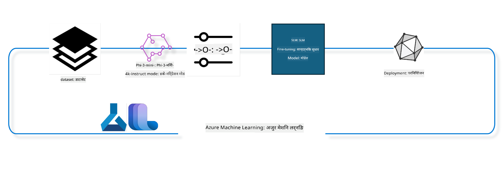

<!--
CO_OP_TRANSLATOR_METADATA:
{
  "original_hash": "944949f040e61b2ea25b3460f7394fd4",
  "translation_date": "2025-07-17T07:13:45+00:00",
  "source_file": "md/03.FineTuning/FineTuning_MLSDK.md",
  "language_code": "ne"
}
-->
## Azure ML सिस्टम रजिस्ट्रीबाट chat-completion कम्पोनेन्टहरू प्रयोग गरी मोडेललाई फाइन ट्यून गर्ने तरिका

यस उदाहरणमा हामी Phi-3-mini-4k-instruct मोडेललाई ultrachat_200k डेटासेट प्रयोग गरी दुई व्यक्तिबीचको संवाद पूरा गर्न फाइन ट्यून गर्नेछौं।



यो उदाहरणले Azure ML SDK र Python प्रयोग गरी फाइन ट्यून कसरी गर्ने र त्यसपछि फाइन ट्यून गरिएको मोडेललाई अनलाइन इन्डपोइन्टमा तैनाथ गरी वास्तविक समयमा इन्फरेन्स कसरी गर्ने देखाउनेछ।

### प्रशिक्षण डेटा

हामी ultrachat_200k डेटासेट प्रयोग गर्नेछौं। यो UltraChat डेटासेटको धेरै फिल्टर गरिएको संस्करण हो र Zephyr-7B-β, एक अत्याधुनिक 7b च्याट मोडेललाई प्रशिक्षण दिन प्रयोग गरिएको थियो।

### मोडेल

हामी Phi-3-mini-4k-instruct मोडेल प्रयोग गर्नेछौं जसले प्रयोगकर्ताले कसरी च्याट-सम्पूर्णता कार्यका लागि मोडेल फाइन ट्यून गर्न सक्छन् देखाउनेछ। यदि तपाईंले यो नोटबुक कुनै विशेष मोडेल कार्डबाट खोल्नुभएको हो भने, कृपया सो मोडेल नाम परिवर्तन गर्न नबिर्सनुहोस्।

### कार्यहरू

- फाइन ट्यून गर्न मोडेल छान्नुहोस्।
- प्रशिक्षण डेटा छान्नुहोस् र अन्वेषण गर्नुहोस्।
- फाइन ट्यूनिङ जॉब कन्फिगर गर्नुहोस्।
- फाइन ट्यूनिङ जॉब चलाउनुहोस्।
- प्रशिक्षण र मूल्याङ्कन मेट्रिक्स समीक्षा गर्नुहोस्।
- फाइन ट्यून गरिएको मोडेल दर्ता गर्नुहोस्।
- वास्तविक समयमा इन्फरेन्सका लागि फाइन ट्यून गरिएको मोडेल तैनाथ गर्नुहोस्।
- स्रोतहरू सफा गर्नुहोस्।

## १. पूर्वआवश्यकताहरू सेटअप गर्नुहोस्

- निर्भरता स्थापना गर्नुहोस्
- AzureML Workspace सँग जडान गर्नुहोस्। SDK प्रमाणीकरण सेटअपबारे थप जान्न यहाँ जानुहोस्। तल <WORKSPACE_NAME>, <RESOURCE_GROUP> र <SUBSCRIPTION_ID> प्रतिस्थापन गर्नुहोस्।
- azureml सिस्टम रजिस्ट्रीसँग जडान गर्नुहोस्
- वैकल्पिक रूपमा experiment नाम सेट गर्नुहोस्
- कम्प्युट जाँच्नुहोस् वा सिर्जना गर्नुहोस्।

> [!NOTE]
> आवश्यकताः एकल GPU नोडमा धेरै GPU कार्डहरू हुन सक्छन्। उदाहरणका लागि, Standard_NC24rs_v3 को एक नोडमा ४ NVIDIA V100 GPU छन् भने Standard_NC12s_v3 मा २ NVIDIA V100 GPU छन्। यस जानकारीका लागि डकुमेन्टेशन हेर्नुहोस्। प्रत्येक नोडमा GPU कार्डहरूको संख्या param gpus_per_node मा सेट गरिएको हुन्छ। यस मानलाई सही सेट गर्दा नोडका सबै GPU हरूको उपयोग सुनिश्चित हुन्छ। सिफारिस गरिएको GPU कम्प्युट SKU हरू यहाँ र यहाँ फेला पार्न सकिन्छ।

### Python लाइब्रेरीहरू

तलको सेल चलाएर निर्भरता स्थापना गर्नुहोस्। नयाँ वातावरणमा चलाउँदा यो वैकल्पिक कदम होइन।

```bash
pip install azure-ai-ml
pip install azure-identity
pip install datasets==2.9.0
pip install mlflow
pip install azureml-mlflow
```

### Azure ML सँग अन्तरक्रिया

1. यो Python स्क्रिप्ट Azure Machine Learning (Azure ML) सेवा सँग अन्तरक्रिया गर्न प्रयोग हुन्छ। यसले के गर्छ भन्ने संक्षिप्त विवरण:

    - azure.ai.ml, azure.identity, र azure.ai.ml.entities प्याकेजबाट आवश्यक मोड्युलहरू आयात गर्छ। साथै time मोड्युल पनि आयात गर्छ।

    - DefaultAzureCredential() प्रयोग गरी प्रमाणीकरण गर्न प्रयास गर्छ, जुन Azure क्लाउडमा छिटो विकास सुरु गर्न सजिलो प्रमाणीकरण अनुभव दिन्छ। असफल भएमा InteractiveBrowserCredential() प्रयोग गर्छ, जसले अन्तरक्रियात्मक लगइन प्रॉम्प्ट दिन्छ।

    - त्यसपछि from_config विधि प्रयोग गरी MLClient उदाहरण सिर्जना गर्न प्रयास गर्छ, जसले डिफल्ट कन्फिग फाइल (config.json) बाट कन्फिग पढ्छ। असफल भएमा subscription_id, resource_group_name, र workspace_name म्यानुअली प्रदान गरी MLClient सिर्जना गर्छ।

    - अर्को MLClient उदाहरण Azure ML रजिस्ट्री "azureml" का लागि सिर्जना गर्छ। यो रजिस्ट्रीमा मोडेलहरू, फाइन-ट्यूनिङ पाइपलाइनहरू, र वातावरणहरू राखिन्छन्।

    - experiment_name लाई "chat_completion_Phi-3-mini-4k-instruct" मा सेट गर्छ।

    - हालको समय (सेकेन्डमा, फ्लोटिङ पोइन्ट नम्बरको रूपमा) लाई पूर्णांकमा परिणत गरी स्ट्रिङमा रूपान्तरण गरेर एक अद्वितीय टाइमस्ट्याम्प बनाउँछ। यो टाइमस्ट्याम्प अद्वितीय नाम र संस्करण बनाउन प्रयोग गर्न सकिन्छ।

    ```python
    # Import necessary modules from Azure ML and Azure Identity
    from azure.ai.ml import MLClient
    from azure.identity import (
        DefaultAzureCredential,
        InteractiveBrowserCredential,
    )
    from azure.ai.ml.entities import AmlCompute
    import time  # Import time module
    
    # Try to authenticate using DefaultAzureCredential
    try:
        credential = DefaultAzureCredential()
        credential.get_token("https://management.azure.com/.default")
    except Exception as ex:  # If DefaultAzureCredential fails, use InteractiveBrowserCredential
        credential = InteractiveBrowserCredential()
    
    # Try to create an MLClient instance using the default config file
    try:
        workspace_ml_client = MLClient.from_config(credential=credential)
    except:  # If that fails, create an MLClient instance by manually providing the details
        workspace_ml_client = MLClient(
            credential,
            subscription_id="<SUBSCRIPTION_ID>",
            resource_group_name="<RESOURCE_GROUP>",
            workspace_name="<WORKSPACE_NAME>",
        )
    
    # Create another MLClient instance for the Azure ML registry named "azureml"
    # This registry is where models, fine-tuning pipelines, and environments are stored
    registry_ml_client = MLClient(credential, registry_name="azureml")
    
    # Set the experiment name
    experiment_name = "chat_completion_Phi-3-mini-4k-instruct"
    
    # Generate a unique timestamp that can be used for names and versions that need to be unique
    timestamp = str(int(time.time()))
    ```

## २. फाइन ट्यून गर्न आधारभूत मोडेल छान्नुहोस्

1. Phi-3-mini-4k-instruct 3.8B प्यारामिटर भएको, हल्का, अत्याधुनिक खुला मोडेल हो जुन Phi-2 का लागि प्रयोग गरिएका डेटासेटहरूमा आधारित छ। यो मोडेल Phi-3 मोडेल परिवारमा पर्छ, र Mini संस्करण दुई भेरियन्टमा आउँछ: 4K र 128K, जुन सन्दर्भ लम्बाइ (टोकनहरूमा) हो जुन यो समर्थन गर्न सक्छ। हामीले यसलाई हाम्रो विशेष प्रयोजनका लागि फाइन ट्यून गर्न आवश्यक छ। तपाईं AzureML Studio को Model Catalog मा यी मोडेलहरू ब्राउज गर्न सक्नुहुन्छ, chat-completion कार्यद्वारा फिल्टर गरेर। यस उदाहरणमा, हामी Phi-3-mini-4k-instruct मोडेल प्रयोग गर्दैछौं। यदि तपाईंले यो नोटबुक फरक मोडेलका लागि खोल्नुभएको छ भने, मोडेल नाम र संस्करण अनुसार परिवर्तन गर्नुहोस्।

    > [!NOTE]
    > मोडेलको id गुण। यो फाइन ट्यूनिङ जॉबमा इनपुटको रूपमा पठाइनेछ। यो AzureML Studio Model Catalog मा मोडेल विवरण पृष्ठमा Asset ID फिल्डमा पनि उपलब्ध छ।

2. यो Python स्क्रिप्ट Azure Machine Learning (Azure ML) सेवा सँग अन्तरक्रिया गर्दैछ। यसले के गर्छ भन्ने संक्षिप्त विवरण:

    - model_name लाई "Phi-3-mini-4k-instruct" मा सेट गर्छ।

    - registry_ml_client को models गुणको get विधि प्रयोग गरी Azure ML रजिस्ट्रीबाट सो नामको मोडेलको सबैभन्दा नयाँ संस्करण प्राप्त गर्छ। get विधि दुईवटा आर्गुमेन्टसहित बोलाइन्छ: मोडेलको नाम र लेबल जसले सबैभन्दा नयाँ संस्करण ल्याउन निर्देशन दिन्छ।

    - कन्सोलमा एउटा सन्देश प्रिन्ट गर्छ जसले फाइन ट्यूनिङका लागि प्रयोग हुने मोडेलको नाम, संस्करण, र id देखाउँछ। स्ट्रिङको format विधि प्रयोग गरी यी मानहरू सन्देशमा राखिन्छन्। यी मानहरू foundation_model वस्तुको गुणहरूबाट प्राप्त गरिन्छ।

    ```python
    # Set the model name
    model_name = "Phi-3-mini-4k-instruct"
    
    # Get the latest version of the model from the Azure ML registry
    foundation_model = registry_ml_client.models.get(model_name, label="latest")
    
    # Print the model name, version, and id
    # This information is useful for tracking and debugging
    print(
        "\n\nUsing model name: {0}, version: {1}, id: {2} for fine tuning".format(
            foundation_model.name, foundation_model.version, foundation_model.id
        )
    )
    ```

## ३. जॉबका लागि कम्प्युट सिर्जना गर्नुहोस्

फाइनट्यून जॉब GPU कम्प्युटमा मात्र काम गर्छ। कम्प्युटको आकार मोडेलको आकारमा निर्भर गर्छ र प्रायः उपयुक्त कम्प्युट पहिचान गर्न गाह्रो हुन्छ। यस सेलमा, प्रयोगकर्तालाई उपयुक्त कम्प्युट छान्न मार्गदर्शन गरिन्छ।

> [!NOTE]
> तल सूचीबद्ध कम्प्युटहरू सबैभन्दा अनुकूलित कन्फिगरेसनमा काम गर्छन्। कन्फिगरेसनमा कुनै परिवर्तनले Cuda Out Of Memory त्रुटि ल्याउन सक्छ। यस्तो अवस्थामा, कम्प्युटलाई ठूलो आकारमा अपग्रेड गर्ने प्रयास गर्नुहोस्।

> [!NOTE]
> compute_cluster_size छान्दा, सुनिश्चित गर्नुहोस् कि कम्प्युट तपाईंको रिसोर्स समूहमा उपलब्ध छ। यदि कुनै कम्प्युट उपलब्ध छैन भने, कम्प्युट स्रोतहरूमा पहुँचको लागि अनुरोध गर्न सकिन्छ।

### फाइन ट्यूनिङ समर्थनका लागि मोडेल जाँच

1. यो Python स्क्रिप्ट Azure Machine Learning (Azure ML) मोडेलसँग अन्तरक्रिया गर्दैछ। यसले के गर्छ भन्ने संक्षिप्त विवरण:

    - ast मोड्युल आयात गर्छ, जुन Python को abstract syntax grammar को रूखहरू प्रक्रिया गर्न प्रयोग हुन्छ।

    - foundation_model वस्तुमा finetune_compute_allow_list नामक ट्याग छ कि छैन जाँच गर्छ। Azure ML मा ट्यागहरू key-value जोडीहरू हुन् जुन मोडेलहरू फिल्टर र क्रमबद्ध गर्न प्रयोग हुन्छ।

    - यदि finetune_compute_allow_list ट्याग छ भने, ast.literal_eval प्रयोग गरी ट्यागको मान (स्ट्रिङ) लाई सुरक्षित रूपमा Python सूचीमा रूपान्तरण गर्छ र computes_allow_list मा राख्छ। त्यसपछि सूचीबाट कम्प्युट सिर्जना गर्न सन्देश प्रिन्ट गर्छ।

    - यदि ट्याग छैन भने, computes_allow_list लाई None सेट गर्छ र ट्याग मोडेलका ट्यागहरूमा नभएको सन्देश प्रिन्ट गर्छ।

    - संक्षेपमा, यो स्क्रिप्ट मोडेलको मेटाडेटामा विशेष ट्याग खोज्छ, यदि छ भने त्यसलाई सूचीमा रूपान्तरण गर्छ र प्रयोगकर्तालाई प्रतिक्रिया दिन्छ।

    ```python
    # Import the ast module, which provides functions to process trees of the Python abstract syntax grammar
    import ast
    
    # Check if the 'finetune_compute_allow_list' tag is present in the model's tags
    if "finetune_compute_allow_list" in foundation_model.tags:
        # If the tag is present, use ast.literal_eval to safely parse the tag's value (a string) into a Python list
        computes_allow_list = ast.literal_eval(
            foundation_model.tags["finetune_compute_allow_list"]
        )  # convert string to python list
        # Print a message indicating that a compute should be created from the list
        print(f"Please create a compute from the above list - {computes_allow_list}")
    else:
        # If the tag is not present, set computes_allow_list to None
        computes_allow_list = None
        # Print a message indicating that the 'finetune_compute_allow_list' tag is not part of the model's tags
        print("`finetune_compute_allow_list` is not part of model tags")
    ```

### कम्प्युट इन्स्ट्यान्स जाँच

1. यो Python स्क्रिप्ट Azure Machine Learning (Azure ML) सेवा सँग अन्तरक्रिया गर्दै कम्प्युट इन्स्ट्यान्समा विभिन्न जाँचहरू गर्छ। यसले के गर्छ भन्ने संक्षिप्त विवरण:

    - compute_cluster नाममा रहेको कम्प्युट इन्स्ट्यान्स Azure ML वर्कस्पेसबाट प्राप्त गर्न प्रयास गर्छ। यदि कम्प्युटको provisioning state "failed" छ भने ValueError उठाउँछ।

    - computes_allow_list None नभएमा, सूचीका सबै कम्प्युट साइजहरूलाई lowercase मा परिणत गरी हालको कम्प्युट इन्स्ट्यान्सको साइज सूचीमा छ कि छैन जाँच गर्छ। नभए ValueError उठाउँछ।

    - यदि computes_allow_list None छ भने, हालको कम्प्युट साइज unsupported GPU VM साइजहरूको सूचीमा छ कि छैन जाँच गर्छ। भएमा ValueError उठाउँछ।

    - वर्कस्पेसमा उपलब्ध सबै कम्प्युट साइजहरूको सूची प्राप्त गर्छ। त्यसपछि प्रत्येक साइजसँग तुलना गरी हालको कम्प्युट साइजसँग मेल खाने भए GPU को संख्या प्राप्त गर्छ र gpu_count_found लाई True बनाउँछ।

    - gpu_count_found True भए कम्प्युट इन्स्ट्यान्समा GPU को संख्या प्रिन्ट गर्छ। नभए ValueError उठाउँछ।

    - संक्षेपमा, यो स्क्रिप्ट Azure ML वर्कस्पेसमा कम्प्युट इन्स्ट्यान्सको provisioning state, साइज अनुमति सूची वा अस्वीकृत सूचीमा छ कि छैन, र GPU संख्या जाँच गर्छ।

    ```python
    # Print the exception message
    print(e)
    # Raise a ValueError if the compute size is not available in the workspace
    raise ValueError(
        f"WARNING! Compute size {compute_cluster_size} not available in workspace"
    )
    
    # Retrieve the compute instance from the Azure ML workspace
    compute = workspace_ml_client.compute.get(compute_cluster)
    # Check if the provisioning state of the compute instance is "failed"
    if compute.provisioning_state.lower() == "failed":
        # Raise a ValueError if the provisioning state is "failed"
        raise ValueError(
            f"Provisioning failed, Compute '{compute_cluster}' is in failed state. "
            f"please try creating a different compute"
        )
    
    # Check if computes_allow_list is not None
    if computes_allow_list is not None:
        # Convert all compute sizes in computes_allow_list to lowercase
        computes_allow_list_lower_case = [x.lower() for x in computes_allow_list]
        # Check if the size of the compute instance is in computes_allow_list_lower_case
        if compute.size.lower() not in computes_allow_list_lower_case:
            # Raise a ValueError if the size of the compute instance is not in computes_allow_list_lower_case
            raise ValueError(
                f"VM size {compute.size} is not in the allow-listed computes for finetuning"
            )
    else:
        # Define a list of unsupported GPU VM sizes
        unsupported_gpu_vm_list = [
            "standard_nc6",
            "standard_nc12",
            "standard_nc24",
            "standard_nc24r",
        ]
        # Check if the size of the compute instance is in unsupported_gpu_vm_list
        if compute.size.lower() in unsupported_gpu_vm_list:
            # Raise a ValueError if the size of the compute instance is in unsupported_gpu_vm_list
            raise ValueError(
                f"VM size {compute.size} is currently not supported for finetuning"
            )
    
    # Initialize a flag to check if the number of GPUs in the compute instance has been found
    gpu_count_found = False
    # Retrieve a list of all available compute sizes in the workspace
    workspace_compute_sku_list = workspace_ml_client.compute.list_sizes()
    available_sku_sizes = []
    # Iterate over the list of available compute sizes
    for compute_sku in workspace_compute_sku_list:
        available_sku_sizes.append(compute_sku.name)
        # Check if the name of the compute size matches the size of the compute instance
        if compute_sku.name.lower() == compute.size.lower():
            # If it does, retrieve the number of GPUs for that compute size and set gpu_count_found to True
            gpus_per_node = compute_sku.gpus
            gpu_count_found = True
    # If gpu_count_found is True, print the number of GPUs in the compute instance
    if gpu_count_found:
        print(f"Number of GPU's in compute {compute.size}: {gpus_per_node}")
    else:
        # If gpu_count_found is False, raise a ValueError
        raise ValueError(
            f"Number of GPU's in compute {compute.size} not found. Available skus are: {available_sku_sizes}."
            f"This should not happen. Please check the selected compute cluster: {compute_cluster} and try again."
        )
    ```

## ४. मोडेल फाइन ट्यूनिङका लागि डेटासेट छान्नुहोस्

1. हामी ultrachat_200k डेटासेट प्रयोग गर्छौं। डेटासेटमा चार भागहरू छन्, जुन Supervised fine-tuning (sft) का लागि उपयुक्त छन्। जनरेशन रैंकिङ (gen)। प्रत्येक भागमा उदाहरणहरूको संख्या तल देखाइएको छ:

    ```bash
    train_sft test_sft  train_gen  test_gen
    207865  23110  256032  28304
    ```

1. केही सेलहरूले फाइन ट्यूनिङका लागि आधारभूत डेटा तयारी देखाउँछन्:

### केही डेटा पङ्क्तिहरू दृश्यात्मक रूपमा हेर्नुहोस्

हामी यो नमूना छिटो चलाउन चाहन्छौं, त्यसैले train_sft, test_sft फाइलहरूमा पहिले नै ट्रिम गरिएका पङ्क्तिहरूको ५% मात्र बचत गर्छौं। यसको अर्थ फाइन ट्यून गरिएको मोडेलको सटीकता कम हुनेछ, त्यसैले यसलाई वास्तविक प्रयोगमा नराख्नुहोस्।
download-dataset.py स्क्रिप्ट ultrachat_200k डेटासेट डाउनलोड गर्न र डेटासेटलाई फाइनट्यून पाइपलाइन कम्पोनेन्टले उपभोग गर्न मिल्ने ढाँचामा रूपान्तरण गर्न प्रयोग हुन्छ। साथै डेटासेट ठूलो भएकाले यहाँ हामीसँग डेटासेटको केही भाग मात्र छ।

1. तलको स्क्रिप्टले मात्र ५% डेटा डाउनलोड गर्छ। dataset_split_pc प्यारामिटर परिवर्तन गरेर यो प्रतिशत बढाउन सकिन्छ।

    > [!NOTE]
    > केही भाषा मोडेलहरूमा फरक भाषा कोडहरू हुन्छन् र त्यसैले डेटासेटमा स्तम्भ नामहरू पनि सोही अनुसार हुनुपर्छ।

1. यहाँ डेटा कस्तो देखिनु पर्छ भन्ने उदाहरण छ
च्याट-सम्पूर्णता डेटासेट parquet ढाँचामा संग्रहित छ र प्रत्येक प्रविष्टि निम्न स्किमालाई प्रयोग गर्छ:

    - यो JSON (JavaScript Object Notation) दस्तावेज हो, जुन लोकप्रिय डेटा विनिमय ढाँचा हो। यो कार्यान्वयनयोग्य कोड होइन, तर डेटा भण्डारण र स्थानान्तरण गर्ने तरिका हो। यसको संरचनाको संक्षिप्त विवरण:

    - "prompt": यो कुञ्जीले स्ट्रिङ मान राख्छ जुन AI सहायकलाई दिइएको कार्य वा प्रश्न हो।

    - "messages": यो कुञ्जीले वस्तुहरूको एरे राख्छ। प्रत्येक वस्तु प्रयोगकर्ता र AI सहायकबीचको संवादमा सन्देश प्रतिनिधित्व गर्छ। प्रत्येक सन्देश वस्तुमा दुई कुञ्जीहरू हुन्छन्:

    - "content": सन्देशको सामग्री समावेश गर्ने स्ट्रिङ मान।
    - "role": सन्देश पठाउने इकाइको भूमिका जनाउने स्ट्रिङ मान, जुन "user" वा "assistant" हुन सक्छ।
    - "prompt_id": यो कुञ्जीले विशिष्ट प्रम्प्टको अद्वितीय पहिचानकर्ता समावेश गर्छ।

1. यस विशेष JSON दस्तावेजमा, एक संवाद देखाइएको छ जहाँ प्रयोगकर्ताले AI सहायकलाई डिस्टोपियन कथाको नायक सिर्जना गर्न भन्छ। सहायक जवाफ दिन्छ, र प्रयोगकर्ताले थप विवरण माग्छ। सहायक थप विवरण दिन सहमत हुन्छ। सम्पूर्ण संवाद विशिष्ट प्रम्प्ट id सँग सम्बन्धित छ।

    ```python
    {
        // The task or question posed to an AI assistant
        "prompt": "Create a fully-developed protagonist who is challenged to survive within a dystopian society under the rule of a tyrant. ...",
        
        // An array of objects, each representing a message in a conversation between a user and an AI assistant
        "messages":[
            {
                // The content of the user's message
                "content": "Create a fully-developed protagonist who is challenged to survive within a dystopian society under the rule of a tyrant. ...",
                // The role of the entity that sent the message
                "role": "user"
            },
            {
                // The content of the assistant's message
                "content": "Name: Ava\n\n Ava was just 16 years old when the world as she knew it came crashing down. The government had collapsed, leaving behind a chaotic and lawless society. ...",
                // The role of the entity that sent the message
                "role": "assistant"
            },
            {
                // The content of the user's message
                "content": "Wow, Ava's story is so intense and inspiring! Can you provide me with more details.  ...",
                // The role of the entity that sent the message
                "role": "user"
            }, 
            {
                // The content of the assistant's message
                "content": "Certainly! ....",
                // The role of the entity that sent the message
                "role": "assistant"
            }
        ],
        
        // A unique identifier for the prompt
        "prompt_id": "d938b65dfe31f05f80eb8572964c6673eddbd68eff3db6bd234d7f1e3b86c2af"
    }
    ```

### डेटा डाउनलोड गर्नुहोस्

1. यो Python स्क्रिप्ट download-dataset.py नामक सहायक स्क्रिप्ट प्रयोग गरी डेटासेट डाउनलोड गर्न प्रयोग हुन्छ। यसले के गर्छ भन्ने संक्षिप्त विवरण:

    - os मोड्युल आयात गर्छ, जुन अपरेटिङ सिस्टममा निर्भर कार्यक्षमता प्रयोग गर्न पोर्टेबल तरिका हो।

    - os.system प्रयोग गरी shell मा download-dataset.py स्क्रिप्ट चलाउँछ, जसमा कमाण्ड लाइन आर्गुमेन्टहरू छन्: डाउनलोड गर्न dataset HuggingFaceH4/ultrachat_200k, डाउनलोड गर्ने डिरेक्टरी ultrachat_200k_dataset, र डेटासेटको प्रतिशत भाग ५। os.system ले चलाएको कमाण्डको exit status फर्काउँछ जुन exit_status मा राखिन्छ।

    - exit_status 0 नभएमा (Unix-जस्तो प्रणालीमा 0 सफलताको संकेत हो), Exception उठाउँछ जसले डेटासेट डाउनलोडमा त्रुटि भएको जनाउँछ।

    - संक्षेपमा, यो स्क्रिप्ट सहायक स्क्रिप्ट प्रयोग गरी डेटासेट डाउनलोड गर्छ र कमाण्ड असफल भएमा अपवाद उठाउँछ।

    ```python
    # Import the os module, which provides a way of using operating system dependent functionality
    import os
    
    # Use the os.system function to run the download-dataset.py script in the shell with specific command-line arguments
    # The arguments specify the dataset to download (HuggingFaceH4/ultrachat_200k), the directory to download it to (ultrachat_200k_dataset), and the percentage of the dataset to split (5)
    # The os.system function returns the exit status of the command it executed; this status is stored in the exit_status variable
    exit_status = os.system(
        "python ./download-dataset.py --dataset HuggingFaceH4/ultrachat_200k --download_dir ultrachat_200k_dataset --dataset_split_pc 5"
    )
    
    # Check if exit_status is not 0
    # In Unix-like operating systems, an exit status of 0 usually indicates that a command has succeeded, while any other number indicates an error
    # If exit_status is not 0, raise an Exception with a message indicating that there was an error downloading the dataset
    if exit_status != 0:
        raise Exception("Error downloading dataset")
    ```

### डेटा DataFrame मा लोड गर्दै

1. यो Python स्क्रिप्ट JSON Lines फाइल pandas DataFrame मा लोड गरी पहिलो ५ पङ्क्तिहरू देखाउँछ। यसले के गर्छ भन्ने संक्षिप्त विवरण:

    - pandas लाइब्रेरी आयात गर्छ, जुन शक्तिशाली डेटा हेरफेर र विश्लेषण लाइब्रेरी हो।

    - pandas को प्रदर्शन विकल्पमा अधिकतम स्तम्भ चौडाइ ० मा सेट गर्छ। यसको अर्थ DataFrame प्रिन्ट गर्दा प्रत्येक स्तम्भको पूर्ण पाठ देखाइनेछ, छोट्याइने छैन।

    - pd.read_json प्रयोग गरी ultrachat_200k_dataset डिरेक्टरीको train_sft.jsonl फाइल DataFrame मा लोड गर्छ। lines=True ले फाइल JSON Lines ढाँचामा रहेको जनाउँछ, जहाँ प्रत्येक लाइन अलग JSON वस्तु हो।
- यसले DataFrame को पहिलो ५ पंक्तिहरू देखाउन head मेथड प्रयोग गर्छ। यदि DataFrame मा ५ भन्दा कम पंक्तिहरू छन् भने, सबै पंक्तिहरू देखाउनेछ।

- संक्षेपमा, यो स्क्रिप्टले JSON Lines फाइललाई DataFrame मा लोड गर्दैछ र पहिलो ५ पंक्तिहरू पूर्ण स्तम्भ पाठसहित देखाउँदैछ।

```python
    # Import the pandas library, which is a powerful data manipulation and analysis library
    import pandas as pd
    
    # Set the maximum column width for pandas' display options to 0
    # This means that the full text of each column will be displayed without truncation when the DataFrame is printed
    pd.set_option("display.max_colwidth", 0)
    
    # Use the pd.read_json function to load the train_sft.jsonl file from the ultrachat_200k_dataset directory into a DataFrame
    # The lines=True argument indicates that the file is in JSON Lines format, where each line is a separate JSON object
    df = pd.read_json("./ultrachat_200k_dataset/train_sft.jsonl", lines=True)
    
    # Use the head method to display the first 5 rows of the DataFrame
    # If the DataFrame has less than 5 rows, it will display all of them
    df.head()
    ```

## ५. मोडेल र डाटालाई इनपुटको रूपमा प्रयोग गरी फाइन ट्युनिङ जॉब सबमिट गर्नुहोस्

chat-completion पाइपलाइन कम्पोनेन्ट प्रयोग गर्ने जॉब सिर्जना गर्नुहोस्। फाइन ट्युनिङका लागि समर्थित सबै प्यारामिटरहरूबारे थप जान्नुस्।

### फाइनट्युन प्यारामिटरहरू परिभाषित गर्नुहोस्

१. फाइनट्युन प्यारामिटरहरू दुई वर्गमा विभाजित गर्न सकिन्छ - प्रशिक्षण प्यारामिटरहरू, अप्टिमाइजेशन प्यारामिटरहरू

१. प्रशिक्षण प्यारामिटरहरूले प्रशिक्षणका पक्षहरू परिभाषित गर्छन् जस्तै -

    - प्रयोग गर्ने optimizer, scheduler
    - फाइनट्युनलाई अनुकूलन गर्ने मेट्रिक
    - प्रशिक्षण चरणहरूको संख्या, ब्याच साइज आदि
    - अप्टिमाइजेशन प्यारामिटरहरूले GPU मेमोरी अनुकूलन गर्न र कम्प्युट स्रोतहरू प्रभावकारी रूपमा प्रयोग गर्न मद्दत गर्छ।

१. तल केही प्यारामिटरहरू छन् जुन यस वर्गमा पर्छन्। अप्टिमाइजेशन प्यारामिटरहरू प्रत्येक मोडेलका लागि फरक हुन्छन् र मोडेलसँगै प्याकेज गरिएका हुन्छन् जसले यी भिन्नताहरू सम्हाल्छ।

    - deepspeed र LoRA सक्षम गर्नुहोस्
    - मिश्रित प्रिसिजन प्रशिक्षण सक्षम गर्नुहोस्
    - बहु-नोड प्रशिक्षण सक्षम गर्नुहोस्


> [!NOTE]
> सुपरवाइज्ड फाइनट्युनिङले संरेखण गुम्ने वा विनाशकारी बिर्सने समस्या निम्त्याउन सक्छ। हामी यो समस्या जाँच गर्न र फाइनट्युन पछि संरेखण चरण चलाउन सिफारिस गर्छौं।

### फाइन ट्युनिङ प्यारामिटरहरू

१. यो Python स्क्रिप्टले मेशिन लर्निङ मोडेल फाइनट्युनिङका लागि प्यारामिटरहरू सेट गर्दैछ। यसले के गर्छ भन्ने संक्षेप:

    - यो डिफल्ट प्रशिक्षण प्यारामिटरहरू सेट गर्छ जस्तै प्रशिक्षण epochs को संख्या, प्रशिक्षण र मूल्याङ्कनका लागि ब्याच साइज, सिकाइ दर, र सिकाइ दर scheduler प्रकार।

    - यो डिफल्ट अप्टिमाइजेशन प्यारामिटरहरू सेट गर्छ जस्तै Layer-wise Relevance Propagation (LoRa) र DeepSpeed लागू गर्ने वा नगर्ने, र DeepSpeed चरण।

    - प्रशिक्षण र अप्टिमाइजेशन प्यारामिटरहरूलाई finetune_parameters नामक एकल डिक्सनरीमा संयोजन गर्छ।

    - foundation_model मा कुनै मोडेल-विशिष्ट डिफल्ट प्यारामिटरहरू छन् कि छैनन् जाँच गर्छ। यदि छन् भने, चेतावनी सन्देश प्रिन्ट गर्छ र finetune_parameters डिक्सनरीलाई ती मोडेल-विशिष्ट डिफल्टहरूसँग अपडेट गर्छ। ast.literal_eval फंक्शनले मोडेल-विशिष्ट डिफल्टहरूलाई स्ट्रिङबाट Python डिक्सनरीमा रूपान्तरण गर्छ।

    - अन्तिम फाइनट्युनिङ प्यारामिटरहरू प्रिन्ट गर्छ जुन रनका लागि प्रयोग हुनेछन्।

    - संक्षेपमा, यो स्क्रिप्टले मेशिन लर्निङ मोडेल फाइनट्युनिङका लागि प्यारामिटरहरू सेट र प्रदर्शन गर्दैछ, र डिफल्ट प्यारामिटरहरूलाई मोडेल-विशिष्टले ओभरराइड गर्न सक्ने सुविधा राख्छ।

```python
    # Set up default training parameters such as the number of training epochs, batch sizes for training and evaluation, learning rate, and learning rate scheduler type
    training_parameters = dict(
        num_train_epochs=3,
        per_device_train_batch_size=1,
        per_device_eval_batch_size=1,
        learning_rate=5e-6,
        lr_scheduler_type="cosine",
    )
    
    # Set up default optimization parameters such as whether to apply Layer-wise Relevance Propagation (LoRa) and DeepSpeed, and the DeepSpeed stage
    optimization_parameters = dict(
        apply_lora="true",
        apply_deepspeed="true",
        deepspeed_stage=2,
    )
    
    # Combine the training and optimization parameters into a single dictionary called finetune_parameters
    finetune_parameters = {**training_parameters, **optimization_parameters}
    
    # Check if the foundation_model has any model-specific default parameters
    # If it does, print a warning message and update the finetune_parameters dictionary with these model-specific defaults
    # The ast.literal_eval function is used to convert the model-specific defaults from a string to a Python dictionary
    if "model_specific_defaults" in foundation_model.tags:
        print("Warning! Model specific defaults exist. The defaults could be overridden.")
        finetune_parameters.update(
            ast.literal_eval(  # convert string to python dict
                foundation_model.tags["model_specific_defaults"]
            )
        )
    
    # Print the final set of fine-tuning parameters that will be used for the run
    print(
        f"The following finetune parameters are going to be set for the run: {finetune_parameters}"
    )
    ```

### प्रशिक्षण पाइपलाइन

१. यो Python स्क्रिप्टले मेशिन लर्निङ प्रशिक्षण पाइपलाइनको प्रदर्शन नाम बनाउनको लागि फंक्शन परिभाषित गर्दैछ र त्यसपछि उक्त फंक्शनलाई कल गरेर प्रदर्शन नाम उत्पन्न गरी प्रिन्ट गर्दैछ। यसले के गर्छ भन्ने संक्षेप:

१. get_pipeline_display_name फंक्शन परिभाषित गरिएको छ। यो फंक्शनले प्रशिक्षण पाइपलाइनसँग सम्बन्धित विभिन्न प्यारामिटरहरूका आधारमा प्रदर्शन नाम बनाउँछ।

१. फंक्शन भित्र, कुल ब्याच साइज गणना गर्छ जुन प्रति-डिभाइस ब्याच साइज, ग्रेडियन्ट एक्युमुलेसन चरणहरूको संख्या, प्रति नोड GPU को संख्या, र फाइनट्युनिङका लागि प्रयोग गरिने नोडहरूको संख्या गुणा गरेर निकालिन्छ।

१. यसले सिकाइ दर scheduler प्रकार, DeepSpeed लागू गरिएको छ कि छैन, DeepSpeed चरण, Layer-wise Relevance Propagation (LoRa) लागू गरिएको छ कि छैन, राख्नुपर्ने मोडेल checkpoint को संख्या सीमा, र अधिकतम अनुक्रम लम्बाइ जस्ता अन्य प्यारामिटरहरू प्राप्त गर्छ।

१. यी सबै प्यारामिटरहरूलाई हाइफनले छुट्याएर समावेश गर्ने स्ट्रिङ बनाउँछ। यदि DeepSpeed वा LoRa लागू गरिएको छ भने, स्ट्रिङमा क्रमशः "ds" र DeepSpeed चरण वा "lora" समावेश हुन्छ। नभएमा "nods" वा "nolora" समावेश हुन्छ।

१. फंक्शनले यो स्ट्रिङ फर्काउँछ, जुन प्रशिक्षण पाइपलाइनको प्रदर्शन नामको रूपमा काम गर्छ।

१. फंक्शन परिभाषित भएपछि, यसलाई कल गरेर प्रदर्शन नाम उत्पन्न गरिन्छ र प्रिन्ट गरिन्छ।

१. संक्षेपमा, यो स्क्रिप्टले विभिन्न प्यारामिटरहरूका आधारमा मेशिन लर्निङ प्रशिक्षण पाइपलाइनको प्रदर्शन नाम बनाउँदैछ र त्यसलाई प्रिन्ट गर्दैछ।

```python
    # Define a function to generate a display name for the training pipeline
    def get_pipeline_display_name():
        # Calculate the total batch size by multiplying the per-device batch size, the number of gradient accumulation steps, the number of GPUs per node, and the number of nodes used for fine-tuning
        batch_size = (
            int(finetune_parameters.get("per_device_train_batch_size", 1))
            * int(finetune_parameters.get("gradient_accumulation_steps", 1))
            * int(gpus_per_node)
            * int(finetune_parameters.get("num_nodes_finetune", 1))
        )
        # Retrieve the learning rate scheduler type
        scheduler = finetune_parameters.get("lr_scheduler_type", "linear")
        # Retrieve whether DeepSpeed is applied
        deepspeed = finetune_parameters.get("apply_deepspeed", "false")
        # Retrieve the DeepSpeed stage
        ds_stage = finetune_parameters.get("deepspeed_stage", "2")
        # If DeepSpeed is applied, include "ds" followed by the DeepSpeed stage in the display name; if not, include "nods"
        if deepspeed == "true":
            ds_string = f"ds{ds_stage}"
        else:
            ds_string = "nods"
        # Retrieve whether Layer-wise Relevance Propagation (LoRa) is applied
        lora = finetune_parameters.get("apply_lora", "false")
        # If LoRa is applied, include "lora" in the display name; if not, include "nolora"
        if lora == "true":
            lora_string = "lora"
        else:
            lora_string = "nolora"
        # Retrieve the limit on the number of model checkpoints to keep
        save_limit = finetune_parameters.get("save_total_limit", -1)
        # Retrieve the maximum sequence length
        seq_len = finetune_parameters.get("max_seq_length", -1)
        # Construct the display name by concatenating all these parameters, separated by hyphens
        return (
            model_name
            + "-"
            + "ultrachat"
            + "-"
            + f"bs{batch_size}"
            + "-"
            + f"{scheduler}"
            + "-"
            + ds_string
            + "-"
            + lora_string
            + f"-save_limit{save_limit}"
            + f"-seqlen{seq_len}"
        )
    
    # Call the function to generate the display name
    pipeline_display_name = get_pipeline_display_name()
    # Print the display name
    print(f"Display name used for the run: {pipeline_display_name}")
    ```

### पाइपलाइन कन्फिगर गर्दै

यो Python स्क्रिप्टले Azure Machine Learning SDK प्रयोग गरी मेशिन लर्निङ पाइपलाइन परिभाषित र कन्फिगर गर्दैछ। यसले के गर्छ भन्ने संक्षेप:

१. Azure AI ML SDK बाट आवश्यक मोड्युलहरू आयात गर्छ।

१. रजिस्ट्रीबाट "chat_completion_pipeline" नामक पाइपलाइन कम्पोनेन्ट ल्याउँछ।

१. `@pipeline` डेकोरेटर र `create_pipeline` फंक्शन प्रयोग गरी पाइपलाइन जॉब परिभाषित गर्छ। पाइपलाइनको नाम `pipeline_display_name` राखिएको छ।

१. `create_pipeline` फंक्शन भित्र, ल्याइएको पाइपलाइन कम्पोनेन्टलाई विभिन्न प्यारामिटरहरूसहित इनिसियलाइज गर्छ, जस्तै मोडेल पथ, विभिन्न चरणका लागि कम्प्युट क्लस्टरहरू, प्रशिक्षण र परीक्षणका लागि डाटासेट विभाजनहरू, फाइनट्युनिङका लागि GPU संख्या, र अन्य फाइनट्युनिङ प्यारामिटरहरू।

१. फाइनट्युनिङ जॉबको आउटपुटलाई पाइपलाइन जॉबको आउटपुटसँग म्याप गर्छ। यसले फाइनट्युन गरिएको मोडेल सजिलै दर्ता गर्न मद्दत गर्छ, जुन मोडेललाई अनलाइन वा ब्याच एन्डपोइन्टमा डिप्लोय गर्न आवश्यक हुन्छ।

१. `create_pipeline` फंक्शन कल गरेर पाइपलाइनको उदाहरण बनाउँछ।

१. पाइपलाइनको `force_rerun` सेटिङलाई `True` मा राख्छ, जसको अर्थ अघिल्लो जॉबका क्यास गरिएको नतिजाहरू प्रयोग गरिने छैनन्।

१. पाइपलाइनको `continue_on_step_failure` सेटिङलाई `False` मा राख्छ, जसको अर्थ कुनै पनि चरण असफल भएमा पाइपलाइन रोकिनेछ।

१. संक्षेपमा, यो स्क्रिप्टले Azure Machine Learning SDK प्रयोग गरी च्याट कम्प्लिशन कार्यका लागि मेशिन लर्निङ पाइपलाइन परिभाषित र कन्फिगर गर्दैछ।

```python
    # Import necessary modules from the Azure AI ML SDK
    from azure.ai.ml.dsl import pipeline
    from azure.ai.ml import Input
    
    # Fetch the pipeline component named "chat_completion_pipeline" from the registry
    pipeline_component_func = registry_ml_client.components.get(
        name="chat_completion_pipeline", label="latest"
    )
    
    # Define the pipeline job using the @pipeline decorator and the function create_pipeline
    # The name of the pipeline is set to pipeline_display_name
    @pipeline(name=pipeline_display_name)
    def create_pipeline():
        # Initialize the fetched pipeline component with various parameters
        # These include the model path, compute clusters for different stages, dataset splits for training and testing, the number of GPUs to use for fine-tuning, and other fine-tuning parameters
        chat_completion_pipeline = pipeline_component_func(
            mlflow_model_path=foundation_model.id,
            compute_model_import=compute_cluster,
            compute_preprocess=compute_cluster,
            compute_finetune=compute_cluster,
            compute_model_evaluation=compute_cluster,
            # Map the dataset splits to parameters
            train_file_path=Input(
                type="uri_file", path="./ultrachat_200k_dataset/train_sft.jsonl"
            ),
            test_file_path=Input(
                type="uri_file", path="./ultrachat_200k_dataset/test_sft.jsonl"
            ),
            # Training settings
            number_of_gpu_to_use_finetuning=gpus_per_node,  # Set to the number of GPUs available in the compute
            **finetune_parameters
        )
        return {
            # Map the output of the fine tuning job to the output of pipeline job
            # This is done so that we can easily register the fine tuned model
            # Registering the model is required to deploy the model to an online or batch endpoint
            "trained_model": chat_completion_pipeline.outputs.mlflow_model_folder
        }
    
    # Create an instance of the pipeline by calling the create_pipeline function
    pipeline_object = create_pipeline()
    
    # Don't use cached results from previous jobs
    pipeline_object.settings.force_rerun = True
    
    # Set continue on step failure to False
    # This means that the pipeline will stop if any step fails
    pipeline_object.settings.continue_on_step_failure = False
    ```

### जॉब सबमिट गर्नुहोस्

१. यो Python स्क्रिप्टले Azure Machine Learning कार्यक्षेत्रमा मेशिन लर्निङ पाइपलाइन जॉब सबमिट गर्दैछ र त्यसपछि जॉब पूरा हुन कुर्दैछ। यसले के गर्छ भन्ने संक्षेप:

    - workspace_ml_client को jobs वस्तुको create_or_update मेथड कल गरेर पाइपलाइन जॉब सबमिट गर्छ। चलाउनुपर्ने पाइपलाइन `pipeline_object` द्वारा निर्दिष्ट गरिएको छ, र जॉब चलाइने प्रयोग `experiment_name` द्वारा निर्दिष्ट गरिएको छ।

    - त्यसपछि workspace_ml_client को jobs वस्तुको stream मेथड कल गरेर पाइपलाइन जॉब पूरा हुन कुर्दछ। कुर्नुपर्ने जॉब `pipeline_job` वस्तुको name एट्रिब्युटले निर्दिष्ट गरेको छ।

    - संक्षेपमा, यो स्क्रिप्टले Azure Machine Learning कार्यक्षेत्रमा मेशिन लर्निङ पाइपलाइन जॉब सबमिट गरी त्यसको पूरा हुन कुर्दछ।

```python
    # Submit the pipeline job to the Azure Machine Learning workspace
    # The pipeline to be run is specified by pipeline_object
    # The experiment under which the job is run is specified by experiment_name
    pipeline_job = workspace_ml_client.jobs.create_or_update(
        pipeline_object, experiment_name=experiment_name
    )
    
    # Wait for the pipeline job to complete
    # The job to wait for is specified by the name attribute of the pipeline_job object
    workspace_ml_client.jobs.stream(pipeline_job.name)
    ```

## ६. फाइन ट्युन गरिएको मोडेललाई कार्यक्षेत्रमा दर्ता गर्नुहोस्

हामी फाइन ट्युनिङ जॉबको आउटपुटबाट मोडेल दर्ता गर्नेछौं। यसले फाइन ट्युन गरिएको मोडेल र फाइन ट्युनिङ जॉबबीच lineage ट्र्याक गर्नेछ। फाइन ट्युनिङ जॉबले foundation मोडेल, डाटा र प्रशिक्षण कोडसँग पनि lineage ट्र्याक गर्छ।

### ML मोडेल दर्ता गर्दै

१. यो Python स्क्रिप्टले Azure Machine Learning पाइपलाइनमा प्रशिक्षण गरिएको मेशिन लर्निङ मोडेल दर्ता गर्दैछ। यसले के गर्छ भन्ने संक्षेप:

    - Azure AI ML SDK बाट आवश्यक मोड्युलहरू आयात गर्छ।

    - pipeline जॉबबाट trained_model आउटपुट उपलब्ध छ कि छैन जाँच्न workspace_ml_client को jobs वस्तुको get मेथड कल गरी त्यसको outputs एट्रिब्युटमा पहुँच गर्छ।

    - pipeline जॉबको नाम र आउटपुटको नाम ("trained_model") प्रयोग गरी प्रशिक्षित मोडेलको पथ बनाउँछ।

    - फाइनट्युन गरिएको मोडेलको नाम परिभाषित गर्छ, जसमा मूल मोडेल नाममा "-ultrachat-200k" जोडिन्छ र स्ल्यासहरू हाइफनले प्रतिस्थापन गरिन्छ।

    - Model वस्तु सिर्जना गरेर मोडेल दर्ता गर्न तयार हुन्छ, जसमा मोडेलको पथ, मोडेल प्रकार (MLflow मोडेल), मोडेलको नाम र संस्करण, र मोडेलको विवरण समावेश हुन्छ।

    - workspace_ml_client को models वस्तुको create_or_update मेथड कल गरेर Model वस्तु पास गरी मोडेल दर्ता गर्छ।

    - दर्ता गरिएको मोडेल प्रिन्ट गर्छ।

१. संक्षेपमा, यो स्क्रिप्टले Azure Machine Learning पाइपलाइनमा प्रशिक्षण गरिएको मेशिन लर्निङ मोडेल दर्ता गर्दैछ।

```python
    # Import necessary modules from the Azure AI ML SDK
    from azure.ai.ml.entities import Model
    from azure.ai.ml.constants import AssetTypes
    
    # Check if the `trained_model` output is available from the pipeline job
    print("pipeline job outputs: ", workspace_ml_client.jobs.get(pipeline_job.name).outputs)
    
    # Construct a path to the trained model by formatting a string with the name of the pipeline job and the name of the output ("trained_model")
    model_path_from_job = "azureml://jobs/{0}/outputs/{1}".format(
        pipeline_job.name, "trained_model"
    )
    
    # Define a name for the fine-tuned model by appending "-ultrachat-200k" to the original model name and replacing any slashes with hyphens
    finetuned_model_name = model_name + "-ultrachat-200k"
    finetuned_model_name = finetuned_model_name.replace("/", "-")
    
    print("path to register model: ", model_path_from_job)
    
    # Prepare to register the model by creating a Model object with various parameters
    # These include the path to the model, the type of the model (MLflow model), the name and version of the model, and a description of the model
    prepare_to_register_model = Model(
        path=model_path_from_job,
        type=AssetTypes.MLFLOW_MODEL,
        name=finetuned_model_name,
        version=timestamp,  # Use timestamp as version to avoid version conflict
        description=model_name + " fine tuned model for ultrachat 200k chat-completion",
    )
    
    print("prepare to register model: \n", prepare_to_register_model)
    
    # Register the model by calling the create_or_update method of the models object in the workspace_ml_client with the Model object as the argument
    registered_model = workspace_ml_client.models.create_or_update(
        prepare_to_register_model
    )
    
    # Print the registered model
    print("registered model: \n", registered_model)
    ```

## ७. फाइन ट्युन गरिएको मोडेललाई अनलाइन एन्डपोइन्टमा डिप्लोय गर्नुहोस्

अनलाइन एन्डपोइन्टहरूले दिर्घकालीन REST API प्रदान गर्छन् जसले मोडेल प्रयोग गर्नुपर्ने एप्लिकेसनहरूसँग एकीकृत गर्न सकिन्छ।

### एन्डपोइन्ट व्यवस्थापन

१. यो Python स्क्रिप्टले Azure Machine Learning मा दर्ता गरिएको मोडेलका लागि व्यवस्थापन गरिएको अनलाइन एन्डपोइन्ट सिर्जना गर्दैछ। यसले के गर्छ भन्ने संक्षेप:

    - Azure AI ML SDK बाट आवश्यक मोड्युलहरू आयात गर्छ।

    - "ultrachat-completion-" स्ट्रिङमा टाइमस्ट्याम्प जोडेर अनलाइन एन्डपोइन्टको अनौठो नाम परिभाषित गर्छ।

    - ManagedOnlineEndpoint वस्तु सिर्जना गरेर अनलाइन एन्डपोइन्ट बनाउन तयार हुन्छ, जसमा एन्डपोइन्टको नाम, विवरण, र प्रमाणीकरण मोड ("key") समावेश हुन्छ।

    - workspace_ml_client को begin_create_or_update मेथड कल गरेर ManagedOnlineEndpoint वस्तु पास गरी एन्डपोइन्ट सिर्जना गर्छ र wait मेथड कल गरेर सिर्जना प्रक्रिया पूरा हुन कुर्दछ।

१. संक्षेपमा, यो स्क्रिप्टले Azure Machine Learning मा दर्ता गरिएको मोडेलका लागि व्यवस्थापन गरिएको अनलाइन एन्डपोइन्ट सिर्जना गर्दैछ।

```python
    # Import necessary modules from the Azure AI ML SDK
    from azure.ai.ml.entities import (
        ManagedOnlineEndpoint,
        ManagedOnlineDeployment,
        ProbeSettings,
        OnlineRequestSettings,
    )
    
    # Define a unique name for the online endpoint by appending a timestamp to the string "ultrachat-completion-"
    online_endpoint_name = "ultrachat-completion-" + timestamp
    
    # Prepare to create the online endpoint by creating a ManagedOnlineEndpoint object with various parameters
    # These include the name of the endpoint, a description of the endpoint, and the authentication mode ("key")
    endpoint = ManagedOnlineEndpoint(
        name=online_endpoint_name,
        description="Online endpoint for "
        + registered_model.name
        + ", fine tuned model for ultrachat-200k-chat-completion",
        auth_mode="key",
    )
    
    # Create the online endpoint by calling the begin_create_or_update method of the workspace_ml_client with the ManagedOnlineEndpoint object as the argument
    # Then wait for the creation operation to complete by calling the wait method
    workspace_ml_client.begin_create_or_update(endpoint).wait()
    ```

> [!NOTE]
> यहाँ डिप्लोयमेन्टका लागि समर्थित SKUहरूको सूची पाउन सकिन्छ - [Managed online endpoints SKU list](https://learn.microsoft.com/azure/machine-learning/reference-managed-online-endpoints-vm-sku-list)

### ML मोडेल डिप्लोय गर्दै

१. यो Python स्क्रिप्टले Azure Machine Learning मा दर्ता गरिएको मेशिन लर्निङ मोडेललाई व्यवस्थापन गरिएको अनलाइन एन्डपोइन्टमा डिप्लोय गर्दैछ। यसले के गर्छ भन्ने संक्षेप:

    - ast मोड्युल आयात गर्छ, जसले Python को abstract syntax grammar को ट्रीहरू प्रक्रिया गर्न फंक्शनहरू प्रदान गर्छ।

    - डिप्लोयमेन्टको लागि instance type "Standard_NC6s_v3" सेट गर्छ।

    - foundation_model मा inference_compute_allow_list ट्याग छ कि छैन जाँच्छ। यदि छ भने, त्यसलाई स्ट्रिङबाट Python सूचीमा रूपान्तरण गरी inference_computes_allow_list मा राख्छ। नभए None सेट गर्छ।

    - निर्दिष्ट instance type allow list मा छ कि छैन जाँच्छ। छैन भने, प्रयोगकर्तालाई allow list बाट instance type छान्न सन्देश प्रिन्ट गर्छ।

    - ManagedOnlineDeployment वस्तु सिर्जना गरेर डिप्लोयमेन्ट तयार गर्छ, जसमा डिप्लोयमेन्टको नाम, एन्डपोइन्टको नाम, मोडेलको ID, instance type र संख्या, liveness probe सेटिङहरू, र अनुरोध सेटिङहरू समावेश छन्।

    - workspace_ml_client को begin_create_or_update मेथड कल गरेर ManagedOnlineDeployment वस्तु पास गरी डिप्लोयमेन्ट सिर्जना गर्छ र wait मेथड कल गरेर प्रक्रिया पूरा हुन कुर्दछ।

    - एन्डपोइन्टको ट्राफिक १००% "demo" डिप्लोयमेन्टमा निर्देशित गर्छ।

    - workspace_ml_client को begin_create_or_update मेथड कल गरेर एन्डपोइन्ट अपडेट गर्छ र result मेथड कल गरेर अपडेट प्रक्रिया पूरा हुन कुर्दछ।

१. संक्षेपमा, यो स्क्रिप्टले Azure Machine Learning मा दर्ता गरिएको मेशिन लर्निङ मोडेललाई व्यवस्थापन गरिएको अनलाइन एन्डपोइन्टमा डिप्लोय गर्दैछ।

```python
    # Import the ast module, which provides functions to process trees of the Python abstract syntax grammar
    import ast
    
    # Set the instance type for the deployment
    instance_type = "Standard_NC6s_v3"
    
    # Check if the `inference_compute_allow_list` tag is present in the foundation model
    if "inference_compute_allow_list" in foundation_model.tags:
        # If it is, convert the tag value from a string to a Python list and assign it to `inference_computes_allow_list`
        inference_computes_allow_list = ast.literal_eval(
            foundation_model.tags["inference_compute_allow_list"]
        )
        print(f"Please create a compute from the above list - {computes_allow_list}")
    else:
        # If it's not, set `inference_computes_allow_list` to `None`
        inference_computes_allow_list = None
        print("`inference_compute_allow_list` is not part of model tags")
    
    # Check if the specified instance type is in the allow list
    if (
        inference_computes_allow_list is not None
        and instance_type not in inference_computes_allow_list
    ):
        print(
            f"`instance_type` is not in the allow listed compute. Please select a value from {inference_computes_allow_list}"
        )
    
    # Prepare to create the deployment by creating a `ManagedOnlineDeployment` object with various parameters
    demo_deployment = ManagedOnlineDeployment(
        name="demo",
        endpoint_name=online_endpoint_name,
        model=registered_model.id,
        instance_type=instance_type,
        instance_count=1,
        liveness_probe=ProbeSettings(initial_delay=600),
        request_settings=OnlineRequestSettings(request_timeout_ms=90000),
    )
    
    # Create the deployment by calling the `begin_create_or_update` method of the `workspace_ml_client` with the `ManagedOnlineDeployment` object as the argument
    # Then wait for the creation operation to complete by calling the `wait` method
    workspace_ml_client.online_deployments.begin_create_or_update(demo_deployment).wait()
    
    # Set the traffic of the endpoint to direct 100% of the traffic to the "demo" deployment
    endpoint.traffic = {"demo": 100}
    
    # Update the endpoint by calling the `begin_create_or_update` method of the `workspace_ml_client` with the `endpoint` object as the argument
    # Then wait for the update operation to complete by calling the `result` method
    workspace_ml_client.begin_create_or_update(endpoint).result()
    ```

## ८. नमूना डाटासँग एन्डपोइन्ट परीक्षण गर्नुहोस्

हामी परीक्षण डाटासेटबाट केही नमूना डाटा ल्याएर अनलाइन एन्डपोइन्टमा इन्फरेन्सका लागि पठाउनेछौं। त्यसपछि स्कोर गरिएका लेबलहरू र ग्राउन्ड ट्रुथ लेबलहरू सँगै देखाउनेछौं।

### नतिजा पढ्दै

१. यो Python स्क्रिप्टले JSON Lines फाइललाई pandas DataFrame मा पढ्दैछ, एउटा र्यान्डम नमूना लिँदैछ, र इन्डेक्स रिसेट गर्दैछ। यसले के गर्छ भन्ने संक्षेप:

    - ./ultrachat_200k_dataset/test_gen.jsonl फाइललाई pandas DataFrame मा पढ्छ। read_json फंक्शन lines=True आर्गुमेन्टसहित प्रयोग गरिएको छ किनभने फाइल JSON Lines ढाँचामा छ, जहाँ प्रत्येक लाइन अलग JSON वस्तु हो।

    - DataFrame बाट १ पंक्ति र्यान्डम नमूना लिन्छ। sample फंक्शन n=1 आर्गुमेन्टसहित प्रयोग गरिएको छ।

    - DataFrame को इन्डेक्स रिसेट गर्छ। reset_index फंक्शन drop=True आर्गुमेन्टसहित प्रयोग गरिएको छ जसले पुरानो इन्डेक्स हटाएर नयाँ डिफल्ट पूर्णांक इन्डेक्स राख्छ।

    - DataFrame को पहिलो २ पंक्ति head(2) प्रयोग गरी देखाउँछ। तर नमूना पछि DataFrame मा केवल १ पंक्ति भएकाले त्यो एकै पंक्ति देखाउनेछ।

१. संक्षेपमा, यो स्क्रिप्टले JSON Lines फाइललाई pandas DataFrame मा पढ्दैछ, १ पंक्तिको र्यान्डम नमूना लिँदैछ, इन्डेक्स रिसेट गर्दैछ, र पहिलो पंक्ति देखाउँदैछ।

```python
    # Import pandas library
    import pandas as pd
    
    # Read the JSON Lines file './ultrachat_200k_dataset/test_gen.jsonl' into a pandas DataFrame
    # The 'lines=True' argument indicates that the file is in JSON Lines format, where each line is a separate JSON object
    test_df = pd.read_json("./ultrachat_200k_dataset/test_gen.jsonl", lines=True)
    
    # Take a random sample of 1 row from the DataFrame
    # The 'n=1' argument specifies the number of random rows to select
    test_df = test_df.sample(n=1)
    
    # Reset the index of the DataFrame
    # The 'drop=True' argument indicates that the original index should be dropped and replaced with a new index of default integer values
    # The 'inplace=True' argument indicates that the DataFrame should be modified in place (without creating a new object)
    test_df.reset_index(drop=True, inplace=True)
    
    # Display the first 2 rows of the DataFrame
    # However, since the DataFrame only contains one row after the sampling, this will only display that one row
    test_df.head(2)
    ```

### JSON वस्तु सिर्जना गर्दै

१. यो Python स्क्रिप्टले विशेष प्यारामिटरहरूसहित JSON वस्तु सिर्जना गरी फाइलमा बचत गर्दैछ। यसले के गर्छ भन्ने संक्षेप:

    - json मोड्युल आयात गर्छ, जसले JSON डाटासँग काम गर्न फंक्शनहरू प्रदान गर्छ।

    - parameters नामक डिक्सनरी बनाउँछ जसमा मेशिन लर्निङ मोडेलका प्यारामिटरहरू छन्। कुञ्जीहरू "temperature", "top_p", "do_sample", र "max_new_tokens" हुन् र तिनीहरूको मान क्रमशः ०.६, ०.९, True, र २०० छन्।

    - अर्को डिक्सनरी test_json बनाउँछ जसमा दुई कुञ्जीहरू छन्: "input_data" र "params"। "input_data" को मान अर्को डिक्सनरी हो जसमा "input_string" र "parameters" कुञ्जीहरू छन्। "input_string" को मान test_df DataFrame को पहिलो सन्देशको सूची हो। "parameters" को मान parameters डिक्सनरी हो। "params" को मान खाली डिक्सनरी हो।
- यसले sample_score.json नामको फाइल खोल्छ

```python
    # Import the json module, which provides functions to work with JSON data
    import json
    
    # Create a dictionary `parameters` with keys and values that represent parameters for a machine learning model
    # The keys are "temperature", "top_p", "do_sample", and "max_new_tokens", and their corresponding values are 0.6, 0.9, True, and 200 respectively
    parameters = {
        "temperature": 0.6,
        "top_p": 0.9,
        "do_sample": True,
        "max_new_tokens": 200,
    }
    
    # Create another dictionary `test_json` with two keys: "input_data" and "params"
    # The value of "input_data" is another dictionary with keys "input_string" and "parameters"
    # The value of "input_string" is a list containing the first message from the `test_df` DataFrame
    # The value of "parameters" is the `parameters` dictionary created earlier
    # The value of "params" is an empty dictionary
    test_json = {
        "input_data": {
            "input_string": [test_df["messages"][0]],
            "parameters": parameters,
        },
        "params": {},
    }
    
    # Open a file named `sample_score.json` in the `./ultrachat_200k_dataset` directory in write mode
    with open("./ultrachat_200k_dataset/sample_score.json", "w") as f:
        # Write the `test_json` dictionary to the file in JSON format using the `json.dump` function
        json.dump(test_json, f)
    ```

### Endpoint कल गर्ने तरिका

1. यो Python स्क्रिप्टले Azure Machine Learning मा अनलाइन endpoint कल गरेर JSON फाइललाई स्कोर गर्दैछ। यसले के गर्छ भन्ने कुरा तल उल्लेख गरिएको छ:

    - यसले workspace_ml_client वस्तुको online_endpoints प्रोपर्टीको invoke मेथड कल गर्छ। यो मेथड अनलाइन endpoint मा अनुरोध पठाउन र प्रतिक्रिया प्राप्त गर्न प्रयोग गरिन्छ।

    - यसले endpoint को नाम र deployment को नाम endpoint_name र deployment_name आर्गुमेन्टमार्फत निर्दिष्ट गर्छ। यस अवस्थामा, endpoint को नाम online_endpoint_name भेरिएबलमा राखिएको छ र deployment को नाम "demo" हो।

    - यसले स्कोर गर्नुपर्ने JSON फाइलको पथ request_file आर्गुमेन्टमार्फत निर्दिष्ट गर्छ। यस अवस्थामा, फाइलको पथ ./ultrachat_200k_dataset/sample_score.json हो।

    - यसले endpoint बाट प्राप्त प्रतिक्रिया response भेरिएबलमा राख्छ।

    - यसले कच्चा प्रतिक्रिया प्रिन्ट गर्छ।

1. संक्षेपमा, यो स्क्रिप्टले Azure Machine Learning मा अनलाइन endpoint कल गरेर JSON फाइल स्कोर गर्छ र प्रतिक्रिया प्रिन्ट गर्छ।

```python
    # Invoke the online endpoint in Azure Machine Learning to score the `sample_score.json` file
    # The `invoke` method of the `online_endpoints` property of the `workspace_ml_client` object is used to send a request to an online endpoint and get a response
    # The `endpoint_name` argument specifies the name of the endpoint, which is stored in the `online_endpoint_name` variable
    # The `deployment_name` argument specifies the name of the deployment, which is "demo"
    # The `request_file` argument specifies the path to the JSON file to be scored, which is `./ultrachat_200k_dataset/sample_score.json`
    response = workspace_ml_client.online_endpoints.invoke(
        endpoint_name=online_endpoint_name,
        deployment_name="demo",
        request_file="./ultrachat_200k_dataset/sample_score.json",
    )
    
    # Print the raw response from the endpoint
    print("raw response: \n", response, "\n")
    ```

## 9. अनलाइन endpoint मेटाउने

1. अनलाइन endpoint मेटाउन नबिर्सनुहोस्, नत्र endpoint ले प्रयोग गरेको कम्प्युटको बिलिङ मिटर चलिरहनेछ। यो Python कोडको लाइनले Azure Machine Learning मा अनलाइन endpoint मेटाउँदैछ। यसले के गर्छ भन्ने कुरा तल उल्लेख गरिएको छ:

    - यसले workspace_ml_client वस्तुको online_endpoints प्रोपर्टीको begin_delete मेथड कल गर्छ। यो मेथड अनलाइन endpoint मेटाउन सुरु गर्न प्रयोग गरिन्छ।

    - यसले मेटाउनुपर्ने endpoint को नाम name आर्गुमेन्टमार्फत निर्दिष्ट गर्छ। यस अवस्थामा, endpoint को नाम online_endpoint_name भेरिएबलमा राखिएको छ।

    - यसले wait मेथड कल गरेर मेटाउने अपरेशन पूरा हुन पर्खन्छ। यो blocking अपरेशन हो, जसको अर्थ स्क्रिप्ट मेटाउने प्रक्रिया सकिनु अघि अगाडि बढ्दैन।

    - संक्षेपमा, यो कोडको लाइनले Azure Machine Learning मा अनलाइन endpoint मेटाउन सुरु गर्छ र अपरेशन पूरा हुन पर्खन्छ।

```python
    # Delete the online endpoint in Azure Machine Learning
    # The `begin_delete` method of the `online_endpoints` property of the `workspace_ml_client` object is used to start the deletion of an online endpoint
    # The `name` argument specifies the name of the endpoint to be deleted, which is stored in the `online_endpoint_name` variable
    # The `wait` method is called to wait for the deletion operation to complete. This is a blocking operation, meaning that it will prevent the script from continuing until the deletion is finished
    workspace_ml_client.online_endpoints.begin_delete(name=online_endpoint_name).wait()
    ```

**अस्वीकरण**:  
यो दस्तावेज AI अनुवाद सेवा [Co-op Translator](https://github.com/Azure/co-op-translator) प्रयोग गरी अनुवाद गरिएको हो। हामी शुद्धताका लागि प्रयासरत छौं, तर कृपया ध्यान दिनुहोस् कि स्वचालित अनुवादमा त्रुटि वा अशुद्धता हुन सक्छ। मूल दस्तावेज यसको मूल भाषामा नै अधिकारिक स्रोत मानिनुपर्छ। महत्वपूर्ण जानकारीका लागि व्यावसायिक मानव अनुवाद सिफारिस गरिन्छ। यस अनुवादको प्रयोगबाट उत्पन्न कुनै पनि गलतफहमी वा गलत व्याख्याका लागि हामी जिम्मेवार छैनौं।