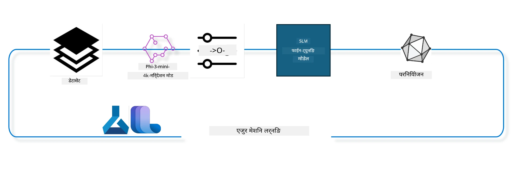

## Azure ML सिस्टम रजिस्ट्रीबाट च्याट-सम्पूर्णता कम्पोनेन्टहरूलाई मोडेललाई फाइन-ट्यून गर्न कसरी प्रयोग गर्ने

यस उदाहरणमा हामी Phi-3-mini-4k-instruct मोडेललाई २ जनाबीचको संवाद पूरा गर्न ultrachat_200k डेटासेट प्रयोग गरी फाइन ट्यून गर्नेछौं।



उदाहरणले तपाईंलाई Azure ML SDK र Python प्रयोग गरी कसरी फाइन ट्यून गर्न र त्यसपछि फाइन-ट्यून गरिएको मोडेललाई अनलाइन अन्तबिन्दुमा तैनाथ गर्ने देखाउनेछ जसले वास्तविक समयमा पूर्वानुमान गर्न सक्छ।

### प्रशिक्षण डेटा

हामी ultrachat_200k डेटासेट प्रयोग गर्नेछौं। यो UltraChat डेटासेटको धेरै छानेको संस्करण हो र Zephyr-7B-β लाई तालिम दिन प्रयोग गरिएको थियो, जुन अत्याधुनिक 7b च्याट मोडेल हो।

### मोडेल

हामी Phi-3-mini-4k-instruct मोडेल प्रयोग गर्नेछौं देखाउन कि प्रयोगकर्ताले कसरी च्याट-सम्पूर्णता कार्यको लागि मोडेल फाइनट्यून गर्न सक्छ। यदि तपाईंले यो नोटबुक कुनै विशेष मोडेल कार्डबाट खोलेको हुनुहुन्छ भने, कृपया सो विशेष मोडेल नामलाई प्रतिस्थापन गर्नुहोस्।

### कार्यहरू

- फाइन ट्यून गर्न मोडेल छान्नुहोस्।
- प्रशिक्षण डेटा छान्नुहोस् र अन्वेषण गर्नुहोस्।
- फाइन ट्यून जॉब कन्फिगर गर्नुहोस्।
- फाइन ट्यून जॉब चलाउनुहोस्।
- प्रशिक्षण र मूल्यांकन मेट्रिक्स समीक्षा गर्नुहोस्।
- फाइन ट्यून गरिएको मोडेल दर्ता गर्नुहोस्।
- वास्तविक समय पूर्वानुमानको लागि मोडेल तैनाथ गर्नुहोस्।
- स्रोतहरू सफा गर्नुहोस्।

## १. पूर्वआवश्यकताहरू सेटअप गर्नुहोस्

- निर्भरता स्थापना गर्नुहोस्
- AzureML कार्यक्षेत्रमा जडान हुनुहोस्। सेटअप SDK प्रमाणीकरणमा थप जान्नुहोस्। तल <WORKSPACE_NAME>, <RESOURCE_GROUP> र <SUBSCRIPTION_ID> प्रतिस्थापन गर्नुहोस्।
- azureml सिस्टम रजिस्ट्रीमा जडान हुनुहोस्
- वैकल्पिक प्रयोग प्रयोग नाम सेट गर्नुहोस्
- कम्प्युट जाँच वा सिर्जना गर्नुहोस्।

> [!NOTE]
> आवश्यकताहरू एउटा GPU नोडमा धेरै GPU कार्डहरू हुन सक्छन्। उदाहरणका लागि, Standard_NC24rs_v3 को एक नोडमा ४ NVIDIA V100 GPU हरू छन् भने Standard_NC12s_v3 मा २ NVIDIA V100 GPU हरू छन्। यस जानकारीका लागि कागजातहरू सन्दर्भ गर्नुहोस्। प्रति नोड GPU कार्डहरूको संख्या तल param gpus_per_node मा सेट गरिएको छ। यस मानलाई सही सेट गर्नाले नोडका सबै GPUs को उपयोग सुनिश्चित गर्दछ। सिफारिस गरिएको GPU कम्प्युट SKUs यहाँ र यहाँ फेला पार्न सकिन्छ।

### Python पुस्तकालयहरू

तलको सेल चलाएर निर्भरतालाई स्थापना गर्नुहोस्। यो नयाँ वातावरणमा चलाउँदा वैकल्पिक कदम होइन।

```bash
pip install azure-ai-ml
pip install azure-identity
pip install datasets==2.9.0
pip install mlflow
pip install azureml-mlflow
```

### Azure ML सँग अन्तरक्रिया

1. यो Python स्क्रिप्ट Azure Machine Learning (Azure ML) सेवा सँग अन्तरक्रिया गर्न प्रयोग गरिन्छ। यसले के गर्छ भन्ने संक्षिप्त विवरण:

    - यसले azure.ai.ml, azure.identity, र azure.ai.ml.entities प्याकेजहरूबाट आवश्यक मोड्युलहरू आयात गर्छ। साथै time मोड्युल आयात गर्छ।

    - यसले DefaultAzureCredential() प्रयोग गरी प्रमाणीकरण गर्न प्रयास गर्छ, जसले Azure क्लाउडमा चल्ने अनुप्रयोगहरू छिटो विकास गर्न सजिलो प्रमाणीकरण अनुभव प्रदान गर्छ। यदि यो असफल हुन्छ भने, InteractiveBrowserCredential() मा फर्किन्छ जुन अन्तरक्रियात्मक लगइन प्राँप्ट दिन्छ।

    - त्यसपछि यसले from_config विधि प्रयोग गरी MLClient वस्तु सिर्जना गर्न प्रयास गर्छ, जुन डिफल्ट कन्फिग फाइल(config.json) बाट कन्फिगरेशन पढ्छ। यदि यो असफल भयो भने, यसले subscription_id, resource_group_name, र workspace_name म्यानुअली प्रदान गरी MLClient सिर्जना गर्छ।

    - यसले अर्को MLClient वस्तु सिर्जना गर्छ, यो पटक Azure ML रजिस्ट्री "azureml" को लागि। यो रजिस्ट्री मोडेलहरू, फाइन-ट्यूनिङ पाइपलाइनहरू, र वातावरणहरू राखिन्छ।

    - प्रयोग प्रयोग नामलाई "chat_completion_Phi-3-mini-4k-instruct" सेट गर्छ।

    - यसले हालको समय (सेकेन्डमा), पूर्णांकमा परिणत गरी र त्यसपछि स्ट्रिङमा परिवर्तन गरी एक अद्वितीय टाइमस्ट्याम्प उत्पन्न गर्छ। यो टाइमस्ट्याम्प अनौठो नाम र संस्करणहरू बनाउन प्रयोग गर्न सकिन्छ।

    ```python
    # Azure ML र Azure Identity बाट आवश्यक मोड्युलहरू आयात गर्नुहोस्
    from azure.ai.ml import MLClient
    from azure.identity import (
        DefaultAzureCredential,
        InteractiveBrowserCredential,
    )
    from azure.ai.ml.entities import AmlCompute
    import time  # time मोड्युल आयात गर्नुहोस्
    
    # DefaultAzureCredential प्रयोग गरेर प्रमाणीकरण प्रयास गर्नुहोस्
    try:
        credential = DefaultAzureCredential()
        credential.get_token("https://management.azure.com/.default")
    except Exception as ex:  # यदि DefaultAzureCredential असफल भयो भने, InteractiveBrowserCredential प्रयोग गर्नुहोस्
        credential = InteractiveBrowserCredential()
    
    # डिफल्ट कन्फिग फाइल प्रयोग गरेर MLClient उदाहरण सिर्जना गर्न प्रयास गर्नुहोस्
    try:
        workspace_ml_client = MLClient.from_config(credential=credential)
    except:  # यदि त्यस्तो असफल भयो भने, विवरणहरू म्यानुअली प्रदान गरेर MLClient उदाहरण सिर्जना गर्नुहोस्
        workspace_ml_client = MLClient(
            credential,
            subscription_id="<SUBSCRIPTION_ID>",
            resource_group_name="<RESOURCE_GROUP>",
            workspace_name="<WORKSPACE_NAME>",
        )
    
    # "azureml" नामको Azure ML रजिस्ट्रीको लागि अर्को MLClient उदाहरण सिर्जना गर्नुहोस्
    # यो रजिस्ट्री मोडलहरू, फाइन-ट्यूनिङ पाईपलाइनहरू, र वातावरणहरू संग्रह गर्न स्थान हो
    registry_ml_client = MLClient(credential, registry_name="azureml")
    
    # प्रयोग परीक्षणको नाम सेट गर्नुहोस्
    experiment_name = "chat_completion_Phi-3-mini-4k-instruct"
    
    # नाम र संस्करणहरू जुन अद्वितीय हुनुपर्छ तिनीहरूको लागि प्रयोग गर्न सकिने एक अद्वितीय टाइमस्ट्याम्प उत्पन्न गर्नुहोस्
    timestamp = str(int(time.time()))
    ```

## २. फाइन ट्यून गर्नका लागि आधारभूत मोडेल छान्नुहोस्

1. Phi-3-mini-4k-instruct ३.८ अर्ब प्यारामिटरको हल्का, अत्याधुनिक खुल्ला मोडेल हो जुन Phi-2 का लागि प्रयोग गरिएका डेटासेटहरूमा बनाइएको छ। यो मोडेल Phi-3 मोडेल परिवारको हो र Mini संस्करणले दुई भेरिएन्टहरू 4K र 128K, जुन यसको प्रसंग अवधि (टोकनमा) समर्थन गर्दछ, आउँछ। हामीले यसलाई हाम्रो विशिष्ट प्रयोजनका लागि फाइनट्यून गर्न आवश्यक छ। तपाईं AzureML Studio को मोडेल क्याटलगमा च्याट-सम्पूर्णता कार्यको आधारमा यी मोडेलहरू ब्राउज गर्न सक्नुहुन्छ। यस उदाहरणमा, हामी Phi-3-mini-4k-instruct मोडेल प्रयोग गर्दैछौं। यदि तपाईंले यो नोटबुक अन्य मोडेलको लागि खोल्नुभएको छ भने, मोडेल नाम र संस्करण अनुसार प्रतिस्थापन गर्नुहोस्।

> [!NOTE]
> मोडेलको id गुण जसलाई फाइन-ट्यून जॉबमा इनपुटको रूपमा पठाइनेछ। यो AzureML Studio मोडेल क्याटलगमा मोडेल विवरण पृष्ठमा Asset ID फिल्डको रूपमा पनि उपलब्ध छ।

2. यो Python स्क्रिप्ट Azure Machine Learning (Azure ML) सेवा सँग अन्तरक्रिया गर्दैछ। के गर्छ भन्ने संक्षिप्त विवरण:

    - यसले model_name लाई "Phi-3-mini-4k-instruct" सेट गर्छ।

    - यसले registry_ml_client वस्तुको models गुणको get विधि प्रयोग गरी Azure ML रजिस्ट्रीबाट निर्दिष्ट मोडेलको पछिल्लो संस्करण प्राप्त गर्छ। get विधि दुई तर्कहरूसँग बोलाइन्छ: मोडेलको नाम र लेबल जसले पछिल्लो संस्करण प्राप्त गर्न जनाउँछ।

    - यसले कन्सोलमा मोडेलको नाम, संस्करण र id प्रिन्ट गर्छ जुन फाइन-ट्यूनिङका लागि प्रयोग हुनेछ। स्ट्रिङको format विधि प्रयोग गरी यी विवरणहरू सन्देशमा समावेश गरिन्छ। आधारभूत मोडेलको नाम, संस्करण र id को रूपमा पहुँच गरिन्छ।

    ```python
    # मोडेल नाम सेट गर्नुहोस्
    model_name = "Phi-3-mini-4k-instruct"
    
    # Azure ML रजिस्ट्रीबाट मोडेलको सबैभन्दा नयाँ संस्करण प्राप्त गर्नुहोस्
    foundation_model = registry_ml_client.models.get(model_name, label="latest")
    
    # मोडेल नाम, संस्करण, र आईडी प्रिन्ट गर्नुहोस्
    # यो जानकारी ट्र्याकिङ र डिबगिङका लागि उपयोगी छ
    print(
        "\n\nUsing model name: {0}, version: {1}, id: {2} for fine tuning".format(
            foundation_model.name, foundation_model.version, foundation_model.id
        )
    )
    ```

## ३. जॉबसँग प्रयोग गर्न कम्प्युट सिर्जना गर्नुहोस्

फाइनट्यून जॉब GPU कम्प्युट मात्र काम गर्दछ। कम्प्युटको साइज मोडेलको आकारमा निर्भर हुन्छ र धेरै अवस्थामा सही कम्प्युट छनोट गर्न जटिल हुन्छ। यस सेलमा, प्रयोगकर्तालाई जॉबका लागि उपयुक्त कम्प्युट चयन गर्न मार्गदर्शन गरिन्छ।

> [!NOTE]
> तल सूचीबद्ध कम्प्युटहरू सबैभन्दा अनुकूल कन्फिगरेसनसहित काम गर्छन्। कन्फिगरेसनमा कुनै परिवर्तनले Cuda Out Of Memory त्रुटि ल्याउन सक्छ। यस्ता अवस्थामा, कम्प्युटलाई ठूलो आकारमा अपग्रेड प्रयास गर्नुहोस्।

> [!NOTE]
> तल compute_cluster_size छान्दा, सुनिश्चित गर्नुहोस् कि कम्प्युट तपाईँको रिसोर्स समूहमा उपलब्ध छ। यदि कुनै कम्प्युट उपलब्ध छैन भने कम्प्युट स्रोतहरूमामा पहुँचको लागि अनुरोध गर्न सकिन्छ।

### फाइन ट्यून समर्थनको लागि मोडेल जाँच

1. यो Python स्क्रिप्ट Azure Machine Learning (Azure ML) मोडेलसँग अन्तरक्रिया गर्दैछ। के गर्छ भन्ने संक्षिप्त विवरण:

    - यसले ast मोड्युल आयात गर्छ, जुन Python को अमूर्त वाक्य संरचना वृक्षहरू प्रक्रिया गर्नका लागि फङ्सनहरू प्रदान गर्छ।

    - यो foundation_model वस्तुसँग finetune_compute_allow_list नामको ट्याग छ कि छैन जाँच्छ। Azure ML मा ट्यागहरू कुञ्जी-मूल्य जोडी हुन् जसले मोडेलहरू फिल्टर र क्रमबद्ध गर्न प्रयोग गर्न सकिन्छ।

    - यदि finetune_compute_allow_list ट्याग छ भने, यो ast.literal_eval प्रयोग गरी त्यसको मानलाई (स्ट्रिङबाट) Python सूचीमा सुरक्षित रूपमा रूपान्तरण गर्छ। यो सूची computes_allow_list मा राखिन्छ। त्यसपछि यो सूचीबाट कम्प्युट सिर्जना गर्न सन्देश प्रिन्ट गर्छ।

    - यदि finetune_compute_allow_list ट्याग छैन भने, computes_allow_list लाई None सेट गरी ट्याग मोडेलमा छैन भन्ने सन्देश प्रिन्ट गर्छ।

    - सारांशमा, यस स्क्रिप्टले विशेष ट्यागको खोजी गर्दछ, त्यसको मानलाई सूचीमा रूपान्तरण गर्दछ र प्रयोगकर्तालाई प्रतिक्रिया प्रदान गर्दछ।

    ```python
    # Python को साराङ्गिक समाधान व्याकरणको रूखहरू प्रशोधन गर्न कार्यहरू प्रदान गर्ने ast मोड्युल आयात गर्नुहोस्
    import ast
    
    # मोडेलको ट्यागहरूमा 'finetune_compute_allow_list' ट्याग छ कि छैन जाँच गर्नुहोस्
    if "finetune_compute_allow_list" in foundation_model.tags:
        # यदि ट्याग छ भने, ast.literal_eval प्रयोग गरेर ट्यागको मान (एक स्ट्रिङ) सुरक्षित रूपमा Python सूचीमा पार्स गर्नुहोस्
        computes_allow_list = ast.literal_eval(
            foundation_model.tags["finetune_compute_allow_list"]
        )  # स्ट्रिङलाई python सूचीमा रूपान्तरण गर्नुहोस्
        # सूचीबाट एक कम्प्युट सिर्जना गर्नुपर्ने सूचित गर्ने सन्देश प्रिन्ट गर्नुहोस्
        print(f"Please create a compute from the above list - {computes_allow_list}")
    else:
        # यदि ट्याग छैन भने, computes_allow_list लाई None मा सेट गर्नुहोस्
        computes_allow_list = None
        # 'finetune_compute_allow_list' ट्याग मोडेलको ट्यागहरूको भाग नभएको सूचित गर्ने सन्देश प्रिन्ट गर्नुहोस्
        print("`finetune_compute_allow_list` is not part of model tags")
    ```

### कम्प्युट इन्स्ट्यान्स जाँच

1. यो Python स्क्रिप्ट Azure Machine Learning (Azure ML) सेवा सँग अन्तरक्रिया गर्दै कम्प्युट इन्स्ट्यान्समा केहि जाँचहरू गर्छ। के गर्छ भन्ने संक्षिप्त विवरण:

    - यो compute_cluster मा संग्रह गरिएको नामको कम्प्युट इन्स्ट्यान्स Azure ML कार्यक्षेत्रबाट प्राप्त गर्न प्रयास गर्छ। यदि कम्प्युट provisioning state "failed" छ भने, ValueError उछाल्छ।

    - computes_allow_list None नभएको जाँच्छ। यदि हो भने सबै कम्प्युट साइजहरूलाई lowercase मा रूपान्तरण गरी यस कम्प्युट इन्स्ट्यान्सको साइज उक्त सूचीमा छ कि छैन जाँच गर्छ। छैन भने ValueError उछाल्छ।

    - यदि computes_allow_list None छ भने, कम्प्युट साइजलाई असमर्थित GPU VM साइजहरूको सूची संग तुलना गर्छ। यदि छ भने ValueError उछाल्छ।

    - कार्यक्षेत्रमा उपलब्ध सबै कम्प्युट साइजहरुको सूची प्राप्त गर्छ। त्यसपछि सूचीमा प्रत्येक कम्प्युट साइजसँग मिल्छ कि छैन ठम्याउँछ। मिलेको खण्डमा त्यस कम्प्युट साइजको GPU संख्या प्राप्त गरी gpu_count_found लाई True सेट गर्छ।

    - यदि gpu_count_found True छ भने कम्प्युट इन्स्ट्यान्समा GPU संख्या प्रिन्ट गर्छ। यदि False छ भने ValueError उछाल्छ।

    - सारांशमा, यो स्क्रिप्ट Azure ML कार्यक्षेत्रमा कम्प्युट इन्स्ट्यान्सको provisioning state, साइज अनुमत सूची वा असमर्थित सूची जाँच, र GPU संख्या जाँच गर्छ।

    ```python
    # अपवाद सन्देश प्रिन्ट गर्नुहोस्
    print(e)
    # यदि गणना साइज कार्यस्थानमा उपलब्ध छैन भने ValueError उठाउनुहोस्
    raise ValueError(
        f"WARNING! Compute size {compute_cluster_size} not available in workspace"
    )
    
    # Azure ML कार्यस्थानबाट गणना उदाहरण प्राप्त गर्नुहोस्
    compute = workspace_ml_client.compute.get(compute_cluster)
    # गणना उदाहरणको provisioning स्थिति "failed" हो कि होइन जाँच गर्नुहोस्
    if compute.provisioning_state.lower() == "failed":
        # यदि provisioning स्थिति "failed" छ भने ValueError उठाउनुहोस्
        raise ValueError(
            f"Provisioning failed, Compute '{compute_cluster}' is in failed state. "
            f"please try creating a different compute"
        )
    
    # computes_allow_list None छैन कि भनेर जाँच गर्नुहोस्
    if computes_allow_list is not None:
        # computes_allow_list मा सबै गणना साइजहरूलाई सानोतला अक्षरमा रूपान्तरण गर्नुहोस्
        computes_allow_list_lower_case = [x.lower() for x in computes_allow_list]
        # गणना उदाहरणको साइज computes_allow_list_lower_case मा छ कि छैन जाँच गर्नुहोस्
        if compute.size.lower() not in computes_allow_list_lower_case:
            # यदि गणना उदाहरणको साइज computes_allow_list_lower_case मा छैन भने ValueError उठाउनुहोस्
            raise ValueError(
                f"VM size {compute.size} is not in the allow-listed computes for finetuning"
            )
    else:
        # असमर्थित GPU VM साइजहरूको सूची परिभाषित गर्नुहोस्
        unsupported_gpu_vm_list = [
            "standard_nc6",
            "standard_nc12",
            "standard_nc24",
            "standard_nc24r",
        ]
        # गणना उदाहरणको साइज unsupported_gpu_vm_list मा छ कि छैन जाँच गर्नुहोस्
        if compute.size.lower() in unsupported_gpu_vm_list:
            # यदि गणना उदाहरणको साइज unsupported_gpu_vm_list मा छ भने ValueError उठाउनुहोस्
            raise ValueError(
                f"VM size {compute.size} is currently not supported for finetuning"
            )
    
    # गणना उदाहरणमा GPU को संख्या पत्ता लगाइएको छ कि छैन जाँच गर्न एउटा झण्डा सुरु गर्नुहोस्
    gpu_count_found = False
    # कार्यस्थानमा उपलब्ध सबै गणना साइजहरूको सूची प्राप्त गर्नुहोस्
    workspace_compute_sku_list = workspace_ml_client.compute.list_sizes()
    available_sku_sizes = []
    # उपलब्ध गणना साइजहरूको सूचीमा पुनरावृत्ति गर्नुहोस्
    for compute_sku in workspace_compute_sku_list:
        available_sku_sizes.append(compute_sku.name)
        # गणना साइजको नाम गणना उदाहरणको साइजसँग मेल खान्छ कि छैन जाँच गर्नुहोस्
        if compute_sku.name.lower() == compute.size.lower():
            # यदि मेल खान्छ भने, त्यो गणना साइजका लागि GPU को संख्या प्राप्त गर्नुहोस् र gpu_count_found लाई True मा सेट गर्नुहोस्
            gpus_per_node = compute_sku.gpus
            gpu_count_found = True
    # यदि gpu_count_found True छ भने, गणना उदाहरणमा GPU को संख्या प्रिन्ट गर्नुहोस्
    if gpu_count_found:
        print(f"Number of GPU's in compute {compute.size}: {gpus_per_node}")
    else:
        # यदि gpu_count_found False छ भने, ValueError उठाउनुहोस्
        raise ValueError(
            f"Number of GPU's in compute {compute.size} not found. Available skus are: {available_sku_sizes}."
            f"This should not happen. Please check the selected compute cluster: {compute_cluster} and try again."
        )
    ```

## ४. मोडेल फाइन-ट्यूनिङका लागि डेटासेट छान्नुहोस्

1. हामी ultrachat_200k डेटासेट प्रयोग गर्छौं। डेटासेटमा चार भागहरू छन्, जसले Supervised fine-tuning (sft) का लागि उपयुक्त छन्।
Generation ranking (gen)। प्रत्येक भागको नमूना संख्या निम्नानुसार छ:

    ```bash
    train_sft test_sft  train_gen  test_gen
    207865  23110  256032  28304
    ```

1. तल केहि सेलहरूले फाइन ट्यूनिङका लागि आधारभूत डेटा तयारी देखाउँछन्:

### केही डेटा पङ्क्तिहरू दृश्य गर्नुहोस्

हामी यो नमूना छिटो चलाउन चाहन्छौं, त्यसैले train_sft, test_sft फाइलहरूमा पहिले नै छानेका पङ्क्तिहरूको ५% मात्र सुरक्षित गरिन्छ। यसको अर्थ फाइन-ट्यून गरिएको मोडेलले कम सटीकता हुनेछ, त्यसैले यसलाई वास्तविक संसारमा प्रयोग नगरिनु पर्छ।
download-dataset.py स्क्रिप्टले ultrachat_200k डेटासेट डाउनलोड गरी डेटासेटलाई फाइनट्यून पाइपलाइन कम्पोनेन्टद्वारा उपभोगयोग्य स्वरूपमा रूपान्तरण गर्दछ। साथै डेटासेट ठूलो भएकाले यहाँ हामीसँग त्यसको भाग मात्र छ।

1. तलको स्क्रिप्टले मात्र ५% डेटा डाउनलोड गर्दछ। dataset_split_pc प्यारामिटर परिमार्जन गरेर यो प्रतिशत बढाउन सकिन्छ।

> [!NOTE]
> केहि भाषा मोडेलहरूसँग विभिन्न भाषा कोडहरू छन् र त्यसैले डेटासेटमा स्तम्भ नामहरू पनि त्यस्तै हुनुपर्छ।

1. यहाँ डेटा यसरी देखिनुपर्ने उदाहरण छ
च्याट-सम्पूर्णता डेटासेट पारकेट ढाँचामा संचित छ जहाँ प्रत्येक प्रविष्टिले निम्न स्किमालाई प्रयोग गर्दछ:

    - यो JSON (JavaScript Object Notation) डकुमेन्ट हो, जुन लोकप्रिय डेटा विनिमय ढाँचा हो। यो निष्पादनयोग्य कोड होइन, तर डेटा भण्डारण र स्थानान्तरण गर्ने तरिका हो। यसको संरचना विवरण:

    - "prompt": यस कुञ्जीले एउटा स्ट्रिङ मान राख्छ जुन AI सहायकलाई दिइएको कार्य वा प्रश्न हो।

    - "messages": यस कुञ्जीले वस्तुको सूची राख्छ। प्रत्येक वस्तुले प्रयोगकर्ता र AI सहायकबीचको संवादमा सन्देश जनाउँछ। प्रत्येक सन्देश वस्तुसँग दुई कुञ्जीहरू छन्:

    - "content": सन्देशको सामग्री।
    - "role": यो सन्देश पठाउने पात्रको भूमिका हो, जुन "user" वा "assistant" हुन सक्छ।
    - "prompt_id": प्रॉम्प्टको अद्वितीय परिचायक।

1. यस विशेष JSON डकुमेन्टमा, एउटा प्रयोगकर्ताले AI सहायकलाई dystopian कथाका पात्र बनाउन भन्छ। सहायक जवाफ दिन्छ, र प्रयोगकर्ताले थप विवरण माग्छ। सहायकले थप विवरण दिने सहमति जनाउँछ। पुरा संवाद विशेष prompt id सँग सम्बद्ध छ।

    ```python
    {
        // The task or question posed to an AI assistant
        "prompt": "Create a fully-developed protagonist who is challenged to survive within a dystopian society under the rule of a tyrant. ...",
        
        // An array of objects, each representing a message in a conversation between a user and an AI assistant
        "messages":[
            {
                // The content of the user's message
                "content": "Create a fully-developed protagonist who is challenged to survive within a dystopian society under the rule of a tyrant. ...",
                // The role of the entity that sent the message
                "role": "user"
            },
            {
                // The content of the assistant's message
                "content": "Name: Ava\n\n Ava was just 16 years old when the world as she knew it came crashing down. The government had collapsed, leaving behind a chaotic and lawless society. ...",
                // The role of the entity that sent the message
                "role": "assistant"
            },
            {
                // The content of the user's message
                "content": "Wow, Ava's story is so intense and inspiring! Can you provide me with more details.  ...",
                // The role of the entity that sent the message
                "role": "user"
            }, 
            {
                // The content of the assistant's message
                "content": "Certainly! ....",
                // The role of the entity that sent the message
                "role": "assistant"
            }
        ],
        
        // A unique identifier for the prompt
        "prompt_id": "d938b65dfe31f05f80eb8572964c6673eddbd68eff3db6bd234d7f1e3b86c2af"
    }
    ```

### डेटा डाउनलोड गर्नुहोस्

1. यो Python स्क्रिप्ट download-dataset.py नामक सहयोगी स्क्रिप्ट प्रयोग गरी डेटासेट डाउनलोड गर्न प्रयोग हुन्छ। के गर्छ भनेर संक्षिप्त विवरण:

    - यसले os मोड्युल आयात गर्छ, जुन अपरेटिङ सिस्टमसँग सम्बन्धित कार्यहरू गर्न पोर्टेबल तरिका हो।

    - यो os.system प्रयोग गरी shell मा download-dataset.py स्क्रिप्ट चलाउँछ, जसलाई कमाण्ड लाइन आर्गुमेन्टहरू दिइन्छ: डेटासेट HuggingFaceH4/ultrachat_200k, डाउनलोड गन्तव्य ultrachat_200k_dataset, र डेटासेट भाग प्रतिशत ५। os.system कमाण्डको स्थितिलाई exit_status मा राख्छ।

    - exit_status 0 नभए, जुन प्राय: त्रुटि जनाउँछ, स्क्रिप्टले Exception उठाउँछ कि डेटासेट डाउनलोडमा त्रुटि भयो।

    - सारांशमा, यो स्क्रिप्ट सहयोगी स्क्रिप्टले डेटासेट डाउनलोड गर्ने कमाण्ड चलाउँछ र असफल भएमा अपवाद फाल्छ।

    ```python
    # os मोड्युल आयात गर्नुहोस्, जसले अपरेटिंग सिस्टममा निर्भर कार्यक्षमता प्रयोग गर्ने तरिका प्रदान गर्दछ
    import os
    
    # os.system फङ्सन प्रयोग गरेर शेलमा download-dataset.py स्क्रिप्टलाई विशेष कमाण्ड-लाइन आर्गुमेन्टहरूसँग चलाउनुहोस्
    # आर्गुमेन्टहरूले डाउनलोड गर्नुपर्ने डेटासेट (HuggingFaceH4/ultrachat_200k), डाउनलोड गर्नुपर्ने डाइरेक्टरी (ultrachat_200k_dataset), र डेटासेटको विभाजन प्रतिशत (5) निर्दिष्ट गर्छन्
    # os.system फङ्सनले चलाएको कमाण्डको निकास स्थिति (exit status) फिर्ता गर्छ; यो स्थिति exit_status भेरिएबलमा राखिन्छ
    exit_status = os.system(
        "python ./download-dataset.py --dataset HuggingFaceH4/ultrachat_200k --download_dir ultrachat_200k_dataset --dataset_split_pc 5"
    )
    
    # exit_status 0 नभएको छ कि छैन भनेर जाँच गर्नुहोस्
    # Unix-जस्तै अपरेटिंग सिस्टममा, 0 निकास स्थिति सामान्यतया कमाण्ड सफल भएको जनाउँछ, जबकि अन्य कुनै पनि अंकले त्रुटि जनाउँछ
    # यदि exit_status 0 होइन भने, डेटासेट डाउनलोड गर्दा त्रुटि भएको संकेत गर्ने सन्देशसहित Exception उठाउनुहोस्
    if exit_status != 0:
        raise Exception("Error downloading dataset")
    ```

### डेटा DataFrame मा लोड गर्दै
1. यो Python स्क्रिप्टले JSON Lines फाइललाई pandas DataFrame मा लोड गर्दै छ र पहिलो 5 पङ्क्तिहरू प्रदर्शन गर्दै छ। यसले के गर्दछ भन्ने व्याख्या तल छ:

    - यसले pandas लाइब्रेरी आयात गर्दछ, जुन शक्तिशाली डेटा हेरफेर र विश्लेषण लाइब्रेरी हो।

    - यसले pandas को प्रदर्शन विकल्पहरूको अधिकतम स्तम्भ चौडाइ 0 मा सेट गर्दछ। यसको अर्थ DataFrame मुद्रण गर्दा प्रत्येक स्तम्भको पूर्ण पाठ truncation बिना देखाइनेछ।

    - यसले pd.read_json फङ्क्शन प्रयोग गरी ultrachat_200k_dataset डिरेक्टरीबाट train_sft.jsonl फाइललाई DataFrame मा लोड गर्दछ। lines=True भन्नुको अर्थ फाइल JSON Lines ढाँचामा छ, जहाँ प्रत्येक लाइन एक अलग JSON वस्तु हो।

    - यसले head मेथड प्रयोग गरी DataFrame का पहिलो 5 पङ्क्तिहरू देखाउँछ। यदि DataFrame मा 5 भन्दा कम पङ्क्तिहरू छन् भने सबै देखाउनेछ।

    - संक्षेपमा, यो स्क्रिप्टले JSON Lines फाइललाई DataFrame मा लोड गर्दै छ र पहिलो 5 पङ्क्तिहरू पूर्ण स्तम्भ पाठसँग देखाउँदै छ।
    
    ```python
    # प्यान्डास पुस्तकालय आयात गर्नुहोस्, जुन एक शक्तिशाली डाटा हेरफेर र विश्लेषण पुस्तकालय हो
    import pandas as pd
    
    # प्यान्डासको प्रदर्शन विकल्पहरूको लागि अधिकतम स्तम्भ चौडाइ 0 मा सेट गर्नुहोस्
    # यसले अर्थ राख्छ कि प्रत्येक स्तम्भको पूरै पाठ डेटा फ्रेम मुद्रित हुँदा बिना कटौती प्रदर्शन हुनेछ
    pd.set_option("display.max_colwidth", 0)
    
    # pd.read_json फंक्शन प्रयोग गरेर ultrachat_200k_dataset डिरेक्टरीबाट train_sft.jsonl फाइललाई डेटा फ्रेममा लोड गर्नुहोस्
    # lines=True अर्गुमेन्टले जनाउँछ कि फाइल JSON Lines ढाँचामा छ, जहाँ प्रत्येक लाइन एउटा अलग JSON वस्तु हुन्छ
    df = pd.read_json("./ultrachat_200k_dataset/train_sft.jsonl", lines=True)
    
    # head विधि प्रयोग गरेर डेटा फ्रेमको पहिलो 5 पङ्क्तिहरू प्रदर्शन गर्नुहोस्
    # यदि डेटा फ्रेममा 5 भन्दा कम पङ्क्तिहरू छन् भने, सबै प्रदर्शन गरिनेछ
    df.head()
    ```

## 5. मोडेल र डेटा इनपुटको रूपमा प्रयोग गरी फाइन ट्युनिङ् जॉब सबमिट गर्नुहोस्

च्याट-सम्पूर्ण पाइपलाइन कम्पोनेन्ट प्रयोग गर्ने जॉब बनाउनुहोस्। फाइन ट्युनिङका लागि समर्थित सबै प्यारामिटरहरूबारे थप जान्नुहोस्।

### फाइनट्युन प्यारामिटरहरू परिभाषित गर्नुहोस्

1. फाइनट्युन प्यारामिटरहरूलाई 2 वर्गहरूमा समूह गर्न सकिन्छ - ट्रेनिङ प्यारामिटरहरू, अप्टिमाइजेशन प्यारामिटरहरू

1. ट्रेनिङ प्यारामिटरहरूले ट्रेनिङका पक्षहरू परिभाषित गर्छन् जस्तै -

    - प्रयोग गर्नुपर्ने अप्टिमाइजर, स्केड्युलर
    - फाइनट्युन अनुकूलन गर्न प्रयोग हुने मेट्रिक
    - ट्रेनिङ चरणहरूको संख्या, ब्याच साइज आदि
    - अप्टिमाइजेशन प्यारामिटरहरूले GPU मेमोरी अनुकूलन र गणना स्रोतहरू प्रभावकारी रूपमा प्रयोग गर्न मद्दत गर्छ।

1. तल केही त्यस्ता प्यारामिटरहरू छन् जुन यो वर्ग भित्र पर्छन्। प्रत्येक मोडेलका लागि अप्टिमाइजेशन प्यारामिटरहरू भिन्न हुन्छन् र मोडेलसँगै प्याकेज गरिएका हुन्छन् यी भिन्नताहरू ह्यान्डल गर्न।

    - DeepSpeed र LoRA सक्षम पार्नुहोस्
    - मिक्स्ड प्रिसिजन ट्रेनिङ सक्षम पार्नुहोस्
    - मल्टि-नोड ट्रेनिङ सक्षम पार्नुहोस्

> [!NOTE]
> सुपरभाइज्ड फाइनट्युनिङले अलाइनमेन्ट गुमाउन वा ठूलो भूल हुन सक्छ। हामी सल्लाह दिन्छौं कि यो समस्या जाँच्न र फाइनट्युन पछि अलाइनमेन्ट चरण चलाउनुहोस्।

### फाइन ट्युनिङ प्यारामिटरहरू

1. यो Python स्क्रिप्टले मेसिन लर्निङ मोडेल फाइनट्युनिङका लागि प्यारामिटरहरू सेट गर्दैछ। यहाँ यसको कार्य विवरण छ:

    - यसले डिफल्ट ट्रेनिङ प्यारामिटरहरू सेट गर्दछ, जस्तै ट्रेनिङ एपोक संख्या, ट्रेनिङ र मूल्याङ्कनको ब्याच साइज, लर्निङ रेट, र लर्निङ रेट स्केड्युलर प्रकार।

    - यसले डिफल्ट अप्टिमाइजेशन प्यारामिटरहरू सेट गर्दछ, जस्तै Layer-wise Relevance Propagation (LoRa) र DeepSpeed को प्रयोग, र DeepSpeed स्टेज।

    - यसले ट्रेनिङ र अप्टिमाइजेशन प्यारामिटरहरूलाई finetune_parameters नामको एउटा डिक्सनरीमा संयोजन गर्दछ।

    - foundation_model मा कुनै मोडेल-विशिष्ट डिफल्ट प्यारामिटरहरू छन् कि छैनन् जाँच गर्दछ। यदि छन् भने, चेतावनी सन्देश प्रिन्ट गर्दछ र finetune_parameters लाई यी मोडेल-विशिष्ट डिफल्टहरूसँग अपडेट गर्दछ। ast.literal_eval फङ्क्शन मोडेल-विशिष्ट डिफल्टलाई स्ट्रिङबाट Python डिक्सनरीमा परिवर्तन गर्न प्रयोग हुन्छ।

    - यसले फाइन-ट्युनिङका लागि अन्तिम प्यारामिटरहरू प्रिन्ट गर्दछ जसलाई रनमा प्रयोग गरिनेछ।

    - संक्षेपमा, यो स्क्रिप्टले मेसिन लर्निङ मोडेल फाइन-ट्युनिङको प्यारामिटर सेटअप र प्रदर्शन गर्दैछ, र मोडेल-विशिष्ट डिफल्टहरूसँग डिफल्ट प्यारामिटरहरू ओभरराइड गर्ने क्षमता राख्दछ।

    ```python
    # तालिम इपोको संख्या, तालिम र मूल्याङ्कनका लागि ब्याच साइजहरू, सिकाइ दर, र सिकाइ दर अनुसूचक प्रकार जस्ता पूर्वनिर्धारित तालिम प्यारामिटरहरू सेट अप गर्नुहोस्
    training_parameters = dict(
        num_train_epochs=3,
        per_device_train_batch_size=1,
        per_device_eval_batch_size=1,
        learning_rate=5e-6,
        lr_scheduler_type="cosine",
    )
    
    # Layer-wise Relevance Propagation (LoRa) र DeepSpeed लागू गर्ने कि नगर्ने र DeepSpeed चरण जस्ता पूर्वनिर्धारित अनुकूलन प्यारामिटरहरू सेट अप गर्नुहोस्
    optimization_parameters = dict(
        apply_lora="true",
        apply_deepspeed="true",
        deepspeed_stage=2,
    )
    
    # तालिम र अनुकूलन प्यारामिटरहरूलाई एउटै डिक्सनरी finetune_parameters मा संयोजन गर्नुहोस्
    finetune_parameters = {**training_parameters, **optimization_parameters}
    
    # foundation_model सँग कुनै मोडेल-विशिष्ट पूर्वनिर्धारित प्यारामिटरहरू छन् कि छैनन् जाँच गर्नुहोस्
    # यदि छ भने चेतावनी सन्देश मुद्रण गर्नुहोस् र यी मोडेल-विशिष्ट पूर्वनिर्धारितहरूसँग finetune_parameters डिक्सनरी अपडेट गर्नुहोस्
    # ast.literal_eval कार्य प्रयोग गरेर मोडेल-विशिष्ट पूर्वनिर्धारितहरू स्ट्रिङबाट Python डिक्सनरीमा रूपान्तरण गरिन्छ
    if "model_specific_defaults" in foundation_model.tags:
        print("Warning! Model specific defaults exist. The defaults could be overridden.")
        finetune_parameters.update(
            ast.literal_eval(  # स्ट्रिङलाई python डिक्सनरीमा रूपान्तरण गर्नुहोस्
                foundation_model.tags["model_specific_defaults"]
            )
        )
    
    # चलाउन प्रयोग गरिने अन्तिम फाइन-ट्युनिङ प्यारामिटरहरूको सेट मुद्रण गर्नुहोस्
    print(
        f"The following finetune parameters are going to be set for the run: {finetune_parameters}"
    )
    ```

### ट्रेनिङ पाइपलाइन

1. यो Python स्क्रिप्टले मेसिन लर्निङ ट्रेनिङ पाइपलाइनको प्रदर्शन नाम उत्पन्न गर्ने फङ्क्शन परिभाषित गर्दैछ र त्यसपछि यसलाई कल गरेर नाम उत्पन्न गरी प्रिन्ट गर्दछ। यसको विस्तृत विवरण तल छ:

1. get_pipeline_display_name फङ्क्शन परिभाषित गरिएको छ। यो फङ्क्शन ट्रेनिङ पाइपलाइनसँग सम्बन्धित विभिन्न प्यारामिटरहरूमा आधारित प्रदर्शन नाम बनाउँछ।

1. फङ्क्शन भित्र, कुल ब्याच साइज गणना गरिन्छ जसमा प्रति-डिभाइस ब्याच साइज, ग्रेडियन्ट एक्युमुलेशन स्टेप, प्रति नोड GPU संख्या, र फाइन ट्युनिङका लागि प्रयोग भएका नोडहरूको संख्या मिलाएर हुन्छ।

1. यसले लर्निङ रेट स्केड्युलर प्रकार, DeepSpeed लागू भएको छ कि छैन, DeepSpeed स्टेज, LoRa लागू भएको छ कि छैन, मोडेल चेकपोइन्टहरूको सीमित संख्या, र अधिकतम क्रम निर्धारण लम्बाइ जस्ता अन्य प्यारामिटरहरू निकाल्दछ।

1. सबै यी प्यारामिटरहरूलाई हाइफनले छुट्ट्याएर समावेश गरेर एउटा स्ट्रिङ बनाउँछ। यदि DeepSpeed वा LoRa लागू छ भने, स्ट्रिङमा "ds" र त्यसपछि DeepSpeed स्टेज वा "lora" समावेश हुन्छ; नभए "nods" वा "nolora" हुन्छ।

1. फङ्क्शनले यो स्ट्रिङ फर्काउँछ, जुन ट्रेनिङ पाइपलाइनको प्रदर्शन नामको रूपमा काम गर्दछ।

1. फङ्क्शन परिभाषित भएपछि, यसलाई कल गरी प्रदर्शन नाम बनाइन्छ र प्रिन्ट गरिन्छ।

1. संक्षेपमा, यो स्क्रिप्ट विभिन्न प्यारामिटरहरूको आधारमा मेसिन लर्निङ ट्रेनिङ पाइपलाइनको प्रदर्शन नाम बनाउँदैछ र त्यसलाई प्रिन्ट गर्दैछ।

    ```python
    # प्रशिक्षण पाइपलाइनको लागि प्रदर्शन नाम जनरेट गर्न एक फंक्शन परिभाषित गर्नुहोस्
    def get_pipeline_display_name():
        # प्रति उपकरण ब्याच साइज, ग्रेडियन्ट एकमुश्त गर्दै गर्नका चरण संख्या, नोड प्रति GPU संख्या, र फाइन-ट्युनिङका लागि प्रयोग गरिएका नोडहरूको संख्या गुणा गरेर कुल ब्याच साइज गणना गर्नुहोस्
        batch_size = (
            int(finetune_parameters.get("per_device_train_batch_size", 1))
            * int(finetune_parameters.get("gradient_accumulation_steps", 1))
            * int(gpus_per_node)
            * int(finetune_parameters.get("num_nodes_finetune", 1))
        )
        # सिक्ने दर अनुसूचक प्रकार प्राप्त गर्नुहोस्
        scheduler = finetune_parameters.get("lr_scheduler_type", "linear")
        # DeepSpeed लागु गरिएको छ कि छैन प्राप्त गर्नुहोस्
        deepspeed = finetune_parameters.get("apply_deepspeed", "false")
        # DeepSpeed चरण प्राप्त गर्नुहोस्
        ds_stage = finetune_parameters.get("deepspeed_stage", "2")
        # यदि DeepSpeed लागू गरिएको छ भने प्रदर्शन नाममा "ds" र DeepSpeed चरण समावेश गर्नुहोस्; नभएमा "nods" समावेश गर्नुहोस्
        if deepspeed == "true":
            ds_string = f"ds{ds_stage}"
        else:
            ds_string = "nods"
        # लेयर-वार रिलिभेन्स प्रोपागेसन (LoRa) लागू गरिएको छ कि छैन प्राप्त गर्नुहोस्
        lora = finetune_parameters.get("apply_lora", "false")
        # यदि LoRa लागू गरिएको छ भने प्रदर्शन नाममा "lora" समावेश गर्नुहोस्; नभएमा "nolora" समावेश गर्नुहोस्
        if lora == "true":
            lora_string = "lora"
        else:
            lora_string = "nolora"
        # राख्ने मोडेल चेक पोइन्टहरूको संख्या सीमा प्राप्त गर्नुहोस्
        save_limit = finetune_parameters.get("save_total_limit", -1)
        # अधिकतम अनुक्रम लामो प्राप्त गर्नुहोस्
        seq_len = finetune_parameters.get("max_seq_length", -1)
        # यी सबै प्यारामिटरहरूलाई हाइफनले छुट्याएर जोडेर प्रदर्शन नाम निर्माण गर्नुहोस्
        return (
            model_name
            + "-"
            + "ultrachat"
            + "-"
            + f"bs{batch_size}"
            + "-"
            + f"{scheduler}"
            + "-"
            + ds_string
            + "-"
            + lora_string
            + f"-save_limit{save_limit}"
            + f"-seqlen{seq_len}"
        )
    
    # प्रदर्शन नाम जनरेट गर्न फंक्शन कल गर्नुहोस्
    pipeline_display_name = get_pipeline_display_name()
    # प्रदर्शन नाम प्रिन्ट गर्नुहोस्
    print(f"Display name used for the run: {pipeline_display_name}")
    ```

### पाइपलाइन कन्फिगर गर्दै

यो Python स्क्रिप्ट Azure Machine Learning SDK प्रयोग गरी मेसिन लर्निङ पाइपलाइन परिभाषित र कन्फिगर गर्दैछ। यसको कार्य विवरण तल छ:

1. Azure AI ML SDK का आवश्यक मोड्युलहरू आयात गर्दछ।

1. रजिष्ट्रि बाट "chat_completion_pipeline" नामक पाइपलाइन कम्पोनेन्ट ल्याउँछ।

1. `@pipeline` डेकोरेटर र `create_pipeline` फङ्क्शन प्रयोग गरी एउटा पाइपलाइन जॉब परिभाषित गर्दछ। पाइपलाइनको नाम `pipeline_display_name` राखिएको छ।

1. `create_pipeline` फङ्क्शन भित्र, ल्याएको पाइपलाइन कम्पोनेन्ट विभिन्न प्यारामिटरहरूसँग सुरु गर्दछ, जस्तै मोडेल बाटो, विभिन्न स्टेजका लागि कन्प्युट क्लस्टर, ट्रेनिङ र परीक्षणका लागि डेटासेट विभाजन, फाइन ट्युनिङका लागि GPU सङ्ख्या, र अन्य फाइन ट्युनिङ प्यारामिटरहरू।

1. फाइन ट्युनिङ जॉबको आउटपुटलाई पाइपलाइन जॉबको आउटपुटसँग म्याप गर्छ। यसले फाइन ट्युन गरिएको मोडेल सजिलै रजिस्टर गर्न सहयोग गर्छ, जुन मोडेललाई अनलाइन वा ब्याच एन्डपोइन्टमा डिप्लोय गर्न आवश्यक हुन्छ।

1. `create_pipeline` फङ्क्शनलाई कल गरेर पाइपलाइनको उदाहरण बनाउँछ।

1. पाइपलाइनको `force_rerun` सेटिंगलाई `True` मा राख्छ, जसको मतलब अघिल्लो जॉबहरूको क्यास गरिएको नतिजा प्रयोग हुँदैन।

1. पाइपलाइनको `continue_on_step_failure` सेटिंगलाई `False` राख्छ, जसको अर्थ कुनै केहि स्टेप फेल हुँदा पाइपलाइन रोकिन्छ।

1. संक्षेपमा, यो स्क्रिप्ट Azure Machine Learning SDK प्रयोग गरी च्याट कम्प्लीसन कार्यको लागि मेसिन लर्निङ पाइपलाइन परिभाषित र कन्फिगर गर्दैछ।

    ```python
    # Azure AI ML SDK बाट आवश्यक मड्युलहरू आयात गर्नुहोस्
    from azure.ai.ml.dsl import pipeline
    from azure.ai.ml import Input
    
    # रजिस्ट्रीबाट "chat_completion_pipeline" नामको पाइपलाइन कम्पोनेन्ट ल्याउनुहोस्
    pipeline_component_func = registry_ml_client.components.get(
        name="chat_completion_pipeline", label="latest"
    )
    
    # @pipeline डेकोरेटर र create_pipeline फङ्सन प्रयोग गरेर पाइपलाइन जॉब परिभाषित गर्नुहोस्
    # पाइपलाइनको नाम pipeline_display_name मा सेट गरिएको छ
    @pipeline(name=pipeline_display_name)
    def create_pipeline():
        # ल्याइएको पाइपलाइन कम्पोनेन्टलाई विभिन्न प्यारामिटरहरू सहित सुरु गर्नुहोस्
        # यसमा मोडेल पथ, विभिन्न चरणका लागि कम्प्युट क्लस्टरहरू, प्रशिक्षण र परीक्षणका लागि डेटा सेट स्प्लिटहरू, फाइन-ट्यूनिङका लागि GPU को संख्या, र अन्य फाइन-ट्यूनिङ प्यारामिटरहरू समावेश छन्
        chat_completion_pipeline = pipeline_component_func(
            mlflow_model_path=foundation_model.id,
            compute_model_import=compute_cluster,
            compute_preprocess=compute_cluster,
            compute_finetune=compute_cluster,
            compute_model_evaluation=compute_cluster,
            # डेटा सेट स्प्लिटहरूलाई प्यारामिटरहरूमा म्याप गर्नुहोस्
            train_file_path=Input(
                type="uri_file", path="./ultrachat_200k_dataset/train_sft.jsonl"
            ),
            test_file_path=Input(
                type="uri_file", path="./ultrachat_200k_dataset/test_sft.jsonl"
            ),
            # प्रशिक्षण सेटिङहरू
            number_of_gpu_to_use_finetuning=gpus_per_node,  # कम्प्युटमा उपलब्ध GPU को संख्यामा सेट गर्नुहोस्
            **finetune_parameters
        )
        return {
            # फाइन ट्यूनिङ जॉबको आउटपुटलाई पाइपलाइन जॉबको आउटपुटसँग म्याप गर्नुहोस्
            # यसो गर्दा हामी सजिलैसँग फाइन ट्यून गरिएको मोडेल दर्ता गर्न सक्छौं
            # मोडेल दर्ता गर्नु आवश्यक छ ताकि मोडेललाई अनलाइन वा ब्याच अन्त बिन्दुमा परिनियोजन गर्न सकियोस्
            "trained_model": chat_completion_pipeline.outputs.mlflow_model_folder
        }
    
    # create_pipeline फंक्शन कल गरेर पाइपलाइनको एउटा उदाहरण सिर्जना गर्नुहोस्
    pipeline_object = create_pipeline()
    
    # अघिल्ला जॉबका क्याश गरिएको परिणामहरू प्रयोग नगर्नुहोस्
    pipeline_object.settings.force_rerun = True
    
    # स्टेपमा असफलताको स्थितिमा continue on step failure लाई False मा सेट गर्नुहोस्
    # यसको मतलब यदि कुनै पनि स्टेप असफल भयो भने पाइपलाइन रोकिएला
    pipeline_object.settings.continue_on_step_failure = False
    ```

### जॉब सबमिट गर्नुहोस्

1. यो Python स्क्रिप्टले Azure Machine Learning वर्कस्पेसमा मेसिन लर्निङ पाइपलाइन जॉब सबमिट गर्दै छ र त्यसपछि जॉब पूर्ण हुन कुर्दछ। यसको विवरण तल छ:

    - यसले workspace_ml_client को jobs वस्तुको create_or_update मेथड कल गरेर पाइपलाइन जॉब सबमिट गर्दछ। पाइपलाइन सिस्टममा pipeline_object द्वारा निर्दिष्ट गरिएको छ र जॉब चलाउने प्रयोग गरिएको experiment experiment_name द्वारा निर्दिष्ट हुन्छ।

    - त्यसपछि workspace_ml_client को jobs वस्तुको stream मेथड कल गरी पाइपलाइन जॉब सकिन कुर्छ। इतवारीका लागि पाइपलाइन_job वस्तुको name एट्रिब्युट प्रयोग हुन्छ।

    - संक्षेपमा, यो स्क्रिप्ट Azure Machine Learning वर्कस्पेसमा मेसिन लर्निङ पाइपलाइन जॉब सबमिट गरी त्यसको समाप्ति पर्खिरहेको छ।

    ```python
    # Azure Machine Learning कार्यक्षेत्रमा पाइपलाइन जागिर सबमिट गर्नुहोस्
    # चलाउनुपर्ने पाइपलाइन pipeline_object द्वारा निर्दिष्ट गरिएको छ
    # जागिर चलाइने प्रयोगको नाम experiment_name द्वारा निर्दिष्ट गरिएको छ
    pipeline_job = workspace_ml_client.jobs.create_or_update(
        pipeline_object, experiment_name=experiment_name
    )
    
    # पाइपलाइन जागिर पूरा हुन कुर्नुहोस्
    # कुर्नुपर्ने जागिर pipeline_job वस्तुको name विशेषता द्वारा निर्दिष्ट गरिएको छ
    workspace_ml_client.jobs.stream(pipeline_job.name)
    ```

## 6. फाइनट्युन गरिएको मोडेललाई वर्कस्पेसमा रजिष्टर गर्नुहोस्

हामी फाइन ट्युनिङ जॉबको आउटपुटबाट मोडेल रजिष्टर गर्नेछौं। यसले फाइनट्युन मोडेल र फाइनट्युन जॉबको बीचमा lineage ट्र्याक गर्नेछ। फाइनट्युन जॉबले अझै आधार मोडेल, डेटा र ट्रेनिङ कोडसँग lineage ट्र्याक गर्दछ।

### ML मोडेल रजिष्टर गर्दै

1. यो Python स्क्रिप्टले Azure Machine Learning पाइपलाइनमा प्रशिक्षित मेसिन लर्निङ मोडेललाई रजिष्टर गर्दैछ। यसको विवरण तल छ:

    - Azure AI ML SDK का आवश्यक मोड्युलहरू आयात गर्दछ।

    - pipeline जॉबबाट trained_model आउटपुट उपलब्ध छ कि छैन जाँच्न workspace_ml_client को jobs वस्तुको get मेथड कल गरेपछि outputs एट्रिब्युटसम्म पहुँच गर्छ।

    - pipeline जॉबको नाम र आउटपुट ("trained_model") को नाम प्रयोग गरी प्रशिक्षित मोडेलको बाटो बनाउँछ।

    - फाइन्ट्युन गरिएको मोडेलको नामको रूपमा मूल मोडेलको नामसँग "-ultrachat-200k" थपेर र स्ल्यासहरूलाई हाइफनमा परिवर्तन गरेर नाम निर्धारण गर्दछ।

    - मोडेल रजिष्टर गर्न Model वस्तु तयार गर्दछ, जसमा मोडेलको बाटो, मोडेल प्रकार (MLflow मोडेल), नाम र संस्करण, र मोडेलको विवरण समाहित छन्।

    - workspace_ml_client को models वस्तुको create_or_update मेथड कल गरेर मोडेललाई रजिष्टर गर्छ।

    - रजिष्टर गरिएको मोडेल प्रिन्ट गर्दछ।

1. संक्षेपमा, यो स्क्रिप्ट Azure Machine Learning पाइपलाइनमा प्रशिक्षित एक मेसिन लर्निङ मोडेललाई रजिष्टर गर्दैछ।
    
    ```python
    # Azure AI ML SDK बाट आवश्यक मोड्युलहरू आयात गर्नुहोस्
    from azure.ai.ml.entities import Model
    from azure.ai.ml.constants import AssetTypes
    
    # पाइपलाइन कामबाट `trained_model` आउटपुट उपलब्ध छ कि छैन जाँच गर्नुहोस्
    print("pipeline job outputs: ", workspace_ml_client.jobs.get(pipeline_job.name).outputs)
    
    # पाइपलाइन कामको नाम र आउटपुट ("trained_model") को नाम प्रयोग गरेर स्ट्रिङलाई ढाँचाबद्ध गरेर तालिम पाइएको मोडेलमा पथ निर्माण गर्नुहोस्
    model_path_from_job = "azureml://jobs/{0}/outputs/{1}".format(
        pipeline_job.name, "trained_model"
    )
    
    # मूल मोडेल नाममा "-ultrachat-200k" थपेर र कुनै पनि स्ल्यासहरूलाई हाइफनले प्रतिस्थापन गरेर फाइन्-ट्युन गरिएको मोडेलको नाम परिभाषित गर्नुहोस्
    finetuned_model_name = model_name + "-ultrachat-200k"
    finetuned_model_name = finetuned_model_name.replace("/", "-")
    
    print("path to register model: ", model_path_from_job)
    
    # विभिन्न प्यारामिटरहरूसँग एक Model वस्तु सिर्जना गरेर मोडेल दर्ता गर्न तयार हुनुहोस्
    # यसमा मोडेलको पथ, मोडेलको प्रकार (MLflow मोडेल), मोडेलको नाम र संस्करण, र मोडेलको वर्णन समावेश छन्
    prepare_to_register_model = Model(
        path=model_path_from_job,
        type=AssetTypes.MLFLOW_MODEL,
        name=finetuned_model_name,
        version=timestamp,  # संस्करण द्वन्द्वबाट जोगिन टाइमस्ट्याम्पलाई संस्करणको रूपमा प्रयोग गर्नुहोस्
        description=model_name + " fine tuned model for ultrachat 200k chat-completion",
    )
    
    print("prepare to register model: \n", prepare_to_register_model)
    
    # Model वस्तुलाई तर्कको रूपमा लिएर workspace_ml_client मा models वस्तुको create_or_update विधि कल गरेर मोडेल दर्ता गर्नुहोस्
    registered_model = workspace_ml_client.models.create_or_update(
        prepare_to_register_model
    )
    
    # दर्ता गरिएको मोडेल प्रिन्ट गर्नुहोस्
    print("registered model: \n", registered_model)
    ```

## 7. फाइन ट्युन गरिएको मोडेललाई अनलाइन एन्डपोइन्टमा डिप्लोय गर्नुहोस्

अनलाइन एन्डपोइन्टहरूले ड्युरेबल REST API दिन्छन् जुन मोडेल प्रयोग गर्नुपर्ने एप्लिकेसनहरूसँग एकीकृत गर्न सकिन्छ।

### एन्डपोइन्ट व्यवस्थापन

1. यो Python स्क्रिप्ट Azure Machine Learning मा रजिष्टर गरिएको मोडेलका लागि व्यवस्थापित अनलाइन एन्डपोइन्ट बनाउँदैछ। तल के गर्दछ देखिन्छ:

    - Azure AI ML SDK बाट आवश्यक मोड्युलहरू आयात गर्दछ।

    - "ultrachat-completion-" स्ट्रिङमा टाइमस्ट्याम्प जोडेर अनलाइन एन्डपोइन्टको युनिक नाम बनाउँछ।

    - ManagedOnlineEndpoint वस्तु बनाएर एन्डपोइन्ट बनाउने तयारी गर्दछ, जसमा एन्डपोइन्टको नाम, विवरण, र प्रमाणीकरण मोड ("key") समावेश छन्।

    - workspace_ml_client को begin_create_or_update मेथड प्रयोग गरी अनलाइन एन्डपोइन्ट सिर्जना गर्दछ र wait मेथडले निर्माण प्रक्रिया पूरा हुन पर्खन्छ।

1. संक्षेपमा, यो स्क्रिप्ट Azure Machine Learning मा रजिष्टर मोडेलका लागि व्यवस्थापित अनलाइन एन्डपोइन्ट सिर्जना गर्दैछ।

    ```python
    # Azure AI ML SDK बाट आवश्यक मोड्युलहरू आयात गर्नुहोस्
    from azure.ai.ml.entities import (
        ManagedOnlineEndpoint,
        ManagedOnlineDeployment,
        ProbeSettings,
        OnlineRequestSettings,
    )
    
    # "ultrachat-completion-" स्ट्रिङमा टाइमस्ट्याम्प थपेर अनलाइन अन्तबिन्दुको अनौठो नाम परिभाषित गर्नुहोस्
    online_endpoint_name = "ultrachat-completion-" + timestamp
    
    # विभिन्न प्यारामिटरहरूसँग ManagedOnlineEndpoint वस्तु सिर्जना गरेर अनलाइन अन्तबिन्दु तयार पार्न तयारी गर्नुहोस्
    # यीमा अन्तबिन्दुको नाम, अन्तबिन्दुको विवरण, र प्रमाणीकरण मोड ("key") समावेश छन्
    endpoint = ManagedOnlineEndpoint(
        name=online_endpoint_name,
        description="Online endpoint for "
        + registered_model.name
        + ", fine tuned model for ultrachat-200k-chat-completion",
        auth_mode="key",
    )
    
    # ManagedOnlineEndpoint वस्तुलाई तर्क स्वरूप लिएर workspace_ml_client को begin_create_or_update विधि कल गरेर अनलाइन अन्तबिन्दु सिर्जना गर्नुहोस्
    # त्यसपछि wait विधि कल गरेर सिर्जना अपरेशन पूरा हुन कुर्नुहोस्
    workspace_ml_client.begin_create_or_update(endpoint).wait()
    ```

> [!NOTE]
> तपाईले यहाँ एन्डपोइन्ट डिप्लोयमेन्टका लागि समर्थित SKU हरूको सूची भेट्टाउन सक्नुहुन्छ - [Managed online endpoints SKU list](https://learn.microsoft.com/azure/machine-learning/reference-managed-online-endpoints-vm-sku-list)

### ML मोडेल डिप्लोय गर्दै

1. यो Python स्क्रिप्ट Azure Machine Learning मा व्यवस्थापित अनलाइन एन्डपोइन्टमा रजिष्टर गरिएको मेसिन लर्निङ मोडेल डिप्लोय गर्दैछ। के गरिन्छ हेर्दै:

    - Python को ast मोड्युल आयात गर्दछ, जसले Python अमूर्त वाक्य संरचना संस्कार गर्ने फङ्क्शनहरू उपलब्ध गराउँछ।

    - डिप्लोयमेन्टका लागि इन्स्ट्यान्स प्रकार "Standard_NC6s_v3" सेट गर्दछ।

    - foundation model मा inference_compute_allow_list ट्याग छ कि छैन जाँच गर्दछ। भएमा यसको मानलाई स्ट्रिङबाट Python सूचीमा परिणत गरी inference_computes_allow_list मा राख्छ; नभए None सेट गर्दछ।

    - निर्दिष्ट इन्स्ट्यान्स प्रकार अनुमति सूचीमा छ कि छैन जाँच गरी छैन भने, उपयोगकर्तालाई अनुमति सूचीबाट इन्स्ट्यान्स प्रकार चयन गर्न सन्देश देखाउँछ।

    - ManagedOnlineDeployment वस्तु बनाएर डिप्लोय तयार गर्दछ, जसमा डिप्लोयमेन्ट नाम, एन्डपोइन्ट नाम, मोडेल ID, इन्स्ट्यान्स प्रकार र संख्या, लिभनेस प्रोब सेटिङ, र अनुरोध सेटिङहरू समावेश छन्।

    - workspace_ml_client को begin_create_or_update मेथड प्रयोग गरी डिप्लोय बनाउँछ र wait मेथडले निर्माण पूरा हुन कुर्छ।

    - एन्डपोइन्ट ट्राफिक 100% "demo" डिप्लोयमेन्टतर्फ निर्देशित गर्दछ।

    - workspace_ml_client को begin_create_or_update मेथडले एन्डपोइन्ट अपडेट गर्दछ र result मेथडले प्रक्रिया पूरा हुन कुर्छ।

1. संक्षेपमा, यो स्क्रिप्ट Azure Machine Learning मा व्यवस्थापित अनलाइन एन्डपोइन्टमा रजिष्टर गरिएको मेसिन लर्निङ मोडेल डिप्लोय गर्दैछ।

    ```python
    # ast मोड्युल आयात गर्नुहोस्, जसले पाइथन सारांश व्याकरणका रूखहरूलाई प्रक्रिया गर्ने कार्यहरू प्रदान गर्दछ
    import ast
    
    # परिनियोजनको लागि इन्स्ट्यान्स प्रकार सेट गर्नुहोस्
    instance_type = "Standard_NC6s_v3"
    
    # जाँच गर्नुहोस् कि `inference_compute_allow_list` ट्याग फाउन्डेसन मोडेलमा उपस्थित छ कि छैन
    if "inference_compute_allow_list" in foundation_model.tags:
        # यदि छ भने, ट्याग मानलाई स्ट्रिङबाट पाइथन सूचीमा परिणत गरी `inference_computes_allow_list` मा असाइन गर्नुहोस्
        inference_computes_allow_list = ast.literal_eval(
            foundation_model.tags["inference_compute_allow_list"]
        )
        print(f"Please create a compute from the above list - {computes_allow_list}")
    else:
        # यदि छैन भने, `inference_computes_allow_list` लाई `None` मा सेट गर्नुहोस्
        inference_computes_allow_list = None
        print("`inference_compute_allow_list` is not part of model tags")
    
    # निर्दिष्ट इन्स्ट्यान्स प्रकार अनुमति सूचीमा छ कि छैन जाँच गर्नुहोस्
    if (
        inference_computes_allow_list is not None
        and instance_type not in inference_computes_allow_list
    ):
        print(
            f"`instance_type` is not in the allow listed compute. Please select a value from {inference_computes_allow_list}"
        )
    
    # विभिन्न प्यारामिटरहरूसँग `ManagedOnlineDeployment` वस्तु सिर्जना गरेर परिनियोजन बनाउन तयार हुनुहोस्
    demo_deployment = ManagedOnlineDeployment(
        name="demo",
        endpoint_name=online_endpoint_name,
        model=registered_model.id,
        instance_type=instance_type,
        instance_count=1,
        liveness_probe=ProbeSettings(initial_delay=600),
        request_settings=OnlineRequestSettings(request_timeout_ms=90000),
    )
    
    # `workspace_ml_client` को `begin_create_or_update` विधि बोलाएर `ManagedOnlineDeployment` वस्तुलाई तर्कस्वरूप दिएर परिनियोजन सिर्जना गर्नुहोस्
    # त्यसपछि `wait` विधि बोलाएर सिर्जना अपरेशन पूरा हुने प्रतीक्षा गर्नुहोस्
    workspace_ml_client.online_deployments.begin_create_or_update(demo_deployment).wait()
    
    # अन्त बिन्दुको ट्राफिकलाई "demo" परिनियोजनतर्फ १००% निर्देशित गर्ने गरी सेट गर्नुहोस्
    endpoint.traffic = {"demo": 100}
    
    # `workspace_ml_client` को `begin_create_or_update` विधि बोलाएर `endpoint` वस्तुलाई तर्कस्वरूप दिएर अन्त बिन्दु अपडेट गर्नुहोस्
    # त्यसपछि `result` विधि बोलाएर अपडेट अपरेशन पूरा हुन प्रतीक्षा गर्नुहोस्
    workspace_ml_client.begin_create_or_update(endpoint).result()
    ```

## 8. नमुना डेटासँग एन्डपोइन्ट परीक्षण गर्नुहोस्

हामी परीक्षण डेटासेटबाट केही नमुना डेटा ल्याएर अनलाइन एन्डपोइन्टमा इन्फ्रेन्सका लागि पठाउनेछौं। त्यसपछि स्कोर गरिएको लेबलहरू र ग्राउन्ड ट्रूथ लेबलहरू देखाउने छौं।

### नतिजा पढ्दै

1. यो Python स्क्रिप्टले JSON Lines फाइललाई pandas DataFrame मा पढ्दैछ, एउटा र्यान्डम नमुना लिन्छ र इन्डेक्स रिसेट गर्छ। के गर्छ तल छ:

    - ./ultrachat_200k_dataset/test_gen.jsonl फाइल pandas DataFrame मा पढ्छ। lines=True प्रयोग गरिन्छ किनभने फाइल JSON Lines ढाँचामा छ, जसमा प्रत्येक लाइन एक अलग JSON वस्तु हो।

    - DataFrame बाट 1 पङ्क्तिको र्यान्डम नमुना लिन्छ। sample फङ्क्शनमा n=1 राखेर नमुनाको साइज निर्दिष्ट गरिएको छ।

    - DataFrame को इन्डेक्स रिसेट गर्दछ। reset_index लाई drop=True सँग प्रयोग गरी पुरानो इन्डेक्स हटाइन्छ र नयाँ सामान्य पूर्णांक इन्डेक्स दिइन्छ।

    - head फङ्क्शनले पहिलो 2 पङ्क्तिहरू देखाउँछ। तर नमुना पछि DataFrame मा केवल 1 पङ्क्ति भएकाले त्यो 1 पङ्क्ति मात्र देखाइन्छ।

1. संक्षेपमा, यो स्क्रिप्ट JSON Lines फाइल पढेर pandas DataFrame बनाउँछ, 1 पङ्क्तिको र्यान्डम नमुना लिन्छ, इन्डेक्स रिसेट गर्छ र पहिलो पङ्क्ति देखाउँछ।
    
    ```python
    # pandas पुस्तकालय आयात गर्नुहोस्
    import pandas as pd
    
    # JSON Lines फाइल './ultrachat_200k_dataset/test_gen.jsonl' लाई pandas DataFrame मा पढ्नुहोस्
    # 'lines=True' तर्कले देखाउँछ कि फाइल JSON Lines ढाँचामा छ, जहाँ प्रत्येक लाइन अलग JSON वस्तु हो
    test_df = pd.read_json("./ultrachat_200k_dataset/test_gen.jsonl", lines=True)
    
    # DataFrame बाट 1 पंक्तिको र्याण्डम नमूना लिनुहोस्
    # 'n=1' तर्कले चयन गर्नुपर्ने र्याण्डम पंक्तिहरूको संख्या निर्दिष्ट गर्दछ
    test_df = test_df.sample(n=1)
    
    # DataFrame को अनुक्रमणिका रिसेट गर्नुहोस्
    # 'drop=True' तर्कले बताउँछ कि मूल अनुक्रमणिका हटाई नयाँ डिफल्ट पूर्णांक अनुक्रमणिका राखिनुपर्छ
    # 'inplace=True' तर्कले जनाउँछ कि DataFrame लाई सोही स्थानमा परिमार्जन गर्नुपर्छ (नयाँ वस्तु बनाएर होइन)
    test_df.reset_index(drop=True, inplace=True)
    
    # DataFrame को पहिलो 2 पंक्ति प्रदर्शन गर्नुहोस्
    # यद्यपि, नमूनाकरण पछि DataFrame मा केवल एकै पंक्ति हुँदा यो केवल त्यो एक पंक्ति देखाउनेछ
    test_df.head(2)
    ```

### JSON वस्तु सिर्जना गर्नुहोस्
1. यो Python स्क्रिप्टले विशेष प्यारामिटरहरू सहित JSON वस्तु सिर्जना गर्दै छ र यसलाई फाइलमा सेभ गर्दै छ। यसले गर्ने कुराको संक्षिप्त विवरण यस प्रकार छ:

    - यसले json मोड्युल आयात गर्छ, जसले JSON डाटा संग काम गर्ने कार्यहरू प्रदान गर्छ।

    - यसले parameters नामक शब्दकोश सिर्जना गर्छ जसमा मेशिन लर्निङ मोडेलका लागि प्यारामिटरहरू छन्। कीहरू "temperature", "top_p", "do_sample", र "max_new_tokens" हुन् र तिनका पूर्वनिर्धारित मानहरू क्रमशः 0.6, 0.9, True, र 200 छन्।

    - यसले अर्को शब्दकोश test_json बनाउँछ जसमा दुई कीहरू छन्: "input_data" र "params"। "input_data" को मान अर्को शब्दकोश हो जसमा "input_string" र "parameters" कीहरू छन्। "input_string" को मान test_df डाटाफ्रेमबाट पहिलो सन्देश भएको सूची हो। "parameters" को मान पहिले सिर्जना गरिएको parameters शब्दकोश हो। "params" को मान खाली शब्दकोश हो।

    - यसले sample_score.json नामक फाइल खोल्छ
    
    ```python
    # JSON डाटा सँग काम गर्नका लागि फंक्शनहरू उपलब्ध गराउने json मोड्युल आयात गर्नुहोस्
    import json
    
    # एक डिक्सनरी `parameters` बनाउनुहोस् जसमा मेशिन लर्निङ मोडलका लागि कुञ्जीहरू र मानहरू प्रतिनिधित्व गरिन्छ
    # कुञ्जीहरू "temperature", "top_p", "do_sample", र "max_new_tokens" हुन्, र तिनीहरूको सम्बन्धित मानहरू क्रमशः 0.6, 0.9, True, र 200 हुन्
    parameters = {
        "temperature": 0.6,
        "top_p": 0.9,
        "do_sample": True,
        "max_new_tokens": 200,
    }
    
    # अर्को डिक्सनरी `test_json` बनाउनुहोस् जसमा दुई कुञ्जीहरू छन्: "input_data" र "params"
    # "input_data" को मान अर्को डिक्सनरी हो जसमा "input_string" र "parameters" कुञ्जीहरू छन्
    # "input_string" को मान `test_df` डाटाफ्रेमको पहिलो सन्देश समावेश गर्ने सूची हो
    # "parameters" को मान पहिले बनाइएको `parameters` डिक्सनरी हो
    # "params" को मान खाली डिक्सनरी हो
    test_json = {
        "input_data": {
            "input_string": [test_df["messages"][0]],
            "parameters": parameters,
        },
        "params": {},
    }
    
    # `./ultrachat_200k_dataset` डिरेक्टरीमा `sample_score.json` नामको फाइल लेख्ने मोडमा खोल्नुहोस्
    with open("./ultrachat_200k_dataset/sample_score.json", "w") as f:
        # `json.dump` फंक्शन प्रयोग गरी `test_json` डिक्सनरीलाई JSON फारम्याटमा फाइलमा लेख्नुहोस्
        json.dump(test_json, f)
    ```

### Endpoint बोलाउने

1. यो Python स्क्रिप्टले Azure Machine Learning मा अनलाइन Endpoint बोलाएर JSON फाइल स्कोर गर्ने काम गर्छ। यसको संक्षिप्त विवरण यस प्रकार छ:

    - यसले workspace_ml_client वस्तुको online_endpoints सम्पत्तिको invoke पद्दति कल गर्छ। यो पद्दति अनलाइन endpoint मा अनुरोध पठाउन र प्रतिक्रिया प्राप्त गर्न प्रयोग गरिन्छ।

    - यसले endpoint_name र deployment_name आर्गुमेन्टहरू प्रयोग गरी endpoint र डिप्लोयमेन्टको नाम निर्दिष्ट गर्छ। यस अवस्थामा, endpoint नाम online_endpoint_name भेरिएबलमा राखिएको छ र डिप्लोयमेन्टको नाम "demo" हो।

    - यसले स्कोर गर्नुपर्ने JSON फाइलको पथ request_file आर्गुमेन्ट मार्फत निर्दिष्ट गर्छ। यस अवस्थामा, फाइल ./ultrachat_200k_dataset/sample_score.json हो।

    - यसले endpoint बाट प्राप्त प्रतिक्रियालाई response भेरिएबलमा स्टोर गर्छ।

    - यसले कच्चा प्रतिक्रिया प्रिन्ट गर्छ।

1. सारांशमा, यो स्क्रिप्ट Azure Machine Learning मा अनलाइन endpoint बोलाएर JSON फाइल स्कोर गर्छ र प्रतिक्रिया प्रिन्ट गर्छ।

    ```python
    # Azure Machine Learning मा अनलाइन इन्डप्वाइन्टलाई `sample_score.json` फाइल स्कोर गर्न बोलाउनुहोस्
    # `workspace_ml_client` वस्तुको `online_endpoints` सम्पत्ति को `invoke` विधि अनलाइन इन्डप्वाइन्टमा अनुरोध पठाउन र प्रतिक्रिया प्राप्त गर्न प्रयोग गरिन्छ
    # `endpoint_name` तर्कले इन्डप्वाइन्टको नाम निर्दिष्ट गर्दछ, जुन `online_endpoint_name` भेरियेबलमा राखिएको छ
    # `deployment_name` तर्कले डिप्लोयमेन्टको नाम निर्दिष्ट गर्दछ, जुन "demo" हो
    # `request_file` तर्कले स्कोर गर्नुपर्ने JSON फाइलको मार्ग निर्दिष्ट गर्दछ, जुन `./ultrachat_200k_dataset/sample_score.json` हो
    response = workspace_ml_client.online_endpoints.invoke(
        endpoint_name=online_endpoint_name,
        deployment_name="demo",
        request_file="./ultrachat_200k_dataset/sample_score.json",
    )
    
    # इन्डप्वाइन्टबाट आएको कच्चा प्रतिक्रियालाई प्रिन्ट गर्नुहोस्
    print("raw response: \n", response, "\n")
    ```

## 9. अनलाइन endpoint मेटाउनुहोस्

1. अनलाइन endpoint मेट्न नबिर्सनुहोस्, नत्र endpoint ले प्रयोग गरेको कम्प्युटको बिलिङ मिटर चलिरहन्छ। यो Python कोडको लाइनले Azure Machine Learning मा अनलाइन endpoint मेट्दछ। यसको संक्षिप्त विवरण यस प्रकार छ:

    - यसले workspace_ml_client वस्तुको online_endpoints सम्पत्तिको begin_delete पद्दति कल गर्छ। यो पद्दति अनलाइन endpoint मेट्न सुरु गर्न प्रयोग गरिन्छ।

    - यसले name आर्गुमेन्ट मार्फत मेट्नुपर्ने endpoint को नाम निर्दिष्ट गर्छ। यस अवस्थामा, endpoint नाम online_endpoint_name भेरिएबलमा छ।

    - यसले wait पद्दति कल गर्छ जसले मेट्ने अपरेशन पूरा हुन पर्खन्छ। यो एक ब्लक गर्ने अपरेशन हो, जसले स्क्रिप्टलाई मेट्ने प्रक्रिया पूरा नभएसम्म अगाडि बढ्न नदिन्छ।

    - सारांशमा, यसले Azure Machine Learning मा अनलाइन endpoint को मेट्ने प्रक्रिया सुरु गरी अपरेशन पूरा हुन पर्खन्छ।

    ```python
    # Azure Machine Learning मा अनलाइन अन्तर्गत समाप्त गर्नुहोस्
    # `workspace_ml_client` वस्तुको `online_endpoints` सम्पत्तिको `begin_delete` विधि अनलाइन अन्तर्गत मेटाउन सुरु गर्न प्रयोग गरिन्छ
    # `name` तर्कले मेटाउनुपर्ने अन्तर्गतको नाम निर्दिष्ट गर्दछ, जुन `online_endpoint_name` भेरिएबलमा राखिएको छ
    # मेटाउने प्रक्रिया पूरा हुनसम्म पर्खन `wait` विधि बोलाइन्छ। यो एउटा ब्लक गर्ने प्रक्रिया हो, जसले स्क्रिप्टलाई मेटाउन सकिएसम्म जारी राख्नबाट रोक्छ।
    workspace_ml_client.online_endpoints.begin_delete(name=online_endpoint_name).wait()
    ```

---

<!-- CO-OP TRANSLATOR DISCLAIMER START -->
**अस्वीकरण**:
यो दस्तावेज AI अनुवाद सेवा [Co-op Translator](https://github.com/Azure/co-op-translator) प्रयोग गरी अनुवाद गरिएको हो। हामी शुद्धताको लागि प्रयास गर्छौं भने पनि, कृपया जानकार रहनुहोस् कि स्वचालित अनुवादमा त्रुटि वा अशुद्धता हुन सक्छ। मूल दस्तावेज यसको स्वदेशी भाषामा आधिकारिक स्रोत मानिनुपर्छ। महत्वपूर्ण जानकारीका लागि पेशेवर मानवीय अनुवाद सिफारिस गरिन्छ। यस अनुवादको प्रयोगबाट उत्पन्न भएको कुनै पनि गलतफहमी वा भ्रान्तिको लागि हामी जिम्मेवार हौँन।
<!-- CO-OP TRANSLATOR DISCLAIMER END -->