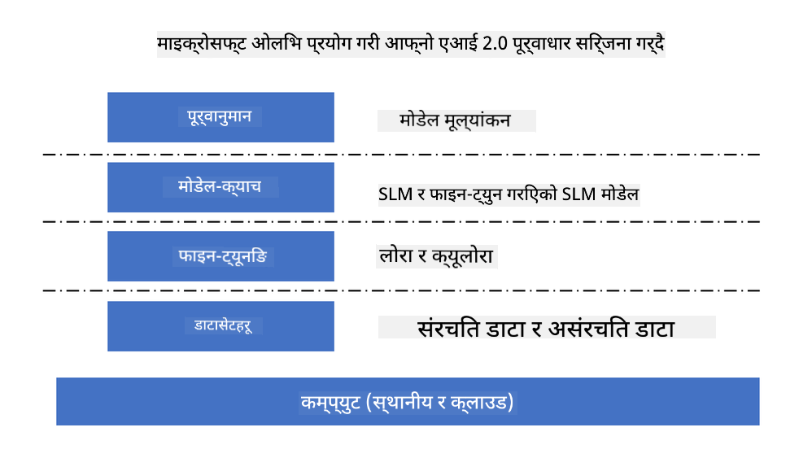
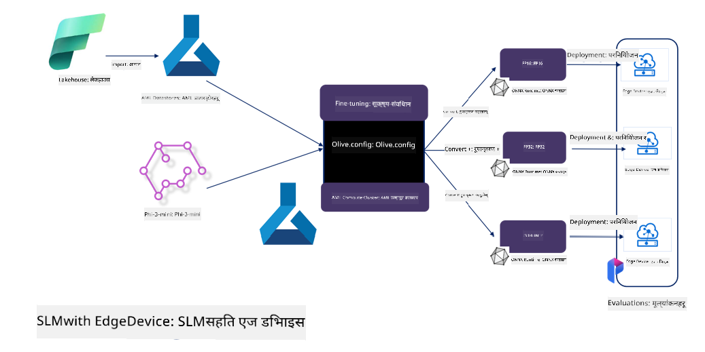

<!--
CO_OP_TRANSLATOR_METADATA:
{
  "original_hash": "5764be88ad2eb4f341e742eb8f14fab1",
  "translation_date": "2025-05-09T20:49:36+00:00",
  "source_file": "md/03.FineTuning/FineTuning_MicrosoftOlive.md",
  "language_code": "ne"
}
-->
# **Microsoft Olive सँग Phi-3 को फाइन-ट्यूनिङ**

[Olive](https://github.com/microsoft/OLive?WT.mc_id=aiml-138114-kinfeylo) एक सजिलो प्रयोग गर्ने हार्डवेयर-अवेयर मोडेल अप्टिमाइजेसन उपकरण हो जसले मोडेल कम्प्रेसन, अप्टिमाइजेसन, र कम्पाइलेसनका उद्योग-प्रमुख प्रविधिहरूलाई एकसाथ ल्याउँछ।

यो मेसिन लर्निङ मोडेलहरूलाई विशेष हार्डवेयर आर्किटेक्चरहरूको सबैभन्दा प्रभावकारी उपयोग गर्न सुनिश्चित गर्दै अप्टिमाइज गर्ने प्रक्रिया सरल बनाउन डिजाइन गरिएको हो।

तपाईं क्लाउड-आधारित अनुप्रयोगहरूमा काम गरिरहनुभएको होस् वा एज उपकरणहरूमा, Olive ले तपाईंलाई सजिलै र प्रभावकारी रूपमा मोडेलहरू अप्टिमाइज गर्न सक्षम बनाउँछ।

## मुख्य विशेषताहरू:
- Olive ले चाहिने हार्डवेयर लक्षितका लागि अप्टिमाइजेसन प्रविधिहरूलाई एकत्रित र स्वचालित गर्छ।
- कुनै एकल अप्टिमाइजेसन प्रविधि सबै परिदृश्यमा उपयुक्त हुँदैन, त्यसैले Olive ले उद्योग विशेषज्ञहरूलाई आफ्ना नवप्रवर्तनहरू जोड्न अनुमति दिँदै विस्तारयोग्य बनाउँछ।

## इन्जिनियरिङ प्रयास घटाउनुहोस्:
- विकासकर्ताहरूले प्रायः प्रशिक्षित मोडेलहरू तैनाथ गर्न र अप्टिमाइज गर्न विभिन्न हार्डवेयर विक्रेता-विशिष्ट टुलचेनहरू सिक्न र प्रयोग गर्नुपर्छ।
- Olive ले चाहिने हार्डवेयरका लागि अप्टिमाइजेसन प्रविधिहरूलाई स्वचालित गरेर यो अनुभवलाई सरल बनाउँछ।

## प्रयोग गर्न तयार E2E अप्टिमाइजेसन समाधान:

समेकित प्रविधिहरूलाई संयोजन र ट्यून गरेर, Olive ले अन्त्यदेखि अन्त्यसम्मको अप्टिमाइजेसनका लागि एकीकृत समाधान प्रदान गर्छ।
यसले मोडेलहरू अप्टिमाइज गर्दा सटीकता र विलम्बजस्ता सीमाहरूलाई ध्यानमा राख्छ।

## Microsoft Olive प्रयोग गरी फाइन-ट्यूनिङ

Microsoft Olive एक धेरै सजिलो प्रयोग हुने खुला स्रोत मोडेल अप्टिमाइजेसन उपकरण हो जसले जेनेरेटिभ आर्टिफिसियल इन्टेलिजेन्स क्षेत्रमा फाइन-ट्यूनिङ र रेफरेन्स दुवै समेट्न सक्छ। यसले केवल सरल कन्फिगरेसन आवश्यक पर्छ, खुला स्रोत साना भाषा मोडेलहरू र सम्बन्धित रनटाइम वातावरणहरू (AzureML / स्थानीय GPU, CPU, DirectML) सँग मिलाएर, तपाईंले स्वचालित अप्टिमाइजेसन मार्फत मोडेलको फाइन-ट्यूनिङ वा रेफरेन्स पूरा गर्न सक्नुहुन्छ र क्लाउड वा एज उपकरणहरूमा तैनाथ गर्नका लागि सबैभन्दा राम्रो मोडेल फेला पार्न सक्नुहुन्छ। यसले उद्यमहरूलाई आफ्नो उद्योग विशिष्ट मोडेलहरू स्थानीय र क्लाउडमा निर्माण गर्न अनुमति दिन्छ।



## Microsoft Olive सँग Phi-3 फाइन ट्यूनिङ



## Phi-3 Olive नमुना कोड र उदाहरण
यस उदाहरणमा तपाईंले Olive प्रयोग गरेर:

- LoRA एडाप्टरलाई Sad, Joy, Fear, Surprise जस्ता भावहरू वर्गीकरण गर्न फाइन-ट्यून गर्नुहुनेछ।
- एडाप्टरको तौलहरूलाई बेस मोडेलमा मर्ज गर्नुहोस्।
- मोडेललाई int4 मा अप्टिमाइज र क्वान्टाइज गर्नुहोस्।

[Sample Code](../../code/03.Finetuning/olive-ort-example/README.md)

### Microsoft Olive सेटअप

Microsoft Olive स्थापना धेरै सरल छ, र CPU, GPU, DirectML, र Azure ML का लागि पनि स्थापना गर्न सकिन्छ।

```bash
pip install olive-ai
```

यदि तपाईं ONNX मोडेल CPU मा चलाउन चाहनुहुन्छ भने, तपाईंले प्रयोग गर्न सक्नुहुन्छ

```bash
pip install olive-ai[cpu]
```

यदि तपाईं GPU मा ONNX मोडेल चलाउन चाहनुहुन्छ भने, तपाईंले प्रयोग गर्न सक्नुहुन्छ

```python
pip install olive-ai[gpu]
```

यदि तपाईं Azure ML प्रयोग गर्न चाहनुहुन्छ भने, प्रयोग गर्नुहोस्

```python
pip install git+https://github.com/microsoft/Olive#egg=olive-ai[azureml]
```

**सूचना**
ओएस आवश्यकताः Ubuntu 20.04 / 22.04 

### **Microsoft Olive को Config.json**

स्थापना पछि, तपाईं Config फाइलमार्फत मोडेल-विशिष्ट विभिन्न सेटिङहरू जस्तै डाटा, कम्प्युटिङ, प्रशिक्षण, तैनाथीकरण, र मोडेल जेनेरेसन कन्फिगर गर्न सक्नुहुन्छ।

**1. डाटा**

Microsoft Olive मा, स्थानीय र क्लाउड डाटामा प्रशिक्षण समर्थन गरिन्छ र यसलाई सेटिङहरूमा कन्फिगर गर्न सकिन्छ।

*स्थानीय डाटा सेटिङहरू*

तपाईं सजिलै फाइन-ट्यूनिङका लागि आवश्यक डाटा सेट सेट अप गर्न सक्नुहुन्छ, प्रायः json ढाँचामा, र डाटा टेम्प्लेटसँग मिलाउन सक्नुहुन्छ। यो मोडेलको आवश्यकताअनुसार समायोजन गर्नुपर्छ (जस्तै Microsoft Phi-3-mini द्वारा आवश्यक ढाँचामा मिलाउन। यदि तपाईंसँग अन्य मोडेलहरू छन् भने, कृपया ती मोडेलहरूको आवश्यक फाइन-ट्यूनिङ ढाँचाहरू हेर्नुहोस्)

```json

    "data_configs": [
        {
            "name": "dataset_default_train",
            "type": "HuggingfaceContainer",
            "load_dataset_config": {
                "params": {
                    "data_name": "json", 
                    "data_files":"dataset/dataset-classification.json",
                    "split": "train"
                }
            },
            "pre_process_data_config": {
                "params": {
                    "dataset_type": "corpus",
                    "text_cols": [
                            "phrase",
                            "tone"
                    ],
                    "text_template": "### Text: {phrase}\n### The tone is:\n{tone}",
                    "corpus_strategy": "join",
                    "source_max_len": 2048,
                    "pad_to_max_len": false,
                    "use_attention_mask": false
                }
            }
        }
    ],
```

**क्लाउड डाटा स्रोत सेटिङहरू**

Azure AI Studio/Azure Machine Learning Service को datastore लिंक गरेर क्लाउडमा रहेको डाटा ल्याउन सकिन्छ। Microsoft Fabric र Azure Data मार्फत Azure AI Studio/Azure Machine Learning Service मा विभिन्न डाटा स्रोतहरू इम्पोर्ट गर्न सकिन्छ जुन फाइन-ट्यूनिङ डाटाका लागि समर्थन हो।

```json

    "data_configs": [
        {
            "name": "dataset_default_train",
            "type": "HuggingfaceContainer",
            "load_dataset_config": {
                "params": {
                    "data_name": "json", 
                    "data_files": {
                        "type": "azureml_datastore",
                        "config": {
                            "azureml_client": {
                                "subscription_id": "Your Azure Subscrition ID",
                                "resource_group": "Your Azure Resource Group",
                                "workspace_name": "Your Azure ML Workspaces name"
                            },
                            "datastore_name": "workspaceblobstore",
                            "relative_path": "Your train_data.json Azure ML Location"
                        }
                    },
                    "split": "train"
                }
            },
            "pre_process_data_config": {
                "params": {
                    "dataset_type": "corpus",
                    "text_cols": [
                            "Question",
                            "Best Answer"
                    ],
                    "text_template": "<|user|>\n{Question}<|end|>\n<|assistant|>\n{Best Answer}\n<|end|>",
                    "corpus_strategy": "join",
                    "source_max_len": 2048,
                    "pad_to_max_len": false,
                    "use_attention_mask": false
                }
            }
        }
    ],
    
```

**2. कम्प्युटिङ कन्फिगरेसन**

यदि तपाईं स्थानीय हुन चाहनुहुन्छ भने, स्थानीय डाटा स्रोतहरू प्रयोग गर्न सक्नुहुन्छ। Azure AI Studio / Azure Machine Learning Service का स्रोतहरू प्रयोग गर्न आवश्यक परे, Azure सम्बन्धित प्यारामिटरहरू, कम्प्युटिङ पावर नाम आदि कन्फिगर गर्नुपर्छ।

```json

    "systems": {
        "aml": {
            "type": "AzureML",
            "config": {
                "accelerators": ["gpu"],
                "hf_token": true,
                "aml_compute": "Your Azure AI Studio / Azure Machine Learning Service Compute Name",
                "aml_docker_config": {
                    "base_image": "Your Azure AI Studio / Azure Machine Learning Service docker",
                    "conda_file_path": "conda.yaml"
                }
            }
        },
        "azure_arc": {
            "type": "AzureML",
            "config": {
                "accelerators": ["gpu"],
                "aml_compute": "Your Azure AI Studio / Azure Machine Learning Service Compute Name",
                "aml_docker_config": {
                    "base_image": "Your Azure AI Studio / Azure Machine Learning Service docker",
                    "conda_file_path": "conda.yaml"
                }
            }
        }
    },
```

***सूचना***

Azure AI Studio/Azure Machine Learning Service मा कन्टेनर मार्फत चलाइने भएकाले आवश्यक वातावरण कन्फिगर गर्नुपर्छ। यो conda.yaml वातावरणमा कन्फिगर गरिन्छ।

```yaml

name: project_environment
channels:
  - defaults
dependencies:
  - python=3.8.13
  - pip=22.3.1
  - pip:
      - einops
      - accelerate
      - azure-keyvault-secrets
      - azure-identity
      - bitsandbytes
      - datasets
      - huggingface_hub
      - peft
      - scipy
      - sentencepiece
      - torch>=2.2.0
      - transformers
      - git+https://github.com/microsoft/Olive@jiapli/mlflow_loading_fix#egg=olive-ai[gpu]
      - --extra-index-url https://aiinfra.pkgs.visualstudio.com/PublicPackages/_packaging/ORT-Nightly/pypi/simple/ 
      - ort-nightly-gpu==1.18.0.dev20240307004
      - --extra-index-url https://aiinfra.pkgs.visualstudio.com/PublicPackages/_packaging/onnxruntime-genai/pypi/simple/
      - onnxruntime-genai-cuda

    

```

**3. आफ्नो SLM छनौट गर्नुहोस्**

तपाईं Hugging face बाट मोडेल सिधै प्रयोग गर्न सक्नुहुन्छ, वा Azure AI Studio / Azure Machine Learning को Model Catalog सँग जोडेर मोडेल चयन गर्न सक्नुहुन्छ। तलको कोड उदाहरणमा Microsoft Phi-3-mini प्रयोग गरिएको छ।

यदि तपाईंसँग मोडेल स्थानीय छ भने, यो तरिका प्रयोग गर्न सक्नुहुन्छ

```json

    "input_model":{
        "type": "PyTorchModel",
        "config": {
            "hf_config": {
                "model_name": "model-cache/microsoft/phi-3-mini",
                "task": "text-generation",
                "model_loading_args": {
                    "trust_remote_code": true
                }
            }
        }
    },
```

यदि Azure AI Studio / Azure Machine Learning Service बाट मोडेल प्रयोग गर्न चाहनुहुन्छ भने, यो तरिका प्रयोग गर्न सक्नुहुन्छ

```json

    "input_model":{
        "type": "PyTorchModel",
        "config": {
            "model_path": {
                "type": "azureml_registry_model",
                "config": {
                    "name": "microsoft/Phi-3-mini-4k-instruct",
                    "registry_name": "azureml-msr",
                    "version": "11"
                }
            },
             "model_file_format": "PyTorch.MLflow",
             "hf_config": {
                "model_name": "microsoft/Phi-3-mini-4k-instruct",
                "task": "text-generation",
                "from_pretrained_args": {
                    "trust_remote_code": true
                }
            }
        }
    },
```

**सूचना:**
हामीलाई Azure AI Studio / Azure Machine Learning Service सँग एकीकृत हुन आवश्यक छ, त्यसैले मोडेल सेट गर्दा संस्करण नम्बर र सम्बन्धित नामहरू ध्यान दिनुहोस्।

Azure का सबै मोडेलहरू PyTorch.MLflow मा सेट हुनुपर्छ।

तपाईंले Hugging face खाता हुनुपर्छ र Azure AI Studio / Azure Machine Learning को Key मानमा त्यो कुञ्जी बाँध्नुपर्छ।

**4. एल्गोरिथ्म**

Microsoft Olive ले Lora र QLora फाइन-ट्यूनिङ एल्गोरिथ्महरू राम्ररी प्याकेज गरेको छ। तपाईंले केही सम्बन्धित प्यारामिटरहरू मात्र कन्फिगर गर्नुपर्ने हुन्छ। यहाँ म QLora लाई उदाहरण स्वरूप लिन्छु।

```json
        "lora": {
            "type": "LoRA",
            "config": {
                "target_modules": [
                    "o_proj",
                    "qkv_proj"
                ],
                "double_quant": true,
                "lora_r": 64,
                "lora_alpha": 64,
                "lora_dropout": 0.1,
                "train_data_config": "dataset_default_train",
                "eval_dataset_size": 0.3,
                "training_args": {
                    "seed": 0,
                    "data_seed": 42,
                    "per_device_train_batch_size": 1,
                    "per_device_eval_batch_size": 1,
                    "gradient_accumulation_steps": 4,
                    "gradient_checkpointing": false,
                    "learning_rate": 0.0001,
                    "num_train_epochs": 3,
                    "max_steps": 10,
                    "logging_steps": 10,
                    "evaluation_strategy": "steps",
                    "eval_steps": 187,
                    "group_by_length": true,
                    "adam_beta2": 0.999,
                    "max_grad_norm": 0.3
                }
            }
        },
```

यदि तपाईं क्वान्टाइजेसन परिवर्तन चाहनुहुन्छ भने, Microsoft Olive मुख्य शाखाले onnxruntime-genai विधि समर्थन गर्छ। तपाईं आफ्नो आवश्यकताअनुसार यसलाई सेट गर्न सक्नुहुन्छ:

1. एडाप्टर तौलहरूलाई बेस मोडेलमा मर्ज गर्नुहोस्
2. ModelBuilder द्वारा आवश्यक प्रेसिजनसहित मोडेललाई onnx मोडेलमा रूपान्तरण गर्नुहोस्

जस्तै क्वान्टाइज्ड INT4 मा रूपान्तरण

```json

        "merge_adapter_weights": {
            "type": "MergeAdapterWeights"
        },
        "builder": {
            "type": "ModelBuilder",
            "config": {
                "precision": "int4"
            }
        }
```

**सूचना** 
- यदि तपाईं QLoRA प्रयोग गर्नुहुन्छ भने, ONNXRuntime-genai को क्वान्टाइजेसन रूपान्तरण हाल समर्थित छैन।

- यहाँ भन्नुपर्छ कि माथिका कदमहरू तपाईंका आवश्यकताअनुसार सेट गर्न सकिन्छ। यी सबै चरणहरू पूर्ण रूपमा कन्फिगर गर्नु आवश्यक छैन। तपाईं आफ्नो आवश्यकताअनुसार एल्गोरिथ्मका चरणहरू मात्र प्रयोग गरेर फाइन-ट्यूनिङ नगरीकनै अन्तिममा सम्बन्धित इन्जिनहरू कन्फिगर गर्न सक्नुहुन्छ।

```json

    "engine": {
        "log_severity_level": 0,
        "host": "aml",
        "target": "aml",
        "search_strategy": false,
        "execution_providers": ["CUDAExecutionProvider"],
        "cache_dir": "../model-cache/models/phi3-finetuned/cache",
        "output_dir" : "../model-cache/models/phi3-finetuned"
    }
```

**5. फाइन-ट्यूनिङ सम्पन्न**

कमाण्ड लाइनमा, olive-config.json रहेको डाइरेक्टरीमा चलाउनुहोस्

```bash
olive run --config olive-config.json  
```

**अस्वीकरण**:  
यो दस्तावेज़ AI अनुवाद सेवा [Co-op Translator](https://github.com/Azure/co-op-translator) को प्रयोग गरी अनुवाद गरिएको हो। हामी शुद्धताका लागि प्रयासरत छौं, तर कृपया ध्यान दिनुहोस् कि स्वचालित अनुवादमा त्रुटिहरू वा असङ्गतिहरू हुनसक्छन्। मूल दस्तावेज़लाई यसको मूल भाषामा अधिकारिक स्रोत मान्नुपर्छ। महत्वपूर्ण जानकारीका लागि व्यावसायिक मानव अनुवाद सिफारिस गरिन्छ। यस अनुवादको प्रयोगबाट उत्पन्न कुनै पनि गलतफहमी वा गलत व्याख्याहरूको लागि हामी जिम्मेवार छैनौं।