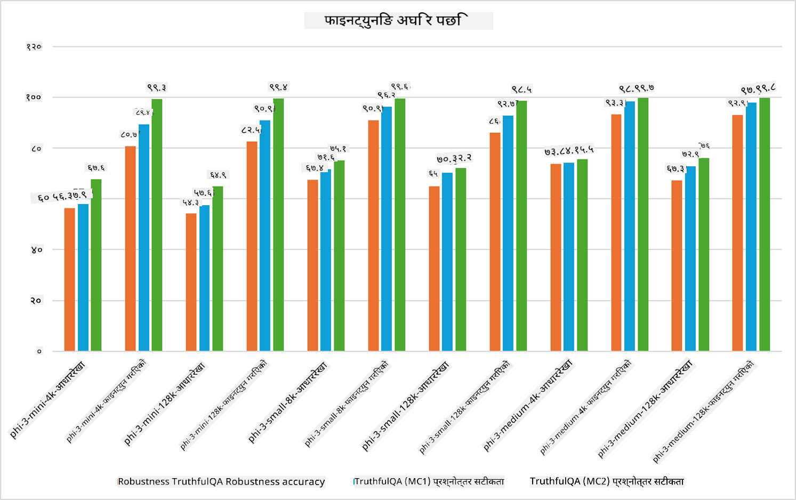

<!--
CO_OP_TRANSLATOR_METADATA:
{
  "original_hash": "cb5648935f63edc17e95ce38f23adc32",
  "translation_date": "2025-07-17T08:25:23+00:00",
  "source_file": "md/03.FineTuning/FineTuning_Scenarios.md",
  "language_code": "ne"
}
-->
## फाइन ट्यूनिङ परिदृश्यहरू

**प्लेटफर्म** यसमा Azure AI Foundry, Azure Machine Learning, AI Tools, Kaito, र ONNX Runtime जस्ता विभिन्न प्रविधिहरू समावेश छन्।

**पूर्वाधार** यसमा CPU र FPGA समावेश छन्, जुन फाइन ट्यूनिङ प्रक्रियाका लागि आवश्यक हुन्छन्। म तपाईंलाई यी प्रविधिहरूका आइकनहरू देखाउँछु।

**उपकरण र फ्रेमवर्क** यसमा ONNX Runtime र ONNX Runtime समावेश छन्। म तपाईंलाई यी प्रविधिहरूका आइकनहरू देखाउँछु।
[ONNX Runtime र ONNX Runtime का आइकनहरू राख्नुहोस्]

Microsoft प्रविधिहरूको साथ फाइन ट्यूनिङ प्रक्रियामा विभिन्न कम्पोनेन्ट र उपकरणहरू समावेश हुन्छन्। यी प्रविधिहरूलाई बुझेर र प्रयोग गरेर, हामी हाम्रो अनुप्रयोगहरूलाई प्रभावकारी रूपमा फाइन ट्यून गर्न सक्छौं र राम्रो समाधानहरू सिर्जना गर्न सक्छौं।

## मोडेल सेवा रूपमा

होस्ट गरिएको फाइन ट्यूनिङ प्रयोग गरेर मोडेललाई फाइन ट्यून गर्नुहोस्, कम्प्युट सिर्जना र व्यवस्थापन गर्न आवश्यक बिना।

Phi-3-mini र Phi-3-medium मोडेलहरूको लागि सर्भरलेस फाइन ट्यूनिङ उपलब्ध छ, जसले विकासकर्ताहरूलाई क्लाउड र एज परिदृश्यहरूका लागि मोडेलहरू छिटो र सजिलै अनुकूलन गर्न सक्षम बनाउँछ, कम्प्युटको व्यवस्था नगरी। हामीले घोषणा गरेका छौं कि Phi-3-small अब Models-as-a-Service मार्फत उपलब्ध छ, जसले विकासकर्ताहरूलाई आधारभूत पूर्वाधार व्यवस्थापन नगरी AI विकास छिटो र सजिलै सुरु गर्न मद्दत गर्दछ।

## प्लेटफर्म रूपमा मोडेल

प्रयोगकर्ताहरूले आफ्नै कम्प्युट व्यवस्थापन गरेर आफ्नो मोडेलहरू फाइन ट्यून गर्छन्।

[Fine Tuning Sample](https://github.com/Azure/azureml-examples/blob/main/sdk/python/foundation-models/system/finetune/chat-completion/chat-completion.ipynb)

## फाइन ट्यूनिङ परिदृश्यहरू

| | | | | | | |
|-|-|-|-|-|-|-|
|परिदृश्य|LoRA|QLoRA|PEFT|DeepSpeed|ZeRO|DORA|
|पूर्व-प्रशिक्षित LLMs लाई विशेष कार्य वा डोमेनमा अनुकूलन गर्ने|हो|हो|हो|हो|हो|हो|
|टेक्स्ट वर्गीकरण, नामित इकाई पहिचान, र मेशिन अनुवाद जस्ता NLP कार्यहरूको लागि फाइन ट्यूनिङ|हो|हो|हो|हो|हो|हो|
|QA कार्यहरूको लागि फाइन ट्यूनिङ|हो|हो|हो|हो|हो|हो|
|च्याटबोटहरूमा मानव-जस्तो प्रतिक्रिया उत्पन्न गर्न फाइन ट्यूनिङ|हो|हो|हो|हो|हो|हो|
|संगीत, कला, वा अन्य सिर्जनात्मक रूपहरू उत्पन्न गर्न फाइन ट्यूनिङ|हो|हो|हो|हो|हो|हो|
|गणनात्मक र आर्थिक लागत घटाउने|हो|हो|होइन|हो|हो|होइन|
|मेमोरी प्रयोग घटाउने|होइन|हो|होइन|हो|हो|हो|
|कम प्यारामिटर प्रयोग गरेर प्रभावकारी फाइन ट्यूनिङ|होइन|हो|हो|होइन|होइन|हो|
|डेटा समानान्तरताको मेमोरी-प्रभावकारी रूप जसले सबै GPU उपकरणहरूको समग्र GPU मेमोरीमा पहुँच दिन्छ|होइन|होइन|होइन|हो|हो|हो|

## फाइन ट्यूनिङ प्रदर्शन उदाहरणहरू

**अस्वीकरण**:  
यो दस्तावेज AI अनुवाद सेवा [Co-op Translator](https://github.com/Azure/co-op-translator) प्रयोग गरी अनुवाद गरिएको हो। हामी शुद्धताका लागि प्रयासरत छौं, तर कृपया ध्यान दिनुहोस् कि स्वचालित अनुवादमा त्रुटि वा अशुद्धता हुन सक्छ। मूल दस्तावेज यसको मूल भाषामा नै अधिकारिक स्रोत मानिनुपर्छ। महत्वपूर्ण जानकारीका लागि व्यावसायिक मानव अनुवाद सिफारिस गरिन्छ। यस अनुवादको प्रयोगबाट उत्पन्न कुनै पनि गलतफहमी वा गलत व्याख्याका लागि हामी जिम्मेवार छैनौं।