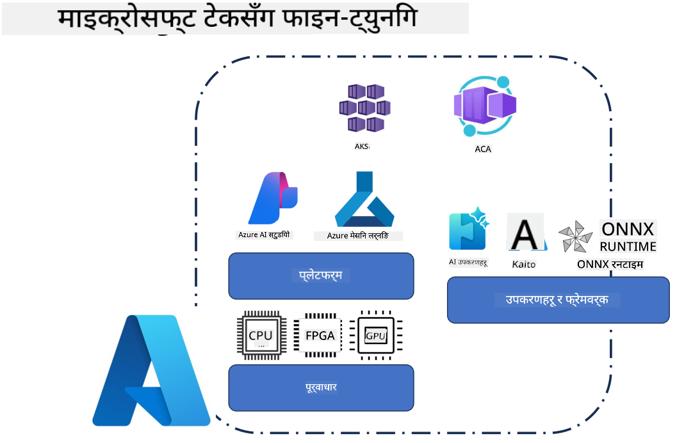
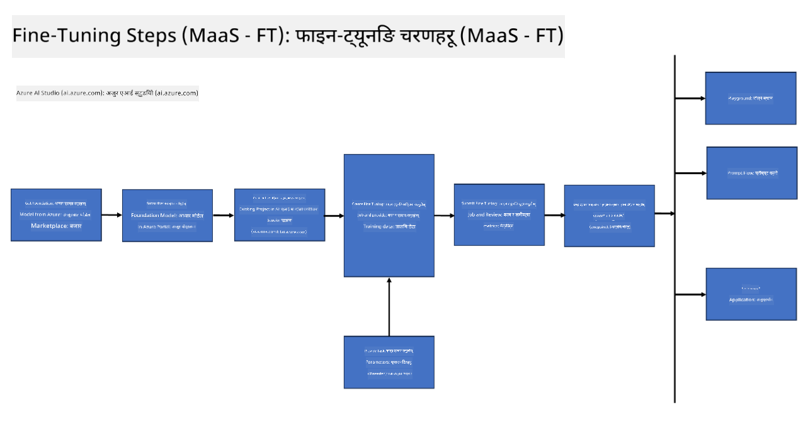
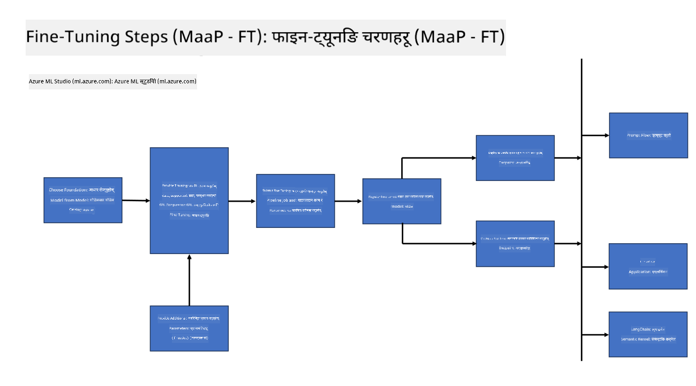
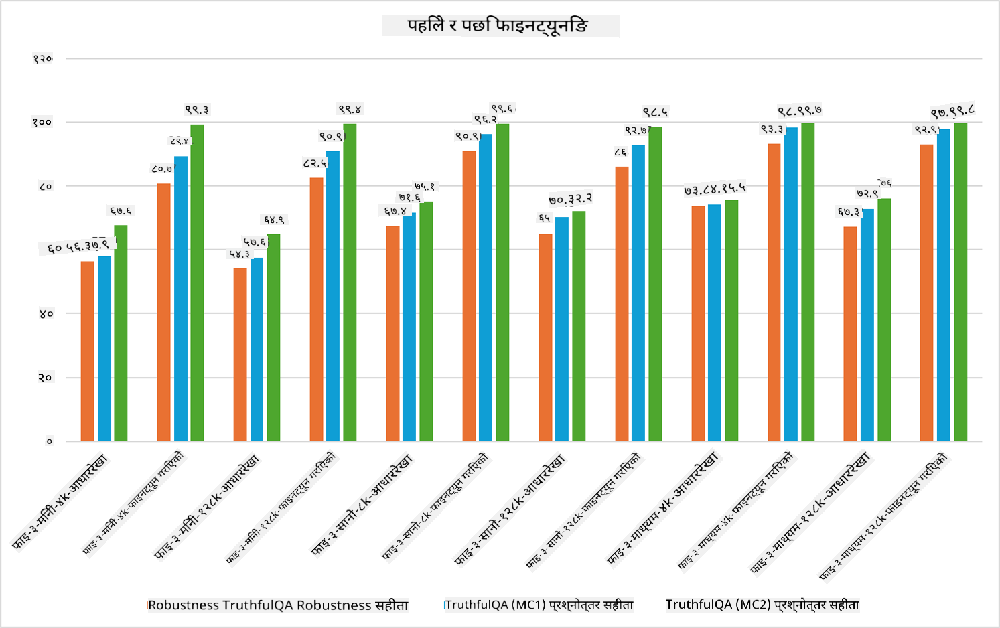

<!--
CO_OP_TRANSLATOR_METADATA:
{
  "original_hash": "cb5648935f63edc17e95ce38f23adc32",
  "translation_date": "2025-05-09T21:54:24+00:00",
  "source_file": "md/03.FineTuning/FineTuning_Scenarios.md",
  "language_code": "ne"
}
-->
## Fine Tuning Scenarios

**Platform** यसमा Azure AI Foundry, Azure Machine Learning, AI Tools, Kaito, र ONNX Runtime जस्ता विभिन्न प्रविधिहरू समावेश छन्।

**Infrastructure** यसमा CPU र FPGA समावेश छन्, जुन fine-tuning प्रक्रियाको लागि अत्यावश्यक हुन्छन्। म तपाईंलाई यी प्रविधिहरूका आइकनहरू देखाउन चाहन्छु।

**Tools & Framework** यसमा ONNX Runtime समावेश छ। म तपाईंलाई यी प्रविधिहरूका आइकनहरू देखाउन चाहन्छु।  
[Insert icons for ONNX Runtime and ONNX Runtime]

Microsoft प्रविधिहरूसँग fine-tuning प्रक्रिया विभिन्न कम्पोनेन्ट र उपकरणहरू समावेश गर्दछ। यी प्रविधिहरूलाई बुझेर र प्रयोग गरेर हामी हाम्रो एप्लिकेसनहरूलाई प्रभावकारी रूपमा fine-tune गरी राम्रो समाधानहरू सिर्जना गर्न सक्छौं।

## Model as Service

होस्ट गरिएको fine-tuning प्रयोग गरेर मोडेललाई fine-tune गर्नुहोस्, compute सिर्जना र व्यवस्थापन गर्न आवश्यक छैन।

Serverless fine-tuning Phi-3-mini र Phi-3-medium मोडेलहरूको लागि उपलब्ध छ, जसले विकासकर्ताहरूलाई छिटो र सजिलै क्लाउड र edge परिदृश्यहरूको लागि मोडेलहरू अनुकूलन गर्न अनुमति दिन्छ, compute को व्यवस्था नगरी। हामीले पनि घोषणा गरेका छौं कि Phi-3-small अब Models-as-a-Service प्रस्ताव मार्फत उपलब्ध छ, जसले विकासकर्ताहरूलाई आधारभूत पूर्वाधार व्यवस्थापन नगरी छिटो र सजिलै AI विकास सुरु गर्न सक्षम बनाउँछ।

## Model as a Platform

प्रयोगकर्ताहरूले आफ्नै compute व्यवस्थापन गरेर आफ्नो मोडेलहरू fine-tune गर्छन्।

[Fine Tuning Sample](https://github.com/Azure/azureml-examples/blob/main/sdk/python/foundation-models/system/finetune/chat-completion/chat-completion.ipynb)

## Fine Tuning Scenarios

| | | | | | | |
|-|-|-|-|-|-|-|
|Scenario|LoRA|QLoRA|PEFT|DeepSpeed|ZeRO|DORA|
|पूर्व-प्रशिक्षित LLMs लाई विशेष कार्य वा डोमेनहरूमा अनुकूलन गर्ने|Yes|Yes|Yes|Yes|Yes|Yes|
|NLP कार्यहरू जस्तै पाठ वर्गीकरण, नामित इकाई पहिचान, र मेसिन अनुवादको लागि fine-tuning|Yes|Yes|Yes|Yes|Yes|Yes|
|QA कार्यहरूको लागि fine-tuning|Yes|Yes|Yes|Yes|Yes|Yes|
|च्याटबोटमा मानवजस्तै प्रतिक्रिया उत्पन्न गर्न fine-tuning|Yes|Yes|Yes|Yes|Yes|Yes|
|संगीत, कला वा अन्य सिर्जनात्मक कार्यहरूका लागि fine-tuning|Yes|Yes|Yes|Yes|Yes|Yes|
|गणनात्मक र वित्तीय लागत घटाउने|Yes|Yes|No|Yes|Yes|No|
|मेमोरी प्रयोग घटाउने|No|Yes|No|Yes|Yes|Yes|
|कम पैरामीटर प्रयोग गरेर कुशल fine-tuning गर्ने|No|Yes|Yes|No|No|Yes|
|डेटा समानान्तरता को मेमोरी-कुशल रूप जसले सबै GPU उपकरणहरूको समग्र GPU मेमोरीमा पहुँच दिन्छ|No|No|No|Yes|Yes|Yes|

## Fine Tuning Performance Examples

**अस्वीकरण**:  
यो दस्तावेज AI अनुवाद सेवा [Co-op Translator](https://github.com/Azure/co-op-translator) प्रयोग गरी अनुवाद गरिएको हो। हामी शुद्धताको लागि प्रयास गर्छौं, तर कृपया ध्यान दिनुहोस् कि स्वचालित अनुवादमा त्रुटिहरू वा असत्यताहरू हुन सक्छन्। मूल दस्तावेज यसको मूल भाषामा आधिकारिक स्रोत मानिनु पर्छ। महत्वपूर्ण जानकारीका लागि व्यावसायिक मानव अनुवाद सिफारिस गरिन्छ। यस अनुवादको प्रयोगबाट उत्पन्न कुनै पनि गलतफहमी वा गलत व्याख्याका लागि हामी जिम्मेवार छैनौं।