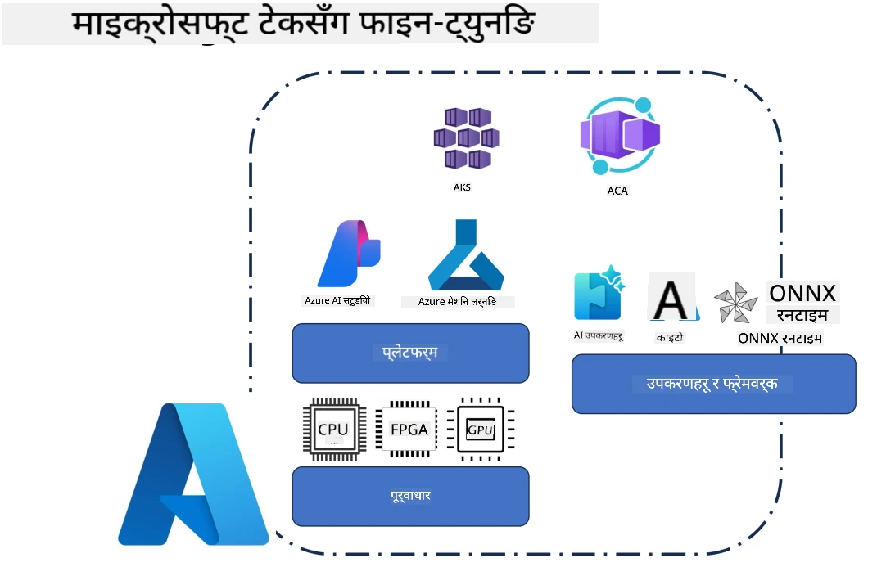
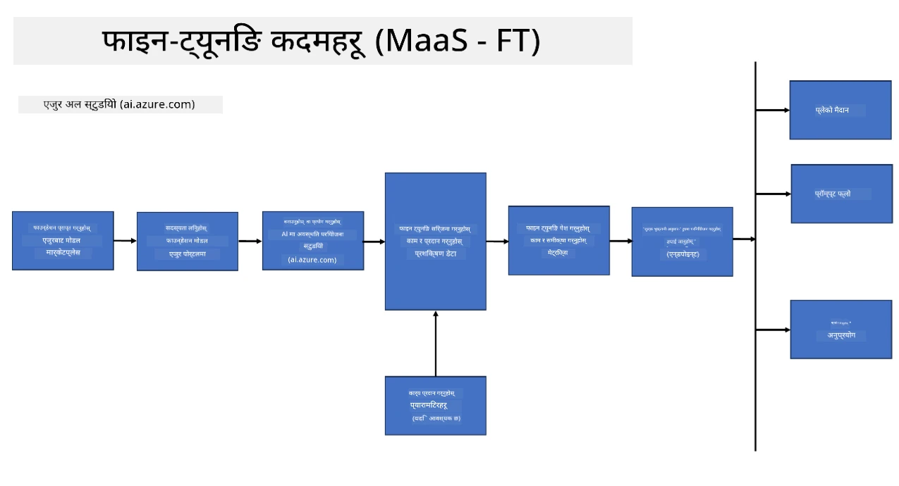
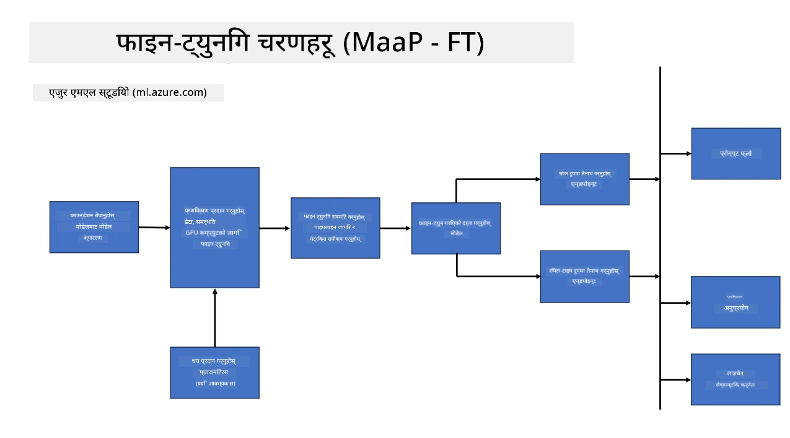
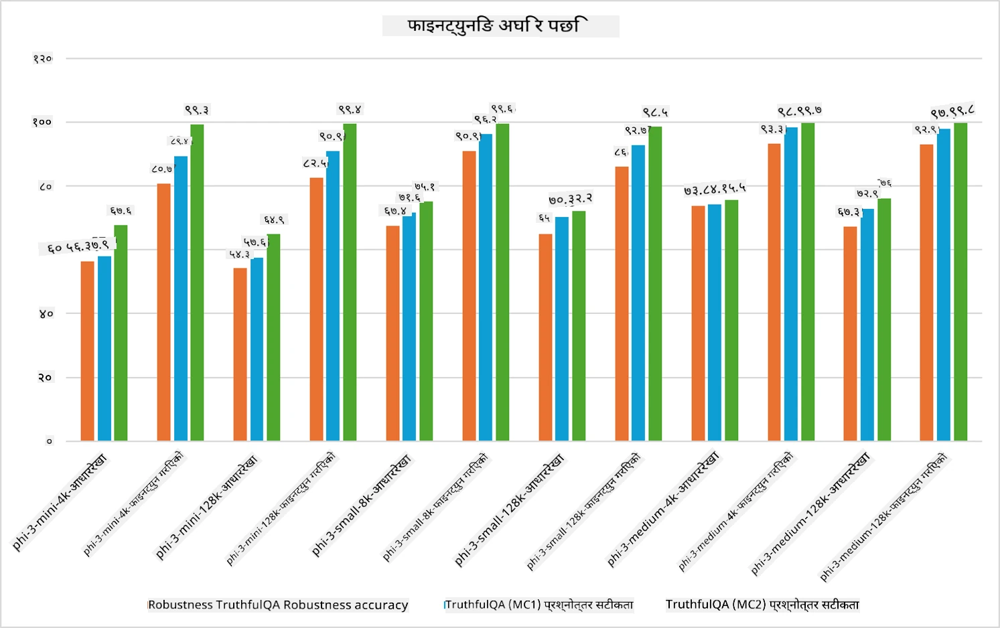

## फाइन ट्युनिंग परिदृश्यहरू

यस खण्डले Microsoft Foundry र Azure वातावरणहरूमा फाइन-ट्युनिंग परिदृश्यहरूको अवलोकन प्रदान गर्छ, जसमा डिप्लॉयमेन्ट मोडेलहरू, पूर्वाधार तहहरू, र सामान्य रूपमा प्रयोग गरिने अनुकूलन प्रविधिहरू समावेश छन्।

**प्ल्याटफर्म**  
यसमा Microsoft Foundry (पूर्वमा Azure AI Foundry) र Azure Machine Learning जस्ता व्यवस्थापन सेवाहरू समावेश छन्, जसले मोडेल व्यवस्थापन, सञ्चालन, प्रयोग प्रयोग ट्र्याकिङ, र डिप्लॉयमेन्ट कार्यप्रवाहहरू प्रदान गर्छ।

**पूर्वाधार**  
फाइन-ट्युनिंगका लागि स्केलेबल कम्प्युट स्रोतहरू आवश्यक हुन्छन्। Azure वातावरणहरूमा यसले प्रायः GPU-आधारित भर्चुअल मेसिनहरू र हल्का कार्यभारहरूको लागि CPU स्रोतहरू समावेश गर्दछ, साथै डाटासेट र चेकपोइन्टहरूको लागि स्केलेबल भण्डारण।

**उपकरण र फ्रेमवर्क**  
फाइन-ट्युनिंग कार्यप्रवाहहरूले सामान्यतया Hugging Face Transformers, DeepSpeed, र PEFT (Parameter-Efficient Fine-Tuning) जस्ता फ्रेमवर्क र अनुकूलन पुस्तकालयहरूमा निर्भर गर्दछ।

Microsoft प्रविधिहरूको साथ फाइन-ट्युनिंग प्रक्रिया प्लेटफर्म सेवाहरू, कम्प्युट पूर्वाधार, र प्रशिक्षण फ्रेमवर्कहरूमा फैलिएको छ। यी कम्पोनेन्टहरू कसरी मिलेर काम गर्छन् भन्ने बुझेर, विकासकर्ताहरूले आधारभूत मोडेलहरूलाई विशेष कार्यहरू र उत्पादन परिदृश्यहरूमा कुशलतापूर्वक अनुकूलित गर्न सक्छन्।

## मोडेल as Service

होस्ट गरिएको फाइन-ट्युनिंग प्रयोग गरेर मोडेललाई फाइन-ट्युन गर्नुहोस्, कम्प्युट सिर्जना र व्यवस्थापन गर्ने आवश्यक बिना।

Phi-3, Phi-3.5, र Phi-4 मोडेल परिवारहरूको लागि अब सर्भरलेस फाइन-ट्युनिंग उपलब्ध छ, जसले विकासकर्ताहरूलाई कम्प्युटको व्यवस्था नगरी क्लाउड र एज परिदृश्यहरूका लागि मोडेलहरू छिटो र सजिलै अनुकूलित गर्न सक्षम बनाउँछ।

## मोडेल as a Platform

प्रयोगकर्ताहरूले आफ्नै कम्प्युट व्यवस्थापन गरी आफ्नो मोडेल फाइन-ट्युन गर्दछन्।

[Fine Tuning Sample](https://github.com/Azure/azureml-examples/blob/main/sdk/python/foundation-models/system/finetune/chat-completion/chat-completion.ipynb)

## फाइन-ट्युनिंग प्रविधिहरूको तुलना

|परिदृश्य|LoRA|QLoRA|PEFT|DeepSpeed|ZeRO|DoRA|
|---|---|---|---|---|---|---|
|पूर्व-प्रशिक्षित LLMहरूलाई विशेष कार्य वा डोमेनमा अनुकूलन गर्न|हो|हो|हो|हो|हो|हो|
|पाठ वर्गीकरण, नामित इकाई मान्यता, र मेशिन अनुवाद जस्ता NLP कार्यहरूको लागि फाइन-ट्युनिंग|हो|हो|हो|हो|हो|हो|
|QA कार्यहरूको लागि फाइन-ट्युनिंग|हो|हो|हो|हो|हो|हो|
|च्याटबोटहरूमा मानव-जस्तो प्रतिक्रिया उत्पन्न गर्नको लागि फाइन-ट्युनिंग|हो|हो|हो|हो|हो|हो|
|संगीत, कला, वा अन्य सिर्जनात्मक रूपहरू उत्पादन गर्नको लागि फाइन-ट्युनिंग|हो|हो|हो|हो|हो|हो|
|गणनात्मक र वित्तीय लागतहरू घटाउन|हो|हो|हो|हो|हो|हो|
|मेमोरीको उपयोग कम गर्न|हो|हो|हो|हो|हो|हो|
|कुशल फाइन-ट्युनिंगको लागि कम प्यारामीटर प्रयोग गर्ने|हो|हो|हो|होइन|होइन|हो|
|गुणस्तरीय GPU मेमोरी पहुँच दिने मेमोरी-कुशल डेटा समानान्तरता|होइन|होइन|होइन|हो|हो|होइन|

> [!NOTE]
> LoRA, QLoRA, PEFT, र DoRA प्यारामीटर-कुशल फाइन-ट्युनिंग विधिहरू हुन् भने DeepSpeed र ZeRO वितरण प्रशिक्षण र मेमोरी अनुकूलनमा केन्द्रित छन्।

## फाइन ट्युनिंग प्रदर्शन उदाहरणहरू

---

<!-- CO-OP TRANSLATOR DISCLAIMER START -->
**अस्वीकरण**:  
यो कागजात AI अनुवाद सेवा [Co-op Translator](https://github.com/Azure/co-op-translator) को प्रयोग गरी अनुवाद गरिएको हो। हामी यथासम्भव शुद्धताको प्रयास गर्छौं तापनि, कृपया ध्यान दिनुहोस् कि स्वचालित अनुवादमा त्रुटि वा अशुद्धता हुन सक्छ। मूल कागजातलाई यसको मूल भाषा नै आधिकारिक स्रोत मानिनु पर्छ। महत्वपूर्ण जानकारीको लागि व्यावसायिक मानव अनुवाद सिफारिस गरिन्छ। यस अनुवादको प्रयोगबाट हुने कुनै पनि गलतफहमी वा गलत व्याख्याका लागि हामी जिम्मेवार छैनौं।
<!-- CO-OP TRANSLATOR DISCLAIMER END -->