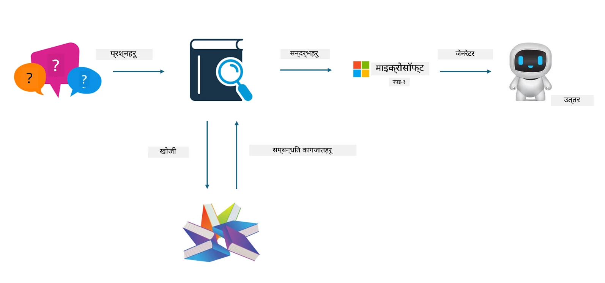

<!--
CO_OP_TRANSLATOR_METADATA:
{
  "original_hash": "e4e010400c2918557b36bb932a14004c",
  "translation_date": "2025-07-17T09:28:18+00:00",
  "source_file": "md/03.FineTuning/FineTuning_vs_RAG.md",
  "language_code": "ne"
}
-->
## Finetuning vs RAG

## Retrieval Augmented Generation

RAG भनेको डाटा पुनःप्राप्ति + पाठ सिर्जना हो। उद्यमको संरचित र असंरचित डाटा भेक्टर डेटाबेसमा भण्डारण गरिन्छ। सम्बन्धित सामग्री खोज्दा, सम्बन्धित सारांश र सामग्री पत्ता लगाएर सन्दर्भ तयार गरिन्छ, र LLM/SLM को पाठ पूर्ति क्षमता मिलाएर सामग्री सिर्जना गरिन्छ।

## RAG प्रक्रिया

## Fine-tuning
Fine-tuning भनेको कुनै विशेष मोडेलको सुधारमा आधारित हुन्छ। यसका लागि मोडेल एल्गोरिदमबाट सुरु गर्न आवश्यक पर्दैन, तर डाटा निरन्तर सङ्कलन गर्नुपर्छ। यदि तपाईँ उद्योगका अनुप्रयोगहरूमा बढी सटीक शब्दावली र भाषा अभिव्यक्ति चाहनुहुन्छ भने, fine-tuning तपाईँको राम्रो विकल्प हो। तर यदि तपाईँको डाटा बारम्बार परिवर्तन हुन्छ भने, fine-tuning जटिल हुन सक्छ।

## कसरी छनोट गर्ने
यदि हाम्रो उत्तरमा बाह्य डाटाको परिचय आवश्यक छ भने, RAG सबैभन्दा राम्रो विकल्प हो।

यदि तपाईँलाई स्थिर र सटीक उद्योग ज्ञान आवश्यक छ भने, fine-tuning राम्रो विकल्प हुनेछ। RAG सम्बन्धित सामग्री तान्न प्राथमिकता दिन्छ तर सधैं विशेषज्ञता भएका सूक्ष्मताहरू समात्न सक्दैन।

Fine-tuning को लागि उच्च गुणस्तरको डाटा सेट चाहिन्छ, र यदि डाटा सानो क्षेत्रमै सीमित छ भने धेरै फरक पर्दैन। RAG बढी लचिलो हुन्छ।  
Fine-tuning एउटा कालो बाकस जस्तो हुन्छ, एक प्रकारको रहस्यवाद हो, र यसको आन्तरिक प्रक्रिया बुझ्न गाह्रो हुन्छ। तर RAG ले डाटाको स्रोत सजिलै पत्ता लगाउन मद्दत गर्छ, जसले भ्रम वा सामग्री त्रुटिहरूलाई प्रभावकारी रूपमा समायोजन गर्न र राम्रो पारदर्शिता प्रदान गर्न सक्छ।

**अस्वीकरण**:  
यो दस्तावेज AI अनुवाद सेवा [Co-op Translator](https://github.com/Azure/co-op-translator) प्रयोग गरी अनुवाद गरिएको हो। हामी शुद्धताका लागि प्रयासरत छौं, तर कृपया ध्यान दिनुहोस् कि स्वचालित अनुवादमा त्रुटि वा अशुद्धता हुन सक्छ। मूल दस्तावेज यसको मूल भाषामा आधिकारिक स्रोत मानिनुपर्छ। महत्वपूर्ण जानकारीका लागि व्यावसायिक मानव अनुवाद सिफारिस गरिन्छ। यस अनुवादको प्रयोगबाट उत्पन्न कुनै पनि गलतफहमी वा गलत व्याख्याका लागि हामी जिम्मेवार छैनौं।