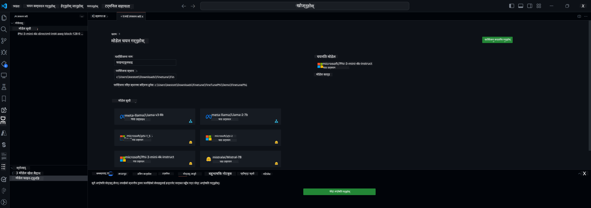

<!--
CO_OP_TRANSLATOR_METADATA:
{
  "original_hash": "c2bc0950f44919ac75a88c1a871680c2",
  "translation_date": "2025-07-17T09:08:11+00:00",
  "source_file": "md/03.FineTuning/Finetuning_VSCodeaitoolkit.md",
  "language_code": "ne"
}
-->
## VS Code का लागि AI Toolkit मा स्वागत छ

[AI Toolkit for VS Code](https://github.com/microsoft/vscode-ai-toolkit/tree/main) ले Azure AI Studio Catalog र Hugging Face जस्ता अन्य क्याटलगहरूबाट विभिन्न मोडेलहरूलाई एकै ठाउँमा ल्याउँछ। यो टूलकिटले जेनेरेटिभ AI उपकरण र मोडेलहरू प्रयोग गरेर AI एपहरू विकास गर्ने सामान्य कार्यहरूलाई सजिलो बनाउँछ:
- मोडेल पत्ता लगाउने र प्लेग्राउन्डबाट सुरु गर्नुहोस्।
- स्थानीय कम्प्युटिङ स्रोतहरू प्रयोग गरेर मोडेल फाइन-ट्यूनिङ र इन्फरेन्स।
- Azure स्रोतहरू प्रयोग गरेर रिमोट फाइन-ट्यूनिङ र इन्फरेन्स।

[VSCode का लागि AI Toolkit इन्स्टल गर्नुहोस्](https://marketplace.visualstudio.com/items?itemName=ms-windows-ai-studio.windows-ai-studio)



**[Private Preview]** Azure Container Apps मा एक क्लिकमा प्रोभिजनिङ गरेर क्लाउडमा मोडेल फाइन-ट्यूनिङ र इन्फरेन्स चलाउन सकिन्छ।

अब तपाईंको AI एप विकासमा लागौं:

- [VS Code का लागि AI Toolkit मा स्वागत छ](../../../../md/03.FineTuning)
- [स्थानीय विकास](../../../../md/03.FineTuning)
  - [तयारीहरू](../../../../md/03.FineTuning)
  - [Conda सक्रिय गर्नुहोस्](../../../../md/03.FineTuning)
  - [केवल बेस मोडेल फाइन-ट्यूनिङ](../../../../md/03.FineTuning)
  - [मोडेल फाइन-ट्यूनिङ र इन्फरेन्स](../../../../md/03.FineTuning)
  - [मोडेल फाइन-ट्यूनिङ](../../../../md/03.FineTuning)
  - [Microsoft Olive](../../../../md/03.FineTuning)
  - [फाइन ट्यूनिङ नमूना र स्रोतहरू](../../../../md/03.FineTuning)
- [**\[Private Preview\]** रिमोट विकास](../../../../md/03.FineTuning)
  - [पूर्व आवश्यकताहरू](../../../../md/03.FineTuning)
  - [रिमोट विकास परियोजना सेटअप](../../../../md/03.FineTuning)
  - [Azure स्रोतहरू प्रोभिजन गर्नुहोस्](../../../../md/03.FineTuning)
  - [\[वैकल्पिक\] Azure Container App Secret मा Huggingface टोकन थप्नुहोस्](../../../../md/03.FineTuning)
  - [फाइन-ट्यूनिङ चलाउनुहोस्](../../../../md/03.FineTuning)
  - [इन्फरेन्स एन्डपोइन्ट प्रोभिजन गर्नुहोस्](../../../../md/03.FineTuning)
  - [इन्फरेन्स एन्डपोइन्ट डिप्लोय गर्नुहोस्](../../../../md/03.FineTuning)
  - [उन्नत प्रयोग](../../../../md/03.FineTuning)

## स्थानीय विकास
### तयारीहरू

1. होस्टमा NVIDIA ड्राइभर इन्स्टल गरिएको छ भनी सुनिश्चित गर्नुहोस्।
2. यदि तपाईं HF प्रयोग गरेर डेटासेट उपयोग गर्दै हुनुहुन्छ भने `huggingface-cli login` चलाउनुहोस्।
3. `Olive` की सेटिङहरू मेमोरी प्रयोगमा हुने कुनै पनि परिवर्तनहरूको लागि व्याख्या गरिएको छ।

### Conda सक्रिय गर्नुहोस्
हामी WSL वातावरण प्रयोग गर्दैछौं र यो साझा छ, त्यसैले तपाईंले म्यानुअली Conda वातावरण सक्रिय गर्नुपर्छ। यस चरणपछि तपाईं फाइन-ट्यूनिङ वा इन्फरेन्स चलाउन सक्नुहुन्छ।

```bash
conda activate [conda-env-name] 
```

### केवल बेस मोडेल फाइन-ट्यूनिङ
फाइन-ट्यूनिङ नगरी बेस मोडेल मात्र प्रयास गर्न, Conda सक्रिय गरेपछि यो कमाण्ड चलाउनुहोस्।

```bash
cd inference

# Web browser interface allows to adjust a few parameters like max new token length, temperature and so on.
# User has to manually open the link (e.g. http://0.0.0.0:7860) in a browser after gradio initiates the connections.
python gradio_chat.py --baseonly
```

### मोडेल फाइन-ट्यूनिङ र इन्फरेन्स

एक पटक Dev Container मा कार्यक्षेत्र खोलिएपछि, टर्मिनल खोल्नुहोस् (डिफल्ट पथ प्रोजेक्ट रुट हुन्छ), र तलको कमाण्ड चलाएर चयन गरिएको डेटासेटमा LLM फाइन-ट्यून गर्नुहोस्।

```bash
python finetuning/invoke_olive.py 
```

चेकप्वाइन्टहरू र अन्तिम मोडेल `models` फोल्डरमा सुरक्षित गरिनेछ।

पछाडि फाइन-ट्यून गरिएको मोडेलसँग `console`, `web browser` वा `prompt flow` मार्फत इन्फरेन्स चलाउनुहोस्।

```bash
cd inference

# Console interface.
python console_chat.py

# Web browser interface allows to adjust a few parameters like max new token length, temperature and so on.
# User has to manually open the link (e.g. http://127.0.0.1:7860) in a browser after gradio initiates the connections.
python gradio_chat.py
```

VS Code मा `prompt flow` प्रयोग गर्न, कृपया यो [Quick Start](https://microsoft.github.io/promptflow/how-to-guides/quick-start.html) हेर्नुहोस्।

### मोडेल फाइन-ट्यूनिङ

अब, तपाईंको उपकरणमा GPU उपलब्धताअनुसार तलको मोडेल डाउनलोड गर्नुहोस्।

QLoRA प्रयोग गरेर स्थानीय फाइन-ट्यूनिङ सत्र सुरु गर्न, हाम्रो क्याटलगबाट फाइन-ट्यून गर्न चाहेको मोडेल चयन गर्नुहोस्।
| प्लेटफर्म(हरू) | GPU उपलब्ध | मोडेल नाम | साइज (GB) |
|---------|---------|--------|--------|
| Windows | छ | Phi-3-mini-4k-**directml**-int4-awq-block-128-onnx | 2.13GB |
| Linux | छ | Phi-3-mini-4k-**cuda**-int4-onnx | 2.30GB |
| Windows<br>Linux | छैन | Phi-3-mini-4k-**cpu**-int4-rtn-block-32-acc-level-4-onnx | 2.72GB |

**_नोट_** मोडेलहरू डाउनलोड गर्न Azure खाता आवश्यक छैन।

Phi3-mini (int4) मोडेल करिब 2GB-3GB साइजको हुन्छ। तपाईंको नेटवर्क स्पीड अनुसार डाउनलोड गर्न केही मिनेट लाग्न सक्छ।

पहिले प्रोजेक्ट नाम र स्थान चयन गर्नुहोस्।
पछाडि मोडेल क्याटलगबाट मोडेल चयन गर्नुहोस्। तपाईंलाई प्रोजेक्ट टेम्प्लेट डाउनलोड गर्न भनिनेछ। त्यसपछि "Configure Project" क्लिक गरेर विभिन्न सेटिङहरू समायोजन गर्न सक्नुहुन्छ।

### Microsoft Olive

हामी [Olive](https://microsoft.github.io/Olive/why-olive.html) प्रयोग गरेर हाम्रो क्याटलगबाट PyTorch मोडेलमा QLoRA फाइन-ट्यूनिङ चलाउँछौं। सबै सेटिङहरू पूर्वनिर्धारित मानहरूसँग सेट गरिएको हुन्छ ताकि मेमोरीको प्रभावकारी प्रयोग गर्दै स्थानीय रूपमा फाइन-ट्यूनिङ प्रक्रिया चलाउन सकियोस्, तर तपाईंको आवश्यकताअनुसार यसलाई समायोजन गर्न सकिन्छ।

### फाइन ट्यूनिङ नमूना र स्रोतहरू

- [फाइन ट्यूनिङ सुरु गर्ने गाइड](https://learn.microsoft.com/windows/ai/toolkit/toolkit-fine-tune)
- [HuggingFace Dataset सँग फाइन ट्यूनिङ](https://github.com/microsoft/vscode-ai-toolkit/blob/main/archive/walkthrough-hf-dataset.md)
- [साधारण Dataset सँग फाइन ट्यूनिङ](https://github.com/microsoft/vscode-ai-toolkit/blob/main/archive/walkthrough-simple-dataset.md)

## **[Private Preview]** रिमोट विकास

### पूर्व आवश्यकताहरू

1. तपाईंको रिमोट Azure Container App वातावरणमा मोडेल फाइन-ट्यूनिङ चलाउन, तपाईंको सब्स्क्रिप्शनमा पर्याप्त GPU क्षमता छ भनी सुनिश्चित गर्नुहोस्। तपाईंको एप्लिकेसनको लागि आवश्यक क्षमता अनुरोध गर्न [सपोर्ट टिकट](https://azure.microsoft.com/support/create-ticket/) पेश गर्नुहोस्। [GPU क्षमताको थप जानकारी](https://learn.microsoft.com/azure/container-apps/workload-profiles-overview) प्राप्त गर्नुहोस्।
2. यदि तपाईं HuggingFace मा निजी डेटासेट प्रयोग गर्दै हुनुहुन्छ भने, तपाईंको [HuggingFace खाता](https://huggingface.co/?WT.mc_id=aiml-137032-kinfeylo) छ भनी सुनिश्चित गर्नुहोस् र [एक्सेस टोकन उत्पन्न गर्नुहोस्](https://huggingface.co/docs/hub/security-tokens?WT.mc_id=aiml-137032-kinfeylo)।
3. AI Toolkit for VS Code मा Remote Fine-tuning र Inference सुविधा फ्ल्याग सक्षम गर्नुहोस्:
   1. VS Code सेटिङहरू खोल्न *File -> Preferences -> Settings* चयन गर्नुहोस्।
   2. *Extensions* मा जानुहोस् र *AI Toolkit* चयन गर्नुहोस्।
   3. *"Enable Remote Fine-tuning And Inference"* विकल्प चयन गर्नुहोस्।
   4. प्रभावकारी बनाउन VS Code पुनः लोड गर्नुहोस्।

- [रिमोट फाइन ट्यूनिङ](https://github.com/microsoft/vscode-ai-toolkit/blob/main/archive/remote-finetuning.md)

### रिमोट विकास परियोजना सेटअप
1. कमाण्ड प्यालेटमा `AI Toolkit: Focus on Resource View` चलाउनुहोस्।
2. *Model Fine-tuning* मा जानुहोस् र मोडेल क्याटलग पहुँच गर्नुहोस्। तपाईंको प्रोजेक्टको नाम र स्थान चयन गर्नुहोस्। त्यसपछि *"Configure Project"* बटन थिच्नुहोस्।
3. प्रोजेक्ट कन्फिगरेसन
    1. *"Fine-tune locally"* विकल्प सक्षम नगर्नुहोस्।
    2. Olive कन्फिगरेसन सेटिङहरू पूर्वनिर्धारित मानहरूसँग देखिनेछन्। आवश्यक अनुसार यी सेटिङहरू समायोजन र भर्नुहोस्।
    3. *Generate Project* मा जानुहोस्। यो चरण WSL प्रयोग गरेर नयाँ Conda वातावरण सेटअप गर्ने र भविष्यमा Dev Containers अपडेटहरूको तयारी गर्ने हो।
4. *"Relaunch Window In Workspace"* क्लिक गरेर तपाईंको रिमोट विकास परियोजना खोल्नुहोस्।

> **नोट:** यो प्रोजेक्ट हाल AI Toolkit for VS Code भित्र मात्र स्थानीय वा रिमोट दुबै तरिकाले काम गर्छ। यदि तपाईं प्रोजेक्ट सिर्जना गर्दा *"Fine-tune locally"* चयन गर्नुहुन्छ भने, यो केवल WSL मा मात्र चल्नेछ र रिमोट विकास सक्षम हुँदैन। यदि तपाईंले *"Fine-tune locally"* सक्षम गर्नु भएन भने, प्रोजेक्ट Azure Container App को रिमोट वातावरणमा मात्र सीमित हुनेछ।

### Azure स्रोतहरू प्रोभिजन गर्नुहोस्
सुरु गर्न, रिमोट फाइन-ट्यूनिङका लागि Azure स्रोत प्रोभिजन गर्नुहोस्। कमाण्ड प्यालेटबाट `AI Toolkit: Provision Azure Container Apps job for fine-tuning` चलाउनुहोस्।

आउटपुट च्यानलमा देखिएको लिंकबाट प्रोभिजन प्रगतिको अनुगमन गर्नुहोस्।

### [वैकल्पिक] Azure Container App Secret मा Huggingface टोकन थप्नुहोस्
यदि तपाईं निजी HuggingFace डेटासेट प्रयोग गर्दै हुनुहुन्छ भने, HuggingFace टोकनलाई वातावरण चरको रूपमा सेट गर्नुहोस् ताकि Hugging Face Hub मा म्यानुअल लगइन आवश्यक नपरोस्।
यसका लागि `AI Toolkit: Add Azure Container Apps Job secret for fine-tuning` कमाण्ड प्रयोग गर्न सक्नुहुन्छ। यस कमाण्डमा, गोप्य नाम [`HF_TOKEN`](https://huggingface.co/docs/huggingface_hub/package_reference/environment_variables#hftoken) राखेर तपाईंको Hugging Face टोकनलाई गोप्य मानको रूपमा सेट गर्नुहोस्।

### फाइन-ट्यूनिङ चलाउनुहोस्
रिमोट फाइन-ट्यूनिङ काम सुरु गर्न `AI Toolkit: Run fine-tuning` कमाण्ड चलाउनुहोस्।

सिस्टम र कन्सोल लगहरू हेर्न, आउटपुट प्यानलमा रहेको लिंकबाट Azure पोर्टलमा जान सक्नुहुन्छ ([View and Query Logs on Azure](https://aka.ms/ai-toolkit/remote-provision#view-and-query-logs-on-azure))। वा, VSCode आउटपुट प्यानलमा `AI Toolkit: Show the running fine-tuning job streaming logs` कमाण्ड चलाएर कन्सोल लगहरू सिधै हेर्न सक्नुहुन्छ।
> **नोट:** स्रोतहरू अपर्याप्त हुँदा काम कतारमा पर्न सक्छ। लग नदेखिएमा `AI Toolkit: Show the running fine-tuning job streaming logs` कमाण्ड चलाउनुहोस्, केही समय पर्खनुहोस् र फेरि कमाण्ड चलाएर स्ट्रिमिङ लगमा पुनः जडान गर्नुहोस्।

यस प्रक्रियामा QLoRA फाइन-ट्यूनिङका लागि प्रयोग हुनेछ र मोडेल इन्फरेन्सका लागि LoRA एडाप्टरहरू सिर्जना गरिनेछ।
फाइन-ट्यूनिङको नतिजा Azure Files मा सुरक्षित गरिनेछ।

### इन्फरेन्स एन्डपोइन्ट प्रोभिजन गर्नुहोस्
रिमोट वातावरणमा एडाप्टरहरू तालिम भएपछि, मोडेलसँग अन्तरक्रिया गर्न सरल Gradio एप्लिकेसन प्रयोग गर्नुहोस्।
फाइन-ट्यूनिङ जस्तै, रिमोट इन्फरेन्सका लागि Azure स्रोतहरू सेटअप गर्न कमाण्ड प्यालेटबाट `AI Toolkit: Provision Azure Container Apps for inference` चलाउनुहोस्।

डिफल्ट रूपमा, इन्फरेन्सको लागि सब्स्क्रिप्शन र स्रोत समूह फाइन-ट्यूनिङमा प्रयोग गरिएको जस्तै हुनुपर्छ। इन्फरेन्सले Azure Container App Environment प्रयोग गर्नेछ र फाइन-ट्यूनिङ चरणमा Azure Files मा सुरक्षित गरिएको मोडेल र मोडेल एडाप्टर पहुँच गर्नेछ।

### इन्फरेन्स एन्डपोइन्ट डिप्लोय गर्नुहोस्
यदि तपाईं इन्फरेन्स कोड संशोधन गर्न वा इन्फरेन्स मोडेल पुनः लोड गर्न चाहनुहुन्छ भने, `AI Toolkit: Deploy for inference` कमाण्ड चलाउनुहोस्। यसले तपाईंको पछिल्लो कोड Azure Container App सँग समक्रमण गर्नेछ र रेप्लिका पुनः सुरु गर्नेछ।

डिप्लोयमेन्ट सफल भएपछि, VSCode सूचनामा देखिने "*Go to Inference Endpoint*" बटनमा क्लिक गरेर इन्फरेन्स API पहुँच गर्न सक्नुहुन्छ। वा, वेब API एन्डपोइन्ट `ACA_APP_ENDPOINT` मा `./infra/inference.config.json` र आउटपुट प्यानलमा फेला पार्न सकिन्छ। अब तपाईं यो एन्डपोइन्ट प्रयोग गरेर मोडेल मूल्याङ्कन गर्न तयार हुनुहुन्छ।

### उन्नत प्रयोग
AI Toolkit सँग रिमोट विकास सम्बन्धी थप जानकारीका लागि [Fine-Tuning models remotely](https://aka.ms/ai-toolkit/remote-provision) र [Inferencing with the fine-tuned model](https://aka.ms/ai-toolkit/remote-inference) कागजातहरू हेर्नुहोस्।

**अस्वीकरण**:  
यो दस्तावेज AI अनुवाद सेवा [Co-op Translator](https://github.com/Azure/co-op-translator) प्रयोग गरी अनुवाद गरिएको हो। हामी शुद्धताका लागि प्रयासरत छौं, तर कृपया ध्यान दिनुहोस् कि स्वचालित अनुवादमा त्रुटि वा अशुद्धता हुनसक्छ। मूल दस्तावेज यसको मूल भाषामा नै अधिकारिक स्रोत मानिनुपर्छ। महत्वपूर्ण जानकारीका लागि व्यावसायिक मानव अनुवाद सिफारिस गरिन्छ। यस अनुवादको प्रयोगबाट उत्पन्न कुनै पनि गलतफहमी वा गलत व्याख्याका लागि हामी जिम्मेवार छैनौं।