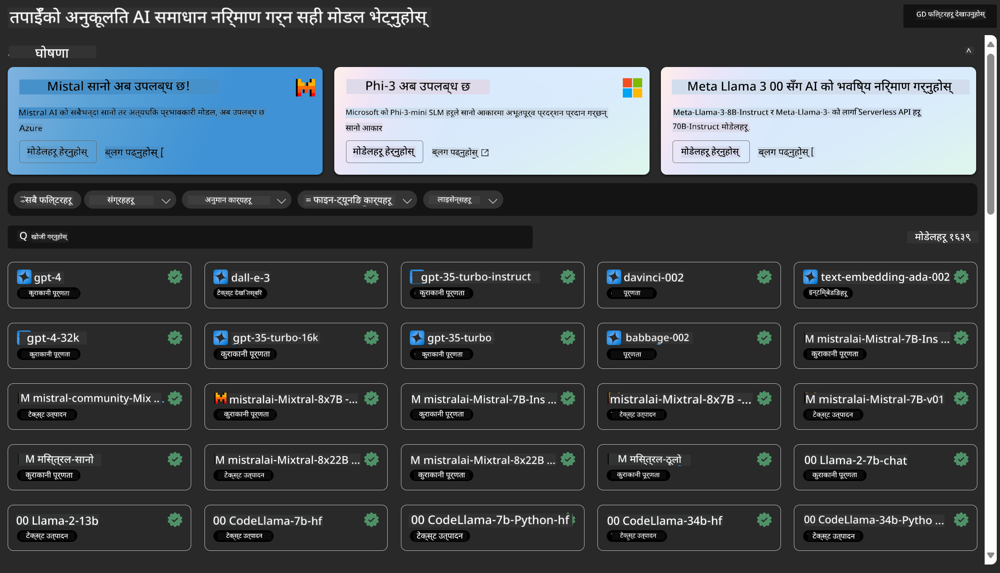
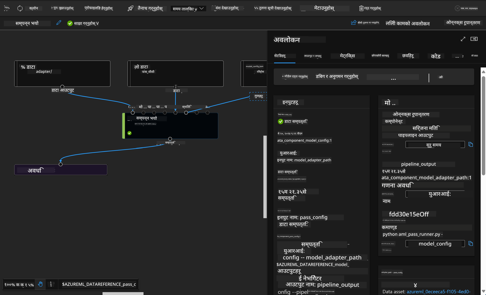

<!--
CO_OP_TRANSLATOR_METADATA:
{
  "original_hash": "7fe541373802e33568e94e13226d463c",
  "translation_date": "2025-05-09T22:18:25+00:00",
  "source_file": "md/03.FineTuning/Introduce_AzureML.md",
  "language_code": "ne"
}
-->
# **Azure Machine Learning सेवा परिचय**

[Azure Machine Learning](https://ml.azure.com?WT.mc_id=aiml-138114-kinfeylo) एक क्लाउड सेवा हो जसले मेशिन लर्निङ (ML) परियोजना जीवनचक्रलाई तीव्र र व्यवस्थापन गर्न मद्दत गर्छ।

ML पेशेवरहरू, डेटा वैज्ञानिकहरू, र इन्जिनियरहरूले दैनिक कार्यमा यसलाई प्रयोग गर्न सक्छन्:

- मोडेलहरू प्रशिक्षण र डिप्लोय गर्नुहोस्।
मेशिन लर्निङ अपरेसनहरू (MLOps) व्यवस्थापन गर्नुहोस्।
- तपाईं Azure Machine Learning मा मोडेल सिर्जना गर्न सक्नुहुन्छ वा PyTorch, TensorFlow, वा scikit-learn जस्ता खुला स्रोत प्लेटफर्मबाट बनेको मोडेल प्रयोग गर्न सक्नुहुन्छ।
- MLOps उपकरणहरूले तपाईंलाई मोडेलहरू अनुगमन, पुन: प्रशिक्षण, र पुन: डिप्लोय गर्न मद्दत गर्छन्।

## Azure Machine Learning को लागि को हो?

**डेटा वैज्ञानिक र ML इन्जिनियरहरू**

उनीहरूले आफ्ना दैनिक कार्यहरू छिटो र स्वचालित बनाउन उपकरणहरू प्रयोग गर्न सक्छन्।
Azure ML ले निष्पक्षता, व्याख्यात्मकता, ट्र्याकिङ, र अडिटेबिलिटीका सुविधाहरू प्रदान गर्छ।

**एप्लिकेशन विकासकर्ता:**

उनीहरूले मोडेलहरूलाई एप्लिकेशन वा सेवाहरूमा सहजै समावेश गर्न सक्छन्।

**प्लेटफर्म विकासकर्ता**

उनीहरूलाई Azure Resource Manager API हरूले समर्थित बलियो उपकरणहरूको पहुँच छ।
यी उपकरणहरूले उन्नत ML उपकरण निर्माण गर्न अनुमति दिन्छ।

**उद्यमहरू**

Microsoft Azure क्लाउडमा काम गर्दा, उद्यमहरूले परिचित सुरक्षा र भूमिका-आधारित पहुँच नियन्त्रणबाट लाभ उठाउँछन्।
संरक्षित डेटा र विशिष्ट अपरेसनहरूको पहुँच नियन्त्रण गर्न परियोजना सेटअप गर्न सकिन्छ।

## टोलीका सबैका लागि उत्पादकता
ML परियोजनाहरू प्रायः विभिन्न कौशल सेट भएको टोली आवश्यक पर्छ जसले निर्माण र मर्मत सम्भार गर्छ।

Azure ML ले तपाईंलाई यी उपकरणहरू उपलब्ध गराउँछ:
- साझा नोटबुक, कम्प्युट संसाधनहरू, सर्भरलेस कम्प्युट, डेटा, र वातावरण मार्फत टोलीसँग सहकार्य गर्नुहोस्।
- निष्पक्षता, व्याख्यात्मकता, ट्र्याकिङ, र अडिटेबिलिटीका साथ मोडेलहरू विकास गर्नुहोस् जसले लाइनज र अडिट अनुपालन आवश्यकताहरू पूरा गर्छ।
- ML मोडेलहरू छिटो र सजिलै ठूलो स्तरमा डिप्लोय गर्नुहोस्, र MLOps द्वारा तिनीहरूलाई प्रभावकारी रूपमा व्यवस्थापन र शासन गर्नुहोस्।
- निर्मित शासन, सुरक्षा, र अनुपालनका साथ कहीं पनि मेशिन लर्निङ कार्यभार सञ्चालन गर्नुहोस्।

## क्रस-कम्प्याटिबल प्लेटफर्म उपकरणहरू

ML टोलीका कुनै पनि सदस्यले आफ्नो मनपर्ने उपकरणहरू प्रयोग गरेर काम गर्न सक्छन्।
चाँडो प्रयोगहरू सञ्चालन गर्नुहोस्, हाइपरप्यारामिटर ट्युनिङ, पाइपलाइन निर्माण, वा अनुमान व्यवस्थापन गर्दै हुनुहुन्छ भने, तपाईं परिचित इन्टरफेसहरू प्रयोग गर्न सक्नुहुन्छ जसमा समावेश छन्:
- Azure Machine Learning Studio
- Python SDK (v2)
- Azure CLI (v2)
- Azure Resource Manager REST APIs

तपाईं मोडेलहरू परिमार्जन गर्दा र विकास चक्रभरि सहकार्य गर्दा, Azure Machine Learning स्टुडियो UI भित्र सम्पत्ति, स्रोतहरू, र मेट्रिक्स साझा र खोज्न सक्नुहुन्छ।

## **Azure ML मा LLM/SLM**

Azure ML ले धेरै LLM/SLM सम्बन्धित कार्यहरू थपेको छ, LLMOps र SLMOps लाई मिलाएर एक उद्यम-व्यापी जनरेटिभ कृत्रिम बुद्धिमत्ता प्रविधि प्लेटफर्म सिर्जना गरेको छ।

### **मोडेल क्याटलग**

उद्यम प्रयोगकर्ताहरूले मोडेल क्याटलग मार्फत विभिन्न व्यापारिक परिदृश्यहरू अनुसार फरक मोडेलहरू डिप्लोय गर्न सक्छन्, र मोडेललाई सेवा रूपमा प्रदान गर्न सक्छन् जसले उद्यम विकासकर्ता वा प्रयोगकर्ताहरूलाई पहुँच दिन्छ।

Azure Machine Learning स्टुडियोमा मोडेल क्याटलग जनरेटिभ AI एप्लिकेशनहरू निर्माण गर्न सहयोग गर्ने धेरै मोडेलहरू पत्ता लगाउन र प्रयोग गर्न केन्द्र हो। मोडेल क्याटलगमा Azure OpenAI सेवा, Mistral, Meta, Cohere, Nvidia, Hugging Face लगायतका मोडेल प्रदायकहरूबाट सयौं मोडेलहरू छन्, जसमा Microsoft द्वारा प्रशिक्षित मोडेलहरू पनि समावेश छन्। Microsoft बाहेकका प्रदायकहरूका मोडेलहरू Microsoft का उत्पादन सर्तहरू अनुसार गैर-Microsoft उत्पादनहरू हुन् र मोडेलसँग सम्बन्धित सर्तहरू लागू हुन्छन्।

### **जॉब पाइपलाइन**

मेशिन लर्निङ पाइपलाइनको मुख्य कुरा पूर्ण मेशिन लर्निङ कार्यलाई बहु-चरण कार्यप्रवाहमा विभाजन गर्नु हो। प्रत्येक चरण एक प्रबन्धनयोग्य कम्पोनेन्ट हो जसलाई व्यक्तिगत रूपमा विकास, अनुकूलन, कन्फिगर, र स्वचालित गर्न सकिन्छ। चरणहरू राम्रोसँग परिभाषित इन्टरफेस मार्फत जडित हुन्छन्। Azure Machine Learning पाइपलाइन सेवा पाइपलाइन चरणहरू बीचका सबै निर्भरता स्वचालित रूपमा समन्वय गर्छ।

SLM / LLM लाई फाइन-ट्युन गर्दा, हामी हाम्रो डेटा, प्रशिक्षण, र उत्पादन प्रक्रियाहरू पाइपलाइनमार्फत व्यवस्थापन गर्न सक्छौं।

### **प्रॉम्प्ट फ्लो**

Azure Machine Learning प्रॉम्प्ट फ्लो प्रयोग गर्दा हुने फाइदाहरू

Azure Machine Learning प्रॉम्प्ट फ्लोले प्रयोगकर्ताहरूलाई आइडियाबाट परीक्षणसम्म र अन्ततः उत्पादन-तयार LLM आधारित एप्लिकेशनहरूमा जान मद्दत गर्ने विभिन्न फाइदाहरू प्रदान गर्छ:

**प्रॉम्प्ट इन्जिनियरिङ चपलता**

इन्टरएक्टिभ लेखन अनुभव: Azure Machine Learning प्रॉम्प्ट फ्लोले फ्लोको संरचनाको दृश्य प्रतिनिधित्व दिन्छ, जसले प्रयोगकर्ताहरूलाई आफ्ना परियोजनाहरू सजिलै बुझ्न र नेभिगेट गर्न मद्दत गर्छ। यो नोटबुक-जस्तो कोडिङ अनुभव पनि दिन्छ जसले प्रभावकारी विकास र डिबगिङ सम्भव बनाउँछ।

प्रॉम्प्ट ट्युनिङका लागि भेरियन्टहरू: प्रयोगकर्ताहरूले धेरै प्रॉम्प्ट भेरियन्टहरू सिर्जना र तुलना गर्न सक्छन्, जसले पुनरावृत्तिमूलक सुधार प्रक्रिया सहज बनाउँछ।

मूल्याङ्कन: निर्मित मूल्याङ्कन फ्लोहरूले प्रयोगकर्ताहरूलाई आफ्ना प्रॉम्प्ट र फ्लोहरूको गुणस्तर र प्रभावकारिता मूल्याङ्कन गर्न सक्षम बनाउँछन्।

व्यापक स्रोतहरू: Azure Machine Learning प्रॉम्प्ट फ्लोले निर्मित उपकरणहरू, नमूना र टेम्प्लेटहरूको पुस्तकालय समावेश गर्दछ, जसले विकासको सुरुवातमा सहयोग पुर्‍याउँछ, सिर्जनात्मकता प्रोत्साहित गर्छ र प्रक्रिया छिटो बनाउँछ।

**LLM आधारित एप्लिकेशनहरूको लागि उद्यम तयार**

सहकार्य: Azure Machine Learning प्रॉम्प्ट फ्लोले टोली सहकार्यलाई समर्थन गर्छ, जसले धेरै प्रयोगकर्ताहरूलाई प्रॉम्प्ट इन्जिनियरिङ परियोजनामा सँगै काम गर्न, ज्ञान साझा गर्न, र संस्करण नियन्त्रण कायम राख्न अनुमति दिन्छ।

सम्पूर्ण प्लेटफर्म: Azure Machine Learning प्रॉम्प्ट फ्लोले विकास, मूल्याङ्कनदेखि डिप्लोयमेन्ट र अनुगमनसम्म सम्पूर्ण प्रॉम्प्ट इन्जिनियरिङ प्रक्रिया सहज बनाउँछ। प्रयोगकर्ताहरूले सजिलै आफ्ना फ्लोहरू Azure Machine Learning endpoints को रूपमा डिप्लोय गर्न सक्छन् र तिनको प्रदर्शन वास्तविक समयमा अनुगमन गर्न सक्छन्, जसले उत्कृष्ट सञ्चालन र निरन्तर सुधार सुनिश्चित गर्छ।

Azure Machine Learning उद्यम तयारी समाधानहरू: प्रॉम्प्ट फ्लोले Azure Machine Learning का बलियो उद्यम तयारी समाधानहरू प्रयोग गर्छ, जसले फ्लोहरूको विकास, परीक्षण, र डिप्लोयमेन्टका लागि सुरक्षित, मापनयोग्य, र भरपर्दो आधार प्रदान गर्छ।

Azure Machine Learning प्रॉम्प्ट फ्लोको साथ, प्रयोगकर्ताहरू आफ्नो प्रॉम्प्ट इन्जिनियरिङ चपलता मुक्त गर्न, प्रभावकारी सहकार्य गर्न, र सफल LLM आधारित एप्लिकेशन विकास र डिप्लोयमेन्टका लागि उद्यम-स्तरीय समाधानहरू प्रयोग गर्न सक्छन्।

Azure ML का कम्प्युटिङ शक्ति, डेटा, र विभिन्न कम्पोनेन्टहरू मिलाएर, उद्यम विकासकर्ताहरू सजिलै आफ्नै कृत्रिम बुद्धिमत्ता एप्लिकेशनहरू निर्माण गर्न सक्छन्।

**अस्वीकरण**:  
यो दस्तावेज AI अनुवाद सेवा [Co-op Translator](https://github.com/Azure/co-op-translator) प्रयोग गरी अनुवाद गरिएको हो। हामी शुद्धताको लागि प्रयासरत छौं, तर कृपया ध्यान दिनुहोस् कि स्वचालित अनुवादमा त्रुटि वा अशुद्धता हुनसक्छ। मूल दस्तावेज यसको मूल भाषामा आधिकारिक स्रोत मानिनुपर्छ। महत्वपूर्ण जानकारीका लागि व्यावसायिक मानव अनुवाद सिफारिस गरिन्छ। यस अनुवादको प्रयोगबाट उत्पन्न कुनै पनि गलतफहमी वा गलत व्याख्याका लागि हामी जिम्मेवार छैनौं।