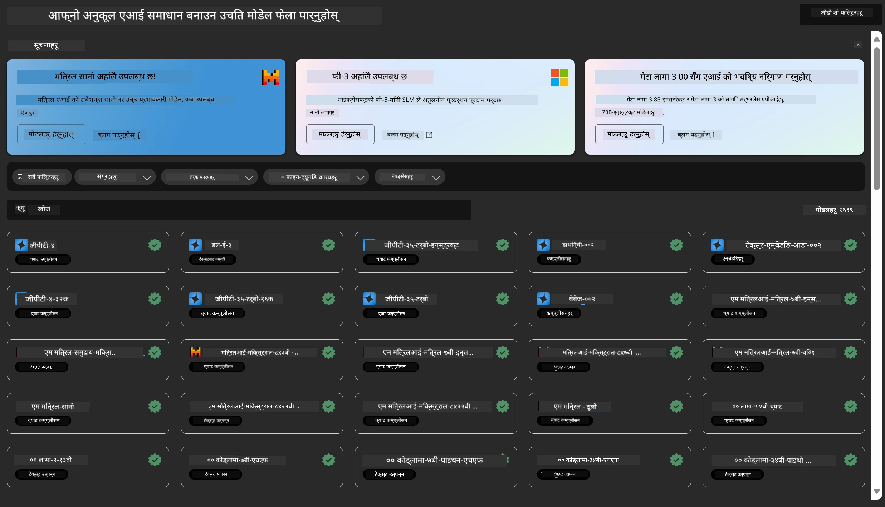
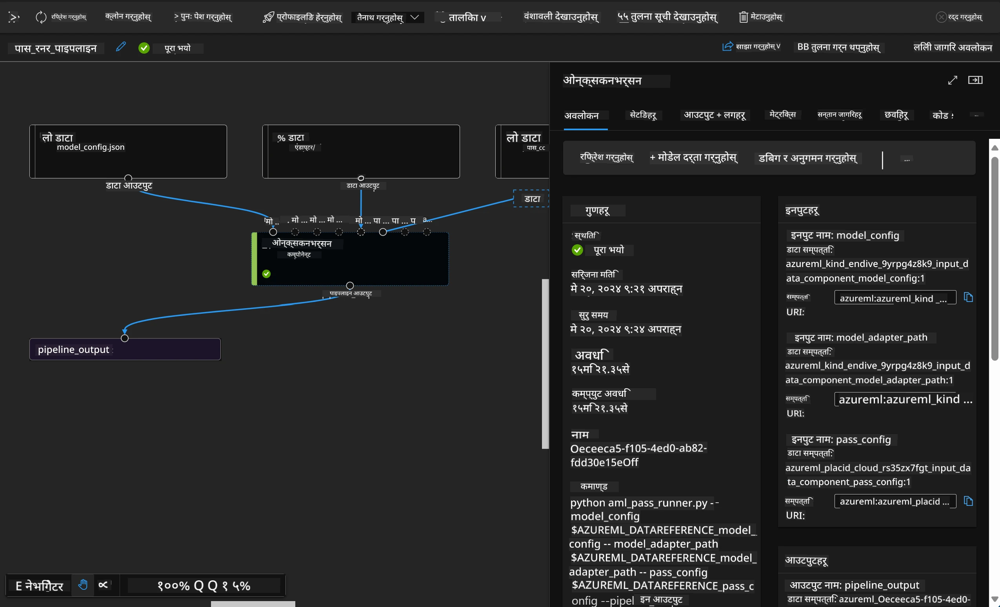

# **Azure Machine Learning सेवा परिचय**

[Azure Machine Learning](https://ml.azure.com?WT.mc_id=aiml-138114-kinfeylo) एक क्लाउड सेवा हो जसले मेशिन लर्निङ (ML) परियोजना जीवनचक्रलाई छिटो र प्रभावकारी रूपमा व्यवस्थापन गर्न मद्दत गर्छ।

ML पेशेवरहरू, डेटा वैज्ञानिकहरू, र इन्जिनियरहरूले यसलाई आफ्नो दैनिक कार्यप्रवाहमा प्रयोग गर्न सक्छन्:

- मोडेलहरू प्रशिक्षण र तैनाथ गर्न।
- मेशिन लर्निङ अपरेसनहरू (MLOps) व्यवस्थापन गर्न।
- तपाईं Azure Machine Learning मा मोडेल सिर्जना गर्न सक्नुहुन्छ वा PyTorch, TensorFlow, वा scikit-learn जस्ता खुला स्रोत प्लेटफर्मबाट बनेको मोडेल प्रयोग गर्न सक्नुहुन्छ।
- MLOps उपकरणहरूले मोडेलहरू अनुगमन, पुनःप्रशिक्षण, र पुनःतैनाथ गर्न मद्दत गर्छन्।

## Azure Machine Learning को लागि को हो?

**डेटा वैज्ञानिक र ML इन्जिनियरहरू**

उनीहरूले आफ्नो दैनिक कार्यलाई छिटो र स्वचालित बनाउन उपकरणहरू प्रयोग गर्न सक्छन्।  
Azure ML ले निष्पक्षता, व्याख्यात्मकता, ट्र्याकिङ, र अडिटयोग्यताको सुविधाहरू प्रदान गर्छ।

**एप्लिकेसन विकासकर्ता**

उनीहरूले मोडेलहरूलाई एप्लिकेसन वा सेवाहरूमा सहज रूपमा एकीकृत गर्न सक्छन्।

**प्लेटफर्म विकासकर्ता**

उनीहरूसँग Azure Resource Manager API हरूले समर्थित बलियो उपकरणहरूको पहुँच हुन्छ।  
यी उपकरणहरूले उन्नत ML उपकरणहरू निर्माण गर्न अनुमति दिन्छ।

**उद्यमहरू**

Microsoft Azure क्लाउडमा काम गर्ने उद्यमहरूले परिचित सुरक्षा र भूमिका-आधारित पहुँच नियन्त्रणको फाइदा उठाउँछन्।  
संरक्षित डेटा र विशिष्ट अपरेसनहरूमा पहुँच नियन्त्रण गर्न परियोजनाहरू सेटअप गर्न सक्छन्।

## टोलीका सबैका लागि उत्पादकता  
ML परियोजनाहरू प्रायः विभिन्न सीपहरू भएका टोलीको आवश्यकता पर्छ।

Azure ML ले तपाईंलाई निम्न कुराहरू गर्न सक्षम बनाउँछ:  
- साझा नोटबुक, कम्प्युटिङ स्रोतहरू, सर्भरलेस कम्प्युट, डेटा, र वातावरणहरू मार्फत टोलीसँग सहकार्य गर्न।  
- निष्पक्षता, व्याख्यात्मकता, ट्र्याकिङ, र अडिटयोग्यताको साथ मोडेल विकास गर्न, जसले लाइनिज र अडिट अनुपालन आवश्यकताहरू पूरा गर्छ।  
- ML मोडेलहरू छिटो र सजिलै ठूलो परिमाणमा तैनाथ गर्न, र MLOps मार्फत तिनीहरूलाई प्रभावकारी रूपमा व्यवस्थापन र शासन गर्न।  
- निर्मित शासन, सुरक्षा, र अनुपालनका साथ कहीं पनि मेशिन लर्निङ कार्यभार चलाउन।

## क्रस-कम्प्याटिबल प्लेटफर्म उपकरणहरू

ML टोलीमा कोही पनि आफ्नो मनपर्ने उपकरणहरू प्रयोग गरेर काम पूरा गर्न सक्छ।  
चाँडो प्रयोगहरू, हाइपरप्यारामिटर ट्यूनिङ, पाइपलाइन निर्माण, वा इन्फरेन्स व्यवस्थापन गरिरहनुभएको भए पनि, तपाईं परिचित इन्टरफेसहरू प्रयोग गर्न सक्नुहुन्छ:  
- Azure Machine Learning Studio  
- Python SDK (v2)  
- Azure CLI (v2)  
- Azure Resource Manager REST APIs  

मोडेलहरू सुधार्दै र विकास चक्रभरि सहकार्य गर्दै, तपाईं Azure Machine Learning स्टुडियो UI भित्र सम्पत्ति, स्रोतहरू, र मेट्रिक्स साझा र फेला पार्न सक्नुहुन्छ।

## **Azure ML मा LLM/SLM**

Azure ML ले धेरै LLM/SLM सम्बन्धित कार्यहरू थपेको छ, जसले LLMOps र SLMOps लाई संयोजन गरेर उद्यम-व्यापी जेनेरेटिभ कृत्रिम बुद्धिमत्ता प्रविधि प्लेटफर्म सिर्जना गरेको छ।

### **मोडेल क्याटलग**

उद्यम प्रयोगकर्ताहरूले मोडेल क्याटलग मार्फत विभिन्न व्यापारिक परिदृश्य अनुसार फरक मोडेलहरू तैनाथ गर्न सक्छन्, र उद्यम विकासकर्ता वा प्रयोगकर्ताहरूलाई सेवा रूपमा मोडेल उपलब्ध गराउन सक्छन्।

Azure Machine Learning स्टुडियोमा मोडेल क्याटलग जेनेरेटिभ AI एप्लिकेसनहरू निर्माण गर्न सक्षम बनाउने विभिन्न मोडेलहरू पत्ता लगाउन र प्रयोग गर्न केन्द्र हो।  
मोडेल क्याटलगमा Azure OpenAI सेवा, Mistral, Meta, Cohere, Nvidia, Hugging Face लगायतका मोडेल प्रदायकहरूका सयौं मोडेलहरू छन्, जसमा Microsoft द्वारा प्रशिक्षित मोडेलहरू पनि समावेश छन्।  
Microsoft बाहेकका प्रदायकका मोडेलहरू Microsoft का उत्पादन सर्तहरू अनुसार गैर-Microsoft उत्पादनहरू हुन् र मोडेलसँगै दिइएका सर्तहरूमा आधारित हुन्छन्।

### **जॉब पाइपलाइन**

मेशिन लर्निङ पाइपलाइनको मुख्य उद्देश्य पूर्ण मेशिन लर्निङ कार्यलाई बहु-चरण कार्यप्रवाहमा विभाजन गर्नु हो।  
प्रत्येक चरण एक व्यवस्थापनयोग्य कम्पोनेन्ट हो जुन व्यक्तिगत रूपमा विकास, अनुकूलन, कन्फिगर, र स्वचालित गर्न सकिन्छ।  
चरणहरू राम्रोसँग परिभाषित इन्टरफेसहरू मार्फत जडित हुन्छन्।  
Azure Machine Learning पाइपलाइन सेवा पाइपलाइन चरणहरू बीचका सबै निर्भरताहरू स्वचालित रूपमा समन्वय गर्छ।

SLM / LLM को फाइन-ट्यूनिङमा, हामी पाइपलाइन मार्फत हाम्रो डेटा, प्रशिक्षण, र जेनेरेशन प्रक्रियाहरू व्यवस्थापन गर्न सक्छौं।

### **प्रम्प्ट फ्लो**

Azure Machine Learning प्रम्प्ट फ्लो प्रयोग गर्दा हुने फाइदाहरू  
Azure Machine Learning प्रम्प्ट फ्लोले प्रयोगकर्ताहरूलाई विचारदेखि प्रयोगसम्म र अन्ततः उत्पादन-तयार LLM आधारित एप्लिकेसनहरूमा रूपान्तरण गर्न मद्दत गर्ने विभिन्न फाइदाहरू प्रदान गर्छ:

**प्रम्प्ट इन्जिनियरिङमा चुस्ती**

- अन्तरक्रियात्मक लेखन अनुभव: Azure Machine Learning प्रम्प्ट फ्लोले फ्लोको संरचनाको दृश्यात्मक प्रतिनिधित्व प्रदान गर्छ, जसले प्रयोगकर्ताहरूलाई आफ्ना परियोजनाहरू सजिलै बुझ्न र नेभिगेट गर्न मद्दत गर्छ। यसले नोटबुक-जस्तो कोडिङ अनुभव पनि दिन्छ जसले फ्लो विकास र डिबगिङलाई प्रभावकारी बनाउँछ।  
- प्रम्प्ट ट्यूनिङका लागि भेरियन्टहरू: प्रयोगकर्ताहरूले धेरै प्रम्प्ट भेरियन्टहरू सिर्जना र तुलना गर्न सक्छन्, जसले पुनरावृत्तिमूलक सुधार प्रक्रियालाई सहज बनाउँछ।  
- मूल्याङ्कन: निर्मित मूल्याङ्कन फ्लोहरूले प्रयोगकर्ताहरूलाई आफ्ना प्रम्प्ट र फ्लोहरूको गुणस्तर र प्रभावकारिता मूल्याङ्कन गर्न सक्षम बनाउँछ।  
- व्यापक स्रोतहरू: Azure Machine Learning प्रम्प्ट फ्लोमा निर्मित उपकरणहरू, नमूनाहरू, र टेम्प्लेटहरूको पुस्तकालय छ, जसले विकासको सुरुवात बिन्दुको रूपमा काम गर्छ, सिर्जनशीलता उत्प्रेरित गर्छ र प्रक्रिया छिटो बनाउँछ।

**LLM आधारित एप्लिकेसनहरूको लागि उद्यम तयारी**

- सहकार्य: Azure Machine Learning प्रम्प्ट फ्लोले टोली सहकार्यलाई समर्थन गर्छ, जसले धेरै प्रयोगकर्ताहरूलाई प्रम्प्ट इन्जिनियरिङ परियोजनाहरूमा सँगै काम गर्न, ज्ञान साझा गर्न, र संस्करण नियन्त्रण कायम राख्न अनुमति दिन्छ।  
- सबै-एक प्लेटफर्म: Azure Machine Learning प्रम्प्ट फ्लोले विकास, मूल्याङ्कनदेखि तैनाथ र अनुगमनसम्म सम्पूर्ण प्रम्प्ट इन्जिनियरिङ प्रक्रियालाई सरल बनाउँछ। प्रयोगकर्ताहरूले सजिलै आफ्ना फ्लोहरू Azure Machine Learning अन्तबिन्दुहरूका रूपमा तैनाथ गर्न र वास्तविक समयमा प्रदर्शन अनुगमन गर्न सक्छन्, जसले उत्तम सञ्चालन र निरन्तर सुधार सुनिश्चित गर्छ।  
- Azure Machine Learning उद्यम तयारी समाधानहरू: प्रम्प्ट फ्लोले Azure Machine Learning का बलियो उद्यम तयारी समाधानहरू प्रयोग गर्छ, जसले सुरक्षित, स्केलेबल, र भरपर्दो आधार प्रदान गर्छ फ्लोहरूको विकास, प्रयोग, र तैनाथीकरणका लागि।

Azure Machine Learning प्रम्प्ट फ्लोको साथ, प्रयोगकर्ताहरूले आफ्नो प्रम्प्ट इन्जिनियरिङ चुस्तीलाई मुक्त गर्न, प्रभावकारी रूपमा सहकार्य गर्न, र सफल LLM आधारित एप्लिकेसन विकास र तैनाथीकरणका लागि उद्यम-स्तरका समाधानहरू उपयोग गर्न सक्छन्।

Azure ML को कम्प्युटिङ शक्ति, डेटा, र विभिन्न कम्पोनेन्टहरूलाई संयोजन गरेर, उद्यम विकासकर्ताहरूले सजिलै आफ्नै कृत्रिम बुद्धिमत्ता एप्लिकेसनहरू निर्माण गर्न सक्छन्।

**अस्वीकरण**:  
यो दस्तावेज AI अनुवाद सेवा [Co-op Translator](https://github.com/Azure/co-op-translator) प्रयोग गरी अनुवाद गरिएको हो। हामी शुद्धताका लागि प्रयासरत छौं, तर कृपया ध्यान दिनुहोस् कि स्वचालित अनुवादमा त्रुटि वा अशुद्धता हुन सक्छ। मूल दस्तावेज यसको मूल भाषामा नै अधिकारिक स्रोत मानिनु पर्छ। महत्वपूर्ण जानकारीका लागि व्यावसायिक मानव अनुवाद सिफारिस गरिन्छ। यस अनुवादको प्रयोगबाट उत्पन्न कुनै पनि गलतफहमी वा गलत व्याख्याका लागि हामी जिम्मेवार छैनौं।